## Q1 HERTZIAN CONTACT STRESS

## PART A. LARGE ANGLE PENDULUM

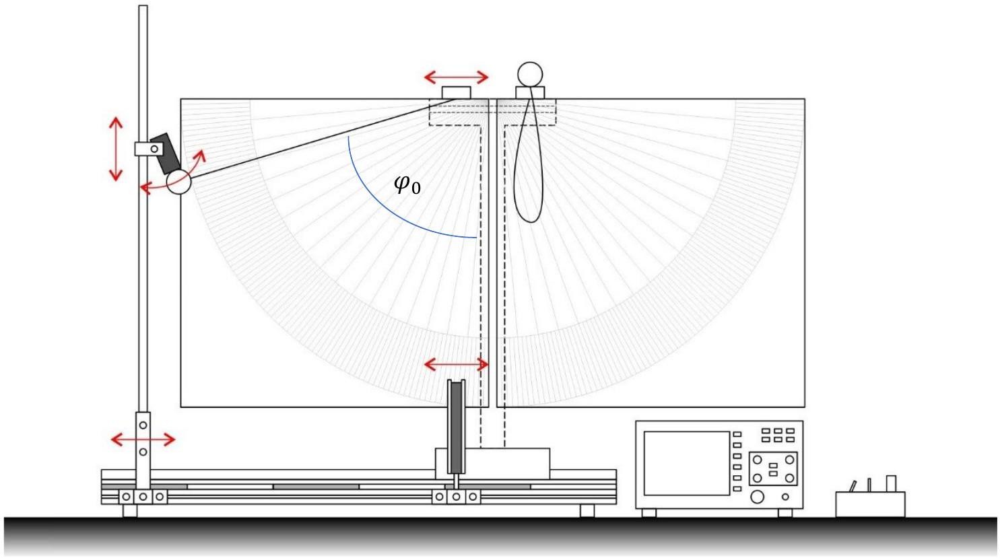

## A.1. $\Delta \boldsymbol { t }$ and $\boldsymbol { v }$

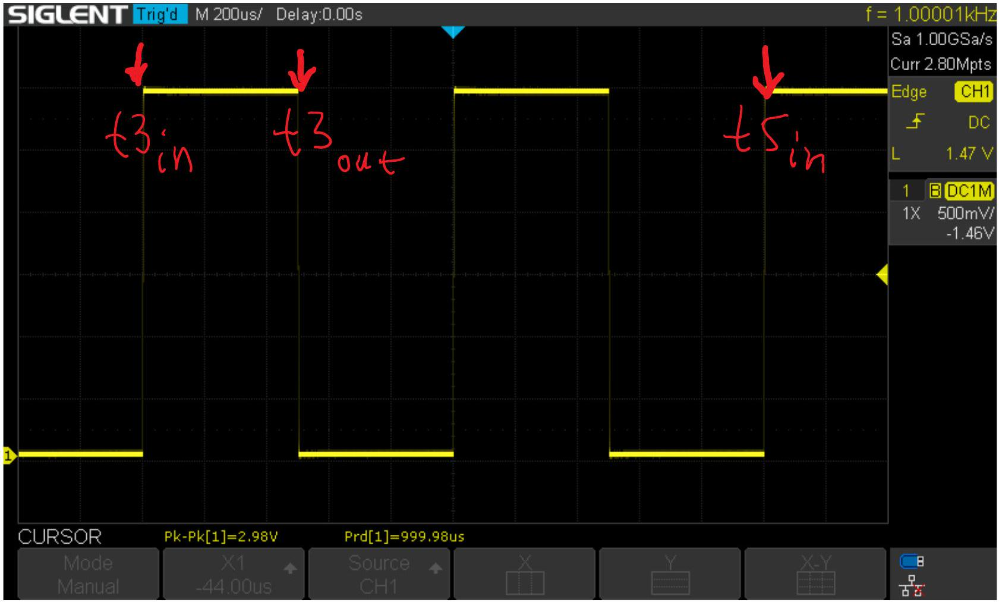

Experiment №1

This record table includes both measurements A1 ( $\Delta t$ - time required for the fall to pass through the photogate) and B1( $T$ - period of oscillation) for each angle $\varphi _ { 0 }$, in a single table, students can save time by doing both measurements at same angle.

Table №1

| № | $\varphi _ { 0 } , ^ { \circ }$ | $\sin \frac { \varphi _ { 0 } } { 2 }$ | $t 3 _ { \text {in } } , \mathrm { s }$ | $t 3 _ { \text {out } } , \mathrm { s }$ | $t 5 _ { i n } , \mathrm {~s}$ | $\Delta t , \mathrm {~s}$ | $\frac { 1 } { \Delta t } , \mathrm {~s} ^ { - 1 }$ | $\begin{gathered} T , \mathrm {~s} \\ t 5 _ { i n } - t 3 _ { i n } \\ \hline \end{gathered}$ | $v , \mathrm {~m} / \mathrm { s }$ |
| :--- | :--- | :--- | :--- | :--- | :--- | :--- | :--- | :--- | :--- |
| 1 | 77.0 | 0.6188 | 1.257570 | 1.272170 | 2.51094 | 0.01460 | 68.49 | 1.25337 | 2.174 |
| 2 | 70.0 | 0.5701 | 1.227325 | 1.243150 | 2.45284 | 0.01583 | 63.19 | 1.22552 | 2.006 |
| 3 | 65.5 | 0.5376 | 1.218315 | 1.234875 | 2.43444 | 0.01656 | 60.39 | 1.21612 | 1.917 |
| 4 | 60.5 | 0.5006 | 1.203485 | 1.221420 | 2.40432 | 0.01794 | 55.76 | 1.20083 | 1.770 |
| 5 | 56.0 | 0.4664 | 1.188010 | 1.207500 | 2.37514 | 0.01949 | 51.31 | 1.18713 | 1.629 |
| 6 | 48.0 | 0.4041 | 1.170770 | 1.192860 | 2.34031 | 0.02209 | 45.27 | 1.16954 | 1.437 |
| 7 | 41.5 | 0.3519 | 1.158360 | 1.183990 | 2.31476 | 0.02563 | 39.02 | 1.15640 | 1.238 |
| 8 | 36.0 | 0.3069 | 1.147050 | 1.176660 | 2.29352 | 0.02961 | 33.77 | 1.14647 | 1.072 |
| 9 | 31.0 | 0.2654 | 1.140020 | 1.174520 | 2.27940 | 0.03450 | 28.99 | 1.13938 | 0.9200 |
| 10 | 24.5 | 0.2107 | 1.135300 | 1.179100 | 2.26742 | 0.04380 | 22.83 | 1.13212 | 0.7246 |
| 11 | 19.0 | 0.1639 | 1.115780 | 1.171840 | 2.24334 | 0.05606 | 17.84 | 1.12756 | 0.5662 |
| 12 | 14.9 | 0.1288 | 1.100050 | 1.174300 | 2.22485 | 0.07425 | 13.47 | 1.12480 | 0.4275 |
| 13 | 9.5 | 0.0822 | 1.107750 | 1.221600 | 2.23065 | 0.11385 | 8.78 | 1.12290 | 0.2789 |

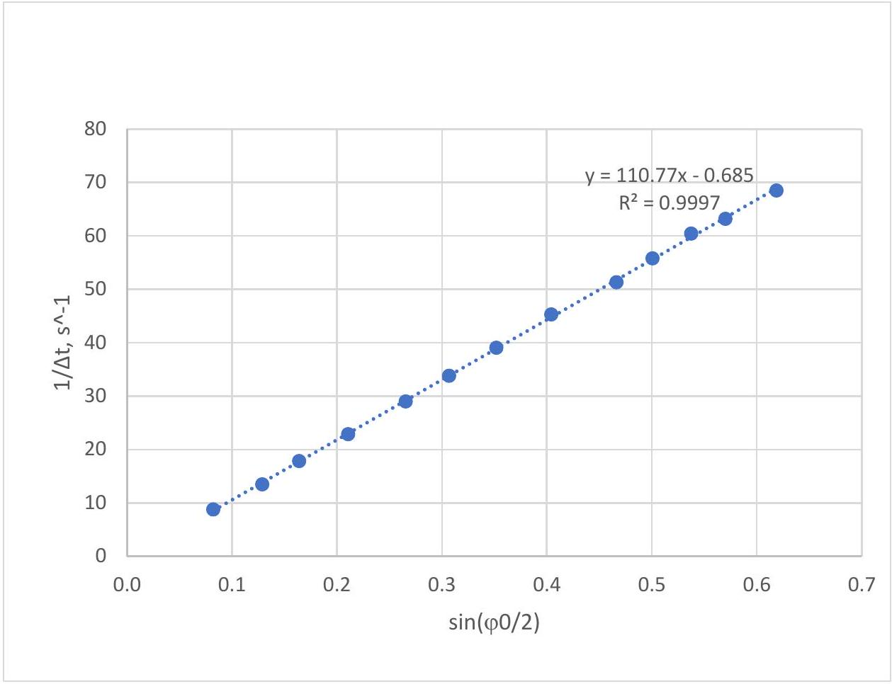
graph №1: $\frac { 1 } { \Delta t }$ vs $\sin \frac { \varphi _ { 0 } } { 2 }$

$$
\begin{equation*}
\operatorname { grad } _ { 1 / \Delta t } = 110.77 \mathrm {~s} ^ { - 1 } \tag{1}
\end{equation*}
$$

Experiment №1
English (Official)
A.2. Speed of ball: $\boldsymbol { v } = k _ { \boldsymbol { v } } \sin \frac { \varphi _ { 0 } } { 2 }$

$$
\frac { m v ^ { 2 } } { 2 } = m g l \left( 1 - \cos \varphi _ { 0 } \right) = 2 m g l \sin ^ { 2 } \frac { \varphi _ { 0 } } { 2 }
$$

$$
\begin{gather*}
v = 2 \sqrt { g l } \sin \frac { \varphi _ { 0 } } { 2 }  \tag{2}\\
v = \frac { d } { \Delta t } \\
\frac { 1 } { \Delta t } = 2 \frac { \sqrt { g l } } { d } \sin \frac { \varphi _ { 0 } } { 2 }  \tag{3}\\
\operatorname { grad } _ { 1 / \Delta t } = 2 \frac { \sqrt { g l } } { d } = \frac { g T _ { 0 } } { \pi d } = 110.77 \mathrm {~s} ^ { - 1 }  \tag{4}\\
d = 3.175 * 10 ^ { - 2 } \mathrm {~m} \\
v = k _ { v } \sin \frac { \varphi _ { 0 } } { 2 }  \tag{5}\\
k _ { v } = 3.517 \frac { \mathrm {~m} } { \mathrm {~s} }
\end{gather*}
$$

PART B. PERIOD OF THE OSCILLATION
B.1. PERIOD OF OSCILLATION: $\boldsymbol { T } _ { \mathbf { 0 } } , \boldsymbol { \alpha } , \boldsymbol { \beta }$

Table 2. Measurement at smaller angles

| Nº | $\varphi _ { 0 } , ^ { \circ }$ | $\sin \frac { \varphi _ { 0 } } { 2 }$ | $\sin ^ { 2 } \frac { \varphi _ { 0 } } { 2 }$ | $t 3 _ { \text {in } } , \mathrm { s }$ | $t 3 _ { \text {out } } , \mathrm { s }$ | $t 5 _ { i n } , \mathrm {~s}$ | $T , \mathrm {~s}$ | $\Delta t , \mathrm {~s}$ | $\frac { 1 } { \Delta t ^ { \prime } }$ $\mathrm { s } ^ { - 1 }$ |
| :--- | :--- | :--- | :--- | :--- | :--- | :--- | :--- | :--- | :--- |
| 1 | 35.0 | 0.3007 | 0.09042 | 1.153908 | 1.183840 | 2.307440 | 1.1535 | 0.02993 | 33.41 |
| 2 | 32.0 | 0.2756 | 0.07598 | 1.148388 | 1.181756 | 2.296584 | 1.1482 | 0.03337 | 29.97 |
| 3 | 29.0 | 0.2504 | 0.06269 | 1.138780 | 1.176372 | 2.282468 | 1.1437 | 0.03759 | 26.60 |
| 4 | 26.0 | 0.2250 | 0.05060 | 1.140252 | 1.182736 | 2.280460 | 1.1402 | 0.04248 | 23.54 |
| 5 | 23.0 | 0.1994 | 0.03975 | 1.133444 | 1.181036 | 2.271252 | 1.1378 | 0.04759 | 21.01 |
| 6 | 20.0 | 0.1736 | 0.03015 | 1.117848 | 1.175064 | 2.252636 | 1.1348 | 0.05722 | 17.48 |
| 7 | 18.0 | 0.1564 | 0.02447 | 1.133656 | 1.197872 | 2.267360 | 1.1337 | 0.06422 | 15.57 |
| 8 | 16.0 | 0.1392 | 0.01937 | 1.128688 | 1.204768 | 2.260812 | 1.1321 | 0.07608 | 13.14 |
| 9 | 14.0 | 0.1219 | 0.01485 | 1.131244 | 1.232416 | 2.262348 | 1.1311 | 0.10117 | 9.884 |
| 10 | 11.0 | 0.0958 | 0.00919 | 1.130564 | 1.269412 | 2.260456 | 1.1299 | 0.13885 | 7.202 |
| 11 | 7.0 | 0.0610 | 0.00373 | 1.127648 | 1.338152 | 2.255932 | 1.1283 | 0.21050 | 4.751 |

| Experiment №1 |  | English (Official) |
| :--- | :--- | :--- |
|  | 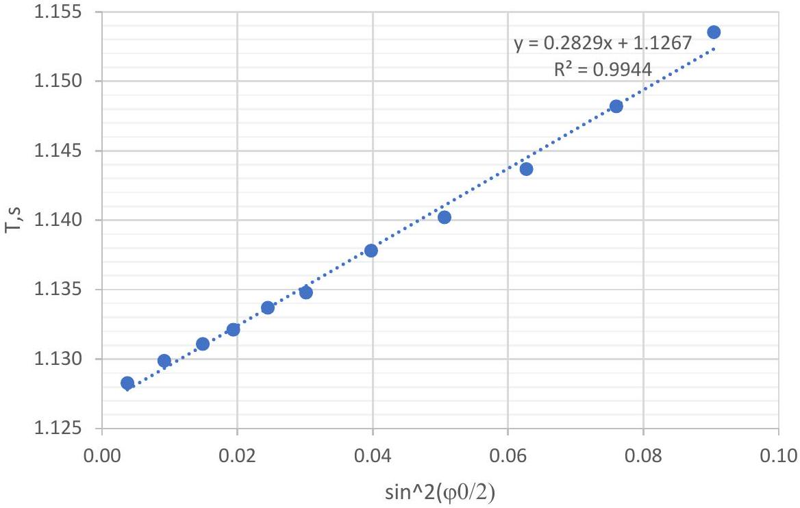 |  |

$$
\begin{gathered}
\text { graph №2: } T \text { vs } \sin ^ { 2 } \frac { \varphi _ { 0 } } { 2 } \\
\sin ^ { 4 } \frac { 30 ^ { \circ } } { 2 } = 4.5 * 10 ^ { - 3 } \ll 1 \\
T \approx T _ { 0 } \left( 1 + \alpha * \sin ^ { 2 } \frac { \varphi _ { 0 } } { 2 } \right) \\
T _ { 0 } = 1.1267 \mathrm {~s} \\
\alpha T _ { 0 } = 0.2829 \mathrm {~s} \\
\alpha = \frac { 0.2829 } { 1.1267 } = 0.251 \\
\alpha _ { \text {theor } } = \frac { 1 } { 4 } = 0.250 \\
\varepsilon _ { \alpha } < 1 \%
\end{gathered}
$$

Experiment №1
Table 3. Measurement at higher angles

| № | $\varphi _ { 0 } , { } ^ { \circ }$ | $t 3 _ { i n } , \mathrm {~s}$ | $t 5 _ { i n } , \mathrm {~s}$ | $\sin \frac { \varphi _ { 0 } } { 2 }$ | $\sin ^ { 2 } \frac { \varphi _ { 0 } } { 2 }$ | $X = \sin ^ { 4 } \frac { \varphi _ { 0 } } { 2 }$ | $T = t 5 _ { i n } - t 3 _ { i n } , \mathrm {~s}$ | $Y$ |
| :--- | :--- | :--- | :--- | :--- | :--- | :--- | :--- | :--- |
| 1 | 77.0 | 1.257570 | 2.50900 | 0.6188 | 0.3829 | 0.1466 | 1.25143 | 0.0150 |
| 2 | 70.0 | 1.227325 | 2.45380 | 0.5701 | 0.3250 | 0.1056 | 1.22648 | 0.0073 |
| 3 | 65.5 | 1.218315 | 2.43430 | 0.5376 | 0.2890 | 0.08353 | 1.21599 | 0.0070 |
| 4 | 60.5 | 1.203485 | 2.40432 | 0.5006 | 0.2506 | 0.06279 | 1.20083 | 0.0031 |
| 5 | 56.0 | 1.188010 | 2.37514 | 0.4664 | 0.2176 | 0.04734 | 1.18713 | -0.0008 |
| 6 | 48.0 | 1.170770 | 2.34031 | 0.4041 | 0.1633 | 0.02665 | 1.16954 | -0.0028 |
| 7 | 41.5 | 1.158360 | 2.31476 | 0.3519 | 0.1238 | 0.01534 | 1.15640 | -0.0046 |
| 8 | 36.0 | 1.147050 | 2.29352 | 0.3069 | 0.09420 | 0.00887 | 1.14647 | -0.0060 |
| 9 | 31.0 | 1.140020 | 2.27940 | 0.2654 | 0.07044 | 0.00496 | 1.13938 | -0.0064 |
| 10 | 24.5 | 1.135300 | 2.26742 | 0.2107 | 0.04440 | 0.00197 | 1.13212 | -0.0063 |
| 11 | 19.0 | 1.115780 | 2.24334 | 0.1639 | 0.02686 | 0.000722 | 1.12756 | -0.0060 |
| 12 | 14.9 | 1.100050 | 2.22485 | 0.1288 | 0.01658 | 0.000275 | 1.12480 | -0.0058 |
| 13 | 9.5 | 1.107750 | 2.23065 | 0.0822 | 0.00676 | 0.000046 | 1.12290 | -0.0051 |

$$
\begin{gathered}
T = T _ { 0 } \left( 1 + \alpha * \sin ^ { 2 } \frac { \varphi _ { 0 } } { 2 } + \beta * \sin ^ { 4 } \frac { \varphi _ { 0 } } { 2 } \right) \\
Y = \frac { T } { T _ { 0 } } - 1 - \alpha * \sin ^ { 2 } \frac { \varphi _ { 0 } } { 2 } ; X = \sin ^ { 4 } \frac { \varphi _ { 0 } } { 2 } \\
Y = \beta X
\end{gathered}
$$

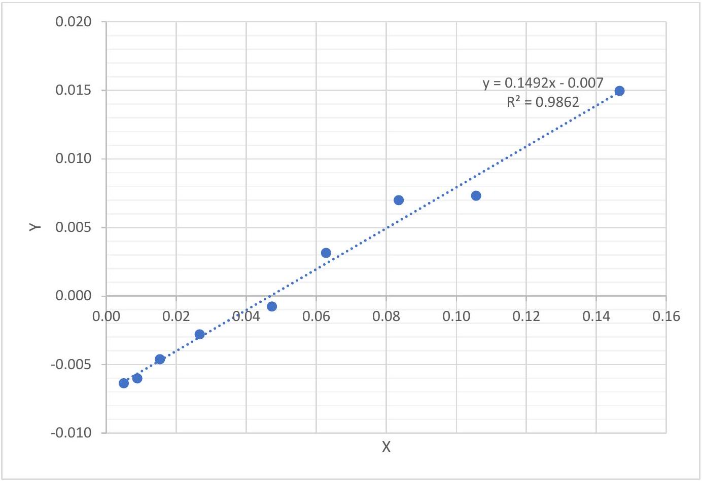

## S1-6

Experiment №1

$$
\begin{gathered}
\beta = 0.149 \\
\beta _ { \text {theor } } = \frac { 9 } { 64 } = 0.141 \\
\varepsilon _ { \beta } = 6 \%
\end{gathered}
$$

B. 2 Free fall acceleration in UB: $\boldsymbol { g } _ { \text {UB } }$

$$
\begin{gathered}
d = 31.75 \mathrm {~mm} \\
\operatorname { grad } _ { 1 / \Delta t } = 2 \frac { \sqrt { g l } } { d } = \frac { g T _ { 0 } } { \pi d } = 110.77 \mathrm {~s} ^ { - 1 } \quad \text { from A.1 (4) } \\
T _ { 0 } = 1.1267 \mathrm {~s} \\
g _ { \text {exp } } = \frac { \pi d * \operatorname { grad } _ { 1 / \Delta t } } { T _ { 0 } } = \frac { 3.142 * 3.175 * 10 ^ { - 2 } * 110.77 } { 1.1267 } = 9.808 \frac { \mathrm {~m} } { \mathrm {~s} ^ { 2 } } \\
g _ { U B } = 9.804 \frac { \mathrm {~m} } { \mathrm {~s} ^ { 2 } } \\
\varepsilon _ { g } < 1 \%
\end{gathered}
$$

## S1-7

Experiment №1
English (Official)

## PART C: BEHAVIORS OF THE COLLISIONS

C1
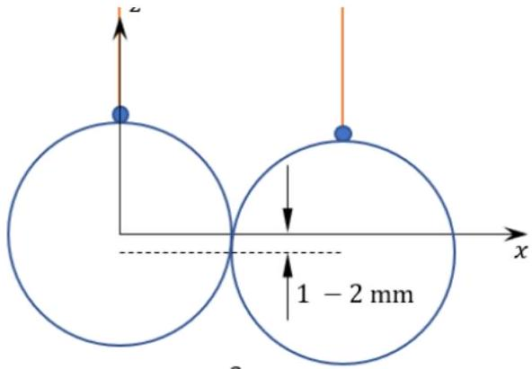

a.
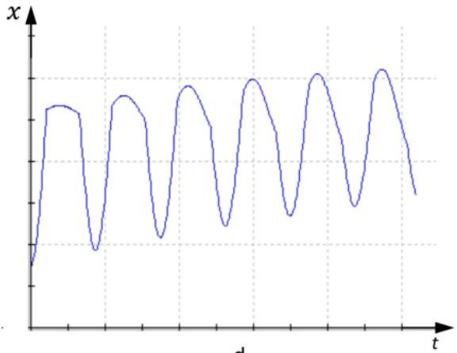

d.

C2
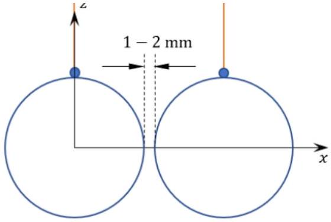

b.
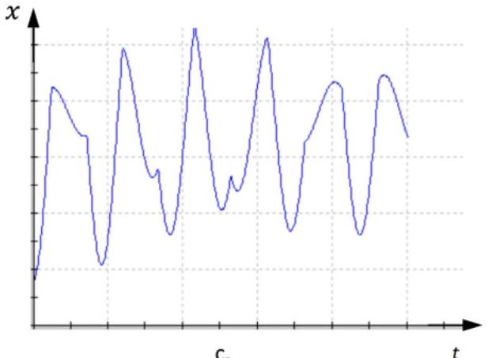

C3
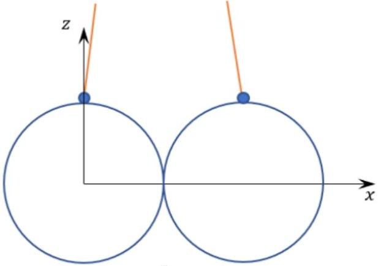

c.
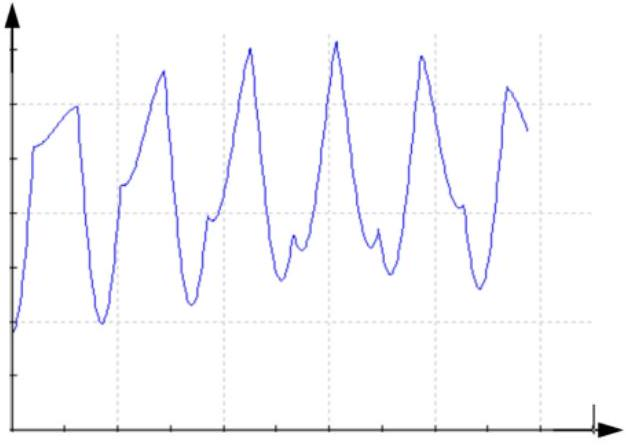

e.

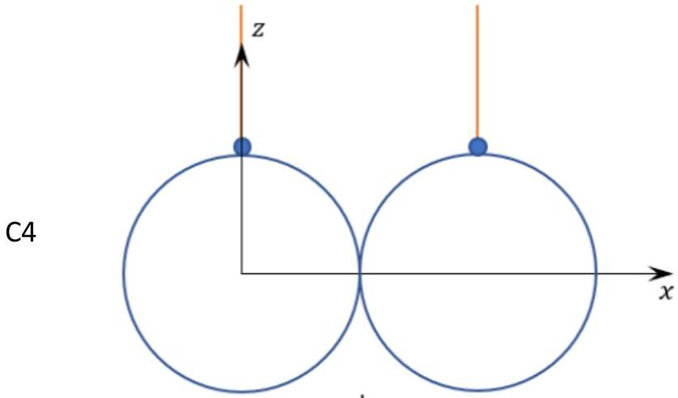
d.

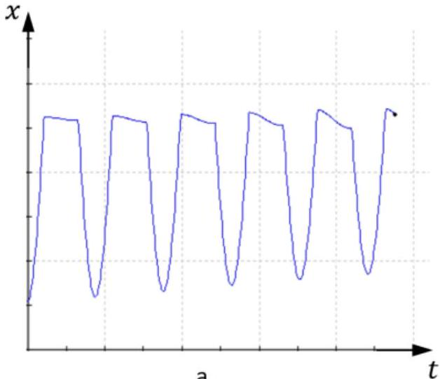

Experiment №1
PART D: TIME OF COLLISIONS
D. 1 Collision time equation: dimensional analysis

$$
\begin{equation*}
\tau = A * M ^ { \varepsilon _ { 1 } } E ^ { \varepsilon _ { 2 } } R ^ { \varepsilon _ { 3 } } v ^ { \varepsilon _ { 4 } } \tag{6}
\end{equation*}
$$

$M$ - mass; $E$ - Young's modulus; $R$ - radius; $v$ - speed; $A$ - dimensionless constant

$$
\begin{gathered}
\tau = M ^ { \varepsilon _ { 1 } } M ^ { \varepsilon _ { 2 } } L ^ { - \varepsilon _ { 2 } } T ^ { - 2 \varepsilon _ { 2 } } L ^ { \varepsilon _ { 3 } } L ^ { \varepsilon _ { 4 } } T ^ { - \varepsilon _ { 4 } } \\
\left\{ \begin{array} { c }
M : 0 = \varepsilon _ { 1 } + \varepsilon _ { 2 } \\
L : 0 = - \varepsilon _ { 2 } + \varepsilon _ { 3 } + \varepsilon _ { 4 } \\
T : 1 = - 2 \varepsilon _ { 2 } - \varepsilon _ { 4 }
\end{array} \right.
\end{gathered}
$$

Three equations, Four exponents $\left( \varepsilon _ { 1 } , \varepsilon _ { 2 } , \varepsilon _ { 3 } , \varepsilon _ { 4 } \right)$. You have to determine some exponent in an experimental way.
D. 2 Exponent of speed

$$
\tau = \text { const } * v ^ { \varepsilon _ { 4 } }
$$

For expression (5)

$$
\begin{aligned}
v & = k _ { v } \sin \frac { \varphi _ { 0 } } { 2 } \\
k _ { v } & = 3.517 \frac { \mathrm {~m} } { \mathrm {~s} }
\end{aligned}
$$

$m = 131.48 \mathrm {~g} ; d = 31.73 \mathrm {~mm} ; l = 29.7 \mathrm {~cm}$; sound speed in steel $c = \sqrt { \frac { E ^ { \prime } } { \rho } } = 5180 \frac { \mathrm {~m} } { \mathrm {~s} }$

Table 4. Time of collisions as a function of speed
| $\varphi _ { 0 } , ^ { \circ }$ | corrected | $v , \mathrm {~m} / \mathrm { s }$ | $v _ { 1 c } , \mathrm {~m} / \mathrm { s }$ | $\tau , \mu \mathrm { s }$ | $\ln \left( v _ { 1 c } , \mathrm {~m} / \mathrm { s } \right)$ | $\operatorname { Ln } ( \tau , \mu \mathrm { s } )$ |
| :--- | :--- | :--- | :--- | :--- | :--- | :--- |
| 70.0 | 69.98 | 1.96 | 0.978 | 81.7 | -0.0227 | 4.403 |
| 52.0 | 51.99 | 1.49 | 0.747 | 87.14 | -0.2916 | 4.468 |
| 37.0 | 36.99 | 1.08 | 0.541 | 93.58 | -0.6148 | 4.539 |
| 29.1 | 29.09 | 0.86 | 0.428 | 98.47 | -0.8483 | 4.590 |
| 21.2 | 21.19 | 0.63 | 0.313 | 104.00 | -1.1600 | 4.644 |
| 15.0 | 15.00 | 0.44 | 0.222 | 110.50 | -1.5030 | 4.705 |
| 12.0 | 12.00 | 0.36 | 0.178 | 115.50 | -1.7252 | 4.749 |
| 9.0 | 9.00 | 0.27 | 0.134 | 123.40 | -2.0121 | 4.815 |
| 7.0 | 7.00 | 0.21 | 0.104 | 128.90 | -2.2630 | 4.859 |
| 6.0 | 6.00 | 0.18 | 0.089 | 131.80 | -2.4169 | 4.881 |
| 4.0 | 4.00 | 0.12 | 0.059 | 141.00 | -2.8222 | 4.949 |
| 3.0 | 3.00 | 0.09 | 0.045 | 149.00 | -3.1098 | 5.004 |
| 1.0 | 1.0 | 0.03 | 0.015 | 207.00 | -4.2083 | 5.333 |

$$
v _ { 1 c } = \frac { v } { 2 }
$$

Experiment №1

$$
\begin{gathered}
\varepsilon _ { 4 } = - 0.193 ( 3.5 \% ) \\
\varepsilon _ { 4 t h e o r } = - 0.200
\end{gathered}
$$

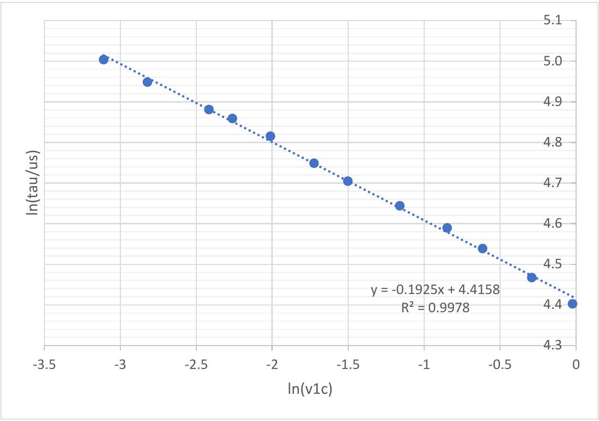
graph №4: $\tau$ vs $v _ { 1 c }$
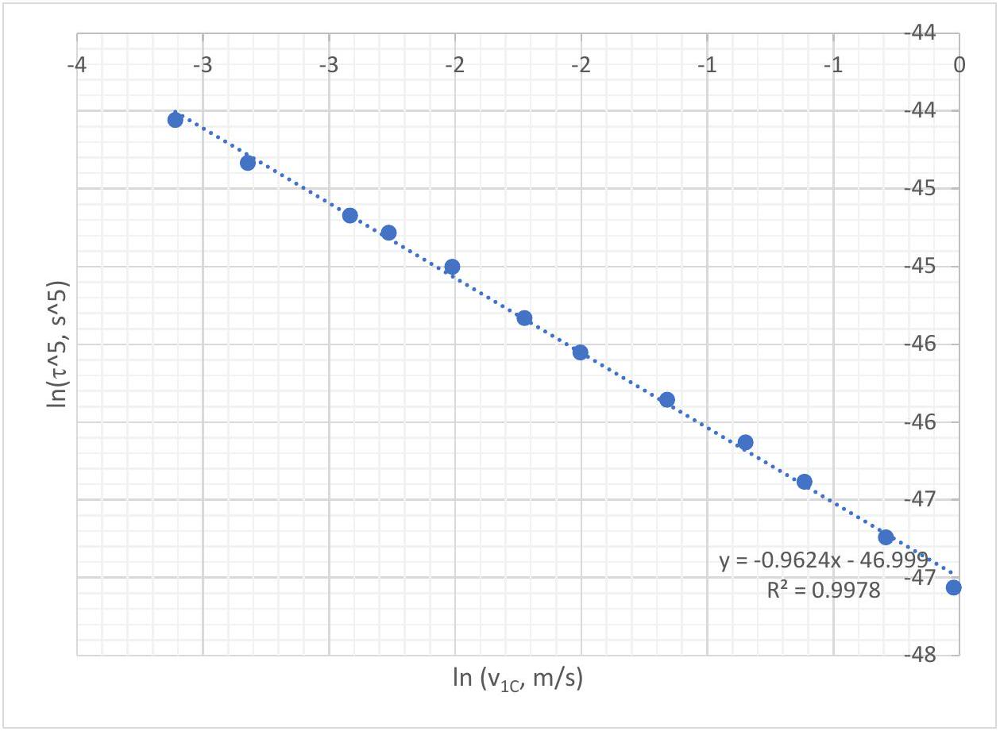

$$
\varepsilon _ { 4 } = - 0.96 / 5 \approx - 1 / 5 ( \text { rel.error } = 4 \% )
$$

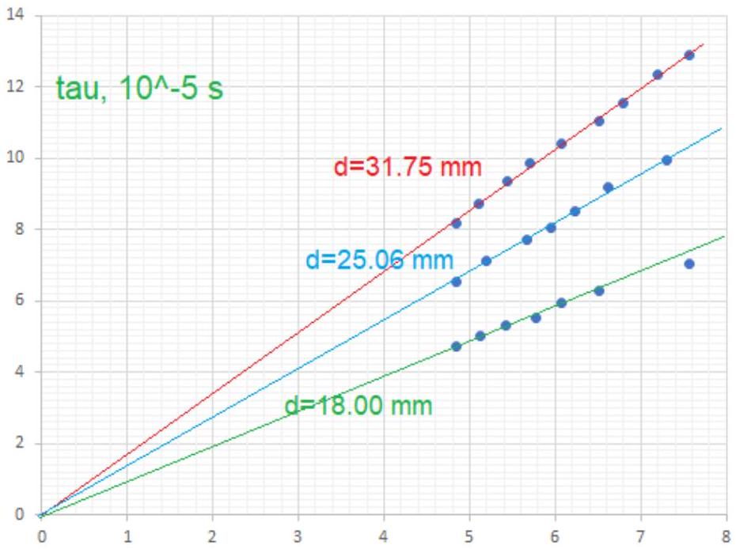
$( \mathrm { c } / \mathrm { v } ) ^ { \wedge } 1 / 5$
graph №5: $\tau$ vs $\left( \frac { c } { v } \right) ^ { \frac { 1 } { 5 } }$ at different diameters of balls

$$
\begin{aligned}
& \text { grad1: } \text { grad2: } \text { grad } 3 = 12 : 9.5 : 6.8 = 1.76 : 1.40 : 1 \\
& \quad d _ { 1 } : d _ { 2 } : d _ { 3 } = 31.75 : 25.06 : 18.00 = 1.76 : 1.40 : 1
\end{aligned}
$$

Result:

$$
\tau \sim \left( R _ { 1 } + R _ { 2 } \right)
$$

D. 3 Solution of exponents:

$$
\begin{gathered}
\varepsilon _ { 1 } = \frac { 2 } { 5 } \\
\varepsilon _ { 2 } = - \frac { 2 } { 5 } \\
\varepsilon _ { 3 } = - \frac { 1 } { 5 } \\
\varepsilon _ { 4 } = - \frac { 1 } { 5 } \\
\tau ^ { 5 } \sim M ^ { 2 } E ^ { - 2 } R ^ { - 1 } v ^ { - 1 } \\
\tau ^ { 5 } \sim \frac { M ^ { 2 } } { E ^ { 2 } R v }
\end{gathered}
$$

## S1-11

Experiment №1

$$
\begin{gathered}
\tau ^ { 5 } \sim \frac { \rho ^ { 2 } R ^ { 6 } } { E ^ { 2 } R v } \sim \frac { R ^ { 6 } } { c ^ { 4 } R v } \sim \frac { R ^ { 5 } } { c ^ { 5 } } * \frac { c } { v } \\
\tau \sim \frac { R _ { 1 } + R _ { 2 } } { c } * \left( \frac { c } { v } \right) ^ { \frac { 1 } { 5 } } = X
\end{gathered}
$$

Experiment №1
D. 4 Numerical value of $\boldsymbol { A }$ in (6)

$$
m = 131.48 \mathrm {~g} ; d = 31.73 \mathrm {~mm} ; l = 29.7 \mathrm {~cm} ; c = 5180 \frac { \mathrm {~m} } { \mathrm {~s} }
$$

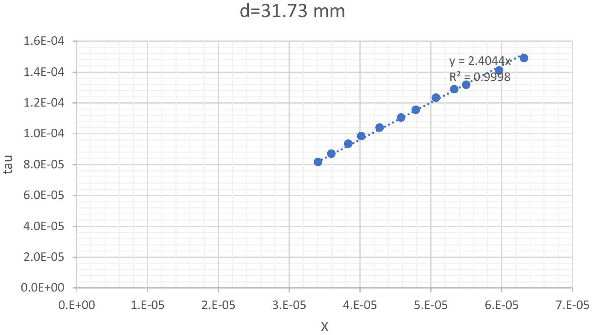
graph №6: $\tau$ vs $X$

$$
\begin{gather*}
A _ { \exp } = 2.40 \\
\tau = 2.40 \frac { R _ { 1 } + R _ { 2 } } { c } * \left( \frac { c } { v } \right) ^ { \frac { 1 } { 5 } } \tag{\(\prime\)}
\end{gather*}
$$

Experiment №1

PART E: THE PARAMETERS OF HERTZ DEFORMATION

Table 5. Force, Hertz Deflection, Hertz Radius, Hertz Pressure.
| Balls | $\varphi _ { 0 }$, , | $v$, m /s | $\tau , \mu \mathrm { s }$ | $\Delta p , \mathrm { Ns }$ | $F _ { a v } , \mathrm {~N}$ | $\delta , \mu \mathrm { m }$ | $\delta ^ { \frac { 1 } { 5 } } \mu \mathrm { m } ^ { 1.5 }$ | $\frac { F _ { a v } } { \sqrt { R } }$, $\mathrm { Nm } ^ { - 0.5 }$ | $a$, mm | $P _ { 0 }$, GPa |
| :--- | :--- | :--- | :--- | :--- | :--- | :--- | :--- | :--- | :--- | :--- |
| d/mm | 70.0 | 1.96 | 81.70 | 0.2565 | 3139 | 39.93 | 252.3 | 1114.2 | 0.55 | 4.88 |
| 31.74 | 52.0 | 1.49 | 87.14 | 0.1960 | 2249 | 32.55 | 185.7 | 798.4 | 0.50 | 4.37 |
| m/g | 37.0 | 1.08 | 93.58 | 0.1419 | 1516 | 25.30 | 127.3 | 538.1 | 0.43 | 3.83 |
| 131.48 | 29.1 | 0.86 | 98.47 | 0.1123 | 1141 | 21.08 | 96.8 | 404.9 | 0.40 | 3.48 |
|  | 21.2 | 0.63 | 104.00 | 0.0822 | 791 | 16.30 | 65.8 | 280.7 | 0.35 | 3.08 |
|  | 15.0 | 0.44 | 110.50 | 0.0584 | 528 | 12.29 | 43.1 | 187.5 | 0.31 | 2.70 |
|  | 12.0 | 0.36 | 115.50 | 0.0467 | 405 | 10.29 | 33.0 | 143.6 | 0.28 | 2.47 |
|  | 9.0 | 0.27 | 123.40 | 0.0351 | 284 | 8.25 | 23.7 | 100.9 | 0.25 | 2.19 |
|  | 7.0 | 0.21 | 128.90 | 0.0273 | 212 | 6.71 | 17.4 | 75.2 | 0.23 | 1.99 |
|  | 6.0 | 0.18 | 131.80 | 0.0234 | 178 | 5.88 | 14.3 | 63.0 | 0.21 | 1.87 |
|  | 4.0 | 0.12 | 141.00 | 0.0156 | 111 | 4.19 | 8.6 | 39.3 | 0.18 | 1.60 |
|  | 3.0 | 0.09 | 149.00 | 0.0117 | 79 | 3.32 | 6.1 | 27.9 | 0.16 | 1.43 |
|  |  |  |  |  |  |  |  |  |  |  |
| d/mm | 70.0 | 1.958 | 65.43 | 0.1274 | 1947 | 32.02 | 181.2 | 778.1 | 0.44 | 4.87 |
| 25.42 | 47.1 | 1.362 | 71.20 | 0.0886 | 1245 | 24.24 | 119.4 | 497.4 | 0.38 | 4.2 |
| m/g | 30.1 | 0.909 | 77.27 | 0.0591 | 765 | 17.55 | 73.5 | 305.8 | 0.32 | 3.54 |
| 67.55 | 23.5 | 0.693 | 80.40 | 0.0451 | 561 | 13.93 | 52.0 | 224.2 | 0.29 | 3.22 |
|  | 18.5 | 0.552 | 85.20 | 0.0359 | 422 | 11.76 | 40.3 | 168.5 | 0.26 | 2.92 |
|  | 13.8 | 0.407 | 91.85 | 0.0265 | 288 | 9.34 | 28.6 | 115.2 | 0.23 | 2.59 |
|  | 8.4 | 0.257 | 99.70 | 0.0167 | 168 | 6.41 | 16.2 | 67.1 | 0.19 | 2.13 |
|  |  |  |  |  |  |  |  |  |  |  |
|  |  |  |  |  |  |  |  |  |  |  |
| d/mm | 70.0 | 2.022 | 47.15 | 0.0497 | 1054 | 23.84 | 116.4 | 496.8 | 0.32 | 4.91 |
| 18.00 | 50.5 | 1.523 | 50.25 | 0.0374 | 745 | 19.13 | 83.7 | 351.0 | 0.28 | 4.35 |
| m/g | 37.5 | 1.142 | 53.00 | 0.0281 | 529 | 15.13 | 58.9 | 249.6 | 0.25 | 3.89 |
| 24.57 | 27.5 | 0.849 | 55.10 | 0.0209 | 379 | 11.70 | 40.0 | 178.5 | 0.22 | 3.47 |
|  | 21.1 | 0.653 | 59.25 | 0.0161 | 271 | 9.68 | 30.1 | 127.7 | 0.2 | 3.11 |
|  | 15.0 | 0.439 | 62.80 | 0.0108 | 172 | 6.89 | 18.1 | 81.0 | 0.18 | 2.72 |
|  | 7.0 | 0.226 | 70.20 | 0.0056 | 79 | 3.97 | 7.9 | 37.3 | 0.13 | 2.04 |
|  | 4.0 | 0.136 | 78.80 | 0.0033 | 42 | 2.68 | 4.4 | 20.0 | 0.1 | 1.63 |
|  |  |  |  |  |  |  |  |  |  |  |
| R1, R2/mm | 70.0 | 1.956 | 54.89 | 0.0809 | 1475 | 26.83 | 139.0 | 615.2 | 0.39 | 4.71 |
| 9.00 | 69.0 | 1.931 | 55.37 | 0.0799 | 1443 | 26.73 | 138.2 | 602.3 | 0.38 | 4.68 |
| 15.88 | 46.5 | 1.346 | 59.61 | 0.0557 | 934 | 20.06 | 89.8 | 389.9 | 0.33 | 4.04 |
| m1, m2/g | 45.9 | 1.329 | 60.13 | 0.0550 | 915 | 19.98 | 89.3 | 381.8 | 0.33 | 4.02 |
| 24.57 | 36.5 | 1.068 | 62.00 | 0.0442 | 713 | 16.55 | 67.3 | 297.4 | 0.3 | 3.7 |
| 131.18 | 34.2 | 1.002 | 63.92 | 0.0415 | 649 | 16.02 | 64.1 | 270.8 | 0.29 | 3.58 |

| Experiment №1 |  |  |  |  |  |  |  | English (Official) |  |  |
| :--- | :--- | :--- | :--- | :--- | :--- | :--- | :--- | :--- | :--- | :--- |
| R, mm | 27.4 | 0.807 | 66.30 | 0.0334 | 504 | 13.38 | 49.0 | 210.3 | 0.27 | 3.29 |
| 5.74 | 26.5 | 0.781 | 67.10 | 0.0323 | 482 | 13.11 | 47.5 | 201.1 | 0.27 | 3.24 |
| $\mu , \mathrm { g }$ | 21.5 | 0.636 | 69.46 | 0.0263 | 379 | 11.04 | 36.7 | 158.1 | 0.25 | 2.99 |
| 20.69 | 18.0 | 0.533 | 70.90 | 0.0221 | 311 | 9.45 | 29.1 | 129.9 | 0.23 | 2.8 |
|  |  |  |  |  |  |  |  |  |  |  |

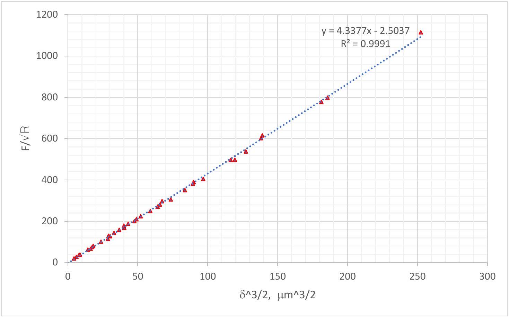
graph №7: Unified graph for balls

Equivalent mass

$$
\begin{gather*}
\mu = \frac { m _ { 1 } m _ { 2 } } { m _ { 1 } + m _ { 2 } }  \tag{7}\\
v _ { \text {relarive } } = v _ { 1 x } - v _ { 2 x } = v _ { 1 } - 0 = v _ { 1 } \\
\Delta p = 2 \mu v _ { \text {relative } }  \tag{8}\\
F _ { a v } = \frac { \Delta p } { \tau }  \tag{9}\\
K _ { \text {system, } \mathrm { C } } = \frac { 1 } { 2 } \mu \mathrm { v } _ { \text {relative } } ^ { 2 }  \tag{10}\\
K _ { \text {system, } \mathrm { C } } = F _ { a v } \delta \\
\delta = \frac { K _ { \text {system, } \mathrm { C } } } { F _ { a v } } \tag{11}
\end{gather*}
$$

Deflection

Experiment №1

$$
\begin{array} { r }
\delta \lesssim \frac { K _ { \text {system } , \mathrm { C } } } { F _ { a v } } \\
\delta \lesssim \frac { v _ { \text {relative } } } { 4 } \tau \tag{12}
\end{array}
$$

Hertz radius
From fig Q1:

$$
\begin{gathered}
a ^ { 2 } = R ^ { 2 } - \left( R - \frac { \delta } { 2 } \right) ^ { 2 } \approx R \delta \\
a = \sqrt [ 3 ] { \frac { 3 F R } { 4 E ^ { \prime } } } = \sqrt { R \delta } \quad \text { Hertz radius } \\
\frac { 1 } { R } = \frac { 1 } { R _ { 1 } } + \frac { 1 } { R _ { 2 } } \\
\delta = \sqrt [ 3 ] { \frac { 9 F _ { a v } ^ { 2 } } { 16 R E ^ { \prime 2 } } } \quad \text { Hertz deformation }
\end{gathered}
$$

Reduced Youngs Modulus

$$
\frac { 1 } { E ^ { \prime } } = \frac { 1 - v _ { 1 } ^ { 2 } } { E _ { 1 } } + \frac { 1 - v _ { 2 } ^ { 2 } } { E _ { 2 } } = 2 \frac { 1 - v _ { 1 } ^ { 2 } } { E _ { 1 } }
$$

Poisson's ratio

$$
v _ { 1 } = v _ { 2 } = 0.3
$$

Hertz pressure

$$
\begin{gather*}
P _ { a v } = \frac { 1 } { \pi a ^ { 2 } } \int _ { 0 } ^ { a } P ( r ) 2 \pi r d r = - P _ { 0 } \int _ { 0 } ^ { a } \left( 1 - \frac { r ^ { 2 } } { a ^ { 2 } } \right) ^ { \frac { 1 } { 2 } } d \left( 1 - \frac { r ^ { 2 } } { a ^ { 2 } } \right) = \frac { 2 } { 3 } P _ { 0 } \\
P _ { 0 } = \frac { 3 } { 2 } P _ { a v }  \tag{16}\\
P _ { 0 } = \frac { 2 } { \pi } E ^ { \prime } * \left( \frac { \delta } { R } \right) ^ { \frac { 1 } { 2 } }  \tag{17}\\
F _ { \max } = \frac { 3 } { 2 } F _ { a v }  \tag{18}\\
F _ { a v } \sim \sqrt { R \delta ^ { 3 } } \tag{19}
\end{gather*}
$$
