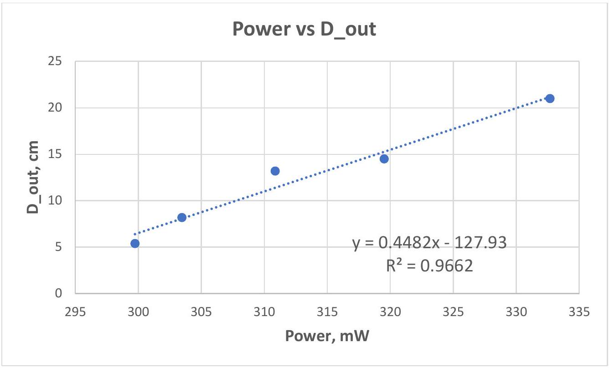
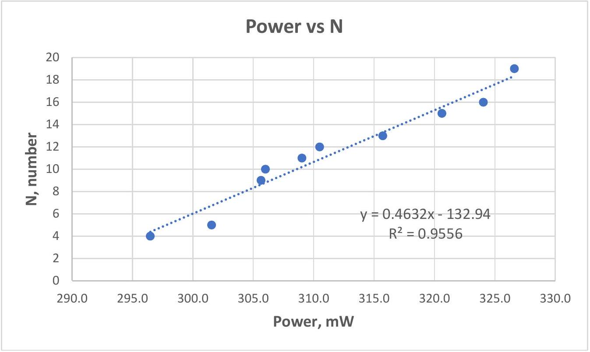
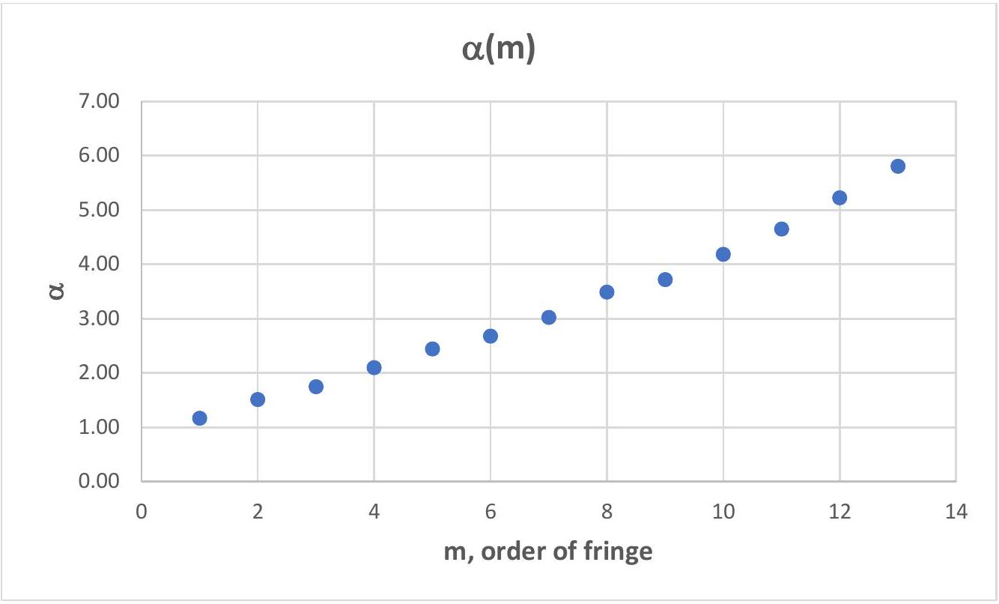
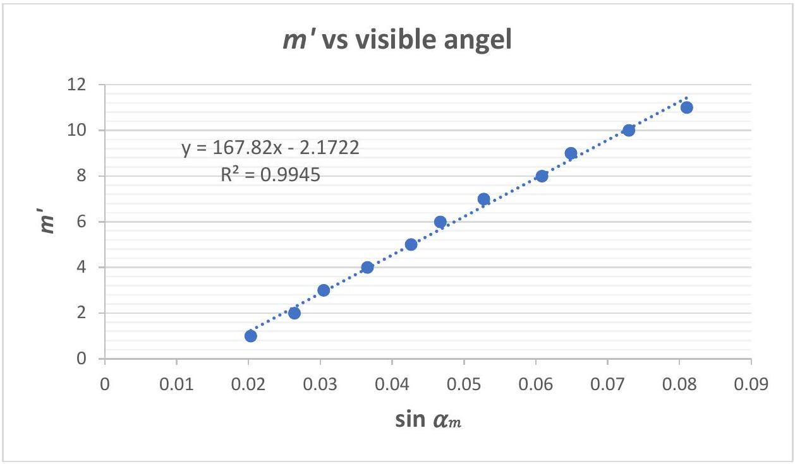
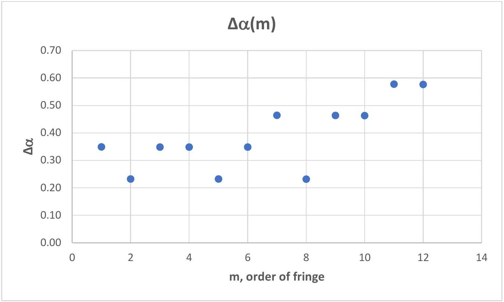
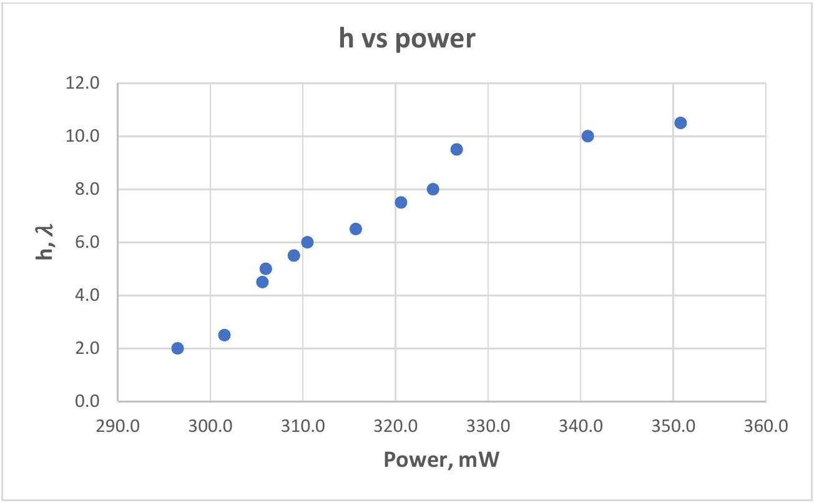
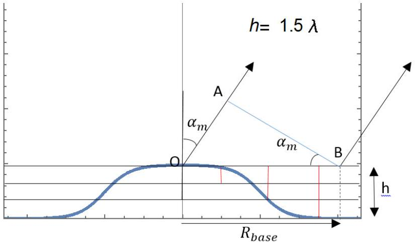
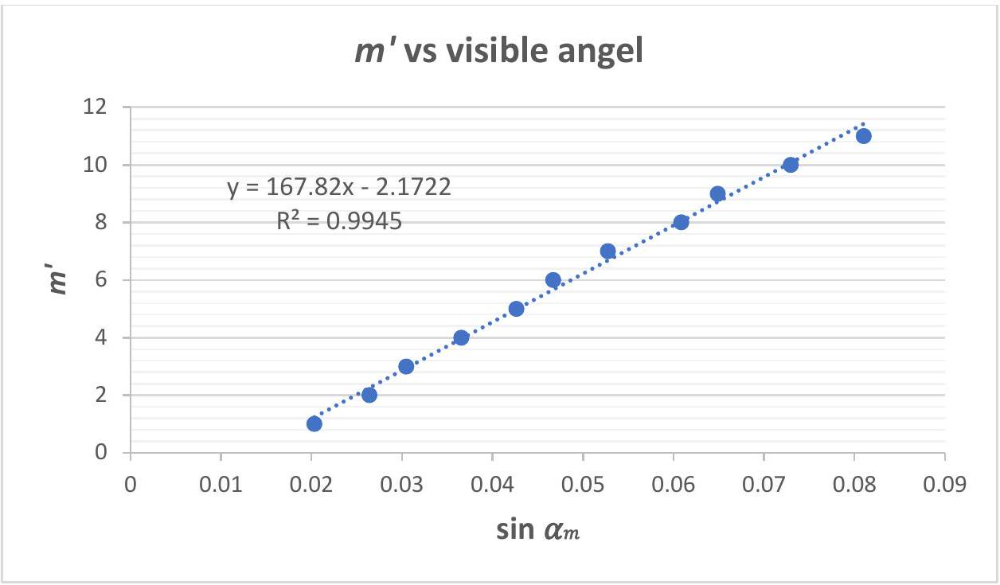

## Problem 2: Interference from thermally deformed surface (thermos-deformation)

Part A [0.8 points]
The resulting pattern exhibits reversibility and shrinkage up to a certain power value. The upper boundary value corresponding to the thermo-elastic range which is known as yield strength should be determined.

| A. 1 | Determine the power associated with this yield strength ( $p _ { \text {max } }$ ). | 0.3pt |
| :--- | :--- | :--- |
|  | For 350-400 mW 0.3 pts   For 300-350 mW 0.2 pts   For 400-450 mW 0.1 pts |  |

| $I , \mathrm {~mA}$ | $V , \mathrm {~V}$ | $P , \mathrm {~mW}$ | $P _ { \text {avg } } , \mathrm { mW }$ |
| :--- | :--- | :--- | :--- |
| 97.3 | 3.74 | 363.90 | 363.6 |
| 98.3 | 3.75 | 368.63 |  |
| 97.6 | 3.74 | 365.02 |  |
| 96.5 | 3.73 | 359.95 |  |
| 96.7 | 3.73 | 360.69 |  |

| A. 2 | Determine the diameter of the outermost bright fringe when the laser power is set to the level associated with the yield strength. | 0.5pt |
| :--- | :--- | :--- |
|  | The outermost diameter determined by locating the screen farther from target as following:   Determined the diameter value 0.3 pts   Distance between the target and screen 0.2 pts |  |

$$
L = 49.2 \mathrm {~cm}
$$

| $D _ { \text {out } } , \mathrm { cm }$ | $\left\langle D _ { \text {out } } \right\rangle , \mathrm { cm }$ |
| :--- | :--- |
| 27.0 | 27.5 |
| 26.0 |  |
| 28.0 |  |
| 28.5 |  |
| 28.0 |  |

| $L , \mathrm {~cm}$ | 49.2 | 45 | 40 | 35 | 30 | 25 | 20 | 15 | 10 | 5 |
| :--- | :--- | :--- | :--- | :--- | :--- | :--- | :--- | :--- | :--- | :--- |
| $D , \mathrm {~cm}$ | 27.5 | 25.6 | 22.8 | 19.9 | 17.1 | 14.2 | 11.4 | 8.5 | 5.7 | 2.8 |

Part B [3.5 points]

| B. 1 | The diameter of the outermost light fringe and the number of fringes formed in this test are measured in relation to the power and the results should be recorded in an Answer sheet table. | 1.5pt |
| :--- | :--- | :--- |
|  | - At least 10 measurement points 0.3 pts    For 7-9 points 0.2 pts   For 5-6 points 0.1 pts   For 150-300 mW 0.3 pts   For 100-150 mW 0.2 pts - Measured voltage for all rows in the table 0.2 pts    For 7-9 points 0.1 pts - Measured current for all rows in the table 0.2 pts    For 7-9 points 0.1 pts - Calculated power for all rows in the table 0.2 pts    For 7-9 points 0.1 pts - Significant figure all same number 0.3 pts  |  |

| № | $I , \mathrm {~mA}$ | $U , \mathrm {~V}$ | $P , \mathrm {~mW}$ | $N$ |
| :--- | :--- | :--- | :--- | :--- |
| 1 | 81.9 | 3.62 | 296.5 | 4 |
| 2 | 83.3 | 3.62 | 301.5 | 5 |
| 3 | 84.2 | 3.63 | 305.6 | 9 |
| 4 | 84.3 | 3.63 | 306.0 | 10 |
| 5 | 84.9 | 3.64 | 309.0 | 11 |
| 6 | 85.3 | 3.64 | 310.5 | 12 |
| 7 | 86.5 | 3.65 | 315.7 | 13 |
| 8 | 87.6 | 3.66 | 320.6 | 15 |
| 9 | 88.3 | 3.67 | 324.1 | 16 |
| 10 | 89.0 | 3.67 | 326.6 | 19 |
| 11 | 92.1 | 3.70 | 340.8 | 20 |
| 12 | 94.3 | 3.72 | 350.8 | 21 |

| B. 2 | Construct a graph depicting the relationship between the diameter of the outermost light interference fringe on the screen and the corresponding power level. | 1.0pt |
| :--- | :--- | :--- |
|  | At least 10 measured points appear in the graph 0.4 pts   The data covers at least 75\% of each coordinate length 0.4 pts   There are labels in each axis 0.2 pts |  |

| B. 3 | Plot the number of interference fringes on the screen is measured as a function of power. | 1.0pt |
| :--- | :--- | :--- |
|  | At least 10 measured points appear in the graph 0.4 pts   The data covers at least 75\% of each coordinate length 0.4 pts   There are labels in each axis 0.2 pts |  |

Part C [3.7 points]

| C. 1 | Measure the angular width (an angle between the ray of $n$th order fringe and the ray of $n + 1$ th order fringe ) and visible angle (an angle between the ray of $n$th order fringe and $x$-axis) of the dark fringe at a constant power level, depending on the number of the fringe, and record the results in Answer Sheet Table. | 1.2pt |
| :--- | :--- | :--- |
|  | At least 10 measurement points 0.4 pts   For 7-9 points 0.2 pts   For 5-6 points 0.1 pt   The power determined 0.1 pts   The visible angle values determined 0.2 pts   The angular width values determined 0.3 pts   Significant figure all same number 0.2 pts |  |

| $m$ | $R , \mathrm {~cm}$ | $L , \mathrm {~cm}$ | $\tan \left( \alpha _ { m } \right)$ | $\alpha _ { m } { } ^ { \circ }$ | $\alpha _ { m }$, mrad | $\Delta \alpha _ { m } , { } ^ { \circ }$ | $\Delta \alpha _ { m } , \operatorname { mrad }$ |
| :--- | :--- | :--- | :--- | :--- | :--- | :--- | :--- |
| 1 | 1.0 | 49.2 | 0.020 | 1.16 | 20.3 | 0.35 | 6.1 |
| 2 | 1.3 |  | 0.026 | 1.51 | 26.4 | 0.23 | 4.0 |
| 3 | 1.5 |  | 0.030 | 1.75 | 30.6 | 0.35 | 6.1 |
| 4 | 1.8 |  | 0.037 | 2.10 | 36.7 | 0.35 | 6.1 |
| 5 | 2.1 |  | 0.043 | 2.44 | 42.6 | 0.23 | 4.0 |
| 6 | 2.3 |  | 0.047 | 2.68 | 46.8 | 0.35 | 6.1 |
| 7 | 2.6 |  | 0.053 | 3.03 | 52.9 | 0.46 | 8.0 |
| 8 | 3.0 |  | 0.061 | 3.49 | 60.9 | 0.23 | 4.0 |
| 9 | 3.2 |  | 0.065 | 3.72 | 65.0 | 0.46 | 8.0 |
| 10 | 3.6 |  | 0.073 | 4.18 | 73.0 | 0.46 | 8.0 |
| 11 | 4.0 |  | 0.081 | 4.65 | 81.2 | 1.04 | 18.2 |
| 12 | 4.5 |  | 0.100 | 5.69 | 99.3 | 1.04 | 18.2 |
| 13 | 5.0 |  | 0.118 | 6.72 | 117.3 |  |  |

C.2. Plot a linear graph of the relationship between the visible angle vs order of fringe.

| C. 2 | Plot a linear graph of the relationship between the visible angle vs order of fringe. | 1.0pt |
| :--- | :--- | :--- |
|  | At least 10 measured points appear in the graph 0.4 pts   The data covers at least 75\% of each coordinate length 0.4 pts   There are labels in each axis 0.2 pts |  |

1. Non-linear graph (0.2pts)

Experiment

2. Linearized graph (0.8pts)

| C. 3 | Find the slope and Y-intercept of the graph plotted in Task C.2. | 0.5pt |
| :--- | :--- | :--- |
|  | Plotted regression line and calculate slope 0.3 pts   Value of grad 0.2 pts |  |

$$
m ^ { \prime } = 167.82 \cdot \sin \alpha _ { m } - 2.1722
$$

| C. 4 | Construct a graph of angular width as a function of the order of fringes. | 1.0pt |
| :--- | :--- | :--- |
|  | At least 10 measured points appear in the graph 0.2 pts   The data covers at least 75\% of each coordinate length 0.2 pts   There are labels in each axis 0.2 pts   Plotted regression line and calculate slope 0.2 pts   Value of grad 0.2pts |  |

Part D [2.0 points]

| D. 1 | By counting the number of the fringes determine the highest order of the fringes. Determine the height of the thermal deformation in terms of the laser wavelength as a function of the laser power. Plot a graph of your data. Hint: ensure your data includes the range of $200 m W$ to $400 m W$. | 1.4pt |
| :--- | :--- | :--- |
|  | Each data point 0.1 pt (10 datas)   At least 8 measured points appear in the graph 0.2 pts   There are labels in each axis 0.2 pts |  |

| Nº | $m _ { \text {max } }$ | $P , \mathrm {~mW}$ | $h , \lambda$ |
| :--- | :--- | :--- | :--- |
| 1 | 4 | 296.5 | 2.0 |
| 2 | 5 | 301.5 | 2.5 |
| 3 | 9 | 305.6 | 4.5 |
| 4 | 10 | 306.0 | 5.0 |

| 5 | 11 | 309.0 | 5.5 |
| :--- | :--- | :--- | :--- |
| 6 | 12 | 310.5 | 6.0 |
| 7 | 13 | 315.7 | 6.5 |
| 8 | 15 | 320.6 | 7.5 |
| 9 | 16 | 324.1 | 8.0 |
| 10 | 19 | 326.6 | 9.5 |
| 11 | 20 | 340.8 | 10.0 |
| 12 | 21 | 350.8 | 10.5 |

| D. 2 | What are the thermal deformation heights for the following input laser powers? Give your answers in units of the number of laser wavelengths. - 200 mW - 300 mW - 400 mW  | 0.6pt |
| :--- | :--- | :--- |
|  | For 200 mW 0.2 pts   For 300 mW 0.2 pts   For 400 mW 0.2 pts |  |

| $P , \mathrm {~mW}$ | $h , \lambda$ |
| :--- | :--- |
| 200 | -12.6 |
| 300 | 3.6 |
| 400 | 19.8 |

Appendix

Maximum optical path difference of rays is 2h for central maximum.
For $\mathrm { m } ^ { \text {th } }$ fringe which is observed by visible angle $\alpha _ { m }$, the optical path difference for the rays from the top and bottom of a bump is:

$$
\begin{gathered}
\Delta s _ { m } \approx 2 h - O A = n \lambda - R \sin \alpha _ { m } = n \lambda - m \lambda \\
R \sin \alpha _ { m } = m \lambda \Rightarrow R = \frac { m \lambda } { \sin \alpha _ { m } }
\end{gathered}
$$

Data obtained in Part C. 1 were used.

| $m ^ { \prime }$ | $R , \mathrm {~cm}$ | $L , \mathrm {~cm}$ | $\tan \alpha _ { m }$ | $\sin \alpha _ { m }$ |
| :--- | :--- | :--- | :--- | :--- |
| 1 | 1.0 | 49.2 | 0.0203 | 0.0203 |
| 2 | 1.3 |  | 0.0264 | 0.0264 |
| 3 | 1.5 |  | 0.0305 | 0.0305 |
| 4 | 1.8 |  | 0.0366 | 0.0366 |
| 5 | 2.1 |  | 0.0427 | 0.0426 |
| 6 | 2.3 |  | 0.0467 | 0.0467 |
| 7 | 2.6 |  | 0.0528 | 0.0528 |
| 8 | 3.0 |  | 0.0610 | 0.0609 |
| 9 | 3.2 |  | 0.0650 | 0.0649 |
| 10 | 3.6 |  | 0.0732 | 0.0730 |
| 11 | 4.0 |  | 0.0813 | 0.0810 |
| 12 | 4.5 |  | 0.0915 | 0.0911 |
| 13 | 5.0 |  | 0.1016 | 0.1011 |

Here, $m ^ { \prime }$ and $m$ are observed and real number of fringes, respectively.

Experiment

$$
m ^ { \prime } = 167.82 \cdot \sin \alpha _ { m } - 2.1722
$$

From the above equation, it shows that difference between $m ^ { \prime }$ and $m$ is $2.1722 \approx 2$ which is the number of fringes hidden in the central circle. From our data, $m = m ^ { \prime } + 2 = 15$.

From the experiment, height of the bump is calculated to be $7.5 \lambda$ and the base radius is $R _ { \text {base } } \approx$ 167.82λ.
