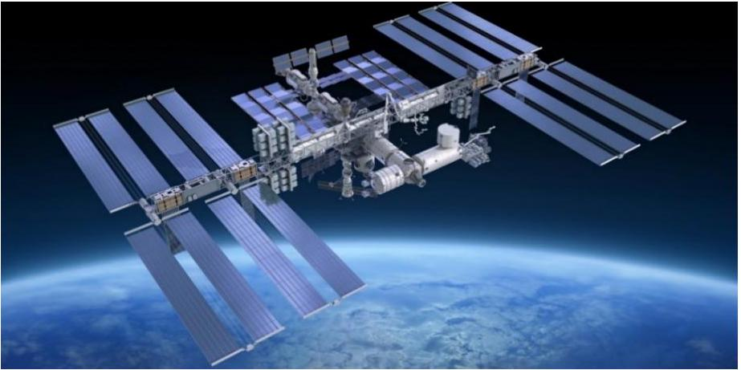
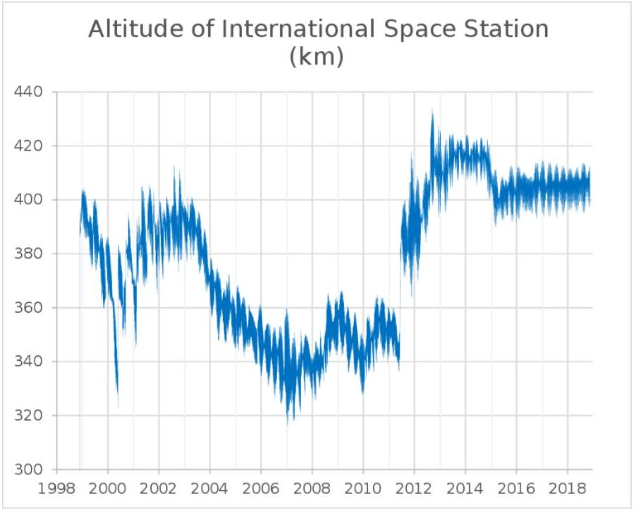
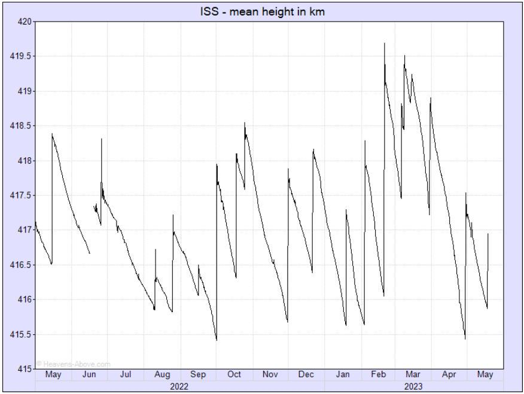
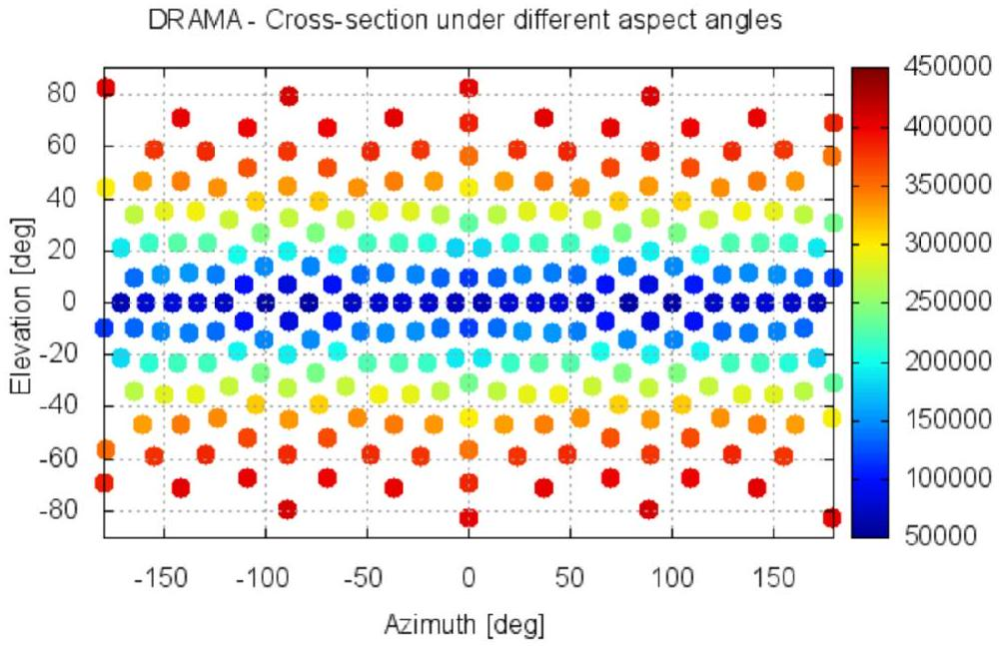
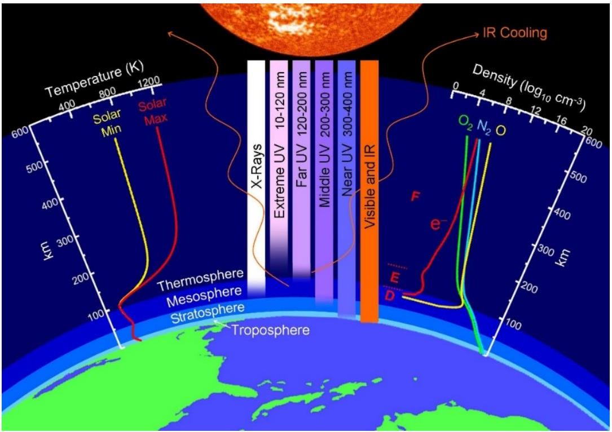

## ISS Orbital Decay Dynamics   (Gurjav Ganbold)

The International Space Station (ISS) is the largest modular space station in low Earth orbit. The station serves as a microgravity and space environment research laboratory in which scientific research is conducted in astrobiology, astronomy, meteorology, physics, and other fields. The ISS is suited for testing the spacecraft systems and equipment required for possible future long-duration missions to the Moon and Mars. An international partnership of five space agencies from 15 countries operates ISS.

Figure 1: The International Space Station orbiting above the Earth.

The ISS is currently maintained in a nearly circular orbit with a minimum mean altitude of 370 km and a maximum of 460 km, in the centre of the thermosphere, at an inclination of $\theta = 51.6 ^ { 0 }$ (degrees) to Earth's equator. The trajectory of the spacecraft is similar to a spiral with a slowly changing distance from the station to the Earth's surface, and during one cycle of revolution this distance changes inconsiderable.

Figure 2: The altitude of ISS (km) over the years.

[^0]

Figure 3: The ISS mean height (km) in 2022-2023.

Figure 4: ISS model with the cross sections from different aspect angles ( $\mathrm { dm } ^ { 2 } = 10 ^ { - 2 } \mathrm {~m} ^ { 2 }$ ). The DRAMA CROC provides $2481 \mathrm {~m} ^ { 2 }$ cross section.

"The ISS loses up to 330 ft ( 100 m) of altitude each day." [NASA Control Data (2021)].
In 2023 the ISS flies at altitudes of 410 km, with an orbital decay about 70 m every day (~ 2 km per month), and during magnetic storms the daily descent reaches 300 m. The ISS accomplishes the de-orbit maneuvers by using the propulsion capabilities of the ISS and its visiting vehicles [International Space Station Transition Report (2022)].

The ISS mass is $M _ { S } = 4.5 \times 10 ^ { 5 } \mathrm {~kg}$ and overall length is $L _ { S } = 109 \mathrm {~m}$. Huge solar panels with a width of $W _ { S } = 73 \mathrm {~m}$ provide the ISS with electrical energy [NASA Official Report (2023)].

Including all batteries and other parts, the effective cross area (section) of the station is approximately $S \approx 2.5 \times 10 ^ { 3 } \mathrm {~m} ^ { 2 }$ [European Space Agency, SDC6-23].

The ISS orbital decay is caused by one or more mechanisms which absorb energy from the orbital motion, the essential ones being:

- atmospheric drag at orbital altitude is caused by frequent collisions of gas molecules with the satellite,
- the Ampere force arising from the motion of the conductive apparatus in the Earth's magnetic field,
- the interaction with the atomic oxygen ions.

## Denotations and Physical constants:

$R$ - Universal gas constant $\left( 8.31 \mathrm {~J} \cdot \mathrm {~K} ^ { - 1 } \cdot \mathrm {~mol} ^ { - 1 } \right)$
$N _ { A }$ - Avogadro's number ( $6.022 \cdot 10 ^ { 23 } \mathrm {~mol} ^ { - 1 }$ )
$\mu$ - The molar mass of gas (for air: $0.029 \mathrm {~kg} \cdot \mathrm {~mol} ^ { - 1 }$, for $O _ { 2 } : 0.032 \mathrm {~kg} \cdot \mathrm {~mol} ^ { - 1 }$ )
$M _ { E }$ - Mass of the Earth $\left( 5.97 \cdot 10 ^ { 24 } \mathrm {~kg} \right)$
$R _ { E }$ - Radius of the Earth $\left( 6.38 \cdot 10 ^ { 6 } \mathrm {~m} \right)$
$G$ - Gravitational universal constant $\left( 6.67 \cdot 10 ^ { - 11 } \mathrm {~m} ^ { 3 } \cdot \mathrm {~s} ^ { - 2 } \cdot \mathrm {~kg} ^ { - 1 } \right)$
$\rho _ { 0 }$ - Density of air at Earth's surface $\left( 1.29 \mathrm {~kg} / \mathrm { m } ^ { 3 } \right)$
$g _ { 0 }$ - Gravitational acceleration at Earth's surface $\left( 9.81 \mathrm {~m} \cdot \mathrm {~s} ^ { - 2 } \right)$
$B$ - Average magnitude of Earth's magnetic field ( $5.0 \cdot 10 ^ { - 5 } \mathrm {~T}$ )
$e$ - The electron absolute charge $\left( 1.60 \cdot 10 ^ { - 19 } \mathrm { Q } \right)$

## A. Modified barometric formula

The pressure of atmospheric air, composed mainly of neutral $O _ { 2 }$ and $N _ { 2 }$ molecules, can be found by using the Clapeyron-Mendeleev law:

$$
\begin{equation*}
p V = \frac { M } { \mu } R T . \tag{1}
\end{equation*}
$$

where $p , V , T , M$ and $\mu$ are the pressure, volume, temperature, mass and molar mass of a portion of air, $R$ is the ideal gas universal constant.

There are two equations for computing air pressure as a function of height. The first equation is applicable to the standard model of the troposphere ( $h < 100 \mathrm {~km}$ ) in which the temperature is assumed to vary with altitude at a lapse rate.

The second equation belongs to the standard model of the thermosphere ( $h > 250 \mathrm {~km}$ ) in which the temperature is assumed not to change considerably with altitude and is applicable to ISS.

Figure 5: The Earth's thermosphere.

We may assume that all pressure is hydrostatic (i.e., it acts with equal magnitude in all directions).

Then, a perturbation of the air pressure $d p _ { h }$ on a variation of attitude $d h$ may be written:

$$
\begin{equation*}
d p _ { h } \doteq p _ { h + d h } - p _ { h } = - g _ { h } ( M / V ) d h \tag{2}
\end{equation*}
$$

and dividing the $d p _ { h }$ by the $p _ { h }$ expressed from the Clapeyron-Mendeleev law we obtain

$$
\begin{equation*}
\frac { d p _ { h } } { p _ { h } } = - \frac { g _ { h } \mu } { R T _ { h } } d h . \tag{3}
\end{equation*}
$$

Integrating this expression from the surface $h = 0$ to the altitude $h$ we get the air pressure as follows:

$$
\begin{equation*}
p _ { h } = p _ { 0 } \exp \left( - \frac { \mu } { R } \int _ { 0 } ^ { h } d h \frac { g _ { h } } { T _ { h } } \right) \tag{4}
\end{equation*}
$$

where $p _ { 0 }$ is the air pressure at altitude $h = 0$.
Remark 1. The temperature of Earth's thermosphere at altitude 300-600 km does not change considerably (see Fig.3) and reaches averagely about 800-900 K at solar side [NASA data]. Therefore, one may put $T _ { h } = T =$ const by investigating the ISS orbital flight. Particularly, since the spacecraft spends almost half of its flight time in the shadow side of the Earth, where the temperature drops sharply, we may take the value of $\mathbf { T } = \mathbf { 4 2 5 } \mathbf { ~ K }$ as the average temperature at these altitudes. This temperature is also in agreement with the air density value $\rho _ { h } \sim 10 ^ { - 12 } \mathrm {~m} ^ { - 3 }$ [MSISE-90 Model of Earth's Upper Atmosphere] at $h = 400 \mathrm {~km}$.

Further, by accepting an approximation $g _ { h } = g _ { 0 }$ one obtains the standard barometric formula as follows:

$$
\begin{equation*}
p _ { h } ^ { s t a } = p _ { 0 } \exp \left( - \frac { h } { h _ { 0 } } \right) , \quad h _ { 0 } \doteq \frac { R T } { \mu g _ { 0 } } . \tag{5}
\end{equation*}
$$

We fix the parameter $h _ { 0 }$ as follows:

$$
\begin{equation*}
h _ { 0 } \doteq \frac { R T } { \mu g _ { 0 } } = \frac { 8.31 \mathrm {~J} \mathrm {~K} ^ { - 1 } \cdot \mathrm {~mol} ^ { - 1 } 425 \mathrm {~K} } { 0.029 \mathrm {~kg} \cdot \mathrm {~mol} ^ { - 1 } 9.81 \mathrm {~m} \cdot \mathrm {~s} ^ { - 2 } } \approx 12400 \mathrm {~m} . \tag{6}
\end{equation*}
$$

Remark 2. The integral in Eq.(4) may be calculated by taking into account the dependence of $g _ { h }$ on $h$ in the leading-order correction, with accuracy $O \left( z _ { h } ^ { 2 } \right)$.

In the leading-order approximation one gets:

$$
\begin{equation*}
g _ { h } \simeq g _ { 0 } \left( 1 - 2 z _ { h } \right) , \quad \int _ { 0 } ^ { h } d h g _ { h } \simeq g _ { 0 } h \left( 1 - z _ { h } \right) \tag{7}
\end{equation*}
$$

Then, we obtain a improved barometric formula

$$
\begin{equation*}
p _ { h } ^ { i m p } = p _ { 0 } \exp \left( - \frac { h \left( 1 - z _ { h } \right) } { h _ { 0 } } \right) . \tag{8}
\end{equation*}
$$

Let us estimate the ratio of the 'standard' and 'improved' versions of the barometric formula:

$$
\begin{equation*}
\frac { p _ { h } ^ { i m p } } { p _ { h } ^ { s t a } } = \frac { \exp \left( - \frac { h \left( 1 - z _ { h } \right) } { h _ { 0 } } \right) } { \exp \left( - \frac { h } { h _ { 0 } } \right) } = e ^ { \frac { h ^ { 2 } } { h _ { 0 } R _ { E } } } \approx 7.54 \text { for } h = 4.0 \times 10 ^ { 5 } \mathrm {~m} . \tag{9}
\end{equation*}
$$

The gas density rises by almost eight times when the weakening of gravity at ISS altitude is taken into account in the leading order.

Therefore, to avoid significant error in calculation for the ISS, when the air pressure or air density is involved, one should use the improved barometric formula in Eq.(8) instead of Eq.(5).

According to Eq.(8), the air density at height $h$ may be expressed by the formula

$$
\begin{equation*}
\rho _ { h } \doteq \frac { M } { V } = \rho _ { 0 } \exp \left( - h \left( 1 - z _ { h } \right) / h _ { 0 } \right) . \tag{10}
\end{equation*}
$$

The concentration of neutral air molecules at altitude is expressed through a similar law

$$
\begin{equation*}
n _ { h } = N _ { A } \frac { \rho _ { 0 } } { \mu } \exp \left( - h \left( 1 - z _ { h } \right) / h _ { 0 } \right) . \tag{11}
\end{equation*}
$$

## B. Orbital deceleration and station descent rate

Let us consider the problem of determining the rate of orbital decay of a satellite with mass $M _ { S }$ that experiences friction force $\vec { F } _ { \text {drag } }$ acting against its velocity $\vec { v }$ during the time $d t$. We assume that the decrease in altitude $d h$ is much less than the flight altitude $h$ itself $( d h \ll h )$.

The satellite's velocity may be found from its equation of motion in orbit (Newton's second law) where the Earth's gravitational force is balanced by the centrifugal force:

$$
\begin{equation*}
g _ { h } = \frac { v _ { h } ^ { 2 } } { R _ { E } \left( 1 + z _ { h } \right) } , \quad g _ { h } \doteq \frac { g _ { 0 } } { \left( 1 + z _ { h } \right) ^ { 2 } } . \tag{12}
\end{equation*}
$$

The solutions read

$$
\begin{equation*}
v _ { h } = \sqrt { \frac { g _ { 0 } R _ { E } } { 1 + z _ { h } } } , \quad \tau _ { h } \doteq 2 \pi \frac { R _ { E } + h } { v _ { h } } = 2 \pi \sqrt { \frac { R _ { E } } { g _ { 0 } } } \left( 1 + z _ { h } \right) ^ { 3 / 2 } . \tag{13}
\end{equation*}
$$

By the conservation of mechanical energy, the total energy of a satellite moving along an almost circular orbit with radius $R _ { E } + h$ is the sum of kinetic and gravitational potential energies, in an unperturbed two-body orbit:

$$
\begin{equation*}
E _ { S } = \frac { M _ { S } \cdot v _ { h } ^ { 2 } } { 2 } - M _ { S } g _ { h } R _ { E } \left( 1 + z _ { h } \right) = - \frac { M _ { S } g _ { 0 } R _ { E } } { 2 \left( 1 + z _ { h } \right) } . \tag{14}
\end{equation*}
$$

The total decelerating force exerted on a satellite of constant mass is given by some external braking force $\vec { F } _ { \text {drag } }$. The rate of loss of orbital energy $d E _ { S }$ is simply the rate at the external force does negative work $d A _ { \text {drag } }$ on the satellite as the satellite traverses an infinitesimal circular arc-length $d L = v d t$ :

$$
\begin{equation*}
d A _ { \text {drag } } = - F _ { \text {drag } } \cdot v _ { h } \cdot d t \tag{15}
\end{equation*}
$$

The perturbation $d E _ { S }$ of the orbital energy at a change of the radius $d h$ reads:

$$
\begin{equation*}
d E _ { S } = + \frac { M _ { S } g _ { 0 } } { 2 \left( 1 + z _ { h } \right) ^ { 2 } } d h \tag{16}
\end{equation*}
$$

The total energy conservation $d E _ { S } + d A _ { \text {drag } } = 0$ leads to the equation

$$
\begin{equation*}
\frac { M _ { S } g _ { 0 } } { 2 \left( 1 + z _ { h } \right) ^ { 2 } } d h = F _ { d r a g } \cdot v _ { h } \cdot d t \tag{17}
\end{equation*}
$$

Then, we can find the rate of descent speed of the satellite as follows:

$$
\begin{equation*}
u _ { h } \doteq \frac { d h } { d t } = \frac { 2 F _ { \text {drag } } } { M _ { S } g _ { 0 } } v _ { h } \left( 1 + z _ { h } \right) ^ { 2 } = \frac { 2 F _ { \text {drag } } } { M _ { S } } \sqrt { \frac { R _ { E } } { g _ { 0 } } } \left( 1 + z _ { h } \right) ^ { 3 / 2 } . \tag{18}
\end{equation*}
$$

The de-orbiting speed depends on the friction force, and on the altitude of the satellite, and on the mass of the satellite.

The friction force $\vec { F } _ { \text {drag } }$ itself, in turn, depends on the flight altitude, on the effective cross section of the satellite $S$, and on the composition of the space environment at the satellite's flight altitude $h$.

The descent rate $H _ { h }$ for a revolution around the Earth reads:

$$
\begin{equation*}
H _ { h } \doteq u _ { h } \tau _ { h } = \frac { 4 \pi R _ { E } } { M _ { S } g _ { 0 } } F _ { \text {drag } } ( h ) \cdot \left( 1 + z _ { h } \right) ^ { 3 } . \tag{19}
\end{equation*}
$$

The differential equation in Eq.(18) may be integrated out. Then, the total time $T _ { h }$ for which the satellite will fall from the attitude $h$ to the earth's surface due to the friction may be found from the relation:

$$
\begin{equation*}
T _ { h } \doteq \int _ { 0 } ^ { T _ { h } } d t = \frac { M _ { S } } { 2 } \sqrt { \frac { g _ { 0 } } { R _ { E } } } \int _ { 0 } ^ { h } d h \frac { 1 } { F _ { \text {drag } } ( h ) \cdot \left( 1 + z _ { h } \right) ^ { 3 / 2 } } \tag{20}
\end{equation*}
$$

## C. Atmospheric drag

The speed of the satellite $v$ is many times greater than the average velocities (hundreds m/s) of the thermal motion of atmospheric molecules at a height $h \approx 300 - 400 \mathrm {~km}$, so we can assume that the molecules were at rest before the collision with the ISS. To roughly estimate the drag force, we assume that after the collision the molecules acquire the same speed as the satellite. In this case, the air drag force can be estimated as follows:

$$
\begin{equation*}
F _ { a i r } = n _ { h } m _ { a i r } \cdot v _ { h } ^ { 2 } \cdot S = \frac { N _ { a i r } m _ { a i r } } { V } \cdot v _ { h } ^ { 2 } \cdot S = \rho _ { h } \cdot v _ { h } ^ { 2 } \cdot S . \tag{21}
\end{equation*}
$$

By substituting this expression into the formula in Eq.(18), we obtain

$$
\begin{equation*}
u _ { h } ^ { a i r } = \frac { 2 \rho _ { 0 } S \sqrt { g _ { 0 } R _ { E } ^ { 3 } } } { M _ { S } } \left( 1 + z _ { h } \right) ^ { 1 / 2 } \cdot \exp \left( - h \left( 1 - z _ { h } \right) / h _ { 0 } \right) . \tag{22}
\end{equation*}
$$

The descent rate $H _ { h } ^ { \text {air } }$ for a revolution around the Earth reads:

$$
\begin{equation*}
H _ { h } ^ { a i r } \doteq u _ { h } ^ { a i r } \tau _ { h } = \frac { 4 \pi S R _ { E } ^ { 2 } } { M _ { S } } \rho _ { 0 } \cdot \left( 1 + z _ { h } \right) ^ { 2 } \cdot \exp \left( - h \left( 1 - z _ { h } \right) / h _ { 0 } \right) . \tag{23}
\end{equation*}
$$

To find the total time $T _ { h } ^ { \text {air } }$ for which the satellite will fall to the earth's surface, we use Eq.(20). We obtain:

$$
\begin{equation*}
T _ { h } ^ { a i r } \simeq \frac { M _ { S } } { 2 \rho _ { 0 } S \sqrt { g _ { 0 } R _ { E } ^ { 3 } } } \int _ { 0 } ^ { h } d h \left( 1 - \frac { h } { 2 R _ { E } } \right) e ^ { + h / h _ { 0 } } \approx \frac { M _ { S } h _ { 0 } } { 2 \rho _ { 0 } S \sqrt { g _ { 0 } R _ { E } ^ { 3 } } } \left( 1 - \frac { h } { 2 R _ { E } } \right) \cdot e ^ { + h / h _ { 0 } } , \tag{24}
\end{equation*}
$$

where we took into account relations $h _ { 0 } \ll h \ll R _ { E }$.

## D. Drag by atomic oxygen ions

In the thermosphere, under the influence of ultraviolet and X-ray solar radiation and cosmic radiation, air ionization occurs ("polar lights"). Unlike $O _ { 2 } , N _ { 2 }$ does not undergo strong dissociation under the action of solar radiation, therefore, in general, there is much less atomic nitrogen $N$ in the Earth's upper atmosphere than atomic oxygen. At altitudes above 250 km, atomic oxygen $O$ predominates. Layers containing electrons and ions of oxygen atoms appear on the day side of the atmosphere. In this case, the concentration of atomic oxygen ions reaches $n _ { \text {ion } } \sim 10 ^ { 13 } m ^ { - 3 }$.

The decelerating force associated with the mechanical collisions of these particles on the satellite can be calculated using the formula in Eq.(21) but taking into account the strong decrease in ionization at night. Let the average value of the ion concentration be half the maximum value. Then we have

$$
\begin{equation*}
F _ { i o n } = \frac { 1 } { 2 } \rho _ { i o n } \cdot S \cdot v _ { h } ^ { 2 } , \tag{25}
\end{equation*}
$$

where

$$
\begin{equation*}
\rho _ { i o n } = \frac { \mu _ { i o n } } { N _ { A } } \cdot n _ { i o n } . \tag{26}
\end{equation*}
$$

Therefore, the speed of fall of the satellite due to deceleration by ions of atomic oxygen may be roughly estimated as follows:

$$
\begin{equation*}
u _ { h } ^ { i o n } = \rho _ { i o n } \cdot \frac { S \sqrt { g _ { 0 } R _ { E } ^ { 3 } } } { M _ { S } } \left( 1 + z _ { h } \right) ^ { 1 / 2 } . \tag{27}
\end{equation*}
$$

The descent rate $H _ { h } ^ { \text {ion } }$ for a revolution around the Earth reads:

$$
\begin{equation*}
H _ { h } ^ { i o n } \doteq u _ { h } ^ { i o n } \tau _ { h } = \rho _ { i o n } \frac { 2 \pi S R _ { E } ^ { 2 } } { M _ { S } } \cdot \left( 1 + z _ { h } \right) ^ { 2 } . \tag{28}
\end{equation*}
$$

## E. Drag by the Earth's magnetic field

We consider the influence on the motion of the satellite of the Earth's magnetic field, the value of which near the Earth's surface is equal to $( 3.5 - 6.5 ) \cdot 10 ^ { - 5 } T$ with an average value of $B = 5 \cdot 10 ^ { - 5 } T$.

When a satellite moves at high speed in a magnetic field, an inducted electric current (electro-motive force, EMF) occurs in the current-conducting elements of the satellite's structure. This electromotive force causes a redistribution of electric charges in the current-conducting elements of the satellite structure. An electric field appears around the satellite, which affects on the movement of electrically charged particles in the environment. Electrons are attracted to those parts of the satellite that have a positive potential (relative to the middle part of the satellite), and positively charged ions are attracted to those parts of the satellite that have a negative potential. Electrons and ions that hit the surface of the satellite structures are combined into neutral oxygen atoms, while the electrons 'travel' in the satellite's conductive structures, creating an electric current. The satellite, moving in space, 'collects' electrons and ions from the surrounding space and collides with them. For a rough estimate of the magnitude of the current that can flow through the conductive structures of the satellite, we will assume that the collection occurs only from an area equal to the cross-sectional area $S$ of the ISS, and all ions and electrons participate in the creation of this current.

The number of electrons hitting the structure of the ISS body during the short time interval $d t$ is

$$
\begin{equation*}
d N = n _ { \text {ion } } \cdot v _ { h } \cdot S \cdot d t . \tag{29}
\end{equation*}
$$

Therefore, the magnitude of the current is of the order

$$
\begin{equation*}
I _ { i n d } \approx e \frac { d N } { d t } = e \cdot S \cdot n _ { i o n } \cdot \sqrt { \frac { g _ { 0 } R _ { E } } { 1 + z _ { h } } } . \tag{30}
\end{equation*}
$$

The orbital 'braking' Ampere's force is proportional to $\left[ \vec { v } _ { h } \times \vec { B } \right] = v _ { h } B | \sin ( \phi ) |$, where $\phi$ is the angle between the Earth's magnetic field $\vec { B }$ and the velocity of the ISS $\vec { v } _ { h }$. Hereby, $\theta = 51.6 ^ { 0 }$ (degrees) is the inclination angle of the ISS orbit to Earth's equator.

Let us consider a revolution starting from the 'north' sample point in the ISS orbit with the highest latitude $( \phi = \pi / 2 - \theta )$. After a half revolution the ISS arrives at the 'south' point with the lowest latitude $( \phi = \pi / 2 + \theta )$. The second part of the revolution cycle ends at the 'north point'.

The averaging of the value $| \sin ( \phi ) |$ during a revolution period may be performed as follows:

$$
\begin{equation*}
\left. \langle | \sin ( \phi ) \left| \rangle = \frac { 1 } { 2 \theta } \int _ { \pi / 2 - \theta } ^ { \pi / 2 + \theta } d \phi \right| \sin ( \phi ) \right\rvert \, = 0.93 \approx 1 \tag{31}
\end{equation*}
$$

An approximate result may be obtained by using four equidistant sample positions in the ISS orbit as follows:

$$
\begin{equation*}
\langle | \sin ( \phi ) | \rangle = \{ \sin ( \pi / 2 - \theta ) + \sin ( \pi / 2 ) + \sin ( \pi / 2 + \theta ) + \sin ( \pi / 2 ) \} / 4 = 0.89 \approx 1 . \tag{32}
\end{equation*}
$$

Further, we will use an approximation $\langle | \sin ( \phi ) | \rangle \approx 1$.
When the induced current flows through the conductive parts of the satellite, they are affected by the 'braking' Ampere force directed opposite to the direction of the satellite's speed:

$$
\begin{equation*}
F _ { i n d } = B \cdot I _ { i n d } \cdot \langle | \sin ( \phi ) | \rangle \cdot L \approx B \cdot I _ { i n d } \cdot \sqrt { S } = e \cdot B \cdot S ^ { 3 / 2 } \cdot n _ { i o n } \cdot \sqrt { \frac { g _ { 0 } R _ { E } } { 1 + z _ { h } } } , \tag{33}
\end{equation*}
$$

where for the external linear size of the station, we can use the approximation $L \sim S ^ { 1 / 2 }$.
Then for the rate of descent of the satellite we obtain

$$
\begin{equation*}
u _ { h } ^ { i n d } \approx 2 n _ { i o n } \frac { e B S ^ { 3 / 2 } R _ { E } } { M _ { S } } \cdot \left( 1 + z _ { h } \right) . \tag{34}
\end{equation*}
$$

The descent rate $H _ { h } ^ { \text {ind } }$ for a revolution around the Earth reads:

$$
\begin{equation*}
H _ { h } ^ { i n d } \doteq u _ { h } ^ { i n d } \tau _ { h } = \frac { 4 \pi e B \left( S R _ { E } \right) ^ { 3 / 2 } } { M _ { S } \sqrt { g _ { 0 } } } \cdot \left( 1 + z _ { h } \right) ^ { 5 / 2 } \tag{35}
\end{equation*}
$$

## F. Numerical results and conclusion

Table 1: Various deorbit velocities on the height $h$ above the Earth surface, compared to the ISS-NASA data estimated for $n _ { \text {ion } } = 10 ^ { 13 } m ^ { - 3 }$. For $n _ { \text {ion } } = 10 ^ { 12 } m ^ { - 3 }$ the results for $u _ { i o n }$ and $u _ { i n d }$ will decrease in 10 times.
| h [km] | $T _ { h } ^ { \text {air } }$ [day] | $u _ { \text {air } } [ m / d a y ]$ | $u _ { \text {ion } } [ m / d a y ]$ | $u _ { i n d } [ m / d a y ]$ | $\sum [ m / d a y ]$ | $w _ { I S S } [ m / d a y ]$ |
| :--- | :--- | :--- | :--- | :--- | :--- | :--- |
| 350 | 316 | 184 | 14 | 28 | 226 | ~ 170 [in 2008] |
| 375 | 2360 | 30.9 | 14 | 29 | 73 | - |
| 400 | 17700 | 5.3 | 14 | 29 | 47 | $\leq 100$ [in 2021] |
| 410 | 39500 | 2.6 | 14 | 29 | 45 | $\leq 70 )$ [in 2022] |

Table 2: The descent rates for a revolution of the ISS around the Earth for $n _ { \text {ion } } = 10 ^ { 13 } m ^ { - 3 }$. For $n _ { \text {ion } } = 10 ^ { 12 } m ^ { - 3 }$ the results for $H _ { h } ^ { \text {ion } }$ and $H _ { H } ^ { \text {ind } }$ will decrease in 10 times.
| h (km) | $H _ { h } ^ { \text {air } } [ m ]$ | $H _ { h } ^ { \text {ion } } [ m ]$ | $H _ { h } ^ { \text {ind } } [ m ]$ |
| :--- | :--- | :--- | :--- |
| 350 | 11.7 | 0.9 | 1.8 |
| 375 | 2.0 | 0.9 | 1.8 |
| 400 | 0.3 | 0.9 | 1.8 |
| 410 | 0.2 | 0.9 | 1.8 |

For the International Space Station, orbiting at an altitude above 380 km, the most significant factors ensuring orbital decay are ranked as follows:

1) the Ampere force arising from the motion of the conductive apparatus in the Earth's magnetic field.
2) Collisions of the station with ionized atoms of oxygen.
3) The atmospheric drag caused by frequent collisions of neutral $O _ { 2 }$ molecules.

[^0]:    "In May 2008, the altitude was 350 kilometers, the ISS lost 4.5 km and was re-boosted by the Progess-60 supply ship by 5.5 km. Again, in June, the ISS continued to lose altitude by 5.5 km." [https://mod.jsc.nasa.gov/] .
