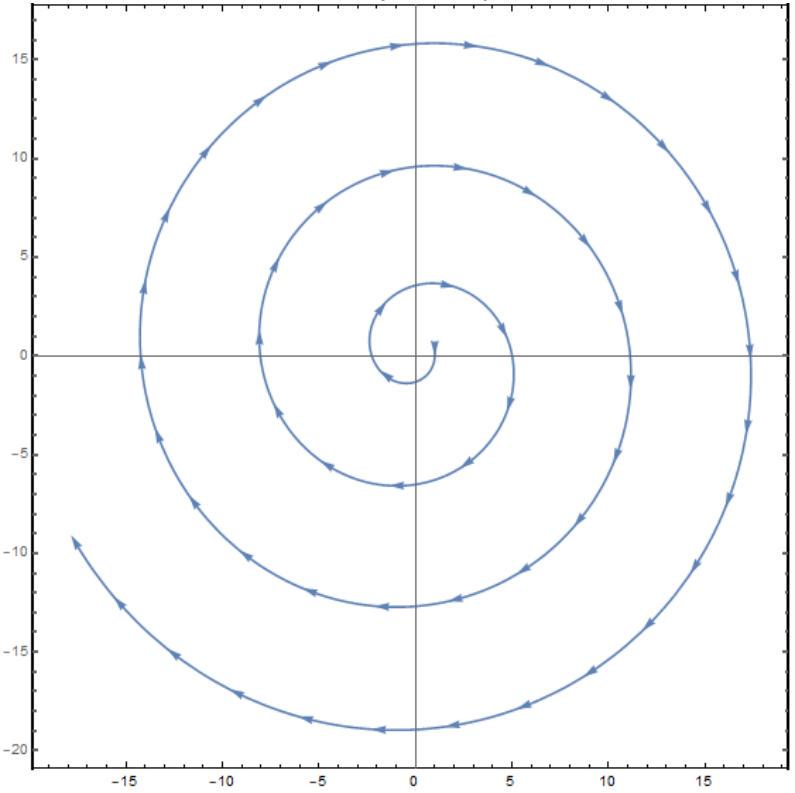

## A ball on a turntable Enkhbat Tsedenbaljir

## 1 Problem 1: 10 points

### 1.1 Preamble

Notations and conventions: The length of a vector $\vec { A }$ is simply denoted as $A \equiv$ $| \vec { A } |$. The time derivative of a quantity is denoted by the dot over the quantity: $\dot { \vec { A } } \equiv d \vec { A } / d t , \dot { A } \equiv d A / d t$. The unit vector along the direction of vector $\vec { A }$ is denoted as $\hat { A }$. The unit vectors along the Cartesian coordinates are, therefore, $\hat { x } , \hat { y }$ and $\hat { z }$. The definitions of scalar and vector products are:

$$
\begin{align*}
( \vec { A } \cdot \vec { B } ) & = ( \vec { B } \cdot \vec { A } ) = A _ { x } B _ { x } + A _ { y } B _ { y } + A _ { z } B _ { z } = A B \cos \theta ,  \tag{1}\\
( \vec { A } \times \vec { B } ) & = - ( \vec { B } \times \vec { A } )  \tag{2}\\
& = \left( A _ { y } B _ { z } - A _ { z } B _ { y } \right) \hat { x } + \left( A _ { z } B _ { x } - A _ { x } B _ { z } \right) \hat { y } + \left( A _ { x } B _ { x } - A _ { y } B _ { x } \right) \hat { z } ,  \tag{3}\\
| \vec { A } \times \vec { B } | & = A B \sin \theta , \tag{4}
\end{align*}
$$

where $\theta$ is the angle between $\vec { A }$ and $\vec { B }$. You may need the following properties of vectors and their multiplications: Scalar products of vectors vectors:

$$
\begin{align*}
& ( \vec { A } \cdot \vec { B } ) = ( \vec { B } \cdot \vec { A } ) \vec { B } - ( \vec { B } \cdot \vec { C } ) \vec { A } ,  \tag{5}\\
& ( \vec { A } \times \vec { B } ) \cdot \vec { C } = ( \vec { B } \times \vec { C } ) \cdot \vec { A } = ( \vec { C } \times \vec { A } ) \cdot \vec { B } . \tag{6}
\end{align*}
$$

Triple product rules for vectors:

$$
\begin{gather*}
( \vec { A } \times \vec { B } ) \times \vec { C } = ( \vec { A } \cdot \vec { C } ) \vec { B } - ( \vec { B } \cdot \vec { C } ) \vec { A } ,  \tag{7}\\
( \vec { A } \times \vec { B } ) \cdot \vec { C } = ( \vec { B } \times \vec { C } ) \cdot \vec { A } = ( \vec { C } \times \vec { A } ) \cdot \vec { B } . \tag{8}
\end{gather*}
$$

The vector products are very useful in describing many relations in physics. For example:

$$
\begin{gather*}
\vec { v } = \vec { \omega } \times \vec { r } ,  \tag{9}\\
\vec { F } _ { \text {Lorentz } } = Q \vec { B } \times \vec { v } , \tag{10}
\end{gather*}
$$

and, often, saves time combining three equations for vector components into a single equation.

### 1.2 The statement

A ball of mass $m$ and radius $r$ is rolling on a horizontal turntable without slipping. Its mass density has a spherical symmetry, i.e. only depends on the distance from its center. In part B and C, where the turntable can rotate freely, the moment of inertia of the turntable is denoted as $I _ { d }$. The purpose of the problem is to analyze the motion and trajectory of the ball with respect to an observer at rest. Throughout the problem, assume the turntable is large enough so that the ball does not fall off. The following notations are used:
$\Omega$ - the magnitude of the turntable angular velocity,
$\vec { \omega }$ - the spinning angular velocity of the ball with respect to its spinning axis,
$\vec { R }$ - the horizontal position of the ball center with respect to the rotation axis of the turn table,
$\vec { v } -$ the velocity of the ball at $\vec { R }$.
Assume that the initial position $\vec { R } _ { 0 } \equiv \vec { R } ( 0 )$ and velocity $\vec { v } _ { 0 } \equiv \vec { v } ( 0 )$ of the ball, the angular velocity of the turn table $\Omega _ { 0 } \equiv \Omega ( 0 )$ are known. For the initial vector quantities $\vec { R } _ { 0 } \equiv \vec { R } ( 0 )$ and $\vec { v } _ { 0 } \equiv \vec { v } ( 0 )$, assume that their directions are known. In addition, whenever you need to express a vector quantity, you may use $\hat { z }$ in your expression. Also, if asked to write your expression in terms of the known quantity you may use any or all of $m , r , I$ and $I _ { d }$. Unless otherwise stated, keep $I$ as general. The following notations are recommended:

$$
\begin{equation*}
\alpha = \frac { I } { I + m r ^ { 2 } } , \quad \delta = \frac { I _ { d } } { m r ^ { 2 } } , \tag{11}
\end{equation*}
$$

### 1.3 Part A: 2 points

First we start with the simplest case wherein the turntable angular velocity with respect to vertical axis $\hat { z }$ is constant, therefore $\Omega = \Omega _ { 0 }$.

## A1. 0.1 point

Express the ball's velocity $\vec { v }$ in terms of $\Omega , \vec { \omega } , r , m , I$ and $\vec { R }$ from a kinematic constraint.

## A. 20.2 point

Using Newton's equation and torque equation with respect to its center, find the acceleration of the ball $\vec { a } \equiv \dot { \vec { v } }$ in terms of $\Omega , \vec { v } , r , m$ and $I$.

## A. 30.2 points

Find the velocity $\vec { v }$ in terms of $\Omega , \vec { R } , \overrightarrow { v _ { 0 } } , \overrightarrow { R _ { 0 } } , r , m$ and $I$.

## A. 40.5 points

Find the trajectory of the ball. It means, for the given initial conditions $\vec { v } _ { 0 }$ and $\vec { R } _ { 0 }$, completely specify the trajectory.

## A. 51 point

Assume this time that the ball has a uniform mass density, i.e. $I = 2 m r ^ { 2 } / 5$. Trajectory you have found has a single defining parameter $R _ { t }$ for its size. Choose its magnitude to be the same as $R _ { 0 }$. How long does it take for the ball to approach the initial spot on the table (the position on the turntable at $t = 0$ ) with the closest distance?

### 1.4 Part B

In this part, the turntable can rotate freely, without any friction, around $z$-axis. Therefore its free rotation is hindered only by the ball's friction.

## B. 10.2 points

Find the velocity $\vec { v }$ and acceleration $\dot { \vec { v } }$ of the ball in terms of $\Omega , \vec { R } , \Omega _ { 0 } , \vec { R } _ { 0 } , \dot { \Omega }$, $r , m$ and $I$.

## B. 20.2 points

Find the magnitude of the angular acceleration of the turntable $\dot { \Omega }$ in terms of $\Omega , \Omega _ { 0 } , \vec { R } , \vec { R } _ { 0 } , \vec { v } _ { 0 } , r , m , I$ and $I _ { d }$. You may use the constants $\alpha$ and $\delta$ defined in the beginning of the problem.

## B. 30.4 points

Find the magnitude of the angular velocity of the turntable $\Omega$ as a function of R only, namely, in terms of $\Omega _ { 0 } , R , R _ { 0 } , r , m , I$ and $I _ { d }$.

## B. 40.1 points

From the result of B.3, for a given $\Omega _ { 0 } , R _ { 0 }$, find the maximum possible $\Omega$.

## B. 53.1 points

Write down the vertical component the angular momentum $\hat { z } M _ { z }$ of the whole system. Subtract any constant term and rename the remaining part as $\hat { z } L$.

In part B. 1 you found the velocity of the ball $\vec { v }$, which can be written as the sum of a part that depends on the position of the ball $\vec { R }$ and a constant vector. Let us call this constant vector $\vec { c }$. Choose the direction of $x$-axis along this vector and $y$-axis along $\hat { z } \times \vec { c }$. In this frame of reference, find $\Omega$ in terms of $L , \vec { R } , \vec { c } , \hat { z } , R ^ { 2 }$, $r , m , I$ and $I _ { d }$. Combining this with the result of B.3, write down an equation only containing $R ^ { 2 }$ and $y$ variables and $L , r , m , I , c$ and $I _ { d }$. Here $c$ is the magnitude of $\vec { c }$. Substituting $R ^ { 2 } = x ^ { 2 } + y ^ { 2 }$, write down an expression containing only $x$ and $y$ variables and describing a curve. From this, list all possible types of trajectories.

### 1.5 Part C: 4 points

In this part, we consider a density profile so that $I = m r ^ { 2 } / 10$. This can be realized, for example, if the ball is filled up to its half radius with uniform density and the

remaining part has a negligible mass. In addition, on its outer surface, the ball has a uniform charge density $Q / \left( 4 \pi r ^ { 2 } \right)$, where $Q$ is the total surface charge. The whole setup is in a uniform magnetic field $\vec { B }$ that is in $\hat { z }$ direction. The turntable rotates with constant $\Omega$ like in Part A.

It is often useful to analyze the equations governing the evolution of a system in a unitless form so that the general behavior can be studied without worrying about a specific values or units. For this purpose, we divide the $\vec { R }$ and $\Omega$ by 1 meter and 1 Hertz respectively. Also we divide the time variable by 1 second.

## C. 10.3 points

Write down Newton's equation and the torque equation for the ball. Find expression for the torque $\vec { \tau } _ { s }$ due to the spinning of the ball around its axis in terms of $Q , r , \vec { \omega }$ and $\vec { B }$.

## C. 20.2 points

Using the results of C.1, find expression for the linear acceleration of the ball with respect to the laboratory frame in terms of $Q , r , \vec { \omega }$ and $\vec { B }$.

## C. 30.3 points

The equation for the linear acceleration you found in part C. 2 is a second order differential equation for $\vec { R }$ of the following form:

$$
\begin{equation*}
\frac { d ^ { 2 } \vec { R } } { d t ^ { 2 } } - \gamma \frac { d \vec { R } } { d t } \times \hat { z } + \beta \vec { R } = 0 \tag{12}
\end{equation*}
$$

Write down $\gamma$ and $\beta$ constants. From now on we assume we have made the transformation to the unitless forms. This in turn, has an effect on the $\gamma$ and $\beta$ as factors of $1 / s = \mathrm { Hz }$ and $1 / s ^ { 2 }$ respectively, rendering them unitless as well. Make the following transformation to a polar coordinates for the components of $\vec { R }$ :

$$
\begin{align*}
& x ( t ) = \rho ( t ) \cos ( \eta ( t ) ) ,  \tag{13}\\
& y ( t ) = \rho ( t ) \sin ( \eta ( t ) ) , \tag{14}
\end{align*}
$$

so that the new equations do not have the first time derivative term. Here the polar angle $\eta ( t )$ is a function of time. Find the form of the form of this function. Express the coefficient $\beta ^ { \prime }$ of $\rho ( t )$ in the new equation in terms of $\gamma$ and $\beta$. Write down the conditions for different types of trajectories: harmonic, exponential etc.

## C. 41.5 points

Consider the following initial conditions for the solution found in part C.3:

$$
\begin{equation*}
x ( 0 ) = 1 , \quad y = 0 , \quad v _ { x } ( 0 ) = \left. \dot { x } \right| _ { t = 0 } = 1 , \quad , v _ { y } ( 0 ) = \left. \dot { y } \right| _ { t = 0 } = - 1 . \tag{15}
\end{equation*}
$$

find $\gamma$ and $\beta$. Using them find the corresponding $\Omega$. Sketch the trajectory. Is the charge of the surface negative or positive? For the negative write - and for the positive write + on your answer sheet.

## C. 51.5 points

Consider the solution you have found in part C.4. If you identified it correctly your solution should have a rotating $\vec { R } ( t )$. Find the expressions for the total and per rotation changes in energy for $N \gg 1$ number of rotations. Here you may ignore the terms small compared to $N$. In this part assume the mass and the radius of the ball are $m = 1$ and $r = 1$ so that $I = 1 / 11$ (in our unitless scheme we divide masses by 1 kg).

## 2 Solution

### 2.1 Part A

A. 1

The velocity of the ball $\vec { v } _ { b }$ with respect to the turntable from the non-slipping condition is given by:

$$
\begin{equation*}
\vec { v } _ { b } = \vec { \omega } \times ( r \hat { z } ) . \tag{16}
\end{equation*}
$$

The ball velocity with respect to the Lab frame is then

$$
\begin{equation*}
\vec { v } = \Omega \hat { z } \times \vec { R } + \vec { v } _ { b } , \vec { v } = \Omega \hat { z } \times \vec { R } + \vec { \omega } \times \hat { z } r . \tag{17}
\end{equation*}
$$

A. 2

The force $\vec { F }$ and torque $\vec { \tau }$ due to friction are:

$$
\begin{align*}
& \vec { F } = m \dot { \vec { v } }  \tag{18}\\
& \vec { \tau } = ( - r \hat { z } ) \times \vec { F } = I \frac { d \vec { \omega } } { d t } \tag{19}
\end{align*}
$$

The time derivative of equation (16) gives

$$
\begin{equation*}
\dot { \vec { v } } = \Omega \hat { z } \times \vec { v } + \frac { d \vec { \omega } } { d t } \times ( r \hat { z } ) \tag{20}
\end{equation*}
$$

and substituting Eq. (18) and (19) in results in:

$$
\begin{equation*}
\dot { \vec { v } } = \Omega \hat { z } \times \vec { v } - \frac { m r ^ { 2 } } { I } ( \hat { z } \times \dot { \vec { v } } ) \times \hat { z } . \tag{22}
\end{equation*}
$$

Using the triple vector product rule in the last term of the above equation and keeping in mind that both $\vec { v }$ and $d \vec { v } / d t$ are orthogonal to $\hat { z }$ yields

$$
\begin{align*}
& \dot { \vec { v } } = \Omega \hat { z } \times \vec { v } - \frac { m r ^ { 2 } } { I } \dot { \vec { v } } \rightarrow  \tag{23}\\
& \dot { \vec { v } } = \frac { \Omega } { 1 + m r ^ { 2 } / I } \hat { z } \times \vec { v } \tag{24}
\end{align*}
$$

A. 3

The last equation unequivocally shows that the motion of the ball is circular and the corresponding angular velocity of its center is $\frac { \Omega } { 1 + m a ^ { 2 } / I }$. Now we integrate this equation to find the radius and its center:

$$
\begin{align*}
& \vec { v } - \vec { v } _ { 0 } = \frac { \Omega } { 1 + m r ^ { 2 } / I } \hat { z } \times \left( \vec { R } - \vec { R } _ { 0 } \right) ,  \tag{25}\\
& \vec { v } = \frac { \Omega } { 1 + m r ^ { 2 } / I } \hat { z } \times \left( \vec { R } - \vec { R } _ { 0 } - \frac { 1 + m r ^ { 2 } / I } { \Omega } \hat { z } \times \vec { v } _ { 0 } \right) \rightarrow  \tag{26}\\
& \vec { v } = \frac { \Omega } { 1 + m r ^ { 2 } / I } \hat { z } \times \left( \vec { R } - \vec { R } _ { 0 } \right) + \vec { v } _ { 0 } \tag{27}
\end{align*}
$$

A. 4

From this we see that the circle trajectory has radius $R _ { t }$ and its center is located at

$$
\begin{array} { r }
\vec { R } _ { c } = \vec { R } _ { 0 } + \frac { 1 + m r ^ { 2 } / I } { \Omega } \hat { z } \times \vec { v } _ { 0 } . \\
R _ { t } = \left| \vec { R } _ { 0 } - \vec { R } _ { c } \right| = \frac { 1 + m r ^ { 2 } / I } { \Omega } | \hat { z } \times \vec { v } | = \frac { 1 + m r ^ { 2 } / I } { \Omega } v _ { 0 } \tag{29}
\end{array}
$$

A. 5

In the case of a solid ball of uniform density, the moment of inertia is

$$
\begin{equation*}
I = \frac { 2 m r ^ { 2 } } { 5 } , \tag{30}
\end{equation*}
$$

and therefore the angular velocity of the ball's center is

$$
\begin{equation*}
\omega _ { c } = \frac { 2 } { 7 } \Omega . \tag{31}
\end{equation*}
$$

The time to return the initial point on the turntable is then

$$
\begin{equation*}
t = \frac { 14 \pi } { \Omega } . \tag{32}
\end{equation*}
$$

This solution is true for most cases. But there are special cases where this time is shorter. Trajectory is a circle and its size is defined by its radius $R _ { t }$ and , as stated, we solve for $R _ { t } = R _ { 0 }$. It could happen that the red spot happens to cross path with the ball at a moment before the turntable could make a full circle. In this case we can find the distance between the starting and the crossing positions:

$$
\begin{align*}
& 2 R _ { 0 } \sin \left( \frac { \omega _ { c } t } { 2 } \right) = 2 R _ { t } \sin \left( \frac { 2 \pi - \Omega t } { 2 } \right) ,  \tag{33}\\
& t = \frac { 2 \pi } { \omega _ { c } + \Omega } = \frac { 14 \pi } { 9 \Omega } . \tag{34}
\end{align*}
$$

### 2.2 Part B

Now we examine the case wherein the turntable rotates freely, i.e. without friction, around vertical axis. In this case the total kinetic energy and the angular momentum are conserved.
B. 1

Integrating the torque equation for the ball one gets:

$$
\begin{equation*}
\vec { \omega } \times \hat { z } = \vec { \omega } _ { 0 } \times \hat { z } - \frac { m r } { I } \left( \vec { v } - \vec { v } _ { 0 } \right) . \tag{35}
\end{equation*}
$$

Substituting this into the non slipping condition we get

$$
\begin{align*}
& \vec { v } = \Omega \hat { z } \times \vec { R } + \vec { \omega } _ { 0 } \times \hat { z } r - \frac { m r } { I } \left( \vec { v } - \vec { v } _ { 0 } \right)  \tag{36}\\
& \vec { v } _ { 0 } = \Omega _ { 0 } \hat { z } \times \vec { R } _ { 0 } + \vec { \omega } ( 0 ) \times \hat { z } r \tag{37}
\end{align*}
$$

which gives

$$
\begin{align*}
\vec { v } & = \frac { I } { I + m r ^ { 2 } } \hat { z } \times \left( \Omega \vec { R } - \Omega _ { 0 } \vec { R } _ { 0 } \right) + \vec { v } _ { 0 }  \tag{38}\\
\dot { \vec { v } } & = \frac { I } { I + m r ^ { 2 } } \hat { z } \times ( \dot { \Omega } ( t ) \vec { R } + \Omega \vec { v } ) \tag{39}
\end{align*}
$$

B. 2

The torque equation for the turntable is:

$$
\begin{equation*}
I _ { d } \dot { \Omega } \hat { z } = - m \vec { R } \times \dot { \vec { v } } . \tag{40}
\end{equation*}
$$

If we substitute the velocity and accelaration in the above equation and use the triple vector product rule we get

$$
\begin{align*}
I _ { d } \dot { \Omega } \hat { z } & = - m \vec { R } \times \left( \frac { I } { I + m r ^ { 2 } } \hat { z } \times ( \dot { \Omega } \vec { R } + \Omega \vec { v } ) \right) \\
I _ { d } \dot { \Omega } & = - \frac { m I } { I + m r ^ { 2 } } \left( \dot { \Omega } R ^ { 2 } + \Omega ( \vec { v } \cdot \vec { R } ) \right) \tag{41}
\end{align*}
$$

$\vec { v } \cdot R$ can be obtained using equation 44 as:

$$
\begin{align*}
\vec { v } \cdot \vec { R } & = \left( \vec { v } _ { 0 } + \frac { I } { I + m r ^ { 2 } } \hat { z } \times \left( \Omega \vec { R } - \Omega _ { 0 } \vec { R } _ { 0 } \right) \right) \cdot \vec { R } ,  \tag{42}\\
& = \left( \vec { v } _ { 0 } - \frac { I } { I + m r ^ { 2 } } \Omega _ { 0 } \hat { z } \times \vec { R } _ { 0 } \right) \cdot \vec { R } . \tag{43}
\end{align*}
$$

Applying this to the turntable torque equation (41), we obtain:

$$
\begin{equation*}
\left( I _ { d } + \frac { m I } { I + m r ^ { 2 } } R ^ { 2 } \right) \dot { \Omega } = - \frac { m I } { I + m r ^ { 2 } } \Omega \left( \vec { v } _ { 0 } - \frac { I } { I + m r ^ { 2 } } \Omega _ { 0 } \hat { z } \times \vec { R } _ { 0 } \right) \cdot \vec { R } . \tag{44}
\end{equation*}
$$

We may rewrite the equation into a simpler form as:

$$
\begin{equation*}
\dot { \Omega } = - \frac { \alpha \Omega / r ^ { 2 } ( \vec { C } \cdot \vec { R } ) } { \delta + \alpha R ^ { 2 } / r ^ { 2 } } , \tag{45}
\end{equation*}
$$

where

$$
\begin{align*}
\alpha & \equiv \frac { I } { I + m r ^ { 2 } } ,  \tag{46}\\
\delta & \equiv \frac { I _ { d } } { m r ^ { 2 } } ,  \tag{47}\\
\vec { c } & \equiv \vec { v } _ { 0 } - \alpha \Omega _ { 0 } \hat { z } \times \vec { R } _ { 0 } . \tag{48}
\end{align*}
$$

B. 3

Observe that the velocity of the ball can be written as

$$
\begin{equation*}
\vec { v } = \alpha \Omega \hat { z } \times \vec { R } + \vec { c } , \tag{49}
\end{equation*}
$$

and, therefore, using equation (42) we see that:

$$
\begin{equation*}
\vec { v } \cdot \vec { R } = \frac { 1 } { 2 } \frac { d ( \vec { R } \cdot \vec { R } ) } { d t } = \frac { 1 } { 2 } \dot { R } ^ { 2 } = \vec { R } \cdot \vec { c } . \tag{50}
\end{equation*}
$$

Substituting this in equation (45) we get:

$$
\begin{equation*}
\frac { 1 } { \Omega } \frac { d \Omega } { d t } = - \frac { 1 } { 2 } \frac { 1 } { \delta + \alpha R ^ { 2 } / r ^ { 2 } } \frac { d \left( \alpha R ^ { 2 } / r ^ { 2 } \right) } { d t } . \tag{51}
\end{equation*}
$$

The integration of this leads to:

$$
\begin{align*}
\ln \left( \frac { \Omega } { \Omega _ { 0 } } \right) ^ { 2 } & = \ln \left( \frac { \delta + \alpha R _ { 0 } ^ { 2 } / r ^ { 2 } } { \delta + \alpha R ^ { 2 } / r ^ { 2 } } \right)  \tag{52}\\
\Omega ^ { 2 } & = \Omega _ { 0 } ^ { 2 } \frac { \delta + \alpha R _ { 0 } ^ { 2 } / r ^ { 2 } } { \delta + \alpha R ^ { 2 } / r ^ { 2 } } \tag{53}
\end{align*}
$$

B. 4 From this result we see that the maximum possible $\Omega$ is achieved when $R ^ { 2 }$, i.e when the ball crosses the center of the turntable:

$$
\begin{equation*}
\Omega _ { \max } = \Omega _ { 0 } \sqrt { 1 + \frac { \alpha R _ { 0 } ^ { 2 } } { \delta r ^ { 2 } } } \tag{54}
\end{equation*}
$$

## B. 5

Now we determine the trajectory of the ball. The total angular momentum along $\hat { z }$ is:

$$
\begin{equation*}
M _ { z } \hat { z } = I _ { d } \Omega \hat { z } + m \vec { R } \times \vec { v } + I \omega _ { z } \hat { z } . \tag{55}
\end{equation*}
$$

Since there is no torque along $\hat { z }$ acting on the ball $\omega _ { z }$ is constant. So we define the following conserved quantity:

$$
\begin{equation*}
L \hat { z } = I _ { d } \Omega \hat { z } + m \vec { R } \times \vec { v } = I _ { d } \Omega _ { 0 } \hat { z } + m \vec { R } _ { 0 } \times \vec { v } _ { 0 } . \tag{56}
\end{equation*}
$$

The velocity of the ball $\vec { v }$ was written as the sum of a part that depends on the position of the ball $\vec { R }$ and a constant vector $\vec { c }$. Then, we have:

$$
\begin{align*}
\vec { R } \times \vec { v } & = \vec { R } \times ( \alpha \Omega \hat { z } \times \vec { R } + \vec { c } )  \tag{57}\\
& = - \alpha \Omega R ^ { 2 } \hat { z } + \vec { R } \times \vec { c } . \tag{58}
\end{align*}
$$

Substituting this in equation (59) one gets:

$$
\begin{array} { r }
L \hat { z } = I _ { d } \Omega \hat { z } + \alpha \Omega m R ^ { 2 } \hat { z } + m \vec { R } \times \vec { c } , \\
\Omega = \frac { L - m \hat { z } \cdot ( \vec { R } \times \vec { c } ) } { I _ { d } + \alpha m R ^ { 2 } } \tag{60}
\end{array}
$$

Choosing the direction of $x$-axis along $\hat { c }$ and $y$-axis along $\hat { z } \times \hat { c }$,

$$
\begin{equation*}
\Omega = \frac { L / m r ^ { 2 } + c y / r ^ { 2 } } { \delta + \alpha R ^ { 2 } / r ^ { 2 } } , \tag{61}
\end{equation*}
$$

Combining this with equation (52) we have:

$$
\begin{align*}
\Omega _ { 0 } ^ { 2 } \frac { \delta + \alpha R _ { 0 } ^ { 2 } / r ^ { 2 } } { \delta + \alpha R ^ { 2 } / r ^ { 2 } } & = \left( \frac { L / m r ^ { 2 } + c y / r ^ { 2 } } { \delta + \alpha R ^ { 2 } / r ^ { 2 } } \right) ^ { 2 } ,  \tag{62}\\
\Omega _ { 0 } ^ { 2 } \left( \delta + \alpha R _ { 0 } ^ { 2 } / r ^ { 2 } \right) \left( \delta + \alpha R ^ { 2 } / r ^ { 2 } \right) & = \left( L / m r ^ { 2 } + c y / r ^ { 2 } \right) ^ { 2 } . \tag{63}
\end{align*}
$$

Observe that this is the equation for conic section. Let us elaborate on this fact. Let us introduce the following constants:

$$
\begin{equation*}
k \equiv \Omega _ { 0 } ^ { 2 } \left( \delta r ^ { 2 } + \alpha R _ { 0 } ^ { 2 } \right) , \lambda \equiv L / m . \tag{64}
\end{equation*}
$$

Expanding in Cartesian coordinates $\vec { R } = x \hat { x } + y \hat { y }$, we obtain:

$$
\begin{align*}
& k \alpha \left( \delta r ^ { 2 } + \alpha \left( x ^ { 2 } + y ^ { 2 } \right) \right) - \left( \lambda ^ { 2 } + 2 \lambda c y + c ^ { 2 } y ^ { 2 } \right) = 0  \tag{65}\\
& \quad k \alpha ^ { 2 } x ^ { 2 } + \left( k \alpha ^ { 2 } - c ^ { 2 } \right) y ^ { 2 } - 2 \lambda c y = \lambda ^ { 2 } - k \alpha \delta r ^ { 2 } \tag{66}
\end{align*}
$$

Since $k \alpha ^ { 2 } > 0$, the trajectory is determined by the sign of $k \alpha ^ { 2 } - c ^ { 2 }$ :

$$
\begin{align*}
& \text { Ellipse if } k \alpha ^ { 2 } > c ^ { 2 } .  \tag{67}\\
& \text { Parabola if } k \alpha ^ { 2 } = c ^ { 2 } .  \tag{68}\\
& \text { Hyperbola if } k \alpha ^ { 2 } < c ^ { 2 } . \tag{69}
\end{align*}
$$

### 2.3 Part C

C. 1

Here it is given that $\Omega =$ const . In addition, for the given mass distribution where the ball is filled up to half of its radius, the momentum of inertia becomes

$$
\begin{equation*}
I = \frac { m r ^ { 2 } } { 10 } . \tag{70}
\end{equation*}
$$

. In the presence of vertical uniform magnetic field $\vec { B }$ and if the ball is charged with uniform surface density $\rho = Q / 4 \pi r ^ { 2 }$, the equation of motions are changed as follows:

$$
\begin{align*}
& m \dot { \vec { v } } = \vec { F } _ { f } + Q \vec { v } \times \vec { B }  \tag{71}\\
& I \dot { \vec { \omega } } = - r \hat { z } \times \vec { F } _ { f } + \vec { \tau } _ { s } \tag{72}
\end{align*}
$$

where $\tau _ { s } = Q r ^ { 2 } \vec { \omega } \times \vec { B } / 3$ is the torque due to spinning of the charged sphere and $F _ { f }$ is the friction force. Calculation of $\tau _ { s }$ is essentially identical to the mechanical moment of inertia for thin spherical shell. The torque is calculated as:

$$
\begin{align*}
\vec { \tau } _ { s } & = \int d \cos \theta d \phi \rho \vec { r } \times ( ( \vec { \omega } \times \vec { r } ) \times \vec { B } )  \tag{73}\\
& = \int r ^ { 2 } d \cos \theta d \phi \rho ( \vec { \omega } \times \vec { r } ) ( \vec { r } \cdot \vec { B } )  \tag{74}\\
& = \rho \vec { \omega } \times \int r ^ { 2 } d \cos \theta d \phi \vec { r } ( \vec { r } \cdot \vec { B } )  \tag{75}\\
& = \rho B r ^ { 4 } \vec { \omega } \times \int d \cos \theta d \phi \cos \theta ( \sin \theta \cos \phi \hat { x } + \sin \theta \sin \phi \hat { y } + \cos \theta \hat { z } )  \tag{76}\\
& = \rho B r ^ { 4 } \vec { \omega } \times \hat { z } \int _ { - 1 } ^ { 1 } d \cos \theta \cos ^ { 2 } \theta \int _ { 0 } ^ { 2 \pi } d \phi  \tag{77}\\
& = \frac { Q r ^ { 2 } } { 3 } \vec { \omega } \times \vec { B } \tag{78}
\end{align*}
$$

In addition we have the non-slipping condition from which we get:

$$
\begin{align*}
& \vec { v } = \Omega \hat { z } \times \vec { R } + \omega \times \hat { z } r ,  \tag{79}\\
& \dot { \vec { v } } = \Omega \hat { z } \times \vec { v } + \dot { \vec { \omega } } \times \hat { z } r \rightarrow  \tag{80}\\
& \dot { \vec { \omega } } r = \Omega \vec { v } - \dot { \vec { v } } \times \hat { z } . \tag{81}
\end{align*}
$$

Substituting these and $F _ { f }$ from the Newton's equation into the torque equation, one gets:

$$
\begin{align*}
& I \dot { \vec { \omega } } = - r \hat { z } ( m \dot { \vec { v } } - Q \vec { v } \times \vec { B } ) + \frac { Q r ^ { 2 } } { 3 } \vec { \omega } \times \vec { B }  \tag{82}\\
& I ( \Omega \vec { v } + \hat { z } \times \dot { \vec { v } } ) = - r ^ { 2 } \hat { z } \times ( m \dot { \vec { v } } - Q \vec { v } \times \vec { B } ) + \frac { Q r ^ { 2 } B } { 3 } ( \vec { v } - \Omega \hat { z } \times \vec { R } )  \tag{83}\\
& \left( I + m r ^ { 2 } \right) \dot { \vec { v } } = \left( \frac { 4 Q r ^ { 2 } B } { 3 } - I \Omega \right) \vec { v } \times \hat { z } - \frac { Q r ^ { 2 } B } { 3 } \Omega \vec { R } . \tag{84}
\end{align*}
$$

The last equation maybe written as:

$$
\begin{equation*}
\frac { d ^ { 2 } \vec { R } } { d t ^ { 2 } } - \gamma \frac { d \vec { R } } { d t } \times \hat { z } + \beta \vec { R } = 0 \tag{85}
\end{equation*}
$$

where

$$
\begin{align*}
& \beta \equiv \frac { Q r ^ { 2 } B } { 3 \left( I + m r ^ { 2 } \right) }  \tag{86}\\
& \gamma \equiv \frac { 4 Q r ^ { 2 } B - 3 I \Omega } { 3 \left( I + m r ^ { 2 } \right) } = \frac { 4 \beta } { \Omega } - \alpha \Omega . \tag{87}
\end{align*}
$$

C. 3

Here we divide $\vec { R }$ and $\Omega$ respectively by 1 meter and 1 Hz, so we will deal with unitless quantities. Then, in terms of components $\vec { R } = \{ x , y \}$, we have the following unitless equations:

$$
\begin{align*}
& \ddot { x } - \gamma \dot { y } + \beta x = 0 ,  \tag{88}\\
& \ddot { y } + \gamma \dot { x } + \beta y = 0 . \tag{89}
\end{align*}
$$

Substituting the following coordinate transformation

$$
\begin{align*}
& x ( t ) = \rho ( t ) \cos ( \eta ( t ) ) ,  \tag{90}\\
& y ( t ) = \rho ( t ) \sin ( \eta ( t ) ) , \tag{91}
\end{align*}
$$

in the component equation leads to

$$
\begin{align*}
& \ddot { \rho } + \left( \beta - \gamma \dot { \eta } - \dot { \eta } ^ { 2 } \right) \rho = 0 ,  \tag{92}\\
& \dot { \rho } ( \gamma + 2 \dot { \eta } ) = 0 . \tag{93}
\end{align*}
$$

The first equation comes from the requirement that the coefficients of $\cos \eta ( \sin \eta )$ and the terms containing first time derivative $\dot { \rho }$ and $\eta$ vanish separately. It is straightforward to see this is equivalent to both $\dot { x }$ and $\dot { y }$ terms vanish. From this we find:

$$
\begin{align*}
\eta & = - \frac { \gamma } { 2 } t + \phi  \tag{94}\\
\beta ^ { \prime } & \equiv \beta - \gamma \dot { \eta } - \dot { \eta } ^ { 2 } = \beta + \frac { \gamma ^ { 2 } } { 4 } \tag{95}
\end{align*}
$$

It is clear that for $\ddot { \rho } + \beta ^ { \prime } \rho = 0$ one gets three distinct behavior for $\rho ( t )$ :

$$
\begin{align*}
& \beta ^ { \prime } > 0 , \text { for harmonic oscillation }  \tag{96}\\
& \beta ^ { \prime } < 0 , \text { for exponential run away }  \tag{97}\\
& \beta ^ { \prime } = 0 \tag{98}
\end{align*}
$$

We examine the case $\beta ^ { \prime } = 0$ in part C.4.
C. 4

If $\beta ^ { \prime } = 0$ we have $\beta = - \frac { \gamma ^ { 2 } } { 4 }$. Therefore, $\ddot { \rho } = 0$ and we have $\rho ( t ) = A + D t$, where $A$ and $D$ are constants to be determined.

From the initial conditions

$$
\begin{equation*}
x ( 0 ) = 1 , \quad y = 0 , \quad v _ { x } ( 0 ) = \left. \dot { x } \right| _ { t = 0 } = 1 , \quad , v _ { y } ( 0 ) = \left. \dot { y } \right| _ { t = 0 } = - 1 . \tag{99}
\end{equation*}
$$

we find:

$$
\begin{equation*}
A = 1 , \quad D = 1 , \quad \gamma = 2 , \quad \beta = - 1 . \tag{100}
\end{equation*}
$$

Then the solution for the coordinates are:

$$
\begin{equation*}
x ( t ) = ( 1 + t ) \cos ( t ) , \quad y ( t ) = - ( 1 + t ) \sin ( t ) . \tag{101}
\end{equation*}
$$

From this, the length of $\vec { R }$ can be calculated:

$$
\begin{equation*}
R ^ { 2 } = x ( t ) ^ { 2 } + y ( t ) ^ { 2 } = ( 1 + t ) ^ { 2 } . \tag{102}
\end{equation*}
$$

Using the definitions of $\beta$ and $\gamma$, the solutions for $\Omega$ are found as:

$$
\begin{equation*}
\Omega = - 11 \pm \sqrt { 77 } . \tag{103}
\end{equation*}
$$

Since the both solutions for $\Omega < 0$ and $B > 0$ ( $\vec { B }$ is in $\hat { z }$ direction), from $\beta < 0$ we see that $Q < 0$.
C. 6

From the solution we see that for every $t = 2 \pi$ time $\vec { R }$ makes one revolution. After $N \gg 1$ rotations, $R ^ { 2 } = ( 1 + t ) ^ { 2 } = t ^ { 2 }$ or $R = 1 + t$ and we find the change in $R$ per rotation to be $\Delta R = \Delta t = 2 \pi$.

Scalar multiplying the acceleration by velocity and integrating it we obtain:

$$
\begin{align*}
& \vec { v } \cdot \dot { \vec { v } } = - \beta \vec { v } \cdot \vec { R } \rightarrow  \tag{104}\\
& v ^ { 2 } - v _ { 0 } ^ { 2 } = - \beta \left( R ^ { 2 } - R _ { 0 } ^ { 2 } \right) = t ^ { 2 } . \tag{105}
\end{align*}
$$

Then the total and per rotation changes in the kinetic energy associated to the motion of the ball's center per rotation are:

$$
\begin{align*}
& \vec { v } \cdot \dot { \vec { v } } = \beta \dot { \vec { R } } \cdot \vec { R } \rightarrow  \tag{106}\\
& \Delta K = \frac { v ^ { 2 } - v _ { 0 } ^ { 2 } } { 2 } = \left( \frac { R ^ { 2 } - R _ { 0 } ^ { 2 } } { 2 } \right) = \frac { t ^ { 2 } } { 2 } ,  \tag{107}\\
& \Delta K _ { N } = \frac { v _ { N + 1 } ^ { 2 } - v _ { N } ^ { 2 } } { 2 } = \Delta \left( \frac { R ^ { 2 } } { 2 } \right) = t \Delta t = 4 \pi ^ { 2 } N . \tag{108}
\end{align*}
$$

Now we estimate the change in the kinetic energy associated with the spinning of the ball. From non-slipping condition we get

$$
\begin{equation*}
\omega ^ { 2 } = v ^ { 2 } + \Omega ^ { 2 } R ^ { 2 } + 2 \Omega \vec { v } \cdot ( \hat { z } \times \vec { R } ) . \tag{109}
\end{equation*}
$$

For our initial condition $\vec { v } _ { 0 } \cdot \left( \hat { z } \times \vec { R } _ { 0 } \right) = - v _ { 0 } R _ { 0 }$ and, for large $N , \vec { v }$ and $\vec { R }$ are approximately orthogonal to a very good approximation, so $\vec { v } \cdot ( \hat { z } \times \vec { R } ) = - v R$. Our calculated $\Omega < 0$, so we can write this term as $| \Omega | v R$. So the kinetic energy for spinning and its change are

$$
\begin{align*}
& K _ { s } = \frac { I \omega ^ { 2 } } { 2 } = \frac { I \left( v ^ { 2 } + \Omega ^ { 2 } R ^ { 2 } + 2 | \Omega | v R \right) } { 2 }  \tag{110}\\
& \Delta K _ { s } = \frac { I \left( \left( v ^ { 2 } - v _ { 0 } ^ { 2 } + \Omega ^ { 2 } \left( R ^ { 2 } - R _ { 0 } ^ { 2 } \right) + 2 | \Omega | \left( v R - v _ { 0 } R _ { 0 } \right) \right) \right. } { 2 } . \tag{111}
\end{align*}
$$

Finally, combining all the results we have:

$$
\begin{align*}
\Delta E & = \frac { I \left( \omega ^ { 2 } - \omega _ { 0 } ^ { 2 } \right) } { 2 } + \Delta K \simeq \frac { I \left( v ^ { 2 } + \Omega ^ { 2 } R ^ { 2 } + 2 | \Omega | v R \right) } { 2 } + \frac { t ^ { 2 } } { 2 } ,  \tag{112}\\
& = \frac { t ^ { 2 } } { 2 } \left( \frac { ( 1 + | \Omega | ) ^ { 2 } } { 11 } + 1 \right) ,  \tag{113}\\
\Delta E _ { N } & = \frac { I \left( \omega _ { N } ^ { 2 } - \omega _ { N - 1 } ^ { 2 } \right) } { 2 } + \Delta K _ { N }  \tag{114}\\
& = 4 \pi N \left( \frac { ( 1 + | \Omega | ) ^ { 2 } } { 11 } + 1 \right) \text { with: }  \tag{115}\\
| \Omega | & = | 11 \pm \sqrt { 77 } | . \tag{116}
\end{align*}
$$

The sketch of the trajectory looks like

## References

[1] Warren Weckesser , "A ball rolling on a freely spinning turntable" AM. J. Phys. 65 (8), 736-738(1997).
[2] Luis Rodriguez, Comment on "A ball rolling on a freely spinning turntable" by Warren Weckesser AM. J. Phys. 66 (10), 927 (1998).
[3] Hector A. Munera, "A ball rolling on a freely spinning turntable: Insights from a solution in polar coordinates" Latin American Journal of Physical Education Vol. 5 (1), 49 (2011).
