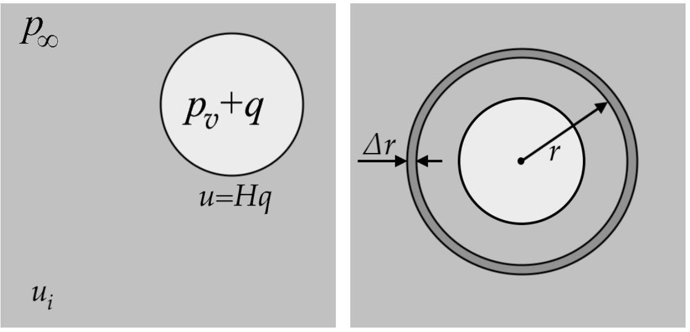
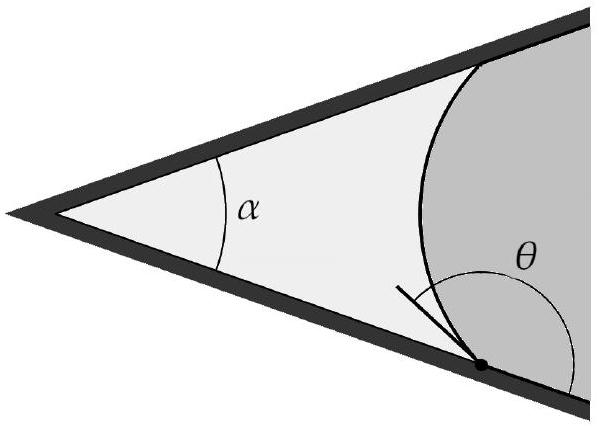

## CAVITATION: A POSSIBLE SOLUTION

TSOGTGEREL GANTUMUR

Note: The chosen units might be a bit different from the "official" problem statement. For instance, we might write $1 \mu \mathrm {~m}$ for $10 ^ { - 6 } \mathrm {~m}$. "Table 1" refers to the "notation table" from the statement.

A1. By performing a simple dimensional analysis, estimate the collapse time $\tau$ of a pure vapour bubble, in terms of bubble's initial radius $R _ { 0 }$, water density $\rho$, water pressure $p _ { \infty }$, and the vapour pressure $p _ { v }$. Evaluate the formula when $R _ { 0 } = 1 \mathrm {~mm}$ and the quantities $\rho$, $p _ { \infty }$ and $p _ { v }$ take their typical values from Table 1. Assume no surface tension: $\sigma = 0$.

Solution. It is reasonable to expect that the bubble would not collapse if $p _ { \infty } \leq p _ { v }$. Hence we take $p _ { \infty } > p _ { v }$, and presume that the difference $p _ { \infty } - p _ { v }$ will feature in the final formula. The dimensions of the quantities are

$$
\begin{equation*}
\left[ R _ { 0 } \right] = \mathrm { m } , \quad [ \rho ] = \mathrm { kg } / \mathrm { m } ^ { 3 } , \quad \left[ p _ { \infty } - p _ { v } \right] = \mathrm { N } / \mathrm { m } ^ { 2 } = \mathrm { kg } / \left( \mathrm { m } \cdot \mathrm {~s} ^ { 2 } \right) . \tag{1}
\end{equation*}
$$

The only combination of these that has the dimension of time is

$$
\begin{equation*}
\tau \sim R _ { 0 } \sqrt { \frac { \rho } { p _ { \infty } - p _ { v } } } \approx 0.1 \mathrm {~s} . \tag{2}
\end{equation*}
$$

A2. Suppose that a micro-bubble consisting of air and vapour, with radius $R _ { 0 } = 10 \mu \mathrm {~m}$, is in equilibrium when the external pressure $p _ { \infty } = 100 \mathrm { kPa }$. Find the partial pressure $q _ { 0 }$ of air in the bubble. Now suppose that the external pressure $p _ { \infty }$ was gradually decreased, and that the air inside the bubble follows an isothermal process. Find the critical pressure $p _ { c }$, defined by the condition that if $p _ { \infty } < p _ { c }$ the bubble size grows without bound. The quantities $p _ { v }$ and $\sigma$ take their typical values from Table 1.

Solution. The pressure equilibrium condition is

$$
\begin{equation*}
p _ { v } + q = p _ { \infty } + \frac { 2 \sigma } { R } , \tag{3}
\end{equation*}
$$

which, under $R = R _ { 0 }$ and $q = q _ { 0 }$, yields

$$
\begin{equation*}
q _ { 0 } = p _ { \infty } - p _ { v } + \frac { 2 \sigma } { R _ { 0 } } \approx 170 \mathrm { kPa } . \tag{4}
\end{equation*}
$$

On the other hand, taking into account the isothermal law

$$
\begin{equation*}
q _ { 0 } R _ { 0 } ^ { 3 } = q R ^ { 3 } , \tag{5}
\end{equation*}
$$

we get

$$
\begin{equation*}
p _ { \infty } = p _ { v } + \frac { q _ { 0 } R _ { 0 } ^ { 3 } } { R ^ { 3 } } - \frac { 2 \sigma } { R } . \tag{6}
\end{equation*}
$$

The critical pressure corresponds to the minimum of $p _ { \infty }$ as a function of $R$. The radius at the minimum is easily found to be

$$
\begin{equation*}
R _ { c } = R _ { 0 } \sqrt { \frac { 3 q _ { 0 } R _ { 0 } } { 2 \sigma } } \approx 60 \mu \mathrm {~m} , \tag{7}
\end{equation*}
$$

and the corresponding pressure is

$$
\begin{equation*}
p _ { c } = p _ { v } - 2 q _ { 0 } \left( \frac { R _ { 0 } } { R _ { c } } \right) ^ { 3 } \approx 700 \mathrm {~Pa} . \tag{8}
\end{equation*}
$$

B1. Suppose that a single spherical bubble resides within water that fills space uniformly, and that the bubble may evolve in size without distorting its spherical shape, due to changes, e.g., in the external pressure $p _ { \infty }$. Derive an equation that relates the bubble radius $R ( t )$ and its time derivatives $R ^ { \prime } ( t )$ and $R ^ { \prime \prime } ( t )$, surface tension $\sigma$, water density $\rho$, the pressure far from the bubble $p _ { \infty }$, and the pressure inside the bubble $p$. Then split the pressure $p$ into two terms, by assuming that the bubble has both vapour and air in it, and that the air follows an adiabatic process with exponent $\gamma$. To give a reference point, the partial air pressure must be $q _ { 0 }$ when the bubble size equals $R _ { 0 }$. Assume that evaporation, condensation, or transfer of air between the bubble cavity and the surrounding water has no effect on the water volume.

Solution. Let $v ( r , t )$ denote the radial velocity of the fluid element at the distance $r$ from the bubble center and at the time moment $t$. Let also $u ( t ) = v ( R , t )$, that is,

$$
\begin{equation*}
u ( t ) = R ^ { \prime } ( t ) . \tag{9}
\end{equation*}
$$

Then the incompressibility condition yields

$$
\begin{equation*}
v ( r , t ) = \frac { R ^ { 2 } u ( t ) } { r ^ { 2 } } , \tag{10}
\end{equation*}
$$

and hence

$$
\begin{equation*}
\frac { \partial v } { \partial t } = \frac { \partial } { \partial t } \frac { R ^ { 2 } u } { r ^ { 2 } } = \frac { 2 R } { r ^ { 2 } } u ^ { 2 } + \frac { R ^ { 2 } } { r ^ { 2 } } u ^ { \prime } . \tag{11}
\end{equation*}
$$

The radial acceleration can now be computed as

$$
\begin{equation*}
a = \frac { \partial v } { \partial t } + \frac { \partial v } { \partial r } v = \frac { R ^ { 2 } } { r ^ { 2 } } u ^ { \prime } + \frac { 2 R } { r ^ { 2 } } u ^ { 2 } - \frac { 2 R ^ { 4 } } { r ^ { 5 } } u ^ { 2 } . \tag{12}
\end{equation*}
$$

With $p = p ( r )$ denoting the pressure field (where possible time dependence is suppressed in the notation), Newton's law reads

$$
\begin{equation*}
\rho a = - p ^ { \prime } , \tag{13}
\end{equation*}
$$

or

$$
\begin{equation*}
\frac { R ^ { 2 } } { r ^ { 2 } } u ^ { \prime } + \left( \frac { 2 R } { r ^ { 2 } } - \frac { 2 R ^ { 4 } } { r ^ { 5 } } \right) u ^ { 2 } = - \frac { p ^ { \prime } } { \rho } . \tag{14}
\end{equation*}
$$

We integrate it from $r = R$ to $r = \infty$, to get

$$
\begin{equation*}
R u ^ { \prime } + \frac { 3 } { 2 } u ^ { 2 } = \frac { p ( R ) - p _ { \infty } } { \rho } . \tag{15}
\end{equation*}
$$

Since the pressure inside the bubble satisfies

$$
\begin{equation*}
p = p ( R ) + \frac { 2 \sigma } { R } , \tag{16}
\end{equation*}
$$

we conclude that

$$
\begin{equation*}
R R ^ { \prime \prime } + \frac { 3 } { 2 } \left( R ^ { \prime } \right) ^ { 2 } + \frac { 2 \sigma } { \rho R } = \frac { p - p _ { \infty } } { \rho } . \tag{17}
\end{equation*}
$$

Finally, taking into account the fact that the bubble pressure $p$ consists of the vapour pressure $p _ { v }$ and the partial air pressure $q$, as

$$
\begin{equation*}
p = p _ { v } + q = p _ { v } + q _ { 0 } \left( \frac { R _ { 0 } } { R } \right) ^ { 3 \gamma } , \tag{18}
\end{equation*}
$$

we have

$$
\begin{equation*}
\rho R R ^ { \prime \prime } + \frac { 3 } { 2 } \rho \left( R ^ { \prime } \right) ^ { 2 } + \frac { 2 \sigma } { R } - \frac { q _ { 0 } R _ { 0 } ^ { 3 \gamma } } { R ^ { 3 \gamma } } = p _ { v } - p _ { \infty } . \tag{19}
\end{equation*}
$$

B2. A water tank under the external pressure $p _ { \infty } ^ { - } = 100 \mathrm { kPa }$, containing a nucleus of radius $R _ { 0 } = 10 \mu \mathrm {~m}$ initially in equilibrium, was exposed to vacuum, so that the system suddenly has $p _ { \infty } = 0$. Estimate the terminal (asymptotic) value of the growth speed $R ^ { \prime }$, as well as the time it reaches this terminal value.

Solution. Putting $R ^ { \prime \prime } = 0$ and $R \rightarrow \infty$ in (19) yields

$$
\begin{equation*}
R ^ { \prime } ( \infty ) = \sqrt { \frac { 2 \left( p _ { v } - p _ { \infty } \right) } { 3 \rho } } = \sqrt { \frac { 2 p _ { v } } { 3 \rho } } \approx 1.24 \mathrm {~m} / \mathrm { s } . \tag{20}
\end{equation*}
$$

The initial acceleration can also be found from (19) as

$$
\begin{equation*}
R ^ { \prime \prime } ( 0 ) = \frac { q _ { 0 } + p _ { v } - 2 \sigma / R _ { 0 } } { \rho R _ { 0 } } = \frac { p _ { \infty } ^ { - } } { \rho R _ { 0 } } \approx 10 ^ { 7 } \mathrm {~m} / \mathrm { s } ^ { 2 } , \tag{21}
\end{equation*}
$$

and hence the time for the speed to be stabilized can be estimated as

$$
\begin{equation*}
t = \frac { R ^ { \prime } ( \infty ) } { R ^ { \prime \prime } ( 0 ) } \approx 0.1 \mu \mathrm {~s} . \tag{22}
\end{equation*}
$$

B3. A water tank under the external pressure $p _ { \infty } ^ { - } = 1600 \mathrm {~Pa}$, containing a gas bubble of radius $R _ { 0 } = 10 \mu \mathrm {~m}$ initially in equilibrium, was suddenly exposed to the atmospheric pressure $p _ { \infty } = 100 \mathrm { kPa }$. Estimate the minimum radius of the bubble before it rebounds.

Solution. Multiply (19) by $2 R ^ { 2 } R ^ { \prime }$ to get

$$
\begin{equation*}
\rho \left[ R ^ { 3 } \left( R ^ { \prime } \right) ^ { 2 } \right] ^ { \prime } + 4 \sigma R R ^ { \prime } - 2 q _ { 0 } R _ { 0 } ^ { 3 \gamma } R ^ { 2 - 3 \gamma } R ^ { \prime } = 2 \left( p _ { v } - p _ { \infty } \right) R ^ { 2 } R ^ { \prime } , \tag{23}
\end{equation*}
$$

or

$$
\begin{equation*}
\rho \left[ R ^ { 3 } \left( R ^ { \prime } \right) ^ { 2 } \right] ^ { \prime } + 2 \sigma \left( R ^ { 2 } \right) ^ { \prime } + \frac { 2 q _ { 0 } R _ { 0 } ^ { 3 \gamma } \left( R ^ { 3 - 3 \gamma } \right) ^ { \prime } } { 3 ( \gamma - 1 ) } = \frac { 2 } { 3 } \left( p _ { v } - p _ { \infty } \right) \left( R ^ { 3 } \right) ^ { \prime } . \tag{24}
\end{equation*}
$$

This can easily be integrated, from $R ( 0 ) = R _ { 0 }$ and $R ^ { \prime } ( 0 ) = 0$ to $R ( t ) = R$ and $R ^ { \prime } ( t ) = R ^ { \prime }$, which yields

$$
\begin{equation*}
\rho R ^ { 3 } \left( R ^ { \prime } \right) ^ { 2 } + 2 \sigma \left( R ^ { 2 } - R _ { 0 } ^ { 2 } \right) + \frac { 2 q _ { 0 } R _ { 0 } ^ { 3 \gamma } \left( R ^ { 3 - 3 \gamma } - R _ { 0 } ^ { 3 - 3 \gamma } \right) } { 3 ( \gamma - 1 ) } = \frac { 2 } { 3 } \left( p _ { v } - p _ { \infty } \right) \left( R ^ { 3 } - R _ { 0 } ^ { 3 } \right) , \tag{25}
\end{equation*}
$$

or

$$
\begin{equation*}
\rho \left( R ^ { \prime } \right) ^ { 2 } = \frac { 2 \left( p _ { v } - p _ { \infty } \right) } { 3 } - \frac { 2 \sigma } { R } + \frac { 2 R _ { 0 } ^ { 3 } } { R ^ { 3 } } \left( \frac { \sigma } { R _ { 0 } } + \frac { p _ { \infty } - p _ { v } } { 3 } + \frac { q _ { 0 } } { 3 ( \gamma - 1 ) } - \frac { q _ { 0 } R _ { 0 } ^ { 3 \gamma - 3 } } { 3 ( \gamma - 1 ) R ^ { 3 \gamma - 3 } } \right) . \tag{26}
\end{equation*}
$$

When $R \ll R _ { 0 }$, it shows first that

$$
\begin{equation*}
R ^ { \prime } \sim - R ^ { - 3 / 2 } , \tag{27}
\end{equation*}
$$

and moreover that the rebound radius satisfies

$$
\begin{equation*}
\left( \frac { R _ { 0 } } { R } \right) ^ { 3 ( \gamma - 1 ) } = \frac { ( \gamma - 1 ) \left( p _ { \infty } - p _ { v } + 3 \sigma / R _ { 0 } \right) } { q _ { 0 } } + 1 . \tag{28}
\end{equation*}
$$

Taking into account that

$$
\begin{equation*}
q _ { 0 } = p _ { \infty } ^ { - } - p _ { v } + 2 \sigma / R _ { 0 } \approx 10 \mathrm {~Pa} , \tag{29}
\end{equation*}
$$

we conclude that the rebound radius is

$$
\begin{equation*}
R \approx 0.4 \mu \mathrm {~m} . \tag{30}
\end{equation*}
$$

B4. If there is no gas other than water vapour present in a bubble, the bubble completely collapses in finite time. Determine the characteristic exponent $\alpha$ in

$$
\begin{equation*}
R ( t ) \sim ( T - t ) ^ { \alpha } , \tag{31}
\end{equation*}
$$

where $T$ is the collapse time.
Solution. We have found in the previous part that

$$
\begin{equation*}
R ^ { \prime } \sim - R ^ { - 3 / 2 } . \tag{32}
\end{equation*}
$$

Putting $R ( t ) \sim ( T - t ) ^ { \alpha }$ into it we get

$$
\begin{equation*}
( T - t ) ^ { \alpha - 1 } \sim - ( T - t ) ^ { - 3 \alpha / 2 } \tag{33}
\end{equation*}
$$

or

$$
\begin{equation*}
\alpha = \frac { 2 } { 5 } . \tag{34}
\end{equation*}
$$

B5. Based on the equation derived in Part 3, find the natural frequency of the spherical oscillation of a bubble of radius $R _ { 0 } = 0.1 \mathrm {~mm}$.

Solution. Introducing the new variable $x$ by $R = R _ { 0 } x$, we write (19) as

$$
\begin{equation*}
\rho R _ { 0 } ^ { 2 } x x ^ { \prime \prime } + \frac { 3 } { 2 } \rho R _ { 0 } ^ { 2 } \left( x ^ { \prime } \right) ^ { 2 } + \frac { 2 \sigma } { R _ { 0 } x } - q _ { 0 } x ^ { - 3 \gamma } = p _ { v } - p _ { \infty } . \tag{35}
\end{equation*}
$$

Now put $x = 1 + y$ and retain the terms up to linear in $y$, to have

$$
\begin{equation*}
\rho R _ { 0 } ^ { 2 } y ^ { \prime \prime } + \frac { 2 \sigma } { R _ { 0 } } ( 1 - y ) - q _ { 0 } ( 1 - 3 \gamma y ) = p _ { v } - p _ { \infty } . \tag{36}
\end{equation*}
$$

Taking into account the equilibrium condition

$$
\begin{equation*}
\frac { 2 \sigma } { R _ { 0 } } - q _ { 0 } = p _ { v } - p _ { \infty } \tag{37}
\end{equation*}
$$

we infer

$$
\begin{equation*}
y ^ { \prime \prime } + \frac { 3 \gamma q _ { 0 } - 2 \sigma / R _ { 0 } } { \rho R _ { 0 } ^ { 2 } } y = 0 . \tag{38}
\end{equation*}
$$

Thus the bubble is unstable if

$$
\begin{equation*}
3 \gamma q _ { 0 } \leq 2 \sigma / R _ { 0 } = q _ { 0 } + p _ { v } - p _ { \infty } , \tag{39}
\end{equation*}
$$

or equivalently, if

$$
\begin{equation*}
p _ { \infty } \leq p _ { v } - ( 3 \gamma - 1 ) q _ { 0 } . \tag{40}
\end{equation*}
$$

On the other hand, if $p _ { \infty } > p _ { v } - ( 3 \gamma - 1 ) q _ { 0 }$ then the bubble oscillates with the natural frequency

$$
\begin{equation*}
f _ { 0 } = \frac { 1 } { 2 \pi R _ { 0 } } \sqrt { \frac { ( 3 \gamma - 1 ) q _ { 0 } + p _ { \infty } - p _ { v } } { \rho } } \approx 33 \mathrm { kHz } . \tag{41}
\end{equation*}
$$

B6. Suppose that the bubble described in the previous part is subjected to a standing sound wave along the $x$-axis, whose pressure field is given by

$$
\begin{equation*}
p ( x , t ) = p _ { 0 } + A \sin \left( \frac { 2 \pi f } { c } ( x + a ) \right) \sin ( 2 \pi f t ) , \tag{42}
\end{equation*}
$$

where $f$ is the frequency, and $c$ is the speed of sound. The parameters $p _ { 0 } , A$, and $a$ are constants, whose meanings may readily be deduced from the equation. Find the average force exerted upon the bubble. The bubble is situated at the origin of the $x y z$ coordinate system, and its size is much smaller than the wavelength of the sound.

Solution. Small oscillation of the bubble is described by

$$
\begin{equation*}
\rho R _ { 0 } ^ { 2 } \left( y ^ { \prime \prime } + 4 \pi ^ { 2 } f _ { 0 } ^ { 2 } y \right) = A \sin \left( \frac { 2 \pi f } { c } a \right) \sin ( 2 \pi f t ) . \tag{43}
\end{equation*}
$$

Looking for the solution in the form

$$
\begin{equation*}
y ( t ) = B \sin ( 2 \pi f t ) , \tag{44}
\end{equation*}
$$

we find

$$
\begin{equation*}
B = \frac { A \sin ( 2 \pi f a / c ) } { 4 \pi ^ { 2 } \rho R _ { 0 } ^ { 2 } \left( f _ { 0 } ^ { 2 } - f ^ { 2 } \right) } . \tag{45}
\end{equation*}
$$

Since

$$
\begin{equation*}
R ( t ) = R _ { 0 } + R _ { 0 } y ( t ) , \tag{46}
\end{equation*}
$$

the volume of the bubble is

$$
\begin{equation*}
V ( t ) = \frac { 4 \pi } { 3 } R ( t ) ^ { 3 } \approx \frac { 4 \pi } { 3 } R _ { 0 } ^ { 3 } [ 1 + 3 y ( t ) ] . \tag{47}
\end{equation*}
$$

Now recalling that the average force is

$$
\begin{equation*}
F = - \left\langle V \frac { \partial p } { \partial x } \right\rangle , \tag{48}
\end{equation*}
$$

where the average is taken over time, and that the pressure gradient is

$$
\begin{equation*}
\frac { \partial p } { \partial x } = \frac { 2 \pi f A } { c } \cos \left( \frac { 2 \pi f } { c } a \right) \sin ( 2 \pi f t ) , \tag{49}
\end{equation*}
$$

we conclude

$$
\begin{equation*}
F = - \frac { f A ^ { 2 } R _ { 0 } } { 2 \rho c \left( f _ { 0 } ^ { 2 } - f ^ { 2 } \right) } \sin \left( \frac { 4 \pi f a } { c } \right) . \tag{50}
\end{equation*}
$$

C1. Suppose that a nucleus consisting of air and vapour, with radius $R _ { 0 } = 10 \mu \mathrm {~m}$, is placed in water-air solution, in which the dissolved air is in equilibrium with the atmospheric pressure above the water. The partial pressure of air in the bubble is $q = 170 \mathrm { kPa }$, and the vapour pressure can be neglected. Estimate the time required for the bubble to be completely resorbed into water. The quantities $p _ { \infty } , \kappa , \delta$ and $\sigma$ take their typical values from Table 1. Assume that the region surrounding the bubble in which air diffusion takes place immediately gets much larger than the bubble itself.

Solution. From Henry's law, the initial concentration of dissolved air in the body of water is

$$
\begin{equation*}
u _ { i } = H p _ { \infty } \approx 0.024 \mathrm {~kg} / \mathrm { m } ^ { 3 } , \tag{51}
\end{equation*}
$$

and the initial concentration of dissolved air in the immediate vicinity of the bubble is

$$
\begin{equation*}
u = H q \approx 0.041 \mathrm {~kg} / \mathrm { m } ^ { 3 } . \tag{52}
\end{equation*}
$$

Since $u > u _ { i }$, there will be diffusive flux directed away from the bubble, and the bubble will start losing air. As a result, the bubble shrinks and the surface tension term $2 \sigma / R$ increases. Since the external pressure $p _ { \infty }$ is constant, the partial air pressure $q$ increases, which leads to more diffusive flux. In the end, the bubble will get completely resorbed into water.

To quantify the diffusion of air, let us consider the region enclosed by concentric spheres of radii $r$ and $r + \Delta r$ with $\Delta r$ small. The rate of change of air mass in this region is

$$
\begin{equation*}
\frac { d m } { d t } = 4 \pi r ^ { 2 } \Delta r \frac { \partial u } { \partial t } , \tag{53}
\end{equation*}
$$

Figure 1. (a) Initial configuration of the system (b) The geometry used in the solution

where $4 \pi r ^ { 2 } \Delta r$ is the volume of the region and the air concentration $u = u ( r , t )$ is a function of $r$ and $t$. On the other hand, the same quantity can be computed as the difference between the diffusive fluxes through the concentric spheres:

$$
\begin{align*}
\frac { d m } { d t } & = 4 \pi ( r + \Delta r ) ^ { 2 } J ( r + \Delta r ) - 4 \pi r ^ { 2 } J ( r ) \\
& = 4 \pi ( r + \Delta r ) ^ { 2 } \kappa \frac { \partial u } { \partial r } ( r + \Delta r ) - 4 \pi r ^ { 2 } \kappa \frac { \partial u } { \partial r } ( r )  \tag{54}\\
& \approx 4 \pi r ^ { 2 } \kappa \Delta r \frac { \partial ^ { 2 } u } { \partial r ^ { 2 } } ( r ) + 8 \pi r \kappa \Delta r \frac { \partial u } { \partial r } ( r )
\end{align*}
$$

where we have taken into account the directions of the fluxes, and the fact that

$$
\begin{equation*}
\frac { \partial u } { \partial r } ( r + \Delta r ) \approx \frac { \partial u } { \partial r } ( r ) + \Delta r \frac { \partial ^ { 2 } u } { \partial r ^ { 2 } } ( r ) . \tag{55}
\end{equation*}
$$

Comparing the two equations, we infer

$$
\begin{equation*}
\frac { \partial u } { \partial t } = \kappa \frac { \partial ^ { 2 } u } { \partial r ^ { 2 } } + \frac { 2 \kappa } { r } \frac { \partial u } { \partial r } . \tag{56}
\end{equation*}
$$

The dissolved air concentration in water at the initial time moment $t = 0$ is uniformly $u _ { i }$, and assuming that the radius $R$ of the bubble remains constant, the air concentration in the immediate vicinity of the bubble should be equal to $H q$ :

$$
\begin{cases} u ( r , 0 ) = u _ { i } & \text { for } r > R  \tag{57}\\ u ( R , t ) = H q & \text { for } t > 0 . \end{cases}
$$

Introducing a new variable $v = r ( u - q H )$, and a new time parameter $\tau = \kappa t$, the diffusion equation (56) becomes

$$
\begin{equation*}
\frac { \partial v } { \partial \tau } = \frac { \partial ^ { 2 } v } { \partial r ^ { 2 } } , \tag{58}
\end{equation*}
$$

with

$$
\begin{cases} v ( r , 0 ) = r \left( u _ { i } - q H \right) & \text { for } r > R ,  \tag{59}\\ v ( R , \tau ) = 0 & \text { for } \tau > 0 . \end{cases}
$$

We can go further by introducing

$$
\begin{equation*}
\xi = r - R \quad \text { and } \quad w ( \xi , \tau ) = v ( R + \xi , \tau ) , \tag{60}
\end{equation*}
$$

to write (56) as

$$
\begin{equation*}
\frac { \partial w } { \partial \tau } = \frac { \partial ^ { 2 } w } { \partial \xi ^ { 2 } } , \tag{61}
\end{equation*}
$$

with

$$
\begin{cases} w ( \xi , 0 ) = ( R + \xi ) \left( u _ { i } - q H \right) & \text { for } \xi > 0  \tag{62}\\ w ( 0 , \tau ) = 0 & \text { for } \tau > 0 \end{cases}
$$

The solution to this problem is

$$
\begin{equation*}
w ( \xi , \tau ) = \frac { u _ { i } - q H } { \sqrt { 4 \pi \tau } } \int _ { 0 } ^ { \infty } \left( e ^ { - ( \xi - \eta ) ^ { 2 } / ( 4 \tau ) } - e ^ { - ( \xi + \eta ) ^ { 2 } / ( 4 \tau ) } \right) ( \eta + R ) d \eta \tag{63}
\end{equation*}
$$

Since

$$
\begin{equation*}
u ( r , t ) = q H + \frac { v ( r , \kappa t ) } { r } = q H + \frac { w ( r - R , \kappa t ) } { r } , \tag{64}
\end{equation*}
$$

we have

$$
\begin{equation*}
\frac { \partial u } { \partial r } = \frac { 1 } { r } \frac { \partial w } { \partial \xi } - \frac { w } { r ^ { 2 } } , \tag{65}
\end{equation*}
$$

and hence

$$
\begin{equation*}
\left. \frac { \partial u } { \partial r } \right| _ { r = R } = \left. \frac { 1 } { R } \frac { \partial w } { \partial \xi } \right| _ { \xi = 0 } = \left( u _ { i } - q H \right) \left( \frac { 1 } { R } + \frac { 1 } { \sqrt { \pi \kappa t } } \right) . \tag{66}
\end{equation*}
$$

The second term corresponds to the width of the diffusion layer surrounding the bubble, which we assume to be much larger than the bubble itself. Hence the rate of change of the mass of the bubble can be estimated as

$$
\begin{equation*}
\frac { d m } { d t } = \left. 4 \pi R ^ { 2 } \kappa \frac { \partial u } { \partial r } \right| _ { r = R } \approx 4 \pi \kappa R \left( u _ { i } - q H \right) . \tag{67}
\end{equation*}
$$

On the other hand, the mass of the bubble is related to the air density, which in turn is proportional to the pressure:

$$
\begin{equation*}
m = \frac { 4 \pi } { 3 } R ^ { 3 } \delta = \frac { 4 \pi } { 3 } R ^ { 3 } \cdot \frac { \delta _ { 0 } q } { p _ { \infty } } , \tag{68}
\end{equation*}
$$

where $\delta _ { 0 } = 1.2 \mathrm {~kg} / \mathrm { m } ^ { 3 }$ is the air density at the atmospheric pressure $p _ { \infty } = 10 ^ { 5 } \mathrm {~Pa}$. Furthermore, neglecting vapour pressure, we have the mechanical equilibrium condition

$$
\begin{equation*}
q = p _ { \infty } + \frac { 2 \sigma } { R } , \tag{69}
\end{equation*}
$$

leading to

$$
\begin{equation*}
m = \frac { 4 \pi } { 3 } R ^ { 3 } \cdot \left( \delta _ { 0 } + \frac { \varepsilon } { R } \right) , \tag{70}
\end{equation*}
$$

with

$$
\begin{equation*}
\varepsilon = \frac { 2 \sigma \delta _ { 0 } } { p _ { \infty } } \approx 1.73 \cdot 10 ^ { - 6 } \mathrm {~kg} / \mathrm { m } ^ { 2 } . \tag{71}
\end{equation*}
$$

After taking the derivative of (70) with respect to $t$, we equate it to (67), and get

$$
\begin{equation*}
4 \pi \kappa R \left( u _ { i } - p _ { \infty } H - \frac { 2 \sigma H } { R } \right) = 4 \pi \delta _ { 0 } R ^ { 2 } \frac { d R } { d t } + \frac { 8 \pi } { 3 } \varepsilon R \frac { d R } { d t } . \tag{72}
\end{equation*}
$$

Since $u _ { i } - p _ { \infty } H = 0$, we have

$$
\begin{equation*}
- 2 \sigma \kappa H d t = \delta _ { 0 } R ^ { 2 } d R + \frac { 2 } { 3 } \varepsilon R d R \tag{73}
\end{equation*}
$$

and a direct integration yields

$$
\begin{equation*}
2 \sigma \kappa H t = \frac { \delta _ { 0 } R _ { 0 } ^ { 3 } } { 3 } + \frac { 4 \varepsilon R _ { 0 } ^ { 2 } } { 3 } , \tag{74}
\end{equation*}
$$

finally giving

$$
\begin{equation*}
t = \frac { \left( \delta _ { 0 } R _ { 0 } + 4 \varepsilon \right) R _ { 0 } ^ { 2 } } { 6 \sigma \kappa H } \approx 9 \mathrm {~s} . \tag{75}
\end{equation*}
$$

Thus the nucleus collapses in a matter of seconds.
C2. Consider a conical crevice in the wall of a water container, with an aperture angle $\alpha$. A small amount of air and vapour is trapped within the cone. Write down the condition of mechanical and diffusive equilibrium. Determine when the pocket of air stays in the crevice without disappearing.

Figure 2. Conical crevice

Solution. The equilibrium conditions are

$$
\begin{equation*}
p _ { v } + q = p _ { \infty } \pm \frac { 2 \sigma } { R } \quad \text { and } \quad u = H q . \tag{76}
\end{equation*}
$$

The plus sign corresponds to the situation where the water surface is concave, and the surface tension tends to squeeze the air out of the crevice through diffusion. When the water surface is convex, we have the opposing sign. Supposing that initially the partial air pressure $q$ is large, $q$ will decrease as the region of trapped air shrinks due to diffusion. At some point, a diffusive equilibrium will be found. Thus the pocket of air does not disappear when the water surface is convex, meaning that

$$
\begin{equation*}
\pi + \alpha < 2 \theta . \tag{77}
\end{equation*}
$$
