Part A: Alignment of the setup [Total Point = 1.0]
A.1.
[0.6pt]
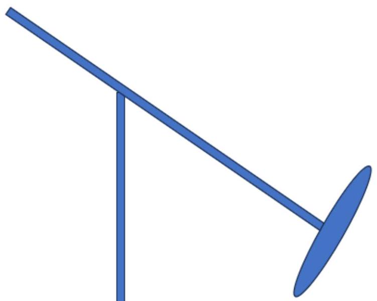

26 cm disk
*Marking scheme:

| Weight at one end of the gyroscope arm |  |
| :--- | :--- |
| Weight at the longer end of the gyroscope arm |  |
| If 20 mm (diameter) $\times 2 \mathrm {~mm}$ (thickness) disk is chosen |  |
| If 20 mm (diameter) $\times 3 \mathrm {~mm}$ (thickness) disk is chosen |  |
| If 20 mm (diameter) $\times 4 \mathrm {~mm}$ (thickness) disk is chosen |  |
| If 26 mm (diameter) × 4 mm (thickness) disk is chosen |  |

A.2.
[0.2pt]
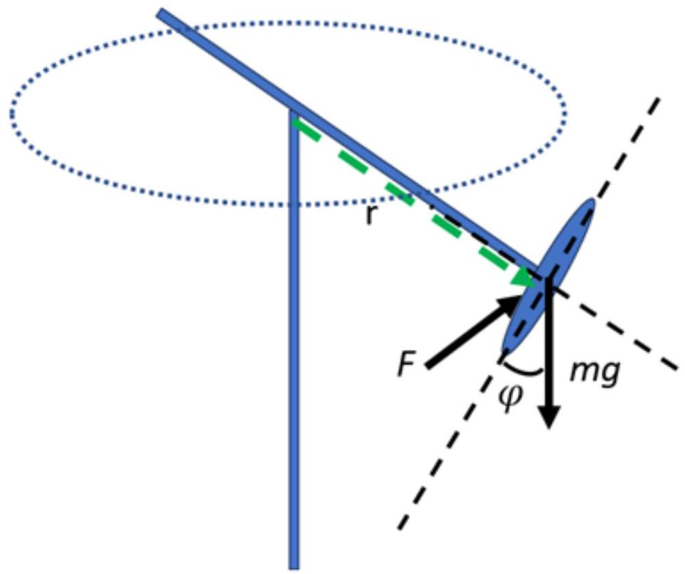
*Marking scheme:

Gravitational force, mg included [0.1pt]

External force, F included [0.1pt]

A. 3.
[0.2pt]
(b) Unequal length of the arm
(e) Weight of the disk [0.2pt]
remark: zero score will be given if student selects more than 2 choices.

Part B: Effect of Spinning Speed [Total point = 6.5]
B.1.
[1.5pt]

| Arm length (cm) | Voltage (V) | 10 cycles period (s) |  |  |  |  | Average 10 cycles period | Period (s) | Period Standard Deviation (s) | Period Standard Error (s) |
| :--- | :--- | :--- | :--- | :--- | :--- | :--- | :--- | :--- | :--- | :--- |
|  |  | 1 | 2 | 3 | 4 | 5 |  |  |  |  |
| 15 | 4 | 34 | 35 | 35 | 34 | 34 | 34.4 | 3.44 | 0.0548 | 0.0245 |
|  | 4.4 | 35 | 36 | 36 | 36 | 36 | 35.8 | 3.58 | 0.0447 | 0.0200 |
|  | 4.8 | 38 | 37 | 37 | 37 | 37 | 37.2 | 3.72 | 0.0447 | 0.0200 |
|  | 5.2 | 40 | 40 | 41 | 40 | 40 | 40.2 | 4.02 | 0.0447 | 0.0200 |
|  | 5.6 | 41 | 42 | 43 | 41 | 41 | 41.6 | 4.16 | 0.0894 | 0.0400 |
|  | 6 | 43 | 42 | 42 | 42 | 42 | 42.2 | 4.22 | 0.0447 | 0.0200 |

Proper table to record the measurement values [0.1pt]

Record rotation period using multiple cycles
[0.1] if the number of multiple cycle taken is less than 3
[0.2] if the number of multiple cycle taken is less than 6
[0.3] if the number of multiple cycle taken is more or equal to 6 [0.3pt]

Repeating the experiment
[0.1] if the experiment is repeated twice
[0.2] if the experiment is repeated three times
[0.3] if the experiment is repeated four times
[0.4] if the experiment is repeated five times or more [0.4pt]
Calculate the average period of single cycle
Calculate the average period of single cycle [0.1pt]
Proper label of unit V, s, and rad/s [0.3pt]
Calculate the precession velocity [0.1pt]
Evenly exploring a range of voltages [0.1pt]

B.2.
[0.8pt]

$$
\begin{gathered}
\text { Standard Deviation } = \sqrt { \frac { \sum \left( T _ { i } - \bar { T } \right) ^ { 2 } } { N - 1 } } \\
\text { Standard Error } = \frac { \text { Standard Deviation } } { \sqrt { N } }
\end{gathered}
$$

where Ti is precession period and T_bar is average of precession period.

| Correct standard deviation equation | [0.1 pt] |
| :--- | :--- |
| Correct standard error equation | [0.1 pt] |
| Correct calculation |  |

B.3.
[0.9pt]
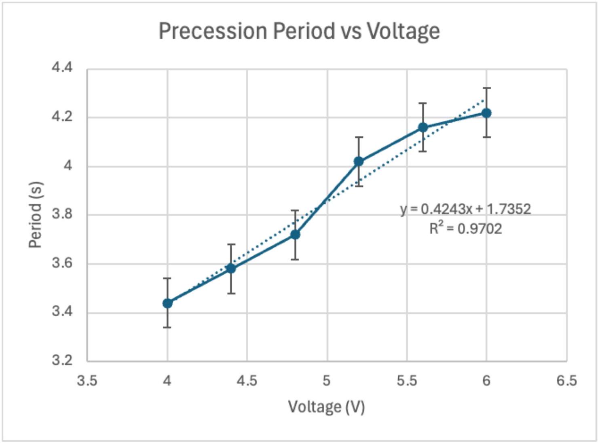

| Label axis correctly with unit (0.1pt for each axis) |  |
| :--- | :--- |
| Proper scale used (0.1pt for each axis) |  |
| Chart plotted correctly |  |
| [0.2] If proper exponential trendline drawn is within 20\% of the answer |  |
| [0.1] If exponential trendline drawn |  |
| Error bar is included in the chart |  |
| Chart occupy more than 70\% of the area. |  |

B.4.
[0.2pt]

$$
y = 0.4243 x + 1.7352
$$

Eq-1
where $y$ is precession period (s), $x$ is voltage (V)
Shown correct graph equation
[0.1 pt]
Shown the workout of getting the equation
[0.1 pt]

B.5.
[1.0pt]

DC motor speed vs. Voltage
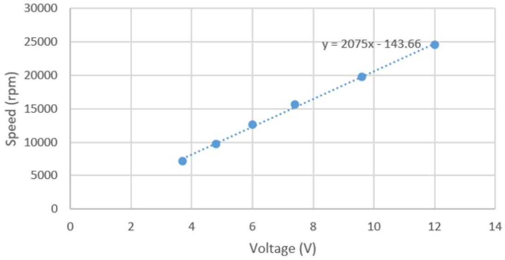

Obtained the linear equation $- z = 2075 x - 143.66$
where $z$ is rotor speed (rpm), $x$ is voltage (V)

$$
\begin{equation*}
x = ( z + 143.66 ) / 2075 \tag{Eq-2}
\end{equation*}
$$

Replace Eq-2 into Eq-1

$$
y = 0.4243 x + 1.7352 = 0.4243 [ ( z + 143.66 ) / 2075 ] + 1.7352
$$

$$
y = 2.045 e - 4 z + 1.76476
$$

$$
\begin{equation*}
- > w = ( 2 p i / y ) = 2 p i / ( 2.045 e - 4 z + 1.76476 ) \tag{Eq-3}
\end{equation*}
$$

where w is precession velocity.

Label axis correctly with unit (0.1pt for each axis)

Proper scale used (0.1pt for each axis)

Chart plotted correctly

Shown correct linear graph equation from graph

Shown the workout of getting Eq-2

Replace Eq-2 into Eq-1 and obtained the new equation Eq-3

| B.6(i) | From $I = m R ^ { 2 }$ | Eq-4 |  |
| :--- | :--- | :--- | :--- |
|  | For disk, $I = \sum _ { i } m _ { i } r _ { i } ^ { 2 }$ | Eq-5 |  |
|  | Thus, $d I = d m r ^ { 2 }$ $I = \int _ { 0 } ^ { R } d m r ^ { 2 }$ | Eq-6 |  |
|  | Relation of mass of ring and radius can be found through $\begin{aligned} & \frac { d m } { M } = \frac { 2 \pi r d r } { \pi R ^ { 2 } } \\ & d m = \frac { 2 r d r } { R ^ { 2 } } M \end{aligned}$ | Eq-7 |  |
|  | From $\begin{aligned} & I = \int _ { 0 } ^ { R } d m r ^ { 2 } = \int _ { 0 } ^ { R } \frac { 2 r d r } { R ^ { 2 } } M \cdot r ^ { 2 } \\ & I = \frac { 2 M } { R ^ { 2 } } \int _ { 0 } ^ { R } r ^ { 3 } d r \\ & I = \frac { 2 M } { R ^ { 2 } } \left[ \frac { r ^ { 4 } } { 4 } \right] _ { 0 } ^ { R } \end{aligned}$ |  |  |
|  | $I = \frac { 2 M } { R ^ { 2 } } \left[ \frac { R ^ { 4 } } { 4 } \right] = \frac { 1 } { 2 } M R ^ { 2 }$ | Eq-8 |  |

B.6(ii)
[0.2pt] $I = \frac { 1 } { 2 } M R ^ { 2 } = \frac { 1 } { 2 } ( 0.065 ) ( 0.1 ) ^ { 2 } = 0.000325 \mathrm {~kg} \cdot \mathrm {~m} ^ { 2 }$

| Magnitude correct | [0.1 pt] |
| :--- | :--- |
| Unit correct | [0.1 pt] |

B.6(iii)
[1.0pt]
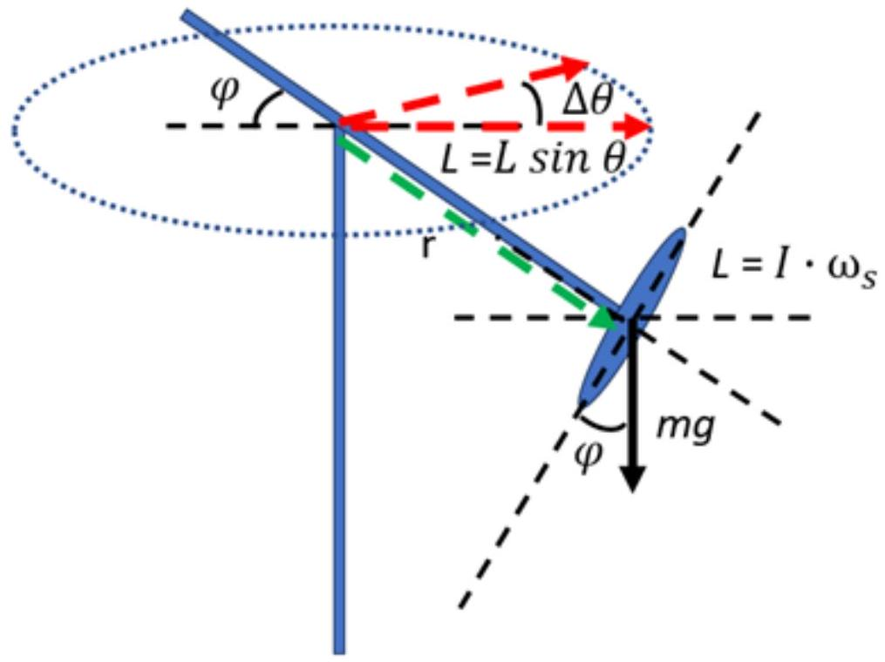
*Correct diagram and proper label for mg, r, and L

Line for $\tau = m g r \sin \varphi$

Line for $L = L \sin \varphi$

Precession angular velocity,

$$
\begin{align*}
& \omega _ { p } = \frac { \Delta \theta } { \Delta t }  \tag{0.1pt}\\
& \Delta \theta \approx \frac { \Delta L } { L \sin \varphi }  \tag{0.1pt}\\
& \tau = \frac { \Delta L } { \Delta t } = m g r \sin \varphi  \tag{0.1pt}\\
& \omega _ { p } = \frac { \Delta L } { \Delta t L \sin \varphi } = \frac { \Delta L } { \Delta t } \cdot \frac { 1 } { L \sin \varphi } = \frac { \tau } { L \sin \varphi } = \frac { m g r \sin \varphi } { L \sin \varphi } = \frac { m g r } { L } = \frac { m g r } { I \cdot \omega _ { s } } \tag{0.2pt}
\end{align*}
$$

B.6(iv)
[0.4pt]

$$
\begin{aligned}
\omega _ { p } = \frac { m g r } { I \cdot \omega _ { s } } & = \frac { ( 0.089 + 0.094 ) \mathrm { kg } \cdot \left( 9.81 \mathrm {~m} / \mathrm { s } ^ { 2 } \right) \cdot ( 0.25 \mathrm {~m} ) } { \left( 0.000325 \mathrm {~kg} \cdot \mathrm {~m} ^ { 2 } \right) ( 12600 \mathrm { rev } / \mathrm { min } ) } \\
& = \frac { 0.5386 \mathrm {~kg} \cdot \mathrm {~m} ^ { 2 } / \mathrm { s } ^ { 2 } } { 0.4288 \mathrm {~kg} \cdot \mathrm {~m} ^ { 2 } / \mathrm { s } } = 1.256 \mathrm { rad } ^ { - 1 } \mathrm {~s} ^ { - 1 }
\end{aligned}
$$

| Replacement in equation correct | [0.1 pt] |
| :--- | :--- |
| Including mass of motor (0.089 + 0.094) | [0.1 pt] |
| Magnitude correct | [0.1 pt] |
| Unit correct | [0.1 pt] |

## Part C: Influence of Gyroscope Arm Length [Total Point = 2.1]

C.1.

| L/cm | 10 cycles period (s) |  |  |  |  | Average 10 cycles period (s) | Period (s) | Precession Rate (rad/s) |
| :--- | :--- | :--- | :--- | :--- | :--- | :--- | :--- | :--- |
|  | 1 | 2 | 3 | 4 | 5 |  |  |  |
| 12 | 53.72 | 51.19 | 55.12 | 55.38 | 54.03 | 53.888 | 5.389 | 1.166 |
| 14 | 43.85 | 48.75 | 48.22 | 48.84 | 47.9 | 47.512 | 4.751 | 1.322 |
| 16 | 34.44 | 34.22 | 35.72 | 34.69 | 34.12 | 34.638 | 3.464 | 1.814 |
| 18 | 30.5 | 30.12 | 30.53 | 29 | 29.68 | 29.966 | 2.997 | 2.097 |
| 20 | 26.69 | 25.47 | 27.47 | 27.31 | 27.4 | 26.868 | 2.687 | 2.339 |
| 22 | 23.54 | 23.62 | 23.78 | 23.66 | 23.93 | 23.706 | 2.371 | 2.650 |

*Proper table to record the measurement values [0.1pt]

Record rotation period using multiple cycles
[0.1] if the period of multiple cycle taken is less than 5
[0.3pt]
[0.2] if the period of multiple cycle taken is between 5 to 10
[0.3] if the period of multiple cycle taken is more than 10

Number of data points collected
[0.1] If the number of data points collected is between 3 and 5 [0.2pt]
[0.2] If the number of data points collected is more than 5

Calculate the average period of single cycle [0.1pt]

Proper label of unit V, s, and rad/s [0.3pt]

Calculate the precession velocity [0.2pt]

C.2.
[0.8pt]
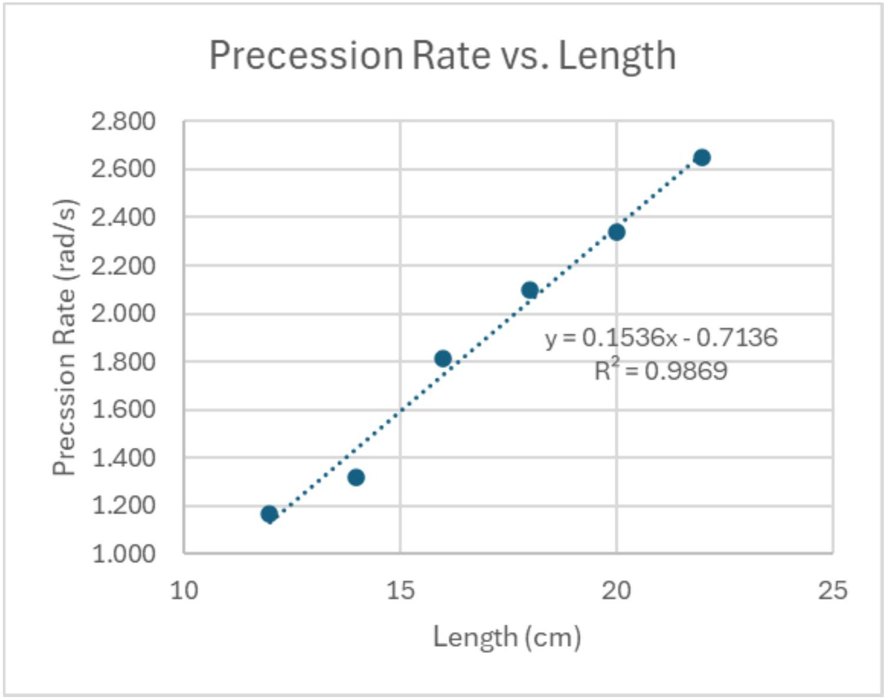
*Marking

| Label axis correctly with unit (0.1pt for each axis) |  |
| :--- | :--- |
| Proper scale used (0.1pt for each axis) |  |
| Chart plotted correctly |  |
| Proper linear trendline drawn |  |
| Chart occupy more than 70\% of the graph area |  |

C.3.
[0.1pt] (a) Arm length increase, precession rate increase

Points: 20

Part D: Influence of Gyroscope Disk weight [Total point = 3.7]
D.1.
[1.7pt]

| Thickness (mm) | Voltage (V) | 10 cycles period (s) |  |  |  |  | Average 10 cycles period | Period (s) | Precession rate (rad/s) |
| :--- | :--- | :--- | :--- | :--- | :--- | :--- | :--- | :--- | :--- |
|  |  | 1 | 2 | 3 | 4 | 5 |  |  |  |
| 2 | 4 | 31.97 | 34.15 | 33.66 | 34.35 | 34.03 | 33.632 | 3.3632 | 1.8682 |
|  | 4.4 | 35.04 | 35.28 | 35.24 | 36.78 | 33.25 | 35.118 | 3.5118 | 1.7892 |
|  | 4.8 | 34.47 | 37.97 | 37.06 | 35.9 | 36.31 | 36.342 | 3.6342 | 1.7289 |
|  | 5.2 | 38.06 | 36.16 | 36.65 | 36 | 38.53 | 37.08 | 3.7080 | 1.6945 |
|  | 5.6 | 36.56 | 37.43 | 38.53 | 37.63 | 37.15 | 37.46 | 3.7460 | 1.6773 |
|  | 6 | 40.35 | 40.28 | 40.13 | 39.81 | 40.31 | 40.176 | 4.0176 | 1.5639 |
| 3 | 4 | 34 | 35 | 35 | 34 | 34 | 34.4 | 3.44 | 1.8265 |
|  | 4.4 | 35 | 36 | 36 | 36 | 36 | 35.8 | 3.58 | 1.7551 |
|  | 4.8 | 38 | 37 | 37 | 37 | 37 | 37.2 | 3.72 | 1.6890 |
|  | 5.2 | 40 | 40 | 41 | 40 | 40 | 40.2 | 4.02 | 1.5630 |
|  | 5.6 | 41 | 42 | 43 | 41 | 41 | 41.6 | 4.16 | 1.5104 |
|  | 6 | 43 | 42 | 42 | 42 | 42 | 42.2 | 4.22 | 1.4889 |
| 4 | 4 | 35.16 | 38.38 | 38.34 | 38.47 | 38.66 | 37.802 | 3.7802 | 1.6621 |
|  | 4.4 | 37.81 | 41.94 | 42.84 | 42.31 | 42.03 | 41.386 | 4.1386 | 1.5182 |
|  | 4.8 | 39.66 | 42.81 | 43.5 | 43 | 42.94 | 42.382 | 4.2382 | 1.4825 |
|  | 5.2 | 42.07 | 44.19 | 44.56 | 44.75 | 44.32 | 43.978 | 4.3978 | 1.4287 |
|  | 5.6 | 44.06 | 45.44 | 45.59 | 45.5 | 45.37 | 45.192 | 4.5192 | 1.3903 |
|  | 6 | 45.62 | 46.94 | 46.53 | 46.56 | 46.81 | 46.492 | 4.6492 | 1.3515 |

| *Proper table to record the measurement values |  |
| :--- | :--- |
| Record rotation period using multiple cycles |  |
| [0.1] if the period of multiple cycle taken is less than 5 |  |
|  |  |
| [0.2] if the period of multiple cycle taken is between 5 to 10 |  |
| [0.3] if the period of multiple cycle taken is more than 10 |  |
| Number of data points collected |  |
| [0.1] If the number of data points collected is between 3 |  |
|  |  |
| [0.3] If the number of data points collected is more than 10 |  |
| Calculate the average period of single cycle |  |
| Proper label of unit V, s, and rad/s |  |
| Calculate the precession velocity |  |
| Table in all the value of 2mm, 3mm, and 4mm |  |

D.2.
[1.1pt]
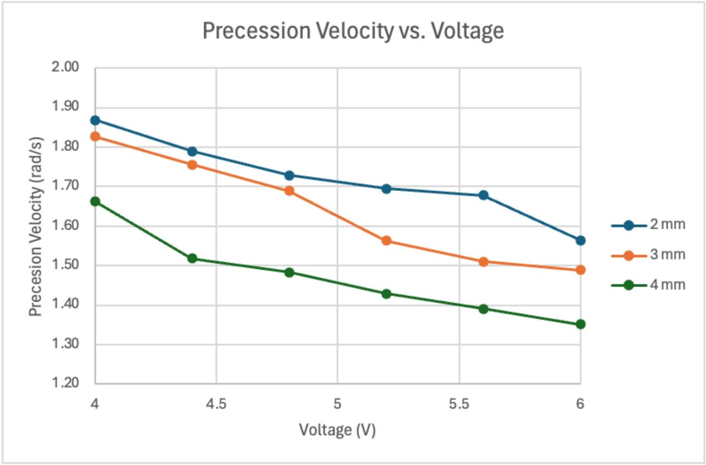
*Marking

| Label axis correctly with unit (0.1pt for each axis) |  |
| :--- | :--- |
| Proper scale used (0.1pt for each axis) |  |
| Chart plotted correctly |  |
| Trendline drawn |  |
| Chart occupy more than 70\% of the graph area |  |

D.3.
[0.1pt] (b) The gyroscope will precess faster as the disk weight increased.

D.4.
[0.8pt] From B.6(iii), the precession angular velocity is given by

$$
\begin{equation*}
\omega _ { p } = \frac { ( m + M ) g r } { I \omega _ { s } } , \tag{0.1pt}
\end{equation*}
$$

where $m$ is the mass of the disk and $M$ is the mass of the motor. From B.6(i), the moment of inertia of a uniform disk is

$$
\begin{equation*}
I = \frac { 1 } { 2 } m R ^ { 2 } , \tag{0.1pt}
\end{equation*}
$$

where $R$ is the radius of the disk. Therefore,

$$
\begin{align*}
& \omega _ { p } = \frac { ( m + M ) g r } { \frac { 1 } { 2 } m R ^ { 2 } \omega _ { s } }  \tag{0.1pt}\\
& m = \frac { 2 M g r } { R ^ { 2 } \omega _ { p } \omega _ { s } - 2 g r } . \\
& m _ { i } = \frac { 2 ( 0.094 ) ( 9.81 ) ( 0.25 ) } { ( 0.2 ) ^ { 2 } \left( \omega _ { p , i } \right) \omega _ { s , i } - 2 ( 9.81 ) ( 0.25 ) } \tag{0.1pt}
\end{align*}
$$

The mass of the motor $M$ is given, $g$ is the gravitational acceleration, $\omega _ { s }$ is provided in B.5, $r$ is the length of the arm fixed at 25cm, and $\omega _ { p }$ is measured by the students.

| Student calculate from $m _ { 1 }$ to $m _ { n }$ |  |
| :--- | :--- |
| Calculate average $m$ |  |
| Calculate standard deviation |  |

Part E: Torque Induced by External Forces [Total point = 3.5]
E.1.
[1.3pt]

| Number of sets of bolt and nut | Period 1 cycle (s) |  |  | Period (s) | Precession Velocity (rad/s) | Leverage Angle (rad) |
| :--- | :--- | :--- | :--- | :--- | :--- | :--- |
|  | 1 | 2 | 3 |  |  |  |
| 4 | 46.34 | 47.9 | 46.79 | 47.01 | 0.1337 | 0.296705973 |
| 6 | 39.69 | 39 | 36.75 | 38.48 | 0.1633 | 0.261799388 |
| 8 | 31.65 | 29.96 | 32.16 | 31.26 | 0.2010 | 0.244346095 |
| 10 | 22.16 | 21.75 | 22.13 | 22.01 | 0.2854 | 0.366519143 |

| *Proper table to record the measurement values |  |
| :--- | :--- |
| Repeating record the data |  |
| [0.1] if the data is taken only once |  |
| [0.2] if the data repeated 3 times or more |  |
| Calculate the average period of single cycle |  |
| Calculate the standard deviation |  |
| Calculate the standard error |  |
| Calculate the tilted angle |  |
| Proper label of unit V, s, and rad/s |  |
| Calculate the precession velocity |  |
| Even bolts and nuts are added |  |

E.2.
[0.8pt]
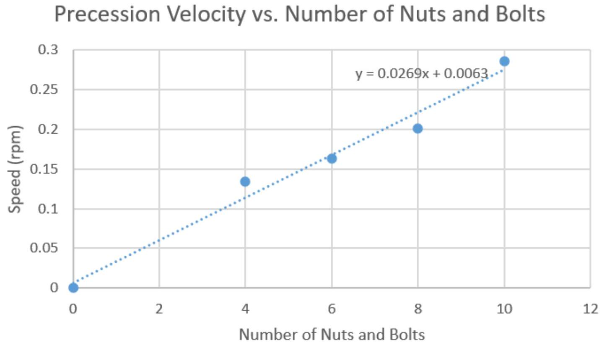
*Label axis correctly with unit (0.1pt for each axis) [0.2pt]

Proper scale used (0.1pt for each axis) [0.2pt]

Chart plotted correctly [0.1pt]

Linear trendline drawn [0.1pt]

Shows error bar [0.1pt]

Chart occupy more than 70\% of the graph area [0.1pt]

E.3.
[0.8pt]

Leverage Angle vs. Number of Nuts and Bolts
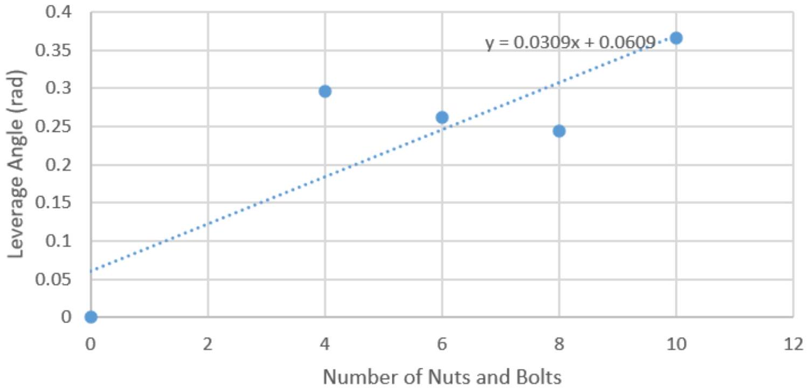

*Label axis correctly with unit (0.1 pt for each axis)
[0.2pt]

Proper scale used (0.1pt for each axis)
[0.2pt]

Chart plotted correctly
[0.1pt]

Linear trendline drawn
[0.1pt]

Shows error bar
[0.1pt]

Chart occupy more than 70\% of the graph area
[0.1pt]

E.4.
[0.5pt] From B.6(iii), the precession velocity is

$$
\omega _ { p } = \frac { N m g r } { I \omega _ { s } } ,
$$

where $N$ is the number of nuts and bolts, $m$ is the mass of one set of nut and bolt, $g$ is the gravitational acceleration, $r$ is the length of the arm, $I$ is the moment of inertia of the disk, $\omega _ { s }$ is the angular speed of the disk, and $\omega _ { p }$ is the angular speed of the precession.

| Number of nuts and bolts | m/kg |
| :--- | :--- |
| 4 | 0.0055 |
| 6 | 0.0045 |
| 8 | 0.0041 |
| 10 | 0.0047 |
| Average | 0.0047 |
| Std. dev. | 0.0006 |

Calculated all the m values for different number of bolt and nut

Calculated the average value of m

Calculated the standard deviation

Measure r from the experiment
Measure r from the experiment

APHO 2024
Page 26 of 32

| E.5. [0.1 pt] | I |  |
| :--- | :--- | :--- |

Part F: Nutation phenomenon [Total point = 2.1]
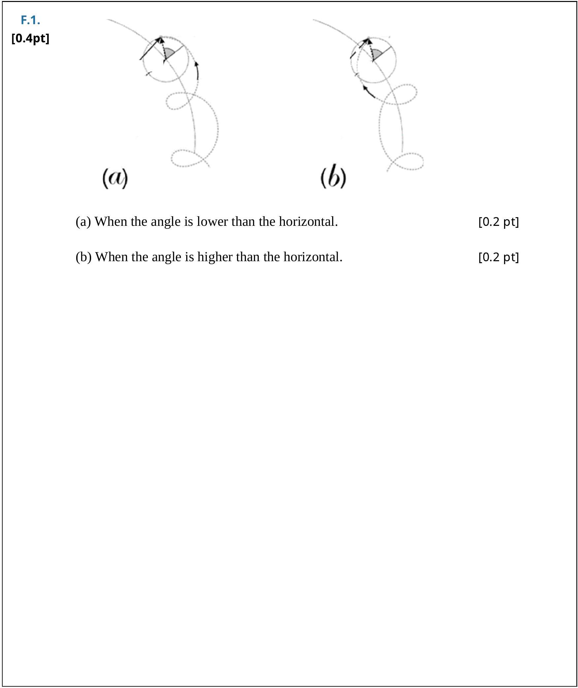

| F.2(i) | When rotation is at axis $3 . \omega _ { 3 } \gg \omega _ { 2 }$ and $\omega _ { 1 }$ |  | [0.1 pt] |
| :--- | :--- | :--- | :--- |
|  | When no external torque applied, $\tau _ { 1 } = \tau _ { 2 } = \tau _ { 3 } = 0$ |  | [0.1 pt] |
|  | At constant spinning speed, $\dot { \omega } _ { 3 } = 0$ |  | [0.1 pt] |
|  | $I _ { 1 } \dot { \omega } _ { 1 } - \left( I _ { 3 } - I _ { 2 } \right) \omega _ { 2 } \omega _ { 3 } = 0$ | Eq-4 | [0.1 pt] |
|  | $I _ { 2 } \dot { \omega } _ { 2 } - \left( I _ { 1 } - I _ { 3 } \right) \omega _ { 3 } \omega _ { 1 } = 0$ | Eq-5 | [0.1 pt] |
|  | For symmetric disk, $I _ { 1 } = I _ { 2 }$, |  | [0.1 pt] |
|  | $I _ { 1 } \dot { \omega } _ { 1 } = \left( I _ { 3 } - I _ { 1 } \right) \omega _ { 2 } \omega _ { 3 }$ | Eq-6 |  |
|  | $I _ { 1 } \dot { \omega } _ { 2 } = - \left( I _ { 3 } - I _ { 1 } \right) \omega _ { 3 } \omega _ { 1 }$ | Eq-7 |  |
|  | From Eq. 6 | Eq-8 | [0.1 pt] |
|  | From Eq. 7 | Eq-9 | [0.1 pt] |
|  | $\begin{aligned} & \text { Substitute Eq-9 into Eq-8 } \\ & \qquad I _ { 1 } \ddot { \omega } _ { 1 } = \left( I _ { 3 } - I _ { 1 } \right) \left[ - \frac { \left( I _ { 3 } - I _ { 1 } \right) } { I _ { 1 } } \omega _ { 3 } \omega _ { 1 } \right] \omega _ { 3 } \end{aligned}$   $I _ { 1 } \ddot { \omega } _ { 1 } = - \frac { \left( I _ { 3 } - I _ { 1 } \right) ^ { 2 } } { I _ { 1 } } \omega _ { 1 } \omega _ { 3 } ^ { 2 }$   $\ddot { \omega } _ { 1 } + \left[ \frac { \left( I _ { 3 } - I _ { 1 } \right) } { I _ { 1 } } \omega _ { 3 } \right] ^ { 2 } \omega _ { 1 } = 0$   $\omega _ { n } = \frac { \left( I _ { 3 } - I _ { 1 } \right) } { I _ { 1 } } \omega _ { 3 }$ |  |  |  |
|  |  |  |  |  |
|  |  |  |  | [0.1 pt] |
|  |  |  | Eq-10 | [0.1 pt] |

F.2(ii)
[0.1pt]

$$
\begin{equation*}
\ddot { \omega } _ { 1 } + \omega _ { n } ^ { 2 } \omega _ { 1 } = 0 \tag{0.1pt}
\end{equation*}
$$

Part G: Application of gyroscope in self balancing_[Total Point = 1.7]

G.1.
[1.7pt]
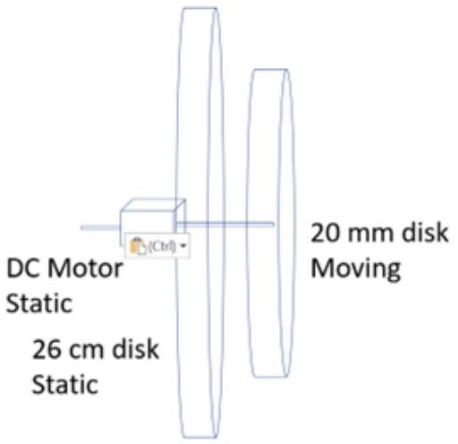

| Correct setup |  |
| :--- | :--- |
| Correct labeling of parts |  |
| Correct labeling of static and moving parts |  |

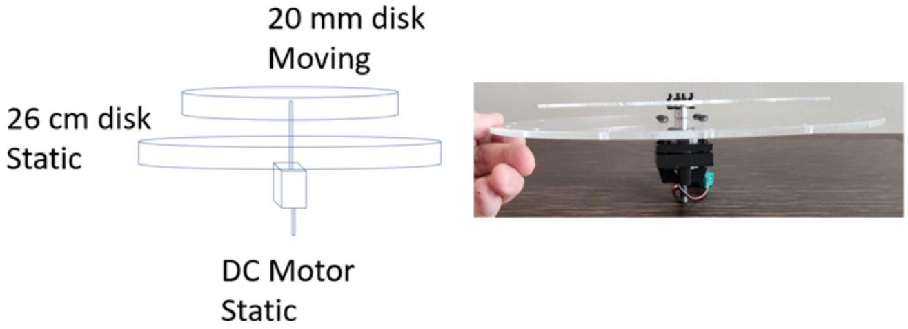

| [0.2] Correct setup without 26 cm disk   [0.3] Correct setup with 26 cm disk |  |
| :--- | :--- |
| Correct labeling of parts |  |
| Correct labeling of static and moving parts |  |
