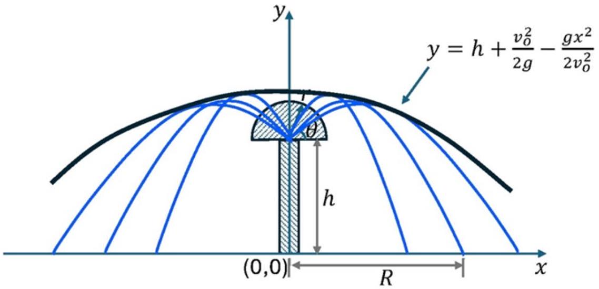
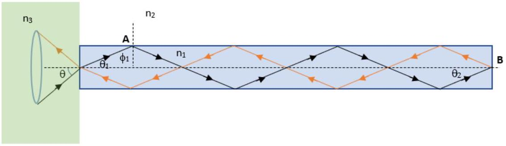
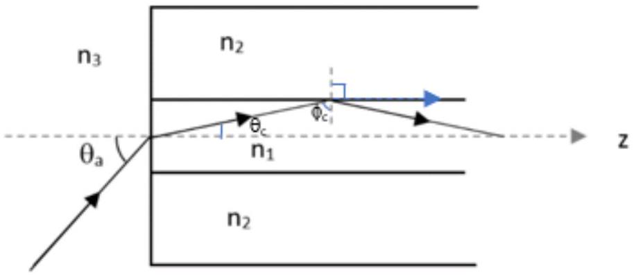
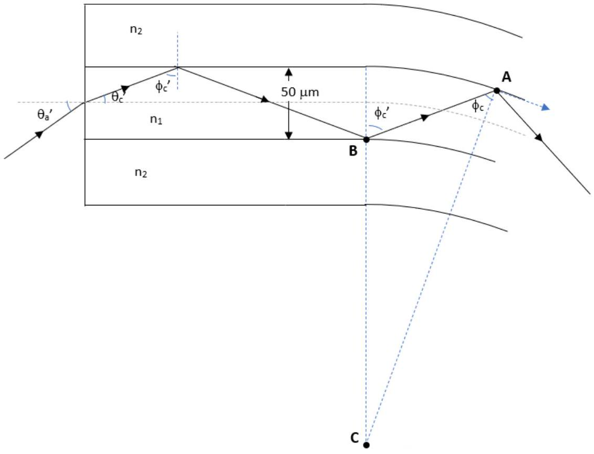

## Geometry of Water Fountain

Part A: Uniformly Distributed Holes on the Surface of the Hemisphere

A. 1 Given the radius of the hemisphere is small compared to the range, that we can treat all the
[0.5pt] different water sprouts emanate from a point source at the center of the hemisphere at the same initial velocity but at different angles $\theta$. Note that the distribution of the holes on the surface of the hemisphere is uniform.

Consider the motion in $x$ - and $y$-directions with coordinate $( x , y )$ as indicated in the Fig. 1.
Horizontal motion - no acceleration

$$
\begin{equation*}
x = x ( t ) = \left( v _ { o } \cos \theta \right) t \tag{1.1}
\end{equation*}
$$

Vertical motion - 'particle' in free fall under gravity, $g$

$$
\begin{equation*}
y = y ( t ) = h + \left( v _ { o } \sin \theta \right) t - \frac { 1 } { 2 } g t ^ { 2 } \tag{1.2}
\end{equation*}
$$

A. 2

Equation of water trajectory (or path of the projectile) is obtained by eliminating time $t$ from equations (1.1) and (1.2). [0.1pt]

Using Eq. (1.1), we get $t = \frac { x } { v _ { 0 } \cos \theta }$ and substituting $t$ in Eq.(1.2) we obtain

$$
\begin{align*}
y & = h + x \frac { \sin \theta } { \cos \theta } - \frac { g x ^ { 2 } } { 2 v _ { o } ^ { 2 } } \frac { 1 } { \left( \cos ^ { 2 } \theta \right) }  \tag{1.3}\\
& = h + x \tan \theta - \frac { g x ^ { 2 } } { 2 v _ { o } ^ { 2 } } \left( \sec ^ { 2 } \theta \right) \tag{1.4}
\end{align*}
$$

Using trigonometry identity: $\sec ^ { 2 } \theta = 1 + \tan ^ { 2 } \theta$, thus we write:
(1.5)
or

$$
\begin{equation*}
y ^ { \prime } = y - h = x \tan \theta - \frac { g x ^ { 2 } } { 2 v _ { o } ^ { 2 } } \left( 1 + \tan ^ { 2 } \theta \right) \tag{1.6}
\end{equation*}
$$

The equation of water trajectory is given by Eq. (1.5) (with reference to the ground) or Eq. (1.6) with reference to the base of the hemisphere.

A. 3

We rewrite the trajectory equation in the form of quadratic function in $\tan \theta$
[0.2pt]

$$
\begin{equation*}
\left( \frac { g x ^ { 2 } } { 2 v _ { o } ^ { 2 } } \right) \tan ^ { 2 } \theta - x \tan \theta + \left( y ^ { \prime } + \frac { g x ^ { 2 } } { 2 v _ { o } ^ { 2 } } \right) = 0 \tag{1.7}
\end{equation*}
$$

[0.5pt]
where $y ^ { \prime } = y - h$.
Let $\tan \theta = u$, thus we express Eq. (1.7) as a quadratic function in $u$ :

$$
\begin{equation*}
a u ^ { 2 } + b u + c = 0 \tag{1.8}
\end{equation*}
$$

[0.3pt]
where

$$
\begin{equation*}
a = \frac { g x ^ { 2 } } { 2 v _ { o } ^ { 2 } } , \quad b = - x , \quad c = y ^ { \prime } + \frac { g x ^ { 2 } } { 2 v _ { o } ^ { 2 } } . \tag{1.9}
\end{equation*}
$$

The quadratic equation Eq.(1.8) must have a real solution for $u$, i.e

$$
\begin{equation*}
u = \frac { - b \pm \sqrt { b ^ { 2 } - 4 a c } } { 2 a } \tag{1.10}
\end{equation*}
$$

[0.2pt]
Or the discriminant is non-negative, i.e. $b ^ { 2 } - 4 a c \geq 0$, which gives.
[0.2pt]

$$
\begin{equation*}
x ^ { 2 } - 4 \left( \frac { g x ^ { 2 } } { 2 v _ { o } ^ { 2 } } \right) \left( y ^ { \prime } + \frac { g x ^ { 2 } } { 2 v _ { o } ^ { 2 } } \right) \geq 0 \tag{1.11}
\end{equation*}
$$

[0.4pt]
Re-arranging Eq.(1.11) for y' to get

$$
\begin{equation*}
- y ^ { \prime } \geq \frac { g x ^ { 2 } } { 2 v _ { o } ^ { 2 } } - \frac { v _ { o } ^ { 2 } } { 2 g } \tag{1.12}
\end{equation*}
$$

or

$$
\begin{equation*}
y ^ { \prime } \leq \frac { v _ { o } ^ { 2 } } { 2 g } - \frac { g x ^ { 2 } } { 2 v _ { o } ^ { 2 } } \tag{1.13}
\end{equation*}
$$

[0.2pt]

The water trajectory follows the inequality in (1.13) and the envelop of different water trajectories with different launch angles follow the parabolic equation:

$$
\begin{equation*}
y ^ { \prime } = \frac { v _ { o } ^ { 2 } } { 2 g } - \frac { g x ^ { 2 } } { 2 v _ { o } ^ { 2 } } \tag{1.14}
\end{equation*}
$$

[0.2pt]

Or

$$
\begin{equation*}
y = h + \frac { v _ { o } ^ { 2 } } { 2 g } - \frac { g x ^ { 2 } } { 2 v _ { o } ^ { 2 } } \tag{1.15}
\end{equation*}
$$

[0.3pt]

The sketch of the envelop of water trajectory is shown below:

[0.5pt]

A. 4
[1.0pt] Recall the trajectory Eq. (1.5) and set $y = 0$ to obtain the horizontal range $x = R$ :

$$
\begin{align*}
& 0 = h + R \tan \theta - \frac { g R ^ { 2 } } { 2 v _ { o } ^ { 2 } } \left( 1 + \tan ^ { 2 } \theta \right)  \tag{1.16}\\
& \frac { g } { 2 v _ { o } ^ { 2 } } \left( 1 + \tan ^ { 2 } \theta \right) R ^ { 2 } - ( \tan \theta ) R - h = 0
\end{align*}
$$

which is a quadratic equation

$$
\begin{equation*}
a ^ { \prime } R ^ { 2 } + b ^ { \prime } R + c ^ { \prime } = 0 \tag{1.18}
\end{equation*}
$$

with

$$
\begin{equation*}
a ^ { \prime } = \frac { g } { 2 v _ { o } ^ { 2 } } \left( 1 + \tan ^ { 2 } \theta \right) , \quad b ^ { \prime } = - \tan \theta , c = h . , \tag{1.19}
\end{equation*}
$$

The solution of Eq. (1.18) is the range of the water trajectory on the ground.

$$
\begin{align*}
R & = \frac { - b { } ^ { \prime } \pm \sqrt { b ^ { \prime 2 } - 4 a ^ { \prime } c ^ { \prime } } } { 2 a ^ { \prime } }  \tag{1.20}\\
R & = \frac { \tan \theta \pm \sqrt { \tan ^ { 2 } \theta + 4 \frac { g } { 2 v _ { o } ^ { 2 } } \left( 1 + \tan ^ { 2 } \theta \right) h } } { \frac { g } { v _ { o } ^ { 2 } } \left( 1 + \tan ^ { 2 } \theta \right) }
\end{align*}
$$

A. 5
[0.5pt] Letting $h = 0$ in Eq.(1.21) gives

$$
\begin{align*}
& R = \frac { \tan \theta \pm \sqrt { \tan ^ { 2 } \theta } } { \frac { g } { v _ { o } ^ { 2 } } \left( 1 + \tan ^ { 2 } \theta \right) }  \tag{1.22}\\
& R = \frac { 2 \tan \theta } { \frac { g } { v _ { o } ^ { 2 } } \left( 1 + \tan ^ { 2 } \theta \right) } = \frac { 2 \tan \theta } { \frac { g } { v _ { o } ^ { 2 } } \left( \sec ^ { 2 } \theta \right) }  \tag{1.23}\\
& = \frac { v _ { o } ^ { 2 } } { g } 2 \sin \theta \cos \theta = \frac { v _ { o } ^ { 2 } } { g } \sin 2 \theta
\end{align*}
$$

Part B: Non-Uniformly Distributed Holes on the Surface of the Hemisphere
B. 1
[1.0pt] Recall the range from (A.4) above (Eq. (1.21))

$$
\begin{equation*}
R = R ( \theta ) = \frac { \tan \theta \pm \sqrt { \tan ^ { 2 } \theta + 4 \frac { g } { 2 v _ { o } ^ { 2 } } \left( 1 + \tan ^ { 2 } \theta \right) h } } { \frac { g } { v _ { o } ^ { 2 } } \left( 1 + \tan ^ { 2 } \theta \right) } \tag{1.21}
\end{equation*}
$$

Let

$$
\begin{equation*}
\frac { d R } { d \theta } = R ^ { \prime } ( \theta ) \tag{1.25}
\end{equation*}
$$

and thus

$$
\begin{equation*}
d R = R ^ { \prime } ( \theta ) d \theta . \tag{1.26}
\end{equation*}
$$

There is no need to determine the R' explicitely. Answers can be left in R'. Consider an annulus (or ring) water on the ground with radius $R$ and thickness $d R$ where the element area of annulus $d A _ { W }$ is given by

$$
\begin{align*}
d A _ { W } & = 2 \pi R \times d R  \tag{1.27}\\
& = 2 \pi R R ^ { \prime } ( \theta ) d \theta
\end{align*}
$$

B. 2

[1.0pt] Number of holes in on the elemental area of annulus $d A _ { H }$, on the hemisphere, of radius $r$ at angle $\theta$ with angular width $d \theta$ is
$$
\begin{equation*}
d A _ { H } = \rho ( \theta ) \times 2 \pi ( \mathrm { r } \cos \theta ) \mathrm { r } \mathrm {~d} \theta \tag{1.29}
\end{equation*}
$$
In order the water sprouts to spray uniformly on the ground $d A _ { W } \sim d A _ { H }$ such that
$$
\begin{equation*}
d A _ { H } = \rho ( \theta ) \times 2 \pi ( \mathrm { r } \cos \theta ) \mathrm { rd } \theta \sim 2 \pi \mathrm { RR } / ( \theta ) \mathrm { d } \theta \sim \mathrm { dA } _ { \mathrm { W } } \tag{1.30}
\end{equation*}
$$
And to ensure the expression is independent of $\rho ( \theta )$, we express
$$
\begin{equation*}
\rho ( \theta ) \sim \frac { R ( \theta ) R \prime ( \theta ) } { r ^ { 2 } \cos \theta } \tag{1.31}
\end{equation*}
$$
where $R ( \theta )$ and $R ^ { \prime } ( \theta )$ are given by Eq. (1.21) and Eq.(1.25), respectively.
If the distribution of the holes on the hemisphere follows Eq. (1.31), then the water spray on the ground will be uniform (independent of angle). The condition set for angle $\theta$ does not affect the general expression in (1.31).

B. 3

[2.0pt] When $h = 0$, the range become simple to estimate, namely from Eq. (1.24) we have
$$
\begin{equation*}
R ( \theta ) = \frac { v _ { o } ^ { 2 } } { g } \sin 2 \theta \tag{0.2pt}
\end{equation*}
$$
and
$$
\begin{align*}
& \frac { d R ( \theta ) } { d \theta } = \frac { 2 v _ { o } ^ { 2 } } { g } \cos 2 \theta  \tag{1.32}\\
& d R = \frac { 2 v _ { o } ^ { 2 } } { g } \cos 2 \theta d \theta
\end{align*}
$$
Consider an annulus (or ring) water on the ground with radius $R$ and thickness $d R$ where the element area of annulus $d A _ { W }$ is given by
$$
\begin{align*}
d A _ { W } & = 2 \pi R \times d R \\
& = 2 \pi \left( \frac { v _ { o } ^ { 2 } } { g } \sin 2 \theta \right) \left( \frac { 2 v _ { o } ^ { 2 } } { g } \cos 2 \theta \right) d \theta  \tag{1.34}\\
& = 2 \pi \left( \frac { v _ { o } ^ { 2 } } { g } \right) ^ { 2 } 2 \sin 2 \theta \cos 2 \theta d \theta  \tag{1.35}\\
& = 2 \pi \left( \frac { v _ { o } ^ { 2 } } { g } \right) ^ { 2 } \sin 4 \theta d \theta
\end{align*}
$$
[0.1pt]
Thus, elemental area of water annulus $d A _ { W }$ follows
$$
\begin{equation*}
d A _ { W } \propto \sin 4 \theta d \theta \tag{1.37}
\end{equation*}
$$
[0.1pt]
Recall from B. 2 the number of holes in on the elemental area of annulus $d A _ { H }$, on the hemisphere, of radius $r$ at angle $\theta$ with angular width $d \theta$ is

$$
\begin{equation*}
d A _ { H } = \rho ( \theta ) \times 2 \pi ( \mathrm { r } \cos ( \theta ) ) \mathrm { rd } \theta \sim \rho ( \theta ) \cos ( \theta ) \mathrm { d } \theta . \tag{0.1pt}
\end{equation*}
$$

In order the water sprouts to spray uniformly on the ground $d A _ { W } \propto d A _ { H }$ such that

$$
\begin{equation*}
d A _ { H } \sim \rho ( \theta ) \cos \theta d \theta \sim \sin 4 \theta d \theta . \tag{1.38}
\end{equation*}
$$

And to ensure the expression is independent of $\rho ( \theta )$, we express

$$
\begin{equation*}
\rho ( \theta ) \sim \frac { \sin ( 4 \theta ) } { \cos ( \theta ) } . \tag{1.39}
\end{equation*}
$$

If the distribution of the holes per unit area on the hemisphere follows Eq. (1.39), then the water sprayed on the ground will be uniform (independent of angle). The condition set on the angle only to avoid duplication of water hitting the same area for $0 ^ { o } < \theta \leq 45 ^ { o }$ or $45 ^ { o } < \theta < 90 ^ { o }$.

## Snell's Law

Part A: Light Propagation Through a Semi-Sphere

A. 1
[0.5pt]
This means that the colour with a smaller angle of refraction propagates faster in the semi-sphere, which is colour $a$.
A. 2
The light rays no longer exit the bottom of semi-sphere when the ray is refracted by 90° with respect to the normal.
[0.2pt]
Using Snell's law,
$$
\begin{equation*}
n _ { x } \sin \theta _ { i } = n _ { 2 } \sin \left( 90 ^ { \circ } \right) \tag{0.2pt}
\end{equation*}
$$
Replace "x" with "a" and "b" for the condition of ray a and ray b, respectively.
For ray a,
$$
\begin{gather*}
n _ { a } \sin \left( 50 ^ { \circ } \right) = 1.0 \sin \left( 90 ^ { \circ } \right)  \tag{0.2pt}\\
n _ { a } = 1.305
\end{gather*}
$$
For ray $b$,
$$
\begin{gather*}
n _ { b } \sin \left( 45 ^ { \circ } \right) = 1.0 \sin \left( 90 ^ { \circ } \right)  \tag{0.2pt}\\
n _ { b } = 1.414
\end{gather*}
$$
Difference in refractive index, $\Delta \mathrm { n } = \mathbf { 0 . 1 0 9 }$

## Part B: Light Propagation Through a Cylindrical Rod

B. 1
Given $\mathrm { n } _ { 1 } = 1.5 , \mathrm { n } _ { 2 } = 1.0 , \mathrm { n } _ { 3 } = 1.4$,
[2.0pt]

Identify 2 conditions that need to be obeyed: [0.2pt]

\#1: Light incident at point A should be totally reflected.

$$
\begin{align*}
& n _ { 1 } \sin \phi _ { 1 } > n _ { 2 } \sin \left( 90 ^ { \circ } \right) \\
& \phi _ { 1 } > \sin ^ { - 1 } \frac { 1.0 } { 1.5 } = 41.81 ^ { \circ } \tag{0.3pt}
\end{align*}
$$

The condition for angle $\theta _ { 1 } < 90 ^ { \mathrm { o } } - 41.81 ^ { \mathrm { o } } = 48.19 ^ { \mathrm { o } }$ [0.2pt]
Using Snell's law,

$$
\begin{equation*}
\theta < \sin ^ { - 1 } \frac { 1.5 } { 1.4 } \sin \left( 48.19 ^ { \circ } \right) = 53 ^ { \circ } \tag{0.2pt}
\end{equation*}
$$

B. 1
[cont.]
\#2: Light incident at point B should be totally reflected.

$$
\begin{align*}
& n _ { 1 } \sin \theta _ { 2 } > n _ { 2 } \sin \left( 90 ^ { \circ } \right) \\
& \theta _ { 2 } > \sin ^ { - 1 } \frac { 1.0 } { 1.5 } = 41.81 ^ { \circ } \tag{0.3pt}
\end{align*}
$$

The condition for angle $\mathrm { q } _ { 1 } > 41.81 ^ { \mathrm { o } }$

Using Snell's Law

$$
\begin{equation*}
\theta > \sin ^ { - 1 } \frac { 1.5 } { 1.4 } \sin \left( 41.81 ^ { \circ } \right) = 45.58 ^ { \circ } \tag{0.2pt}
\end{equation*}
$$

Therefore, the incident angle, q, where light is totally reflected back to the polymer is 45.58° < q < 53°.

| B. 2 (i) | When right end of rod is coated with oil with $\mathrm { n } _ { 4 } = 1.6$, condition \#2 changes. |  |
| :--- | :--- | :--- |
|  | Light incident on point B will always be refracted. |  |
|  | Light CANNOT be totally reflected back to the polymer. |  |

B. 2
When the setup is placed in water, $\mathbf { n } _ { \mathbf { 2 } } = \mathbf { 1 . 3 3 }$. Both condition \#1 and \#2 change. [0.2pt]
[0.9pt]
\#1:
$$
\begin{equation*}
\phi _ { 1 } > \sin ^ { - 1 } \frac { 1.33 } { 1.5 } = 62.46 ^ { \circ } \tag{0.2pt}
\end{equation*}
$$
$$
\theta _ { 1 } < 90 ^ { \circ } - 62.46 ^ { \circ } = 27.54 ^ { \circ }
$$
Using Snell's law,
$$
\theta < \sin ^ { - 1 } \frac { 1.5 } { 1.4 } \sin \left( 27.54 ^ { \circ } \right) = 29.7 ^ { \circ }
$$
\#2:
$$
\theta _ { 2 } > \sin ^ { - 1 } \frac { 1.33 } { 1.5 } = 62.46 ^ { \circ }
$$
Using Snell's law,
$$
\begin{equation*}
\theta > \sin ^ { - 1 } \frac { 1.5 } { 1.4 } \sin \left( 62.46 ^ { \circ } \right) = 71.81 ^ { \circ } \tag{0.2pt}
\end{equation*}
$$
As conditions \#1 and \#2 does not overlap. [0.1pt]
Again, light CANNOT be totally reflected back to the polymer. [0.2pt]

## Part C: Light Propagation Through an Optical Fibre

C. 1
[2.0pt]

In order for light to not refractive out from the fiber, the angle of refraction that the light makes with the normal of the fiber core/cladding boundary needs to be 90°. Using Snell's law,

$$
\begin{equation*}
n _ { 1 } \sin \phi _ { c } = n _ { 2 } \sin \left( 90 ^ { \circ } \right) \tag{1}
\end{equation*}
$$

Taking the square of eq. (1), we have,

$$
\begin{equation*}
n _ { 1 } ^ { 2 } \sin ^ { 2 } \phi _ { c } = n _ { 2 } ^ { 2 } \tag{0.2pt}
\end{equation*}
$$

Using the trigonometry identity, we have,

$$
n _ { 1 } ^ { 2 } \left( 1 - \cos ^ { 2 } \phi _ { c } \right) = n _ { 2 } ^ { 2 }
$$

Rearranging, we got,

C. 1
[cont.]

$$
n _ { 1 } ^ { 2 } \cos ^ { 2 } \phi _ { c } = n _ { 1 } ^ { 2 } - n _ { 2 } ^ { 2 }
$$

Or,

$$
\begin{equation*}
n _ { 1 } ^ { 2 } \sin ^ { 2 } \theta _ { c } = n _ { 1 } ^ { 2 } - n _ { 2 } ^ { 2 } \tag{2}
\end{equation*}
$$

Taking the square root of eq. (2), we have,

$$
\begin{equation*}
n _ { 1 } \sin \theta _ { c } = \sqrt { n _ { 1 } ^ { 2 } - n _ { 2 } ^ { 2 } } \tag{0.4pt}
\end{equation*}
$$

With this, we can use Snell's law to calculate the maximum angle of light incident,

$$
\begin{equation*}
n _ { 3 } \sin \theta _ { a } = n _ { 1 } \sin \theta _ { c } = \sqrt { n _ { 1 } ^ { 2 } - n _ { 2 } ^ { 2 } } \tag{0.4pt}
\end{equation*}
$$

$$
\begin{equation*}
\theta _ { a } = \sin ^ { - 1 } \frac { \sqrt { n _ { 1 } ^ { 2 } - n _ { 2 } ^ { 2 } } } { n _ { 3 } } \tag{0.4pt}
\end{equation*}
$$

or $\theta _ { a } = \sin ^ { - 1 } \sqrt { n _ { 1 } ^ { 2 } - n _ { 2 } ^ { 2 } }$

C. 2
[2.6pt]

- Identifying the correct relationship between $\phi _ { c }$ and $\phi ^ { \prime } { } _ { c }$
- Find the relationship between $\phi _ { \mathrm { c } }$ and $\phi _ { \mathrm { c } } { } ^ { \prime }$ :
- Using the Law of Sine,

$$
\sin \phi _ { c } = \frac { C B } { C A } \sin \left( \pi - \phi _ { c } ^ { \prime } \right)
$$

- For light guiding at point A,

$$
\begin{equation*}
\sin \phi _ { c } = \frac { n _ { 2 } } { n _ { 1 } } \tag{0.4pt}
\end{equation*}
$$

$$
C B = 10000 - 25 = 9975 \mu \mathrm {~m}
$$

$$
\begin{equation*}
C A = 10000 + 25 = 10025 \mu \mathrm {~m} \tag{0.4pt}
\end{equation*}
$$

C. 2
[cont.] $\sin \left( \pi - \phi _ { c } { } ^ { \prime } \right) = \sin \left( \phi _ { c } ^ { \prime } \right)$

Therefore,

$$
\begin{equation*}
\sin \left( \phi _ { c } ^ { \prime } \right) = \frac { 10025 n _ { 2 } } { 9975 n _ { 1 } } \tag{0.4pt}
\end{equation*}
$$

Rearrange into eq.(1) and derive following part (a):

$$
\begin{align*}
& \text { a. } n _ { 1 } \sin \left( \phi _ { c } ^ { \prime } \right) = n _ { 2 } , \quad \text { where } a = \frac { 9975 } { 10025 } \\
& a ^ { 2 } n _ { 1 } ^ { 2 } \sin ^ { 2 } \left( \phi _ { c } ^ { \prime } \right) = n _ { 2 } ^ { 2 } \\
& a ^ { 2 } n _ { 1 } ^ { 2 } \left( 1 - \cos ^ { 2 } \phi _ { c } ^ { \prime } \right) = n _ { 2 } ^ { 2 }  \tag{0.4pt}\\
& a ^ { 2 } n _ { 1 } ^ { 2 } \cos ^ { 2 } \phi _ { c } ^ { \prime } = a ^ { 2 } n _ { 1 } ^ { 2 } - n _ { 2 } ^ { 2 } \\
& a ^ { 2 } n _ { 1 } ^ { 2 } \sin ^ { 2 } \theta _ { c } ^ { \prime } = a ^ { 2 } n _ { 1 } ^ { 2 } - n _ { 2 } ^ { 2 } \\
& n _ { 1 } \sin \theta _ { c } ^ { \prime } = \frac { 1 } { a } \sqrt { a ^ { 2 } n _ { 1 } ^ { 2 } - n _ { 2 } ^ { 2 } }
\end{align*}
$$

To calculate the new angle of acceptance,

$$
\begin{align*}
& n _ { 3 } \sin \theta _ { a } ^ { \prime } = n _ { 1 } \sin \theta _ { c } ^ { \prime } = \frac { 1 } { a } \sqrt { a ^ { 2 } n _ { 1 } ^ { 2 } - n _ { 2 } ^ { 2 } } \\
& \theta _ { a } ^ { \prime } = \sin ^ { - 1 } \left( \frac { 10025 } { 9975 n _ { 3 } } \sqrt { a ^ { 2 } n _ { 1 } ^ { 2 } - n _ { 2 } ^ { 2 } } \right) \tag{0.2pt}
\end{align*}
$$

C. 3
[0.4pt] For case C.1: State that $\mathrm { n } _ { 3 } = 1$;

$$
\begin{equation*}
\sqrt { n _ { 1 } ^ { 2 } - n _ { 2 } ^ { 2 } } = \sqrt { 1.45 ^ { 2 } - 1.44 ^ { 2 } } = 0.17 \tag{0.1pt}
\end{equation*}
$$

$$
\begin{equation*}
\theta _ { a } = \sin ^ { - 1 } 0.17 = 9.79 ^ { \circ } \tag{0.1pt}
\end{equation*}
$$

For case C.2: Substitute,

$$
\begin{align*}
\theta _ { a } ^ { \prime } & = \sin ^ { - 1 } \left( \frac { 10025 } { 9975 } \sqrt { \left( \frac { 9975 } { 10025 } \right) ^ { 2 } 1.45 ^ { 2 } - 1.44 ^ { 2 } } \right)  \tag{0.1pt}\\
& = 5.15 ^ { \circ } \tag{0.1pt}
\end{align*}
$$

# The First Discovered Quasar: Unveiling the Mysteries of the Astrophysical Source 3C 273

Part A: Moon's Apparent Motion Against the Background Stars

A. 1

[1.3pt] The moon completes one orbit in about a month, or more quantitatively, moves through 360 degrees in 27.3 days. 360 divided by $27.3 = 13.19$ degrees per day. Each day the moon will appear about 13deg to the east of its position at the same time on the previous day.
Now convert to motion per hour. 13.19 degrees/day divided by 24 hrs/day = 0.55 degrees/hr. The moon passes through a little more than $\frac { 1 } { 2 }$ of a degree in one hour of time.
Since $1 \mathrm { deg } = 60$ arcminutes, then $0.55 \mathrm { deg } = 33$ arcminutes (this is a ratio, 1:60 as 0.55:33). Therefore the moon moves through 33 arcminutes per hour of time.
Since 1 arcminute = 60 arcseconds, then the moon moves through 33 x 60 arcseconds in a hour = 1978 arcsec per hour of time.
Moving 0.55 degrees / hr divided by 60 minutes per $\mathrm { hr } = 0.0092$ degrees / min. The moon moves through a small fraction of a degree in one minute of time.
As $1 \mathrm { deg } = 60$ arcminutes, then $0.0092 \mathrm { deg } = 0.55$ arcminutes. The moon moves through 0.55 arcminutes per minute of time.
Since 1 arcminute = 60 arcseconds, the moon moves through 33 arcseconds per minute of time.
Moving 0.55 degrees per hour divided by 3600 seconds per hour = 0.000153 degrees in a second of time.
If the moon moves 0.55 arcminute per minute of time (from part b) then the moon will move $0.55 / 60 = 0.0092$ arcminutes in one second of time.
0.0092 arcminutes X 60 arcseconds per arcminute = 0.55deg per second of time.

A. 2
[0.5pt] The diameter of the moon $= 30$ arcminutes = 0.5 degree (given in the notes).

From part (b), the moon moves through 0.55 arcminutes per minute of time

The time it takes to move a specific distance = that distance divided by the rate of motion. The time it take the Moon to move one lunar diameter = distance traveled (30 arcminutes) / divided by rate (0.55 arcminutes per minute) = 54.5 minutes, just under an hour.

Part B: Using Lunar Occultations to Precisely Determine Radio Source Positions: The Case of 3C 273
B. 1 The correct answer is: A. The diffraction pattern of the telescope. [0.6pt]
B. 2 The correct answer is: C. Both components are aligned with the limb of [0.6pt] the Moon when they reappear.
B. 3

Since it was calculated that the moon travels at 33 arcsec per minute w.r.t the background stars, and the panel shows about 1/2 minute between the components A and B, this suggests that these two components are separated about 15 arcsec. (any number within this estimation shall be considered valid as long as it is properly explained).

Part C: The Breakthrough Discovery of 3C 273's True Nature
C. 1

[0.6pt] The student can check the figure to estimate the wavelengths by eye where certain emission lines are happening. The reasoning shall be written. For example, one could say that the H-gamma line for 3C 273 is located almost at 500nm, so maybe 490 or 495 nm would be a good estimate. For the comparison spectrum, since it is closer to 400nm, maybe the H-gamma of the comparison spectrum maybe be around 440nm (actually, 434nm).
The resulting redshift of 3C273 is $\left( \lambda - \lambda _ { 0 } \right) / \lambda _ { 0 } \sim 0.158$. Other results that are similar to this one will be also considered correct as long as the wavelengths are reasonably estimated.
C. 2
Solving for the mass, we have that $\mathrm { M } = \left( \mathrm { c } ^ { 2 } \mathrm { r } / 2 \mathrm { G } \right) \left[ 1 - 1 / ( 1 + \mathrm { z } ) ^ { 2 } \right]$. [0.2pt]
If we put it at the edge of the Milky Way (at 100 kpc), then $r \sim 3 \times 10 ^ { 21 } \mathrm {~m}$ and $M \sim 10 ^ { 17 } M _ { \odot }$ (larger than the entire mass of the Milky Way!) [0.2pt]
if we put it at the edge of the Solar System (at 100 au), then $r \sim$ $1.5 \times 10 ^ { 13 } \mathrm {~m}$ and $M \sim 10 ^ { 9 } M _ { \odot }$. This would totally disrupt the Solar System.

C. 3
Since $\mathrm { z } \sim \mathrm { v } / \mathrm { c }$ for small redshift and Hubble's law is $\mathrm { v } = \mathrm { Hd }$, we can combine these two equations to obtain d = zc/H.
If we use that $\mathrm { H } = 75 \mathrm {~km} / \mathrm { s } / \mathrm { Mpc }$, then $\mathrm { d } = 0.158 ^ { * } 300000 / 75 \sim 632 \mathrm { Mpc }$. (The current estimation is that the distance is 749 Mpc ). This is thousands of times farther away than the size of the Milky Way, and must therefore, be an independent object very much farther away.

Part D: The Intrinsic Luminosity of the Radio Source 3C 273
D. 1

[0.6pt] If we use the distance of 632 Mpc that has been obtained before, that gives us $d = 2 \times 10 ^ { 25 } \mathrm {~m}$. Therefore, $S _ { \nu } = 2.5 \times 10 ^ { - 22 } \nu ^ { - 0.3 }$.

$$
\text { The } \quad \text { Luminosity } \quad \text { is } \quad L = 4 \pi d ^ { 2 } S _ { \nu } = 4 \pi \left( 2 \times 10 ^ { 25 } \right) ^ { 2 } \nu ^ { - 0.3 }
$$

$$
= 1.25 \times 10 ^ { 30 } \nu ^ { - 0.3 } \mathrm {~W} \mathrm {~m} ^ { - 2 } \mathrm {~Hz} ^ { - 1 } .
$$

D. 2

[0.6pt] The total radio luminosity can be calculated by integrating for all frequencies:
$$
L = \int _ { 10 ^ { 7 } } ^ { 10 ^ { 11 } } L _ { \nu } \mathrm { d } \nu = \left. \left( \frac { 1.25 \times 10 ^ { 30 } } { 0.7 } \right) \nu ^ { 0.7 } \right| _ { \nu = 10 ^ { 7 } } ^ { \nu = 10 ^ { 11 } } = 9 \times 10 ^ { 37 } \mathrm {~W}
$$

[0.6pt]

D. 3 Comparing with the Sun, $\frac { L } { L _ { \text {sun } } } = \frac { 9 \times 10 ^ { 37 } } { 3.82 \times 10 ^ { 26 } } \sim 2.3 \times 10 ^ { 11 }$. It's almost a trillion times brighter, and brighter than our Milky Way.

Part E: The Power Source of 3C 273

E. 1
[0.7pt] We are going to be using the mass-energy expression. Electrons have a mass-energy of 0.5 MeV (other units; e.g, $8 \times 10 ^ { 14 } \mathrm {~J}$ will also be considered valid).
This energy, converted into wavelength, goes into 0.000002 nm . (other units, or solution expressed as frequency e.g, $1.5 \times 10 ^ { 14 } \mathrm { GHz }$ will also be considered valid). This is well within the X-rays.
E. 2
The gravitational potential energy of a mass m is given by $\mathrm { W } = - \mathrm { GMm } / \mathrm { r }$.
Since the smallest radius the particle reaches is the Schwarzschild radius, $\mathrm { W } = - \mathrm { GMmc } ^ { 2 } / 2 \mathrm { GM } = - \mathrm { mc } ^ { 2 } / 2$. Therefore, one solar mass provides ~ $1.8 \times 10 ^ { 47 } \mathrm {~J} / \mathrm { yr } \sim 5.7 \times 10 ^ { 39 } \mathrm {~J} / \mathrm { s }$. This is still an order of magnitude more than what is needed to power 3C273, so it even leaves room for a certain efficiency.

## Part F: Modern Observations and the Nature of 3C 273's Components

F. 1
To calculate the minimum we have to derive and equal to zero
[0.7pt]
Therefore,
$$
\begin{equation*}
\frac { \mathrm { d } U } { \mathrm {~d} B } = 0 \rightarrow \frac { \mathrm {~d} U _ { e } } { \mathrm {~d} B } + \frac { \mathrm { d } U _ { b } } { \mathrm {~d} B } = 0 \tag{0.2pt}
\end{equation*}
$$
Doing each of the terms separately,
$$
\frac { \mathrm { d } U _ { e } } { \mathrm {~d} B } = - \frac { 3 } { 2 } B ^ { - 5 / 2 } = - \frac { 3 } { 2 } \frac { U _ { e } } { B }
$$
$$
\frac { \mathrm { d } U _ { b } } { \mathrm {~d} B } = 2 B = \frac { 2 U _ { b } } { B }
$$
Therefore, $\frac { \mathrm { d } U } { \mathrm {~d} B } = - \frac { 3 } { 2 } \frac { U _ { e } } { B } + \frac { 2 U _ { b } } { B } = 0 \rightarrow \frac { U _ { e } } { U _ { b } } = \frac { 4 } { 3 }$

F. 2
The total energy, from the calculations in terms of the magnetic energy is $U = \frac { 7 } { 3 } U _ { b }$.
Therefore, If $U = \frac { 1 } { 2 } \times 10 ^ { 38 } \mathrm {~J}$, then the magnetic energy will be $U _ { b } = \frac { 3 } { 14 } \times 10 ^ { 38 } \mathrm {~J}$.
For a volume of $10 ^ { 45 } \mathrm {~m} ^ { 3 }$, the energy density will be $u _ { b } = \frac { \frac { 3 } { 14 } \times 10 ^ { 38 } \mathrm {~J} } { 10 ^ { 45 } \mathrm {~m} ^ { 3 } } =$ $0.21 \times 10 ^ { - 7 } \mathrm {~J} / \mathrm { m } ^ { 3 }$.
Now, since $u = \frac { B ^ { 2 } } { 2 \mu }$, with $\mu =$ magnetic permeability = $4 \pi \times 10 ^ { - 7 } \mathrm { Tm } / \mathrm { A }$, we have that that [0.2pt]

$$
B = \sqrt { 2 \times 4 \pi \times 10 ^ { - 7 } \times 0.21 \times 10 ^ { - 7 } } \sim 2.3 \times 10 ^ { - 7 } \text { Tesla. }
$$
