# PHYSICS OF INDUCTION COOKING

Solution of the Experimental Problem Asian Physics Olympiad, Dhahran Saudi Arabia 2025 Oki Gunawan, Herry Kwee, Hendra Kwee, Yendi, M. Morteza Mudrick v.3.0 2025/5/9

## 1. EXP\#1: CHARACTERIZATION OF THE INDUCTION COIL

### 1.1 Series RLC circuit

To determine $L$ using resonance experiment we setup a series $R - L - C$ circuit as shown below. We measure the source voltage from the Function Generator (FG): $V _ { S }$ and measure the current $I$ by measuring the voltage across "shunt resistance" $R _ { 1 } = 1 \Omega : \quad I = V _ { R 1 } / R _ { 1 }$.

We use the digital oscilloscope to measure the voltage. For convenient and quick measurement, we can fix one probe terminal (e.g.) on node \#1 and repetitively measure voltage on node\#2 and node\#3 to measure source voltage $V _ { \mathrm { S } }$ and $V _ { R 1 }$ repetitively.

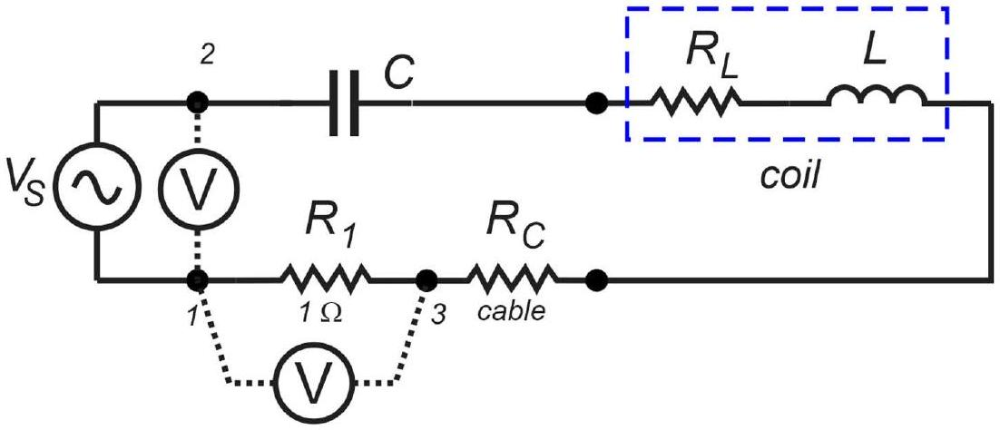
Figure 1. The series $R L C$ circuit

The cables involved in the circuit are two pieces of banana-to-pins cable (item\#6). Using ohmmeter we obtain: $\underline { R } _ { \mathrm { C } } = 0.09 \Omega$.

### 1.2 Resonance series RLC circuit

Then we determine the resonant condition where the impedance $Z = V _ { S } / I$ reaches minimum or conductance $G = I / V _ { S }$ reaches maximum. A smart student should quickly scan the frequency first to quickly find the resonant condition and suitable frequency range before taking data, e.g. fix $V _ { \mathrm { S } }$ and scan $I$ as a function of frequency. We note that $V _ { \mathrm { S } }$ could vary due changing load impedance. The data is shown below:

|  | C(Y) | f(X) | VS(Y) | VR1(Y) | G(Y) |  | C(Y) | f(X) | VS(Y) | VR1(Y) | G(Y) |
| :--- | :--- | :--- | :--- | :--- | :--- | :--- | :--- | :--- | :--- | :--- | :--- |
| lame |  |  |  |  |  | me |  |  |  |  |  |
| Units | uF | kHz | V | V | S | nits |  |  | V   V |  |
| ents |  |  |  | (Vmax) | I/VS |  |  |  |  |  |
| 1 | 0.47 | 16.3 | 11.987 | 0.746 | 0.06223 |  | 2200   2200 | 20   20 | 4.034 | 0.936 | 0.23203 |
|  |  |  |  |  |  | 2 |  | 31 | 5.099 | 1.674 | 0.3283 |
| 2 |  | 21.6 |  |  |  | 3 |  | 53 | 5.023 | 2.207 | 0.43938 |
| 3 |  | 23.9 | 4.376 | 0.616 | 0.14077 | 4 |  | 79 | 4.833 | 2.474 | 0.5119 |
| 4 |  | 28.4 | 1.465 | 0.373 | 0.25461 | 5 |  | 109 | 4.795 | 2.55 | 0.5318 |
| 5 |  | 31.6 | 0.799 | 0.327 | 0.40926 | 6 |  | 228 | 4.643 | 2.835 | 0.6106 |
| 6 |  | 32.5 | 0.742 | 0.32 | 0.43127 | 7 |  | 282 | 4.643 | 2.892 | 0.62287 |
| 7 |  | 33 | 2.359 | 1.187 | 0.50318 | 8 |  | 305 | 4.643 | 2.852 | 0.61426 |
| 8 |  | 33.8 | 2.283 | 1.157 | 0.50679 | 9 |  | 328 | 4.643 | 2.854 | 0.61469 |
| 9 |  | 35.3 | 0.685 | 0.335 | 0.48905 | 10 |  | 369 | 4.643 | 2.854 | 0.61469 |
| 10 |  | 35.6 | 2.436 | 1.149 | 0.47167 | 11 |  | 463 | 4.567 | 2.854 | 0.62492 |
| 11 |  |  |  |  | 0.40266   0.40266 | 12 |  | 570 | 4.567 | 2.816 | 0.6166 |
| 11 |  | 36.7 | 1.351   1.351 | 0.544   0.544 |  |  |  | 710 | 4.49 | 2.816 | 0.62717 |
| 12 |  | 37.5 | 0.894 | 0.32 | 0.35794 | 14 |  | 877 | 4.414 | 2.74 | 0.62075 |
| 13 |  | 38.8 | 1.047 | 0.316 | 0.30181 |  |  | 1070 | 4.338 | 2.664 | 0.61411 |
| 14 |  | 40.6 | 1.332 | 0.335 | 0.2515 | 16 |  | 1390 | 4.186 | 2.55 | 0.60917 |
| 15 |  | 43.2 | 1.922 | 0.38 | 0.19771 | 17 |  | 1730 | 4.034 | 2.397 | 0.5942 |
| 16 |  | 48 | 3.235 | 0.464 | 0.14343 | 18 |  | 2170 | 3.844 | 2.207 | 0.57414 |
| 17 |  | 54.1 | 7.915 | 0.822 | 0.10385 | 19 |  | 3030 | 3.539 | 1.903 | 0.53772 |
| 18 |  | 64.8 | 4.719 | 0.373 | 0.07904 | 20 |  | 4360 | 3.254 | 1.522 | 0.46773 |

Table 1. $R L C$ resonance data for $C = 470 n F$ and $C = 2200 \mu F$

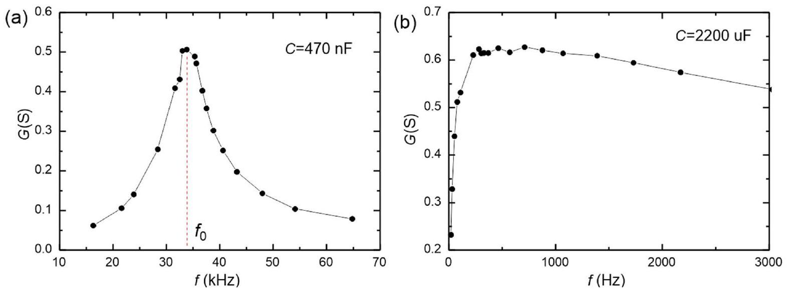
Figure 2. Resonance conductance plot of the RLC circuit with: (a) $C = 470 n F$, (b) $C = 2200 \mu F$.

|  | C(X) | f0(Y) | L(Y) |
| :--- | :--- | :--- | :--- |
| Units | uF | Hz | uH |
| mments |  | resonance |  |
| 1 | 0.47 | 33800 | 47.17 |
| 2 | 2200 | 400 | 71.96 |

Table 2. Results of $L$ determination from RLC resonance

The results are shown in Table 2. The resonance frequency is given as: $\omega _ { 0 } = 1 / \sqrt { L C }$, thus $L = 1 / \omega _ { 0 } { } ^ { 2 } C$. We note that the resonance data for $C = 470 \mathrm { nF }$ is nice and sharp and yields correct value of $L = 47.2 \mu \mathrm { H }$, while the data for $C = 2200 \mu \mathrm {~F}$ shows broad and poor resonance thus yield inaccurate value of $L = 72 \mu \mathrm { H }$. This happens because for a series RLC circuit the quality ( $Q$ ) factor is given as: $Q = \sqrt { L / C } / R$, therefore smaller capacitance yields a higher quality factor or sharper resonance curve.

### 1.3 Alternative model to extract $\boldsymbol { L }$ and $\boldsymbol { R } _ { \mathbf { L } }$

We can formulate the impedance as:

$$
\begin{align*}
& Z = R _ { T } + j ( \omega L - 1 / \omega C ) ,  \tag{1}\\
& Z ^ { 2 } = R _ { T } ^ { 2 } + ( \omega L - 1 / \omega C ) ^ { 2 } = R _ { T } ^ { 2 } + \omega ^ { 2 } L ^ { 2 } - 2 L / C + 1 / \omega ^ { 2 } C ^ { 2 } ,  \tag{2}\\
& Z ^ { 2 } - 1 / \omega ^ { 2 } C ^ { 2 } = \left( R _ { T } ^ { 2 } - 2 L / C \right) + \omega ^ { 2 } L ^ { 2 } \tag{3}
\end{align*}
$$

where the total resistance is: $R _ { T } = R _ { 1 } + R _ { C } + R _ { L }$, with $R _ { \mathrm { L } }$ is the coil internal resistance. We can linearize the last equation as: $y = a + b x$, where: $y = Z ^ { 2 } - 1 / \omega ^ { 2 } C ^ { 2 } , x = \omega ^ { 2 } , b = L ^ { 2 }$ and $a = R _ { T } { } ^ { 2 } - 2 L / C$. Note that since the inductor impedance dominate at high frequency we can also ignore the capacitance term: $1 / \omega ^ { 2 } C ^ { 2 }$ in the analysis.

We can solve for $L$ and $R _ { \mathrm { L } }$ as:

$$
\begin{align*}
& L = \sqrt { b }  \tag{4}\\
& R _ { L } = \sqrt { a + 2 L / C } - R _ { 1 } - R _ { C } \tag{5}
\end{align*}
$$

### 1.4 RLC experiment to extract $\boldsymbol { L }$ and $\boldsymbol { R } _ { \mathbf { L } }$ with $\mathbf { C } = \mathbf { 4 7 0 } \mathbf { ~ u F }$ and 1000 uF

We perform RLC experiments for $C = 470 \mu \mathrm {~F}$ and $1000 \mu \mathrm {~F}$ :

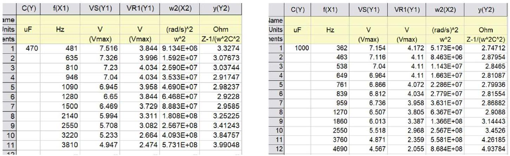
Table 3. $R L C$ measurements for $C = 470 \mu F$ and $1000 \mu F$

## SOLUTION

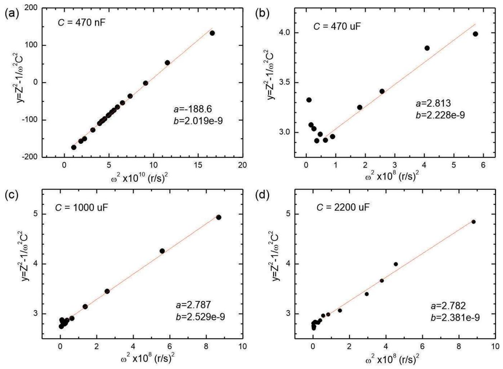
Figure 3. Extraction of $R _ { L }$ and $L$ with $C = 470 n F , 470 \mu F , 1000 \mu F$ and $2200 \mu F$.

Here are the results:

|  | C(X) | a(Y) | b(Y) | L(Y) | RL(Y) |
| :--- | :--- | :--- | :--- | :--- | :--- |
| Units | uF | Ohm^2 | H^2 | uH | Ohm |
| ients |  |  |  |  |  |
| 1 | 0.47 | -188.6 | 2.019 E - 9 | 44.93 | 0.524 |
| 2 | 470 | 2.813 | 2.228 E -9 | 47.20 | 0.646 |
| 3 | 1000 | 2.787 | 2.529 E -9 | 50.29 | 0.609 |
| 4 | 2200 | 2.503 | 2.737E-9 | 52.32 | 0.507 |

Table 4. Results of $L$ and $R _ { L }$ determination

We have average: $L = 48.7 \mu \mathrm { H }$ and average coil resistance: $R _ { \mathrm { L } } = 0.57 \Omega$. This is consistent with the original specification of the coil (Wurth Elektronik 760308101303): $L = 47 \mu \mathrm { H }$ and $R _ { \mathrm { L } } = 0.46 \Omega$.

Therefore this second technique is more accurate in determining $L$ even in the case where the resonance is poor. We obtain $R _ { \mathrm { L } }$ as a "bonus" from the analysis as it comes from the linear fit "intercept" however they are less accurate.

Measurement of $R _ { L }$ directly with the multimeter for verification is also acceptable, we obtain: $R _ { L } = ( 0.47 \pm 0.03 ) \Omega$.

## 2. EXP\#2: MUTUAL INDUCTION AND SKIN DEPTH

## 2.A Mutual Induction

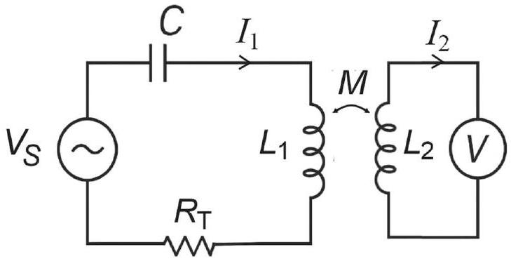
Figure 4. Mutual inductance setup

### 2.2 Mutual inductance experiment

Here we perform the measurement twice where the primary is coil\#1 and secondary is coil\#2 and then we swap them.

$$
\begin{gather*}
V _ { 2 } = - M \frac { d i _ { 1 } } { d t } + L _ { 2 } \frac { d i _ { 2 } } { d t } = - M \frac { d i _ { 1 } } { d t }  \tag{6}\\
Z ^ { \prime } = \frac { V _ { 2 } } { I _ { 1 } } = - j \omega M \tag{7}
\end{gather*}
$$

The self inductance contribution is negligible since the second coil is connected to voltmeter and $i _ { 2 } \sim$ 0 . Then we can tabulate the "impedance" $Z = V _ { 2 } / I _ { 1 }$ as a function of frequency and extract $M$.

|  | f(X) | I1(Y) | V2(Y) | Z(Y) |  | f(X) | 12(Y) | V1(Y) | Z(Y) |
| :--- | :--- | :--- | :--- | :--- | :--- | :--- | :--- | :--- | :--- |
| Units | Hz | A | V | Ohm | Inits | Hz | A | V | Ohm |
| ments |  |  |  |  |  |  |  |  |  |
| 1 | 1020 | 3.539 | 0.096 | 0.02713 | 1 | 1010 | 3.52 | 0.136 | 0.03864 |
| 2 | 1990 | 3.082 | 0.184 | 0.0597 | 2 | 2000 | 3.006 | 0.2 | 0.06653 |
| 3 | 3000 | 2.588 | 0.241 | 0.09312 | 3 | 3000 | 2.512 | 0.27 | 0.10748 |
| 4 | 4040 | 2.131 | 0.278 | 0.13046 | 4 | 4000 | 2.112 | 0.299 | 0.14157 |
| 5 | 5010 | 1.827 | 0.295 | 0.16147 | 5 | 5000 | 1.808 | 0.316 | 0.17478 |
| 6 | 6000 | 1.617 | 0.312 | 0.19295 | 6 | 6060 | 1.56 | 0.337 | 0.21603 |
| 7 | 7010 | 1.427 | 0.32 | 0.22425 | 7 | 7020 | 1.355 | 0.339 | 0.25018 |
| 8 | 8060 | 1.256 | 0.342 | 0.27229 | 8 | 8060 | 1.21 | 0.358 | 0.29587 |
| 9 | 9140 | 1.104 | 0.35 | 0.31703 | 9 | 9010 | 1.104 | 0.369 | 0.33424 |
| 10 | 10100 | 1.012 | 0.358 | 0.35375 | 10 | 10200 | 0.997 | 0.373 | 0.37412 |

Table 5. Mutual inductance determination

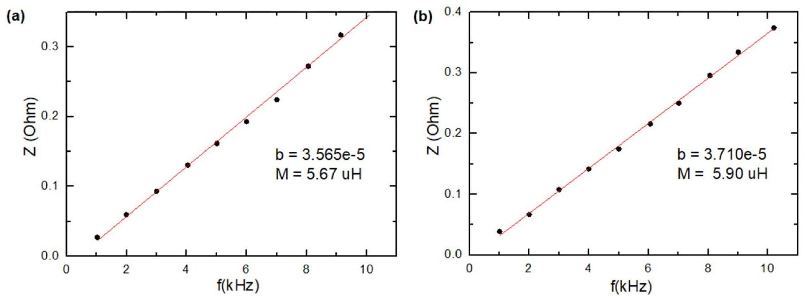
Figure 5. Mutual inductance determination results: (a) Primary=Coil\#1, Secondary=Coil\#2 (b) Primary=Coil\#2, Secondary=Coil\#1.

### 2.3 Mutual inductance results

We fit the data to linear equation: $y = a + b x$. Here we obtain the mutual inductance: $M = b / 2 \pi$, and we obtain $M$ reasonably close results between the two measurements: $M _ { 1 - 2 } = 5.67 \mu \mathrm { H }$ and $M _ { 2 - 1 } = 5.90$ $\mu \mathrm { H }$ with average: $M = 5.79 \mu \mathrm { H }$.

## 2.B Skin depth experiment

### 2.4 Skin depth equations model and experiments

Equation model to determine $n$ :
We can perform two-step linear regressions to extract $n$ and $\sigma$ as follows. For each metal we perform measurement of the voltage in secondary coil (coil\#1) which is proportional to $B$ after it passes through the metals:

$$
\begin{equation*}
V _ { 2 } \sim B ( z ) = B _ { 0 } \exp ( - z / \delta ) = B _ { 0 } \exp \left( - N t _ { 0 } / \delta ( f ) \right) \tag{8}
\end{equation*}
$$

where $t _ { 0 }$ is the metal thickness and $N$ is the number of metal. Therefore we expect the voltage in the secondary voltage will drop more metal plates. Therefore we can extract the skin depth at frequency $f$ from:

$$
\begin{equation*}
\ln V _ { 2 } = - t _ { 0 } / \delta ( f ) \times N + c _ { 0 } \tag{9}
\end{equation*}
$$

where $c _ { 0 }$ is a constant that we ignore. We can determine the skin depth at a frequency $f$ using :

$$
\begin{equation*}
\delta ( f ) = - t _ { 0 } / b _ { 1 } \tag{10}
\end{equation*}
$$

where $b _ { 1 }$ is the slope of $\ln \left( V _ { 2 } \right)$ vs. $N$ data.
Then we repeated this analyis at different frequencies, using Eq. 2 of the problem set:

$$
\begin{equation*}
\ln \delta = \frac { n } { 2 } \ln f + \frac { \ln \left( \sigma ^ { m } / \pi \mu \right) } { 2 } \tag{11}
\end{equation*}
$$

Using linear model: $y = a _ { 2 } + b _ { 2 } x$ of $\ln \delta$ vs. $\ln f$, we can obtain:

$$
\begin{equation*}
n = 2 \frac { \Delta \ln \delta } { \Delta \ln f } = 2 b _ { 2 } \tag{12}
\end{equation*}
$$

The conductivity (using $m = - 1$ as determined in Q2.5 later) is given as:

$$
\begin{equation*}
\sigma = \frac { \exp \left( - 2 a _ { 2 } \right) } { \pi \mu } \tag{13}
\end{equation*}
$$

Note: See Appendix A at the end for an alternative single regression analysis which is also valid but less accurate.

Skin Depth Experiments:
We inject the oscillating current to coil\#1 and measure the induced voltage at the coil\#2 while keep adding the metal pieces. The voltage in coil\#2 is proportional to the magnetic field generated from coil\#1 after attenuated by the metal pieces.

The student is expected to test first range of appropriate frequencies before taking data. To obtain the best results the student should perform the experiment with all 5 or 4 plates for each metal and repeat that at minimum 5 frequencies. The results are shown below.
(1) Aluminum:

|  | f(X) | V2(Y) | N(Y) | InV2(Y) |  | f(X) | V2(Y) | N(Y) | InV2(Y) |
| :--- | :--- | :--- | :--- | :--- | :--- | :--- | :--- | :--- | :--- |
| Units | Hz | V |  |  | Units | Hz | V |  |  |
| nents |  |  | \# plate |  | ments |  |  | \# plate |  |
| 1 | 1010 |  | 0 | -- | 25 | 3140 |  | 0 | -- |
| 2 | 1010 | 0.103 | 1 | -2.273 | 26 | 3140 | 0.16 | 1 | -1.833 |
| 3 | 1010 | 0.068 | 2 | -2.688 | 27 | 3140 | 0.093 | 2 | -2.375 |
| 4 | 1010 | 0.053 | 3 | -2.937 | 28 | 3140 | 0.063 | 3 | -2.765 |
| 5 | 1010 | 0.046 | 4 | -3.079 | 29 | 3140 | 0.046 | 4 | -3.079 |
| 6 | 1010 | 0.037 | 5 | -3.297 | 30 | 3140 | 0.034 | 5 | -3.381 |
| 7 | 1520 |  | 0 | -- | 31 | 3540 | 0.342 | 0 | -1.073 |
| 8 | 1520 | 0.114 | 1 | -2.172 | 32 | 3540 | 0.16 | 1 | -1.833 |
| 9 | 1520 | 0.084 | 2 | -2.477 | 33 | 3540 | 0.107 | 2 | -2.235 |
| 10 | 1520 | 0.064 | 3 | -2.749 | 34 | 3540 | 0.08 | 3 | -2.526 |
| 11 | 1520 | 0.05 | 4 | -2.996 | 35 | 3540 | 0.049 | 4 | -3.016 |
| 12 | 1520 | 0.036 | 5 | -3.324 | 36 | 3540 | 0.034 | 5 | -3.381 |
| 13 | 2010 |  | 0 | -- | 37 | 4000 |  | 0 | -- |
| 14 | 2010 | 0.129 | 1 | -2.048 | 38 | 4000 | 0.169 | 1 | -1.778 |
| 15 | 2010 | 0.081 | 2 | -2.513 | 39 | 4000 | 0.091 | 2 | -2.397 |
| 16 | 2010 | 0.057 | 3 | -2.865 | 40 | 4000 | 0.063 | 3 | -2.765 |
| 17 | 2010 | 0.046 | 4 | -3.079 | 41 | 4000 | 0.04 | 4 | -3.219 |
| 18 | 2010 | 0.036 | 5 | -3.324 | 42 | 4000 | 0.02 | 5 | -3.912 |
| 19 | 2660 |  | 0 | - | 43 | 4520 |  | 0 | -- |
| 20 | 2660 | 0.129 | 1 | -2.048 | 44 | 4520 | 0.335 | 1 | -1.094 |
| 21 | 2660 | 0.081 | 2 | -2.513 | 45 | 4520 | 0.167 | 2 | -1.790 |
| 22 | 2660 | 0.054 | 3 | -2.919 | 46 | 4520 | 0.099 | 3 | -2.313 |
| 23 | 2660 | 0.043 | 4 | -3.147 | 47 | 4520 | 0.065 | 4 | -2.733 |
| 24 | 2660 | 0.031 | 5 | -3.474 | 48 | 4520 | 0.034 | 5 | -3.381 |

|  | f(X1) | b(Y1) | delta(Y1) | t(Y1) | Inf(X2) | Indelta(X3) |
| :--- | :--- | :--- | :--- | :--- | :--- | :--- |
| Units | Hz | - | mm | mm | In(Hz) | ln(m) |
| ments |  | slope |  |  | $\ln ( \mathrm { f } )$ | In(delta) |
| 1 | 1010 | -0.2439 | 2.99303 | 0.73 | 6.918 | -5.811 |
| 2 | 1520 | -0.2824 | 2.58499 |  | 7.326 | -5.958 |
| 3 | 2010 | -0.3118 | 2.34094 |  | 7.606 | -6.057 |
| 4 | 2660 | -0.3485 | 2.09475 |  | 7.886 | -6.168 |
| 5 | 3140 | -0.3802 | 1.92026 |  | 8.052 | -6.255 |
| 6 | 3540 | -0.4395 | 1.66091 |  | 8.172 | -6.400 |
| 7 | 4000 | -0.5090 | 1.4341 |  | 8.294 | -6.547 |
| 8 | 4520 | -0.5519 | 1.32267 |  | 8.416 | -6.628 |

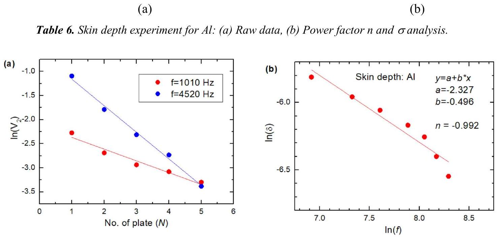
Figure 6. Skin depth analysis for Al: (a) Voltage at secondary coil vs. number of plate $N$ at two extreme frequencies (b) Skin depth vs. frequency to determine power factor $n$ and $\sigma$.

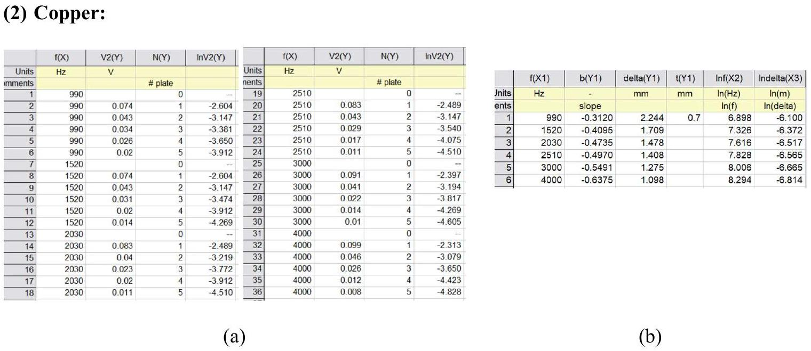
Table 7. Skin depth experiment for $C u :$ (a) Raw data, (b) Power factor $n$ and $\sigma$ analysis

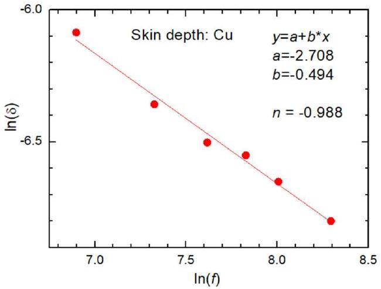
Figure 7. Skin depth analysis for Cu

(3) SS304:

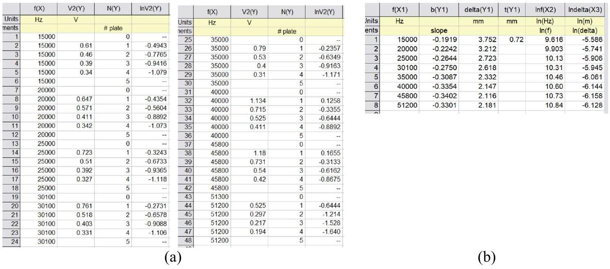
Table 8. Skin depth experiment for SS304: (a) Raw data, (b) Power factor $n$ and $\sigma$ analysis.

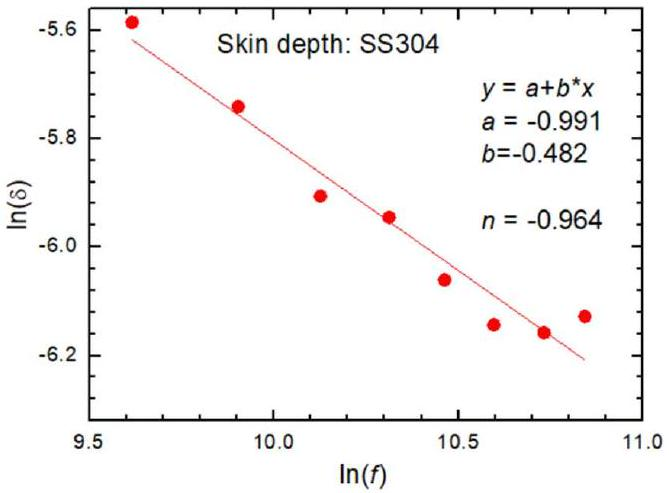
Figure 8. Skin depth analysis for SS304: Skin depth vs. frequency to determine power factor $n$ and $\sigma$.

## SOLUTION

(4) SS410:

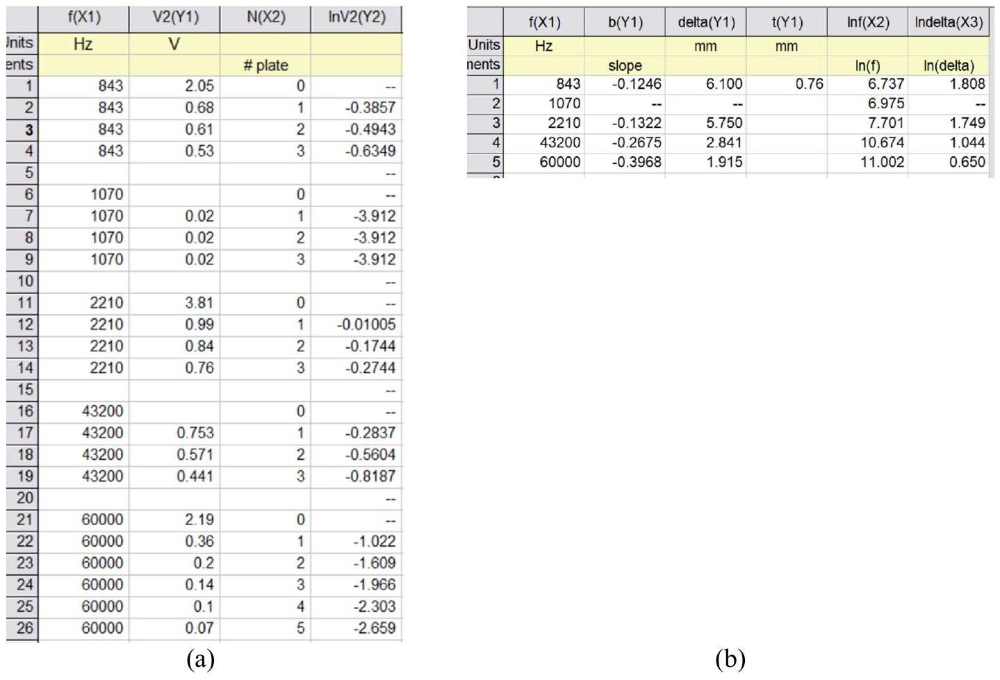
Table 9. Skin depth experiment for SS410: (a) Raw data, (b) Power factor $n$ and $\sigma$ analysis.

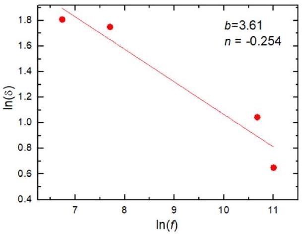
Figure 9. Skin depth analysis for SS410

We note that SS410 behaves differently, the output signal $V _ { 2 }$ drops greatly upon insertion of the metals. Upon final analysis it yields $n = - 0.5$ which is not correct.

Apparently because SS410 is magnetic, its skin depth is too small and almost no magnetic field could penetrate the metal and the fringing field around the metal becomes dominant thus the "skin depth"

## SOLUTION

measurement becomes anomalous. Thus SS410 is the metal with "extreme skin depth" and is excluded in the subsequent analysis.

The summary of the skin depth experiment is shown below:

|  | Metal(X) | a(Y) | b(Y) | n(Y) | sigma(Y) | sigmaR(Y) | sigmaEr |
| :--- | :--- | :--- | :--- | :--- | :--- | :--- | :--- |
| ame |  |  |  |  |  |  |  |
| Jnits |  |  |  |  | S/m | S/m | \% |
| ents |  | intercept | slope |  |  | Ref lit. | Error |
| 1 | Al | -2.327 | -0.496 | -0.992 | 2.66E+07 | 3.7E7 | -28.1 |
| 2 | Cu | -2.708 | -0.494 | -0.988 | 5.70E+07 | 5.88E7 | -3.1 |
| 3 | SS304 | -0.991 | -0.481 | -0.962 | $1.84 \mathrm { E } + 06$ | 1.39E6 | 32.3 |

Table 10. Summary results of the skin depth experiment. "sigmaErr" is the percentage error of the measured conductivity vs. the reference literature values ("sigmaR")

We observe from all three metals we obtain consistent frequency power factor with average $n = - 0.98$, and thus $\boldsymbol { n } = - \mathbf { 1 }$ (rounded to nearest integer).

### 2.5 Conductivity power factor $\boldsymbol { m }$

Since we have obtained $n = - 1$, from the Eq. 2 in the problem set:

$$
\begin{equation*}
\delta ^ { 2 } = \frac { \sigma ^ { m } } { \pi \mu f } \quad \text { or } \quad [ \sigma ] ^ { m } = [ \delta ] ^ { 2 } [ \mu ] [ f ] \tag{14}
\end{equation*}
$$

Using dimensional or unit analysis: $[ \sigma ] = 1 / \Omega . \mathrm { m } = \mathrm { A } / \mathrm { V } . \mathrm { m } , [ \delta ] = \mathrm { m } , [ \mu ] = \mathrm { H } / \mathrm { m } = \mathrm { V } . \mathrm { s } / \mathrm { A } . \mathrm { m }$ and $[ f ] = 1 / \mathrm { s }$, we have:

$$
\begin{equation*}
[ \mathrm { A } / \mathrm { V } . \mathrm { m } ] ^ { \boldsymbol { m } } = [ \mathrm { m } ] ^ { 2 } [ \mathrm {~V} . \mathrm { s } / \mathrm { A } . \mathrm { m } ] [ 1 / \mathrm { s } ] = [ \mathrm { V } . \mathrm { m } / \mathrm { A } ] \tag{15}
\end{equation*}
$$

Thus we get $\boldsymbol { m } = - 1$, and the final skin depth formula is:

$$
\begin{equation*}
\delta = \frac { 1 } { \sqrt { \pi \sigma \mu f } } \tag{16}
\end{equation*}
$$

### 2.6 Conductivity of the metals

The conductivity of the metals can be calculated using Eq. (13) and the results are shown in Table 10. We observe that our measured conductivity is reasonably good to the reference literature values (within +/- 30\% error). The larger uncertainty is due to the results originating from a value that depends exponentially on the intercepts [Eq. (13)].

Note: This method provides a very attractive approach to perform conductivity measurement in a material because it is non-contact.

## 3. EXP \#3: COOKING, SPECIFIC HEAT CAPACITY AND EFFECTIVE LOAD RESISTANCE

### 3.1 The induction cooking operating principle

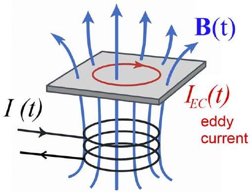
Figure 10. Principle of induction cooker

Operating principle:
Oscillating current drive to the coil → generate oscillating magnetic field → generate eddy current in the plate → generate Joule heating in the plate

### 3.2 Specific Heat of the metal pan

We developed a model that allow us to extract the specific heat capacity of the metal pan. The heat transfer energy balance can be modeled as total power input to the cooking pan is equal to the heating rate of the pan and radiation. We ignore convection losses as indicated in the problem.

$$
\begin{equation*}
P _ { I N } = m c d T / d t + e A \sigma _ { S } \left( T ^ { 4 } - T _ { 0 } ^ { 4 } \right) \tag{17}
\end{equation*}
$$

where $m$ is the mass of the metal pan, $c$ is the specific heat, $T$ is the plate temperature, $T _ { 0 }$ is the ambient temperature, $e$ is the emissivity, $A$ is the surface area of the radiating body and $\sigma _ { \mathrm { S } }$ is the Stefan Boltzmann constant.

We need to warm up the cooker first and then turn off the power input to let it cool. The cooling behavior is given as:

$$
\begin{equation*}
T ^ { 4 } = - \frac { m c } { e A \sigma _ { S } } \frac { d T } { d t } + T _ { 0 } ^ { 4 } = - \frac { \rho c t _ { 0 } } { 2 e \sigma _ { S } } \frac { d T } { d t } + T _ { 0 } ^ { 4 } \tag{18}
\end{equation*}
$$

We note that the factor of two comes from consideration that that the radiation area is twice the surface area of the metal i.e. $A = 2 W L$, where $W$ and $L$ is the width and the length of the "pan", $t _ { 0 }$ is

## SOLUTION

the metal thickness. We perform linear regression: $y = a + b x$, with $x$ is $\mathrm { d } T / \mathrm { d } t$ and $y$ is $T ^ { 4 }$ and we can ignore the effect of $T _ { 0 }$.

The specific heat can be calculated as:

$$
\begin{equation*}
c = - \frac { 2 e \sigma _ { S } b } { \rho t _ { 0 } } \tag{19}
\end{equation*}
$$

Note: It is possible to solve the differential equation in the Eq. (18), but the solution requires the knowledge of starting temperature $T _ { 0 }$ which could vary with repeated experiments, thus such solution is not practical.

### 3.3 Specific heat of the Aluminum pan

We then measure the thermistor resistor $\left( R _ { \mathrm { NTC } } \right)$ and calculate the pan temperature $T$ using Eq. (4) in the problem set. Specifically, we need to derive:

$$
\begin{equation*}
T = \left[ \frac { \ln \left( R / R _ { 0 } \right) } { B } + \frac { 1 } { T _ { 0 } } \right] ^ { - 1 } \tag{20}
\end{equation*}
$$

We record ambient temperature is $T = 306.5 \mathrm {~K} = 33.35 \mathrm { C }$, for completeness but this does not impact subsequent analysis. We can calculate the derivate $\mathrm { d } T / \mathrm { dt }$ at point $n$ numerically as:

$$
\begin{equation*}
\frac { d T _ { n } } { d t } = \frac { T _ { n + 1 } - T _ { n - 1 } } { t _ { n + 1 } - t _ { n - 1 } } \tag{21}
\end{equation*}
$$

We heat up the "pan" approximately for 1 min until the temperature reaches $325.4 \mathrm {~K} \left( 52.3 { } ^ { \circ } \mathrm { C } \right)$ which marks $t = 0 \mathrm {~s}$ and record the NTC resistance as a function of time as the "pan" cools.

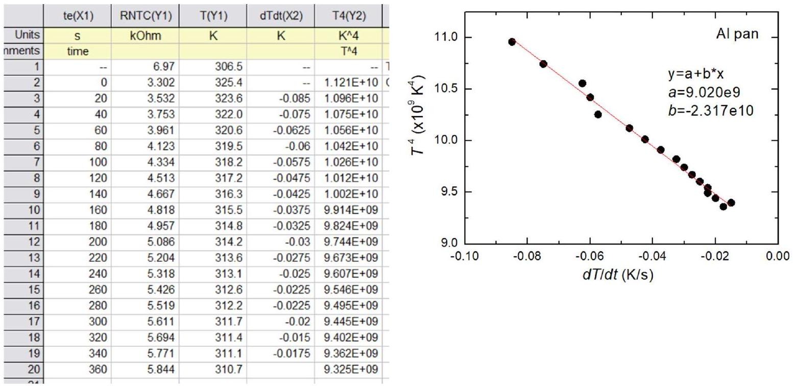
Figure 11. Specific heat measurement for Al pan

Using Eq. (19), $e = 0.65 , \rho = 2700 \mathrm {~kg} / \mathrm { m } ^ { 3 } , t _ { 0 } = 0.71 \mathrm {~mm}$, we obtain slope $b = - 2.317 \times 10 ^ { 10 }$ and specific heat $c = 890 \mathrm {~J} / \mathrm { kg }$.K. The literature value is $c _ { A l } = 900 \mathrm {~J} / \mathrm { kg } . \mathrm { K }$.

Note: In this Olympiad problem, the emissivity $e$ value is chosen yield $c$ close to the reference value.

### 3.4 Specific heat of the SS410 pan

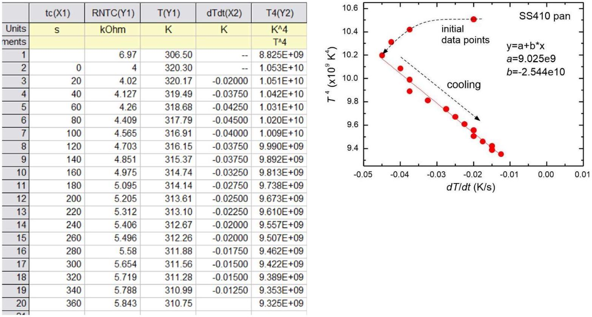
Figure 12. Specific heat measurement for SS410 pan

We note sometimes, like for SS410 here, the initial data do not form a straight line as the system has not reached a steady state, thus we only perform the analysis on the linear segment as expected from the model.

Using Eq. (19), $e = 0.8 , \rho = 7700 \mathrm {~kg} / \mathrm { m } ^ { 3 } , t _ { 0 } = 0.75 \mathrm {~mm}$, we obtain slope $b = - 2.544 \times 10 ^ { 10 }$ and specific heat $c = 400 \mathrm {~J} / \mathrm { kg }$.K. The literature value is $c _ { \mathrm { SS } 410 } = 460 \mathrm {~J} / \mathrm { kg }$.K.

### 3.5 Rload for Aluminum pan

Now we model that the pan appears as "load resistance" to the primary circuit. The power input given to the metal pan will increase the temperature of the "pan" and also radiate to the surrounding:

$$
\begin{equation*}
P _ { I N } = I ^ { 2 } R _ { L O A D } = m c d T / d t + e A \sigma _ { S } \left( T ^ { 4 } - T _ { 0 } ^ { 4 } \right) \tag{22}
\end{equation*}
$$

For later analysis, we can rearrange this to:

$$
\begin{align*}
& m c d T / d t + e A \sigma _ { S } T ^ { 4 } = I ^ { 2 } R _ { L O A D } + e A \sigma _ { S } T _ { 0 } ^ { 4 }  \tag{23}\\
& P _ { T O T } ^ { \prime } = P _ { C } + P _ { R A D } { } ^ { \prime } = I ^ { 2 } R _ { L O A D } + P _ { R A D , 0 } \tag{24}
\end{align*}
$$

where: $P _ { C } = m c d T / d t , P ^ { \prime } { } _ { R A D } = e A \sigma _ { S } T ^ { 4 }$ and $P _ { R A D , 0 } = e A \sigma _ { S } T ^ { 4 }$
We can perform linear fit of the experimental data of $P _ { \text {tot } }$ ' vs. $I ^ { 2 }$ following linear equation: $y = a + b x$, where: $y = P _ { \text {TOT } } { } ^ { \prime } , x = I ^ { 2 } , b = R _ { \text {LOAD } }$ and $a = P _ { \text {RAD } , 0 }$, which we assume to be constant and can be ignored.

Thus, we can obtain $R _ { \text {LOAD } }$ from the linear fit of $P _ { \text {TOT } }$ ' vs. $I ^ { 2 }$. Note: the current $I$ must be of RMS value since it is an AC current.

## Aluminum pan:

We now perform the "cooking" experiment on the Al "pan". We will vary the current to the circuit and monitor the heating behavior.

|  | Irms(Y) | te(Y) | RNTC(X) | T(Y) | dTdt(Y) ${ } ^ { \text {ma } }$ | Pc(Y) | Pradp(Y) | Ptotp(Y) | Ptotpave(Y) |
| :--- | :--- | :--- | :--- | :--- | :--- | :--- | :--- | :--- | :--- |
| Jnits | A | A | Ohm | K | K/s | W | W | W | W |
| ients |  |  |  |  |  |  |  |  |  |
| 2 | 0.4172 | Ambient | 6.6 | 307.80 | -- | -- | 0.26466 | -- | -- |
| 3 | (0.59 pk) | 20 | 6.546 | 308.00 | 8.704E-03 | $6.098 \mathrm { E } - 03$ | 0.26534 | 0.27143 | 0.27158 |
| 4 | -- | 40 | 6.505 | 308.15 | 7.483E-03 | 5.243E-03 | 0.26586 | 0.27110 | -- |
| 5 | -- | 60 | 6.465 | 308.30 | 7.819E-03 | 5.478E-03 | 0.26637 | 0.27185 |  |
| 6 | -- | 80 | 6.421 | 308.46 | 6.366E-03 | 4.460E-03 | 0.26694 | 0.27140 |  |
| 7 | -- | 100 | 6.397 | 308.55 | $5.184 \mathrm { E } - 03$ | 3.632E-03 | 0.26725 | 0.27088 |  |
| 8 | -- | 120 | 6.366 | 308.67 | 5.587E-03 | 3.915E-03 | 0.26766 | 0.27157 |  |
| 9 | - | 140 | 6.338 | 308.78 | 5.045E-03 | 3.535E-03 | 0.26802 | 0.27156 |  |
| 10 | -- | 160 | 6.313 | 308.87 | 4.782E-03 | 3.351E-03 | 0.26836 | 0.27171 |  |
| 11 | -- | 180 | 6.288 | 308.97 | 4.611E-03 | 3.231E-03 | 0.26869 | 0.27192 |  |
| 12 | -- | 200 | 6.265 | 309.06 | 4.245E-03 | 2.974E-03 | 0.269 | 0.27197 |  |
| 13 | -- | 220 | 6.244 | 309.14 | 3.874E-03 | 2.714E-03 | 0.26928 | 0.27199 |  |
| 14 | -- | 240 | 6.225 | 309.21 | -- | -- | 0.26954 | -- |  |
| 15 | -- | -- | -- | -- | -- | -- | -- | -- |  |

|  | Irms(Y) | te(Y) | RNTC(X) | T(Y) | $\operatorname { dTdt } ( \mathrm { Y } ) { } ^ { \text {® } }$ | Pc(Y) | Pradp(Y) | Ptotp(Y) | Ptotpave(Y) |
| :--- | :--- | :--- | :--- | :--- | :--- | :--- | :--- | :--- | :--- |
| s | A | A | Ohm | K | K/s | W | W | W | W |
| s |  |  |  |  | dT/dt | m*c*dT/dt | $\mathrm { e } ^ { * } \mathrm {~A} ^ { * } \mathrm { SB } ^ { * } \mathrm {~T} ^ { \wedge } 4$ | Pc+Prad' | Ptot'ave |
| 1 |  |  |  | -- | -- | -- | - | - |  |
| 2 | 0.4978 | 0 | 6.6 | 307.80 | -- | -- | 0.26466 | - | 0.27583 |
| 3 | (0.704 Apk) | 20 | 6.515 | 308.12 | 1.437E-02 | 1.007E-02 | 0.26573 | 0.27580 | -- |
| 4 |  | 40 | 6.444 | 308.38 | 1.251E-02 | 8.763E-03 | 0.26664 | 0.27540 |  |
| 5 |  | 60 | 6.381 | 308.62 | 1.114E-02 | 7.805E-03 | 0.26746 | 0.27526 |  |
| 6 |  | 80 | 6.326 | 308.82 | 1.040E-02 | 7.287E-03 | 0.26818 | 0.27547 |  |
| 7 |  | 100 | 6.272 | 309.03 | 9.436E-03 | 6.611E-03 | 0.2689 | 0.27551 |  |
| 8 |  | 120 | 6.228 | 309.20 | 8.550E-03 | 5.990E-03 | 0.2695 | 0.27549 |  |
| 9 |  | 140 | 6.184 | 309.37 | 8.127E-03 | 5.694E-03 | 0.2701 | 0.27579 |  |
| 0 |  | 160 | 6.145 | 309.53 | 7.697E-03 | 5.393E-03 | 0.27063 | 0.27602 |  |
| 1 |  | 180 | 6.106 | 309.68 | 7.353E-03 | 5.152E-03 | 0.27117 | 0.27632 |  |
| 2 |  | 200 | 6.071 | 309.82 | 6.804E-03 | 4.767E-03 | 0.27166 | 0.27643 |  |
| 3 |  | 220 | 6.038 | 309.95 | 6.444E-03 | 4.515E-03 | 0.27213 | 0.27664 |  |
| 4 |  | 240 | 6.007 | 310.08 | -- | -- | 0.27257 | - |  |
| 5 |  |  |  |  | -- | -- |  | -- |  |

|  | Irms(Y) | te(Y) | RNTC(X) | T(Y) | dTdt(Y) ${ } ^ { \text {A } }$ | Pc(Y) | Pradp(Y) | Ptotp(Y) | Ptotpave(Y) |  | Irms(Y) | te(Y) | RNTC(X) | T(Y) | dTdt(Y) ${ } ^ { \text {a } }$ | Pc(Y) | Pradp(Y) | Ptotp(Y) | Ptotpave(Y) |
| :--- | :--- | :--- | :--- | :--- | :--- | :--- | :--- | :--- | :--- | :--- | :--- | :--- | :--- | :--- | :--- | :--- | :--- | :--- | :--- |
| Units nents | A | A | Ohm | K | K/s dT/dt | W m*c*dT/dt | W e*A*sB*T^4 | W Pc+Prad' | W Ptot'ave | Units nments | A | A | Ohm | K | $\mathrm { K } / \mathrm { s }$ dT/dt | W m*c*dT/dt | W e*A*sB*T^4 | W Pc+Prad' | W Ptot'ave |
| 2 | 0.5650 | 0 | 6.6 | 307.80 | -- | -- | 0.26466 | - | 0.27863 | 1 |  |  |  | -- | -- | -- | -- | -- |  |
| 3 | (0.799 Apk) | 20 | 6.503 | 308.16 | 1.671E-02 | 1.171E-02 | 0.26588 | 0.27759 | -- | 2 | 0.6590 | 0 | 6.6 | 307.80 | -- | -- | 0.26466 | -- |  |
| 4 |  | 40 | 6.419 | 308.47 | 1.519E-02 | 1.064E-02 | 0.26696 | 0.27761 |  | 3 | (0.932 Apk) | 20 | 6.444 | 308.38 | 2.608E-02 | 1.827E-02 | 0.26664 | 0.28491 | 0.28476 |
| 5 |  | 60 | 6.341 | 308.77 | 1.398E-02 | 9.793E-03 | 0.26798 | 0.27778 |  | 4 |  | 40 | 6.32 | 308.85 | 2.213E-02 | 1.551E-02 | 0.26826 | 0.28377 | -- |
| 6 |  | 80 | 6.272 | 309.03 | 1.301E-02 | 9.113E-03 | 0.2689 | 0.27802 |  | 5 |  | 60 | 6.212 | 309.26 | 2.036E-02 | 1.426E-02 | 0.26971 | 0.28398 |  |
| 7 |  | 100 | 6.206 | 309.29 | 1.209E-02 | 8.469E-03 | 0.2698 | 0.27827 |  | 6 |  | 80 | 6.111 | 309.66 | 1.845E-02 | 1.292E-02 | 0.2711 | 0.28403 |  |
| 8 |  | 120 | 6.148 | 309.51 | 1.134E-02 | 7.946E-03 | 0.27059 | 0.27854 |  | 7 |  | 100 | 6.026 | 310.00 | 1.655E-02 | 1.159E-02 | 0.2723 | 0.28389 |  |
| 9 |  | 140 | 6.091 | 309.74 | 1.076E-02 | 7.539E-03 | 0.27138 | 0.27892 |  | 8 |  | 120 | 5.947 | 310.32 | 1.578E-02 | 1.105E-02 | 0.27343 | 0.28448 |  |
| 10 |  | 160 | 6.04 | 309.95 | 1.006E-02 | 7.052E-03 | 0.2721 | 0.27915 |  | 9 |  | 140 | 5.872 | 310.63 | 1.486E-02 | 1.041E-02 | 0.27452 | 0.28493 |  |
| 11 |  | 180 | 5.991 | 310.14 | 9.549E-03 | 6.690 E -03 | 0.2728 | 0.27949 |  | 10 |  | 160 | 5.804 | 310.92 | 1.370E-02 | 9.596E-03 | 0.27553 | 0.28513 |  |
| 12 |  | 200 | 5.946 | 310.33 | 8.916E-03 | 6.247E-03 | 0.27344 | 0.27969 |  | 11 |  | 180 | 5.742 | 311.18 | 1.270E-02 | 8.895E-03 | 0.27646 | 0.28536 |  |
| 13 |  | 220 | 5.904 | 310.50 | 8.369E-03 | 5.864E-03 | 0.27405 | 0.27992 |  | 12 |  | 200 | 5.685 | 311.43 | 1.198E-02 | 8.395E-03 | 0.27733 | 0.28573 |  |
| 14 |  | 240 | 5.865 | 310.66 | -- | -- | 0.27462 | -- |  | 13 |  | 220 | 5.631 | 311.66 | 1.135E-02 | 7.952E-03 | 0.27817 | 0.28612 |  |
| 15 |  |  |  |  | -- | -- |  | -- |  | 14 |  | 240 | 5.581 | 311.88 | -- | -- | 0.27895 | -- |  |
|  |  |  |  |  |  |  |  |  |  |  |  |  |  |  |  |  |  |  |  |
|  | Irms(Y) | te(Y) | RNTC(X) | T(Y) | $\operatorname { dTdt } ( \mathrm { Y } ) ^ { \mathrm { Ca } }$ | Pc(Y) | Pradp(Y) | Ptotp(Y) | Ptotpave(Y) |  |  |  |  |  |  |  |  |  |  |
| Units | A | A | Ohm | K | K/s | W | W | W | W |  |  |  |  |  |  |  |  |  |  |
| ments |  |  |  |  | dT/dt | m*c*dT/dt | e*A*sB*T^4 | Pc+Prad' | Ptot'ave |  |  |  |  |  |  |  |  |  |  |
| 1 |  |  |  | -- | -- | -- | -- | -- |  |  |  |  |  |  |  |  |  |  |  |
| 2 | 0.7260 | 0 | 6.6 | 307.80 | -- | -- | 0.26466 | - |  |  |  |  |  |  |  |  |  |  |  |
| 3 | (1.027 Apk) | 20 | 6.373 | 308.65 | 3.709E-02 | 2.598E-02 | 0.26756 | 0.29355 | 0.29137 |  |  |  |  |  |  |  |  |  |  |
| 4 |  | 40 | 6.206 | 309.29 | 2.998E-02 | 2.101E-02 | 0.2698 | 0.29080 | -- |  |  |  |  |  |  |  |  |  |  |
| 5 |  | 60 | 6.065 | 309.84 | 2.620E-02 | 1.836E-02 | 0.27175 | 0.29011 |  |  |  |  |  |  |  |  |  |  |  |
| 6 |  | 80 | 5.944 | 310.34 | 2.388E-02 | 1.673E-02 | 0.27347 | 0.29020 |  |  |  |  |  |  |  |  |  |  |  |
| 7 |  | 100 | 5.832 | 310.80 | 2.220E-02 | 1.555E-02 | 0.27511 | 0.29067 |  |  |  |  |  |  |  |  |  |  |  |
| 8 |  | 120 | 5.732 | 311.22 | 2.008E-02 | 1.407E-02 | 0.27662 | 0.29069 |  |  |  |  |  |  |  |  |  |  |  |
| 9 |  | 140 | 5.644 | 311.60 | 1.839E-02 | 1.288E-02 | 0.27797 | 0.29085 |  |  |  |  |  |  |  |  |  |  |  |
| 10 |  | 160 | 5.563 | 311.96 | 1.749E-02 | 1.225E-02 | 0.27924 | 0.29149 |  |  |  |  |  |  |  |  |  |  |  |
| 11 |  | 180 | 5.486 | 312.30 | 1.642E-02 | 1.150E-02 | 0.28047 | 0.29197 |  |  |  |  |  |  |  |  |  |  |  |
| 12 |  | 200 | 5.417 | 312.62 | 1.495E-02 | 1.047E-02 | 0.2816 | 0.29207 |  |  |  |  |  |  |  |  |  |  |  |
| 13 |  | 220 | 5.355 | 312.90 | 1.435E-02 | 1.005E-02 | 0.28263 | 0.29268 |  |  |  |  |  |  |  |  |  |  |  |
| 14 |  | 240 | 5.293 | 313.19 | - | -- | 0.28367 | - |  |  |  |  |  |  |  |  |  |  |  |
| 15 |  |  |  |  | -- | -- |  | - |  |  |  |  |  |  |  |  |  |  |  |

Table 11. Data for $R _ { \text {LOAD } }$ determination of the Aluminum pan using various current.

For calculation convenience, we tabulate all the properties of the Al pan as follows:

| Quantity | Symbol | Values |
| :--- | :--- | :--- |
| Emissivity | $e$ | 0.65 |
| Mass density | $\rho$ | $2700 \mathrm {~kg} / \mathrm { m } ^ { 3 }$ |
| Heat capacity | $c$ | $913.7 \mathrm {~J} / \mathrm { kg }$.K |
| Heat capacity reference | $c _ { \text {REF } }$ | $900 \mathrm {~J} / \mathrm { kg } . \mathrm { K }$ |
| Radiation area | A | $2 \times 2 \mathrm {~cm} \times 2 \mathrm {~cm} = 8 \times 10 ^ { - 4 } \mathrm {~m} ^ { 2 }$ |
| Volume | $V$ | $2 \mathrm {~cm} \times 2 \mathrm {~cm} \times 0.71 \mathrm {~mm} = 2.84 \times 10 ^ { - 7 } \mathrm {~m} ^ { 3 }$ |
| Mass | $m$ | $\rho V = 7.668 \times 10 ^ { - 4 } \mathrm {~kg}$ |
| Ambient temperature | $T _ { 0 }$ | $303.66 \mathrm {~K} \left( R _ { \text {NTC } 0 } = 7.864 \mathrm { k } \Omega \right)$ |

Table 12. Properties of the Al pan

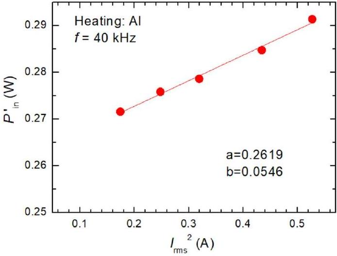

We then plot $P _ { \text {tot'ave } }$ vs. $I _ { \text {rms } } { } ^ { 2 }$ as shown above. The slope directly yields the load resistance $R _ { \text {LOAD } } =$ $54.6 \mathrm {~m} \Omega$.

### 3.6 Rload for the SS410 pan

Figure 13. "Effective load resistance" measurement of the aluminum pan.
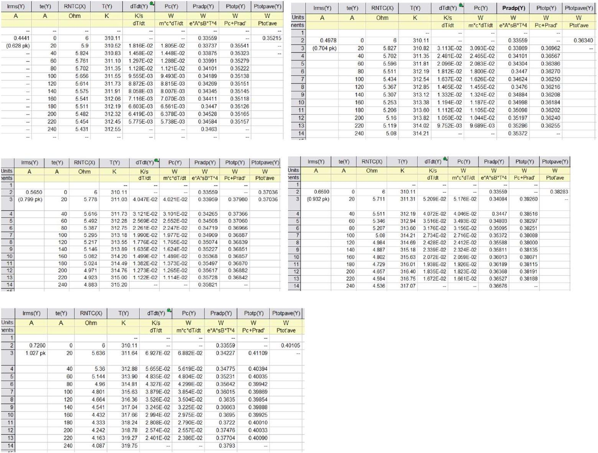

Table 13. Data for $R _ { \text {LOAD } }$ determination of the SS410 pan using various currents.

The properties of the SS410 pan:

| Quantity | Symbol | Values |
| :--- | :--- | :--- |
| Emissivity | $e$ | 0.8 |
| Mass density | $\rho$ | $7700 \mathrm {~kg} / \mathrm { m } ^ { 3 }$ |
| Heat capacity | $c$ | $464.7 \mathrm {~J} / \mathrm { kg } . \mathrm { K }$ |
| Heat capacity reference | $c _ { \text {REF } }$ | $460 \mathrm {~J} / \mathrm { kg } . \mathrm { K }$ |
| Radiation area | A | $2 \times 2 \mathrm {~cm} \times 2 \mathrm {~cm} = 8 \times 10 ^ { - 4 } \mathrm {~m} ^ { 2 }$ |
| Volume | V | $2 \mathrm {~cm} \times 2 \mathrm {~cm} \times 0.7 \mathrm {~mm} = 2.8 \times 10 ^ { - 7 } \mathrm {~m} ^ { 3 }$ |
| Mass | $m$ | $\rho V = 2.16 \times 10 ^ { - 3 } \mathrm {~kg}$ |
| Ambient temperature | $T _ { 0 }$ | $303.66 \mathrm {~K} \left( R _ { \text {NTC } 0 } = 7.864 \mathrm { k } \Omega \right)$ |

## SOLUTION

Table 14. Properties of the SS410 pan
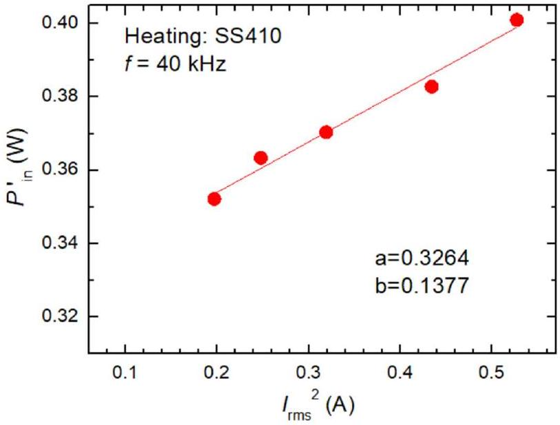

Figure 14. "Effective load resistance" measurement of the SS410 pan.
We then plot $P _ { \text {tot'ave } }$ vs. $I _ { \text {rms } } { } ^ { 2 }$ as shown above. The slope directly yields the load resistance $R _ { \text {LOAD } } =$ $137.7 \mathrm {~m} \Omega$ which is 2.5 x than that of the Al pan.
3.7 Better cooking pan: (b) SS410.
SS410 has significantly larger $R _ { \text {LOAD } } ( 2.5 \mathrm { x } )$ than that of Al, thus it is more efficient to be used as induction cooking pan.
3.8 Dominant physical parameter: (b) Magnetic permeability
SS410 is a magnetic stainless steel with very high permeability $\mu _ { \mathrm { r } } = 700$, thus it has very small skin depth according to Eq. (16). Therefore, its $R _ { \text {LOAD } }$ is high and becomes more efficient for "cooking".
3.9 Induction cooker efficiency:

$$
\begin{equation*}
\eta = \frac { P _ { I N D - C O O K } } { P _ { I N } } = \frac { I _ { r m s } ^ { 2 } R _ { L O A D } } { I _ { r m s } ^ { 2 } \left( R _ { L O A D } + R _ { L } \right) } = \frac { R _ { L O A D } } { R _ { L O A D } + R _ { L } } \tag{25}
\end{equation*}
$$

From Q1.5 we have $R _ { \mathrm { L } } = 0.48 \Omega$, we obtain: $\eta _ { \mathrm { Al } } = 10.2 \%$ and $\eta _ { \mathrm { SS } 410 } = 23.4 \%$. Therefore the SS410 metal is more efficient to be used as induction cooking pan.

In summary for induction cooker, we want high conductivity to allow large eddy current to be generated but very small skin-depth that could be obtained in magnetic (high permeability) material to yield higher load resistance.

## Appendix:

## A. Alternative Solution to skin depth analysis

For skin depth experiment we can also analyze the problem into a single linear regression analysis instead of two as shown below:

$$
\begin{equation*}
\ln \left[ \ln \left( \frac { V _ { i } } { V _ { i + 1 } } \right) \right] = - \frac { n } { 2 } \ln f + \frac { 1 } { 2 } \ln \left( \pi \sigma \mu t _ { 0 } ^ { 2 } \right) \tag{26}
\end{equation*}
$$

where $i$ is the index of plate used in the experiment. The conductivity can be obtained from the linear regression intercept $a$ :

$$
\begin{equation*}
\sigma = \exp ( 2 a ) / \pi \mu t _ { 0 } ^ { 2 } \tag{27}
\end{equation*}
$$

So essentially the student can perform the experiment with a single plate addition. An example of data is shown below:

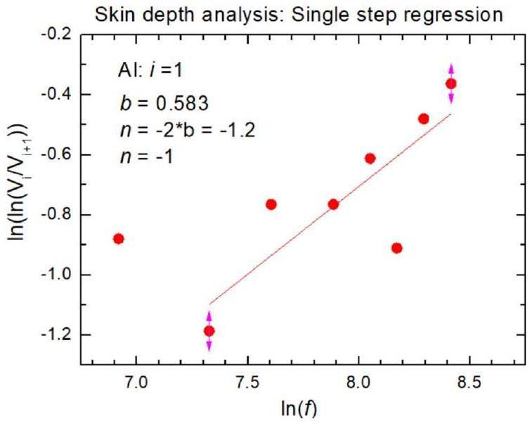
Figure 15. Single regression analysis for skin depth investigation.

The student can perform just two measurements e.g. $V _ { 2 }$ with metal $N = 1$ and $N = 2$. We could also obtain $n = - 1.2 \sim - 1$, and $\sigma = 1.0 \times 10 ^ { 7 } \mathrm {~S} / \mathrm { m }$ ( $- 73 \%$ error from reference). We observe that this technique is less accurate as it utilize less data compared to double linear regression model that utilize e.g. $\mathrm { N } = 5$ x 5 frequencies data set.
