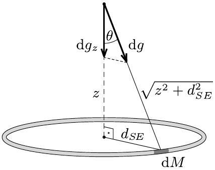
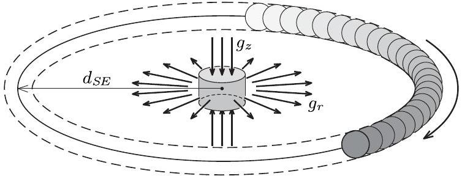
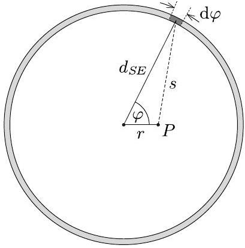
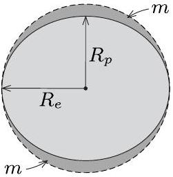
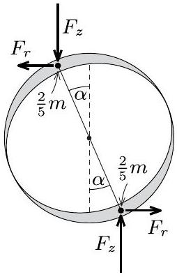
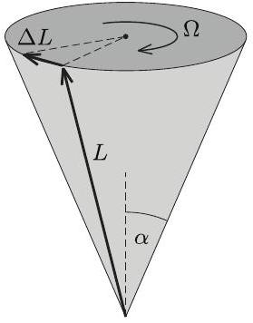

## T1. Precession of the Earth's axis (10 pts)

Part A. The shape of the Earth (1.0 p)
A.1. Let us express the dimensions of $h _ { \text {max } } , G , \omega$, $M _ { E }$ and $R$ in terms of the base dimensions length L, mass M and time T:

$$
\begin{aligned}
{ \left[ h _ { \max } \right] } & = \mathrm { L } , \\
{ [ G ] } & = \mathrm { L } ^ { 3 } \mathrm { M } ^ { - 1 } \mathrm {~T} ^ { - 2 } , \\
{ [ \omega ] } & = \mathrm { T } ^ { - 1 } , \\
{ \left[ M _ { E } \right] } & = \mathrm { M } , \\
{ [ R ] } & = \mathrm { L } .
\end{aligned}
$$

The relation given in the problem should hold for the dimensions too:

$$
\mathrm { L } = \left( \mathrm { L } ^ { 3 } \mathrm { M } ^ { - 1 } \mathrm {~T} ^ { - 2 } \right) ^ { - 1 } \mathrm {~T} ^ { - \beta } \mathrm { M } ^ { \gamma } \mathrm { L } ^ { \delta } .
$$

After simplification we get:

$$
\mathrm { L } = \mathrm { L } ^ { \delta - 3 } \mathrm { M } ^ { \gamma + 1 } \mathrm {~T} ^ { 2 - \beta } ,
$$

from which we get the following equations for the exponents:

$$
\begin{aligned}
& 0 = 2 - \beta , \\
& 0 = \gamma + 1 , \\
& 1 = \delta - 3 .
\end{aligned}
$$

From here we get $\beta = 2 , \gamma = - 1$ and $\delta = 4$.

| Task A.1. | Pts |
| :--- | :--- |
| Expressing the dimension of $G$ in terms of base dimensions | 0.2 |
| Setting up three equations for the exponents (0.1 p for each) | 0.3 |
| Correct values for exponents (0.1 p for each) | 0.3 |
| Total for Task A.1. | 0.8 |

A.2. In the light of the result of the previous subpart the relation for $h _ { \text {max } }$ reads as

$$
h _ { \max } \propto \frac { \omega ^ { 2 } R ^ { 4 } } { G M _ { E } } .
$$

Here $\omega = 2 \pi / ( 24 \mathrm {~h} ) = 7.27 \times 10 ^ { - 5 } \mathrm {~s} ^ { - 1 }$. Using 1 as the dimensionless constant, we get $h _ { \text {max } } = 21.9 \mathrm {~km}$.

| Task A.2. | Pts |
| :--- | :--- |
| Correct calculation of $\omega$ (even if it was done inherently) | 0.1 |
| Correct value for $h _ { \text {max } }$. 0 p if unit is missing. | 0.1 |
| Total for Task A.2. | 0.2 |

Part B. The time-averaged gravitational field of the Sun (3.2 p)
B.1. Solution I: Using the gravitational potential. At an arbitrary point on the $z$ axis the gravitational potential $U ( z )$ created by the ring is given by

$$
U ( z ) = - G \frac { M _ { S } } { \sqrt { z ^ { 2 } + d _ { S E } ^ { 2 } } } .
$$

The gravitational field can be found by differentiation with respect to $z$ :

$$
g _ { z } ( z ) = - \frac { \mathrm { d } U } { \mathrm {~d} z } = - G M _ { S } \frac { z } { \left( z ^ { 2 } + d _ { S E } ^ { 2 } \right) ^ { 3 / 2 } } .
$$

Expanding this to first order in $z$ we get:

$$
g _ { z } ( z ) \approx - \frac { G M _ { S } } { d _ { S E } ^ { 3 } } z .
$$

The negative sign means that $g _ { z }$ points towards the center of the Sun ring.

| Task B.1., Solution I. | Pts |
| :--- | :--- |
| Expressing the magnitude of $U ( z )$ on the axis in terms of $z$ correctly | 0.2 |
| Correct sign of $U ( z )$ | 0.1 |
| Expressing $g _ { z }$ as a derivative of $U ( z )$. (0.1 p if negative sign is not included) | 0.2 |
| Calculating the derivative correctly | 0.2 |
| Approximate form of $g _ { z }$ for $\| z \| \ll d _ { S E }$ | 0.1 |
| Indicating correct direction in the figure | 0.2 |
| Total for Task B.1. | 1.0 |

Solution II: Using the integration of fields. A small segment of the Sun ring with mass $\mathrm { d } M$ generates a field

$$
\mathrm { d } g = \frac { G \mathrm {~d} M } { z ^ { 2 } + d _ { S E } ^ { 2 } }
$$

on the symmetry axis of the ring at height $z$ (see Figure B.1).

Figure B.1.

Due to symmetry, the net field at the same point is parallel with the axis, so only the corresponding component of this field should be taken:

$$
\mathrm { d } g _ { z } = - \mathrm { d } g \cos \theta ,
$$

where the negative sign indicates the $- z$ direction. The angle $\theta$ is the same for all segments of the ring and

$$
\cos \theta = \frac { z } { \sqrt { z ^ { 2 } + d _ { S E } ^ { 2 } } } .
$$

Using these three equations and integrating over the mass of the ring we get the net field on the axis at arbitrary position:

$$
g _ { z } = - G M _ { S } \frac { z } { \left( z ^ { 2 } + d _ { S E } ^ { 2 } \right) ^ { 3 / 2 } }
$$

Using the relation $| z | \ll d _ { S E }$ this simplifies to:

$$
g _ { z } \approx - G M _ { S } \frac { z } { d _ { S E } ^ { 3 } }
$$

| Task B.1., Solution II. | Pts |
| :--- | :--- |
| Writing the gravitational field of an element of the ring | 0.2 |
| Figure with correct geometry | 0.1 |
| Taking only the $z$ component for symmetry reasons | 0.1 |
| Summing/integrating over the whole ring | 0.1 |
| Calculating the $g _ { z }$ at arbitrary $z$ correctly | 0.2 |
| Approximate form of $g _ { z }$ for $\| z \| \ll d _ { S E }$ | 0.1 |
| Indicating correct direction in the figure | 0.2 |
| Total for Task B.1. | 1.0 |

B.2. Solution I: Using Gauss's theorem. The radial component of the field $g _ { r }$ in the plane of the Sun ring can be found from the gravitational Gauss's law (see Figure B.2).

Figure B.2.

Apply Gauss's theorem for the cylindrical region of height $2 | z |$ and radius $r$ :

$$
g _ { r } 2 z \times 2 \pi r + g _ { z } 2 r ^ { 2 } \pi = 0 ,
$$

from where we get

$$
g _ { r } ( r ) = - \frac { r } { 2 z } g _ { z } ( z ) = \frac { G M _ { S } } { 2 d _ { S E } ^ { 3 } } r .
$$

The field points radially outwards.

| Task B.2., Solution I. | Pts |
| :--- | :--- |
| Idea of using Gauss's law | 0.5 |
| Taking a cylindrical Gaussian surface with axis $z$ near the center of the Sun ring | 0.4 |
| Writing Gauss's law correctly in terms of radial and axial fields (0.3 p in case of mistake in areas, 0 p if the error is dimensional) | 0.6 |
| Final result for $g _ { r }$ is proportional to $r ( 0 \mathrm { p }$ if not) | 0.3 |
| Correct proportionality constant in $g _ { r }$ (0.1 p for error in prefactor, 0 p for dimensional error) | 0.2 |
| Indicating correct direction in the figure | 0.2 |
| Total for Task B.2. | 2.2 |

Solution II: By integration of potential. Let us take a point $P$ in the plane of the sung ring at distance $r$ from the center (see Figure B.3).

Figure B.3.

The distance $s$ of a small element of the ring of angular size $\mathrm { d } \varphi$ located at angle $\varphi$ with respect to point $P$ is given by law of cosines:

$$
s = \sqrt { d _ { S E } ^ { 2 } + r ^ { 2 } - 2 d _ { S E } r \cos \varphi } .
$$

The gravitational potential at point $P$ due to the small segment can be written as

$$
\mathrm { d } U = - \frac { G M _ { S } } { s } \frac { \mathrm {~d} \varphi } { 2 \pi } ,
$$

so the net potential of the ring at point $P$ is

$$
U ( r ) = - \frac { G M _ { S } } { 2 \pi } \int _ { 0 } ^ { 2 \pi } \left( d _ { S E } ^ { 2 } + r ^ { 2 } - 2 d _ { S E } r \cos \varphi \right) ^ { - \frac { 1 } { 2 } } \mathrm {~d} \varphi .
$$

Let us make the indegrand dimensionless:

$$
U ( r ) = - \frac { G M _ { S } } { 2 \pi d _ { S E } } \int _ { 0 } ^ { 2 \pi } \left( 1 + \frac { r ^ { 2 } } { d _ { S E } ^ { 2 } } - \frac { 2 r \cos \varphi } { d _ { S E } } \right) ^ { - \frac { 1 } { 2 } } \mathrm {~d} \varphi .
$$

To simplify the integral we can use the fact that $r \ll d _ { S E }$. Introducing the quantity

$$
\varepsilon = \frac { r ^ { 2 } } { d _ { S E } ^ { 2 } } - \frac { 2 r \cos \varphi } { d _ { S E } }
$$

$( \varepsilon \ll 1 )$ we can expand the integrand up to second order in $\varepsilon$ :

$$
( 1 + \varepsilon ) ^ { - \frac { 1 } { 2 } } \approx 1 - \frac { \varepsilon } { 2 } + \frac { 3 \varepsilon ^ { 2 } } { 8 } .
$$

After writing back the expression of $\varepsilon$ and keeping terms up to quadratic order in $r / d _ { S E }$ we get:

$$
( 1 + \varepsilon ) ^ { - \frac { 1 } { 2 } } \approx 1 - \frac { r ^ { 2 } } { 2 d _ { S E } ^ { 2 } } + \frac { r \cos \varphi } { d _ { S E } } + \frac { 3 r ^ { 2 } \cos ^ { 2 } \varphi } { 2 d _ { S E } ^ { 2 } } .
$$

The third term on the right side is canceled after integrating over $\varphi$, so the potential takes the form

$$
U ( r ) = - \frac { G M _ { S } } { 2 \pi d _ { S E } } \int _ { 0 } ^ { 2 \pi } \left( 1 - \frac { r ^ { 2 } } { 2 d _ { S E } ^ { 2 } } + \frac { 3 r ^ { 2 } \cos ^ { 2 } \varphi } { 2 d _ { S E } ^ { 2 } } \right) \mathrm { d } \varphi .
$$

Using that $\int _ { 0 } ^ { 2 \pi } \cos ^ { 2 } \varphi \mathrm {~d} \varphi = \pi$ (from the analogy with the calculation of real power in AC circuits), the integral can be evaluated:

$$
U ( r ) = - \frac { G M _ { S } } { 2 \pi d _ { S E } } \left( 2 \pi - 2 \pi \frac { r ^ { 2 } } { 2 d _ { S E } ^ { 2 } } + \frac { 3 \pi r ^ { 2 } } { 2 d _ { S E } ^ { 2 } } \right) .
$$

This simplifies to

$$
U ( r ) = - \frac { G M _ { S } } { d _ { S E } } - \frac { G M _ { S } r ^ { 2 } } { 4 d _ { S E } ^ { 3 } } .
$$

The gravitational field is the negative gradient of the potential:

$$
g _ { r } ( r ) = - \frac { \mathrm { d } U } { \mathrm {~d} r } = \frac { G M _ { S } } { 2 d _ { S E } ^ { 3 } } r .
$$

| Task B.2., Solution II. | Pts |
| :--- | :--- |
| Expressing distance $s$ from trigonometry | 0.2 |
| Writing the potential generated by a small element of the ring | 0.1 |
| Writing $U ( r )$ as an integral | 0.1 |
| Taylor expansion of the integrand up to second order in $r$ (0.1 p if only first order is calculated, 0.4 p if the term with $\cos ^ { 2 } \varphi$ is missing) | 0.6 |
| Integrating over $\varphi \left( 0.1 \mathrm { p } \right.$ if the term $\cos ^ { 2 } \varphi$ is missing) | 0.2 |
| Expressing $g _ { z }$ as a derivative of $U ( z )$. (0.1 p if negative sign is not included) | 0.2 |
| Calculating the derivative correctly | 0.1 |
| Final result for $g _ { r }$ is proportional to $r$ (0 p if not) | 0.3 |
| Correct proportionality constant in $g _ { r }$ (0.1 p for error in prefactor, 0 p for dimensional error) | 0.2 |
| Indicating correct direction in the figure | 0.2 |
| Total for Task B.2. | 2.2 |

Part C. The torque acting on the Earth (2.6 p)
C.1. The ellipsoid of revolution can be transformed into a perfect sphere of radius $R _ { e }$ (see Figure C.1.) by stretching it uniformly along the polar diameter by a factor $R _ { e } / R _ { p }$, so the volume of the ellipsoid is given by

$$
V _ { \text {ellipsoid } } = \frac { 4 \pi } { 3 } R _ { e } ^ { 3 } \frac { R _ { p } } { R _ { e } } = \frac { 4 \pi } { 3 } R _ { e } ^ { 2 } R _ { p } .
$$

Figure C.1.

The volume of one of the excess regions is:

$$
V = \frac { 1 } { 2 } \left( \frac { 4 \pi } { 3 } R _ { e } ^ { 3 } - \frac { 4 \pi } { 3 } R _ { e } ^ { 2 } R _ { p } \right) = \frac { 2 \pi } { 3 } R _ { e } ^ { 2 } h _ { \max } .
$$

The density of the homogeneous Earth is $\varrho =$ $3 M _ { E } / \left( 4 \pi R _ { e } ^ { 2 } R _ { p } \right)$, so the mass of one of the excess regions is the following:

$$
m = \varrho V = \frac { 3 M _ { E } } { 4 \pi R _ { e } ^ { 2 } R _ { p } } \frac { 2 \pi } { 3 } R _ { e } ^ { 2 } h _ { \max } = \frac { h _ { \max } } { 2 R _ { p } } M _ { E } .
$$

| Task C.1. | Pts |
| :--- | :--- |
| Idea of stretching the ellipsoid into sphere | 0.2 |
| Volume of one of the excess regions | 0.3 |
| Correct expression for the density of Earth | 0.1 |
| Final result for $m$ | 0.2 |
| Total for Task C.1. | 0.8 |

C.2. The torque acting on the perfect sphere of radius $R _ { e }$ is zero due to symmetry. From the superposition principle outlined in the problem, it follows that the torque $\vec { \tau }$ acting on the ellipsoid-shaped Earth is equal in magnitude but opposite in direction to the torque $\overrightarrow { \tau ^ { \prime } }$ acting on the two equivalent point masses (each of mass $2 m / 5$ ): $\vec { \tau } = - \overrightarrow { \tau ^ { \prime } }$.

Figure C.2. The forces acting on the two point masses.

The magnitude of the torque acting on the point masses can be calculated with the help of Figure C.2 as

$$
\left| \overrightarrow { \tau ^ { \prime } } \right| = | \vec { \tau } | = 2 F _ { z } R \sin \alpha + 2 F _ { r } R \cos \alpha ,
$$

where

$$
\begin{aligned}
F _ { z } & = \frac { 2 } { 5 } m \left| g _ { z } \right| = \frac { 2 } { 5 } m G M _ { S } \frac { R \cos \alpha } { d _ { S E } ^ { 3 } } \\
F _ { r } & = \frac { 2 } { 5 } m \left| g _ { r } \right| = \frac { 2 } { 5 } m G M _ { S } \frac { R \sin \alpha } { 2 d _ { S E } ^ { 3 } }
\end{aligned}
$$

Substituting these forces into the expression for $\tau ^ { \prime }$ and simplifying we get:

$$
| \vec { \tau } | = \frac { 6 } { 5 } \frac { G m M _ { S } } { d _ { S E } ^ { 3 } } R ^ { 2 } \sin \alpha \cos \alpha .
$$

Using the result of part C.1. this can be written as

$$
| \vec { \tau } | = \frac { 3 } { 5 } \frac { G M _ { E } M _ { S } } { d _ { S E } ^ { 3 } } R h _ { \max } \sin \alpha \cos \alpha .
$$

The torque $\overrightarrow { \tau ^ { \prime } }$ is pointing out of the plane of Figure C.2, so the torque $\vec { \tau }$ acting on the ellipsoid-shaped Earth is pointing into the plane.

| Task C.2. | Pts |
| :--- | :--- |
| Idea that the net torque acting on a perfect sphere is zero (even if it was done inherently) | 0.1 |
| Idea of $\vec { \tau } = - \overrightarrow { \tau ^ { \prime } }$ (even if it was done inherently) | 0.2 |
| Including the terms coming from $F _ { r }$ and $F _ { z }$ in the torque correctly (0.4 p each) No points are given for the formula $\vec { \tau } = \vec { r } \times \vec { F }$ itself. | 0.8 |
| Adding the two contributions with the correct sign | 0.2 |
| Calculation leading to the correct net torque | 0.3 |
| Correct direction for $\vec { \tau }$ | 0.2 |
| Total for Task C.2. | 1.8 |

Part D. Angular speed of the precession of the Earth's axis ( 2.0 p)
D.1. The torque acting on the Earth results a change in its angular momentum vector $\vec { L }$ :

$$
\vec { \tau } = \frac { \mathrm { d } \vec { L } } { \mathrm {~d} t } ,
$$

where $\vec { L }$ is parallel with the angular velocity of Earth's rotation and its magnitude (assuming a uniform mass distribution and neglecting the deviation from a sphere) is given by

$$
| \vec { L } | = \frac { 2 } { 5 } M _ { E } R ^ { 2 } \omega .
$$

Since $\vec { \tau }$ (i.e. the rate of change of the angular momentum vector) is perpendicular to $\vec { L }$, the length of $\vec { L }$ remains constant but its direction changes, as shown in Figure D.1. As a result, the vector $\vec { L }$ sweeps along the side of a cone of half apex angle $\alpha$.

Figure D.1.

Drawing an analogy with a uniform circular motion, we can write an equation between $L$, its time derivative and the angular speed of precession:

$$
\left| \frac { \mathrm { d } \vec { L } } { \mathrm {~d} t } \right| = \Omega _ { 1 } | \vec { L } | \sin \alpha .
$$

From this equation the angular speed of precession $\Omega _ { 1 }$ can be expressed:

$$
\Omega _ { 1 } = \frac { \tau } { L \sin \alpha } = \frac { \frac { 3 } { 5 } G M _ { E } M _ { S } R h _ { \max } \sin \alpha \cos \alpha / d _ { S E } ^ { 3 } } { \frac { 2 } { 5 } M _ { E } R ^ { 2 } \omega \sin \alpha } ,
$$

where we used our previous result for $\tau$. After simplifying:

$$
\Omega _ { 1 } = \frac { 3 } { 2 } \frac { G M _ { S } h _ { \max } } { d _ { S E } ^ { 3 } R \omega } \cos \alpha .
$$

From this the period of precession:

$$
T _ { 1 } = \frac { 2 \pi } { \Omega _ { 1 } } = \frac { 4 \pi } { 3 } \frac { d _ { S E } ^ { 3 } R \omega } { G M _ { S } h _ { \max } \cos \alpha } .
$$

| Task D.1. | Pts |
| :--- | :--- |
| Newton's second law for rotational motion (0 p if it is clearly not in a vectorial form or components) | 0.2 |
| Expressing the angular momentum in terms of $\omega$ and the moment of inertia | 0.2 |
| Writing the moment of inertia as $\frac { 2 } { 5 } M _ { E } R ^ { 2 }$ (0.1 p for incorrect prefactor, 0 p for dimensional error) | 0.2 |
| Writing $\| \mathrm { d } \vec { L } / \mathrm { d } t \|$ in terms of $L , \Omega _ { 1 }$ and $\alpha$ | 0.8 |
| Using the equation $\Omega _ { 1 } = 2 \pi / T _ { 1 }$ | 0.1 |
| Finding $T _ { 1 }$ correctly | 0.3 |
| Total for Task D.1. | 1.8 |

D.2. After substituting the data we get the numerical value of the period:

$$
T _ { 1 } = 80600 \text { years. }
$$

| Task D.2. | Pts |
| :--- | :--- |
| Correct numerical result for $T _ { 1 }$. Full points for correct substitution into a dimensionally correct formula. Full points for using the calculated value for $h _ { \text {max } }$ (resulting $T _ { 1 } = 77400$ years.) 0 p if the substitution is incorrect or the formula has a dimensional error. | 0.2 |
| Total for Task D.2. | 0.2 |

Part E. The effect of the Moon (1.2 p)
E.1. In a similar fashion as in Part D, we can write the torque exerted by the Moon as

$$
\tau _ { M } = \frac { 3 } { 5 } \frac { G M _ { E } M _ { M } } { d _ { M E } ^ { 3 } } R h _ { \max } \sin \alpha \cos \alpha .
$$

If the effect of the Moon is taken into account, the torques exerted by the Sun and the Moon add up, and as a result, the net torque can be written as

$$
\tau _ { 2 } = \frac { 3 } { 5 } G M _ { E } \left( \frac { M _ { S } } { d _ { S E } ^ { 3 } } + \frac { M _ { M } } { d _ { M E } ^ { 3 } } \right) R h _ { \max } \sin \alpha \cos \alpha .
$$

As we have seen it previously, the angular speed of precession in terms of the torque is

$$
\Omega _ { 2 } = \frac { \tau _ { 2 } } { L \sin \alpha } ,
$$

so we get

$$
\frac { \Omega _ { 2 } } { \Omega _ { 1 } } = \frac { \tau _ { 2 } } { \tau _ { 1 } } = \frac { M _ { S } / d _ { S E } ^ { 3 } + M _ { M } / d _ { M E } ^ { 3 } } { M _ { S } / d _ { S E } ^ { 3 } } .
$$

The ratio of the periods is the inverse of this:

$$
\frac { T _ { 2 } } { T _ { 1 } } = \frac { M _ { S } / d _ { S E } ^ { 3 } } { M _ { S } / d _ { S E } ^ { 3 } + M _ { M } / d _ { M E } ^ { 3 } } .
$$

| Task E.1. | Pts |
| :--- | :--- |
| Stating that the torques of the Sun and the Moon add up | 0.3 |
| Calculating the torque exerted by the Moon or using that it is proportional to $M _ { M } / d _ { S E } ^ { 3 }$ | 0.4 |
| Expressing $T _ { 2 } / T _ { 1 }$ correctly (0 p if $T _ { 1 } < T _ { 2 }$ ) | 0.3 |
| Total for Task E.1. | 1.0 |

E.2. After substitution we get

$$
T _ { 2 } = 25400 \text { years, }
$$

which is quite close to the value obtained by modern observations.

| Task E.2. | Pts |
| :--- | :--- |
| Correct numerical result for $T _ { 2 }$. Full points for using the calculated value for $h _ { \text {max } }$ (resulting $T _ { 1 } = 24400$ years. 0 p if the result does not come from substitution (e.g. the student uses the value written in the introduction of the problem) or the substitution is incorrect. 0 p if the result comes from a formula with dimensional error | 0.2 |
| Total for Task E.2. | 0.2 |
