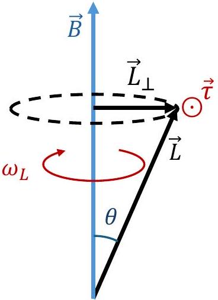
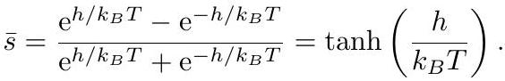
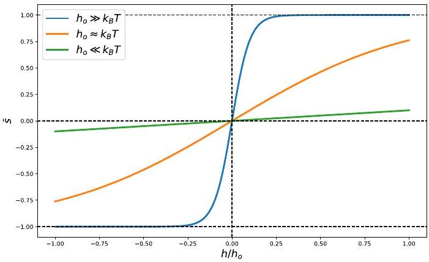
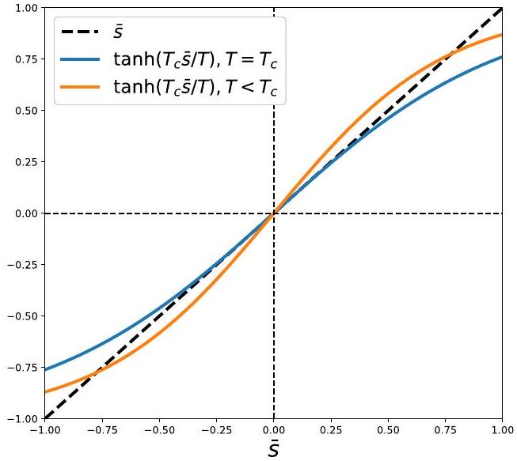
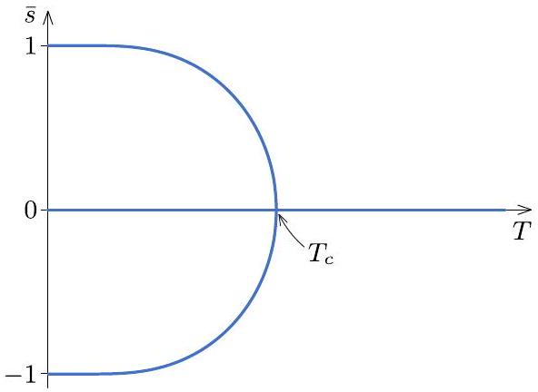

## T2. Waves and Phase Transitions in Spin Systems (10.0 pts) Final grading scheme

Part A. Precession and interactions of magnetic dipoles (1.2 points)
A.1: The angular momentum of the planar loop rotating around its perpendicular axis is given by

$$
\vec { L } = M R ^ { 2 } \vec { \omega } ,
$$

while the current generated by the rotation is $I =$ $Q / T = \omega Q / 2 \pi$, then the magnetic dipole moment of the planar loop is given by

$$
\vec { \mu } = I A \hat { \omega } = \frac { \omega Q } { 2 \pi } \pi R ^ { 2 } \hat { \omega } = \frac { Q } { 2 } R ^ { 2 } \vec { \omega } .
$$

It follows that

$$
\vec { \mu } = \frac { Q } { 2 M } \vec { L }
$$

and

$$
\gamma = \frac { Q } { 2 M } .
$$

| Grading scheme for Task A.1. | Pts |
| :--- | :--- |
| correct result for $L$ (just magnitude is fine) | 0.1 |
| correct result for $\mu$ in terms of given quantities (just magnitude is fine) | 0.1 |
| correct result for $\gamma$ | 0.1 |
| Total | 0.3 |

Grading note: Writing the final answer without justification receives a maximum of 0.1pts.
A.2: The torque acting on a magnetic dipole due to an external magnetic field is given by

$$
\vec { \tau } = \vec { \mu } \times \vec { B } = \frac { \mathrm { d } \vec { L } } { \mathrm {~d} t }
$$

Since only the component perpendicular to $\vec { B }$ can change, and it rotates with angular velocity $\omega _ { L }$, we write

$$
\Rightarrow L \omega _ { L } \sin \theta = - \mu B \sin \theta
$$

from which we deduce

$$
\omega _ { L } = - \frac { \mu } { L } B = - \gamma B .
$$

Note: The torque equation can be found by drawing an analogy to the electric dipole case.

| Grading scheme for Task A.2. | Pts |
| :--- | :--- |
| Writing the torque formula | 0.1 |
| Realizing only the perpendicular component $L \sin \theta$ is changing (or writing $d \vec { L } / d t = \vec { \omega } _ { L } \times \vec { L }$ ) | 0.1 |
| Correct magnitude for $\omega _ { L }$ | 0.1 |
| Correct sign for $\omega _ { L }$ | 0.1 |
| Total | 0.4 |

Grading note: If the correct final answer for $\omega _ { L }$ is written without justification, a maximum of 0.2 is given.
A.3: The magnetic field due to the first dipole on the second is

$$
\vec { B } _ { 1 \text { on } 2 } = - \frac { \mu _ { 0 } } { 4 \pi } \frac { \vec { \mu } _ { 1 } } { d ^ { 3 } } .
$$

Then

$$
U = - \vec { \mu } _ { 2 } \cdot \vec { B } _ { 1 \text { on } 2 } = - \frac { \mu _ { 0 } } { 4 \pi d ^ { 3 } } \mu _ { 1 } \mu _ { 2 } \cos ( \pi - \theta )
$$

leading to

$$
U = \frac { \mu _ { 0 } \gamma ^ { 2 } } { 4 \pi d ^ { 3 } } \vec { L } _ { 1 } \cdot \vec { L } _ { 2 }
$$

and

$$
J _ { 0 } \equiv \frac { \mu _ { 0 } \gamma ^ { 2 } } { 4 \pi d ^ { 3 } } .
$$

| Grading scheme for Task A.3. | Pts |
| :--- | :--- |
| Writing the interaction energy correctly | 0.1 |
| Writing the correct magnetic field magnitude | 0.1 |
| Writing the correct magnetic field direction | 0.1 |
| Correct magnitude for $J _ { 0 }$ | 0.1 |
| Correct sign for $J _ { 0 }$ | 0.1 |
| Total | 0.5 |

Grading note 1: If the direction of magnetic field is not explicitly drawn or written, then credit is given if and only if the sign for interaction energy AND $J _ { 0 }$ are correct.
Grading note 2: If multiple mistakes lead to $J _ { 0 }$ having the correct sign, then no partial credit is awarded to that.

## Part B. Spin waves (4.5 points)

B.1: The $i$ th spin interacts with the $i - 1$ and $i + 1$ spins, with an energy $E _ { i } = - J \left( \vec { S } _ { i - 1 } + \vec { S } _ { i + 1 } \right) \cdot \vec { S } _ { i }$ which is analogous to $E _ { i } = - \vec { B } _ { i } \cdot \vec { \mu } _ { i }$. Using $\vec { \mu } _ { i } = \gamma \vec { S } _ { i }$, we find

$$
\vec { B } _ { i , \mathrm { eff } } = \frac { J } { \gamma } \left( \vec { S } _ { i - 1 } + \vec { S } _ { i + 1 } \right) .
$$

| Grading scheme for Task B.1. | Pts |
| :--- | :--- |
| Explicit understanding that $i - 1$ and $i + 1$ are the contributors for spin $i$ | 0.1 |
| Correct result for effective magnetic field (if sign is wrong, then a maximum of 0.1 is given) | 0.2 |
| Total | 0.3 |

Grading note: Writing the correct result directly receives full credit.
B.2: Given the effective magnetic field

$$
\begin{aligned}
\frac { \mathrm { d } \vec { S } _ { i } } { \mathrm {~d} t } & = \vec { \tau } = \vec { \mu } _ { i } \times \vec { B } _ { i , \text { eff } } \\
& = J \vec { S } _ { i } \times \left( \vec { S } _ { i - 1 } + \vec { S } _ { i + 1 } \right)
\end{aligned}
$$

| Grading scheme for Task B.2. | Pts |
| :--- | :--- |
| Writing the rate of change of $\vec { S }$ using the effective magnetic field | 0.1 |
| Correct equation | 0.2 |
| Total | 0.3 |

B.3: We can write the rate of change of the $x$ and $y$ components of $\vec { S } _ { i }$, keeping in mind the approximation $S _ { i , z } \approx S$ for all $i$.

$$
\begin{aligned}
\frac { \mathrm { d } S _ { i , x } } { \mathrm {~d} t } & = J \left[ S _ { i , y } \left( S _ { i - 1 , z } + S _ { i + 1 , z } \right) \right. \\
& \left. - S _ { i , z } \left( S _ { i - 1 , y } + S _ { i + 1 , y } \right) \right] \\
& \approx J S \left( 2 S _ { i , y } - S _ { i - 1 , y } - S _ { i + 1 , y } \right)
\end{aligned}
$$

and

$$
\begin{aligned}
\frac { \mathrm { d } S _ { i , y } } { \mathrm {~d} t } & = J \left[ - S _ { i , x } \left( S _ { i - 1 , z } + S _ { i + 1 , z } \right) \right. \\
& \left. - S _ { i , z } \left( S _ { i - 1 , x } + S _ { i + 1 , x } \right) \right] \\
& \approx - J S \left( 2 S _ { i , x } - S _ { i - 1 , x } - S _ { i + 1 , x } \right) .
\end{aligned}
$$

The structure of these equations along with the traveling wave behavior leads us to the ansatz

$$
\begin{aligned}
& S _ { i , x } = \delta S \cos ( k x - \omega t ) \\
& S _ { i , y } = \delta S \sin ( k x - \omega t ) ,
\end{aligned}
$$

Where $\delta S$ is the amplitude. This yields

$$
\begin{aligned}
\omega \delta S \sin ( k x - \omega t ) & = J S \delta S \cdot [ 2 \sin ( k x - \omega t ) \\
& - \sin ( k x - \omega t - k a ) \\
& - \sin ( k x - \omega t + k a ) ] .
\end{aligned}
$$

Using $\sin ( A ) + \sin ( B ) = 2 \sin \left( \frac { A + B } { 2 } \right) \cos \left( \frac { A - B } { 2 } \right)$, we get

$$
\omega ( k ) = 2 J S [ 1 - \cos ( k a ) ] .
$$

Note: We can show that the amplitude for $S _ { x }$ equals that of $S _ { y }$, by substituting predictions with $\delta S _ { x }$ and $\delta S _ { y }$, which leads to

$$
\begin{aligned}
\omega \delta S _ { x } \sin ( k x - \omega t ) & = J S \delta S _ { y } \cdot [ 2 \sin ( k x - \omega t ) \\
& - \sin ( k x - \omega t - k a ) \\
& - \sin ( k x - \omega t + k a ) ] \\
\omega \delta S _ { y } \cos ( k x - \omega t ) & = J S \delta S _ { x } \cdot [ 2 \cos ( k x - \omega t ) \\
& - \cos ( k x - \omega t - k a ) \\
& - \cos ( k x - \omega t + k a ) ]
\end{aligned}
$$

which can only be satisfied given $\delta S _ { x } = \delta S _ { y }$.

| Grading scheme for Task B.3. | Pts |
| :--- | :--- |
| Writing the correct explicit equation of motion for either $S _ { x }$ or $S _ { y }$ | 0.5 |
| Explicit use of $S _ { z } \approx S$ | 0.2 |
| Writing traveling waves as function of $k x \pm \omega t$ (either sign is okay, either trig function or complex exponentials is okay) | 0.3 |
| Same amplitude for $S _ { x }$ and $S _ { y }$ | 0.2 |
| Correct phase relation between $S _ { x }$ and $S _ { y }$ (a difference of $\pi / 2$ ) | 0.3 |
| Correct final result (± is okay) | 0.5 |
| Total | 2.0 |

Grading note 1: credit should be given to the amplitudes equality and phase difference even if not proved. Grading note 2: In case the student does not arrive at the correct final solution, but has made a serious attempt at the algebra involving trig identities or complex exponentials, then up to 0.2 points may be rewarded.
B.4: For small $k$,

$$
\omega ( k ) \approx 2 J S \left[ 1 - 1 + \frac { 1 } { 2 } ( k a ) ^ { 2 } \right] = J S a ^ { 2 } k ^ { 2 }
$$

The de Broglie relations are $E = \hbar \omega$ and $p = \hbar k$, plugging these into the expression for $\omega ( k )$, we find

$$
E = \hbar \omega = \frac { J S a ^ { 2 } } { \hbar } p ^ { 2 } \equiv \frac { p ^ { 2 } } { 2 m _ { \mathrm { eff } } } ,
$$

where

$$
m _ { \mathrm { eff } } \equiv \frac { \hbar } { 2 J S a ^ { 2 } } .
$$

| Grading scheme for Task B.4. | Pts |
| :--- | :--- |
| Correct Taylor expansion result | 0.2 |
| Correct relation between momentum and wave vector | 0.1 |
| Correct relation between energy and angular frequency | 0.1 |
| Correct identification of effective mass | 0.2 |
| Total | 0.6 |

Grading notes: If the student did not find the correct $\omega ( k )$, but states that a massive particle has energy $E = p ^ { 2 } / 2 m$, then give 0.1 points (with a max of 0.3 given both de Broglie relations).
B.5: In this inelastic scattering, energy and momentum for the entire system (including the chain) is conserved. In particular, the spin wave does not have a momentum along the $y$-axis. Therefore

$$
p _ { \text {in } } \cos \theta _ { \text {in } } = p _ { \text {out } } \cos \theta _ { \text {out } } .
$$

Combining this with $E _ { n } = p _ { n } ^ { 2 } / 2 m _ { n }$ valid for the neutron, we find

$$
E _ { \mathrm { out } } = \left( \frac { \cos \theta _ { \mathrm { in } } } { \cos \theta _ { \mathrm { out } } } \right) ^ { 2 } E _ { \mathrm { in } }
$$

Using energy conservation, the energy $E _ { s }$ of the spin wave is $E _ { s } = E _ { \text {in } } - E _ { \text {out } }$, so we get

$$
E _ { s } = \frac { \cos ^ { 2 } \theta _ { \mathrm { out } } - \cos ^ { 2 } \theta _ { \mathrm { in } } } { \cos ^ { 2 } \theta _ { \mathrm { out } } } E _ { \mathrm { in } }
$$

Conservation of momentum along the $x$-axis gives

$$
\begin{aligned}
p _ { s } & = p _ { \text {in } } \sin \theta _ { \text {in } } - p _ { \text {out } } \sin \theta _ { \text {out } } \\
& = \sqrt { 2 m _ { n } E _ { \text {in } } } \left( \sin \theta _ { \text {in } } - \frac { \cos \theta _ { \text {in } } } { \cos \theta _ { \text {out } } } \sin \theta _ { \text {out } } \right) .
\end{aligned}
$$

Then from $m _ { \text {eff } } = p _ { s } ^ { 2 } / 2 E _ { s }$, we find

$$
m _ { \mathrm { eff } } = \frac { \cos ^ { 2 } \theta _ { \mathrm { out } } \left( \sin \theta _ { \mathrm { in } } - \frac { \cos \theta _ { \mathrm { in } } } { \cos \theta _ { \mathrm { out } } } \sin \theta _ { \mathrm { out } } \right) ^ { 2 } } { \cos ^ { 2 } \theta _ { \mathrm { out } } - \cos ^ { 2 } \theta _ { \mathrm { in } } } m _ { n }
$$

which after simplifying gives

$$
m _ { \mathrm { eff } } = \frac { \sin ^ { 2 } \left( \theta _ { \mathrm { in } } - \theta _ { \mathrm { out } } \right) } { \cos ^ { 2 } \theta _ { \mathrm { out } } - \cos ^ { 2 } \theta _ { \mathrm { in } } } m _ { n } = \frac { \sin \left( \theta _ { \mathrm { in } } - \theta _ { \mathrm { out } } \right) } { \sin \left( \theta _ { \mathrm { in } } + \theta _ { \mathrm { out } } \right) } m _ { n } .
$$

| Grading scheme for Task B.5. | Pts |
| :--- | :--- |
| Conservation of momentum along $y$-axis | 0.4 |
| Conservation of momentum along $x$-axis | 0.3 |
| Conservation of energy | 0.2 |
| Relation between $E _ { \text {out } }$ and $E _ { \text {in } }$ | 0.1 |
| Correct final answer (should be in either two forms at the end, otherwise 0.2) | 0.3 |
| Total | 1.3 |

Part C. Phase transitions in spin chains (4.3 points)
C.1: In a Boltzmann distribution, given the system's temperature $T$, the probability to find a system in a given state with energy $\varepsilon _ { i }$ is

$$
p _ { i } \propto \exp \left( - \frac { \varepsilon _ { i } } { k _ { B } T } \right) .
$$

In this case, the probability to find a spin up state of energy $\varepsilon _ { \uparrow } = - h s _ { \uparrow } = - h$ is

$$
p _ { \uparrow } \sim \mathrm { e } ^ { h / k _ { B } T } .
$$

Therefore,

$$
\frac { p _ { \uparrow } } { p _ { \downarrow } } = \frac { \mathrm { e } ^ { h / k _ { B } T } } { \mathrm { e } ^ { - h / k _ { B } T } } = \mathrm { e } ^ { 2 h / k _ { B } T } .
$$

| Grading scheme for Task C.1. | Pts |
| :--- | :--- |
| Use of Boltzmann factor | 0.2 |
| Correct final result for the ratio | 0.3 |
| Total | 0.5 |

Grading note 2: even if the final answer is written immediately, the student must at least write $p \propto$ $\exp \left( - E / k _ { B } T \right)$ to receive full credit.
C.2: The average polarization of the system $\bar { s }$ can be written as

$$
\begin{aligned}
\bar { s } & = \frac { 1 } { N } \sum _ { i } s _ { i } , \\
& = \frac { 1 } { N } \left[ N p _ { \uparrow } \cdot 1 + N p _ { \downarrow } \cdot ( - 1 ) \right] , \\
& = p _ { \uparrow } - p _ { \downarrow } ,
\end{aligned}
$$

where $N p _ { \uparrow }$ and $N p _ { \downarrow }$ are the number of spin vectors pointing up and down, respectively. We also note that normalization requires $p _ { \uparrow } + p _ { \downarrow } = 1$. Thus, a full solution for $p _ { \uparrow }$ and $p _ { \downarrow }$ is

$$
\begin{align*}
& p _ { \uparrow } = \frac { \mathrm { e } ^ { h / k _ { B } T } } { \mathrm { e } ^ { h / k _ { B } T } + \mathrm { e } ^ { - h / k _ { B } T } } ,  \tag{1}\\
& p _ { \downarrow } = \frac { \mathrm { e } ^ { - h / k _ { B } T } } { \mathrm { e } ^ { h / k _ { B } T } + \mathrm { e } ^ { - h / k _ { B } T } } .
\end{align*}
$$

Substituting for probabilities, we find

| Grading scheme for Task C.2. | Pts |
| :--- | :--- |
| Deducing $\bar { s } = p _ { \uparrow } - p _ { \downarrow }$ | 0.2 |
| Normalization condition $p _ { \uparrow } + p _ { \downarrow } = 1$ | 0.1 |
| Final result for $\bar { s }$ | 0.1 |
| Correct sketches (0.2 each) | 0.6 |
| Total | 1.0 |

Grading note 1: For a sketch to be correct, it has to include labels of both axes and has intercept at (0, 0). For $h _ { o } \gg k _ { B } T , \bar { s }$ has to approach $\pm 1$ quickly. For $h _ { o } \ll k _ { B } T$, it should look like a line with tiny slope. For $h _ { o } \approx k _ { B } T$, it should be in-between the two cases. Grading note 2: Only drawing axes with labels (but no correct sketch) deserves NO points. If the students draw the correct sketch but have no labels, then a max of 0.1 per sketch is given.
C.3: The energy of the system is minimized when all the spins are aligned, so

$$
\begin{equation*}
E _ { g } = - \tilde { J } \sum _ { i } 1 = - \tilde { J } ( N - 1 ) \approx - \tilde { J } N , \tag{4}
\end{equation*}
$$

where we used $N \gg 1$.

| Grading scheme for Task C.3. | Pts |
| :--- | :--- |
| Realizing the spins minimize their energy by aligning along the same direction | 0.1 |
| Correct result (both $N - 1$ and $N$ are fine) | 0.1 |
| Total | 0.2 |

C.4:

$$
E = - \tilde { J } \sum _ { i } s _ { i } s _ { i + 1 } = - \tilde { J } \sum _ { i } s _ { i } \bar { s } = - \tilde { J } _ { \mathrm { eff } } \sum _ { i } s _ { i } ,
$$

where we define $\tilde { J } _ { \text {eff } } = \tilde { J } \bar { s }$. Using $2 \bar { s }$ is double counting the energy.

| Grading scheme for Task C.4. | Pts |
| :--- | :--- |
| Realizing $s _ { i + 1 }$ can be replaced with $\bar { s }$ | 0.1 |
| Correct final result | 0.1 |
| Total | 0.2 |

Grading note: If the student uses $2 \bar { s }$, then no partial credit. However, no propagating error from this specific mistake for the following parts.
C.5: By looking at the earlier equation given in part C.4, and comparing it to what we had earlier in C.2, we find that the average polarization $\bar { s }$ should satisfy the following transcendental equation:

$$
\bar { s } = \tanh \left( \frac { \tilde { J } _ { \mathrm { eff } } } { k _ { B } T } \right) = \tanh \left( \frac { \tilde { J } _ { \bar { s } } } { k _ { B } T } \right) .
$$

With the help of the plots we did earlier in C.2, one can see that for $\tilde { J } \ll k _ { B } T$, there exists only one simple solution, $\bar { s } = 0$. Where as for $\tilde { J } \gg k _ { B } T$, there exist two non-trivial solutions. As clarified by the figure below, this crossing behavior occurs when the tangent line for $\tanh \left( \tilde { J } _ { \bar { s } } / k _ { B } T \right)$ at $\bar { s } = 0$ equals the slope of $\bar { s }$ :

$$
\begin{gathered}
\left. \frac { d } { d \bar { s } } \tanh \left( \frac { \tilde { J } \bar { s } } { k _ { B } T _ { c } } \right) \right| _ { \bar { s } = 0 } = \left. \frac { d } { d \bar { s } } \bar { s } \right| _ { \bar { s } = 0 } \\
\left. \Rightarrow \frac { \tilde { J } } { k _ { B } T _ { c } } \frac { 1 } { \cosh ^ { 2 } \left( \tilde { J } \bar { s } / k _ { B } T _ { c } \right) } \right| _ { \bar { s } = 0 } = 1 \\
\Rightarrow \frac { \tilde { J } } { k _ { B } T _ { c } } = 1 ,
\end{gathered}
$$

leading to $T _ { c } = \tilde { J } / k _ { B }$.

| Grading scheme for Task C.5. | Pts |
| :--- | :--- |
| stating $\bar { s } = \tanh \left( \tilde { J } _ { \text {eff } } / k _ { B } T \right)$ | 0.1 |
| Replacing $\tilde { J } _ { \text {eff } }$ for $h$ in $\bar { s }$ results from C. 2 | 0.2 |
| Realizing that there is one trivial solution for $\tilde { J } \ll k _ { B } T$ | 0.2 |
| Realizing that there are two non-trivial solutions for $\tilde { J } \gg k _ { B } T$ | 0.2 |
| Clearly stating the condition when the number of solutions changes | 0.3 |
| Correct final result for $T _ { c }$ | 0.2 |
| Total | 1.2 |

Grading note 1: The student might skip finding the derivatives, but only pictorially show the transition condition. In this case, the student receives full credit. Grading note 2: If the student does not explicitly mention the number of solutions in the different regime, but reach the result for $T _ { c }$, they receive full credit. Grading note 3: If the students writes $T _ { c }$ without justification, they do not receive the credit for the final answer.
C.6: Near the critical temperature, the average polarization is small. Thus, we can approximate the transcendental equation as

$$
\bar { s } = \tanh \left( \frac { T _ { c } } { T } \bar { s } \right) \approx \frac { T _ { c } } { T } \bar { s } - \frac { 1 } { 3 } \left( \frac { T _ { c } } { T } \bar { s } \right) ^ { 3 } .
$$

We see that $\bar { s } = 0$ is still a solution. After rearranging for $\bar { s } \neq 0$, we get

$$
\begin{aligned}
\bar { s } & = \pm \sqrt { 3 \left[ \left( \frac { T } { T _ { c } } \right) ^ { 2 } - \left( \frac { T } { T _ { c } } \right) ^ { 3 } \right] } \\
& = \pm \sqrt { 3 \left( \frac { T } { T _ { c } } \right) ^ { 2 } \left( 1 - \frac { T } { T _ { c } } \right) } \\
& \approx \pm \sqrt { 3 \frac { T _ { c } - T } { T _ { c } } } ,
\end{aligned}
$$

where we have used $\left( T / T _ { c } \right) ^ { 2 } \approx 1$.

| Grading scheme for Task C.6. | Pts |
| :--- | :--- |
| Using the proper approximation for tanh | 0.1 |
| Correct non-trivial solutions for $\bar { s }$, even if not fully simplified (0.1 each) | 0.2 |
| Sketch $\bar { s } = 0$ as the only solution above $T _ { c }$ | 0.1 |
| The non trivial solutions are vertical at $T _ { c }$ | 0.2 |
| $\bar { s } = 0$ is sketched as a solution for $T < T _ { c }$ | 0.1 |
| The two non-trivial solutions monotonically increase to ±1 at $T = 0$ (0.1 each) | 0.2 |
| Either non-trivial solutions have a zero slope approaching $T = 0$. | 0.1 |
| Total | 1.0 |

Grading note 1:The vertical slope at $T _ { c }$ has to be very clear. It is an important physical signature of phase transitions, so the student has to emphasize it in the sketch to receive credit for it.
Grading note 2: the credit associated with slope approaching zero as $T \rightarrow 0$ can be given even if the student does not plot the negative solution.
C.7: In the absence of magnetic fields, when $T > T _ { c }$, there is only one solution at $\bar { s } = 0$, which means that the system cannot maintain a net polarization. However, applying a magnetic field leads to a net magnetization, which is a characteristic of paramagnets. On the other hand, when $T < T _ { c }$, the system can support a net magnetization even in the absence of magnetic fields, which is the characteristic of ferromagnets.

| Grading scheme for Task C.7. | Pts |
| :--- | :--- |
| Correct choice for $T > T _ { c }$ | 0.1 |
| Correct choice for $T < T _ { c }$ | 0.1 |
| Total | 0.2 |

Grading note: No justification is needed for credit. If multiple choices are chosen, then no credit. In case the choices were changed, only give credit if the final choice is correct and clear.
