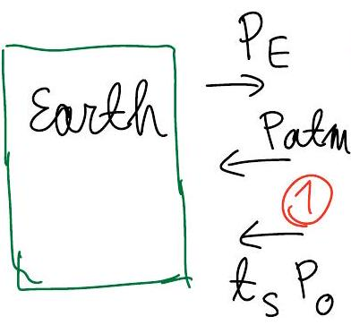
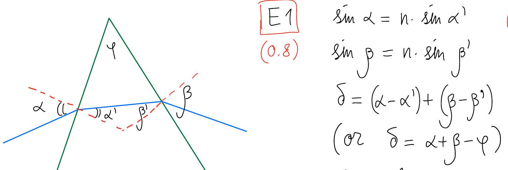
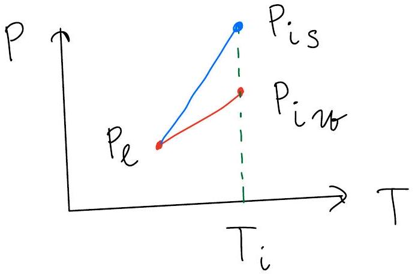

T3-Part A
errors with $\left\{ t _ { \ell } , t _ { s } , a \right\}$ are physics = dimension!
A1 $\quad A _ { \text {eff } } = \pi R ^ { 2 }$
(0.2) $\quad P _ { 0 } = ( 1 - a ) F _ { s } \cdot A _ { e } = ( 1 - a ) \pi R ^ { 2 } F _ { s }$

A2 $\quad P _ { 0 } = 4 \pi R ^ { 2 } 6 T _ { 0 } ^ { 4 }$
(0.3)

$$
\begin{equation*}
b T _ { g } ^ { 4 } = \frac { 1 } { 4 } ( 1 - a ) F _ { s } \tag{0.1}
\end{equation*}
$$

$$
\begin{equation*}
T _ { g _ { 0 } } = 255 \mathrm {~K} \tag{0.1}
\end{equation*}
$$

correct number!)
A3
(0.7)

$$
\begin{align*}
\text { Atmosph } & \xrightarrow { t } P _ { E }  \tag{0.1 only for}\\
& \stackrel { \rightarrow } { ( 2 ) } P _ { \text {atm } } \\
& \stackrel { \leftarrow } { \rightleftarrows } P _ { 0 }
\end{align*}
$$

$$
A = 4 \pi R ^ { 2 }
$$

Earth:

$$
\begin{equation*}
P _ { E } = P _ { a t m } + t _ { S } P _ { \odot } \tag{0.2}
\end{equation*}
$$

temosp: $\left. \begin{array} { l } \left( 1 - t _ { S } \right) P _ { 0 } + \left( 1 - t _ { l } \right) P _ { E } = 2 P _ { \text {atm } } \\ \text { region (2): } t _ { l } P _ { E } + P _ { \text {atm } } = P _ { 0 } \end{array} \right]$

$$
\begin{equation*}
b T _ { g } ^ { 4 } = \frac { 1 } { 4 } ( 1 - a ) F _ { s } \cdot \frac { 1 + t _ { s } } { 1 + t _ { l } } = 7 \tag{0.2}
\end{equation*}
$$

(ar) $T _ { g } = T _ { g _ { 0 } } \cdot \left( \frac { 1 + t _ { s } } { 1 + t _ { l } } \right) ^ { \frac { 1 } { 4 } }$ ]
$T _ { g } = 286 \mathrm {~K} \quad 0.1$ (only for correct number)

## T3-Part B

B1 $m \ddot { x } _ { A } = - m \ddot { x } _ { B } = k \left( l - l _ { 0 } \right)$ 0.1+0.1
(0.5) $\ddot { \ell } = - k \left( \frac { 1 } { m _ { A } } + \frac { 1 } { m _ { B } } \right) \left( \ell - \ell _ { 0 } \right)$ 0.1 0.1

## use center of mass

MA XA Omf $k _ { \text {eff } } = k \cdot \frac { m _ { A } + m _ { B } } { m _ { B } }$ 0.2

B 2 $E _ { p } = \hbar \omega$ 0.2 $( h \omega \rightarrow 0.1 )$
(0.2)
(0.2)

$$
\begin{aligned}
& f = f _ { 0 } \left( 1 + \frac { v } { c } \right) \quad 0.1 \\
& f - f _ { 0 } = \frac { v } { c } f \quad 0.1
\end{aligned}
$$

B4 $\int _ { - \infty } ^ { \infty } p ( v ) d v = 1$ 0.1 $c ^ { 2 } = \frac { m } { 2 \pi k T }$ 0.1

B5 from $B 3 : \quad V ( f ) = C$ $\frac { f - f _ { 0 } } { f _ { 0 } }$ 0.1
$( 0,3 )$ $\Rightarrow P _ { 2 } ( f ) \sim P _ { 1 } ( v ( f ) ) \sim \exp \left( - \frac { m c ^ { 2 } } { 2 k T } \cdot \left( \frac { f - f _ { 0 } } { f _ { 0 } } \right) ^ { 2 } \right)$ 0.2

B6 $p _ { 2 } = \frac { p _ { 2 \max } } { e }$ at $f ^ { * } - f _ { 0 } = \pm f _ { 0 } \cdot \sqrt { \frac { 2 k T } { m c ^ { 2 } } }$ 0.1
Graph: (only ," ${ } ^ { + }$→ full mark)

- max at zero 0.1
- symmetry 0.1
- $p _ { 2 } \rightarrow 0$ on both ends 0.1

T3-Part C C1 force balance
(0.3) $\Delta p = - \rho ( z ) g \Delta h$ $\frac { d p } { d z } = - \rho ( z ) g$

C2 $\quad P V = \frac { m } { \mu } R T$ or $\rho = \frac { P \mu } { R T }$
(0, 2) $\quad T =$ const: $\quad \frac { d p } { p } = - \underset { R T } { \mu g } \cdot d z$
$p ( z ) = p _ { 0 } \exp \left( - \frac { \mu g } { R T } \cdot z \right)$

C4 $\quad P ^ { 1 - \gamma } \cdot T ^ { \gamma } =$ const (or $P V ^ { \gamma } =$ const, etc) 0.1
(0.6)

$$
\begin{align*}
& \frac { d T } { d z } = \frac { \gamma - 1 } { \gamma } \frac { T } { P } \frac { d P } { d z } = - \frac { \gamma - 1 } { \gamma } \frac { \mu g } { R }  \tag{any}\\
& \frac { \gamma - 1 } { \gamma } = \frac { R } { c _ { p } } \Rightarrow \Gamma _ { a } = - \frac { d T } { d z } = \frac { \mu g } { c _ { p } } \tag{0.2}
\end{align*}
$$

c5 $m \ddot { z } = \rho _ { a } ( z ) g V - m g$
(1.4)

$$
\begin{equation*}
\ddot { z } = \frac { \rho _ { a } - \rho _ { p } } { \rho _ { p } } g = \frac { T _ { p } - T _ { a } } { T _ { a } } \cdot g = \frac { \Gamma - r _ { a } } { T } g \cdot \Delta z \tag{0.2}
\end{equation*}
$$

T3-Part D
(91)
(0.5)

$$
\begin{align*}
& \Delta S = \frac { \Delta Q } { T } = \frac { L \Delta m } { T }  \tag{\(0.1 + 0.1\)}\\
& \Delta V = V _ { \text {rap } } - V _ { \text {rout } } \approx V _ { \text {rap } }  \tag{0.1}\\
& V _ { \text {rap } } \simeq \frac { \Delta m \cdot R T } { P \mu _ { H _ { 2 } O } } \Rightarrow \frac { d p _ { S } } { d T } = \frac { \mu _ { H _ { 2 } O } \cdot L \cdot P } { R T ^ { 2 } } \tag{0.2}
\end{align*}
$$

Ф2
(0.2)

$$
\begin{equation*}
\frac { d p } { p } = \frac { \mu L } { R } \frac { d T } { T ^ { 2 } } \tag{0.1}
\end{equation*}
$$

$$
\begin{equation*}
P _ { S } ( T ) = P _ { S _ { 0 } } \cdot \exp \left( - \frac { \mu _ { \mathrm { H } _ { 2 } \mathrm { O } } \cdot L } { R } \left( \frac { 1 } { T } - \frac { 1 } { T _ { 0 } } \right) \right) \tag{0.1}
\end{equation*}
$$

(2.0) $\quad p _ { v _ { i } } = \varphi \cdot \frac { \mu _ { \text {air } } } { \mu _ { H _ { 2 } O } } \cdot p _ { i }$
(2.0)

$$
\begin{equation*}
P ( T ) = P _ { w _ { i } } \left( \frac { T } { T _ { i } } \right) ^ { \frac { \gamma } { \gamma - 1 } } \quad \left( \gamma _ { a } = \frac { 7 } { 5 } \right) \tag{0.4}
\end{equation*}
$$

$P$ Pvi
$P \left( T _ { l } \right) = P _ { S } \left( T _ { l } \right) \quad$ (idea)
numerical equation 0.4 voy to solve transcend eq. / linear eq.
$T _ { l } = 13.7 ^ { \circ } \mathrm { C } \pm 0.3 ^ { \circ } \mathrm { C } 0.4$ (only for correct number) Note $P _ { w _ { i } } = \varphi P _ { i } \Rightarrow \max 1.2$ for $\Phi 3$

T3-Part E

final formula

$$
\delta = \alpha - \varphi + \arcsin \left\{ n \sin \left[ \varphi - \arcsin \left( \frac { \sin \alpha } { n } \right) \right] \right\} \quad 0.3 \pi
$$

(only for correct formula) check: $\alpha = \varphi = 60 ^ { \circ } \Rightarrow \delta = 24,721 ^ { \circ } = 0.43147 \mathrm { rad }$

E2 Graph: correct shape $U \quad 0.2$ minimum for $\alpha \in \left[ 35 ^ { \circ } , 45 ^ { \circ } \right] \quad 0.2$ $\delta \in \left[ 20 ^ { \circ } ; 24 ^ { \circ } \right] \quad 0.2$
E3
$( 0.2 ) \quad$ halo $\Leftrightarrow \begin{array} { l l } \delta = \delta _ { \text {min } } & 0.1 \\ \delta = 21.8 ^ { \circ } & 0.1 \end{array} \quad \binom { \text { no } } { \text { need } }$
Propagating errors
numerical factor

- $( - 0.2 p )$ here
- full mark later
- Op for numeric answer

dimensional mistake

- Op here
- 50\% later
- Op for numeric answer

Alternative solution for D3

$$
\begin{gathered}
P \left( T _ { l } \right) = P _ { S } \left( T _ { l } \right) \\
| \Delta T | = T _ { l } - T _ { i } \ll T _ { i } \Rightarrow
\end{gathered}
$$

up to 1st order in $\frac { \Delta T } { T _ { i } }$
for adiabatic: $( \Delta T < 0 )$

$$
\Delta P _ { a } \simeq \frac { \gamma } { \gamma - 1 } \frac { P } { T } \Delta T \Rightarrow P _ { l } = P _ { i v } + \frac { \gamma } { \gamma - 1 } \frac { P _ { i v } } { T _ { 0 } } \Delta T
$$

for saturation curve: $\Delta P _ { S } = P _ { l } - P _ { i s }$

$$
\begin{aligned}
& \Delta P _ { S } = \frac { \mu L } { R } \frac { P } { T ^ { 2 } } \cdot \Delta T \Rightarrow P _ { l } = P _ { i s } + \frac { \mu L } { R } \frac { } { T } \\
& \Rightarrow P _ { i s } - P _ { i v } = \left( - \frac { \mu L } { R } \frac { P _ { i s } } { T _ { i } } + \frac { \gamma } { \gamma - 1 } P _ { i v } \right) \frac { \Delta T } { T _ { i } } \\
& P _ { i s } = 1,94 \mathrm { kPa } ; P _ { i v \sigma } = 1,61 \mathrm { kPa } , T _ { i } = 290 \mathrm {~K} \Rightarrow \\
& \Delta T = - 3,19 ^ { \circ } \mathrm { C } \Rightarrow T _ { l } = 13,8 ^ { \circ } \mathrm { C }
\end{aligned}
$$
