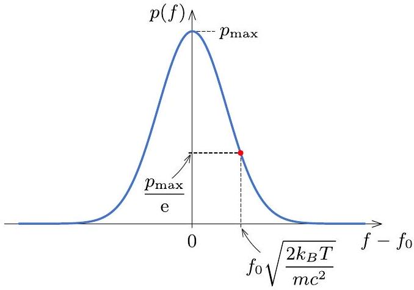
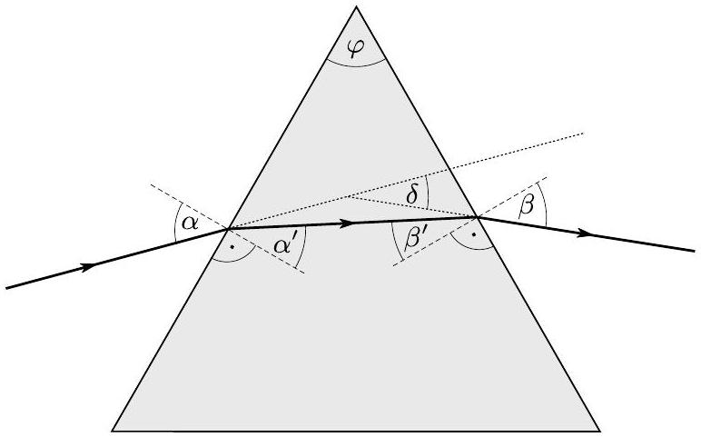
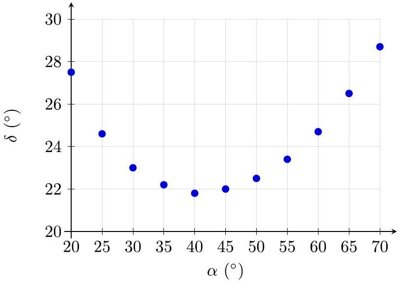

## T3. Physics of the Atmosphere (10 pts)

Part A. Surface temperature of the Earth (1.2 points)
A.1: The cross-section area receiving the solar radiation (falling as parallel rays) is $\pi R _ { E } ^ { 2 }$, so taking into account the absorbed portion is a fraction $1 - a$ of the total incident radiation, we find

$$
P _ { 0 } = ( 1 - a ) \pi R _ { E } ^ { 2 } F _ { s } .
$$

| Grading scheme for Task A.1. | Pts |
| :--- | :--- |
| Correct effective cross section area $A = \pi R _ { E } ^ { 2 }$ | 0.1 |
| Correct final answer | 0.1 |
| Total | 0.2 |

Grading note: If the student uses a different cross sectional area, only 0.1 is given, provided it is the only mistake.
A.2: A black body radiates according to the Stefan-Boltzmann law, $P _ { \mathrm { bd } } = \sigma A T ^ { 4 }$, where $\sigma$ is the Stefan-Boltzmann constant and $A$ is the total surface area of the black body. At steady state

$$
\begin{aligned}
& P _ { \mathrm { bd } } = P _ { 0 } \Rightarrow \sigma \left( 4 \pi R _ { E } ^ { 2 } \right) T _ { g 0 } ^ { 4 } = ( 1 - a ) \pi R _ { E } ^ { 2 } F _ { s } \\
\Rightarrow & T _ { g 0 } = \left( ( 1 - a ) \frac { F _ { s } } { 4 \sigma } \right) ^ { 1 / 4 } \approx 255 \mathrm {~K} \approx - 18 ^ { \circ } \mathrm { C } .
\end{aligned}
$$

| Grading scheme for Task A.2. | Pts |
| :--- | :--- |
| Energy balance | 0.1 |
| Correct explicit blackbody radiation formula, using the surface area of a sphere | 0.1 |
| Correct numerical value | 0.1 |
| Total | 0.3 |

A.3: In the presence of the atmospheric layer, we write down the energy transfer balance in two regions: between the Earth's surface and the atmosphere, and between the atmosphere and outer space. Let the power radiated from Earth be $P _ { E }$ and the power radiated from each side of the atmosphere be $P _ { \text {atmo } }$, then

$$
\begin{aligned}
P _ { E } & = P _ { \mathrm { atmo } } + t _ { \mathrm { sw } } P _ { 0 } \\
t _ { \mathrm { lw } } P _ { E } + P _ { \mathrm { atmo } } & = P _ { 0 }
\end{aligned}
$$

Solving this system of equations and using $P _ { E } =$ $\sigma \left( 4 \pi R _ { E } ^ { 2 } \right) T _ { g }$ we find

$$
T _ { g } = \left( \frac { 1 + t _ { \mathrm { sw } } } { 1 + t _ { \mathrm { lw } } } \right) ^ { 1 / 4 } T _ { g 0 } \approx 286 \mathrm {~K} \approx 13 ^ { \circ } \mathrm { C } .
$$

| Grading scheme for Task A.3. | Pts |
| :--- | :--- |
| Statement on radiation balance in the region outside the atmosphere | 0.1 |
| Statement on radiation balance in the region between the atmosphere and Earth | 0.2 |
| Using $t _ { \text {sw } }$ correctly | 0.1 |
| Using $t _ { 1 \mathrm { w } }$ correctly | 0.1 |
| Correct numerical result (if only analytical, then only 0.1) | 0.2 |
| Total | 0.7 |

Part B. The absorption spectrum of atmospheric gases (1.8 points)
B.1: Let the natural (unstretched) length of the spring be $l _ { 0 }$ and let $x _ { A } , x _ { B }$ be the positions of particles $A$ and $B$, respectively. The equation of motion of each particle due to the spring force can be written as:

$$
\begin{aligned}
\frac { \mathrm { d } ^ { 2 } } { \mathrm {~d} t ^ { 2 } } x _ { A } & = + \frac { k } { m _ { A } } \left( \ell - \ell _ { 0 } \right) , \\
\frac { \mathrm { d } ^ { 2 } } { \mathrm {~d} t ^ { 2 } } x _ { B } & = - \frac { k } { m _ { B } } \left( \ell - \ell _ { 0 } \right) ,
\end{aligned}
$$

where $\ell = x _ { B } - x _ { A }$ is the instantaneous length of the spring. Taking the difference of the two equations gives

$$
\frac { \mathrm { d } ^ { 2 } } { \mathrm {~d} t ^ { 2 } } \ell = - k \left( \frac { 1 } { m _ { B } } + \frac { 1 } { m _ { B } } \right) \left( \ell - \ell _ { 0 } \right) .
$$

This is the equation of motion of a single effective particle attached to a spring with a spring constant $k$ and an effective mass or reduced mass $\mu$, given by:

$$
\mu = \frac { 1 } { \frac { 1 } { m _ { A } } + \frac { 1 } { m _ { B } } } = \frac { m _ { A } m _ { B } } { m _ { A } + m _ { B } } .
$$

Thus, the system undergoes a simple harmonic motion with an angular frequency:

$$
\omega _ { d } = \sqrt { \frac { k } { \mu } } = \sqrt { k \frac { m _ { A } + m _ { B } } { m _ { A } m _ { B } } } .
$$

| Grading scheme for Task B.1. | Pts |
| :--- | :--- |
| Writing down correct equations of motion for A and B (0.1 each) | 0.2 |
| Studying the equation of motion for $x _ { A ^ { - } } x _ { B }$ | 0.1 |
| Correct answer | 0.2 |
| Total | 0.5 |

Grading note: A maximum of 0.2 points are given if the correct result is cited without justification.
B.2: The difference in energy between two consecutive levels in a quantum harmonic oscillator is given by $\hbar \omega$. So the energy of the photon is given by

$$
E = \hbar \omega _ { d } .
$$

| Grading scheme for Task B.2. | Pts |
| :--- | :--- |
| Correct result (Give 0.1 if $h$ is used instead of $\hbar$. No other numerical factors receive credit.) | 0.2 |
| Total | 0.2 |

B.3: The observed shift in the spectral line from $f _ { 0 }$ is due to the Doppler effect. When the source is moving towards the observer with velocity $v$ the frequency is shifted according to

$$
f = f _ { 0 } ( 1 + v / c ) .
$$

Thus, the shift in frequency is given by:

$$
f - f _ { 0 } = \frac { v } { c } f _ { 0 } .
$$

| Grading scheme for Task B.3. | Pts |
| :--- | :--- |
| Writing down an expression for Doppler effect (even if incorrect) | 0.1 |
| Correct answer | 0.1 |
| Total | 0.2 |

B.4: To find the normalization constant $C$, we require that the total probability is equal to 1 . This leads to:

$$
\int _ { - \infty } ^ { \infty } p ( v ) \mathrm { d } v = 1 \Rightarrow C \int _ { - \infty } ^ { \infty } \mathrm { e } ^ { - \frac { m v ^ { 2 } } { 2 k _ { B } T } } \mathrm {~d} v .
$$

Using the integration formula provided, with $x = v$ and $a = \frac { m } { k _ { B } T }$ we obtain:

$$
C = \sqrt { \frac { m } { 2 \pi k _ { B } T } } .
$$

| Grading scheme for Task B.4. | Pts |
| :--- | :--- |
| Normalization condition (even if done incorrectly from 0 to $\infty$ ) | 0.1 |
| Correct result | 0.1 |
| Total | 0.2 |

B.5: Using the result of B.4, we obtain the following expression for the speed of a molecule in terms of the frequencies $f$ and $f _ { 0 }$ :

$$
v = \frac { f - f _ { 0 } } { f _ { 0 } } c .
$$

We plug this back into the probability distribution formula to obtain:

$$
p ( f ) \propto \exp \left[ - \frac { m c ^ { 2 } } { 2 k _ { B } T } \left( \frac { f - f _ { 0 } } { f _ { 0 } } \right) ^ { 2 } \right] .
$$

This gives the probability distribution for observing a molecule whose spectral line is Doppler shifted from $f _ { 0 }$ to $f$.

| Grading scheme for Task B.5. | Pts |
| :--- | :--- |
| Replacing $v$ by the Doppler effect result | 0.1 |
| Correct exponential dependence | 0.2 |
| Total | 0.3 |

Grading note: If the student uses an incorrect Doppler effect formula, but one that matches their attempt in B.3, they get the 0.1 points.
B.6: The probability distribution $p ( f )$ follows a Gaussian profile in the frequency shift $f - f _ { 0 }$. The center of the profile is 0 and it drops to $1 / e$ of its maximum value when the argument of the exponential is -1. This happens when

$$
f ^ { * } - f _ { 0 } = f _ { 0 } \sqrt { \frac { 2 k _ { B } T } { m c ^ { 2 } } } .
$$

The shape of the distribution can be seen in the figure below.

| Grading scheme for Task B.6. | Pts |
| :--- | :--- |
| The distribution is has a single peak at zero | 0.1 |
| The distribution is symmetric | 0.1 |
| The distribution decays to zero on both ends | 0.1 |
| $f ^ { \star } - f _ { 0 }$ is correct | 0.1 |
| Total | 0.4 |

Part C. Stability of air in the atmosphere (2.7 points)
C.1: Consider a thin horizontal layer of thickness $d z$ and surface area $S$. Since the air is in hydrostatic equilibrium, it's weight must be balanced by the difference in pressure forces. This results in the following relation:

$$
p ( z ) S = p ( z + \mathrm { d } z ) S + \rho ( z ) g S \mathrm {~d} z .
$$

Simplifying and rearranging terms gives:

$$
\frac { \mathrm { d } p } { \mathrm {~d} z } = - \rho ( z ) g
$$

The negative sign indicates a decrease in pressure with hight as expected.

| Grading scheme for Task C.1. | Pts |
| :--- | :--- |
| Sum of forces equals zero | 0.1 |
| Correct pressure force above and below | 0.1 |
| Correct final answer | 0.1 |
| Total | 0.3 |

C.2: Assuming we can treat air as an ideal gas, we can use the ideal gas law to express the density of air in terms of its pressure and temperature

$$
p V = n R T \Rightarrow p ( z ) V = \frac { m } { \mu _ { \mathrm { air } } } R T ( z ) .
$$

Rewriting this in terms of the density gives:

$$
\rho ( z ) = \frac { p ( z ) \mu _ { \mathrm { air } } } { R T ( z ) } .
$$

Now we substitute the density expression into the expression obtained in C.1. This gives:

$$
\frac { \mathrm { d } p } { \mathrm {~d} z } = - \frac { \mu _ { \text {air } } p ( z ) } { R T ( z ) } g
$$

| Grading scheme for Task C.2. | Pts |
| :--- | :--- |
| Ideal gas law | 0.1 |
| Correct final answer | 0.1 |
| Total | 0.2 |

C.3: Assuming an isothermal atmosphere (i.e., constant temperature with altitude), $T ( z ) = T$, the equation simplifies to:

$$
\frac { \mathrm { d } p } { p } = - \frac { \mu _ { \text {air } } } { R T } g \mathrm {~d} z .
$$

Integrating both sides and assuming the pressure at height 0 is $p _ { 0 }$ leads to:

$$
\ln \left[ \frac { p ( z ) } { p _ { 0 } } \right] = - \frac { \mu _ { \mathrm { air } } } { R T } g z .
$$

In a different form:

$$
p ( z ) = p _ { 0 } \exp \left( - \frac { \mu _ { \text {air } } } { R T } g z \right) .
$$

| Grading scheme for Task C.3. | Pts |
| :--- | :--- |
| Recognizing a separable differential equation | 0.1 |
| Correct final answer | 0.1 |
| Total | 0.2 |

C.4: Since the small mass of air is displaced adiabatically, it must satisfy the adiabatic condition for an ideal gas:

$$
p V ^ { \gamma } = \text { const., }
$$

where $\gamma = c _ { p } / c _ { V }$ is the adiabatic index, and $c _ { p } , c _ { V }$ are the molar specific heats at constant pressure and volume respectively. Writing the volume in terms temperature and pressure using the ideal gas law gives:

$$
p ( T / p ) ^ { \gamma } = \text { const. } \quad \Rightarrow \quad p ^ { 1 - \gamma } T ^ { \gamma } = \text { const. }
$$

Taking the derivative of this expression with respect to the height $z$, we obtain:

$$
( 1 - \gamma ) p ^ { - \gamma } \frac { \mathrm { d } p } { \mathrm {~d} z } T ^ { \gamma } + \gamma p ^ { 1 - \gamma } T ^ { \gamma - 1 } \frac { \mathrm {~d} T } { \mathrm {~d} z } = 0 .
$$

Simplifying and rearranging to have an expression for the adiabatic lapse rate gives:

$$
\frac { \mathrm { d } T } { \mathrm {~d} z } = - \frac { 1 - \gamma } { \gamma } \frac { T ( z ) } { p ( z ) } \frac { \mathrm { d } p } { \mathrm {~d} z } .
$$

We now substitute the hydrostatic pressure gradient obtained in C. 3 to get:

$$
\frac { \mathrm { d } T } { \mathrm {~d} z } = - \frac { 1 - \gamma } { \gamma } \frac { T ( z ) } { p ( z ) } \left[ - \frac { p ( z ) \mu _ { \text {air } } } { R T ( z ) } g \right] = \frac { 1 - \gamma } { \gamma } \frac { \mu _ { \text {air } } } { R } g .
$$

But $\gamma = c _ { p } / c _ { V }$, so

$$
\frac { \mathrm { d } T } { \mathrm {~d} z } = \frac { 1 - c _ { p } / c _ { V } } { c _ { p } / c _ { V } } \frac { \mu _ { \mathrm { air } } } { R } g = - \frac { \mu _ { \mathrm { air } } } { c _ { p } } g ,
$$

where we used $c _ { p } - c _ { V } = R$.
This expression for the adiabatic lapse rate shows that the temperature drops linearly with height in an adiabatic atmosphere.

| Grading scheme for Task C.4. | Pts |
| :--- | :--- |
| Writing the adiabatic relation in any form | 0.1 |
| Relating $d T / d z$ to $d p / d z$ | 0.3 |
| Correct final result | 0.2 |
| Total | 0.6 |

C.4: To find the angular frequency of small oscillations of the air parcel, we begin by applying Newton's second law, where the primary forces acting on the parcel are buoyancy and gravity.

$$
\delta m \frac { \mathrm {~d} ^ { 2 } z } { \mathrm {~d} t ^ { 2 } } = \rho _ { a } ( z ) g \delta V - \delta m g ,
$$

where $\delta m$ is the mass of the air parcel, $\delta V$ is its volume and $\rho _ { a }$ is the density of the surrounding air. We can express the mass of the parcel in terms of its density $\rho _ { p }$ as $\delta m = \rho _ { p } \delta V$. Substituting and simplifying gives:

$$
\frac { \mathrm { d } ^ { 2 } z } { \mathrm {~d} t ^ { 2 } } = \frac { \rho _ { a } ( z + \delta z ) - \rho _ { p } ( z + \delta z ) } { \rho _ { p } ( z + \delta z ) } g .
$$

Assuming the parcel is at the same pressure as the atmosphere at $z + \delta z$, the density can be expressed in terms of temperature using the ideal gas law $\rho \propto 1 / T$. This allows us to rewrite the last expression as:

$$
\frac { \mathrm { d } ^ { 2 } z } { \mathrm {~d} t ^ { 2 } } = \frac { T _ { p } ( z + \delta z ) - T _ { a } ( z + \delta z ) } { T _ { a } ( z + \delta z ) } g .
$$

We can now express the temperature at $z + \delta z$ in terms of the lapse rates and the temperature at $z$ using the definition $T ( z + \delta z ) = T ( z ) + \Gamma \delta z$. Therefore:

$$
\frac { \mathrm { d } ^ { 2 } z } { \mathrm {~d} t ^ { 2 } } = \frac { T ( z ) + \Gamma \delta z - T ( z ) - \Gamma _ { a } \delta z } { T ( z ) + \Gamma _ { a } \delta z } g .
$$

Simplifying the numerator and neglecting the infinitesimal term $\Gamma _ { a } \delta z$ in the denominator gives:

$$
\frac { \mathrm { d } ^ { 2 } z } { \mathrm {~d} t ^ { 2 } } = \frac { \Gamma - \Gamma _ { a } } { T } g \delta z .
$$

This is the equation of a simple harmonic oscillator, where the angular frequency is given by:

$$
\omega = \sqrt { \frac { \Gamma _ { a } - \Gamma } { T } g } = \sqrt { \frac { \mu _ { \mathrm { air } } g / c _ { p } - \Gamma } { T } g }
$$

The motion is stable whenever $\Gamma _ { a } = \mu _ { \text {air } } g / c _ { p } > \Gamma$.

| Grading scheme for Task C.5. | Pts |
| :--- | :--- |
| Inclusion of gravitational force with parcel density | 0.2 |
| inclusion of buoyancy force with air density | 0.3 |
| Correct equation of motion | 0.2 |
| Relating density to inverse temperature | 0.2 |
| Using appropriate approximation | 0.2 |
| Correct stability requirements | 0.1 |
| Correct angular frequency of small oscillation | 0.2 |
| Total | 1.4 |

Part D. Moisture (2.7 points)
D.1: The change of entropy across a phase transition (evaporation in this case) is related to the latent heat of evaporation. If there was a mass $m$ of liquid water, then $Q _ { \text {evaporation } } = L m$, then

$$
\Delta S = \frac { L m } { T } .
$$

It is known that the volume of vapor is significantly larger than the volume of liquid of the same mass, therefore $\Delta V \approx V _ { \text {vapor } }$, which can be found using the ideal gas law

$$
V _ { \text {vapor } } = \frac { n R T } { p _ { s } ( T ) } .
$$

The mass can be related to the number of moles $n$ via $m = \mu _ { \mathrm { H } _ { 2 } \mathrm { O } } n$, then

$$
\frac { \mathrm { d } p _ { s } } { \mathrm {~d} T } = \frac { \mu _ { \mathrm { H } _ { 2 } \mathrm { O } } L p _ { s } } { R T ^ { 2 } } .
$$

| Grading scheme for Task D.1. | Pts |
| :--- | :--- |
| Correct entropy change | 0.2 |
| $V _ { \text {vapor } } \gg V _ { \text {liquid } }$ | 0.2 |
| Correct final answer | 0.1 |
| Total | 0.5 |

D.2: We can integrate the relationship found in D. 1 by separating variables to find

$$
\ln \left[ \frac { p _ { s } ( T ) } { p _ { s o } } \right] = - \frac { \mu _ { \mathrm { H } _ { 2 } \mathrm { O } } L } { R } \left( \frac { 1 } { T } - \frac { 1 } { T _ { o } } \right) .
$$

Note that $L$ is strictly a function of temperature, but we are assuming that $L$ is a constant for the range of temperatures we investigate. Rearranging, we find

$$
p _ { s } ( T ) = p _ { s o } \exp \left[ - \frac { \mu _ { \mathrm { H } _ { 2 } \mathrm { O } } L } { R } \left( \frac { 1 } { T } - \frac { 1 } { T _ { o } } \right) \right] .
$$

| Grading scheme for Task D.2. | Pts |
| :--- | :--- |
| Recognizing a separable differential equation | 0.1 |
| Correct final answer | 0.1 |
| Total | 0.2 |

D.3: Formation of liquid water happens when the partial pressure of water inside the parcel reaches the saturation pressure at a given temperature. The partial pressure of water vapor $p _ { w }$ can be related to the total pressure of the parcel $p$ as

$$
p _ { w } = \frac { n _ { \mathrm { H } _ { 2 } \mathrm { O } } } { n _ { \text {air } } } p = \frac { m _ { \mathrm { H } _ { 2 } \mathrm { O } } / \mu _ { \mathrm { H } _ { 2 } \mathrm { O } } } { m _ { \text {air } } / \mu _ { \text {air } } } p = \phi \frac { \mu _ { \text {air } } } { \mu _ { \mathrm { H } _ { 2 } \mathrm { O } } } p .
$$

Given that the air parcel is rising adiabatically, $p ^ { 1 - \gamma } T ^ { \gamma } =$ const., so

$$
p ( T ) = p _ { i } \left( \frac { T } { T _ { i } } \right) ^ { c _ { p } / R } .
$$

Therefore, the transcendental equation that we need to solve is

$$
\phi \frac { \mu _ { \mathrm { air } } } { \mu _ { \mathrm { H } _ { 2 } \mathrm { O } } } p _ { i } \left( \frac { T _ { l } } { T _ { i } } \right) ^ { \frac { c _ { p } } { R } } = p _ { s o } \exp \left[ - \frac { \mu _ { \mathrm { H } _ { 2 } \mathrm { O } } L } { R } \left( \frac { 1 } { T _ { l } } - \frac { 1 } { T _ { i } } \right) \right] .
$$

This can be rearranged to get

$$
T _ { l } = \frac { 1 } { \frac { 1 } { T _ { i } } - \frac { R } { \mu _ { \mathrm { H } _ { 2 } \mathrm { O } } L } \ln \left[ \phi \frac { \mu _ { \mathrm { air } } } { \mu _ { \mathrm { H } _ { 2 } \mathrm { O } } } \frac { p _ { i } } { p _ { s o } } \left( \frac { T _ { l } } { T _ { i } } \right) ^ { c _ { p } / R } \right] } .
$$

Substituting the numerical values, we get

$$
T _ { l } = \frac { 1000 \mathrm {~K} } { 3.481 - 0.4695 \ln \left( \frac { T _ { l } } { 290.15 \mathrm {~K} } \right) } .
$$

Solving this iteratively, we find $T \approx 286.8 \mathrm {~K} \approx$ $13.7 ^ { \circ } C$.

| Grading scheme for Task D.3. | Pts |
| :--- | :--- |
| Using Dalton's law | 0.4 |
| correctly relating the moles ratio to mass ratio | 0.2 |
| Stating $p ( T )$ for an adiabatic process | 0.1 |
| Understanding that partial pressure of water needs to reach saturation for condensation to start | 0.5 |
| Attempting to perform iterative search for the solution of the transcendental equation (by isolating $T$ on one side) | 0.4 |
| Correct numerical solution | 0.4 |
| Total | 2.0 |

Grading note: At most 0.4 pts can be given if the student does not use the partial pressure of water but uses the total pressure of air parcel.

## Part E. Sun halo (1.6 points)

E.1: Using the notations of Figure $E$, the total angle of deviation $\delta$ can be written as the sum of the deviations in the two refractions:

$$
\delta = \alpha - \alpha ^ { \prime } + \beta - \beta ^ { \prime } .
$$

Figure E.

Consider the triangle of interior angles $\varphi , 90 ^ { \circ } - \alpha ^ { \prime }$ and $90 ^ { \circ } - \beta ^ { \prime }$. Since the sum of these angles add up to 180°, we get

$$
\varphi = \alpha ^ { \prime } + \beta ^ { \prime } ,
$$

so $\delta$ simplifies to

$$
\delta = \alpha + \beta - \varphi .
$$

The relationship between $\alpha$ and $\alpha ^ { \prime }$ (and similarly between $\beta$ and $\beta ^ { \prime }$ ) is given by Snell's law:

$$
\frac { \sin \alpha } { \sin \alpha ^ { \prime } } = n , \quad \frac { \sin \beta } { \sin \beta ^ { \prime } } = n .
$$

Expressing $\beta$ in terms of $\alpha ^ { \prime }$ :

$$
\sin \beta = n \sin \beta ^ { \prime } = n \sin \left( \varphi - \alpha ^ { \prime } \right) ,
$$

From Snell's law $\alpha ^ { \prime }$ can be written as

$$
\alpha ^ { \prime } = \arcsin \left( \frac { \sin \alpha } { n } \right) .
$$

Thus, $\beta$ in terms of $\alpha$ is given by

$$
\beta = \arcsin \left\{ n \sin \left[ \varphi - \arcsin \left( \frac { \sin \alpha } { n } \right) \right] \right\} .
$$

Finally, we get the result for $\delta$ :

$$
\delta = \alpha + \arcsin \left\{ n \sin \left[ \varphi - \arcsin \left( \frac { \sin \alpha } { n } \right) \right] \right\} - \varphi .
$$

| Grading scheme for Task E.1. | Pts |
| :--- | :--- |
| Writing Snell's law for the two refractions (0.1 each) | 0.2 |
| Equation for $\delta$ in terms of $\alpha , \beta$ and $\varphi$ | 0.2 |
| Using that $\alpha ^ { \prime } + \beta ^ { \prime } = \varphi$ | 0.1 |
| Correct calculation leading to $\delta$ | 0.2 |
| Final formula for $\delta$ (any other equivalent form is acceptable) | 0.1 |
| Total | 0.8 |

E.2: Notice that the situation corresponds to the case discussed in part E. 1 with $\varphi = 60 ^ { \circ }$. Here is the data table after substituting different values of $\alpha$ :

| $\alpha$ | $\delta$ | $\alpha$ | $\delta$ |
| :--- | :--- | :--- | :--- |
| $20 ^ { \circ }$ | $27.5 ^ { \circ }$ | $50 ^ { \circ }$ | $22.5 ^ { \circ }$ |
| $25 ^ { \circ }$ | $24.6 ^ { \circ }$ | $55 ^ { \circ }$ | $23.4 ^ { \circ }$ |
| $30 ^ { \circ }$ | $23.0 ^ { \circ }$ | $60 ^ { \circ }$ | $24.7 ^ { \circ }$ |
| $35 ^ { \circ }$ | $22.2 ^ { \circ }$ | $65 ^ { \circ }$ | $26.5 ^ { \circ }$ |
| $40 ^ { \circ }$ | $21.8 ^ { \circ }$ | $70 ^ { \circ }$ | $28.7 ^ { \circ }$ |
| $45 ^ { \circ }$ | 22.0° | - | - |

Grading scheme for Task E.2.
Substituting into the formula for $\delta$ correctly for all values of $\alpha$ (if at least 6 data points are calculated, 0.1 p can be given)
Data points are plotted in the correct graph
$\delta$ has a local minimum
Total
E.3: The minimum value of $\delta$ is around $21.8 ^ { \circ }$, so that is the angle with respect to the direction of Sun where the halo appears.

| Grading scheme for Task E.3. | Pts |
| :--- | :--- |
| Reading the minimal value of $\delta$ | 0.1 |
| Concluding that the angular size of halo corresponds to the minimal value of $\delta$ | 0.1 |
| Total | 0.2 |
