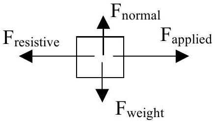
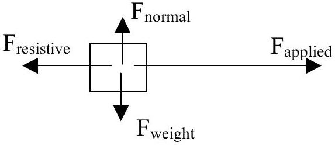
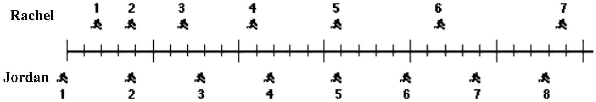
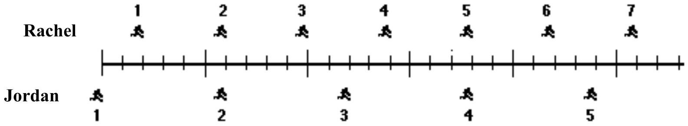
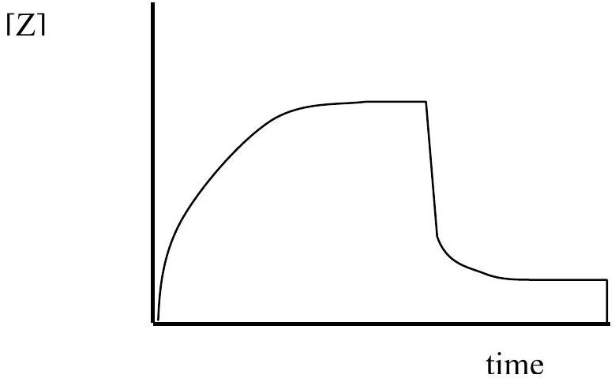
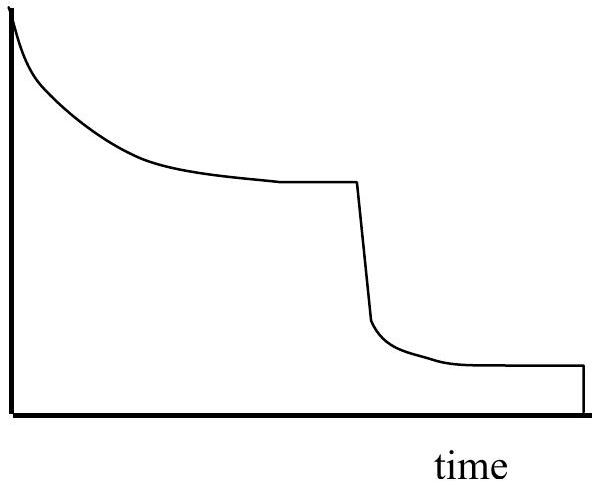
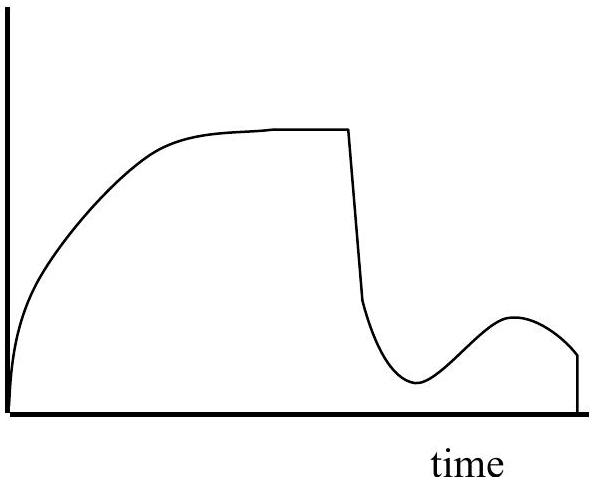
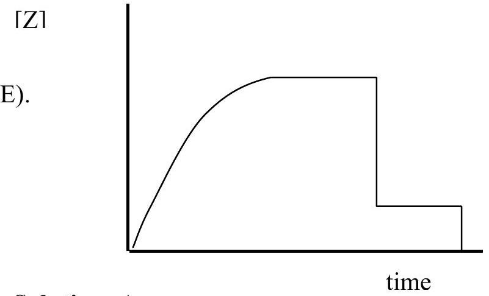
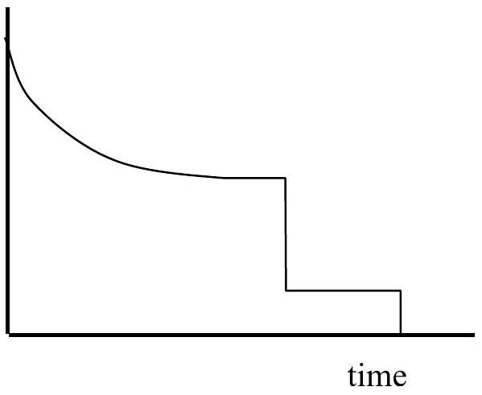

## Section A (Multiple Choice)

| Question | Answer | Question | Answer |
| :--- | :--- | :--- | :--- |
| Q1 | C | Q6 | E |
| Q2 | E | Q7 | D |
| Q3 | C | Q8 | D |
| Q4 | E | Q9 | B |
| Q5 | C | Q10 | A |

## SECTION A

Question 1.
A stone dropped by an irresponsible office worker from the roof of a single story building to the surface of the Earth:

A) reaches a maximum speed quite soon after release and then falls at a constant speed thereafter.
B) speeds up as it falls because the gravitational attraction gets considerably stronger as the plant gets closer to the earth.
C) speeds up because of an almost constant force of gravity acting on it.
D) falls because of the natural tendency of all objects to rest on the surface of the earth
E) falls because of the combined effects of the force of gravity pushing it downward and the force of the air pushing it downward.

Solution: C
For a stone falling from a single storey building we can expect air resistance to be quite low, so it will not reach terminal velocity in the time it takes to fall. The change in gravitational attraction due to the earth is negligible at this sort of change in distance (only a few metres at most), and force due to air pressure will actually be upwards due to the buoyant force of the air, and again negligible.

Question 2.
A management consultant is walking smugly along the footpath when he is unexpectedly struck by a Volvo XC70 driven by a very angry and underpaid teacher. The Volvo has a substantially greater mass than the management consultant and is moving rapidly because the driver got a good run up. During the collision:

A) the Volvo exerts a greater amount of force on the management consultant than the management consultant exerts on the Volvo
B) the management consultant exerts a greater amount of force on the Volvo than the Volvo exerts on the management consultant
C) neither exerts a force on the other, the management consultant is crushed simply because the very angry teacher runs him over in her Volvo
D) the Volvo exerts a force on the management consultant but the management consultant does not exert a force on the Volvo
E) the Volvo exerts the same amount of force on the management consultant as the management consultant exerts on the Volvo

Solution: E
This is an example of an action-reaction force pair. The force exerted by the management consultant is the same as the force exerted upon him by the Volvo. Fortunately, the effects felt by the teacher and her Volvo are much smaller, however the management consultant is unlikely to be seriously injured or killed unless the teacher has put garlic in the grill or filled the radiator with holy water. This is an application of Newton's third law.

Question 3.
David exerts a constant horizontal force on a large box of files which have been left in the wrong place. As a result, the box moves across a horizontal floor at a constant speed $v _ { O }$. The constant horizontal force applied by David:

A) has the same magnitude as the weight of the box.
B) is greater than the weight of the box.
C) has the same magnitude as the total force which resists the motion of the box.
D) is greater than the total force which resists the motion of the box.

## 2008 National Qualifying Exam - Physics Solutions

E) is greater than either the weight of the box or the total force which resists its motion.

Solution: C
If the box is moving at a constant speed on a horizontal floor then the nett force acting is zero, hence the applied force must be equal to the force resisting the box's movement. The forces in the vertical direction do not affect the motion in the horizontal direction.
On a free body diagram:

Question 4.
If David, in the previous question, doubles the constant horizontal force that he exerts on the box to push it on the same horizontal floor, the box then moves:

A) with a constant speed that is double the speed $v _ { O }$ in the previous question.
B) with a constant speed that is greater than the speed $v _ { O }$ in the previous question, but not necessarily twice as great.
C) for a while with a speed that is constant and greater than the speed $v _ { O }$ in the previous question, then with a speed that increases thereafter.
D) for a while with an increasing speed, then with a constant speed thereafter.
E) with a continuously increasing speed

Solution: E
The previous force exactly balanced the resistive forces. The new force must hence exceed these forces, giving a nett force. This nett force will be constant, hence the resultant acceleration will also be constant, and the speed must continue to increase steadily. See the free body diagram below.

## Question 5.

Periodically, the sun develops relatively cool dark areas known as sunspots. Scientists have found that periods of high sunspot activity coincide with stormy periods on Earth. Hence sunspots cause storms on Earth.

Which of the following is the best statement of the flaw in the argument above?

A) It disputes the fact that storms are the result of low-pressure systems in the Earth's atmosphere.
B) It ignores the influence of periods of low sunspot activity on Earth's weather systems.
C) It assumes that because sunspots and storms occur at the same time, sunspots cause storms.
D) It overlooks the fact that there is always a storm somewhere on Earth.
E) It ignores the fact that there are stormy periods in some areas but not in others while there is sunspot activity.

## Solution: C

Correlation does not imply causality. This is generally true, and particularly important in science. The statements other than C may well be true, but they are not the logical flaw in the argument.

## Question 6.

The positions of two joggers, Rachel and Jordan, are shown below. The joggers are shown at successive 0.20-second time intervals, and they are moving towards the right.

Do Rachel and Jordan ever have the same speed?

A) No.
B) Yes, at instant 2.
C) Yes, at instant 5.
D) Yes, at instants 2 and 5
E) Yes, at some time during the interval 3 to 4 .

## Solution: E

The speed is the same when the distance travelled is the same for the time interval between pictures. This occurs between pictures 3 and 4.

## 2008 National Qualifying Exam - Physics   Solutions

Question 7.
The positions of two joggers, Rachel and Jordan, are represented below at successive equal time intervals. The joggers are moving towards the right.

The accelerations of the joggers are related as follows:

A) The acceleration of Rachel is greater than the acceleration of Jordan.
B) The acceleration of Rachel equals the acceleration of Jordan. Both accelerations are greater than zero.
C) The acceleration of Jordan is greater than the acceleration of Rachel.
D) The acceleration of Rachel equals the acceleration of Jordan. Both accelerations are zero.
E) Not enough information is given to answer the question.

Solution: D
For both joggers the distance between successive pictures is constant, hence the speed at which each is travelling is constant and both have an acceleration of zero, even though Jordan is travelling faster than Rachel.

Question 8.
Lara has her baby weighed at an early childhood centre every four weeks. The uncertainty in the measurement is 50 g . At four weeks old the baby's weight is measured as 3.20 kg. At eight weeks old the baby's weight is measured as 4.05 kg. The baby's weight gain in this four week period is therefore:

A) $0.85 \mathrm {~kg} \pm 0.025 \mathrm {~kg}$
B) $0.85 \mathrm {~kg} \pm 0.05 \mathrm {~kg}$
C) $0.85 \mathrm {~kg} \pm 0.1 \mathrm {~kg}$
D) $0.9 \mathrm {~kg} \pm 0.1 \mathrm {~kg}$
E) $0.90 \mathrm {~kg} \pm 0.10 \mathrm {~kg}$

Solution: D
The weight gain is found by subtracting the first weight from the second. Whenever measurements are added or subtracted the uncertainty in the result is found by summing the uncertainties in the measurements. If the measurements are $\mathrm { X } \pm \Delta \mathrm { X }$ and $\mathrm { Y } \pm \Delta \mathrm { Y }$, then where $\mathrm { Z } = \mathrm { X } - \mathrm { Y } , \Delta \mathrm { Z } = \Delta \mathrm { X } + \Delta \mathrm { Y }$. (This is the case when the uncertainties are independent, a more complete analysis requires the adding of squares instead, which in this case gives the same answer). Hence the uncertainty is 0.1 kg in this case. The precision of the result must match that of the uncertainty, in this case only one decimal place, hence the weight gain of 0.85 kg is rounded to 0.9 kg . This gives answer D.

## 2008 National Qualifying Exam - Physics   Solutions

Question 9.
Lara has her baby weighed at an early childhood centre every four weeks. The uncertainty in the measurement is 50 g . At four weeks old the baby's weight is measured as 3.20 kg. At eight weeks old the baby's weight is measured as 4.05 kg. The baby's average weight gain per week in this four week period is therefore:

A) $0.21 \mathrm {~kg} \pm 0.01 \mathrm {~kg}$
B) $0.21 \mathrm {~kg} \pm 0.03 \mathrm {~kg}$
C) $0.21 \mathrm {~kg} \pm 0.05 \mathrm {~kg}$
D) $0.2 \mathrm {~kg} \pm 0.03 \mathrm {~kg}$
E) $0.2 \mathrm {~kg} \pm 0.1 \mathrm {~kg}$

Solution: B
The average gain per week is given by the gain for the four weeks divided by 4, which gives 0.2125 kg. The fractional or relative uncertainty in the average weekly gain must be the same as the fractional uncertainty in the gain for the entire 4 weeks - if $\mathrm { P } = \mathrm { nZ }$ then $\Delta \mathrm { P } / \mathrm { P } = \Delta \mathrm { Z } / \mathrm { Z }$ so $\Delta \mathrm { P } = \mathrm { n } \Delta \mathrm { Z }$, in this case $\mathrm { n } = \frac { 1 } { 4 }$, so the uncertainty is now 0.025 kg , which when rounded correctly to one significant figure gives 0.03 kg. Rounding the answer to the same precision (same number of decimal places) gives $0.21 \mathrm {~kg} \pm 0.03 \mathrm {~kg}$.

Question 10.
Mark mixes two chemicals, X and Y, to produce a third chemical, Z, in a large bucket. Initially the reaction is very fast, and the concentration of Z increases rapidly. The rate at which concentration increases slows down as the amounts of X and Y decrease, and the concentration of Z reaches a steady state. Mark then adds a third substance, Q, which binds the substance Z, decreasing its concentration until it again reaches a steady state concentration. Finally Mark empties the bucket down the sink because it turned the wrong colour anyway.
Which graph shows the concentration of Z as a function of time?

A).

[Z1

[Z1

C).

[Z1

Solution: A
By inspection, this is the only graph that has the correct form - increase then asymptote to a constant value, then decrease and settle to a lower steady state, and finally drop suddenly to zero.
In this question we are looking for students' ability to interpret the description in words, as well as read the basic "shape" of a graph.

## SECTION B

Question 11.
Question 12.
Question 13.
Question 14.
Question 15.
Question 16.
