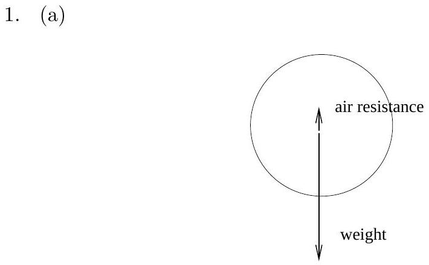
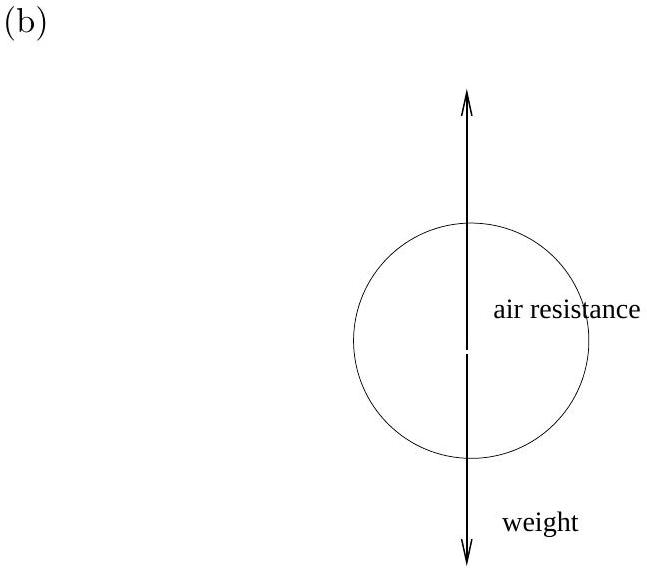
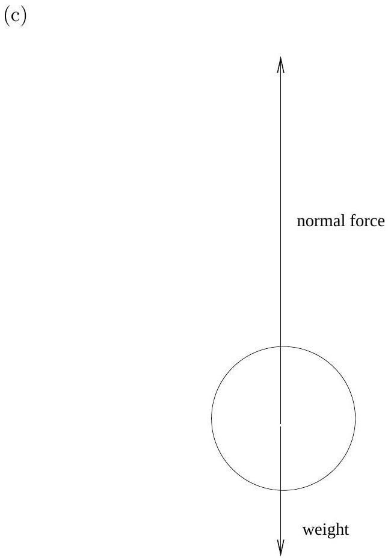
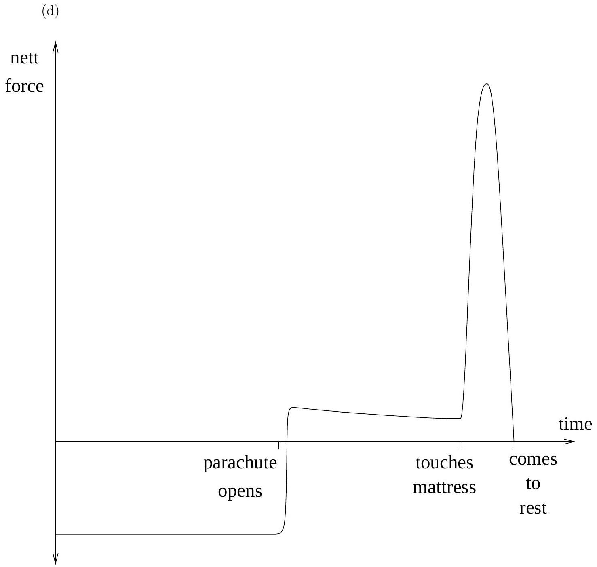
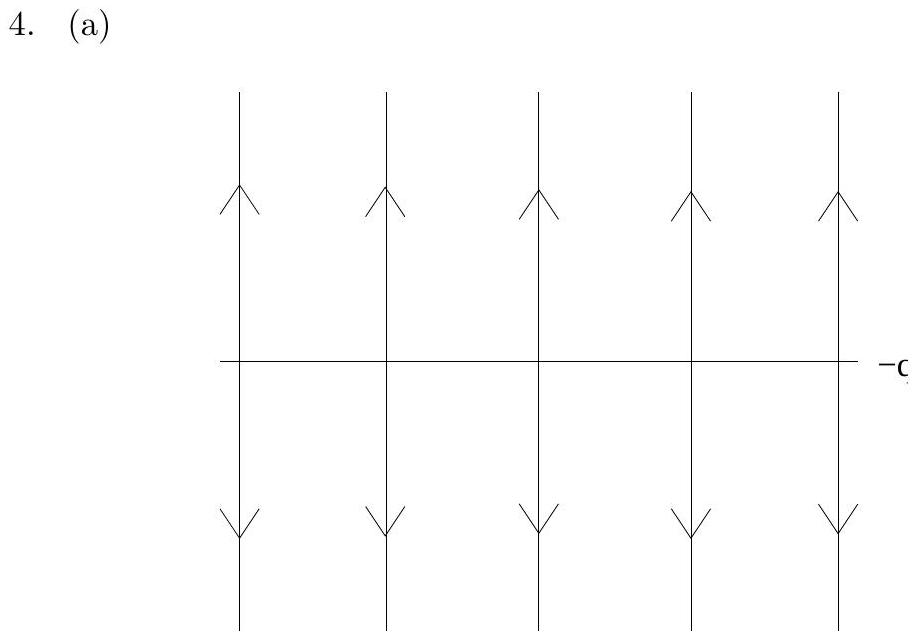
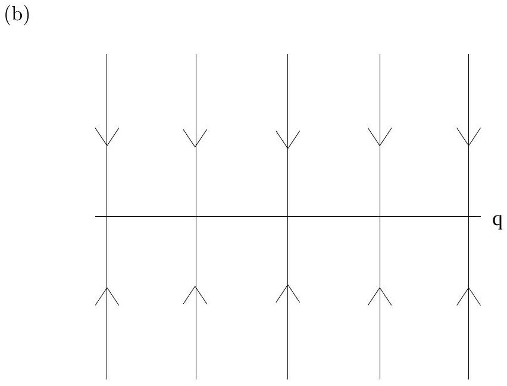
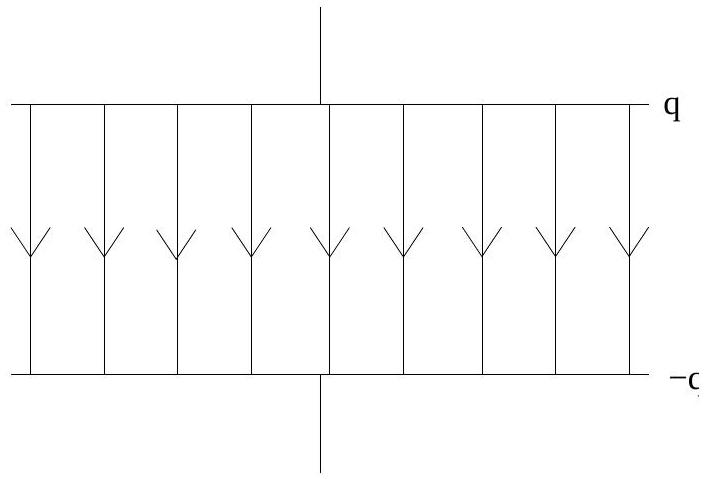
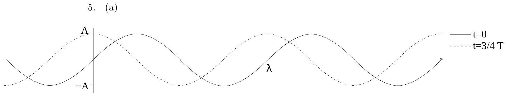
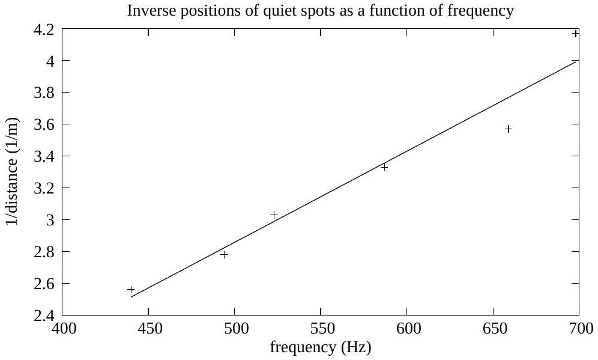

Figure 1: Free body diagram of elephant before opening parachute.

Figure 2: Free body diagram of elephant after opening parachute but before touching mattress.

Figure 3: Free body diagram of elephant after touching mattress but before stopping.

Figure 4: Sketch of total nett force.

2. (a) The density
$$
\rho = \frac { N } { V } m _ { a v } ,
$$
where $m _ { a v }$ is the average mass per particle. Water is less massive than nitrogen so more humid air has lower $m _ { a v }$ and so lower density. The ideal gas equation of state is
$$
p V = N k T .
$$
At the same pressure the hotter gas will have a lower $N / V$ and so be less dense.
    (b) Equal numbers of moles at the same temperature and pressure will give identical volumes, so the balloons will be the same size.
    (c) The mass of water is less than nitrogen so the balloon with humid air will be lighter.
    (d) When the battery is connected the power dissipated in the resistor will heat the balloon causing it to expand.
    (e) The power dissipated by the resistor
$$
\frac { V ^ { 2 } } { R } = C \frac { d T } { d t } .
$$
Combining this with the relationship $P = r G$ and the ideal gas equation of state and assuming that the balloon is spherical gives
$$
\frac { d r } { d t } = \frac { 3 n N _ { A } k V ^ { 2 } } { 16 \pi G r ^ { 3 } C R } ,
$$
where $N _ { A }$ is Avogadro's number.

3. (a) Assuming that no heat goes to heating the kettle or surroundings or to vaporising the water the energy required to heat the $m _ { \mathrm { H } _ { 2 } \mathrm { O } } = 200 \mathrm {~g}$ of water by $\Delta T = 80 \mathrm {~K}$ is
$$
Q = c m _ { H _ { 2 } O } \Delta T .
$$
The power dissipated by the resistor is $P = I V$. The time taken to boil the kettle $t = Q / P$. Combining the above results gives
$$
t = \frac { c m _ { \mathrm { H } _ { 2 } \mathrm { O } } \Delta T } { I V } = 28 \mathrm {~s} .
$$
    (b)
$$
R = \frac { I } { V } = 24 \Omega
$$
    (c) Assuming that heat is not lost to surroundings and that the densities $( \rho )$ and heat capacities $( c )$ of hot chocolate and milk are equal,
$$
c m _ { m } \left( T _ { f } - T _ { m } \right) + c m _ { H _ { 2 } O } \left( T _ { f } - T _ { H C } \right) = 0 ,
$$
where $T _ { f }$ is the final temperature of the mixture. Rearranging gives
$$
T _ { f } = \frac { V _ { H C } } { V _ { m } + V _ { H C } } T _ { H C } + \frac { V _ { m } } { V _ { m } + V _ { H C } } T _ { m } .
$$
The initial volumes and temperatures of the hot chocolate and milk are, respectively, $V _ { H C } = 200 \mathrm {~mL} , V _ { m } = 50 \mathrm {~mL} , T _ { H C } = 90 ^ { \circ } \mathrm { C }$ and $T _ { H C } = 4 { } ^ { \circ } \mathrm { C }$ giving $T _ { f } = 73 { } ^ { \circ } \mathrm { C }$.
    (d) The thermometer would have been colder than the hot chocolate before it was put into the hot chocolate. As the thermometer is heated the hot chocolate cools. This means that the result above and the measured temperature are not inconsistent.

Figure 5: This figure shows the electric field due to the charge on the positive plate.

Figure 6: This figure shows the electric field due to the charge on the negative plate.

(c)
Figure 7: This figure shows the total electric field.
(d)
$$
\begin{aligned}
& I R = \frac { q } { C } \\
& I = q \frac { R } { C }
\end{aligned}
$$
(e)
$$
I = \frac { \Delta q } { \Delta t }
$$
Want $\Delta q = q$.
$$
\Delta t = \frac { R } { C }
$$
(f) The current won't be constant because as the charge on the plate decreases the voltage across the capacitor also decreases.

Figure 8: A sketch of the wave at $t = 0$ and $t = 3 / 4 T$.

(b) In a time $\Delta t = 3 / 4 T$ the crest of the wave moved a distance $\Delta x =$ $3 / 4 \lambda$. The velocity
$$
v = \frac { \Delta x } { \Delta t } = \frac { \lambda } { T } = f \lambda ,
$$
since $f = 1 / T$.
(c) Quiet spots indicate that destructive interference is occurring. The closest quiet spot will be a distance $d = \lambda / 4$ as there is no phase change on reflection from the mirror and the total distance the wave travels will be $\lambda / 2$.
Using $v = f \lambda$ gives
$$
\frac { 1 } { d } = \frac { 4 } { v } f .
$$
A plot $1 / d$ vs. $f$ will have a gradient of $4 / v$ so the speed of sound can be found from the gradient of the line of best fit.

Figure 9: A plot of the data given. The gradient of the line of best fit is $5.73 \times 10 ^ { - 3 } \mathrm { sm } ^ { - 1 }$.

This gives $v = 700 \mathrm {~ms} ^ { - 1 }$.

6. (a) Use conservation of energy.
$$
m _ { K } g H = m _ { K } g h + \frac { 1 } { 2 } m _ { K } v _ { K } ^ { 2 } ,
$$
so
$$
v _ { K } = \sqrt { 2 g ( H - h ) } = 6 \mathrm {~ms} ^ { - 1 } .
$$
    (b) When Kate and Mary collide they stick together so energy is not conserved. Use conservation of momentum.
$$
\begin{gathered}
m _ { K } v _ { K } = \left( m _ { K } + m _ { M } \right) v _ { K M } \\
v _ { K M } = \frac { m _ { K } } { m _ { K } + m _ { M } } \sqrt { 2 g ( H - h ) } = 3 \mathrm {~ms} ^ { - 1 }
\end{gathered}
$$
    (c) No model solution is given as there are many possible good solutions. Below is a list of considerations relevant to the question. It is by no means exhaustive.
        - What would be measured and how?
            - Which quantities are easier to measure directly?
            - What instrument would you use to measure them?
            - Under what conditions is it best to take the measurement?
        - To minimize uncertainties:
            - How could you make an individual measurement more accurate?
            - Will more or less data give lower uncertainties?
            - Are some measurements more or less prone to large uncertainties?
        - To explain how to use measurements to find $\mu$ :
            - Give basic relations between $\mu$ and measured quantities.
            - Do not just calculate $\mu$.
            - How would you combine data from different measurements?
