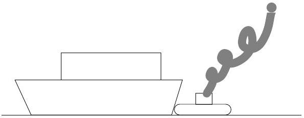

Question 1

A large container ship is coming in to port and must be pushed by a tugboat. While the tug and the container ship being pushed are speeding up to cruising speed,

(A) the amount of force with which the tug pushes against the container ship is equal to the amount of force with which the container ship pushes back against the tug.
(B) the amount of force with which the tug pushes against the container ship is smaller than the amount of force with which the container ship pushes back against the tug.
(C) the amount of force with which the tug pushes against the container ship is greater than the amount of force with which the container ship pushes back against the tug.
(D) the tug's engine is running so the tug pushes against the container ship, but the container ship's engine is not running so it can't push back against the tug.
(E) neither the tug nor the container ship exert any force on the other. The container ship is pushed forward simply because it is in the way of the tug.

Solution: (a) - the forces are an action-reaction pair.
