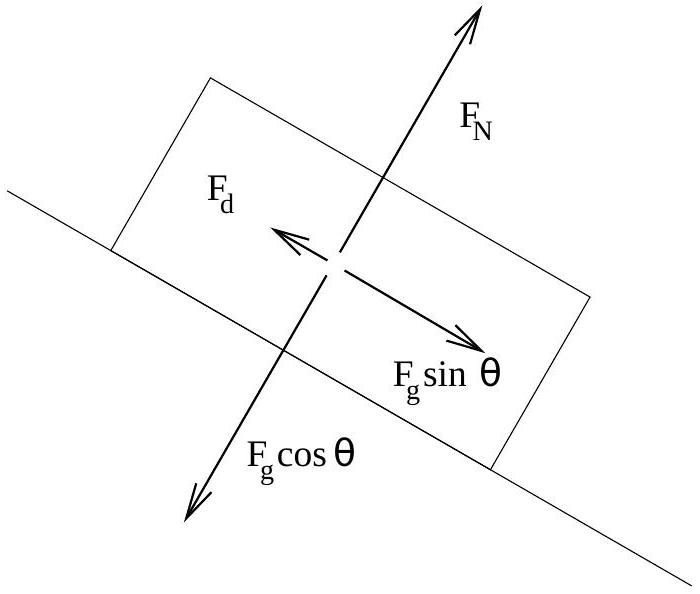

Question 12 Suggested time: 25 minutes
Ben has built a toy car. He has worked hard at reducing the friction in the wheels, so much so that it can be considered negligible. The car is, however, subject to a drag force $F _ { d } = \kappa v ^ { 2 }$ where $v$ is the speed of the car and $\kappa = 0.030 \mathrm {~kg} \mathrm {~m} ^ { - 1 }$. The car has mass $m = 2.5 \mathrm {~kg}$ and cross-sectional area $A = 0.06 \mathrm {~m} ^ { 2 }$. Take the acceleration due to gravity to be $g = 9.8 \mathrm {~m} \mathrm {~s} ^ { - 2 }$.
Ben places the car at the top of a ramp of length $s = 1.2 \mathrm {~m}$ inclined at an angle $\theta = 30 ^ { \circ }$ to the horizontal. He pushes it for time $t = 0.25 \mathrm {~s}$ with a force such that the nett force acting on the car is $F _ { p } = 20.0 \mathrm {~N}$. He then lets the car travel down the ramp and along a flat track.

(a) Consider the car at time $t$, when Ben stops pushing and find
    (i) $v _ { t }$, the speed of the car and
    (ii) $s _ { t }$, the distance the car has traveled.

Solution:Applying Newton's second law

$$
\begin{aligned}
F _ { p } & = m a _ { 1 } \\
\frac { F _ { p } } { m } & = a _ { 1 } .
\end{aligned}
$$

Since the acceleration is constant

$$
\begin{aligned}
v _ { t } & = a _ { 1 } t \\
& = \frac { F _ { p } } { m } t \\
& = 2.0 \mathrm {~ms} ^ { - 1 } .
\end{aligned}
$$

We can relate the distance travelled to the initial velocity, $u = 0$, the acceleration and the time taken

$$
\begin{aligned}
s _ { t } & = u t + \frac { 1 } { 2 } a _ { 1 } t ^ { 2 } \\
& = 0 + \frac { F _ { p } } { 2 m } t ^ { 2 } \\
& = 0.25 \mathrm {~m}
\end{aligned}
$$

(3 marks)

(b) Find an expression for $v _ { b }$, the speed of the car when it reaches the bottom of the ramp. Drawing a free body diagram of the car will help you. Note that $v _ { b }$ is approximately $4 \mathrm {~m} \mathrm {~s} ^ { - 1 }$.

## Solution:

$$
\begin{aligned}
F & = F _ { g } \sin \theta - F _ { d } \\
m a _ { 2 } & = m g \sin \theta - \kappa v ^ { 2 } \\
a _ { 2 } & = g \sin \theta - \frac { \kappa } { m } v ^ { 2 }
\end{aligned}
$$

The second term on the right hand side of the equation will be less than approximately $\frac { 0.030 \mathrm { kgm } ^ { - 1 } } { 2.5 \mathrm {~kg} } \left( 4 \mathrm {~ms} ^ { - 1 } \right) ^ { 2 } = 0.2 \mathrm {~ms} ^ { - 2 }$. The first term is constant and is equal to $9.8 \mathrm {~ms} ^ { - 2 } \sin 30 ^ { \circ } = 4.9 \mathrm {~ms} ^ { - 2 }$, which is always much bigger than the second term, so we can neglect the second term. Hence, the acceleration of the car is approximately constant, so

$$
\begin{aligned}
v _ { b } ^ { 2 } & = v _ { t } ^ { 2 } + 2 a _ { 2 } s _ { 2 } \\
& = \left( \frac { F _ { p } } { m } t \right) ^ { 2 } + 2 g \sin \theta \left( s - s _ { t } \right) \\
v _ { b } & = \sqrt { \left( \frac { F _ { p } } { m } t \right) ^ { 2 } + 2 g s \sin \theta - \frac { g F _ { p } } { m } t ^ { 2 } \sin \theta } .
\end{aligned}
$$

(4 marks)

(c) After he has released the car, Ben notices that there is a large block on the track, a distance $d = 12.5 \mathrm {~m}$ from the bottom of the ramp. Find $v$, the velocity of the car when it hits the block.

Solution:

$$
\begin{aligned}
- F _ { d } & = m a _ { 3 } \\
\frac { - \kappa } { m } v ^ { 2 } & = a _ { 3 }
\end{aligned}
$$

This equation has the same form as the one given in the useful information, with $k = \frac { - \kappa } { m }$, so

$$
\begin{aligned}
v _ { b } & = l e ^ { \frac { - \kappa } { m } 0 } \\
& = l e ^ { 0 } \\
& = l .
\end{aligned}
$$

So we have

$$
v = v _ { b } e ^ { \frac { - \kappa } { m } x } .
$$

We can use our previous expression for $v _ { b }$ and substitute $x = d$ to find the car's velocity when it reaches the block

$$
\begin{aligned}
v & = \left[ \sqrt { \left( \frac { F _ { p } } { m } t \right) ^ { 2 } + 2 g s \sin \theta - \frac { g F _ { p } } { m } t ^ { 2 } \sin \theta } \right] e ^ { \frac { - \kappa } { m } d } \\
& = 3.1 \mathrm {~ms} ^ { - 1 }
\end{aligned}
$$

(4 marks)
Useful Information
If the acceleration of a body, $a$, is related to the velocity by $a = k v ^ { 2 }$, the velocity is related to the position, $x$ by $v = l e ^ { k x }$ for some constant, $l$.
In physics it is often useful to make approximations. This can simplify your calculations, and if the approximation you make is appropriate, it won't change your result appreciably. For example, if you know that $A = B + C$ and that $C$ is much, much smaller than $B$, you may be able to say that $A = B$ and get the same result as you would have using $A = B + C$. If you make an approximation you must demonstrate that it is valid.
Marker's comments: Part (a) was well done by many students, however a large number of students treated $F _ { p }$ as the force applied by Ben rather than the nett force. A number of students tried to use conservation of energy for this and other parts. Most did this by equating the initial gravitational potential energy with the final kinetic energy without considering the nature of the forces at work. In part (ii), many students assumed that the velocity of the car was constant. This was not correct.
Part (b) could be done using either the method above or conservation of energy. Many students attempted one of these methods but most failed to explain why the drag force could be neglected. Some students who did explain that the drag force was much smaller than the gravitational force assumed that the drag was constant and used the value of $v _ { t }$ they found in part a or the approximate value of $v _ { b }$ given in the question to calculate $F _ { d }$. This was accepted if the student gave adequate explanation of why the change in the force was negligible. A number of students didn't relate this part to the previous part and assumed that the car began stationary and/or at the top of the ramp rather than using the expressions they had already found. The overwhelming problem with responses to this part was that almost no students gave an algebraic expression for $v _ { b }$. Most students who completed this part gave a numerical answer instead.
Part (c) was not very well done by many students. Many students continued to neglect the drag force or treated it as a constant. Of the students who used the correct expression for the drag force many confused $\kappa$ in the useful information with $k$, giving them a dimensionally incorrect expression and an incorrect answer.
A surprising number of students mislabeled the parts of this question. Many students labeled part (b) as (a) (iii). More surprisingly, a number of students labeled part (c) as part (d).
