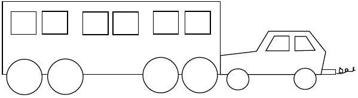
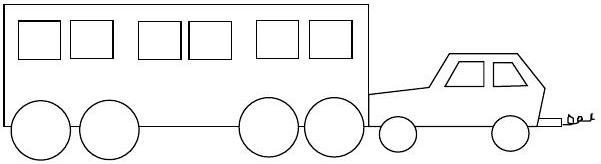
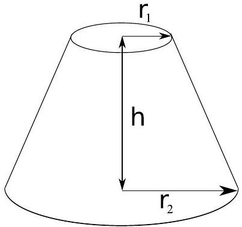

Time Allowed: 135 minutes
Hint: It's a good idea to read through the paper first!

Comments

- In these solutions, the questions are presented with the solutions directly following each part of each question.
- These solutions are a guide only. They provide a sketch of the solutions but not all of the intermediate steps in working that a student would be expected to submit. They do, however, contain enough information that a student should be able to follow one method of solving each question. Students who submit solutions that are valid but do not match what is written here are given full credit, and these solutions should not be read as a statement of the only acceptable answers.

MARKS

| Section A | 10 multiple choice questions | 10 marks |
| :--- | :--- | :--- |
| Section B | 5 written answer questions | 50 marks |
|  |  | 60 marks |

## Section A

Multiple Choice - 1 mark each
Marks will not be deducted for incorrect answers.
Use the multiple choice answer sheet provided.
Suggested time: 20 minutes

Question 1
A large hefty chicken and a small light quail, both flying in midair, have the same kinetic energy. Which of the following statements is true?

(A) The chicken has a greater speed than the quail.
(B) The quail has a greater speed than the chicken.
(C) The chicken and the quail have the same speed.
(D) Nothing can be inferred, the kinetic energy has nothing to do with the speed.
(E) The direction of the quail and the chicken must be taken into account before a decision can be made.

Solution: (B) - for the same value of $m v ^ { 2 } / 2$ an object with the lesser mass has a greater speed.

Question 2
The large hefty chicken and the small light quail, still both flying in midair with the same kinetic energy, fly directly at each other and collide head-on due to a joint navigational error, and briefly become one fowl object. Which of the following statements is true in the instant after the collision?

(A) The object moves in the same direction as the chicken's original motion.
(B) The object moves in the same direction as the quail's original motion.
(C) The object stops dead in the air.
(D) As soon as they collide they move downward with velocity $9.8 \mathrm {~m} \mathrm {~s} ^ { - 1 }$.
(E) It depends on how hard the chicken hits the quail.

Solution: (A) - for the same value of $m v ^ { 2 } / 2 = ( m v ) ^ { 2 } / 2 m$ the momentum $p = m v$ is greater for an object with greater $m$ and momentum is conserved in the collision.

Question 3
Lucy is measuring the acceleration due to gravity in Melbourne by dropping a ball through a vertical distance 1.00 m and timing how long it takes. The ball starts at rest, and Lucy times its fall four times. The results are: 0.47 s, 0.42 s, 0.48 s and 0.41 s. The uncertainty in her distance measurement is 1 cm and the uncertainty in the timer is 0.01 s. What is the value of $g$ from Lucy's experiment?

(A) $8.68 \mathrm {~m} \mathrm {~s} ^ { - 2 }$
(B) $9.81 \mathrm {~m} \mathrm {~s} ^ { - 2 }$
(C) $9.88 \mathrm {~m} \mathrm {~s} ^ { - 2 }$
(D) $10.1 \mathrm {~m} \mathrm {~s} ^ { - 2 }$
(E) $11.3 \mathrm {~m} \mathrm {~s} ^ { - 2 }$

Solution: (D) - the distance an object falls in a time $t$ due to an acceleration due to gravity $g$ is $s = g t ^ { 2 } / 2$, rearranging gives $g = 2 s / t ^ { 2 } = 10.1 \mathrm {~m} \mathrm {~s} ^ { - 2 }$.

Question 4
The uncertainty in this value of $g$ is

(A) at least $0.01 \mathrm {~m} \mathrm {~s} ^ { - 2 }$ and at most $0.03 \mathrm {~m} \mathrm {~s} ^ { - 2 }$.
(B) more than $0.03 \mathrm {~m} \mathrm {~s} ^ { - 2 }$ but at most $0.1 \mathrm {~m} \mathrm {~s} ^ { - 2 }$.
(C) more than $0.1 \mathrm {~m} \mathrm {~s} ^ { - 2 }$ but at most $0.4 \mathrm {~m} \mathrm {~s} ^ { - 2 }$.
(D) more than $0.4 \mathrm {~m} \mathrm {~s} ^ { - 2 }$ but at most $0.6 \mathrm {~m} \mathrm {~s} ^ { - 2 }$.
(E) more than $0.6 \mathrm {~m} \mathrm {~s} ^ { - 2 }$ but at most $2 \mathrm {~m} \mathrm {~s} ^ { - 2 }$.

Solution: (E) - a value of $t = 0.45 \pm 0.04 \mathrm {~s}$ just covers the range of measured values, so $t$ has approximately 9\% fractional error. The fractional error in the distance is 1\%, so the fractional error in $g$ is $( 2 \times 9 + 1 ) \% = 19 \%$ which gives an absolute uncertainty of around $2 \mathrm {~m} \mathrm {~s} ^ { - 2 }$

Question 5
The equation below gives the expected lifetime, $L$, of a rooster in a Kate's chicken yard once it has begun crowing. Note that all variables (including $L$ ) are positive, and the angle $\theta$ (which represents the angular height of the sun at 7 am ) varies between 0° and 90°.

$$
L = \frac { T N } { ( V - S ) \cos \theta }
$$

Which of the following will increase the life expectancy of a rooster in Kate's chicken yard?

(A) Decreasing $T$
(B) Increasing $V$
(C) Decreasing $S$
(D) Decreasing $\theta$
(E) None of the above

Solution: (E) - decreasing $T$, increasing $V$, decreasing $S$ and decreasing $\theta$ all decrease $L$ since $L , T , N , V - S$ and $\cos \theta$ are all positive.

Question 6

A large train has ended up on the road and a small car is pushing it back to the tracks. While the small car and the large train being pushed are speeding up to cruising speed,

(A) the amount of force with which the small car pushes against the large train is equal to the amount of force with which the large train pushes back against the small car.
(B) the amount of force with which the small car pushes against the large train is smaller than the amount of force with which the large train pushes back against the small car.
(C) the amount of force with which the small car pushes against the large train is greater than the amount of force with which the large train pushes back against the small car.
(D) the small car's engine is running so the small car pushes against the large train, but the large train's engine is not running so it can't push back against the small car.
(E) neither the small car nor the large train exert any force on the other. The large train is pushed forward simply because it is in the way of the small car.

Solution: (A) - the forces are an action-reaction pair.

Question 7

A large train has ended up on the road and a small car is pushing it back to the tracks. After the small car and the large train being pushed have reached a constant cruising speed,

(A) the amount of force with which the small car pushes against the large train is equal to the amount of force with which the large train pushes back against the small car.
(B) the amount of force with which the small car pushes against the large train is smaller than the amount of force with which the large train pushes back against the small car.
(C) the amount of force with which the small car pushes against the large train is greater than the amount of force with which the large train pushes back against the small car.
(D) the small car's engine is running so the small car pushes against the large train, but the large train's engine is not running so it can't push back against the small car.
(E) neither the small car nor the large train exert any force on the other. The large train is pushed forward simply because it is in the way of the small car.

Solution: (A) - the forces are an action-reaction pair.

Question 8

The figure above shows a frustum of a cone. Which of the expressions gives the area of the curved surface?

(A) $\pi \left( r _ { 1 } + r _ { 2 } \right) \left[ h ^ { 2 } + \left( r _ { 2 } - r _ { 1 } \right) ^ { 2 } \right] ^ { 1 / 2 }$
(B) $2 \pi \left( r _ { 1 } + r _ { 2 } \right)$
(C) $\pi h \left( r _ { 1 } ^ { 2 } + r _ { 1 } r _ { 2 } + r _ { 2 } ^ { 2 } \right) / 3$
(D) $\pi \left( r _ { 1 } ^ { 2 } + r _ { 2 } ^ { 2 } \right)$
(E) $\pi h \left( r _ { 1 } + r _ { 2 } \right)$

Solution: (A) - the area can be calculated from the area of the curved surface of a cone which is $\pi R \sqrt { H ^ { 2 } + R ^ { 2 } }$ for a cone of radius $R$ and height $H$. Alternatively, note that (B) and (C) are not areas, (D) is the area of the flat surfaces and (E) is the area of a trapezium with height $h$ and sides of length $2 \pi r _ { 1 }$ and $2 \pi r _ { 2 }$.

Question 9
Someone analysing an electric circuit obtains the equations

$$
\begin{aligned}
& I _ { 1 } ( 3 \Omega ) - I _ { 2 } ( 6 \Omega ) = 7 \mathrm {~V} , \\
& I _ { 1 } ( 2 \Omega ) + I _ { 3 } ( 3 \Omega ) = 28 \mathrm {~V} , \\
& I _ { 2 } ( 2 \Omega ) + I _ { 3 } ( 1 \Omega ) = 17 \mathrm {~V} .
\end{aligned}
$$

Note that V is the unit volts, and $\Omega$ is the unit Ohms. $I _ { 1 } , I _ { 2 }$ and $I _ { 3 }$ are currents. Which of the following statements is true?

(A) $I _ { 1 } , I _ { 3 } > 0 , I _ { 2 } < 0$
(B) $I _ { 1 } , I _ { 3 } < 0 , I _ { 2 } > 0$
(C) $I _ { 1 } , I _ { 2 } , I _ { 3 } > 0$
(D) $I _ { 3 } > 0 , I _ { 1 } , I _ { 2 } < 0$
(E) $I _ { 3 } < 0 , I _ { 1 } , I _ { 2 } > 0$

Solution: $( \mathrm { E } ) - I _ { 1 } = 30 \mathrm {~A} , I _ { 2 } = 83 / 6 \mathrm {~A}$ and $I _ { 3 } = - 32 / 3 \mathrm {~A}$.

Question 10

The figure to the right shows a travelling wave moving in the positive $x$-direction. At time $t = 0 \mathrm {~s}$, the wave plotted as a function of position has the shape shown by the solid curve, and at $t = 3 \mathrm {~s}$, the shape shown by the dashed curve.

The following six panels show plots as a function of time, at the position $x = 0 \mathrm {~m}$.

Which of the panels represent possible shapes of the travelling wave?
(A) 4 \& 6
(B) 1 \& 3
(C) 1, 2 \& 3
(D) 4, 5 \& 6
(E) 1 \& 4

Solution: (B) - 1, 2 \& 3 show waves travelling in the positive $x$-direction, but only 1 \& 3 have $y = 0 \mathrm {~m}$ at $t = 3 \mathrm {~s}$.

## Section B

Written Answer Questions
Attempt ALL questions in this part.

You may be able to do later parts of a question even if you cannot do earlier parts.
Remember that if you don't try a question, you can't get any marks for it - so have a go at everything!
Suggested times to spend on each question are given. Don't be discouraged if you take longer than this - if you complete it in the time suggested consider that you've done very well.

Question 11 Suggested time: 25 minutes
A particle of mass $m$ is initially travelling at constant velocity in the $x$-direction with momentum $\mathbf { p } _ { 1 }$. This particle hits a second, initially stationary particle of mass $M$. After the collision both particles are moving in the $x - y$ plane and have constant velocity. The first particle has momentum $\mathbf { p } _ { 2 }$ with components $p _ { 2 x }$ and $p _ { 2 y }$ in the $x$ - and $y$-directions respectively.

(a) In terms of $m , M , p _ { 1 } , p _ { 2 x }$ and $p _ { 2 y }$, find $K _ { 2 }$, the final kinetic energy of the first particle (mass $m$ ) and $K _ { M }$, the final kinetic energy of the second particle (mass $M$ ). $p _ { 1 }$ is the magnitude of the vector $\mathbf { p } _ { 1 }$.

Solution: (3 marks)

(b) Find $Q = K _ { i } - K _ { f }$, the total kinetic energy before the collision minus the total kinetic energy after the collision. Show that this is of the form
$$
Q = A \left( B p _ { 1 } ^ { 2 } - \left( p _ { 2 x } - C p _ { 1 } \right) ^ { 2 } - p _ { 2 y } ^ { 2 } \right)
$$
and give expressions for $A , B$ and $C$.

Solution: (3 marks)

$$
\begin{aligned}
Q & = K _ { i } - K _ { f } \\
& = \frac { p _ { 1 } ^ { 2 } } { 2 m } - \frac { p _ { 2 x } ^ { 2 } } { 2 m } - \frac { p _ { 2 y } ^ { 2 } } { 2 m } - \frac { p _ { 1 } ^ { 2 } } { 2 M } - \frac { p _ { 2 x } ^ { 2 } } { 2 M } + \frac { 2 p _ { 1 } p _ { 2 x } } { 2 M } - \frac { p _ { 2 y } ^ { 2 } } { 2 M } \\
& = \frac { M + m } { 2 M m } \left( - p _ { 2 x } ^ { 2 } + \frac { M - m } { M + m } p _ { 1 } ^ { 2 } + \frac { 2 m p _ { 1 } p _ { 2 x } } { M + m } - p _ { 2 y } ^ { 2 } \right) \\
& = \frac { M + m } { 2 M m } \left( \frac { M - m } { M + m } p _ { 1 } ^ { 2 } - \left( p _ { 2 x } - \frac { m p _ { 1 } } { M + m } \right) ^ { 2 } + \frac { m ^ { 2 } } { ( M + m ) ^ { 2 } } p _ { 1 } ^ { 2 } - p _ { 2 y } ^ { 2 } \right) \\
& = \frac { M + m } { 2 M m } \left( \left( \frac { M } { M + m } \right) ^ { 2 } p _ { 1 } ^ { 2 } - \left( p _ { 2 x } - \frac { m p _ { 1 } } { M + m } \right) ^ { 2 } - p _ { 2 y } ^ { 2 } \right)
\end{aligned}
$$

Therefore

$$
A = \frac { M + m } { 2 M m } , \quad B = \left( \frac { M } { M + m } \right) ^ { 2 } , \quad C = \frac { m } { M + m } .
$$

(c) What is the condition on $Q$ for an elastic collision?
Solution: (1 mark) Since kinetic energy is conserved in an elastic collision, $Q = 0$.
(d) Let $p _ { 1 }$ take the fixed value $p _ { 1 } = p _ { 0 }$. Sketch a graph of $p _ { 2 x }$ against $p _ { 2 y }$ for an elastic collision in which $M > m$. Label all intercepts.
Solution: (3 marks)

(e) What is the condition on $Q$ for an inelastic collision?
Solution: (1 mark) Since kinetic energy is not conserved in an elastic collision, but the total kinetic energy cannot increase as energy is conserved, $Q > 0$.
(f) For $p _ { 1 } = p _ { 0 }$ mark on your sketch for part 11d the possible values of $\mathbf { p } _ { 2 }$ for an inelastic collision.
Solution: (1 mark) The shaded region in part 11d.

Marker's comments:

- Many students used incorrect expressions for the kinetic energy $K = m v ^ { 2 } / 2$.
- Moving in the $x - y$ plane does not mean both objects move in the direction $x = y$, it means that they do not move in the $z$ direction.
- In parts (a) and (b) some students incorrectly assumed that the collision was elastic.
- Many students did not treat momentum correctly as a vector.

Question 12 Suggested time: 30 minutes
Charlotte and Ben have lots of old 100 W incandescent light bulbs that they don't like to see going to waste, but they also don't like to waste electricity so they want to find out how to run them most efficiently. They decide to compare the efficiencies of running a bulb at different input powers by comparing what they call the output ratio. Their definition of the output ratio is the ratio of the intensity of visible light at some fixed distance from the bulb to the electric power dissipated in the bulb.
To measure the visible light intensity they borrow a visible light meter a friend found in a collection of old photographic gear. This meter produces a voltage between its two output terminals that depends on the intensity of visible light incident on the detector. Its instruction booklet is long lost but a previous owner left brief hand-written instructions and the following graph.

After doing some research Charlotte finds that the intensity of light passing through two polarising filters is given by $I = I _ { 0 } \cos ^ { 2 } \theta$, where $I _ { 0 }$ is the intensity that passes through the filters when they are aligned and $\theta$ is the angle between the polarisation axes of the two filters. To make best use of the graph they decide to set up the visible light meter at a distance from the bulb such that at maximum power the light meter voltage reading $V _ { 1 }$ is just below the maximum given in the graph.
As the bulbs run on dangerous mains voltages, Ben asks his grandfather, a qualified electrician, for some help with adjusting the power of the bulb. Ben's grandfather provides them with a large variable transformer that plugs into the wall at one end and has a mains socket on the other, so that they can use a regular lamp to hold the bulb. To measure the power, he finds a plug-in power meter that can be connected between a mains plug and a mains socket and measures the power consumed by whatever is plugged into it.
Ben connects the power meter to the wall, plugs in the transformer and then plugs the lamp into the transformer output. Ben's grandfather checks it for electrical safety and then turns on the wall switch.

They choose a single bulb to use for all of their measurements. They don't have to worry about damaging it as the maximum output voltage of the transformer is the mains voltage, on which the bulb is designed to run.
Unfortunately, it is a sunny day and the voltage across the light meter is non-zero even when the bulb is off. Ben thinks that if he measures the voltage with the bulb off, he will be able to subtract this from his later measurements to find the voltage he would read if there were no sun. He does this and records 73 mV. He then takes the measurements, with the bulb on, that appear in the table below. Charlotte thinks that it would be better to close the blinds and make the room as dark as possible. She does this and takes her measurements. The following tables contain Ben's and Charlotte's data.

Ben
| $P _ { \text {bulb } } ( \mathrm { W } )$ | $V _ { 1 } ( \mathrm { mV } )$ |
| :--- | :--- |
| 9 | 87 |
| 20 | 102 |
| 42 | 139 |
| 62 | 166 |
| 79 | 198 |
| 100 | 248 |

Charlotte
| $P _ { \text {bulb } } ( \mathrm { W } )$ | $V _ { 1 } ( \mathrm { mV } )$ |
| :--- | :--- |
| 10 | 55 |
| 21 | 88 |
| 40 | 124 |
| 61 | 163 |
| 78 | 192 |
| 100 | 235 |

(a) Whose method would you use and why?
Solution: (2 marks) Charlotte's method is better. Although both attempt to account for the background light, Ben's method requires that the voltage output be directly proportional to the intensity, which it is not. Charlotte's method reduces the amount of stray light directly and will improve the experiment.
(b)Using the data acquired by the person with the better method, calculate the output ratio for each data point. The intensities you use to calculate the output ratio should be in units of $I _ { 0 }$, i.e. express them as some number times $I _ { 0 }$, and then just treat the $I _ { 0 }$ as a unit.
Solution: (5 marks) Charlotte's data:

| P(W) | V (mV) | $\theta$ | Intensity | Output ratio( $I _ { 0 } W ^ { - 1 }$ ) |
| :--- | :--- | :--- | :--- | :--- |
| 10 | 55 | 84 | $0.011 I _ { 0 }$ | 0.0011 |
| 21 | 88 | 77 | $0.051 I _ { 0 }$ | 0.0024 |
| 40 | 124 | 68 | $0.14 I _ { 0 }$ | 0.0035 |
| 61 | 163 | 56 | $0.31 I _ { 0 }$ | 0.0052 |
| 78 | 192 | 44 | $0.52 I _ { 0 }$ | 0.0066 |
| 100 | 235 | 14 | $0.94 I _ { 0 }$ | 0.0094 |

The required output ratios are the numbers in the final column.
(c) Given the values of the output ratio you calculated, at what power should they run their bulbs?
Solution: (2 marks) Since the highest output ratio occurs at 100 W, they should run their bulbs at 100 W for maximum efficiency.

(d) Briefly suggest things that Charlotte and Ben could have done with the equipment they had to improve their results.
Solution: (3 marks) There are many possible modifications to the method, and marks were awarded here based on demonstrated thought. Simply saying 'repeat the experiment', for example, did not score highly if it was not clear why this would help. Some ideas (but by no means all) worth something are:
    - Take multiple measurements of each point to reduce the uncertainty
    - Test more than one lamp and compare optimal power to identify whether all lamps were the same
    - Place the power meter between transformer and lamp to eliminate the transformer losses from the measured power
    - Choose a distance such that the light meter response is not flat, i.e. use a section of the calibration curve that varies more to improve precision

Marker's comments:

- This question was generally well done.
- Students needed to use the information provided.
- Students needed to take care to read points from the graph accurately.
- Some students needed to read the question more carfeully, e. g. part (d) asks about improvements using the equipment that they had, not about improvements possible with new equipment.

Question 13 Suggested time: 20 minutes

(a) The Earth's climate varies considerably between the hot equator and the cold poles. Explain this fact with reference to the diagram below of the Earth and Sun at an equinox.

Solution: (2 marks)

Electromagnetic radiation is emitted uniformly in all directions from the Sun. This is the source of energy which heats the Earth. There is a greater flux of radiation onto the Earth at the equator than at the poles as the surface of the Earth is perpendicular to the direction of propagation of the radiation there.

Hence the Earth is hotter at the equator than at the poles.

(b) The Earth is surrounded by an atmosphere that is thin compared to its radius but still many kilometres thick, so air can flow up or down as well as across the surface of the Earth. The air high in the atmosphere at the poles is cool but warmer than than the air just above the surface which is cooled by the cold land and sea below. Similarly at the equator the air high in the atmosphere is warm but cooler than the air just above the surface which is heated by the hot land and sea below.
Sketch a diagram of the large scale flows of air in the atmosphere that result. Explain your answer.
Solution: (4 marks)

At the equator, the surface of the Earth will heat the air just above it. As the air is heated, its density decreases, so it will rise. The rising air will decrease the pressure at the surface and cause air to be drawn along the surface from the poles to the equator.
The air which rises at the equator must flow away from the equator to the poles in the upper level of the atmosphere as it cannot build up in one place.
The convection cells formed close with air flowing down from the upper level of the atmosphere at the poles, cooling as it does.

(c) So far the effect of the rotation of the Earth has been neglected. It can be included by considering the Coriolis force which appears to act on all bodies in rotating frames of reference such as the Earth.
The magnitude of the component of the Coriolis force directed along the surface of the Earth is $F = m \Omega v \sin \theta$ where $m$ is the mass of the body experiencing the force, $\Omega$ is the Earth's rotational velocity, $v$ is the speed of the body and $\theta$ is the latitude ( $0 ^ { \circ }$ at the equator and 90° at the poles) of the body. The Coriolis force is always directed perpendicular to the velocity of the body and is directed towards the east for bodies heading towards the poles in both hemispheres.
Since we live on the surface of the Earth the winds we feel are the large scale flows of air in the lowest level of the atmosphere, and only those across the surface of the Earth.
Given your answer to part 13b, and including the Coriolis force, sketch the large scale winds across the Earth's surface. Explain your answer.
Solution: (4 marks) $F = m \Omega v \sin \theta . \theta = 0 ^ { \circ }$ at the equator, and 90° at the poles.
So the surface component of the Coriolis force is zero at the equator and maximum at the poles.
Since the magnitude of the force doesn't depend on the direction of the velocity, and it is directed east for a poleward velocity, it must cause the air to circulate clockwise in the northern hemisphere and anticlockwise in the southern hemisphere.

(d) Sailors describe a region right near the equator, called the doldrums, in which there are often long periods with no wind. Is this consistent with the above model? Explain.
Solution: (1 mark) Yes, it is consistent, as right near the equator air flows up rather than across the surface. This region therefore has little to no surface wind.
(e) Just to the north and south of the doldrums are regions with very reliable winds called the trade winds. Using the model, predict the directions of the trade winds in the northern and southern hemispheres.
Solution: (1 mark) The trade winds are easterlies (blowing East to West) in both hemispheres. See diagram for part 13c.

## Marker's comments:

- The equatorial regions of the Earth are closer to the Sun than the poles, however this does not cause a significant temperature difference.
- The atmosphere is a part of the Earth which cannot be neglected when considering it's climate.
- The convection cells described in the solution to part (b) are not driven by the temperature gradient at the poles. They require heating from below so that the heated, less dense air, rises. Cooling from below doesn't cause the air high in the atmosphere to sink.
- Part (c) was generally very poorly answered. One common error was to think that the force was proportional to the velocity rather than the acceleration. Also, very few students thought about the direction of the force.
- Part (d) was frequently misread.
- Part (e) was well done by those who answered it. However, some students gave the direction of the winds in the upper atmosphere rather than those on the surface.

Question 14 Suggested time: 40 minutes
A rare waist-necked giraffe has a mild gastric upset, and it is necessary that it be treated with some giant medicine balls. The balls are spherical lozenges, and work best when they are big. The giraffe's insides are at temperature $T _ { G }$ and the surrounding air is at temperature $T _ { A }$. As the lozenge changes temperature as it slides down the giraffe's long, beamy neck, it will expand. The volume $V$ of the lozenge at some temperature $T$ is related to its volume $V _ { A }$ at $T _ { A }$ by

$$
V = V _ { A } \left( 1 + \beta \left( T - T _ { A } \right) \right) ,
$$

where $\beta > 0$ is a constant.
The temperature does not change linearly down the giraffe's neck, but accurate measurements have been taken many times and it is known that the temperature varies with position $h$ from the giraffe's body as

$$
T = T _ { G } - \left( T _ { G } - T _ { A } \right) \frac { h ^ { 2 } } { N ^ { 2 } }
$$

(a) Show that the diameter of the ball at some height $h$ away from the giraffe's body is given by
$$
d = d _ { A } \left[ 1 + \gamma \left( N ^ { 2 } - h ^ { 2 } \right) \right] ^ { 1 / 3 } ,
$$
where $d _ { A }$ is the initial diameter in the air and $N$ is the length of the neck, and find the constant $\gamma$.

Solution: (1 mark) We have

$$
V = V _ { A } \left( 1 + \beta \left( T - T _ { A } \right) \right)
$$

and

$$
T = T _ { G } - \left( T _ { G } - T _ { A } \right) \frac { h ^ { 2 } } { N ^ { 2 } } .
$$

Substituting the second equation into the first gives

$$
\begin{aligned}
V & = V _ { A } \left[ 1 + \beta \left( T _ { G } - T _ { A } - \left( T _ { G } - T _ { A } \right) \frac { h ^ { 2 } } { N ^ { 2 } } \right) \right] \\
& = V _ { A } \left[ 1 + \beta \left( T _ { G } - T _ { A } \right) \left( 1 - \frac { h ^ { 2 } } { N ^ { 2 } } \right) \right] \\
& = V _ { A } \left[ 1 + \frac { \beta \left( T _ { G } - T _ { A } \right) } { N ^ { 2 } } \left( N ^ { 2 } - h ^ { 2 } \right) \right] .
\end{aligned}
$$

Now, $V = 4 \pi r ^ { 3 } / 3 = \pi d ^ { 3 } / 6$, so

$$
\begin{aligned}
\frac { 1 } { 6 } \pi d ^ { 3 } & = \frac { 1 } { 6 } \pi d _ { A } ^ { 3 } \left[ 1 + \frac { \beta \left( T _ { G } - T _ { A } \right) } { N ^ { 2 } } \left( N ^ { 2 } - h ^ { 2 } \right) \right] \\
d & = d _ { A } \left[ 1 + \frac { \beta \left( T _ { G } - T _ { A } \right) } { N ^ { 2 } } \left( N ^ { 2 } - h ^ { 2 } \right) \right] ^ { 1 / 3 } .
\end{aligned}
$$

This is in the required form, with $\gamma = \beta \left( T _ { G } - T _ { A } \right) / N ^ { 2 }$.

It is physically reasonable to assume that $\gamma$ is a small quantity. The binomial approximation states that for small $n x , ( 1 + x ) ^ { n } \simeq 1 + n x$.

(b) Write down the approximate expression for $d$.
Solution: (1 mark) Assuming that
$$
\frac { \beta \left( T _ { G } - T _ { A } \right) } { 3 N ^ { 2 } } \left( N ^ { 2 } - h ^ { 2 } \right)
$$
is small, we get
$$
\left[ 1 + \frac { \beta \left( T _ { G } - T _ { A } \right) } { N ^ { 2 } } \left( N ^ { 2 } - h ^ { 2 } \right) \right] ^ { 1 / 3 } \approx 1 + \frac { \beta \left( T _ { G } - T _ { A } \right) } { 3 N ^ { 2 } } \left( N ^ { 2 } - h ^ { 2 } \right)
$$
so
$$
d \approx d _ { A } \left[ 1 + \frac { \beta \left( T _ { G } - T _ { A } \right) } { 3 N ^ { 2 } } \left( N ^ { 2 } - h ^ { 2 } \right) \right] = d _ { A } \left[ 1 + \frac { \gamma } { 3 } \left( N ^ { 2 } - h ^ { 2 } \right) \right] .
$$
The width of the neck of a waist-necked giraffe is given by
$$
w = M + \zeta \left( h - \frac { N } { 2 } \right) ^ { 2 } ,
$$
where $M$ is the minimum width of the neck (at the 'waist'), and $h$ as before is the height away from the giraffe's body, so that $h = N$ is at the very top of the neck. $\zeta > 0$ is a constant.
It is of paramount importance not to choke the waist-necked giraffe with the medicinal lozenges, as this would do more harm than good, and retrieving a stuck lozenge is not anyone's idea of a fun way to spend an afternoon. You may assume that the difference between the lozenge's width at the top of the neck $d _ { A }$ differs from the width at the neck-waist $M$ only by a very small amount $\chi$.
(c) Write down the condition for the lozenge not to get stuck in the giraffe's neck. Replace $d _ { A }$ with $M - \chi$, and since $\gamma$ and $\chi$ are small you may neglect terms that contain a product of these two. Express your condition as an inequality with 0 on one side.
Solution: (2 marks) We have
$$
w = M + \zeta \left( h - \frac { N } { 2 } \right) ^ { 2 }
$$
and
$$
d _ { A } = M - \chi .
$$
We want $d < w$ at all times, lest the giraffe choke.
Substituting our expressions for each of these, we want
$$
\begin{aligned}
( M - \chi ) \left[ 1 + \frac { \gamma } { 3 } \left( N ^ { 2 } - h ^ { 2 } \right) \right] & < M + \zeta \left( h - \frac { N } { 2 } \right) ^ { 2 } \\
M + \frac { M \gamma } { 3 } \left( N ^ { 2 } - h ^ { 2 } \right) - \chi - \frac { \chi \gamma } { 3 } \left( N ^ { 2 } - h ^ { 2 } \right) - M - \zeta \left( h - \frac { N } { 2 } \right) ^ { 2 } & < 0 \\
\frac { M \gamma } { 3 } \left( N ^ { 2 } - h ^ { 2 } \right) - \chi - \zeta \left( h - \frac { N } { 2 } \right) ^ { 2 } & < 0 .
\end{aligned}
$$

(d) In order that the lozenge not get stuck, the inequality you wrote must hold for all $h$ between $N$ and 0 . If you solve the equation produced by making your inequality into an equality, you may or may not find a solution for $h$ in that range. Explain why if there is not a solution for $h$ somewhere in the neck, the lozenge will not get stuck.
Solution: (1.5 marks) The lozenge is not stuck initially, as $d _ { A } < M$. For the lozenge to get stuck, its diameter must at some point be equal to that of the giraffe's neck, as it cannot attain a greater diameter without at some point having an equal diameter. Taking the above inequality and solving it as an equality would yield solutions for points where the diameter of the lozenge is equal to the diameter of the giraffe's neck. If there were no solutions, there would be no points where the diameters were equal, and hence the lozenge would not stick.
(e) Find the maximum size of the lozenge such that it is guaranteed not to get stuck by that criterion.
Solution: (4 marks) The equation
$$
\delta ( h ) = - \frac { M \gamma } { 3 } \left( N ^ { 2 } - h ^ { 2 } \right) + \chi + \zeta \left( h - \frac { N } { 2 } \right) ^ { 2 }
$$
describes the amount by which the diameters of throat and lozenge differ as a function of $h$. We want to find the value of $\chi$ such that the parabola described by $\delta ( h )$ has exactly one root (i.e. takes the value of zero exactly once, and is never negative). We will call this value $\chi _ { \text {crit } }$, and this corresponds to the minimum value of $\chi$ (and hence the maximum value of $d _ { A }$ ) that the lozenge can take - any greater and it will stick.
Rewriting $\delta ( h )$ in canonical form, we get
$$
\delta ( h ) = \left( \frac { M \gamma } { 3 } + \zeta \right) h ^ { 2 } - \zeta N h + \left( - \frac { M \gamma N ^ { 2 } } { 3 } + \chi + \frac { \zeta N ^ { 2 } } { 4 } \right)
$$
Taking this as $\delta ( h ) = a h ^ { 2 } + b h + c$, we recall that a parabola has exactly one root when $b ^ { 2 } - 4 a c = 0$. Hence our condition gives that
$$
\begin{aligned}
\zeta ^ { 2 } N ^ { 2 } - 4 \left( \frac { M \gamma } { 3 } + \zeta \right) \left( - \frac { M \gamma N ^ { 2 } } { 3 } + \chi _ { \text {crit } } + \frac { \zeta N ^ { 2 } } { 4 } \right) & = 0 \\
\zeta ^ { 2 } N ^ { 2 } - 4 N ^ { 2 } \left( \frac { M \gamma } { 3 } + \zeta \right) \left( \frac { \zeta } { 4 } - \frac { M \gamma } { 3 } \right) & = 4 \left( \frac { M \gamma } { 3 } + \zeta \right) \chi _ { \text {crit } } \\
\chi _ { \text {crit } } & = \frac { 3 \zeta ^ { 2 } N ^ { 2 } } { 4 M \gamma + 12 \zeta } - N ^ { 2 } \left( \frac { \zeta } { 4 } - \frac { M \gamma } { 3 } \right)
\end{aligned}
$$
so
$$
d _ { A , \max } = M - \chi _ { \mathrm { crit } } = M - \frac { 3 \zeta ^ { 2 } N ^ { 2 } } { 4 M \gamma + 12 \zeta } + N ^ { 2 } \left( \frac { \zeta } { 4 } - \frac { M \gamma } { 3 } \right) .
$$

(f) Check your solution for the limiting cases of $\zeta \rightarrow 0$ and $\zeta \rightarrow \infty$. Do your values make sense in these limits (they should)? Explain why or why not.
Solution: (4.5 marks) When $\zeta \rightarrow 0$, the giraffe's neck has constant width $M$. The lozenge attains its maximum diameter at the base of the giraffe's neck $( h = 0 )$, and this size is
$$
d _ { \max } = d _ { A } \left[ 1 + \frac { \gamma N ^ { 2 } } { 3 } \right] .
$$
Taking our above expression for $d _ { A , \text { max } }$, we get in the limit as $\zeta \rightarrow 0$,
$$
d _ { A , \max } \rightarrow M \left[ 1 - \frac { \gamma N ^ { 2 } } { 3 } \right]
$$
so we have
$$
\begin{aligned}
d _ { \max } & \rightarrow M \left[ 1 - \frac { \gamma N ^ { 2 } } { 3 } \right] \left[ 1 + \gamma \frac { N ^ { 2 } } { 3 } \right] \\
& = M \left[ 1 - \frac { \gamma ^ { 2 } N ^ { 4 } } { 9 } \right] \\
& \approx M
\end{aligned}
$$
where we make this last approximation by recalling our earlier assumption that
$$
\frac { \beta \left( T _ { G } - T _ { A } \right) } { 3 N ^ { 2 } } \left( N ^ { 2 } - h ^ { 2 } \right) = \frac { \gamma \left( N ^ { 2 } - h ^ { 2 } \right) } { 3 }
$$
was small for all values of $h$. Hence we have that our result is sensible in the limit as $\zeta \rightarrow 0$, as we get that the lozenge only just passes through without sticking.
When $\zeta \rightarrow \infty$, the giraffe's neck is very wide at every point except at $h = N / 2$, where it has width $M$. At this height, the lozenge has diameter
$$
d _ { N / 2 } = d _ { A } \left[ 1 + \frac { \gamma } { 3 } \frac { 3 N ^ { 2 } } { 4 } \right] = d _ { A } \left[ 1 + \frac { \gamma N ^ { 2 } } { 4 } \right] .
$$
In the limit as $\zeta \rightarrow \infty$, we have
$$
\begin{aligned}
d _ { A , \max } & \rightarrow M - \frac { 3 N ^ { 2 } \zeta } { 12 } \left( 1 + \frac { 4 M \gamma } { 12 \zeta } \right) ^ { - 1 } + \frac { N ^ { 2 } \zeta } { 4 } - \frac { N ^ { 2 } M \gamma } { 3 } \\
& \approx M - \frac { N ^ { 2 } \zeta } { 4 } \left( 1 - \frac { M \gamma } { 3 \zeta } \right) + \frac { N ^ { 2 } \zeta } { 4 } - \frac { N ^ { 2 } M \gamma } { 3 } \\
& = M \left( 1 - \frac { \gamma N ^ { 2 } } { 4 } \right)
\end{aligned}
$$
Thus the lozenge's width at the narrow point of the neck goes to
$$
\begin{aligned}
d _ { N / 2 } & \rightarrow M \left[ 1 - \frac { \gamma N ^ { 2 } } { 4 } \right] \left[ 1 + \frac { \gamma N ^ { 2 } } { 4 } \right] \\
& = M \left[ 1 - \frac { \gamma ^ { 2 } N ^ { 4 } } { 16 } \right] \\
& \approx M
\end{aligned}
$$
by the same approximation as we made earlier. Thus the result is sensible in this limit also, as the lozenge only just makes it through.

Marker's comments:

- Many students made transcription errors that moved subscripts into multiplicative factors or vice versa, e.g. $d _ { A } = d A$.
- Students also often forgot to close parantheses and thereby introduced errors.
