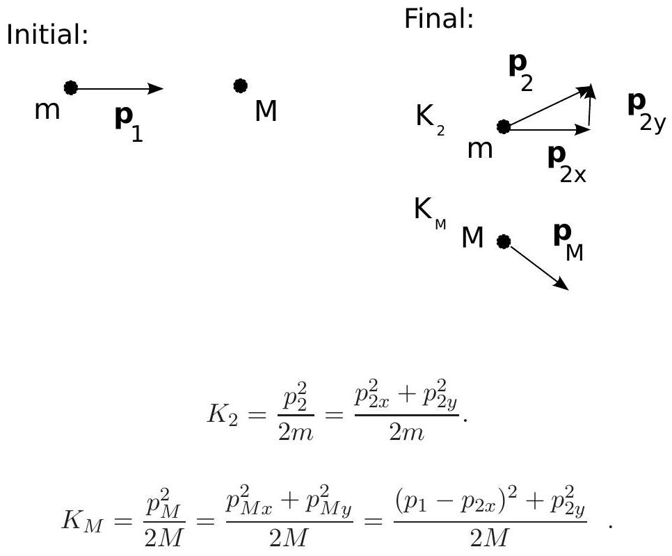
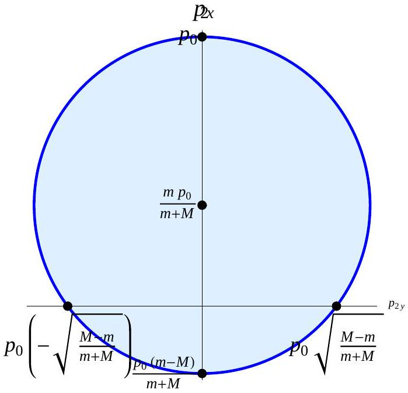

Question 11 Suggested time: 25 minutes
A particle of mass $m$ is initially travelling at constant velocity in the $x$-direction with momentum $\mathbf { p } _ { 1 }$. This particle hits a second, initially stationary particle of mass $M$. After the collision both particles are moving in the $x - y$ plane and have constant velocity. The first particle has momentum $\mathbf { p } _ { 2 }$ with components $p _ { 2 x }$ and $p _ { 2 y }$ in the $x$ - and $y$-directions respectively.

(a) In terms of $m , M , p _ { 1 } , p _ { 2 x }$ and $p _ { 2 y }$, find $K _ { 2 }$, the final kinetic energy of the first particle (mass $m$ ) and $K _ { M }$, the final kinetic energy of the second particle (mass $M$ ). $p _ { 1 }$ is the magnitude of the vector $\mathbf { p } _ { 1 }$.

Solution: (3 marks)

(b) Find $Q = K _ { i } - K _ { f }$, the total kinetic energy before the collision minus the total kinetic energy after the collision. Show that this is of the form
$$
Q = A \left( B p _ { 1 } ^ { 2 } - \left( p _ { 2 x } - C p _ { 1 } \right) ^ { 2 } - p _ { 2 y } ^ { 2 } \right)
$$
and give expressions for $A , B$ and $C$.

Solution: (3 marks)

$$
\begin{aligned}
Q & = K _ { i } - K _ { f } \\
& = \frac { p _ { 1 } ^ { 2 } } { 2 m } - \frac { p _ { 2 x } ^ { 2 } } { 2 m } - \frac { p _ { 2 y } ^ { 2 } } { 2 m } - \frac { p _ { 1 } ^ { 2 } } { 2 M } - \frac { p _ { 2 x } ^ { 2 } } { 2 M } + \frac { 2 p _ { 1 } p _ { 2 x } } { 2 M } - \frac { p _ { 2 y } ^ { 2 } } { 2 M } \\
& = \frac { M + m } { 2 M m } \left( - p _ { 2 x } ^ { 2 } + \frac { M - m } { M + m } p _ { 1 } ^ { 2 } + \frac { 2 m p _ { 1 } p _ { 2 x } } { M + m } - p _ { 2 y } ^ { 2 } \right) \\
& = \frac { M + m } { 2 M m } \left( \frac { M - m } { M + m } p _ { 1 } ^ { 2 } - \left( p _ { 2 x } - \frac { m p _ { 1 } } { M + m } \right) ^ { 2 } + \frac { m ^ { 2 } } { ( M + m ) ^ { 2 } } p _ { 1 } ^ { 2 } - p _ { 2 y } ^ { 2 } \right) \\
& = \frac { M + m } { 2 M m } \left( \left( \frac { M } { M + m } \right) ^ { 2 } p _ { 1 } ^ { 2 } - \left( p _ { 2 x } - \frac { m p _ { 1 } } { M + m } \right) ^ { 2 } - p _ { 2 y } ^ { 2 } \right)
\end{aligned}
$$

Therefore

$$
A = \frac { M + m } { 2 M m } , \quad B = \left( \frac { M } { M + m } \right) ^ { 2 } , \quad C = \frac { m } { M + m } .
$$

(c) What is the condition on $Q$ for an elastic collision?
Solution: (1 mark) Since kinetic energy is conserved in an elastic collision, $Q = 0$.
(d) Let $p _ { 1 }$ take the fixed value $p _ { 1 } = p _ { 0 }$. Sketch a graph of $p _ { 2 x }$ against $p _ { 2 y }$ for an elastic collision in which $M > m$. Label all intercepts.
Solution: (3 marks)

(e) What is the condition on $Q$ for an inelastic collision?
Solution: (1 mark) Since kinetic energy is not conserved in an elastic collision, but the total kinetic energy cannot increase as energy is conserved, $Q > 0$.
(f) For $p _ { 1 } = p _ { 0 }$ mark on your sketch for part 11d the possible values of $\mathbf { p } _ { 2 }$ for an inelastic collision.
Solution: (1 mark) The shaded region in part 11d.

Marker's comments:

- Many students used incorrect expressions for the kinetic energy $K = m v ^ { 2 } / 2$.
- Moving in the $x - y$ plane does not mean both objects move in the direction $x = y$, it means that they do not move in the $z$ direction.
- In parts (a) and (b) some students incorrectly assumed that the collision was elastic.
- Many students did not treat momentum correctly as a vector.
