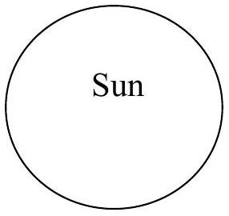
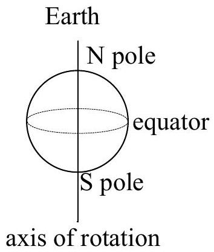
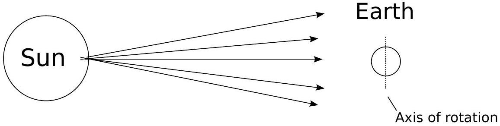
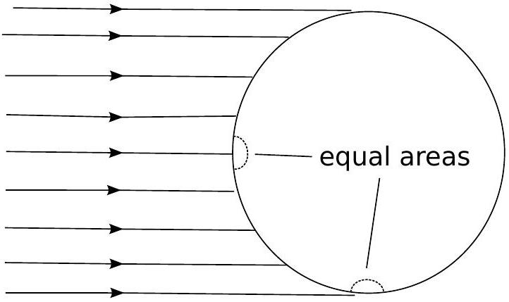
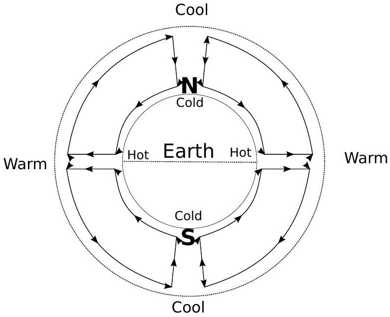
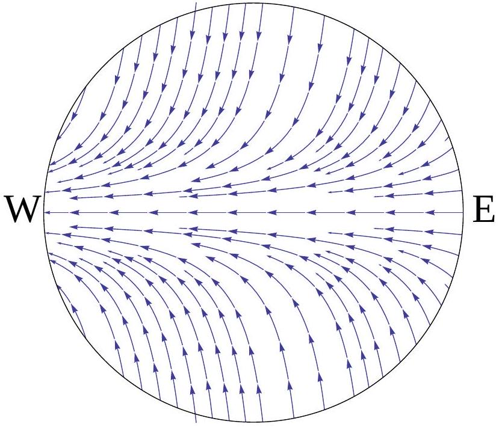

Question 13 Suggested time: 20 minutes

(a) The Earth's climate varies considerably between the hot equator and the cold poles. Explain this fact with reference to the diagram below of the Earth and Sun at an equinox.

Solution: (2 marks)

Electromagnetic radiation is emitted uniformly in all directions from the Sun. This is the source of energy which heats the Earth. There is a greater flux of radiation onto the Earth at the equator than at the poles as the surface of the Earth is perpendicular to the direction of propagation of the radiation there.

Hence the Earth is hotter at the equator than at the poles.

(b) The Earth is surrounded by an atmosphere that is thin compared to its radius but still many kilometres thick, so air can flow up or down as well as across the surface of the Earth. The air high in the atmosphere at the poles is cool but warmer than than the air just above the surface which is cooled by the cold land and sea below. Similarly at the equator the air high in the atmosphere is warm but cooler than the air just above the surface which is heated by the hot land and sea below.
Sketch a diagram of the large scale flows of air in the atmosphere that result. Explain your answer.
Solution: (4 marks)

At the equator, the surface of the Earth will heat the air just above it. As the air is heated, its density decreases, so it will rise. The rising air will decrease the pressure at the surface and cause air to be drawn along the surface from the poles to the equator.
The air which rises at the equator must flow away from the equator to the poles in the upper level of the atmosphere as it cannot build up in one place.
The convection cells formed close with air flowing down from the upper level of the atmosphere at the poles, cooling as it does.

(c) So far the effect of the rotation of the Earth has been neglected. It can be included by considering the Coriolis force which appears to act on all bodies in rotating frames of reference such as the Earth.
The magnitude of the component of the Coriolis force directed along the surface of the Earth is $F = m \Omega v \sin \theta$ where $m$ is the mass of the body experiencing the force, $\Omega$ is the Earth's rotational velocity, $v$ is the speed of the body and $\theta$ is the latitude ( $0 ^ { \circ }$ at the equator and 90° at the poles) of the body. The Coriolis force is always directed perpendicular to the velocity of the body and is directed towards the east for bodies heading towards the poles in both hemispheres.
Since we live on the surface of the Earth the winds we feel are the large scale flows of air in the lowest level of the atmosphere, and only those across the surface of the Earth.
Given your answer to part 13b, and including the Coriolis force, sketch the large scale winds across the Earth's surface. Explain your answer.
Solution: (4 marks) $F = m \Omega v \sin \theta . \theta = 0 ^ { \circ }$ at the equator, and 90° at the poles.
So the surface component of the Coriolis force is zero at the equator and maximum at the poles.
Since the magnitude of the force doesn't depend on the direction of the velocity, and it is directed east for a poleward velocity, it must cause the air to circulate clockwise in the northern hemisphere and anticlockwise in the southern hemisphere.

(d) Sailors describe a region right near the equator, called the doldrums, in which there are often long periods with no wind. Is this consistent with the above model? Explain.
Solution: (1 mark) Yes, it is consistent, as right near the equator air flows up rather than across the surface. This region therefore has little to no surface wind.
(e) Just to the north and south of the doldrums are regions with very reliable winds called the trade winds. Using the model, predict the directions of the trade winds in the northern and southern hemispheres.
Solution: (1 mark) The trade winds are easterlies (blowing East to West) in both hemispheres. See diagram for part 13c.

## Marker's comments:

- The equatorial regions of the Earth are closer to the Sun than the poles, however this does not cause a significant temperature difference.
- The atmosphere is a part of the Earth which cannot be neglected when considering it's climate.
- The convection cells described in the solution to part (b) are not driven by the temperature gradient at the poles. They require heating from below so that the heated, less dense air, rises. Cooling from below doesn't cause the air high in the atmosphere to sink.
- Part (c) was generally very poorly answered. One common error was to think that the force was proportional to the velocity rather than the acceleration. Also, very few students thought about the direction of the force.
- Part (d) was frequently misread.
- Part (e) was well done by those who answered it. However, some students gave the direction of the winds in the upper atmosphere rather than those on the surface.
