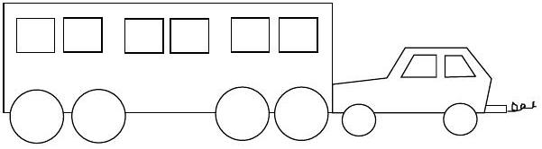
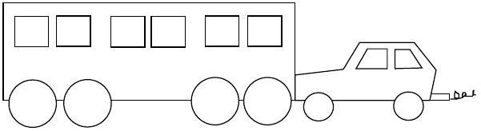
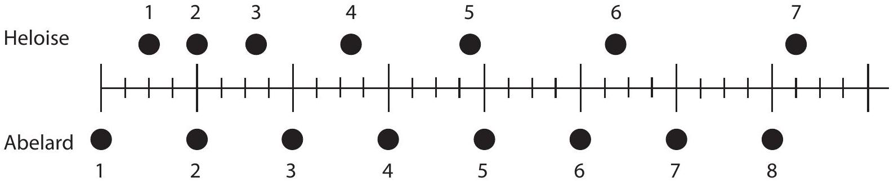
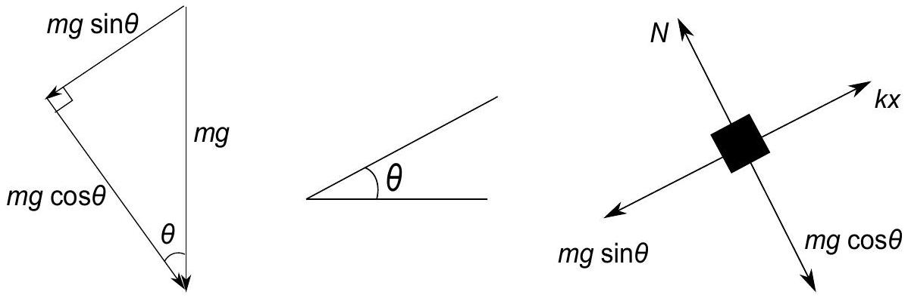
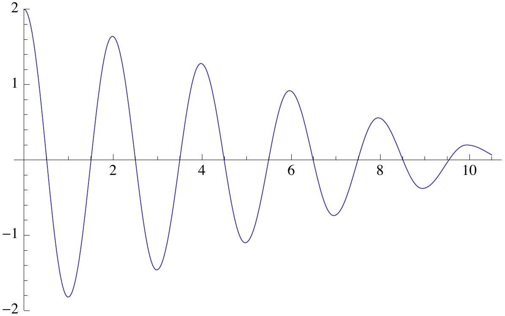
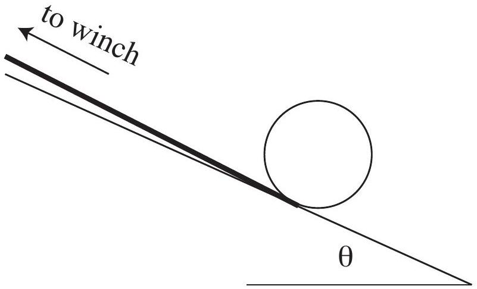
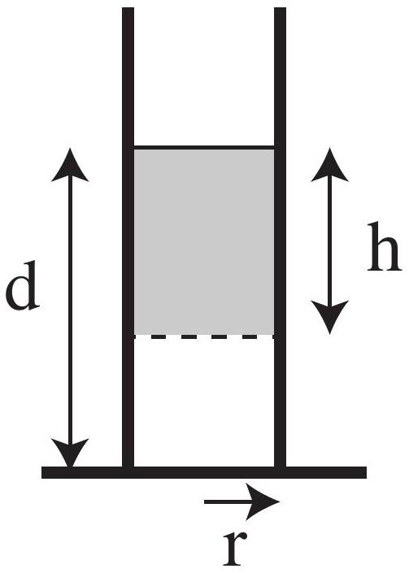
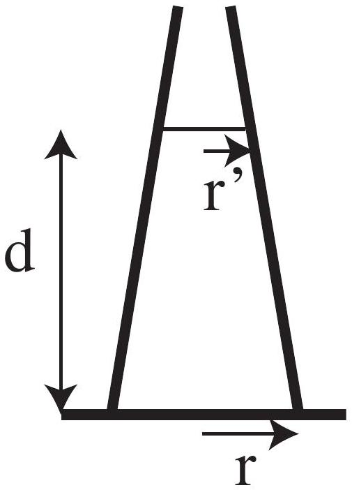
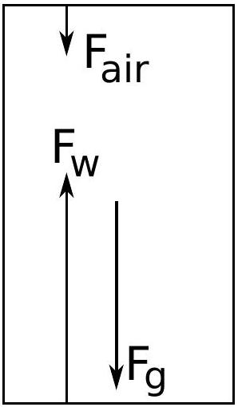

Time Allowed:
Reading Time: 10 minutes
Examination Time: 120 minutes

## INSTRUCTIONS

- Attempt ALL questions in both sections of this paper.
- Permitted materials: a non-programmable, non-graphical calculator, blue and black pens, lead pencils, an eraser and a ruler.
- Answer SECTION A on the MULTIPLE CHOICE ANSWER SHEET provided.
- Answer SECTION B in the answer booklet provided. Write in pen and use pencil only for diagrams and graphs.
- You may attempt the questions in Section B in any order. Make sure that you label which parts are for which questions.
- Do not write on this question paper. It will not be marked.
- Do not staple the multiple choice answer sheet or the writing booklet to anything. They must be returned as they are.
- Ensure that your diagrams are clear and labelled.
- All numerical answers must have correct units.
- Marks will not be deducted for incorrect answers.

## MARKS

| Section A | 10 multiple choice questions | 10 marks |
| :--- | :--- | :--- |
| Section B | 4 written answer questions | 50 marks |
|  |  | 60 marks |

## SECTION A: MULTIPLE CHOICE USE THE ANSWER SHEET PROVIDED

Question 1
A gentleman is swinging his monocle, by its attached light chain, around in a horizontal circle with constant speed. Consider the following forces:

(I) a gravitational force acting downwards
(II) a force directed inwards, towards the centre of the circle
(III) a force in the direction of motion of the monocle
(IV) a force directed outwards, away from the centre of the circle

Which of the above forces is/are acting on the monocle?

a. I only.
b. I and II.
c. I and III.
d. I, II and III.
e. I, III and IV.

Solution: (b) - The forces acting on the monocle are a gravitational attraction to the Earth, which acts downwards, and a force exerted on the monocle by the light chain, which acts along the chain towards the centre of the circle.

Question 2
The speed of light in a vacuum, $c$, depends on two fundamental constants; the permeability of free space, $\mu _ { 0 }$, and the permittivity of free space, $\varepsilon _ { 0 }$. The speed of light is related to these constants by

$$
c = \left( \mu _ { 0 } \varepsilon _ { 0 } \right) ^ { - 1 / 2 } .
$$

The SI units of $\varepsilon _ { 0 }$ are $\mathrm { N } ^ { - 1 } \mathrm { C } ^ { 2 } \mathrm {~m} ^ { - 2 }$. Recall that a force of 1 N accelerates a mass of 1 kg at $1 \mathrm {~ms} ^ { - 2 }$. The units of $\mu _ { 0 }$ are

a. $\mathrm { kg } ^ { - 1 } \mathrm {~m} ^ { - 1 } \mathrm { C } ^ { 2 }$
b. $\mathrm { kg } ^ { - 1 } \mathrm {~s} ^ { - 3 } \mathrm { C } ^ { - 2 }$
c. $\mathrm { kgms } ^ { - 4 } \mathrm { C } ^ { - 2 }$
d. $\mathrm { kgmC } ^ { - 2 }$
e. $\mathrm { kg } ^ { 2 } \mathrm {~m} ^ { 2 } \mathrm { C } ^ { - 4 }$

Solution: (d) $- \mu _ { 0 } = 1 / \left( \varepsilon _ { 0 } c ^ { 2 } \right)$ so its SI units must be $\mathrm { NC } ^ { - 2 } \mathrm {~s} ^ { 2 }$ or $\mathrm { kg } \mathrm { mC } ^ { - 2 }$.

Question 3

A heavy, decrepit bus has broken down and a small car with a public-spirited driver is pushing it to a garage. While the vehicles are speeding up to cruising speed,

a. the amount of force with which the small car pushes against the bus is equal to the amount of force with which the bus pushes back against the small car.
b. the amount of force with which the small car pushes against the bus is smaller than the amount of force with which the bus pushes back against the small car.
c. the amount of force with which the small car pushes against the bus is greater than the amount of force with which the bus pushes back against the small car.
d. the small car's engine is running so the small car pushes against the bus, but the bus's engine is not running so it can't push back against the small car.
e. neither the small car nor the bus exert any force on the other. The bus is pushed forward simply because it is in the way of the small car.

Solution: (a) - the forces are an action-reaction pair.

Question 4

A heavy, decrepit bus has broken down and a small car with a public-spirited driver is pushing it to a garage. After the vehicles have reached a constant cruising speed,

a. the amount of force with which the small car pushes against the bus is equal to the amount of force with which the bus pushes back against the small car.
b. the amount of force with which the small car pushes against the bus is smaller than the amount of force with which the bus pushes back against the small car.
c. the amount of force with which the small car pushes against the bus is greater than the amount of force with which the bus pushes back against the small car.
d. the small car's engine is running so the small car pushes against the bus, but the bus's engine is not running so it can't push back against the small car.
e. neither the small car nor the bus exert any force on the other. The bus is pushed forward simply because it is in the way of the small car.

Solution: (a) - the forces are an action-reaction pair.

Question 5
A chunky tree frog jumps from a tree in an attempt to catch a small, speedy fly. Both are in mid-air and have the same kinetic energy. Which of the following statements is true?

a. The fly has a greater speed than the tree frog.
b. The tree frog has a greater speed than the fly.
c. The fly and the tree frog have the same speed.
d. The kinetic energy cannot give information about their speeds.
e. The direction of the fly and the tree frog must be taken into account to compare their speeds.

Solution: (a) - for the same value of $m v ^ { 2 } / 2$ an object with the lesser mass has a greater speed.

Question 6
The frog and the fly are approaching each other head on in mid-air, so that their velocities are in opposite directions. The chunky tree frog sticks out his sticky tongue and grabs the light, unfortunate fly, combining the two into a single tree frog - fly object. The kinetic energies of the two creatures before the collision were equal. Which of the following statements is true in the instant after the collision?

a. The object moves in the same direction as the fly's original motion.
b. The object moves in the same direction as the tree frog's original motion.
c. The object stops dead in the air.
d. As soon as they collide they must move directly downwards.
e. It depends on how hard the tree frog grabs the fly.

Solution: (b) - for the same value of $m v ^ { 2 } / 2 = ( m v ) ^ { 2 } / 2 m$ the momentum $p = m v$ is greater for an object with greater $m$ and momentum is conserved in the collision.

Question 7
A spherical drop of mercury with charge $8 Q$ splits into eight identical spherical droplets, each with the same charge and radius. The electrostatic potential energy of a conducting sphere of radius $r$ and charge $q$ is $q ^ { 2 } / 8 \pi \varepsilon _ { 0 } r$, where $\varepsilon _ { 0 }$ is a constant. After the droplets are separated far apart so that they no longer interact, the percentage of the initial electrical energy that has been converted into other forms of energy is

a. 0\%
b. 12.5\%
c. 25\%
d. 50\%
e. 75\%

Solution: (e) - each of the eight new drops of mercury have charge $Q$ and radius half that of the original drop, so they each have 1/32nd the energy of the original drop. Together, all eight drops have one quarter of the energy of the original drop so 75\% of the initial electrical energy is converted to other forms.

Question 8
A marauding possum dislodges a tile from the roof of a single-storey house. The tile

a. reaches a maximum speed quite soon after release and then falls at a constant speed the rest of the way to the ground.
b. speeds up during its entire fall to the ground because the gravitational attraction gets considerably stronger as the brick gets closer to the Earth.
c. speeds up during its entire fall to the ground because of an almost constant force of gravity acting on it.
d. falls to the ground because of the natural tendency of all objects to rest on the surface of the Earth.
e. falls to the ground because of the combined effects of the force of gravity pushing it downward and the force of the air pushing it downward.

Solution: (c) - the gravitational field is approximately constant over the distance the tile falls, so it falls with almost constant acceleration.

Question 9
A spirit level contains a bubble in a liquid. The level is suddenly jerked forward. Relative to the spirit level and liquid, the bubble moves

a. backwards, due to its inertia.
b. backwards, due to a pressure gradient in the liquid.
c. forwards, due to its inertia.
d. forwards, due to a pressure gradient in the liquid.
e. not at all. The bubble and liquid move together.

Solution: (d) - as the spirit level is jerked forwards the liquid moves backwards relative to the spirit level due to its inertia, hence, the bubble must move forwards relative to the liquid and the sprit level. In order to accelerate the liquid there must be a pressure gradient in the liquid. It is this pressure gradient which supplies the force which moves the bubble forwards.

Question 10
The positions of two joggers, Heloise and Abelard, are shown below. The joggers are shown at successive 0.20 -second time intervals, and they are moving towards the right.

Do Heloise and Abelard ever have the same speed?

a. No.
b. Yes, at instant 2.
c. Yes. at instant 5.
d. Yes, at instants 2 and 5.
e. Yes at some time during the interval 3 to 4.

Solution: (e) - Abelard has a constant speed, before 3 Heloise is slower than Abelard, and after 4 Heloise is faster than Abelard. Hence, at some point in the interval 3 to 4 they have the same speed.

## SECTION B: WRITTEN ANSWER QUESTIONS USE THE ANSWER BOOKLET PROVIDED

Question 11
One end of a spring with spring constant $k$ is fixed at the top of a rough plane inclined at an angle $\theta$ to the horizontal. The other end is attached to a block of mass $m$ and the coefficient of kinetic friction between the block and the slope is $\mu _ { k }$. The coefficient of friction is small and the friction is a weak effect, but should be treated exactly.
a) Find the extension of the spring from its unstretched length at the position where the system is in equilibrium. You may neglect the influence of friction in this part only.
Solution: When the spring is extended a distance $x$ from its unstretched length, it provides a force $k x$ up the slope. The earth's gravitational field provides a force $m g$ directly down. The component down the plane is $m g \sin \theta$, as shown in Figure 1. Call the extension of the spring at equilibrium $x _ { e }$. A free body diagram of the block (neglecting friction) is shown in Figure 1 The nett force parallel to the plane is zero, so

$$
\begin{aligned}
k x _ { e } & = m g \sin \theta \\
x _ { e } & = \frac { m g } { k } \sin \theta
\end{aligned}
$$

Figure 1: Resolving the gravitational force parallel and perpendicular to the plane and a free body diagram of the block

b) Find the potential energy of the system as a function of the displacement from the equilibrium position.
Solution: The displacement from equilibrium $c = x _ { e } - x$. The potential energy stored in the spring is
$$
\begin{aligned}
U _ { s } & = \frac { 1 } { 2 } k x ^ { 2 } \\
& = \frac { 1 } { 2 } k \left( x _ { e } - c \right) ^ { 2 } \\
& = \frac { ( m g \sin \theta ) ^ { 2 } } { 2 k } - m g c \sin \theta + \frac { 1 } { 2 } k c ^ { 2 } .
\end{aligned}
$$
The gravitational potential energy of the block is given by $U _ { g } = m g h = m g c \sin \theta$. The total
Page 7 of 16
2011 Physics National Qualifying Examination

potential energy is the sum of the elastic and gravitational potential energies,
$$
\begin{aligned}
U & = U _ { s } + U _ { g } \\
& = \frac { 1 } { 2 } k c ^ { 2 } - m g c \sin \theta + \frac { ( m g \sin \theta ) ^ { 2 } } { 2 k } + m g c \sin \theta \\
& = \frac { 1 } { 2 } k c ^ { 2 } + \frac { ( m g \sin \theta ) ^ { 2 } } { 2 k } .
\end{aligned}
$$
If desired, the equilibrium position can be chosen to be the zero of potential energy, in which case $U = ( 1 / 2 ) k c ^ { 2 }$.
c) The spring is now displaced from its equilibrium position by a distance $c _ { 0 }$ up the plane, and released. Sketch a graph of the displacement of the mass on the spring as a function of time.
Solution:

The displacement of the mass as a function of time for $c _ { 0 } = 2$.
d) Find the difference in position along the slope between successive points where the mass is stationary and about to move down the slope, and hence determine the maximum number of such points that can occur.
Solution: Call the point at which the block is stationary and about to move up the ramp for the first time after being released $c _ { 1 }$. Note that $c _ { 1 }$ is negative because the block is below the equilibrium position. As the block slides along the plane energy is dissipated by friction; the difference in potential energy of the block at $c _ { 0 }$ and the block at $c _ { 1 }$ is equal to the work done by friction.
The frictional force is $F _ { \mu } = \mu _ { k } m g \cos \theta$, since $N = m g \cos \theta$ as the forces perpendicular to the plane are balanced. Hence,
$$
\frac { 1 } { 2 } k c _ { 0 } ^ { 2 } - \frac { 1 } { 2 } k c _ { 1 } ^ { 2 } = \left( c _ { 0 } - c _ { 1 } \right) \mu _ { k } m g \cos \theta
$$
For convenience, let $p = \frac { 2 } { k } \mu _ { k } m g \cos \theta$ so that
$$
\begin{aligned}
c _ { 0 } ^ { 2 } - c _ { 1 } ^ { 2 } & = p \left( c _ { 0 } - c _ { 1 } \right) \\
\left( c _ { 0 } - c _ { 1 } \right) \left( c _ { 0 } + c _ { 1 } \right) & = p \left( c _ { 0 } - c _ { 1 } \right) \\
c _ { 0 } + c _ { 1 } & = p .
\end{aligned}
$$

Let $c _ { 2 }$ be the next stationary point and note $c _ { 2 } > 0$. Similarly, equating the potential energy difference with the work done by friction gives $c _ { 1 } + c _ { 2 } = - p$. Adding these two relationships gives

$$
\begin{aligned}
c _ { 0 } + c _ { 1 } - \left( c _ { 1 } + c _ { 2 } \right) & = p - ( - p ) \\
c _ { 0 } - c _ { 2 } & = 2 p \\
c _ { 0 } - c _ { 2 } & = \frac { 4 \mu _ { k } m g \cos \theta } { k }
\end{aligned}
$$

As the block moves $4 \mu _ { k } m g \cos \theta / k$ closer to the equilibrium after each full oscillation, the number of times it oscillates, $n$, must satisfy $n 4 \mu _ { k } m g \cos \theta / k < c _ { 0 }$ The maximum number of stationary points where the block is about to move down the slope is, hence, the largest integer $n$ which satisfies $n < \frac { c _ { 0 } k } { 4 \mu _ { k } m g \cos \theta }$.

Question 12
An empty tin can has radius $r = 50 \pm 1 \mathrm {~mm}$, height $h = 150 \pm 1 \mathrm {~mm}$ and wall, base and lid of uniform thickness which lies within the range $s = 0.10 \pm 0.01 \mathrm {~mm}$. Wound around its circumference is a string, which is attached to a winch. The can is placed on a slope at angle $\theta$ to the horizontal so that the string runs up the slope as in figure 2. The winch has radius $r _ { w }$ and can be set to turn a fixed number of turns with a constant torque. Both the number of turns and torque can be adjusted. The torque applied by the winch is equal to the winch radius times the force applied to the winching string.

The can is initially held stationary and is then released, with the winch set to wind $n _ { t }$ turns of rope. The time taken $t$ is measured for a range of different torques, $\tau$. The force applied by the winching rope is related to the mass $m$ of the can and the acceleration $a$ of the centre of the can by

$$
F - m g \sin \theta = m a
$$

and also obeys the relationship

$$
r ^ { 2 } F = I \left( a + a _ { r } \right) ,
$$

where $a _ { r }$ is the acceleration of the rope and $I$ is a constant.

Figure 2: Tin can on a slope attached to a winch

a) Given that the density of tin is $\rho _ { \mathrm { Sn } } = 7.30 \times 10 ^ { 3 } \mathrm {~kg} \mathrm {~m} ^ { - 3 }$, find the mass of the tin can and its uncertainty. Also comment on whether you could easily determine the mass more accurately using common household devices.
Note that when two values are added or subtracted the uncertainty in the final value is the sum of the uncertainties of the two values. However, when two values are multiplied or divided the fractional uncertainty (the uncertainty divided by the value) of the product or quotient is the sum of the fractional uncertainties of the two values.
Solution: The mass of the tin can is the mass of the curved side plus the mass of each end piece,
$$
\begin{aligned}
m & = \rho _ { \mathrm { Sn } } \left( 2 \pi r h + 2 \pi r ^ { 2 } \right) s \\
& = 2 \pi \rho _ { \mathrm { Sn } } r ( h + r ) s \\
& = 0.0459 \mathrm {~kg} \quad .
\end{aligned}
$$

The uncertainty in the mass of the tin can is

$$
\begin{aligned}
\Delta m & = \left( \frac { \Delta r } { r } + \frac { \Delta ( h + r ) } { h + r } \frac { \Delta s } { s } \right) m \\
& = 0.13 m \\
& = 6 \times 10 ^ { - 3 } \mathrm {~kg}
\end{aligned}
$$

Hence, the mass of the tin can is $46 \pm 6 \mathrm {~g}$. The uncertainty in this value is greater than that which would be expected of most kitchen balances as they have uncertainties of around 1-5 g, so it would be easy and more accurate to just weigh the can using a kitchen balance.

b) Find combinations of the quantities $\tau$ and $t$ which may be plotted so that the data fall on a straight line and the unknowns $I$ and $\theta$ may be determined from the slope and y-intercept of a line of best fit.
Hint: a graph of $y$ vs. $x$ is linear if $y$ is the sum of a term proportional to $x$ and a constant.
Solution: The torque applied by the winch is equal to the winch radius times the force applied to the winching string, so
$$
\tau = r _ { w } F .
$$
The time $t$ is the time taken to wind a fixed number of turns $n _ { t }$ of the rope around the winch, starting from stationary. In time $t$ a length $2 \pi n _ { t } r _ { w }$ of rope is wound onto the winch. Since the force applied is constant the acceleration of the rope must also be constant and
$$
\frac { 1 } { 2 } a _ { r } t ^ { 2 } = 2 \pi n _ { t } r _ { w }
$$
The two equations given above can then be expressed in terms of $a , I$ and $\theta$ which are unknown and $\tau , t$, and other known quantities. This gives
$$
\tau - r _ { w } m g \sin \theta = r _ { w } m a ,
$$
and
$$
r ^ { 2 } \tau = r _ { w } I \left( a + \frac { 4 \pi n _ { t } r _ { w } } { t ^ { 2 } } \right) .
$$
Combining these two equations to eliminate $a$ gives
$$
\tau \left( 1 - \frac { r ^ { 2 } m } { I } \right) = r _ { w } m g \sin \theta - \frac { 4 \pi n _ { t } r _ { w } ^ { 2 } m } { t ^ { 2 } } .
$$
Hence a plot of $\tau$ vs. $1 / t ^ { 2 }$ is linear.
c) Find $I$ and $\theta$ in terms of the slope and y-intercept of the graph you suggested plotting in the previous part.
Solution: The slope of a graph of $\tau$ vs. $1 / t ^ { 2 }$ is
$$
m _ { \text {slope } } = \frac { 4 \pi n _ { t } r _ { w } ^ { 2 } m I } { r ^ { 2 } m - I } ,
$$
and its $y$-intercept is
$$
b = \frac { - r _ { w } m g \sin \theta } { r ^ { 2 } m - I } .
$$
Rearranging the equation for the slope gives
$$
I = \frac { m _ { \text {slope } } r ^ { 2 } m } { 4 \pi n _ { t } r _ { w } ^ { 2 } m + m _ { \text {slope } } }
$$

Substituting this result into the equation for the intercept and rearranging then gives

$$
\theta = \arcsin \left( - \frac { 4 \pi n _ { t } r _ { w } b } { m _ { \text {slope } } g } \right)
$$

Question 13
Pressure is the force per unit area exerted uniformly in all directions by a small volume of fluid on its surrounds.

Figure 3: A cylinder containing water

Figure 4: A conical flask containing water

a) Draw a free body diagram showing the forces on the shaded volume of water in figure 3 and hence find the pressure at a depth $h$ below the surface of the water.

Solution:

As the forces must balance, $F _ { \mathrm { w } } = F _ { \text {air } } + F _ { \mathrm { g } }$. We have $F _ { \mathrm { g } } = m g$ with $m = \rho \times \pi r ^ { 2 } \times h$, and $F _ { \text {air } } = P _ { \mathrm { a } } \times \pi r ^ { 2 }$. Hence $F _ { \mathrm { w } } = \left( \rho g h + P _ { \mathrm { a } } \right) \pi r ^ { 2 }$. The force $F _ { \mathrm { w } }$ must be due to the pressure of the water at height $h$ acting over the area $\pi r ^ { 2 }$. Thus

$$
P ( h ) = \rho g h + P _ { \mathrm { a } } .
$$

b) (i) What are the forces exerted by each of the flat bases of the two vessels shown above on the water in that vessel? The circular bases of the two vessels have equal radii, and both vessels are filled to the same depth.
Solution: For the cylindrical vessel, the force exerted on the water by the flat base must be equal to the force exerted on the base by the nearby water. This is given by $P ( d ) \times \pi r ^ { 2 }$, so in this case $F = \left( \rho g h + P _ { \mathrm { a } } \right) \pi r ^ { 2 }$.

For the conical vessel, we note that pressure is a local force, and so must be independent of conditions far away. Hence altering the shape of the flasks walls while keeping local conditions constant will not change the pressure locally, and so $F = \left( \rho g h + P _ { \mathrm { a } } \right) \pi r ^ { 2 }$ also holds for this flask.
(ii) For each case, is this force equal to the total force exerted by the vessel on the water it contains? Explain whether or not you expect the force exerted by the base to equal to the total force in each case, giving physical reasoning for your answer. Also explain any differences between the two cases.
Solution: For the cylindrical case, we get that the force exerted by the base on the liquid is indeed equal to the total (i.e. nett) force of entire vessel on the contained liquid. Note that there will be additional force contributions from the walls of the vessel, directed horizontally inwards, but these will all cancel.
For the conical case, the walls of the flask are exerting force downwards on the water contained within. Hence, while the upwards force exerted by the base of the conical flask is equal to that exerted by the base of the cylindrical flask, the total (nett) force exerted by the conical vessel is reduced from this value.
Physically, this is as we would expect. The mass of the water in the conical flask is less than that of the water in the cylindrical flask, and thus the cylindrical flask should exert less total force than its counterpart.

## Diverting Data:

Air pressure at sea level $p _ { 0 } = 1.02 \times 10 ^ { 5 } \mathrm {~Pa}$
Density of air at sea level $\rho _ { a } = 1.2 \mathrm {~kg} \mathrm {~m} ^ { - 3 }$
Density of water $\rho _ { w } = 1.0 \times 10 ^ { 3 } \mathrm {~kg} \mathrm {~m} ^ { - 3 }$
Acceleration due to gravity at sea level $g = 9.8 \mathrm {~m} \mathrm {~s} ^ { - 1 }$

Question 14
Argon atoms are special because they stay in the atmosphere for a very long time. They are not recycled like oxygen and nitrogen. The aim of this problem is to estimate how many of the argon atoms in each of your breaths were once in Galileo Galilei's lungs.
An average breath inhales around 0.5 L of air and people breath on average around once every five seconds. Air is about 1\% argon and has density $1.2 \mathrm {~kg} \mathrm {~m} ^ { - 3 }$. Assume all air particles have a mass of approximately $5 \times 10 ^ { - 26 } \mathrm {~kg}$. Take the atmosphere to have constant density and be around 20 km thick. The radius of the Earth is $R _ { \mathrm { E } } = 6.4 \times 10 ^ { 6 } \mathrm {~m}$.
Note: $1000 \mathrm {~L} = 1 \mathrm {~m} ^ { 3 }$
Solution Setup:
volume of each breath $V = 0.5 \mathrm {~L}$
density of air $\rho = 1.2 \mathrm {~kg} \mathrm {~m} ^ { - 3 }$
concentration of argon in air $n = 0.01$
molecular mass of argon $\mu = 5 \times 10 ^ { - 26 } \mathrm {~kg}$
lifetime of Galileo $T = 77 \mathrm { yr }$
frequency of breathing $f = 0.2 \mathrm {~s} ^ { - 1 }$
thickness of atmosphere $t = 20 \mathrm {~km}$
radius of Earth $R _ { E } = 6.4 \times 10 ^ { 6 } \mathrm {~m}$

a) Estimate the number of argon atoms inhaled with each breath.
Solution: The number of argon atoms in each breath is
$$
\begin{aligned}
N & = \frac { n \rho V } { \mu } \\
& = 1.2 \times 10 ^ { 20 }
\end{aligned}
$$
b) Estimate the total number of argon atoms that passed through Galileo's lungs in his 77 years of life. You may assume that when a person breathes, half of the argon atoms in each breath have never been in that person's lungs before.
Solution: The number of argon atoms Galileo has breathed is the number of breaths times the atoms in each breath, multiplied by half (to account for rebreathed atoms):
$$
\begin{aligned}
N _ { \text {Gal } } & = \frac { 1 } { 2 } N T f \\
& = 2.9 \times 10 ^ { 28 }
\end{aligned}
$$
c) Estimate the total number of argon atoms in the Earth's atmosphere.
Solution: The total number of argon atoms in the Earth's atmosphere is
$$
\begin{aligned}
N _ { a t m } & = \frac { n \rho \left( 4 \pi R _ { E } ^ { 2 } t \right) } { \mu } \\
& = 2.5 \times 10 ^ { 42 }
\end{aligned}
$$
d) Assuming that the argon breathed by Galileo is now mixed uniformly through the atmosphere, estimate the number of argon atoms in each of your breaths that were once in Galileo's lungs.

Solution: The fraction of argon in the atmosphere that has passed through Galileo is thus

$$
\begin{aligned}
p & = \frac { N _ { \text {Gal } } } { N _ { \text {atm } } } \\
& = 1.4 \times 10 ^ { - 14 }
\end{aligned}
$$

Thus in each breath, the number of atoms which were once in Galileo's lungs is

$$
\begin{aligned}
N ^ { \prime } & = p N \\
& = 1.2 \times 10 ^ { 6 }
\end{aligned}
$$
