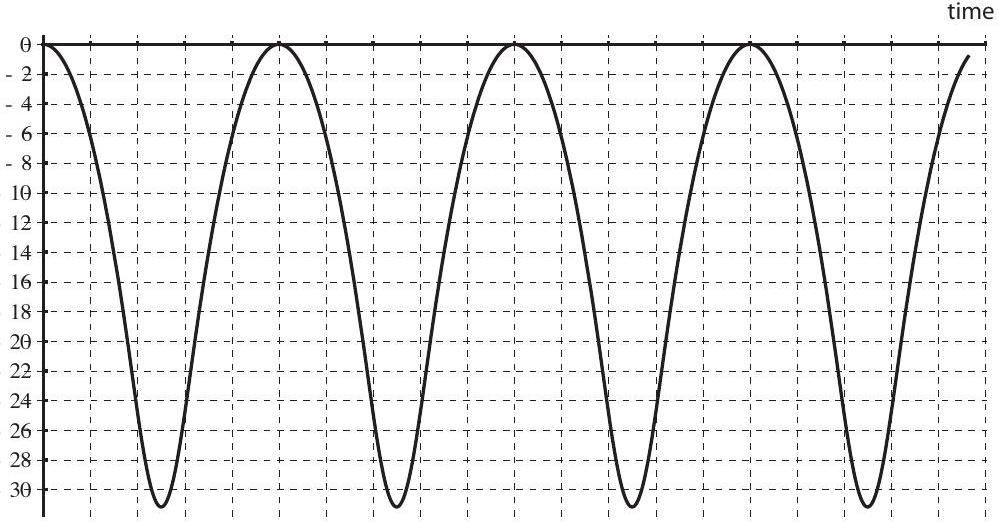
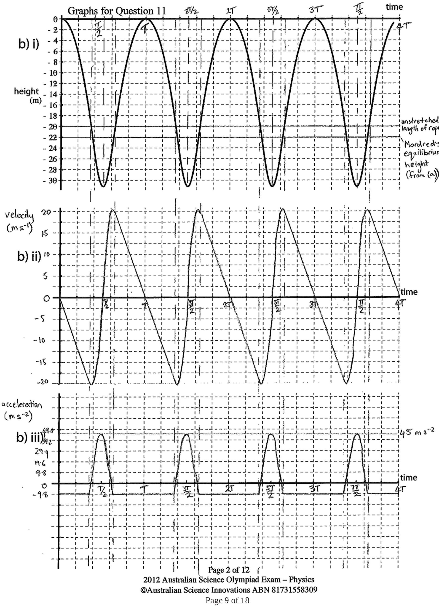
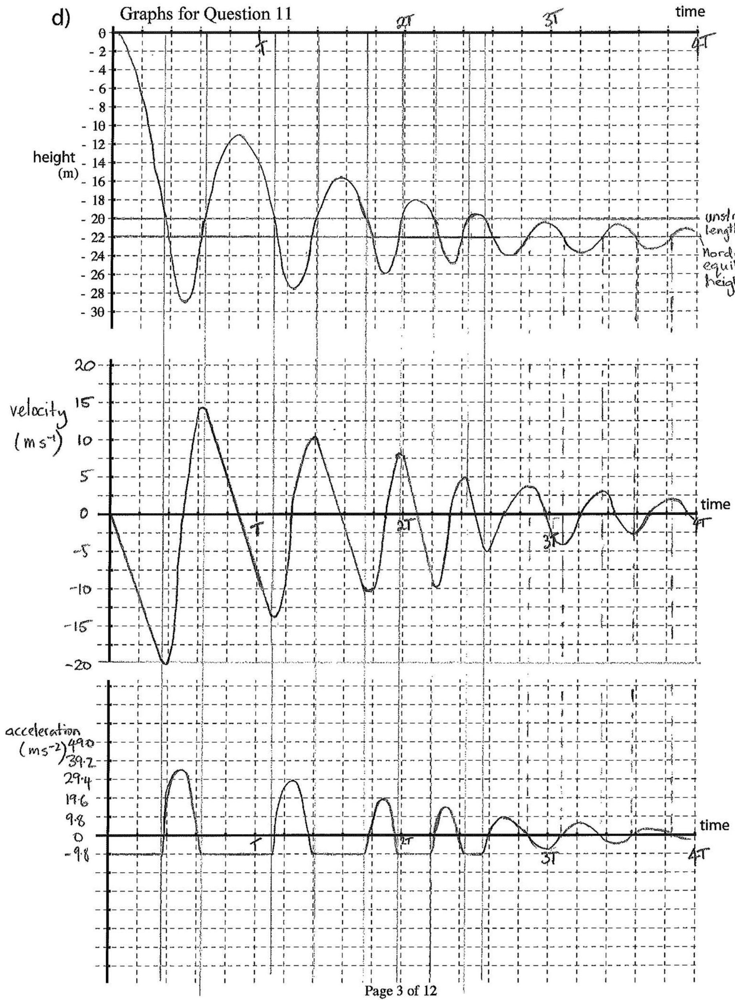

Question 11
A bungee rope has unstretched length $L = 20 \mathrm {~m}$ and spring constant $k = 245 \mathrm { Nm } ^ { - 1 }$. The spring constant is the constant of proportionality between the force exerted by the spring and its extension $x$, so $F = - k x$. The potential energy stored in the spring is $U = k x ^ { 2 } / 2$.

Mordred the bungee jumper of mass $m = 50 \mathrm {~kg}$ is tied to the bungee rope and steps off a bridge over a deep gorge. The mass of the rope is negligible compared to the mass of Mordred, and the local acceleration due to gravity is $9.8 \mathrm {~ms} ^ { - 2 }$.
a) If Mordred were lowered over the edge gently while attached to the bungee rope, how far below the platform would he hang?
Solution: The sum of the forces on Mordred must be zero for him to be at equilibrium. Applying this to the vertical direction gives

$$
\begin{aligned}
\sum F _ { y } & = 0 \\
T - m g & = 0 \\
T & = m g
\end{aligned} ,
$$

where $T = - k \Delta y$ is the restoring force exerted by the bungee rope. Hence,

$$
\begin{aligned}
\Delta y & = - \frac { m g } { k } \\
& = 2 \mathrm {~m} .
\end{aligned}
$$

Hence Mordred hangs 22 m below the platform.

Take the total potential energy of the system to be zero at this height.
If Mordred is not lowered gently, but simply steps off the platform, relying on the bungee rope to prevent him from hitting the ground, he bounces up and down as shown in the graph below.

b) i)

Height of Mordred the bungee jumper vs. time
DO NOT WRITE ANSWERS ON THIS GRAPH, THEY WILL NOT BE MARKED.
Use the copy on p. 2 of the answer booklet.
Page 7 of 18
2012 Australian Science Olympiad Exam - Physics Solutions
© Australian Science Innovations ABN 81731558309

b) Note: Use the axes supplied on p. 2 of the answer book to draw your answers to this part. DO NOT use those on p. 3, which are for part (d)
    (i) Mark the height found in part (a) and all other important points on the graph of height vs. time for Mordred the bungee jumper given on p. 2 of the answer book. The time Mordred takes to return to his initial height after stepping off the platform is $T$.
    (ii) Sketch the velocity of Mordred the bungee jumper vs. time, marking all important points and values. Use the axes below the graph for part (b)(i) on p. 2 of the answer book. Use the same scale for time as in part (b)(i).
    (iii) Sketch the acceleration of Mordred the bungee jumper vs. time, marking all important points and values. Use the axes below the graph for part (b)(ii) on p. 2 of the answer book. Use the same scale for time as in part (b)(i) and (ii).

Solution: See over the page for examples of sketches which would receive full marks. The following calculations were required to mark important points and values on the sketches. Mordred will accelerate due to gravity alone when less than 20 m below the platform, so using kinematics his velocity will increase linearly until it reaches $v _ { 20 \mathrm {~m} } = \sqrt { 2 g y } = 19.8 \mathrm {~ms} ^ { - 1 }$. Mordred's maximum speed is reached as he passes through the equilibrium position 22 m below the platform. This can be found by using conservation of energy considering the contributions of kinetic energy and gravitational and elastic potential energy as follows

$$
\begin{aligned}
E _ { \mathrm { top } } & = E _ { \mathrm { eq } } \\
0 & = \frac { 1 } { 2 } m v _ { \max } ^ { 2 } + m g y + \frac { 1 } { 2 } k ( \Delta y ) ^ { 2 } \\
v _ { \max } & = \sqrt { - m g y - k ( \Delta y ) ^ { 2 } / 2 } \\
v _ { \max } & = 20.3 \mathrm {~ms} ^ { - 1 } .
\end{aligned}
$$

Mordred's maximum acceleration occurs at his lowest height $y = 31 \mathrm {~m}$ (from the supplied graph) and is $a = k ( \Delta y ) - g = 45 \mathrm {~ms} ^ { - 2 }$ upwards.

c) How much energy was dissipated in each bounce of Mordred? Explain how you reached your conclusion.
Solution: From inspection of the supplied graph, no energy is dissipated as Mordred reaches the same height after each bounce so he must have the same amount of energy.
d) Note: Use the axes supplied on p. 3 of the answer book to draw your answers to this part. DO NOT use those on p. 2, which are for part (b).
Sketch the height, velocity and acceleration of Mordred the bungee jumper vs. time, if half the energy were dissipated in each bounce of Mordred. Use separate axes for each sketch, the same scale for time as you did in part (b), and mark all important points on your sketches.
Solution: See over two pages for examples of sketches which would receive full marks.
As Mordred reaches a lower height each bounce he spends less time with the rope slack and accelerating under gravity alone in each successive bounce.

Hint: You may need to do some calculations to find all the important points to mark on the supplied graph and your sketches.

2012 Australian Science Olympiad Exam - Physics
©Australian Science Innovations ABN 81731558309

## Marker's comments:

Most students found this question difficult. Some of the common errors are described below.

- Many students confused the concepts of elastic energy stored in the stretched bungee rope and the restoring force exerted by the stretched bungee rope.
- Students often attempted to calculate values which they could read off the supplied graph, especially the times at which Mordred reached various points in his bounces, which made the question very much harder for themselves.
- Many students did not identify the two different regimes of motion, i.e. falling freely under gravity and undergoing simple harmonic motion. When Mordred is above -20 m the rope is slack and his acceleration is the acceleration due to gravity.
- Few students reached part (d) and very few of those who did realised that the amplitude does affect the time taken for each of Mordred's bounces.
