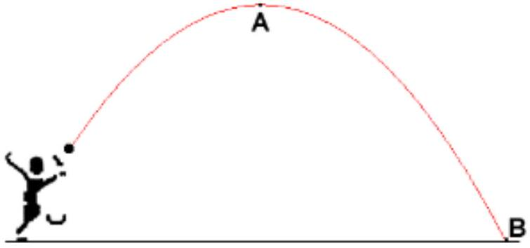

Question 9
A ball is thrown into the air and it moves in the path shown below. Ignore air resistance in this question.

At position A the ball is at the highest point in its path, position B is just before it hits the ground. Which of the following statements is true?

a. The speed of the ball at A is zero and the acceleration of the ball at B is the same as at A.
b. The speed of the ball at A is the same as the speed at B and the acceleration at B is higher than at A.
c. The speed at A is lower than the speed at B and the acceleration at A is higher than the acceleration at B.
d. The speed at A is lower than the speed at B and the acceleration at A is the same as the acceleration at B.
e. The speed at A is higher than the speed at B and the acceleration at A is the same as the acceleration at B.

Solution: d. - At all points along the path the acceleration is the constant acceleration due to gravity. At A the ball is moving horizontally but not vertically. By the time it reaches B its vertical speed is higher and its horizontal speed is the same, so its total speed is higher.
