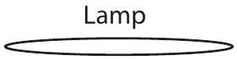
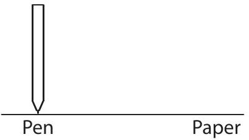
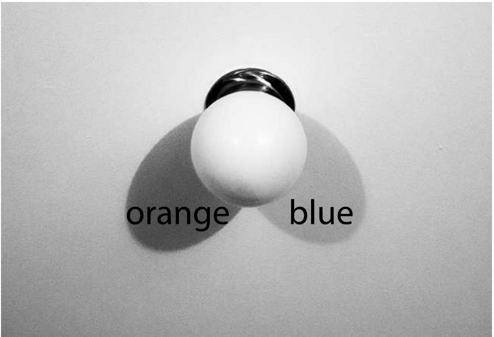
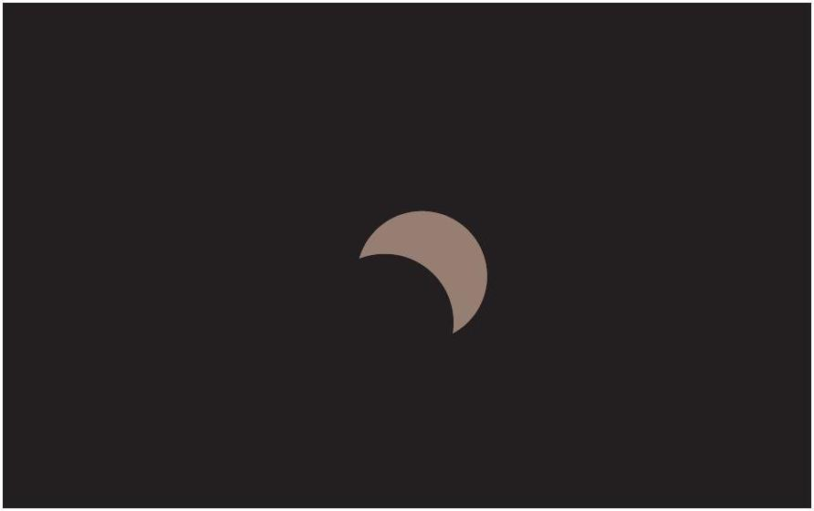
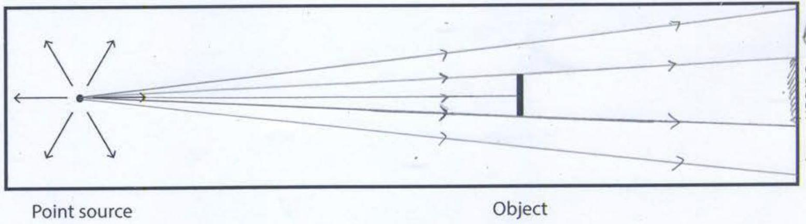
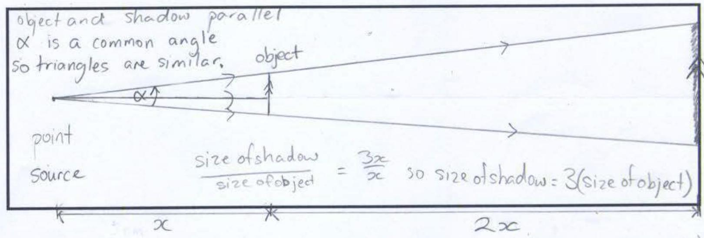
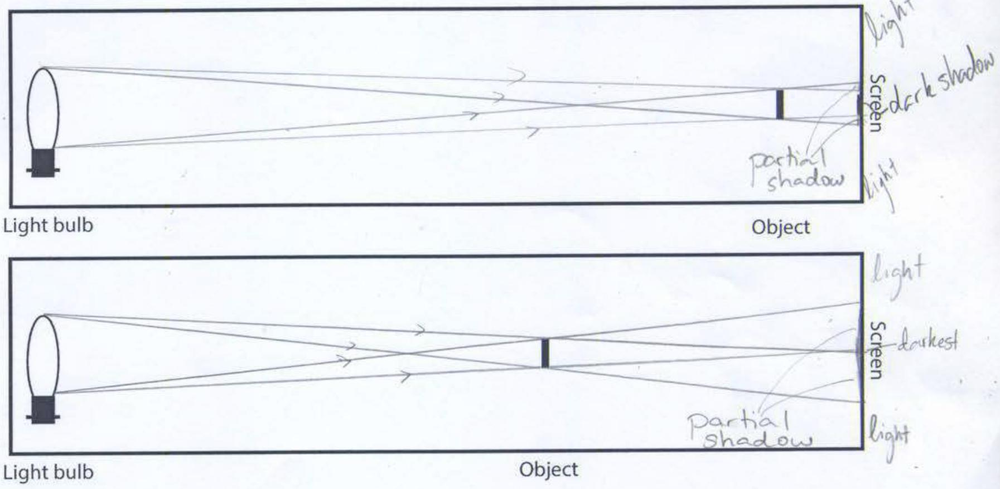
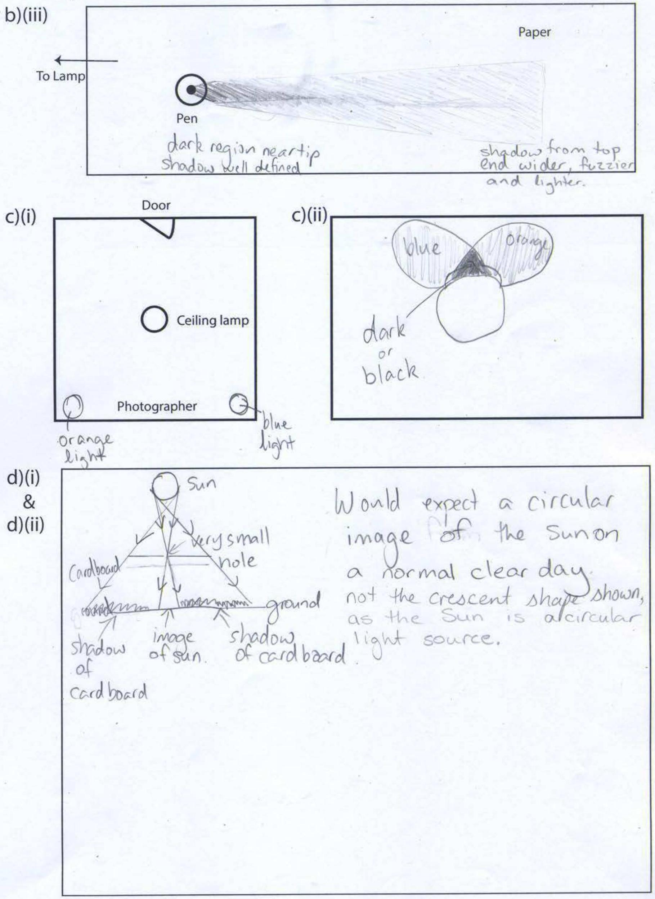

Question 11
Suggested Time: 20 min
This question explores the characteristics of shadows formed by a variety of light sources.
Throughout this question you will be asked to draw diagrams as part of your answer. Where instructed please use the boxes on pages 2-3 of the answer booklet to draw these diagrams. Label all diagrams.

a) Point light sources emit light in all directions from a single point. They have no measurable size.
    (i) In the answer box on page 2 of the answer booklet, an object is drawn in front of a point light source. In this box draw a diagram of how the shadow forms, and what the shadow looks like on the screen.
    (ii) If the object were at a distance from the light source of 1/3 the distance from the light source to the screen, how large would the shadow be compared to the object? Explain your answer using diagrams drawn in the box on page 2 of the answer booklet. Put any words needed in or near this box.
b) All real light sources, including the Sun and artificial sources, are extended sources rather than point sources. For example, at sunrise and sunset is it possible to see that the Sun is an extended source of light, circular in shape. Light is emitted in all directions from each part of an extended source.
    (i) Draw a diagram of how the shadows form and what the shadows of the object look like on the screen in front of an extended light source for the two set ups drawn in the answer box on page 2 of the answer booklet.
    (ii) Explain why shadows can be fuzzy-looking in the box on page 2 of the answer booklet.
    (iii) Given the setup below, draw the shadow of the pen on the diagram in the box on page 3 of the answer booklet.

c) Compact fluorescent light bulbs come in a range of slightly different colours. Some are described as 'cool' white and emit light which is more blue in colour, while others, described as 'warm' white, emit light of a more orange colour.
A room is lit by one or more lamps fitted with compact fluorescent bulbs. A shadow pattern forms on the ceiling near a ceiling lamp which is not turned on, as shown in the diagram below.

    (i) Mark on the floor plan on page 3 of the answer booklet the positions of any operating lamps and the colours of their bulbs.
    (ii) In the box on page 3 of the answer booklet, draw a diagram showing how the ceiling would appear from the door of the room. Indicate the colours of all regions of shadow.
d) A sheet of black cardboard with a very small round hole in its centre is held 10 cm above a white paved area outside at noon under a clear sky, and the image below is observed.

    (i) Draw diagrams to explain how this image is formed in the box on page 3 of the answer booklet.
    (ii) Would you expect to see the same thing on most other clear days? Explain why or why not in the box on page 3 of the answer booklet.

Solution:
Question 11

a) (i)

light nañ shadow light
a) (ii)

b) (i)

b) (ii)
When the light source is extended there are regions of partial shadow at the edges of the shadow. These partial shadow regions make the shadows look fuzzy.

Question 11

## Marker's comments:

a) Most students were able to draw the first diagram correctly but many had difficulty with the logic in part (ii).
b) Many students had difficulties in identifying the regions where the partial shadow began and ended. Especially in part (i) it was clear that many students were not drawing accurate diagrams. While most students were able to give at least a partial explanation for (ii) they were not able to use their understanding to draw a reasonable diagram for (iii). A range of answers were accepted for (iii) as long as they were consistent with the diagram in the question and self-consistent full marks were awarded.
c) Students had difficulty with the idea that a blue shadow meant that there must be a source of blue light illuminating that region. In part (ii) many students did not realise that there would be a region of overlap between the two shadows.
d) Many students focussed their answers on why the image had a crescent shape rather than how the image was formed. All the explanation required was that the image was an image of the Sun and a statement that the sun is usually a circular source of light.
