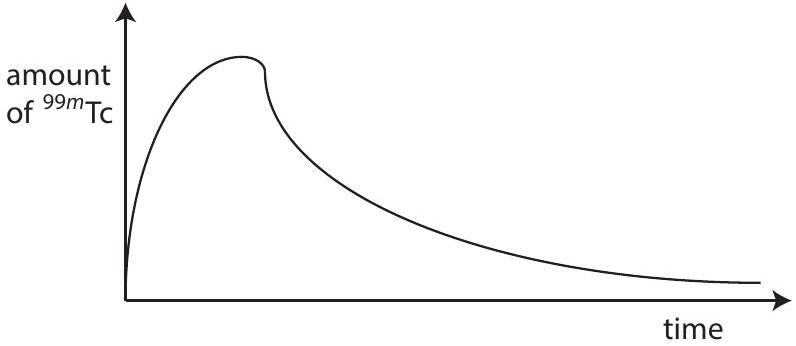

Question 12
Suggested Time: 20 min
Some elements have radioactive isotopes (radioisotopes) which can be used for medical imaging. A radioisotope is injected into the bloodstream, whence it is taken up by organs in the body. Areas of extremely high cell growth or repair such as tumours take up and retain this isotope much more efficiently than any other tissue. Thus imaging using radioisotopes can be used to indicate malignant tissue growth. Technetium-99m $\left( { } ^ { 99 m } \mathrm { Tc } \right)$ is one such radioisotope, which is used for imaging organs such as the thyroid, liver, kidneys, and brain. The half-life, the interval during which the number of atoms left of a radioisotope halves, of ${ } ^ { 99 m } \mathrm { Tc }$ is $\tau _ { 1 / 2 } = 6.01$ hours.

Rates of radioactivity can be measured in Curies (Ci), equivalent to $3.7 \times 10 ^ { 10 }$ decays per second. For any radioisotope, the number of atoms, half-life and radioactivity are related by the formula

$$
( \text { number of atoms } ) = \frac { 1 } { \ln 2 } ( \text { half-life in seconds } ) \times ( \text { activity in decays per second } ) .
$$

In this question, we examine a model of the process of ${ } ^ { 99 m } \mathrm { Tc }$ uptake in a patient's cancerous thyroid glands. The patient is an otherwise healthy adult. In this model, $A = 10.0 \mathrm { mCi }$ of ${ } ^ { 99 m } \mathrm { Tc }$ is injected into a vein in the patient's arm of radius $r _ { a } = 1.00 \mathrm {~mm}$, enters the bloodstream, then enters each thyroid gland through an artery in the patient's neck of radius $r _ { n } = 1.70 \mathrm {~mm}$.

Let the velocities of blood flow in the patient's arm and neck be $v _ { a } = 3.00 \mathrm {~mm} / \mathrm { s }$ and $v _ { n } = 40.0 \mathrm {~cm} / \mathrm { s }$. Let the total blood volume of the patient be $V = 5 \mathrm {~L} = 5 \times 10 ^ { - 3 } \mathrm {~m} ^ { 3 }$, and let each thyroid gland (there are two) have volume $V _ { \mathrm { t } } = 9 \mathrm {~mL}$. The ${ } ^ { 99 m } \mathrm { Tc }$ emits gamma rays of energy $E = 2.24 \times 10 ^ { - 14 } \mathrm {~J}$. Give your answers both as formulae and numerically where applicable.

a) What is the concentration (in number of atoms per litre) of ${ } ^ { 99 m } \mathrm { Tc }$ in the bloodstream after the injection?
Solution: The concentration is $N / V = a \tau _ { 1 / 2 } / ( V \ln 2 ) = 2.31 \times 10 ^ { 12 }$ atoms $/ \mathrm { L }$
b) Qualitatively, sketch the amount of ${ } ^ { 99 m } \mathrm { Tc }$ in the thyroid as a function of time, starting from the time of injection.
Solution:

c) The continuity equation in fluid mechanics states that the volume flow rate of fluid flowing through a pipe is constant. Consider the blood flow in the arm and neck of the patient - does the continuity equation hold in this model? Justify your answer with calculations, and use your knowledge of the body to explain why you would expect this result.
Solution: The flow rate through a circular pipe is $\pi r ^ { 2 } v$. The flow rate in the neck, $\approx 1.2 \times 10 ^ { - 6 } \mathrm {~m} ^ { 3 } / \mathrm { s }$, is much greater than the flow rate in the arm, $\approx 3.0 \times 10 ^ { - 9 } \mathrm {~m} ^ { 3 } / \mathrm { s }$ so the continuity equation does not hold. As the systems of blood vessels is complex with many different vessels connected meaning that the vein in the arm and the artery in the neck are not part of the

same continuous pipe this continuity equation would net be expected to hold.

d) What is the initial rate of energy release due to gamma radiation emitted from a thyroid gland? In this and subsequent parts you may neglect the time taken for the thyroid glands to saturate with ${ } ^ { 99 m } \mathrm { Tc }$.
Solution: The initial rate is $- \Delta E / \Delta t = E A = 8.30 \times 10 ^ { 6 } \mathrm {~J} \mathrm {~s} ^ { - 1 }$
e) A scan is taken over $t _ { s } = 10.0$ minutes. If the total energy detected by the scanner exceeds $E _ { \text {min } } = 5 \times 10 ^ { - 4 } \mathrm {~J}$, an image appears due to radioactivity in a thyroid gland. Approximately how much time will elapse before radioactivity is no longer detected in a scan?
Solution: It is reasonable to treat the activity as constant over the 10 minutes required for a scan as this is much shorter than one half-life. In the first ten minutes the energy released is $5.0 \times 10 ^ { - 3 } \mathrm {~J}$ which is 10.0 times the lower limit. In three half-lives, i.e. 18 hours, the level will reach 1.25 times the minimum, and after a fourth half-life the level will be 0.75 times the minimum. Hence the time will be around 20-21 hours.
Solving exactly by knowing that the decay is exponential gives
$$
t = \frac { \tau _ { 1 / 2 } } { \ln 2 } \ln \left( \frac { E A t _ { s } } { E _ { \min } } \right) = 20 \text { hours }
$$

Marker's comments:

a) Many students did not know the meaning of the prefix milli.
Some students used $3.7 \times 10 ^ { 10 }$ decays per second as the activity in decays per second because they had the same units.
b) Most students sketched either the decreasing part of the curve or the increasing one but not both.
c) Many students did not understand that the product $\pi r ^ { 2 } v$ was required to be constant by the continuity equation, not both $r$ and $v$. Also students were incorrectly stating that because the vessels could change in radius due to contracting, dilating or being blocked with fat the continuity equation could not hold.
d) Done relatively well.
e) Most students did not realise that the energy detected in the scan was the cumulative energy released over the duration of the scan. Those who did realise this also realised that the activity is approximately constant over the duration of a scan.
