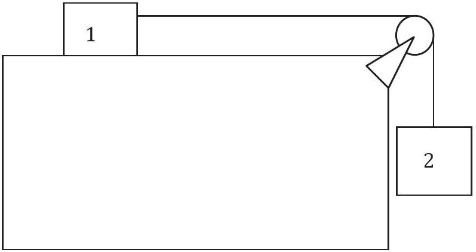

Question 6
Two blocks are connected as shown. Block 1 has mass 5 kg and is on a frictionless, horizontal surface. Block 2 has mass 8 kg and is attached to block 1 by a rope with negligible mass, passing over a frictionless pulley. What is the acceleration of block 2?

a. $15.9 \mathrm {~m} \mathrm {~s} ^ { - 2 }$
b. $9.8 \mathrm {~m} \mathrm {~s} ^ { - 2 }$
c. $6.0 \mathrm {~m} \mathrm {~s} ^ { - 2 }$
d. $3.8 \mathrm {~m} \mathrm {~s} ^ { - 2 }$
e. $0 \mathrm {~m} \mathrm {~s} ^ { - 2 }$

Solution: c. the total force on the system is $m _ { 1 } g$ which results in an acceleration of $m _ { 1 } g / \left( m _ { 1 } + m _ { 2 } \right) = 6.0 \mathrm {~m} \mathrm {~s} ^ { - 2 }$.
