Time Allowed:
Reading Time: 10 minutes
Examination Time: 120 minutes

## INSTRUCTIONS

- Attempt ALL questions in both sections of this paper.
- Permitted materials: a non-programmable, non-graphical calculator, blue and black pens, lead pencils, an eraser, and a ruler.
- Answer SECTION A on the MULTIPLE CHOICE ANSWER SHEET provided.
- Answer SECTION B in the answer booklet provided. Write your answers to each question on the pages indicated. If you need additional space use the spare pages at the back of the booklet. Write in pen and use pencil only for diagrams and graphs.
- You may attempt the questions in Section B in any order. Make sure that you label which parts are for which questions.
- Do not write on this question paper. It will not be marked.
- Do not staple the multiple choice answer sheet or the writing booklet to anything. They must be returned as they are.
- Ensure that your diagrams are clear and labelled.
- All numerical answers must have correct units.
- Marks will not be deducted for incorrect answers.

## MARKS

| Section A | 10 multiple choice questions | 10 marks |
| :--- | :--- | :--- |
| Section B | 4 written answer questions | 50 marks |
|  |  | 60 marks |

## SECTION A: MULTIPLE CHOICE USE THE ANSWER SHEET PROVIDED

Throughout, take the acceleration due to gravity to be $9.8 \mathrm {~ms} ^ { - 2 }$.

Question 1
A cricketer leaps into the air and catches a ball while both are in mid air. Which of the cricketer or the ball undergoes the smaller change in momentum?

a. The cricketer does.
b. The ball does.
c. The change in momentum is the same for both the cricketer and the ball.
d. You can't tell without knowing the final velocity of the combined cricketer-ball mass.
e. The result depends on the energy absorbed by the cricketer's hands while catching the ball.

Solution: c. Momentum is conserved in the collision so the changes in momentum of the cricketer and the ball are equal in magnitude.

Question 2
Just before the cricketer caught the ball her kinetic energy was the same as the ball's kinetic energy. Just before the cricketer catches the ball, which of the following statements is true?

a. The ball has a greater speed than the cricketer.
b. The cricketer has a greater speed than the ball.
c. The cricketer and the ball have the same speed.
d. The kinetic energy cannot give information about their speeds.
e. The directions of the cricketer and the ball must be taken into account to compare their speeds.

Solution: a. The ball has a lower mass than the cricketer and they have the same kinetic energy $K = m v ^ { 2 } / 2$. Hence, the ball must have a greater speed than the cricketer.

Question 3
Tara likes playing with bubbles and watching the bright colours in them change. She notices that bubbles which have dark patches pop sooner than those with no dark patches. She concludes that dark patches cause bubbles to pop. Which of the following is the best statement of the flaw in Tara's argument?

a. It ignores the effects of bubbles colliding with other objects.
b. It assumes that because dark patches occur just before popping, dark spots cause popping.
c. It ignores the fact that some bubbles pop when there are no dark patches.
d. It ignores the effects of other colours on whether bubbles pop.
e. There is no flaw in Tara's argument. Dark patches cause popping.

Solution: b. Tara has noticed a correlation between dark patches and popping but she has no reason to believe that dark patches cause popping. The flaw in her argument is the assumption that dark patches cause the popping.

Question 4
A large truck breaks down on the freeway and receives a push to the nearest exit by a small car as shown below.
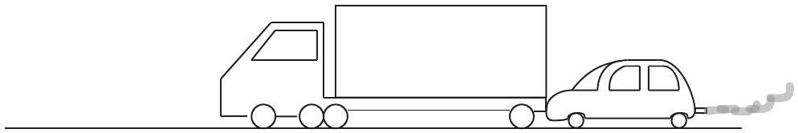

While the car, still pushing the truck, is speeding up to get to cruising speed

a. the amount of force with which the car pushes on the truck is equal to that with which the truck pushes back on the car.
b. the amount of force with which the car pushes on the truck is smaller than that with which the truck pushes back on the car.
c. the amount of force with which the car pushes on the truck is greater than that with which the truck pushes back on the car.
d. the car's engine is running so the car pushes against the truck, but the truck's engine is not running so the truck cannot push back against the car. The truck is pushed forward simply because it is in the way of the car.
e. neither the car nor the truck exert any force on the other. The truck is pushed forward simply because it is in the way of the car.

Solution: a. The two forces are an action reaction pair.

Question 5
An elevator is being lifted up an elevator shaft at a constant speed by a steel cable as shown in the figure below. All frictional effects are negligible. In this situation, the forces on the elevator are such that:

a. the upwards force of the cable is greater than the downward force of gravity.
b. the upward force of the cable is equal to the downward force of gravity.
c. the upward force of the cable is smaller than the downward force of gravity.
d. the upward force of the cable is greater than the sum of the downward force of gravity and a downward force due to air.
e. none of the above. (The elevator goes up because the cable is being shortened, not because an upwards force is exerted on the elevator by the cable.)

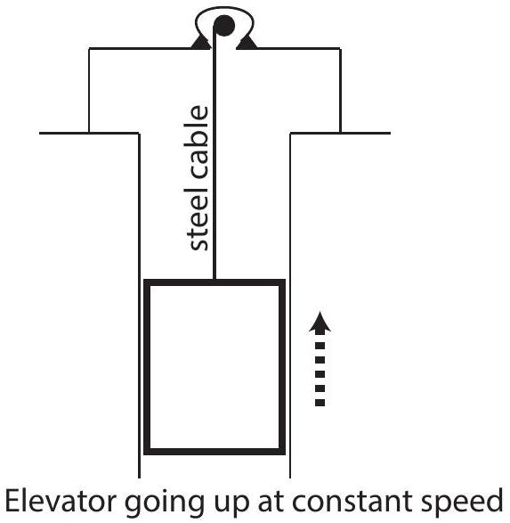

Solution: $b$. The elevator is moving with constant speed so its acceleration is zero and the total force acting on it is also zero. Hence, the upwards and downwards forces on the elevator are equal in magnitude.

Question 6
A donkey pulls a wooden box along rough flat ground at a constant speed by means of a force $\vec { P }$ (magnitude $P$ ) as shown. In the diagram, $f$ is the magnitude of the frictional force, $N$ is the magnitude of the normal force, and $F _ { g }$ is the magnitude of the force of gravity. Which of the following options must be true?
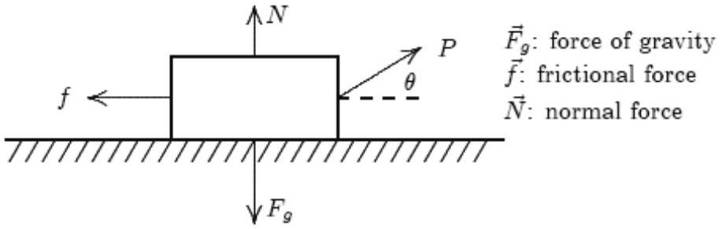

a. $P = f$ and $N = F _ { g }$
b. $P = f$ and $N > F _ { g }$
c. $P > f$ and $N < F _ { g }$
d. $P > f$ and $N = F _ { g }$
e. none of these.

Solution: c. As the speed in constant the acceleration is zero and the total force must also be zero. For the horizontal component of the total force to be zero $f$ must be less than $P$ as $\vec { P }$ is directed somewhat upwards. As $\vec { P }$ also has a vertical component upwards $N < F _ { g }$ for the sum of the vertical components of forces to be zero.

Question 7
The donkey of Question 6 now pulls harder and doubles the magnitude of the force $P$. Which of the following options must be true?

a. $F _ { g }$ and $N$ remain constant but $f$ increases to counter the increase in $P$.
b. $F _ { g } , N$ and $f$ all remain constant despite the increase in $P$.
c. $F _ { g }$ and $f$ remain constant but $N$ decreases due to the increase in $P$.
d. $F _ { g }$ remains constant but $N$ and hence $f$ decrease due to the increase in $P$.
e. none of these.

Solution: d. $F _ { g }$ is force of gravity and so is not changed by a change in the force $P$. As the vertical component of the force $P$ has increased $N$ must decrease so that the total force in the vertical direction is still zero. This decrease in $N$ results in a proportional decrease in the frictional force $f$.

## Question 8

The positions of two runners, Helen and Con, are shown below. The runners are shown at successive 0.20 second intervals, and they are moving towards the right.
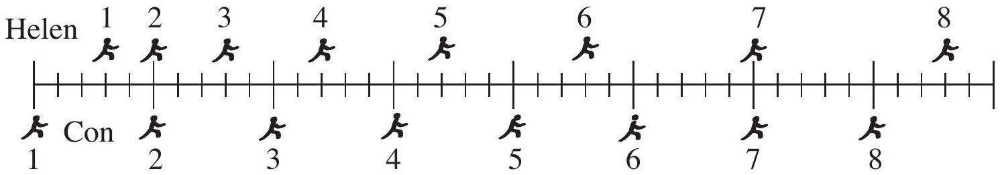

Do Helen and Con ever have the same speed?

a. No.
b. Yes, at instant 2.
c. Yes, at instant 7.
d. Yes, at instants 2 and 7.
e. Yes, at some time during the interval 4 to 5.

Solution: e. Con's travels the same distance as Helen in the interval 4 to 5 . This means that their average speeds are the same in this interval. As Con's speed is constant and Helen's speed is increasing this means that at some point in the interval Helen's and Con's speeds much be equal.

## Question 9

The positions of two runners, Helen and Con, are shown below. The runners are shown at successive 0.20 second intervals, and they are moving towards the right.
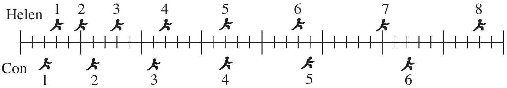

Which of the following statements best describes how the accelerations of the runners are related.

a. The acceleration of Con in greater than the acceleration of Helen.
b. The acceleration of Helen is greater than the acceleration of Con.
c. The accelerations of Helen and Con are equal. Both accelerations are equal to zero.
d. The accelerations of Helen and Con are equal. Both accelerations are greater than zero.
e. Not enough information is given to answer the question.

Solution: d. From one interval to the next both Helen and Con move one mark further than in the previous interval, this means that they both increase in speed at the same rate. Hence, they have equal accelerations which are greater than zero.

Question 10
Which of the following is the best estimate of the volume of an orange.

a. $3 \times 10 ^ { - 5 } \mathrm {~m} ^ { 3 }$
b. $3 \times 10 ^ { - 4 } \mathrm {~m} ^ { 3 }$
c. $3 \times 10 ^ { - 3 } \mathrm {~m} ^ { 3 }$
d. $3 \times 10 ^ { - 2 } \mathrm {~m} ^ { 3 }$
e. $3 \times 10 ^ { - 1 } \mathrm {~m} ^ { 3 }$

Solution: b. An orange has a volume of around $300 \mathrm {~mL} = 3 \times 10 ^ { - 4 } \mathrm {~m} ^ { 3 }$. This can be seen by comparing the volume of an orange to e.g., a can of soft drink.

## SECTION B: WRITTEN ANSWER QUESTIONS USE THE ANSWER BOOKLET PROVIDED

Note: Suggested times are given for section B as a general guide only. You may take more or less time on any question - everyone is different.

Question 11
Suggested Time: 35 min
Maria is a connoisseur of fine teas. She is preparing her new tea with boiling water in her cylindrical mug with inner radius $r = 4 \mathrm {~cm}$ and height $h = 10 \mathrm {~cm}$. Her mug has a lid for better insulation.

In a short time $\Delta t$ the amount of heat which flows out of the tea is given by

$$
\begin{equation*}
\Delta Q = \frac { \kappa S \left( T _ { \mathrm { tea } } - T _ { \mathrm { room } } \right) } { d } \Delta t \tag{1}
\end{equation*}
$$

where $S$ in the inner surface area of the mug and $d = 5 \mathrm {~mm}$ is the thickness of the mug walls.
As heat flows from the tea the change in its temperature $\Delta T$ given by

$$
\begin{equation*}
\Delta Q = m \cdot c \cdot \Delta T \tag{2}
\end{equation*}
$$

where $m$ is the mass of the water.
Data

Temperature of boiling water: $T _ { \text {boil } } = 100 ^ { \circ } \mathrm { C }$
Thermal conductivity of mug: $\kappa = 1.0 \mathrm {~W} \mathrm {~m} ^ { - 1 } \mathrm {~K} ^ { - 1 }$
Room temperature: $T _ { \text {room } } = 25 { } ^ { \circ } \mathrm { C }$
Density of water: $\rho = 1000 \mathrm {~kg} \mathrm {~m} ^ { - 3 }$
Specific heat capacity of water: $c = 4180 \mathrm {~J} \mathrm {~kg} ^ { - 1 } \mathrm {~K} ^ { - 1 }$
Maria pours her tea, filling her mug completely, and immediately places the lid on her mug.

a) (i) Find the temperature $T _ { 30 }$ of Maria's tea after 30 seconds have elapsed and fill in the first line of the table on p. 2 of the Answer Booklet.
    (ii) Complete the rest of the table on p. 2 of the Answer Booklet.
Hint: use your answers from one line to help you with the next line.
    (iii) Plot a graph of $T _ { \text {tea } }$ vs. time on p. 3 of the Answer Booklet. Include times from 0 s up to and including 5 min.
b) Find the time it takes Maria's tea to reach $55 ^ { \circ } \mathrm { C }$.
Solution: Maria's mug has a surface area of $S = 2 \pi r ^ { 2 } + 2 \pi r h = 350 \mathrm {~cm} ^ { 2 }$, which includes the area of both the bottom and the lid. The contents have a mass of $m = \rho \pi r ^ { 2 } h = 0.50 \mathrm {~kg}$.
Equating the two expressions given for $\Delta Q$ in equations (1) and (2) gives,
$$
m c \Delta T = \frac { \kappa S \left( T _ { \mathrm { tea } } - T _ { \mathrm { room } } \right) } { d } \Delta t .
$$
Rearranging and then substituting the values for the constants gives
$$
\begin{aligned}
\Delta T & = \frac { \kappa S \left( T _ { \mathrm { tea } } - T _ { \mathrm { room } } \right) } { m c d } \Delta t \\
& = 0.10 \left( T _ { \mathrm { tea } } - T _ { \mathrm { room } } \right)
\end{aligned}
$$
Page 8 of 20
2014 Physics Australian Science Olympiads Examination

The formula above is then used to evaluate the temperatures required to fill in the table below.

| Time after pouring | Initial $T _ { \text {tea } }$ (°C) | Temperature change in 30 s (°C) | Final $T _ { \text {tea } }$ (°C) |
| :--- | :--- | :--- | :--- |
| 0 s | 100 | 7.5 | 92.5 |
| 30 s | 92.5 | 6.8 | 85.7 |
| 1 min | 85.7 | 6.1 | 79.6 |
| 1 min 30 s | 79.6 | 5.5 | 74.1 |
| 2 min | 74.1 | 4.9 | 69.2 |
| $2 \min 30$ s | 69.2 | 4.4 | 64.8 |
| 3 min | 64.8 | 4.0 | 60.8 |
| 3 min 30 s | 60.8 | 3.6 | 57.2 |
| 4 min | 57.2 | 3.2 | 54.0 |
| 4 min 30 s | 54.0 | 2.9 | 51.1 |

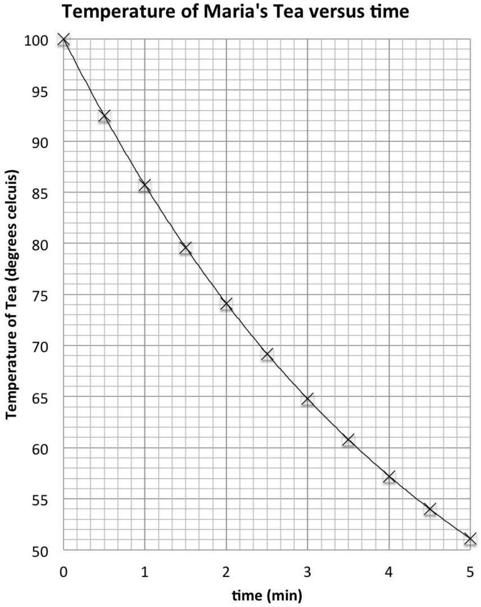

By fitting a curve through the data points and then reading the time at which the temperature of the tea reaches $55 ^ { \circ } \mathrm { C }$ it is found that it takes around 4 min 20 s to cool to 55 °C.
c) Maria decides to reheat her tea from 55 °C to 70°C with a small 1.1 kW heater she places into the tea. How long will it take the tea to reach $70 ^ { \circ } \mathrm { C }$ ? You may neglect the heat flow out of the tea.
Solution: The heater provides the power to heat the tea. $P = \frac { Q } { t }$ so $t = \frac { P } { Q }$. The heat required for the tea to reach $70 ^ { \circ } \mathrm { C }$ is $Q = m c \Delta T$ so that
$$
\begin{aligned}
t & = \frac { P } { m c \Delta T } \\
& = 28.7 \mathrm {~s}
\end{aligned}
$$

d) Estimate the size of the error in your answer to part (c) due to neglecting heat flow out of the tea. Use your estimate to comment on whether your answer to part (c) is reasonable.
Solution: Over 30 s when the tea is at a temperature of 70°C it cools by around 4°C which is around a quarter of the 15°C increase which is desired. This suggests that the heating may take one quarter longer, so the answer is probably around 7 s shorter than is reasonable. This effect will significantly affect the time it takes to heat the tea.

Marker's comments:

a) Many students attempted this part of the question. Many students had difficulty in finding the expression to calculate the change in the temperature. Common difficulties included forgetting to include the area of the top or bottom of the mug in its surface area.
b) This part was generally completed well by students who had drawn a graph.
c) Few students realised that this part of the question could be completed independently of the pervious parts.
d) Students found this part of the question more difficult to answer clearly.

Question 12
Suggested Time: 30 min
A block of mass $m$ sits against an unextended spring with spring constant $k _ { 1 }$ on a frictionless surface as shown below. A short distance beyond the mass, there is a vertical cliff of height $h$ that drops off to a rough surface with kinetic friction coefficient $\mu _ { k }$.
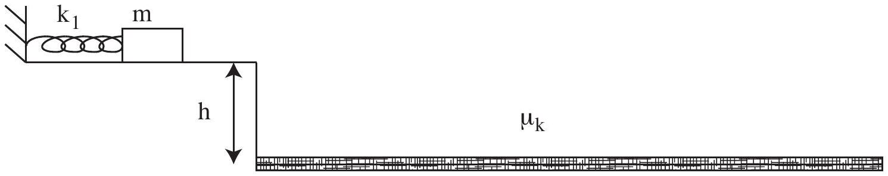
When compressed or extended, the spring exerts a restoring force

$$
F = - k x ,
$$

where $k$ is the spring constant and $x$ is the change in length of the spring. The elastic potential energy stored in the spring during this deformation is given by

$$
U = \frac { 1 } { 2 } k x ^ { 2 } .
$$

The block is pushed against the spring with displacement $x _ { 1 }$ and then released at time $t = 0$.

a) What is the velocity of the block immediately after it loses contact with the spring?
Solution: Applying the principle of conservation of energy
$$
\begin{aligned}
E _ { \text {before } } & = E _ { \text {after } } \\
\frac { 1 } { 2 } k _ { 1 } x _ { 1 } ^ { 2 } & = \frac { 1 } { 2 } m v ^ { 2 } \\
\frac { k _ { 1 } x _ { 1 } ^ { 2 } } { m } & = v ^ { 2 } \\
v & = \sqrt { \frac { k _ { 1 } } { m } } x _ { 1 }
\end{aligned}
$$
b) After reaching the cliff, the block continues to move through the air until it hits the rough surface below. Once it hits the rough surface, a frictional force acts against the horizontal motion of the block.
On the axes given on p. 4 of the Answer Booklet sketch as functions of time, starting when the block is released and ending when the block is at rest again, the
    (i) kinetic energy,
    (ii) gravitational potential energy, and
    (iii) elastic potential energy.

Use the same axes for all three sketches and label each line clearly.

Solution:
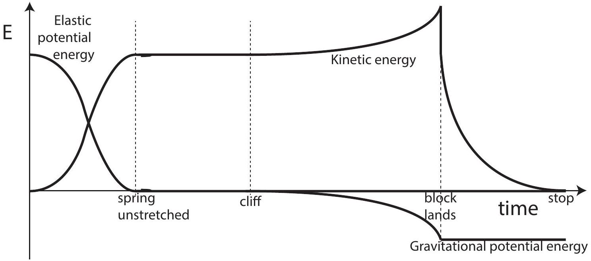

c) A section of the rough ground a distance $d$ from the cliff is made smooth (frictionless) and a second spring, with constant $k _ { 2 } = 2 k _ { 1 }$ is placed on it, as shown below.
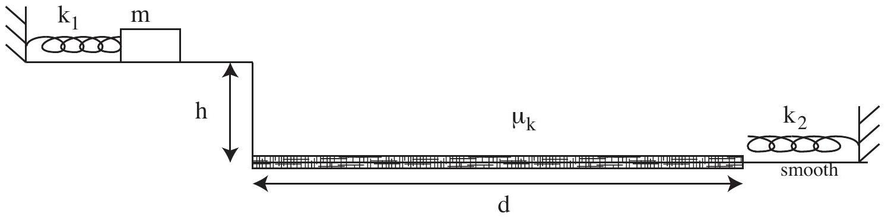
    (i) On the axes on p. 5 of the Answer Booklet, sketch the maximum compression of the new spring as a function of the maximum compression of the launching spring. Only consider compressions causing the block to land before the second spring.
Solution:
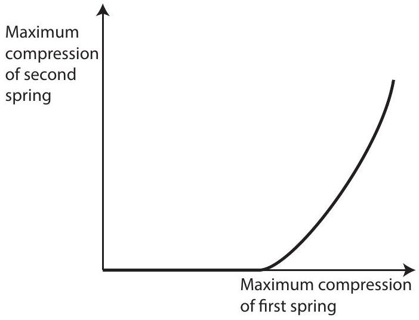
    (ii) Find an expression for the largest possible maximum compression of the second spring that you marked on your sketch for part (c)(i).
Solution: The time it takes the block to fall is related to the height of the cliff by $h = \frac { 1 } { 2 } g t ^ { 2 }$ which implies that $t = \sqrt { 2 h / g }$.

For the compression of the second spring to be maximum the range of the block must land a distance $d$ from the end of the cliff. Hence,

$$
\begin{aligned}
v _ { x } t & = d \\
v _ { x } & = \frac { d } { t }
\end{aligned}
$$

.
The vertical component of the velocity of the block does not contribute to its energy after landing. Applying the principle of conservation of energy

$$
\begin{aligned}
\frac { 1 } { 2 } k _ { 2 } x _ { 2 \max } ^ { 2 } & = \frac { 1 } { 2 } m v _ { x } ^ { 2 } \\
& = \frac { 1 } { 2 } m \left( \frac { d } { t } \right) ^ { 2 } \\
& = \frac { 1 } { 2 } \frac { m d ^ { 2 } g } { 2 h } \\
\frac { 1 } { 2 } k _ { 2 } x _ { 2 \max } ^ { 2 } & = \frac { m g d ^ { 2 } } { 4 h }
\end{aligned}
$$

Rearranging the equation to find the maximum compression gives

$$
x _ { 2 \max } = \sqrt { \frac { m g } { 2 k _ { 2 } h } } d .
$$

Marker's comments:

a) This part of the question was done well by many students.
b) Most students had some elements of this sketch correct but many had difficulty with some of the details, in particular the curvature of the lines.
c) Many students did not identify that there would be a range of compressions of the first spring which would result in the block not reaching the second spring.
d) This part was challenging for most students.

Question 13
Suggested Time: 18 min
A lolly factory produces shiny delicious spherical chocolates of radius $r$. It packs the chocolates in layers arranged as shown in Figure 1; each layer is stacked directly on top of the one below.

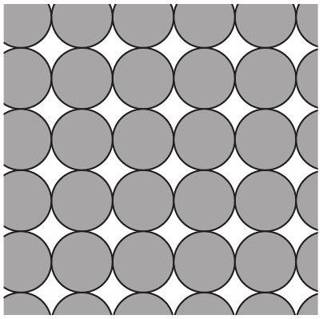
Figure 1: Neatly packed chocolates.

The packing fraction is defined to be the ratio of the volume of some objects divided by the total volume of space which they occupy.

When arranged randomly the chocolates have a packing fraction of 0.64.

a) Find the packing fraction of the chocolates when they are neatly packed in stacked layers with the arrangement shown in Figure 1.
Solutions: The spherical chocolates are arranged in a grid so that each one fits just inside a cube of side length $2 r$. The volume of the sphere is $V _ { \text {sphere } } = \frac { 4 } { 3 } \pi r ^ { 3 }$ and the volume of the cube is $V _ { \text {cube } } = ( 2 r ) ^ { 3 } = 8 r ^ { 3 }$. Hence, the packing fraction is
$$
f = \frac { 4 \pi r ^ { 3 } / 3 } { 8 r ^ { 3 } } = \frac { \pi } { 6 } = 0.52 .
$$
b) Do the same number of chocolates occupy more space when neatly packed as in Figure 1 or when randomly arranged?
Solution: A larger packing fraction means that you can fit more chocolates into the same volume. Hence, the arrangement with the smaller packing fraction occupies more space. This means that the chocolates occupy more space when neatly arranged than when randomly arranged.

To sell the chocolates the factory packs them into bags which are filled through funnels like that shown in Figure 2. As the bags are filled chocolates are added into the top of the funnel at an average rate of 5 chocolates per second and the level in of chocolates in the top of the funnel is steady.

c) (i) How many bags of 30 can be filled per minute through each funnel?
Solution: As the level in the top of the funnel is steady the number of chocolates going in the top must be the same as the number coming out the bottom of the funnel. This means that 5 chocolates per second will come out of the funnels. A bag contains 30 chocolates so it will take 6 s to fill. This means that 10 bags can be filled per minute.
    (ii) How fast do the chocolates shoot out of the funnel into a bag?
Solution: Only one chocolate can come out of the funnel at once and each chocolate must travel $2 r$ to leave the funnel. This means that in one second the chocolates travel a distance $10 r$. Hence, the speed is $10 r$ per second.

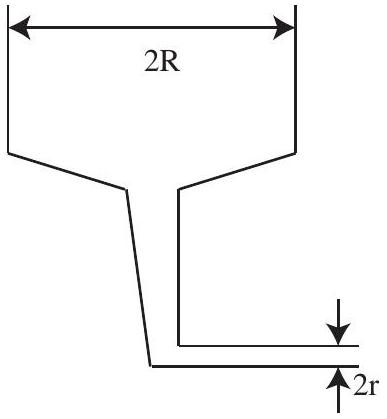
Figure 2: Funnel for filling bags.

(iii) What is the average downwards speed of the choco-lates in the top of the funnel?

Solution: In the top part of the funnel the chocolates will be randomly arranged. This means that the 5 chocolates that are added per second occupy a volume of $V = \frac { 5 } { f } \left( \frac { 4 } { 3 } \pi r ^ { 3 } \right)$. This volume is spread over a cylinder of cross-sectional area of $\pi R ^ { 2 }$. The height of the cylinder is the average distance travelled per second.

$$
v _ { \mathrm { av } } = \frac { 5 } { f } \frac { 4 \pi r ^ { 3 } } { 3 \pi R ^ { 2 } } \text { per second }
$$

Marker's comments: Most students need to give more explanation of their reasoning. Common mistakes made by students included

- calculating area occupied by chocolates rather than volume
- calculating numbers of chocolates per second rather than speed
- confusing $r$ and $R$
a) some students tried to measure the diagram but this does not give any extra information
b) some students had difficulty interpreting the meaning of a packing fraction
c) the chocolates in the top of the funnel are not in free fall

## Question 14

Suggested Time: 18 min
Astrophysical systems such as galaxies (which contain large numbers of stars) are generally very far from the Earth and solar system, and are moving away from us with some relative velocity $v$. Individual stars can be moving with respect to the galaxy; the velocity of this motion is known as the peculiar velocity. Figure 3 shows a galaxy which is moving away from us as a whole; stars in this galaxy orbit its centre and have peculiar velocities.

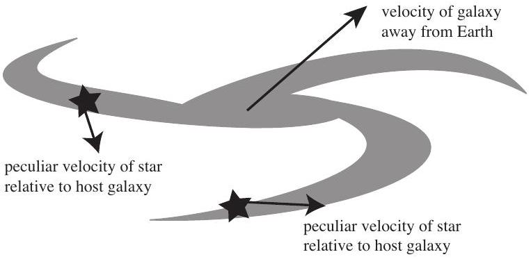
Figure 3: Peculiar velocities of a stars in a galaxy.

The energy from the peculiar motion within a galaxy, rather than its overall movement, is interesting. One way to measure the typical peculiar speed of a star, is to look at the spread in velocities. The standard deviation of the peculiar speeds is called the velocity dispersion, $\sigma$, and it becomes an estimate of the typical peculiar speed of a star.

a) The virial theorem applied to an astrophysical system with very large mass $M$ gives that
$$
v ^ { 2 } = \frac { G M } { R } ,
$$
where $v$ is the average speed of an object orbiting at a radius $R$, and $G$ is the universal gravitational constant. Use the virial theorem to estimate the mass $M$ of a galaxy, where a population of stars at radius $R$ from the centre of the galaxy are observed to have velocity dispersion $\sigma$.

Solution: The typical peculiar speed of a star is around $\sigma$, so

$$
\begin{aligned}
\sigma ^ { 2 } & = \frac { G M } { R } \\
M & = \frac { R \sigma ^ { 2 } } { G }
\end{aligned}
$$

When the source of a wave is approaching or retreating from an observer the wavelength changes. The size of this change is proportional to the speed of the source. This is known as the Doppler effect and is useful in astrophysics because elements emit light within narrow wavelength regions meaning peaks are observed in objects' spectra.

b) (i) Explain, with sketches, how the Doppler effect causes broadening of the Hydrogen alpha emission lines in the fast-rotating broad-line regions of galaxies. On the diagram on p. 8 of the Answer Booklet, draw what the Hydrogen alpha peak in Figure 4 would look like if its source is gas in the broad-line region of a galaxy.

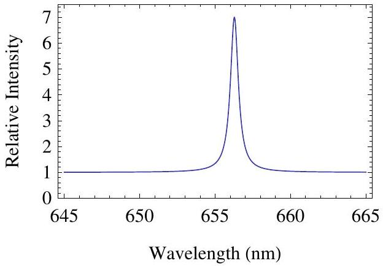
Figure 4: Hydrogen alpha emission spectrum.

Solution:
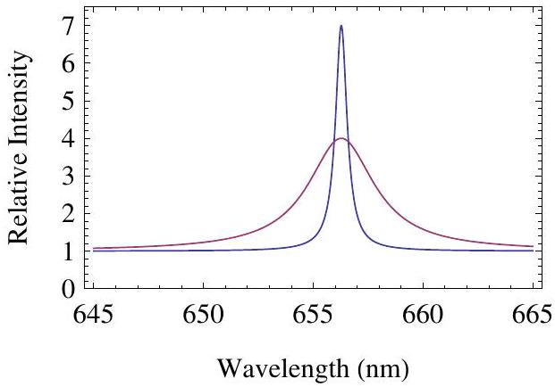
The Doppler shift changes the wavelength of the emitted light. Due to the rotation of the galaxy some of the gas is moving away from us and some is moving towards us, with a distribution of speeds towards and away form us. This means that the peak will be broadened symmetrically.

(i) Hence, explain how observations of spectra can be used to measure the velocity dispersion of stars in a galaxy.

Solution: Light emitted with a particular wavelength or frequency must have come from a star with a certain peculiar velocity and light emitted from stars with higher peculiar velocities will be Doppler shifted by a larger amount. Hence, the higher the velocity dispersion the larger the broadening due to the Doppler effect. By measuring the broadening of a line the velocity dispersion of a galaxy can be determined.

Most galaxies have supermassive black holes at their centres, which can be a billion times more massive than the Sun. Sometimes a violent event in the supermassive black hole causes changes throughout the fast-rotating region around the centre, called the broad-line region; these changes appear some time later.

A technique called reverberation mapping uses the time it takes light to travel across the broad-line region to estimate its radius. The light travel time $\tau$ is the measured time between observing changes in the front and in the back of the region. The speed of light is $c$ and the velocity dispersion of the broad-line region is $\sigma _ { \text {BLR } }$.

b) (i) Find an expression for the radius $R _ { \mathrm { BLR } }$ of the broad-line region.
Solution: The distance between the front and back of the region is $2 R _ { \mathrm { BLR } }$ so the time it takes light to travel across the region is $R _ { \mathrm { BLR } } = \tau c / 2$.
    (ii) Estimate the mass $M _ { \mathrm { BH } }$ of a supermassive black hole using reverberation mapping and the

virial theorem. You may assume that supermassive black holes are so massive that they account for most of the mass in the centre of a galaxy.
Solution: Substituting the expression for $R _ { \mathrm { BLR } }$ into the answer to part (a) gives

$$
M _ { \mathrm { BH } } = \frac { \tau \sigma ^ { 2 } c } { 2 G }
$$

Marker's comments:

a) This part was done well by students. The most common mistake was to use $v$ or $v + \sigma$ instead of $\sigma$ to reflect typical speed.
b) Most students did not give any explanation of their sketches in part (i), and had difficulty explaining their reasoning in part (ii).
c) Many students understood that $R _ { B L R } \propto \tau c$, and correctly estimated $M _ { B H }$. A common mistake was to include a factor of $\sigma$ in their expressions for $R _ { B L R }$ which is dimensionally incorrect and has no physical basis.

## Integrity of Competition

If there is evidence of collusion or other academic dishonesty, students will be disqualified. Markers' decisions are final.
