Time Allowed:
Reading Time: 10 minutes
Examination Time: 120 minutes

## INSTRUCTIONS

- Attempt ALL questions in both sections of this paper.
- Permitted materials: a non-programmable, non-graphical calculator, blue and black pens, lead pencils, an eraser, and a ruler.
- Answer SECTION A on the MULTIPLE CHOICE ANSWER SHEET provided.
- Answer SECTION B in the answer booklet provided. Write your answers to each question on the pages indicated. If you need additional space use the spare pages at the back of the booklet. Write in pen and use pencil only for diagrams and graphs.
- You may attempt the questions in Section B in any order. Make sure that you label which parts are for which questions.
- Do not write on this question paper. It will not be marked.
- Do not staple the multiple choice answer sheet or the writing booklet to anything. They must be returned as they are.
- Ensure that your diagrams are clear and labelled.
- All numerical answers must have correct units.
- Marks will not be deducted for incorrect answers.

## MARKS

| Section A | 10 multiple choice questions | 10 marks |
| :--- | :--- | :--- |
| Section B | 4 written answer questions | 50 marks |
|  |  | 60 marks |

## SECTION A: MULTIPLE CHOICE USE THE ANSWER SHEET PROVIDED

Throughout, take the acceleration due to gravity to be $9.8 \mathrm {~ms} ^ { - 2 }$.

Question 1
A projectile is launched vertically upwards. Consider the motion of the projectile after it has been launched but before it returns to the ground. Assuming that all forces exerted by the air are negligible, the force(s) acting on the projectile is (are):

a. a downward force of gravity along with a steadily decreasing upward force.
b. a steadily decreasing upward force from the moment it leaves the launcher until it reaches its highest point; on the way down there is a steadily increasing downward force of gravity as the projectile gets closer to the Earth.
c. an almost constant downward force of gravity along with an upward force that steadily decreases until the projectile reaches its highest point; on the way down there is only a constant downward force of gravity.
d. an almost constant downward force of gravity only.
e. none of the above. The projectile falls back to the ground because of its natural tendency to rest on the Earth.

Solution: d. While in the air there is nothing to cause an upwards force so a, b and c are not possible. There certainly is a gravitational force, which means that d. is the answer. Note that an object does not have to experience a force in the direction of motion, which is what Newton's first and second laws of motion tell us.

Question 2
The figure shows a frictionless channel in the shape of a segment of a circle with centre at "O". The channel is attached to a frictionless horizontal table top. You are looking down at the table. Assume that all forces exerted by the air are negligible. A ball is shot at high speed into the channel at "p" and exits at "r".

Consider the following distinct forces:

1. A downward force of gravity.
2. A force exerted by the channel pointing from q to O.
3. A force in the direction of motion.
4. A force pointing from O to q.

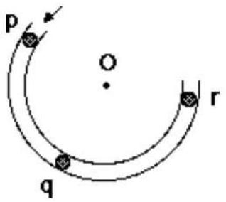

Which of the above forces is (are) acting on the ball when it is within the frictionless channel at position "q"?

a. 1 only.
b. 1 and 2.
c. 1 and 3.
d. 1, 2, and 3.
e. 1, 3, and 4.

Solution: b. As there is no friction there are no forces on the ball in the direction of motion and there is no force 3. However, the direction of the ball's velocity is changing so it is accelerating and experiencing a force from q to O in order to make it change direction. This force will be caused by the channel wall, so force 2 is acting on the ball. There is also a gravitational force acting on the ball which is force 1.

Question 3
A book lies at rest on a table. The table is at rest on the surface of the Earth. By Newton's Third Law, the reaction force to the weight of the book is:

a. the gravitational force of the Earth on the book.
b. the normal force exerted by the table on the book.
c. the gravitational force exerted by the Earth on the table.
d. the normal force exerted by the Earth on the table.
e. the gravitational force of the book on the Earth.

Solution: e. The weight of the book is the gravitational force exerted on the book by the Earth. A Newton's Third Law reaction force must be of the same physical type, i.e. gravitational, and must be exerted by the body feeling the first force and act on the body causing the first force. Hence, the reaction to the weight of the book is the gravitational force exerted by the book on the Earth.

Question 4
Bonnie and Jake have been visiting Goulburn and were amazed to see the aurora australis one night. On their way home a few days later they have to drive through a massive storm, and while stopped at a section of flooded road they have a discussion about the weather and their trip. Bonnie tells Jake that the aurora they witnessed was due to high sunspot activity, producing large numbers of high energy charged particles, which experience a force in the Earth's magnetic field and are diverted towards the poles, where they collide with molecules in the atmosphere, producing the coloured light of the aurora. She mentions that there must have been a lot of sunspot activity to produce an aurora visible as far north as Goulburn. Jake, who is from Tasmania, tells Bonnie that he has seen the aurora several times before, and each time he does there is a storm within a few days later. He concludes from this observation that periods of high sunspot activity cause storms on Earth. Bonnie thinks that Jake's reasoning is flawed. Which of the following is the best statement Bonnie can make to point out the flaw in Jake's argument?

a. "But Jake, I know from the atmospheric physics course that I took last semester that storms are actually the result of low-pressure systems in the Earth's atmosphere."
b. "But Jake, you've considered what happens when there is high sunspot activity, but your argument ignores the influence of periods of low sunspot activity on Earth's weather systems. You really need to compare the two situations to draw any conclusions."
c. "But Jake, you've assumed that just because there are storms just after sunspots, the storms are caused by the high sunspot activity."
d. "But Jake, there are stormy periods in some areas but not in others while there is sunspot activity."
e. Bonnie is mistaken, there is nothing wrong with Jake's argument.

Solution: c. Jake is claiming that he has observed a correlation between aurora and storms, that is when one happens the other is more likely to happen. However, correlation does not imply causation, so even when one event can be used to predict another it does not mean it causes it. For example, when more

people use air conditioners more people also go swimming. This does not mean using an air conditioner causes people to go swimming.

Question 5
A projectile of mass $M$ is moving directly north when it collides with and sticks to a second projectile of mass $m$ travelling directly south. Both projectiles have the same kinetic energy, and $M \gg m$. Which of the following statements is true in the instant after the collision?

a. The object moves north.
b. The object moves south.
c. The object stops dead in the air.
d. As soon as they collide the object must move directly downwards.
e. It depends on how hard the impact of the objects on each other is.

Solution: a. The kinetic energy of an object with mass $m$ and momentum $p$ is $K = p ^ { 2 } / 2 m$. Hence, since the two objects have the same kinetic energy, the one with the greater mass, $M$, must also have the greater momentum. When the objects collide momentum is conserved and as they stick together they must both move in the direction of the total momentum beforehand. As the objects are moving in opposite directions the total momentum will be in the same direction as that with the greater momentum, i.e. north, and the combined projectile will move north immediately after the collision.

Question 6
A projectile is launched at an angle to the ground such that it has both a horizontal and a vertical component to its initial velocity. Assuming all forces exerted by the air are negligible, which of the following statements is true?

a. The speed of the projectile is zero at the top of its trajectory, and the acceleration of the projectile is the same at the top of the trajectory as it is just before it hits the ground.
b. The speed of the projectile is the same at the top of its trajectory as it is just before it hits the ground, and the acceleration of the projectile is higher just before it hits the ground than it is at the top of the trajectory.
c. The speed of the projectile is lower at the top of its trajectory than is it just before it hits the ground, and the acceleration of the projectile is higher at the top of its trajectory than it is just before it hits the ground.
d. The speed of the projectile is lower at the top of its trajectory than is it just before it hits the ground, and the acceleration of the projectile is the same at the top of its trajectory as it is just before it hits the ground.
e. The speed of the projectile is higher at the top of its trajectory than is it just before it hits the ground, and the acceleration of the projectile is the same at the top of its trajectory as it is just before it hits the ground.

Solution: d. The acceleration of any projectile is the local acceleration due to gravity at all points along its trajectory if the forces exerted by the air are negligible. The horizontal component of the velocity remains constant as there is no horizontal acceleration. This means that the speed of the projectile is never zero as it always has a horizontal component to the velocity. However, the vertical component of the velocity must be zero at the top of its trajectory as it is not moving up or down. This means that the speed is minimum at the top and higher everywhere else, including just before hitting the ground.

Question 7
When a screw is very tight the most effective way to loosen it is by:

a. using a screwdriver with a fat handle and pushing down hard while turning to increase the grip.
b. using a screwdriver with a fat handle and not pushing down too hard in case you deform the screw head.
c. using a long screwdriver so that you are applying the force a long way from the point of contact.
d. using a short screwdriver so that you are applying the force as close as possible to the point of contact.
e. None of the above.

Solution: a. Pushing down hard increases the normal force between screwdriver and screw, which in turn increases the maximum possible frictional force between them, i.e. it increases the grip.. Having a fat handle increases the perpendicular distance away from the pivot at which the force to turn the screw is applied which makes it easier to to turn an object.

Question 8
An elevator in a four storey building is moving upward with constant acceleration. The dashed curve shows the position $y$ of the ceiling of the elevator as a function of the time $t$. At the instant indicated by the set of branching (solid) curves, a bolt breaks loose and drops from the ceiling. In the absence of air resistance, which curve best represents the position of the bolt as a function of time as seen by an observer who is not in the lift?
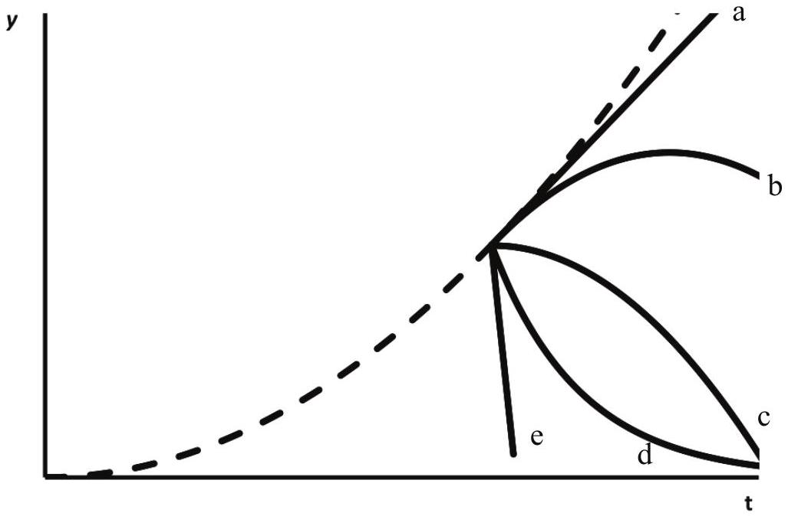

Solution: $b$. When the bolt first breaks loose it is moving at the same speed as the elevator so the curve should have the same slope as the dashed curve at that time. As time passes the vertical speed decreases due to the effect of gravity, hence the curve should be concave downwards.

Question 9
Matt is going to make a cake for Alix's birthday. The recipe says to use half a teaspoon of cinnamon, but he can't find a clean teaspoon. Instead he decides to weigh an appropriate amount on his kitchen scales. To the nearest order of magnitude, what is the mass of half a teaspoon of cinnamon?

a. 0.01g
b. 0.1g
c. 1g
d. 10g
e. 100 g

Solution: c. The half teaspoon has a similar volume to a finger tip. This is a volume of around 1 cm × 1 $\mathrm { cm } \times 2 \mathrm {~cm} = 2 \mathrm {~cm} ^ { 3 }$. Water has a mass of 1 g for each $1 \mathrm {~cm} ^ { 3 }$, but cinnamon would have a density which is lower but not ten times lower. Hence, the mass of half a teaspoon of cinnamon is less than 2 g but more that 0.2 g , leaving 1 g as the most sensible estimate.

Question 10
A large truck breaks down on the freeway and receives a push to the nearest exit by a small car as shown below.
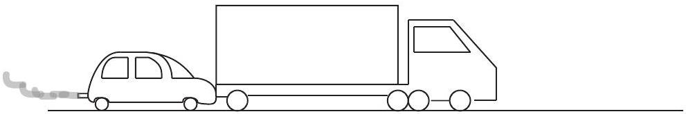

While the car, still pushing the truck, is speeding up to get to cruising speed

a. the amount of force with which the car pushes on the truck is equal to that with which the truck pushes back on the car.
b. the amount of force with which the car pushes on the truck is smaller than that with which the truck pushes back on the car.
c. the amount of force with which the car pushes on the truck is greater than that with which the truck pushes back on the car.
d. the car's engine is running so the car pushes against the truck, but the truck's engine is not running so the truck cannot push back against the car. The truck is pushed forward simply because it is in the way of the car.
e. neither the car nor the truck exert any force on the other. The truck is pushed forward simply because it is in the way of the car.

Solution: a. Newton's Third Law of motion states that the force exerted by one object on another is equal in magnitude to the force exerted by the second object on the first.

## SECTION B: WRITTEN ANSWER QUESTIONS USE THE ANSWER BOOKLET PROVIDED

Note: Suggested times are given for section B as a general guide only. You may take more or less time on any question - everyone is different.

Question 11
Suggested Time: 20 min
Consider a hollow, frictionless inverted cone within which an object of mass $m$ is free to slide. The cone has an angle of $\theta$ between its central axis and sloped side, and a radius $r$ at height $h$.

a) The object of mass $m$ is released from rest at height $h$ to slide inside the cone.
    (i) What will be its speed when it reaches the bottom?
Solution: Energy is conserved:
change in gravitational potential energy (GPE) = change in kinetic energy (KE).
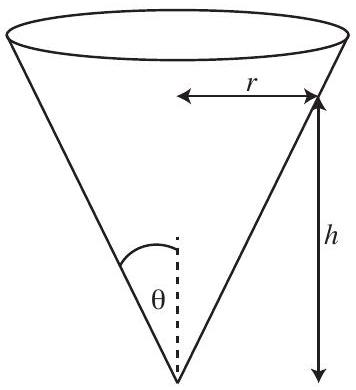
$$
\begin{gathered}
\mathrm { GPE } = m g h , \mathrm { KE } = \frac { 1 } { 2 } m v ^ { 2 } \\
m g h = \frac { 1 } { 2 } m v ^ { 2 } \\
v = \sqrt { 2 g h }
\end{gathered}
$$
(ii) What assumption(s) did you make in the previous part?

Solution: It is assumed that the cone is near the surface of the Earth, and that the height $h$ is very much smaller than the radius of the Earth so that the acceleration due to gravity $g$ is approximately constant. It is also assumed that the object can slide all the way to the bottom without getting stuck.

b) The object of mass $m$ is collected and released again, but in the horizontal direction this time, with speed $v$. It slides in a circular path around the inside of the cone. Hence, its acceleration is $a = v ^ { 2 } / r$ towards the central axis of the cone.
    (i) Draw a diagram showing the forces acting on the mass.
Solution: Diagram should be a simple free body diagram showing two forces: $F _ { g }$, the gravitational force of the Earth on the object (pointing vertically downwards from the object's centre of mass), and $F _ { N }$, the normal force of the cone surface on the object (pointing perpendicularly upwards from the surface of the cone).
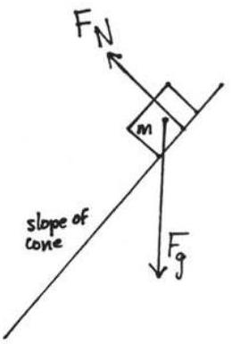
    (ii) Find the magnitude of the normal force on the mass.
Solution: As the object slides down the surface it cannot accelerate through the surface of the cone. So the sum of forces perpendicular to the surface of the cone is zero:
$$
F _ { N } - F _ { g \perp } = 0
$$
Page 7 of 18
2015 Australian Science Olympiads Exam - Physics Solutions

where $F _ { g \perp }$ is the component of the gravitational force perpendicular to the cone's surface.
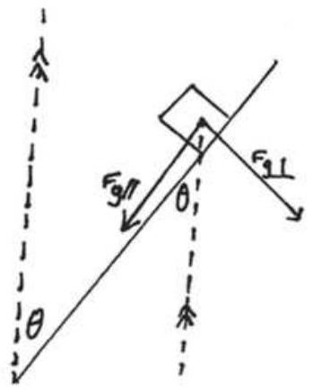
We resolve the gravitational force into parallel $\left( F _ { g \| } \right)$ and perpendicular $\left( F _ { g \perp } \right)$ components relative to the cone's surface. The angle between $F _ { g \| }$ and $F _ { g }$ is $\theta$, so $F _ { g \perp } = F _ { g } \sin \theta$. Hence, $F _ { N } = F _ { g } \sin \theta$.
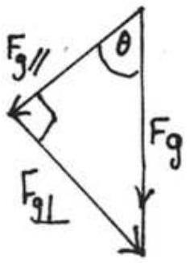
    (iii) Find an expression for the height of the mass.
Solution: We have that $a = v ^ { 2 } / r$ towards the central
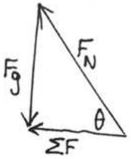
axis of the cone. This centripetal acceleration is the net acceleration given by $a = \Sigma F / m$, where $\Sigma F$ is the sum of the forces, as shown in the diagram to the left. From this triangle of forces we get
$$
\begin{aligned}
\tan \theta & = \frac { F _ { g } } { \Sigma F } \\
\Sigma F & = \frac { m g } { \tan \theta }
\end{aligned}
$$
We can now solve for $r$ :
$\frac { v ^ { 2 } } { r } = \frac { g } { \tan \theta }$
$\therefore r = \frac { v ^ { 2 } \tan \theta } { g }$
Finally,
$$
\tan \theta = \frac { r } { h }
$$
so
$$
h = \frac { r } { \tan \theta } = \frac { v ^ { 2 } \tan \theta } { g \tan \theta } = \frac { v ^ { 2 } } { g }
$$
c) The object of mass $m$ continues along its circular path until it is bumped slightly so that its speed is unchanged, but it is now directed slightly down the cone (but still mostly around the cone). Describe and explain the motion of the mass.
Solution: As mass travels around and slightly down the cone, its downwards velocity will increase as it is accelerated by gravity. As it moves down the cone, the radius of the cone decreases. The centripetal force is courtesy of the horizontal component of the normal force, the magnitude of which stays constant as it does not depend on $h$ or $r$.
Hence, the centripetal acceleration $a$ is constant. However, for the object to remain in uniform circular motion the acceleration must equal $v _ { \perp } ^ { 2 } / r$. As $r$ decreases the component of the velocity around the cone is too large for the object to follow circular path at the lower radius and the object will begin to move outwards and rise up the cone. There will be a pattern of going around, up and down, which will repeat since the cone is frictionless. Note: the path depends on the shape of the object/whether it has any spin on it etc.

## Question 12

Suggested Time: 25 min
The logarithmic spiral is a curve that is seen often in nature, for example in sea shells and sunflowers. It is also known as a constant angle spiral, because it has the property that at each point on the curve, the angle between the radius (the line to the centre of the spiral) and the tangent is constant; this angle is $90 ^ { \circ } - \phi$ as shown in Fig 1(a).

Figure 1: (a) A logarithmic spiral with angle $\phi$, radius and tangent marked. (b) A spring-loaded camming device (cam) with lobes extended. (c) The same cam with lobes retracted and placed in a parallel sided crack.

The spring-loaded camming device (cam for short) is a piece of rock climbing equipment based on the logarithmic spiral and its properties. A cam's purpose is to protect the climber by limiting the distance he or she can fall.

Figure 2: (a) A climber using cams for protection. (b) A climber after a fall.

A cam is comprised of two lobes, each the shape of a section of a logarithmic spiral whose centres are on a common axle; this axle is attached to the rope and hence the climber. The springs in the device restore the cam to the shape shown in Figure 1(b). The lobes can be retracted (releasing the springs) allowing the cam to be placed in a crack in the rock as shown in Figure 1(c). If the climber falls, the downward force from the fall is converted by the cam to an outward force on the rock. Friction keeps the cam in place in the crack. The frictional force has a maximum value $F _ { \mathrm { fr } } = \mu N$ where $N$ is the normal force.

a) Suppose a climber places a cam in a parallel-sided crack. Draw all the forces on the cam in a labelled free body diagram on p. 4 of the Answer Booklet, when
    (i) the climber is above the cam
    (ii) the climber has fallen and is hanging from the cam

Solution:

In each case there is a downward weight force on the axle of the cam, due to the weight of the cam itself in (i), and the weight of the climber (plus the cam) in (ii). This is balanced by the upward frictional force split evenly between two lobes of the cam. The normal force of the rock on the cam (an equal an opposite force to the normal component of the cam's outward force on the rock) enables the frictional force.

b) Cams rely on friction to work; it is dangerous to use them on smooth rock. What is the minimum coefficient of friction $\mu$ that the rock should have, in terms of the camming angle $\phi$ ? Note that the force exerted by the axle on each lobe must be along the line joining the axle with the point of contact of that lobe with the rock, or the lobe will rotate. You may assume the force due to the spring on each lobe is negligible, and the cam lobes do not deform the rock.
Solution:
The downward force $F _ { \text {fall } }$ on the axle of the cam is converted (through the cam's rigidity) to an outward force $F _ { r }$ on the rock, which acts along the line from the axle of the cam to the point of contact with the rock (this is the radius of the logarithmic spiral, and at angle $\phi$ to the horizontal). Thus, the normal force $N$ and downward force $F _ { \text {fall } }$ are related to $F _ { r }$ by:
$$
\begin{aligned}
F _ { \text {fall } } & = 2 F _ { r } \sin \phi \\
N & = F _ { r } \cos \phi
\end{aligned}
$$

where the factor of 2 is from the two cam lobes. Meanwhile for the upward frictional forces to balance $F _ { \text {fall } }$, we have
$$
\begin{aligned}
F _ { f } & = \frac { 1 } { 2 } F _ { \text {fall } } \\
& = F _ { r } \sin \phi \\
& = N \tan \phi .
\end{aligned}
$$

Combining with $F _ { f } \geq \mu N$, we then have the condition $\mu \geq \tan \phi$.

c) What does the logarithmic spiral shape of the cam lobes mean for the cam's functionality at different amounts of retraction?

Solution:
As each lobe of the cam traces a logarithmic spiral, the angle $\phi$ between the horizontal and radius in part (b) is constant: it does not depend on the point along the cam which contacts the rock (which depends on the amount of retraction). Thus the ratio between the downward force $F _ { \text {fall } }$ and upward frictional force $F _ { f }$ is constant. This means that the cam works just as well to counteract the force of the fall by providing an upward frictional force, for any amount of retraction (in a range). The same cam then can be used in cracks in a range of widths, with the same effectiveness.

d) As a climber climbs above a cam they may inadvertently pull the cam from side to side. Consider the springs' forces on the lobes of a cam placed in a crack and pulled from side to side.
    (i) Describe the effect that this will have on the cam. Explain your reasoning with the help of diagrams.
Solution: The springs act to open up the cam and return it to its extended position in Figure 1(b), pushing each lobe upwards. If the crack widens upwards, then the cam lobes can open up; there is a risk that the cam can 'walk' up so much it returns to the extended position, where it provides no camming action. In the crack that widens downward, the cam does not have room to move upward.
    (ii) Circle the diagram showing the safer crack for a climber to use on p. 5 of the Answer Booklet. Give reasons for your answer.
Solution: The crack on the left (which gets narrower higher up) is safer.

Question 13
Suggested Time: 25 min
One evening a house was heated by burning 10 kg of hardwood in a slow combustion heater. The fire went out at 7:30 pm. The efficiency of the heater is 68\% and hardwood releases 1.9 MJ/kg of energy when it is burnt. The temperature both inside and outside the house was recorded and is shown in Figure 3.

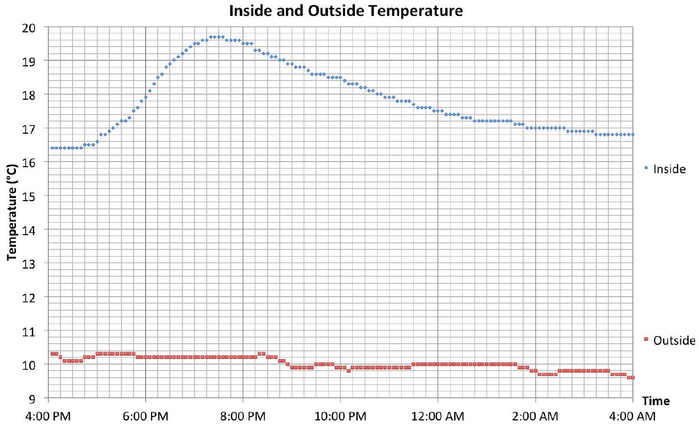
Figure 3: The temperature inside and outside the house on this evening.

a) (i) How much energy was released by burning the hardwood?
Solution:
$$
\begin{aligned}
\text { energy released } & = \text { mass } \text { × } \text { energy per unit mass } \text { × } \text { efficiency } \\
& = 10 \mathrm {~kg} \times 1.9 \mathrm { MJ } \mathrm {~kg} ^ { - 1 } \times 68 \% \\
& = 13 \mathrm { MJ }
\end{aligned}
$$
    (ii) The total heat capacity is the amount of heat required to increase the temperature of an object by 1°C. Estimate the total heat capacity of the house.
Solution:
$$
\begin{aligned}
\text { heat capacity } & = \frac { \text { energy released } } { \text { temperature change } } \\
& = \frac { 12.92 \mathrm { MJ } } { ( 19.7 - 16.4 ) ^ { \circ } \mathrm { C } } \\
& = 3.9 \mathrm { MJ } ^ { \circ } \mathrm { C } ^ { - 1 }
\end{aligned}
$$
b) After the fire went out the house began to cool.
    (i) Draw a straight line of best fit to the linear region of the graph on p. 6 of the Answer Booklet.
Solution:

Logarithm base 10 of increase in inside temperature
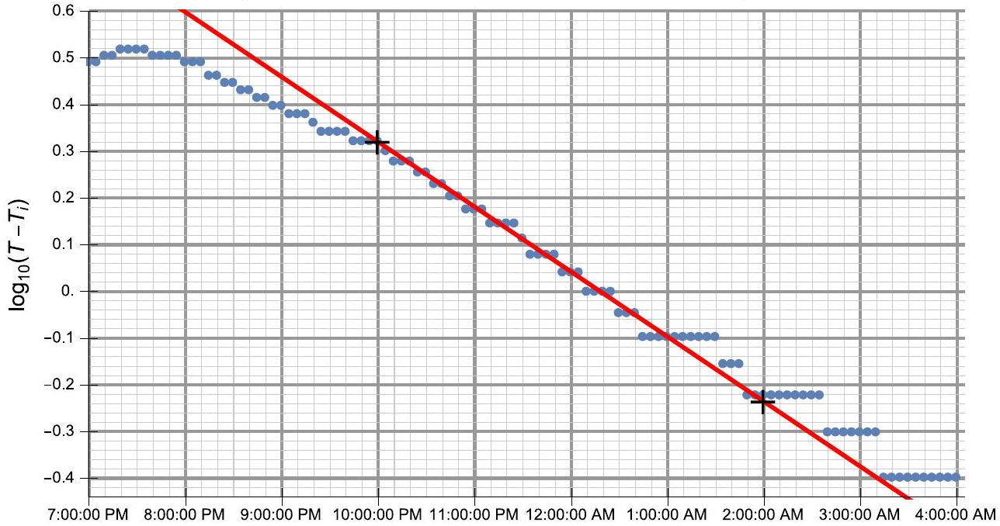

(ii) Write down an equation which describes the relationship of the line of best fit.
Solution:
Quite generally, we can represent a straight line in the form
$$
\left( y - y _ { 1 } \right) = m \left( x - x _ { 1 } \right) ,
$$
where $\left( x _ { 1 } , y _ { 1 } \right)$ is the coordinate pair of an arbitrary points on the line, and $m$ is the line's gradient. In our case, one of the coordinates on the line is given by (10 pm, 0.32), and the gradient is given by
$$
\begin{aligned}
m & = \frac { \Delta y } { \Delta x } \\
& = \frac { - 0.24 - 0.32 } { 4.0 \mathrm {~h} } \\
& = - 0.14 \mathrm {~h} ^ { - 1 } ,
\end{aligned}
$$
which uses the black markers on the plot from the previous section. This gives the final expression as
$$
\log _ { 10 } \left( T - 16.4 ^ { \circ } \mathrm { C } \right) = 0.32 - 0.14 \times ( t - 10 \mathrm {~h} ) ,
$$
where with $( t - 10 \mathrm {~h} )$ we are referring to the number of hours elapsed since 10 pm. This may be equivalently represented as
$$
T = 16.4 ^ { \circ } \mathrm { C } + \left( 2.1 ^ { \circ } \mathrm { C } \right) \times 10 ^ { - 0.14 \mathrm {~h} ^ { - 1 } \times ( t - 10 \mathrm {~h} ) } .
$$
(iii) When does this relationship apply to this house?
Solution:
This relationship is valid between approximately 10 pm and 1 am.
(iv) Does the relationship you found using the data match your expectations about how the house would cool? Explain your answer, including what your expectations are and physical reasons for them.
Solution:
Yes, this relationship makes sense physically. We would expect that a large difference between the inside and outside temperatures would result in the house cooling quickly,

while heat would flow out of the house more slowly if the temperatures were closer to one another.
c) Use your answer to 13b to make a better estimate of the total heat capacity of the house. Justify your estimate.
Solution:
The aim of this question is to estimate heat loss through the house walls, so that we can better estimate the temperature the house would have reached without this loss mechanism. A few approaches are possible here, including the following.
We can use our model to estimate the heat loss during the heating stage. The average temperature during heating is about 18 °C, so we can determine the average temperature decrease rate from the data near 11 pm. This average is then
$$
\begin{aligned}
\frac { T ( 11 : 30 ) - T ( 10 : 30 ) } { 1 \mathrm {~h} } & = 2.1 ^ { \circ } \mathrm { C } \times \left( 10 ^ { - 0.14 \times 1.5 } - 10 ^ { - 0.14 \times 0.5 } \right) \mathrm { h } ^ { - 1 } \\
& = - 0.49 ^ { \circ } \mathrm { C } \mathrm {~h} ^ { - 1 } ,
\end{aligned}
$$
and so over the 3 h heating between 4:30 and 7:30 pm, the house would have lost heat corresponding to a temperature change of 1.5 °C.
The new heat capacity would then be
$$
\begin{aligned}
\text { heat capacity } & = \frac { \text { energy released } } { \text { temperature change } } \\
& = \frac { 12.92 \mathrm { MJ } } { ( 19.7 + 1.5 - 16.4 ) ^ { \circ } \mathrm { C } } \\
& = 2.7 \mathrm { MJ } ^ { \circ } \mathrm { C } ^ { - 1 } .
\end{aligned}
$$
You could also take an alternative approach, such as extrapolating back the line you've constructed to the start of the heating time (~ 4:30 pm). This would also give an estimate of the temperature the house would have reached without the heat loss through the walls/windows.

Question 14
Suggested Time: 20 min
When light passes through a very narrow slit it diffracts. This means that the light spreads out and forms a pattern with bright and dark spots on a distant screen. Some examples of these patterns are shown below, with magnified images of the slits that generated them to the right. The wavelength of the light and the distance from the slit to the screen were kept constant in these images.

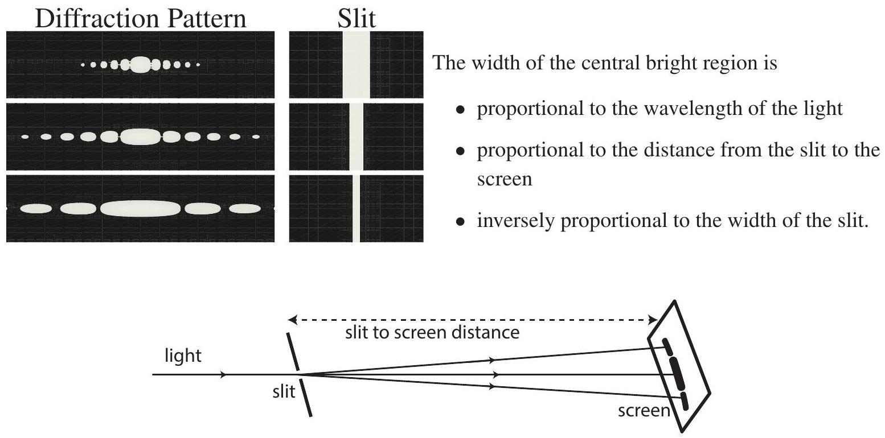
Figure 4: Light diffracting through a narrow slit.

a) Red light of wavelength 650 nm is shone though a slit of width $3.0 \times 10 ^ { - 4 } \mathrm {~m}$ onto a screen 1.20 m from the slit and produces the pattern labelled "(a)" below. Exactly one of the slit width, wavelength or distance to screen was changed to produce the pattern labelled "(b)" below. For each possible parameter below find its required value to make pattern "(b)":
    (i) slit width,
(ii) wavelength,
(iii) distance from the slit to the screen.
Give your answers in the spaces on p. 8 of the Answer Booklet.

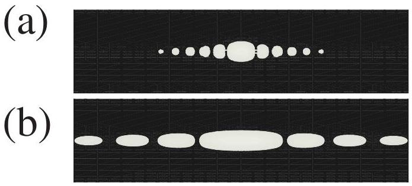

Solution: The width of the central bright region of pattern (b) is 1.5 cm, and that for pattern (a) is 0.5 cm , hence, pattern (b) is $1.5 / 0.5 = 3$ times wider than pattern (a).

(i) The width of the central bright region is inversely proportional to slit width, so slit width $= 3.0 \times 10 ^ { - 4 } \mathrm {~m} / 3 = 1.0 \times 10 ^ { - 4 } \mathrm {~m}$.
(ii) The width of the central bright region is proportional to wavelength, so wavelength $= 650 \mathrm {~nm} \times 3 = 1950 \mathrm {~nm}$. (Note that this is an infrared wavelength so we are unlikely to observe it directly!)
(iii) The width of the central bright region is proportional to distance from the slit to the screen, so distance to screen $= 1.20 \mathrm {~m} \times 3 = 3.60 \mathrm {~m}$.

b) A diffraction pattern from a different single slit is shown on p. 8 of the Answer Booklet. Draw a possible single slit which could have produced this pattern in the box to the right of the pattern.
Solution:
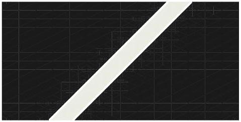
c) When a narrow slit is replaced by a small rectangular aperture (hole) the light spreads out in all directions and forms a pattern such as the one labelled Example on p. 8 of the Answer Booklet. Draw diagrams to fill in the blanks of diffraction patterns or aperture shapes in the table on pp. 8-9 of the Answer Booklet.
Solution:

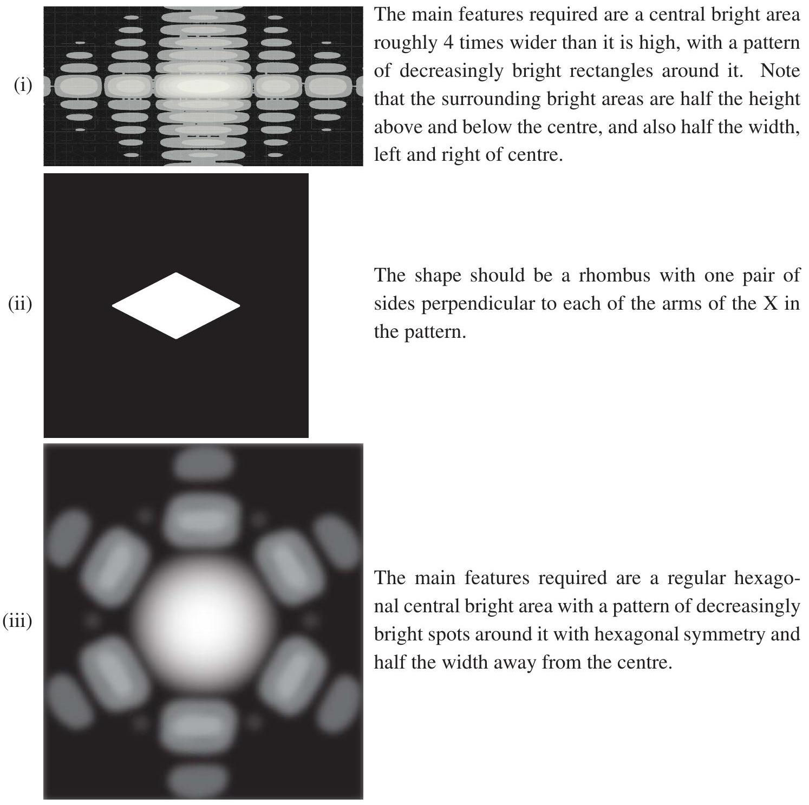
Page 16 of 18

The shape should be an ellipse which is roughly
(iv)

twice as high as it is wide.
d) Explain why the width of the central bright region is proportional to the distance from the slit to the screen.

Solution:
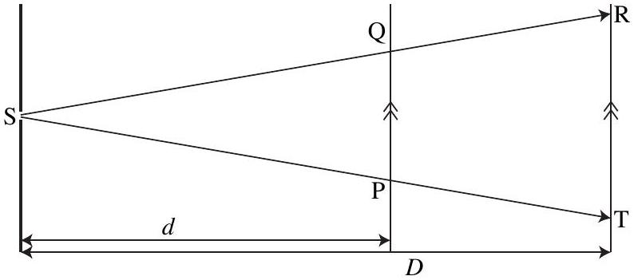
Light comes from a slit at S, and the rays SR and ST represent the light at the edges of the central bright region. The points Q and P lie on one possible screen, a distance $d$ from the slit, and the points R and T lie on a second possible screen a distance $D$ from the slit.
The triangles SQP and SRT are similar as they share a common angle at S and the sides QP and RT are parallel so $\angle \mathrm { SPQ }$ and $\angle \mathrm { STR }$ are corresponding angles. Since the triangles are similar their sides and other lengths, such as the slit to screen distance, are in the same ratio. In particular, the widths of the bright central regions QP and RT are delated to the distance from the slit to the corresponding screen by

$$
\frac { \mathrm { QP } } { \mathrm { RT } } = \frac { d } { D } .
$$

In other words, the the width of the central bright region is proportional to the distance from the slit to the screen.

## Integrity of Competition

If there is evidence of collusion or other academic dishonesty, students will be disqualified. Markers' decisions are final.
