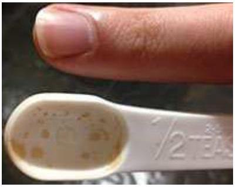

Question 9
Matt is going to make a cake for Alix's birthday. The recipe says to use half a teaspoon of cinnamon, but he can't find a clean teaspoon. Instead he decides to weigh an appropriate amount on his kitchen scales. To the nearest order of magnitude, what is the mass of half a teaspoon of cinnamon?

a. 0.01g
b. 0.1g
c. 1g
d. 10g
e. 100 g

Solution: c. The half teaspoon has a similar volume to a finger tip. This is a volume of around 1 cm × 1 $\mathrm { cm } \times 2 \mathrm {~cm} = 2 \mathrm {~cm} ^ { 3 }$. Water has a mass of 1 g for each $1 \mathrm {~cm} ^ { 3 }$, but cinnamon would have a density which is lower but not ten times lower. Hence, the mass of half a teaspoon of cinnamon is less than 2 g but more that 0.2 g , leaving 1 g as the most sensible estimate.
