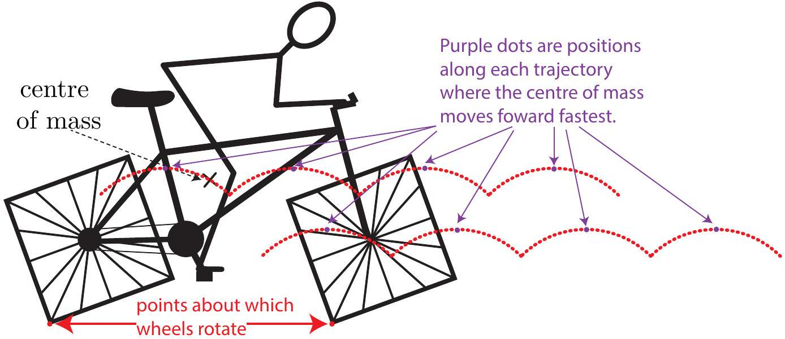
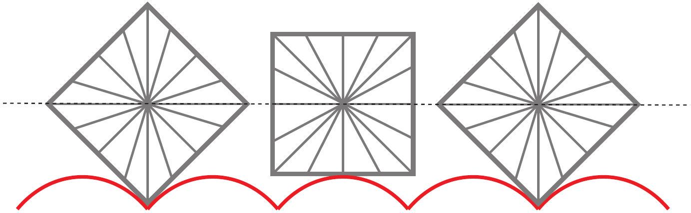

Question 12
Suggested Time: 25 min
Angus the accountant decides to change careers and starts a bicycle building business. To make his bicycles stand out he builds them with square wheels, making sure that both wheels can sit with a side flat on the ground at the same time.

Angus rides his first bicycle proudly out of his shed turning his pedals at a constant rate.

a) (i) Sketch the trajectory of the centre of the front wheel in the space on p .4 of the answer booklet.
    (ii) On the same diagram sketch the trajectory of the centre of mass of the bicycle. In the space below the diagram explain how the trajectory of the centre of mass is related to the trajectory of the centre of the front wheel and why this is so.
    (iii) For each wheel label the point about which it is rotating.
    (iv) Label the points on the trajectory where the centre of mass of the bicycle is moving forward fastest. Explain your reasoning in the space provided below the diagram.

Solution:

(i) See above.
(ii) See above. The centre of mass of the bike is a fixed distance from the centre of the front wheel. This means that the trajectory is the same shape but shifted by a fixed distance up and to the left.
(iii) See above.
(iv) The bike is moving forward fastest when it is at its highest point. Since the pedals are turned at a constant rate, the wheels also turn at a constant rate. This means that the speed of the bike is the same at all times, but the direction of the velocity follows the trajectory and this is most forwards at the highest points.

Markers' Comments:
Most students correctly identified that the bike moves up and down and could relate the trajectories of the centre of the front wheel and the centre of mass. Some common mistakes were having a trajectory which changed direction smoothly when the went from rotating about one corner to rotating about the next corner. Identifying that the wheels rotated around the corner in contact with the ground and the points where the bike was moving forward fastest were more difficult.

b) Calculate the ratio of the length of the path followed by the centre of mass to the distance travelled along the road.
Solution: The bike wheels are rotating about the corners and the centre of the wheel is fixed distance from the corner so it follows the arc of a circle. If the length of the side of the wheel is $s$, then the centre is a distance
$$
\begin{aligned}
d & = \sqrt { \left( \left( \frac { s } { 2 } \right) ^ { 2 } + \left( \frac { s } { 2 } \right) ^ { 2 } \right) } \\
& = \frac { s } { \sqrt { 2 } }
\end{aligned}
$$
from the corner. In one quarter turn the length of the path followed by the centre of the wheel is $l = \pi s / ( 2 \sqrt { 2 } )$ and the wheel has moved horizontally by $s$. Since the trajectories of the centre of the wheel and the centre of mass are the same but offset, the ratio of the length of the path to the distance along the road for the centre of mass is
$$
\frac { \pi s / ( 2 \sqrt { 2 } ) } { s } = \frac { \pi } { 2 \sqrt { 2 } } .
$$
Markers' Comments:
Students had difficulty identifying the trajectory as being made of arcs of circles, and also with calculating the length of a circular arc.

Angus generously gives Sam one of his square wheeled bicycles for her birthday. Sam is very lazy and teaches herself to ride the bicycle so that she is only just pedalling hard enough to replace energy lost from the bike. The bike then has constant energy.

c) Describe the differences and similarities between the motion of the bicycle when Sam rides compared to when Angus rides.
Solution:
Regardless of how the pedals are turned the centre of the wheel and the centre of mass will both still follow the same path. However, when Sam pedals she keeps the energy of the bike the same and this will include gravitational potential energy as well as kinetic energy. At the tops of the trajectory Sam's speed will be lowest as she has greatest gravitational potential energy and the kinetic energy must be lower to compensate. Sam's speed will be greatest just before and after the lowest points of the trajectory when the sides of the wheels are flat on the ground.
Markers' Comments:
Many students did not attempt this part of this question. Those who did often did not communicate their reasoning clearly.

After watching Sam ride the bicycle Angus realises the error of his ways, and decides to construct a racetrack specifically for his square bicycles.

d) Draw a side view of the racetrack's surface shape to ensure the smoothest ride on one of the square wheeled bicycles.

Solution:

Markers' Comments:
The important features of the sketch were the cusps which make a right angle at the lowest points of the track, and that the distance between the cusps is less than $s$, so that the length along the surface of the tracks can be equal to $s$. The height difference between the cusps and maxima must be $( \sqrt { 2 } - 1 ) s / 2$ in order that the centre of mass of the bike remain at a constant height. Note: only the red line in the diagram is a required part of the solution, but the grey wheels and dashed black line are drawn in to show how the shape of the path allows for a smooth ride with centre of the wheel at a constant height.
