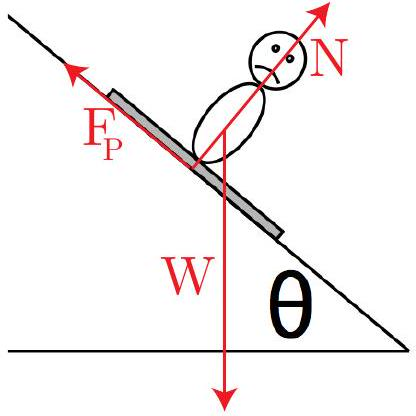
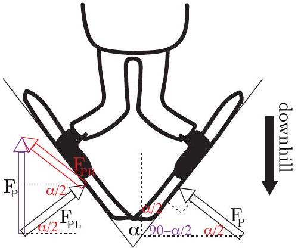
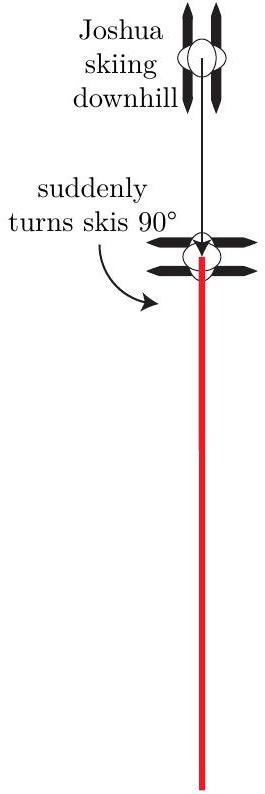
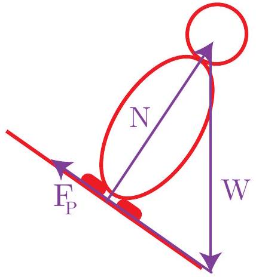
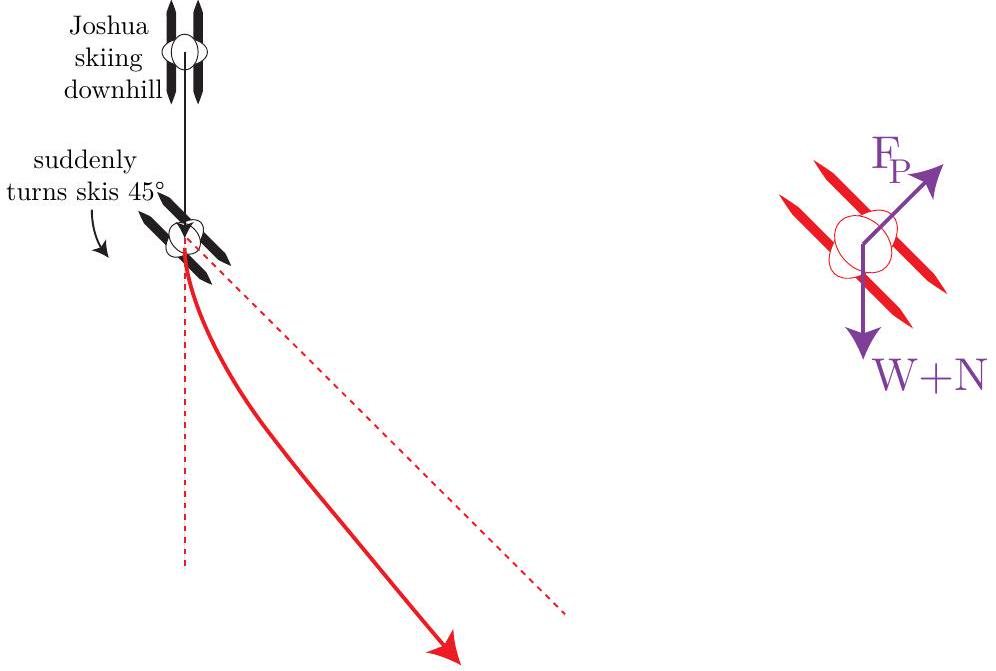

Question 13
Suggested Time: 25 min
Having missed the boat for Rio 2016, Emily and Joshua are determined to qualify instead for the Winter Olympics in 2018, to be held in PyeongChang, South Korea.

Emily, being a novice skier, is sliding down a slope and desperately trying to slow down using a 'snowplough' stop. The ski slope makes an angle $\theta$ with the horizontal. By digging the inside edges of her skis into the snow while keeping them in a V-shape, Emily can stop completely. The forces due to this ploughing motion act on each ski perpendicular to the ski and along the slope. Each of these forces has magnitude $F _ { P }$. Emily has a mass $m$.

Emily skiing down a slope.

Snowplough stop

a) (i) Which direction will the total force due to the ploughing motion be in?
Solution:
The total force will be uphill as it is the sum of the ploughing force on each ski. This is shown in the snowplough stop diagram above, where the force on the right ski is added to that on the left ski to give a resultant force uphill.
Markers' Comments:
Many students answered the question vaguely with phrases such as "behind Emily" which were not clear enough to be given credit.

(ii) Explain why the magnitude of the total force due to the ploughing motion is $2 F _ { P } \sin \frac { \alpha } { 2 }$ when the angle between Emily's skis is $\alpha$.
Solution:
The angle between uphill and each ski is $\alpha / 2$, so the angle between the each ploughing force and the horizontal is also $\alpha / 2$. This is also shown in red and purple on the right hand diagram above. The ploughing force on the left ski has a component to the right and the force on the right ski has a component to the left, and, since the forces are symmetric these are equal so the total force in the horizontal direction is zero.
The ratio of the uphill component of the ploughing force due to each ski to the magnitude of the ploughing force on each ski is

$$
\frac { F _ { P \text { uphill } } } { F _ { P } } = \sin \frac { \alpha } { 2 } .
$$

Rearranging the equation gives $F _ { P }$ uphill $= F _ { P } \sin \frac { \alpha } { 2 }$ as the contribution from each ski, so the total force due to the ploughing motion is $2 F _ { P } \sin \frac { \alpha } { 2 }$ uphill.
Markers' Comments:
Some students explained why the angle was $\alpha / 2$ and why there was a factor of 2 at the start of the expression but did not do any calculation, which was required to explain why there is

a sine function in the expression. Some students resolved the skis into components rather than forces.
b) Draw all the forces as vectors acting on Emily as she ploughs downhill on the diagram on p. 6 of the answer booklet. Include the combined effect of the ploughing forces as a single vector.
Solution:
See the left hand diagram above. The forces are marked with red arrows.
Markers' Comments:
Many students included extra information which was not required in this diagram. When marking particular attention was paid to the direction of the forces: the ploughing force should be uphill, the normal force should be perpendicular to the hill and the gravitational force should be downwards, not downhill.
c) At what angle $\alpha$ between the skis will Emily continue down the hill at a constant speed?
Solution:
For Emily to travel at a constant speed the total force acting on her needs to be zero. Considering the total force perpendicular to the slope will always be zero so we only need consider the forces along the slope. The component of the weight force along the slope is $m g \sin \theta$ downhill. Combining this with the expression for the total force due to the ploughing motion gives
$$
0 = 2 F _ { P } \sin \frac { \alpha } { 2 } - m g \sin \theta .
$$
Rearranging this equation gives
$$
\sin \frac { \alpha } { 2 } = \frac { m g \sin \theta } { 2 F _ { P } } .
$$
Inverting the sine function then gives the angle between the skis required for Emily to move at a constant speed
$$
\alpha = 2 \arcsin \left( \frac { m g \sin \theta } { 2 F _ { P } } \right) .
$$
Markers' Comments:
Not many students made much progress with this part of the question.

Joshua thinks he might have a go at the slalom event so has been practising sharp turns.

d) Joshua is skiing down the slope with his skis pointing downhill and suddenly turns his skis so that they are pointing across the slope.
    (i) Sketch a diagram showing Joshua's path once he has turned his skis on the diagram on p. 7 of the answer booklet.
    (ii) Briefly explain your reasoning. Note: another diagram might help your explanation.

Solution:

As Josh's skis are both across the slope the forces on the skis are perpendicular to this and uphill. This means that all the forces on Josh are acting directly uphill or downhill and Josh will not turn. He will continue in a straight line down the hill but slow down and reach a stop. A diagram of the forces acting on Josh is included to the right above.
Markers' Comments:
Many students felt that Josh would turn and credit was not given for paths which had changes of direction. To get full credit students had to include explanations based on the forces acting on Josh and their directions.

e) Joshua decides to practice a different turn. He skis down the same hill and then suddenly turns his skis by 45° and then keeps them pointing in the same direction. Draw a diagram of his path on p. 7 of the answer booklet. Please point out any important features of the path.

Solution:

The important features of the path are that it is initially still directly downhill but curves so that Josh is moving to the right as viewed from above. Josh's path will become linear again, but at an angle of less than 45° to downhill. A diagram of the directions of forces along the slope which act on Josh is shown to the right above. The total force will have components down the hill and across the hill.

In the instant after Josh turns he will still be moving downhill but starts accelerating somewhat to the right as viewed from above. This means that the path curves. As the path curves the forces on the skis will decrease as Josh is moving in a direction closer to the direction that the skis are pointing. However, there is always a component of the gravitational force which is downhill, and his skis remain in the same direction. This means that there is an angle between directly downhill and the direction in which his skis point where the total force is in the direction of motion. Josh's direction will asymptotically approach this direction and his path will become linear again.
Markers' Comments:
Students needed to consider the directions of forces and how these resolve into components across and along the hill.
