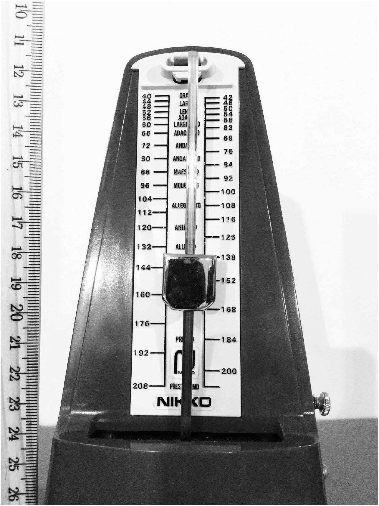
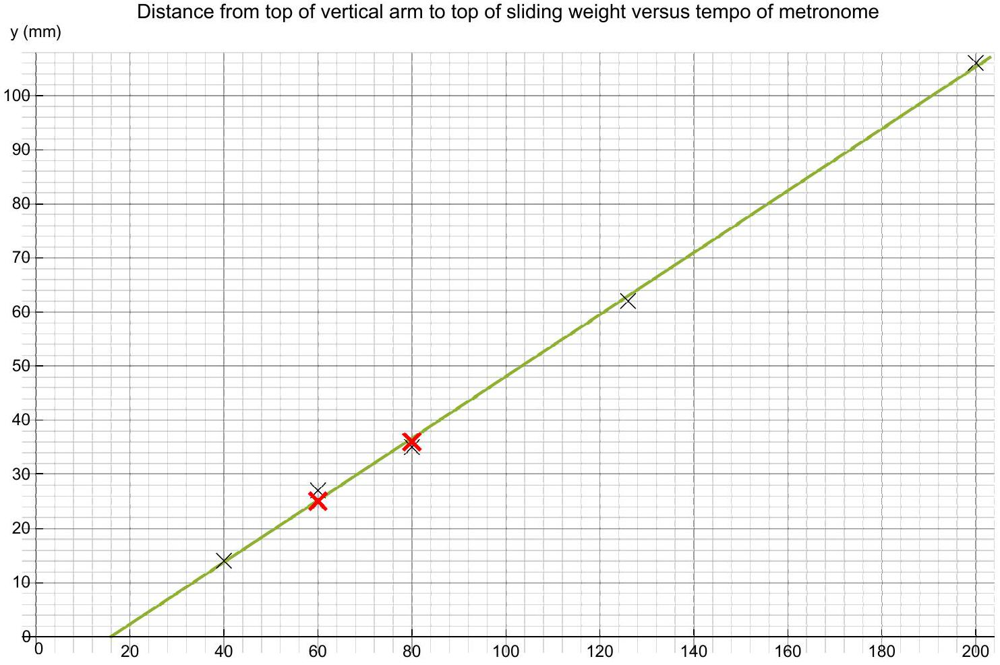

## Question 14

Suggested Time: 25 min
Metronomes are tools sometimes used by musicians to help make their tempo more consistent when playing a piece of music. The tempo is the number of beats per minute. The metronome pictured below is set to 138 beats per minute. When the vertical arm swings back and forth it produces clicks at either end of the swing. The tempo is changed by sliding the weight up or down the metal arm until the top of the weight aligns with the marking for the desired tempo.

a) Explain how you could use the image above to determine $y$, which is the distance from the top of the vertical arm to the top of the sliding weight, for any given tempo setting of the metronome.
Solution:
With the metronome set to 138 beats per minute the top of the weight is aligned with the 138 marking on the scale. This means that $y$ is also the distance from the tempo marking to the top of the vertical arm.
Measuring the ruler in the printed photo from 10.0cm to 26.0cm is a distance of 16.6cm. This means that we can measure distances with a ruler an multiply by a scaling factor of 16.0/16.6 to find $y$.
Markers' Comments:
There are acceptable alternative solutions including drawing horizontal lines for each marking. Regardless of the method used students needed to explain clearly how measurements were made. Any method which included constructing horizontal lines was required to include an explanation of how it was ensured that the lines were actually horizontal. Methods which involved some calculation of $y$ based on some model without first measuring for a range of values were not accepted.
b)Use this method to complete the table of tempos and distances $y$ on p. 8 of the answer booklet.
Solution:

| Tempo (beats per minute) | Measured length (mm) | y (mm) |
| :--- | :--- | :--- |
| 40 | 15 | 14 |
| 60 | 25 | 24 |
| 80 | 37 | 36 |
| 126 | 64 | 62 |
| 200 | 110 | 106 |

Markers' Comments:
The blank column was provided to record direct measurements before any calculation was completed. The vast majority of methods involved making a measurement such as the position of a tempo marking on the ruler, before calculating $y$, such as by subtracting the position of the top of the vertical arm. Many students made measurements and performed calculations without recording the intermediate step. This was not given full credit as it is not good practice.

c) A graph of $y$ versus tempo has been plotted on p. 9 of the answer booklet. However, one or two of the points are not plotted correctly.
    (i) Complete the graph by adding any necessary labels and markings.
    (ii) Correct any points which have not been correctly plotted.
    (iii) Draw a line of best fit to the data.

Solution:

(i) Scales, axis labels including units and a title have been added in the graph above.
(ii) Two points needed correction. The correct points have been marked as thick red crosses.
(iii) A line of best fit is drawn in green on the graph above.

Markers' Comments:
Many students had difficulty reading the scales, especially where points did not fall exactly on grid lines. Some students forced their line of best fit to pass through the origin. There is no reason to expect it to pass through that point, so it should not be forced to do so.

d) Calculate the slope of the graph and explain what information this gives about the metronome.
Solution:
The slope of the graph is
$$
\begin{aligned}
m & = \frac { \text { rise } } { \text { run } } \\
& = \frac { 94 \mathrm {~mm} - 16 \mathrm {~mm} } { 180 \text { beats } / \text { minute } - 44 \text { beats } / \text { minute } } \\
& = 0.57 \mathrm {~mm} \text { minutes } / \text { beat } .
\end{aligned}
$$
This tells us that the slider must be moved downwards by 0.57mm to increase the tempo by 1 beat per minute.

## Markers' Comments:

When calculating the slope it is important to pick two points from the line of best fit, not two data points, otherwise there is not value in drawing the line of best fit. When calculating the slope it is important to also calculate the units for the slope, which are the units of the rise divided by the units of the run. Values which differed a little from that given above, but with calculations which were correct and made it possible to follow the reasoning were given full credit. Many students did not provide an interpretation of the meaning of the slope.

e) What is the lowest tempo to which the metronome could be set? Explain your reasoning.
Solution:
The $x$-intercept of the graph is the point where the weight has reached the top of the vertical arm. From the graph above the tempo of the $x$-intercept is 16 beats per minute.
Markers' Comments:
Some students made this part overly complicated by trying to use a different point and a value for the slope to calculate the $x$-intercept. The simplest method was to extrapolate the line of best fit to find the intercept.
f) The graphed data points do not lie exactly on the line of best fit. Suggest the most likely reason(s) why this may be so and give a detailed but concise explanation of the reasons for your suggestions in the allocated space on p. 9 of the answer booklet.
Solution:
There are two main reasons why points may not lie on a line of best fit. The first is that there is a non-linear relationship, which is the most likely reason in this case. The end points are both above the line of best fit with the three middle points below. Of those, the central point is the furthest below the line of best fit. This suggests that random errors are low and that the relationship is actually slightly non-linear.
The other acceptable reason is due to errors which may have related to how the camera, ruler and metronome were aligned in the photo, or perhaps random errors in the measurements of the distances.
Markers' Comments:
Many students had difficulty with the technical language to describe these possible causes. When discussing the non-linearity of the data many students used the word "exponential" instead of the term "non-linear" when describing a relationship which is not a straight line. Whilst an exponential relationship is non-linear, it is not the only type of non-linear relationship.
When discussing possible sources of experimental error many students attributed it to the metronome being old and broken, however, the markings are unlikely to move and the length of the arm is not likely to change as the metronome ages. Good possible sources of error needed to relate to how the photo was taken, e.g. the ruler and/or vertical arm being tilted, or not in the same plane or the method of taking measurements from the photo used by the student.

## Integrity of Competition

If there is evidence of collusion or other academic dishonesty, students will be disqualified. Markers' decisions are final.
