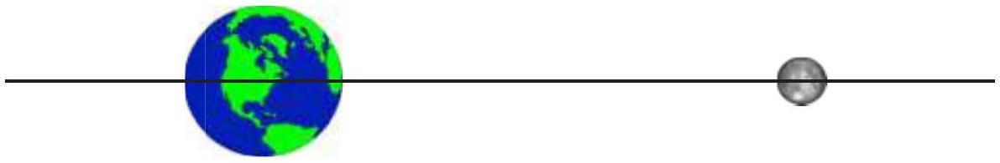

Question 5
The Earth and the Moon both exert gravitational forces on objects in their vicinity. Imagine a line joining the Earth to the Moon, and extending to either side, as shown below (not to scale). Consider placing an object along this line. Where along this line is the net gravitational force on the object due to the Earth and the Moon equal to zero?

a. On the far side of the Earth from the Moon.
b. Between the Earth and the Moon, but closer to the Earth than to the Moon.
c. Halfway between the Earth and the Moon.
d. Between the Earth and the Moon, but closer to the Moon than to the Earth.
e. Nowhere along the line.

Solution: d. The gravitational force exerted by a spherical object like the Earth or the Moon acts towards the centre of that object. For the two gravitational forces to cancel each other they must be equal in magnitude and opposite in direction. The forces are only opposite in direction along the segment of the line between the two bodies. The gravitational force towards a more massive object is greater, and the gravitational force is larger closer to an object. For the forces to have equal magnitudes an object must be closer to the less massive Moon than to the Earth.
