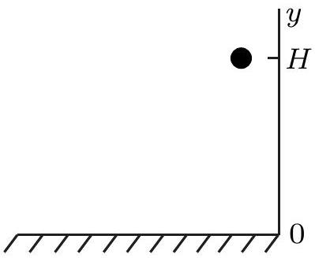
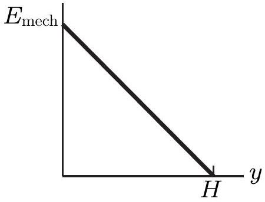
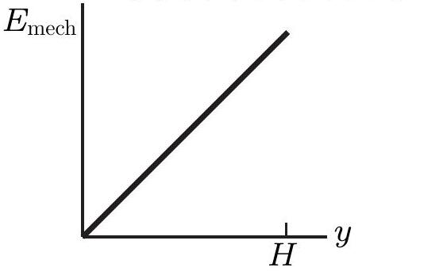
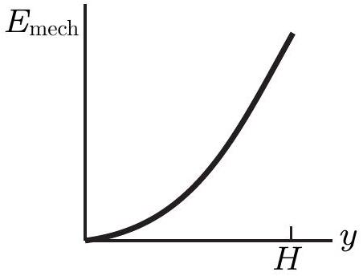
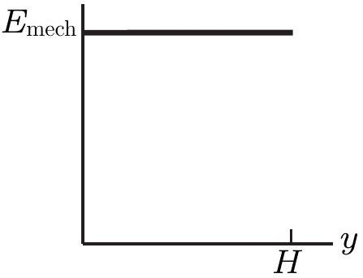

## Question 7

A ball is held at a height $H$ above a floor, as sketched in the diagram on the right. It is then released and falls to the floor. If air resistance can be ignored, which of the five graphs below (labelled a. to e. beneath each graph) correctly gives the mechanical energy $E _ { \text {mech } }$ of the Earth-ball system as a function of the altitude $y$ of the ball?

$E _ { \text {mech } }$

a.

b.

c.

d.

e.

Solution: e. As the questions asks about the energy of the Earth-ball system, we must include both kinetic energy and gravitational potential energy as part of the mechanical energy. As the ball falls gravitational potential energy is converted to kinetic energy but the total energy of the Earth-ball system remains constant as energy is conserved.
