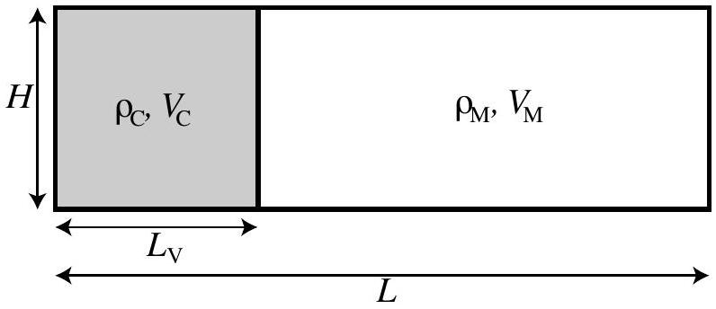
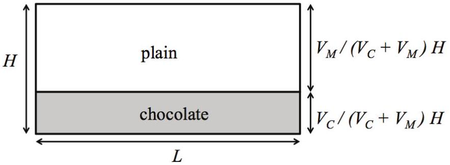
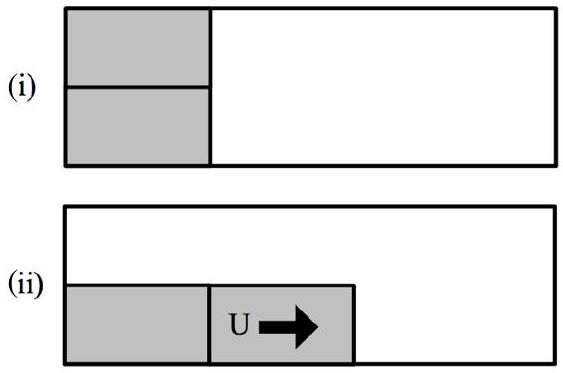
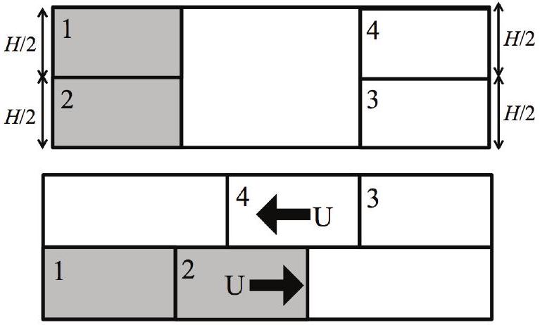

## Question 11

Suggested Time: 20 min
Niamh, the Milo enthusiast, is interested in the physics behind her favourite "energy food drink". To investigate, Niamh prepares to make a huge tank of chocolate milk. Niamh fills the tank of length $L$ and height $H$ with milk, then places a partition a distance $L _ { \mathrm { V } }$ along the tank. She adds a large amount of chocolate powder to the milk to the left of the partition as shown in Figure 1 and mixes it thoroughly. The volume of milk to the left of the partition is $V _ { \mathrm { C } }$ and the density of this chocolate milk is $\rho _ { \mathrm { C } }$. The remaining volume $V _ { \mathrm { M } }$ of plain milk, which has density $\rho _ { \mathrm { M } }$, is to the right of the partition. The chocolate milk is denser than the plain milk.

Figure 1: Tank containing chocolate milk and plain milk. View from side.

The partition is removed extremely quickly. To begin with, it is assumed the chocolate milk does not mix with the plain milk.

a) Draw a diagram of the contents of the tank a long time after the partition has been removed. Use the space provided on p. 2 of the Answer Booklet.

## Solution:

Markers' Comments: For full credit, students needed to include labels and dimensions on their diagram. The dimensions can be obtained as the total volume of plain milk and of chocolate milk both remain constant. A very small layer of mixed milk between the chocolate milk and plain milk was accepted.

Upon removing the partition Niamh observes that the chocolate milk spreads through the tank like a wave. She constructs a basic model of the chocolate milk wave in order to find out how quickly it travels. She divides the chocolate milk behind the partition into two equal sections. When the partition is removed, the bottom section is displaced by the top section and begins to move with velocity $U$. This process is depicted in Figure 2.

Figure 2: Niamh's model of the chocolate milk wave. (i) Before the partition is removed. (ii) after the partition is removed.

b) Find $U$.
Section 1 (top of choc milk) moves down and loses gravitational potential energy (GPE).
Section 2 (bottom of choc milk) moves across and gains kinetic energy.
Section 3 - plain milk of equal volume to section $2 = V _ { C } / 2$ - is displaced upwards and gains gravitational potential energy.
Section 4 - plain milk of equal volume to section $2 = V _ { C } / 2$ - is displaced in the opposite direction to section 2 and gains kinetic energy.

Statement of conservation of energy:
$$
\mathrm { GPE } _ { 1 } = \mathrm { KE } _ { 2 } + \mathrm { GPE } _ { 3 } + \mathrm { KE } _ { 4 }
$$
Mass of section $1 =$ mass of section 2, $m _ { 1 } = m _ { 2 } = \rho _ { C } V _ { C } / 2$
Mass of section $3 =$ mass of section 4, $m _ { 3 } = m _ { 4 } = \rho _ { M } V _ { C } / 2$
The centre of section 1 moves down $H / 2$, while the centre of section 3 moves up $H / 2$.
$$
\mathrm { GPE } _ { 1 } = m _ { 1 } g \Delta h _ { 1 } = \rho _ { C } \frac { V _ { C } } { 2 } g \left( \frac { H } { 2 } \right)
$$
Page 8 of 22

$$
\mathrm { GPE } _ { 3 } = m _ { 3 } g \Delta h _ { 2 } = \rho _ { C } \frac { V _ { M } } { 2 } g \left( \frac { H } { 2 } \right)
$$

Expression for kinetic energies of section 2 and section 4:

$$
\begin{aligned}
& \mathrm { KE } _ { 2 } = \frac { 1 } { 2 } m _ { 2 } U ^ { 2 } = \frac { 1 } { 4 } \rho _ { C } V _ { C } U ^ { 2 } \\
& \mathrm { KE } _ { 4 } = \frac { 1 } { 2 } m _ { 4 } U ^ { 2 } = \frac { 1 } { 4 } \rho _ { M } V _ { C } U ^ { 2 }
\end{aligned}
$$

Putting it all together:

$$
\begin{align*}
\rho _ { C } \frac { V _ { C } } { 4 } g H & = \frac { 1 } { 4 } \rho _ { C } V _ { C } U ^ { 2 } + \rho _ { M } \frac { V _ { C } } { 4 } g H + \frac { 1 } { 4 } \rho _ { M } V _ { C } U ^ { 2 }  \tag{1}\\
\rho _ { C } g H - \rho _ { M } g H & = \left( \rho _ { C } + \rho _ { M } \right) U ^ { 2 }  \tag{2}\\
g H \frac { \rho _ { C } - \rho _ { M } } { \rho _ { C } + \rho _ { M } } & = U ^ { 2 }  \tag{3}\\
\therefore U & = \sqrt { g H \frac { \rho _ { C } - \rho _ { M } } { \rho _ { C } + \rho _ { M } } } \tag{4}
\end{align*}
$$

Markers' Comments:
As this model includes many effects those students who included some gravitational potential energy and some kinetic energy were given most of the available credit. Students were also given credit if they identified qualitatively that the movement of the plain milk would affect the chocolate milk wave.

Some students attempted to apply equations for motion under constant acceleration. However, these equations do not apply in this situation.

c) Two limitations of this model are that
    - the chocolate milk and plain milk might mix, and
    - the chocolate powder might not be completely dissolved in the chocolate milk.

Complete the table on p. 3 of the Answer Booklet by

(i) identifying any additional significant limitations of the wave model, and
(ii) briefly qualitatively discussing how each of the identified effects may affect the chocolate milk wave.

Solution:

- Chocolate and plain milk might mix: any mixing will dissipate the kinetic energy of the wave at a microscopic level. The velocity of the wave will be reduced. The wave will be less clearly defined.
- Chocolate powder not completely dissolved: any chocolate powder undissolved will settle at the bottom of the tank. If the settling speed is quite fast, then the chocolate milk powder will fall to the bottom of the milk behind the partition. When the partition is removed, milk behind the partition at the top will be less dense, and will not move as quickly to displace the bottom portion of chocolate milk. The wave will be slower and smaller. If the settling speed of the chocolate powder is not so fast, then as the wave moves along the bottom of the tank, the chocolate powder falls down out of the wave. This reduces the density difference between the fluids, and the wave will peter out.
- Partition not raised instantaneously: there will be a leading edge to the wave as there is more pressure on the chocolate milk at the bottom of the tank to begin with. The plain milk cannot move back towards the chocolate milk side straightaway, as in the block model.
- Viscosity / friction / momentum transport: the fluid on the bottom and sides of the tank (the boundary layer) is stationary. The "friction" between the wave and the sides of the tank will slow the wave down. The chocolate milk and plain milk will also exert forces on each other. The wave is not made up of two blocks!
- Turbulence: instabilities etc. on the edge of the wave will slow the wave down.
- Finite tank: there will be plain milk that needs to be "pushed" out of the way of the chocolate wave. The tank is of finite length, so the plain milk will push back off the tank edge.

Markers' Comments:
Students sometimes suggested limitations which were either not relevant or not significant. Some examples include evaporation of milk, bacteria growth or Niamh drinking the milk. Students were not required to use technical language in their answers, and successful answers often drew on personal experiences such as dissolving Milo and waves in a bath.
