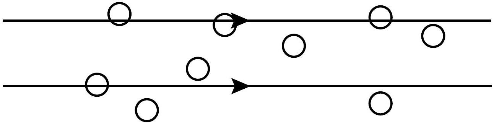

Question 12
Suggested Time: 25 min
Miriam the Magician likes to perform magic tricks and also studies physics. She has realised that many of her magic tricks work by appearing to break physical laws. For example, she can make it look like a large scarf appeared from nowhere.

a) Explain why claiming that the scarf appeared from nowhere is not physically reasonable.
Solution: It violates the law of conservation of matter.
Markers' Comments: The most common difficulty was students not identifying the physical principle used.
b) One place that Miriam can hide a scarf is in her hand. Estimate the largest volume of an object which Miriam could fit in a single closed hand.
Explain the calculations you used to make your estimate.
Solution: A sample calculation is as follows:
Inside a closed hand the largest space that can be made is a circular prism 2 cm in diameter and 8 cm long. Its volume is
$$
\begin{aligned}
V & = \pi r ^ { 2 } l \\
& \approx \pi \times 1 ^ { 2 } \times 8 \mathrm {~cm} ^ { 3 } \\
& \approx 30 \mathrm {~cm} ^ { 3 } \\
& \approx 3 \times 10 ^ { - 5 } \mathrm {~m} ^ { 3 }
\end{aligned}
$$
Markers' Comments: A range of answers from around $5 \mathrm {~cm} ^ { 3 }$ to $100 \mathrm {~cm} ^ { 3 }$ was accepted.
Students much more commonly significantly overestimated inside-fist volume than underestimated it. Those students who described actually holding and measuring physical objects (pens, etc) always did well. Those who described visualised holding objects also generally did well.
Many explanations involved the shape used for the estimation but not how the values were estimated. Many answers had no explanation, which was a required part of the answer.
c) Miriam has a thin silk scarf which is 0.90 m long and 0.42 m wide. If she can hide this scarf in her closed hand, how thick is the material of the scarf?
Solution: The scarf is a rectangular prism so $V = T L W$, where $T$ is the thickness, and $L$ and $W$ are the length and width respectively. Hence,
$$
\begin{aligned}
T & = \frac { V } { L W } \\
& \approx \frac { 3 \times 10 ^ { - 5 } \mathrm {~m} ^ { 3 } } { 0.90 \mathrm {~m} \times 0.42 \mathrm {~m} } \\
& \approx 8 \times 10 ^ { - 5 } \mathrm {~m}
\end{aligned}
$$
Markers' Comments: The most common mistakes in this part were unit conversion mistakes which led to unreasonable answers. Despite the answers being unreasonable, very few students noticed this and corrected their work.
Some students overcomplicated the solution by attempting to model a folded or rolled scarf.

For some tricks Miriam uses mist, which is made of very many small water droplets, to hide larger objects. Miriam likes to use as little water as possible to make mist so she doesn't get her equipment wet. From her physics she knows that mist hides objects by scattering light, so that rather than passing straight through the light is reflected in random directions. The amount that light is scattered by a cloud of mist depends on the number of water droplets the light has to interact with to get through the cloud. This can be estimated by calculating the average number of droplets a light ray would pass through if it travelled on a straight path through a cloud of mist. In the diagram below the straight path near the top of the image passes through 3 droplets and the straight path lower down passes through only one droplet.

Miriam has a mist making machine which can be set to make water droplets of selected radius $r$. Miriam puts a volume of water $V _ { \mathrm { w } }$ into the machine and fills a cube with side length $a$ with mist.

d) (i) Identify two ways in which changing the droplet size would affect the amount that light scatters. Briefly justify your answer.
Solution:
    - Larger droplet size means fewer droplets, which means less light scattered.
        - A larger droplet is more likely to be intercepted by a light ray, meaning more light is scattered.

Markers' Comments: It was very common for students to not clearly describe the effects of changing $r$. One particularly common mistake was to use the words "change" and "increase" interchangeably. Some students also stated two effects which were exactly opposite, which is not stating two separate reasons.
Other common mistakes include:

- confusing scattering and reflection
- not understanding that the total water volume was constant
- not distinguishing between surface area and cross sectional area
- including effects which are not relevant, e.g. the curvature of droplet, the time the light takes to get through the droplet.
(ii) Find the number of mist droplets in the cloud.
Solution: The volume of water $V _ { w }$ makes $N$ spherical water droplets, each with radius $r$. Hence,
$$
\begin{aligned}
V _ { w } & = N \frac { 4 } { 3 } \pi r ^ { 3 } \\
N & = \frac { 3 V _ { w } } { 4 \pi r ^ { 3 } }
\end{aligned}
$$
Markers' Comments: The answer required is an expression, however, many students tried to use numbers from earlier parts of the question.

Students had difficulty calculating the volumes of the spheres, and sometimes gave answers that depended on the volume of the cube which does not affect the number of droplets in the cloud.
(iii) If there were only one droplet of this size in the cube, calculate the probability a light ray passing through the cube would hit it.
Solution: The probability of a ray intersecting with a droplet depends on the cross sectional area of the droplet, which is the area blocked by the droplet. Spherical droplets have is a circular cross section. The cross sectional area of the droplet is $A _ { d } = \pi r ^ { 2 }$ and the cross sectional area of the cube is $A _ { c } = a ^ { 2 }$. This means that the probability of the ray intersecting a droplet is
$$
\begin{aligned}
P & = \frac { A _ { d } } { A _ { c } } \\
& = \frac { \pi r ^ { 2 } } { a ^ { 2 } }
\end{aligned}
$$
Markers' Comments: Students found this part difficult, and many gave an answer by counting in the diagram.
(iv) For a cloud of mist to obscure all objects behind it a straight path through the mist must pass through an average of at least 7.5 droplets. If $r = 4.0 \times 10 ^ { - 6 } \mathrm {~m}$ and $a = 1 \mathrm {~m}$, how much water does Miriam need to make the cloud of mist obscure all objects behind it.
Solution: For a light ray to travel through on average 7.5 droplets, the total cross sectional area of the droplets must be 7.5 times more than the cross sectional area of the cube. Hence,
$$
\begin{aligned}
N \pi r ^ { 2 } & = 7.5 a ^ { 2 } \\
N & = \frac { 7.5 a ^ { 2 } } { \pi r ^ { 2 } }
\end{aligned}
$$
To form this many droplets, Miriam needs a volume of water
$$
\begin{aligned}
V & = N \frac { 4 } { 3 } \pi r ^ { 3 } \\
& = \frac { 7.5 a ^ { 2 } } { \pi r ^ { 2 } } \frac { 4 } { 3 } \pi r ^ { 3 } \\
& = 10 a ^ { 2 } r \\
& = 4 \times 10 ^ { - 5 } \mathrm {~m} ^ { 3 } \\
& = 40 \mathrm {~mL}
\end{aligned}
$$
Markers' Comments: This part was better attempted than the previous two parts. It is pleasing to see students being willing to attempt all parts of a question.
There were many approximate answers and some application of formulas without students thinking about their applicability here.
