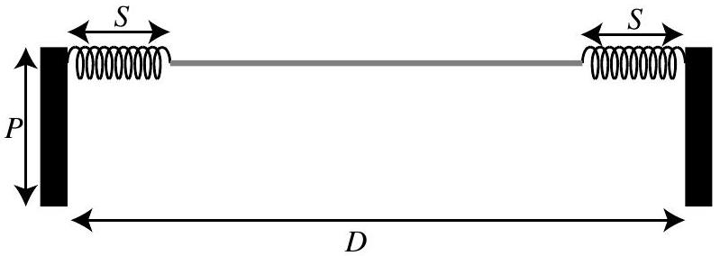
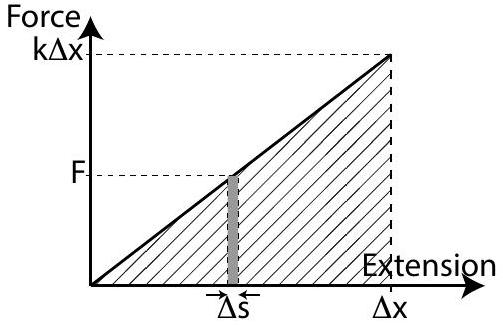
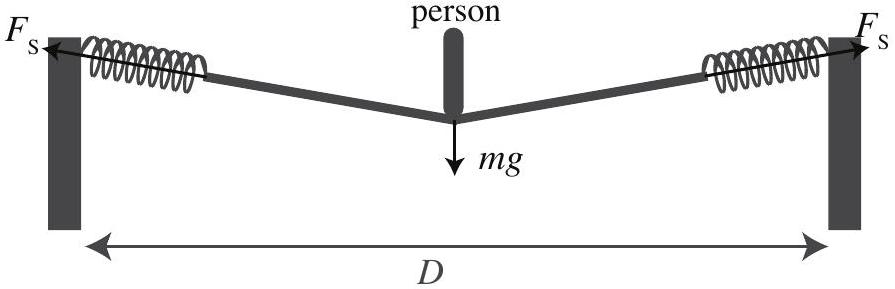
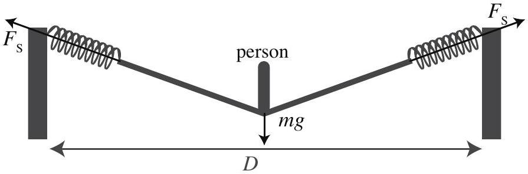
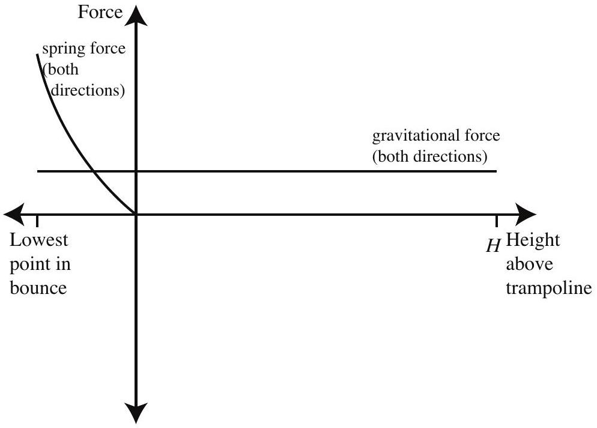
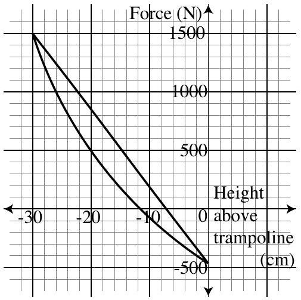

Question 13
Suggested Time: 25 min
A simple, ideal, 2-dimensional model of a trampoline is shown below. Two poles of height $P$ are fixed in the ground a distance $D$ apart. A spring of length $S$ is joined to each of the poles and the other ends of the springs are joined to a length of unstretchable material which is just long enough to fit between the springs. The springs and the material are assumed to have no mass.

When a spring is stretched it will exert a restoring force. This force is proportional to the extension $\Delta x$ of the spring, which is the extra length of the stretched spring, so $F _ { \text {spring } } = - k \Delta x$.
The work done by a constant force $F$ which moves an object a distance $\Delta s$ is $W = F \Delta s$. As shown in the diagram to the right, the work done to stretch a spring by a short distance $\Delta s$ is the area of the grey rectangle. Hence, the work done to stretch a spring to an extension of $\Delta x$ is the area of the triangle filled with diagonal lines, $W _ { \text {spring } } = \frac { 1 } { 2 } k ( \Delta x ) ^ { 2 }$.

a) On p. 6 of the Answer Booklet, sketch the shape of the springs and material, and the forces acting on the combined person and material system, if a person sits still on the centre of the trampoline.

Solution:

Markers' Comments:
The shape of the trampoline was often drawn with curves, or with a straight section at the bottom. As we are treating the springs and material as having no mass they will form a straight line.
Students also needed to take care to draw the vectors so that it looks like the sum is zero.

The person begins jumping on the trampoline and then reaches a state where the ideal trampoline is bouncing them up into the air to a height $H$ every bounce.

b) On p. 6 of the Answer Booklet, sketch the shape of the springs and material, and the forces acting on the combined person and material system, when the person is at the lowest point of the bounce on the trampoline. Justify the differences and similarities between sketches for parts (a) and (b).

## Solution:

Similarities:

- trampoline surface makes straight lines from person to springs
- forces due to springs are along the trampoline surface
- gravitational force on person is the same
- the sum of the two spring forces is vertically upwards

Differences:
At the bottom of the bounce

- the springs are more stretched,
- so there is a greater force exerted by the springs,
- the angle to the horizontal of the lines of the trampoline surface is larger, and
- the sum of the two spring forces is larger than the gravitational force.

## Markers' Comments:

Most students gave answers which were consistent with the previous part. However, it was a common mistake to change the magnitude of the gravitational force, or to include forces which do not act on the system.

c) On the axes on p. 7 of the Answer Booklet, sketch the magnitude of each force as a function of height above the surface of the unstretched trampoline for one bounce up and down. Clearly label each curve, including the direction of motion.

Solution:

Markers' Comments:
The common mistakes in this part were similar to those in previous parts.

A real trampoline is 3-dimensional and its springs and material are not ideal. The graph to the right shows the net force upwards on a person versus height for the part of one bounce where the person is touching the trampoline.

d) (i) Find the mass of the person on the trampoline.
Solution:
When the person is at zero height above the trampoline there is no force from the trampoline. This means that the total force is the gravitational force. Hence, the $y$-intercept is $m g$. From the graph, the $y$-intercept is -450 N, hence,
$$
m = \frac { - 450 \mathrm {~N} } { g } = \frac { - 450 \mathrm {~N} } { 9.8 \mathrm {~ms} ^ { - 2 } } = 46 \mathrm {~kg} .
$$
Markers' Comments:
Many students chose the wrong point from the graph.

(ii) On the graph on p. 7 of the Answer Booklet, label the two curves "moving down" and "moving up". Justify your answer.
Solution:
There is a larger force upward when moving down than up, as then the kinetic energy will be lower after the bounce. This means that the top curve is moving down.
Markers' Comments:
Few students justified their answer.
(iii) Estimate the area between the two curves.
Solution:
By counting there are 34 squares enclosed. The area is $34 \times 100 \mathrm {~N} \times 0.02 \mathrm {~m} = 78 \mathrm {~J}$.
Markers' Comments:
Attempts to integrate to find the area were generally not successful.
Students had difficulty with the units for the area.
(iv) Explain the physical meaning of this area.
Solution:
This is the energy lost in one bounce.
Markers' Comments:
Many students had difficulty with this question. This many be in part due to many students not identifying the units of the area correctly.
