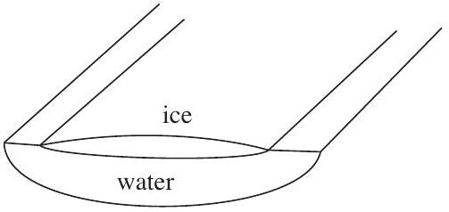

Question 14
Suggested Time: 30 min
The freezing and melting of rivers is a seasonal process throughout much of the world and plays a central role in the lives of the people nearby. The town of Thermos is situated on the River Kelvin. The river is clean and can be assumed to be water.

To freeze or melt, each kilogram of water must lose or gain an amount of energy known as the latent heat of fusion. This process takes place at the melting point of water. The specific heat capacity of a substance is the amount of energy required to raise the temperature of 1 kg of the substance by 1 kelvin. Some important values are given in the table at the end of this question.

a) The town of Thermos is 10 km long, and the townspeople are interested in the stretch of the River Kelvin next to their town. It is known that it freezes to a depth of 2.3 m each winter, and is 201 m wide as it runs past Thermos. At the start of the thawing season, the frozen part of the river is at an average of -15 degrees Celsius.
Calculate how much energy it takes to melt the ice in the 10 km stretch of the River Kelvin near the town of Thermos.

Solution:
To melt the river it must be heated to 0°C and then melted. The volume of ice on the river is $V = 4.6 \times 10 ^ { 6 } \mathrm {~m} ^ { 3 }$. This requires energy

$$
\begin{aligned}
Q & = m _ { \mathrm { i } } c _ { \mathrm { i } } \Delta T + m _ { \mathrm { i } } L \\
& = m _ { \mathrm { i } } \left( c _ { \mathrm { i } } \Delta T + L \right) \\
& = V \rho _ { i } \left( c _ { i } \Delta T + L \right) \\
& = 2.3 \times 201 \times 10 ^ { 4 } \mathrm {~m} ^ { 3 } \times 917 \mathrm {~kg} \mathrm {~m} ^ { - 3 } \left( 2.11 \times 10 ^ { 3 } \mathrm { Jkg } ^ { - 1 } \mathrm {~K} ^ { - 1 } \times 15 \mathrm {~K} + 333 \times 10 ^ { 3 } \mathrm { Jkg } ^ { - 1 } \right) \\
& = 1.55 \times 10 ^ { 15 } \mathrm {~J}
\end{aligned}
$$

Markers' Comments: Students had difficulties in remembering all the terms in the expression and had some difficulties with unit conversions. Students often included the energy to either melt or heat the ice but not both, or used the specific heat capacity of water instead of ice.

b) Using the information in the table, describe and explain the shape of the ice and water in the river during the ice melting process. Draw a diagram in the box on p. 8 of the Answer Booklet and use it in your explanation.
Solutions:
The ice floats on the water so it remains at the top of the river.
As the dirt on the river bank has a lower specific heat capacity than the ice or water it will get warmer in the Sun. Hence, it can get above 0°C which means that the ice will melt faster near the edges. Also, the dark dirt will absorb more sunlight, heating further.

The ice will also melt from underneath and from above, but not as rapidly as at the edges.
Markers' Comments: Many students did not realise that there was water under the ice, and also did not use the data provided at the end of the question to observe that the riverbank dirt would play an important role.

c) Use the supplied data to estimate the time it would take for the ice to melt if it is only heated by sunlight.
Solution:
Solar intensity is $I _ { s } = 800 \mathrm { Wm } ^ { - 2 }$ in Thermos.
We assume that there is sunlight for 10 hours per day at the time of thawing, so the heat per day is
$$
Q _ { d } = 800 \mathrm { Wm } ^ { - 2 } \times 10 \text { hours } \times 3600 \mathrm {~s} / \text { hour } = 2.9 \times 10 ^ { 7 } \mathrm {~J} \mathrm {~m} ^ { - 1 } \text { day } ^ { - 1 }
$$
The total heat required is $Q$, so $Q = Q _ { d } A t$, and hence,
$$
\begin{aligned}
t & = \frac { Q } { Q _ { d } A } \\
& = \frac { 1.55 \times 10 ^ { 15 } \mathrm {~J} } { 2.9 \times 10 ^ { 7 } \mathrm {~J} \mathrm {~m} ^ { - 1 } \text { day } ^ { - 1 } \times 1.0 \times 10 ^ { 4 } \mathrm {~m} \times 201 \mathrm {~m} } \\
& = 22 \text { days }
\end{aligned}
$$
Markers' Comments:
This part was generally well attempted. However, many students assumed that the Sun was shining 24 hours a day in Thermos.

This part is independent of the previous parts - give it a go even if you haven't tried the others!

d) Design an experiment that could be reasonably conducted at a school to test how long it would take to melt a frozen river. In the spaces on p. 8 and p. 9 of the Answer Booklet, state
    (i) your method, the materials you would use and how you would make measurements, Markers' Comments: No detailed solution is given for this part as there are many possible answers. The best answers described constructing a physical scale model of the river, with its bank, flowing water and ice, placing it in a temperature controlled environment and also having a controllable light source to model the Sun. The best answers also included details of how the process of melting ice was monitored and measured, and a range of other measurements.
Good answers included a diagram.
One point some of the very best answers considered was that it might be worth modelling a shorter section of river so that the thickness and width of the ice sheet could be more reasonable while still to scale.
Weaker answers mostly involved melting an approximately cubic chunk of ice.
    (ii) four potential sources of uncertainty you see in your method and how you would go about minimising them, and
Markers' Comments:
In this part answers depended on the method described in the previous part, so once again no detailed solution is given.
Some commonly identified sources of uncertainty include:
    - uneven illumination of the ice
    - daily temperature variation not being modelled
    - water under the ice being at a different temperature, and/or the flow of this water

- differences between riverbank in model and the dirt around a real river
- choice of size of the scale model
- precision/accuracy in measurements, especially of time to melt if only checking periodically.

Good descriptions of minimising uncertainty were very varied, but all clearly explained how aspects of the method or a proposed change to it would improve the model.
Many students found it difficult to identify how to reduce an effect, and instead described a change to the method which made the model less realistic.
Note that human error was not accepted as it does not identify the source of uncertainty specifically.

(iii) how the results from your experiment could be used to make a prediction for the full size River Kelvin.

Be concise - explain your thinking but feel free to use dot points. Please don't write an essay.
Markers' Comments:
Again, answer for this part depend on previous parts, so no detailed solution is given.
Good answers consider the variables which may affect the time to melt the ice, how these compare to the River Thermos and how they might scale the melting time. These were mostly expressed using proportionalities and/or equations.
Students generally gave very little detail in this part.

Data table:

| Quantity | Symbol | Value |
| :--- | :--- | :--- |
| Density of water | $\rho _ { \mathrm { w } }$ | $1000 \mathrm {~kg} \mathrm {~m} ^ { - 3 }$ |
| Density of ice | $\rho _ { \mathrm { i } }$ | $917 \mathrm {~kg} \mathrm {~m} ^ { - 3 }$ |
| Latent heat of fusion of water/ice | $L$ | $333 \mathrm {~kJ} \mathrm {~kg} ^ { - 1 }$ |
| Specific heat capacity of ice | $c _ { \mathrm { i } }$ | $2.11 \mathrm {~kJ} \mathrm {~kg} ^ { - 1 } \mathrm {~K} ^ { - 1 }$ |
| Specific heat capacity of water | $c _ { \mathrm { w } }$ | $4.18 \mathrm {~kJ} \mathrm {~kg} ^ { - 1 } \mathrm {~K} ^ { - 1 }$ |
| Specific heat capacity of river bank dirt in Thermos | $c _ { \mathrm { d } }$ | $1.1 \mathrm {~kJ} \mathrm {~kg} ^ { - 1 } \mathrm {~K} ^ { - 1 }$ |
| Melting point of water | $T _ { \mathrm { m } }$ | $273 \mathrm {~K} = 0 ^ { \circ } \mathrm { C }$ |
| Average daily temperature in Thermos | $T _ { \mathrm { T } }$ | $278 \mathrm {~K} = 5 ^ { \circ } \mathrm { C }$ |
| Solar intensity in Thermos | $I _ { \mathrm { S } }$ | $800 \mathrm {~W} \mathrm {~m} ^ { - 2 }$ |

## Integrity of Competition

If there is evidence of collusion or other academic dishonesty, students will be disqualified. Markers' decisions are final.
