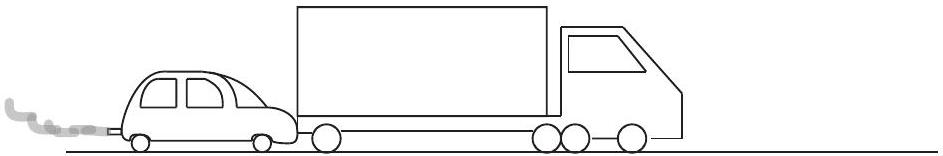

Question 2
A large truck breaks down out on the road and receives assistance from a small compact car as shown in the figure below.

The car driver attempts to push the truck with the car. Unfortunately, the truck driver has left the brakes on the truck, and neither vehicle moves. Why does the truck not move?

a. Because the pushing force of the car on the truck is equal to the pushing force of the truck on the car, but in the opposite direction.
b. Because the pushing force of the car on the truck is less than the pushing force of the truck on the car.
c. Because the frictional force of the ground on the truck is equal to the frictional force of the truck on the ground, but in the opposite direction.
d. Because the frictional force of the ground on the truck is greater than the frictional force of the truck on the ground.
e. Because the pushing force of the car on the truck is equal to the frictional force of the ground on the truck, but in the opposite direction.

Solution: e. As the truck is not accelerating the total force on the truck is zero. This means that the force due to the car pushing must be equal to, but in the opposite direction from, the force which is opposing the motion. This opposing force is the frictional force.
