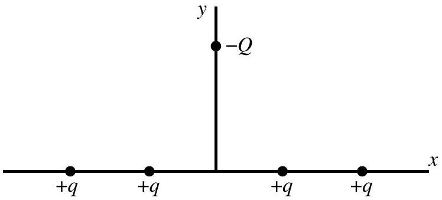

Question 7
Four particles, each of charge $+ q$, are arranged symmetrically on the $x$-axis about the origin as shown. A fifth particle of charge $- Q$ is placed on the positive $y$-axis as shown. What is the direction of the net electrostatic force on the fifth particle?

a. ↑
b. →
c. ↓
d. ←
e. The net electrostatic force on the particle of charge $- Q$ is zero.

Solution: c. The negative charge is attracted to each of the positive charges. The components of the attractive force along the $x$-axis from the inner two positive charges are, by symmetry, of equal magnitude and in opposite directions. Hence, they cancel each other. The same argument applies to the forces due to the outer two positive charges. Therefore, the total force is along the $y$-axis towards the positive charges.
