## SECTION A: MULTIPLE CHOICE USE THE ANSWER SHEET PROVIDED

Question 1
A box of mass 5 kg sits at rest on a horizontal floor. What is the Newton's third law (reaction) force to the normal force of the floor on the box (action)?

a. The weight of the box.
b. The normal force of the box on the floor.
c. The gravitational force of the Earth on the box.
d. The gravitational force of the box on the Earth.
e. There is no reaction force in this situation.

Solution: $b$. The Newton's third law reaction force to any force is the same type of force, acts on the body which exerted the first force, and is exerted by the body on which the first force acted. In this case, the reaction force is a normal force acting on the Earth and exerted by the box.

Question 2
A box of mass 5 kg sits at rest on a horizontal floor. A vertically upwards force of 20 N is exerted on the box by someone trying to lift it. What is the magnitude of the normal force exerted by the floor on the box while the 20N upwards force is being exerted?

a. 0 N (the box is no longer in contact with the floor)
b. 20N
c. 30N
d. 50N
e. 70N

Solution: c. The weight of the box is $W = m g = - 5 \mathrm {~kg} \times 10 \mathrm {~m} \mathrm {~s} ^ { - 2 } = - 50 \mathrm {~N}$, where $m$ is the mass of the box, and the negative sign means that the force is directed downwards. As the box is at rest, not accelerating, the total force on the box is 0 N. Hence, $W + V + N = 0$ where $V = 20 \mathrm {~N}$ is the upwards force exerted by someone trying to lift it, and $N$ is the normal force. Rearranging, $N = - W - N = ( 50 - 20 ) \mathrm { N } = 30 \mathrm {~N}$.

Question 3
An elevator is moving upwards with constant upwards acceleration. At some point in the elevator's motion, a bolt breaks loose and drops from the ceiling. What is the motion of the bolt as seen by an observer standing inside the elevator? Ignore air resistance.

a. The bolt immediately moves downwards, at constant speed.
b. The bolt initially moves upwards, then slows, reverses direction and moves downwards.
c. The bolt immediately moves downwards, with acceleration less than $g$.
d. The bolt immediately moves downwards, with acceleration equal to $g$.
e. The bolt immediately moves downwards, with acceleration greater than $g$.

Solution: e. For the observer in the elevator the bolt is initially stationary. From the frame of reference of the building the bolt accelerates down at $g$, and the observer accelerates upwards. This means that, relative to the observer, the bolt accelerates downwards with acceleration greater than $g$.

## Question 4

Trish is moving boxes of photocopy paper on a trolley. The top of the trolley is flat, and a box sits on it as shown. Trish pushes the trolley, accelerating it to the left, as shown. Which of the following diagrams correctly shows the forces acting on the box as it is accelerating to the left? The length of the force arrows is proportional to the size of the force. Ignore air resistance.
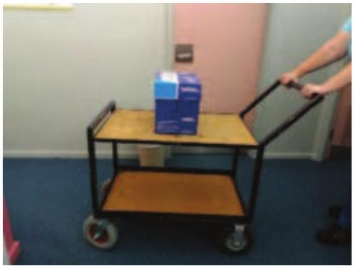

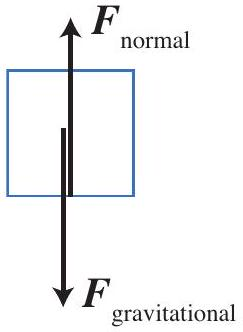
a.

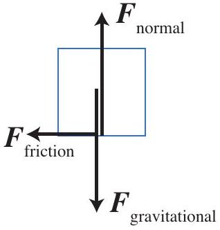
b.

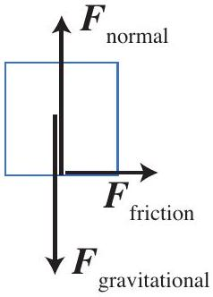
c.

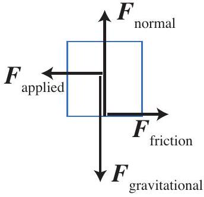
d.

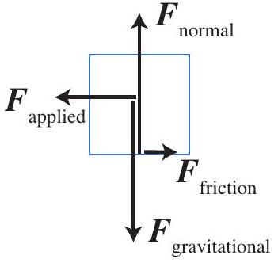
e.

Solution: $b$. As the box is accelerating to the left, the total force acting on it must be to the left. The forces which act on the box are the gravitational force downwards, the normal force from the trolley which is directed upwards, perpendicular to the trolley surface, and the frictional force of the trolley on the box which is directed in some direction along the surface of the trolley. As the frictional force can have no vertical component, the normal force must be equal in magnitude to the weight, so that the vertical acceleration is zero. Only the frictional force may act to the left, so this must be the force accelerating the box.

## Question 5

Once the trolley is at the desired speed, Trish keeps it at that constant speed. Which of the following diagrams correctly shows the forces acting on the box as it moves at constant speed to the left? The length of the force arrows is proportional to the size of the force. Ignore air resistance.

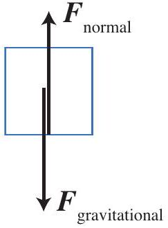
a.

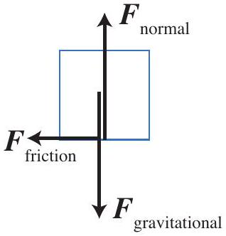
b.

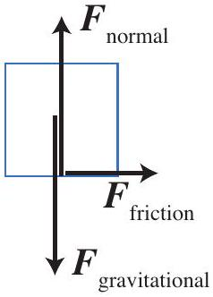
c.

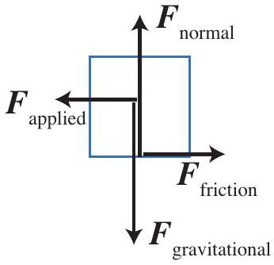
d.

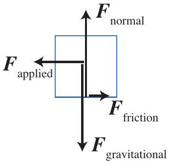
e.

Solution: a. As the box is not accelerating, the total force acting on it must be zero. The forces which act on the box are the gravitational force downwards, the normal force from the trolley which is directed upwards, perpendicular to the trolley surface, and the frictional force of the trolley on the box which is directed in some direction along the surface of the trolley. As the frictional force can have no vertical component, the normal force must be equal in magnitude to the weight, so that the vertical acceleration is zero. As there is no force which can cancel the frictional force, it must be zero so that the total force on the box is zero.

Question 6
Ali and Beatrice are doing an experiment to measure the spring constant, $k$, of a spring. The spring constant is a measure of how stiff or stretchy a spring is. Ali is going to use a static method, using the equation $k = \frac { F _ { \text {applied } } } { s } = \frac { m g } { s }$, where $m$ is the mass of a weight attached to the hanging spring, and $s$ is the distance that the spring stretches by.
Which method will give Ali the most accurate and precise result for $k$ ?

a. Hang one weight on the spring, and measure how far the spring stretches. Put this pair of values into the equation.
b. Hang two different weights on the spring (one at a time), and measure how far each weight stretches the spring. Put these two pairs of values into the equation and average the results.
c. Hang at least three different weights on the spring (one at a time), and measure how far each weight stretches the spring. Put these pairs of values into the equation and average the results.
d. Hang at least three different weights on the spring (one at a time), and measure how far each weight stretches the spring. Plot a graph of $m$ vs $s$ and find the value of $k$ from the gradient of a line of best fit for the data.
e. Hang at least three different weights on the spring (one at a time), and measure how far each weight stretches the spring. Plot a graph of $m$ vs $s$ and find the value of $k$ from the gradient of a line of best fit to the data that also passes through the origin.

Solution: d. Using more data is likely to increase the precision. Using the slope of the line of best fit, rather than the average, or the slope of a line through the origin, increases the accuracy because if there is a systematic offset in the data it will not affect the slope of the line of best fit.

Question 7
Ali has spent too much time deciding what to do, and only takes one pair of measurements. He measures the mass of the weight to be $( 100 \pm 5 ) \mathrm { g }$ and the stretch, $s$, when he hangs it on the spring to be $( 5.0 \pm 0.5 )$ cm. Based on these data, the spring constant is:

a. $( 20.0 \pm 0.2 ) \mathrm { N } / \mathrm { m }$
b. (20±3) N/m
c. $( 20 \pm 6 ) \mathrm { N } / \mathrm { m }$
d. $( 200 \pm 20 ) \mathrm { N } / \mathrm { m }$
e. $( 200 \pm 30 ) \mathrm { N } / \mathrm { m }$

Solution: $\mathrm { b } . k = \frac { F _ { \text {applied } } } { s } = \frac { m g } { s } = \frac { 0.100 \mathrm {~kg} \times 10 \mathrm {~m} , \mathrm {~s} ^ { - 2 } } { 0.05 \mathrm {~m} } = 20.0 \mathrm {~N} / \mathrm { m }$. When multiplying or dividing numbers the relative uncertainties add. Here the relative uncertainty in $s$ is $\frac { \Delta s } { s } = \frac { 0.5 } { 5.0 } = 0.1$ and the relative uncertainty in $m$ is $\Delta m / m = 5 / 100 = 0.05$. Hence, $\Delta k / k = \Delta s / s + \Delta m / m = 0.1 + 0.05 = 0.15$, and $\Delta k = 0.15 \times 20.0 = 3 \mathrm {~N} / \mathrm { m }$.

Question 8
Beatrice has decided to use a dynamic method to find $k$ for her spring. She measures the period, $T$, of oscillation for a mass, $m$, on a spring for a series of different masses. The equation that relates period to mass is: $T = 2 \pi \sqrt { \frac { m } { k } }$. If Beatrice plots a graph of $T$ vs $m$, which of the following graphs will her plot look like?
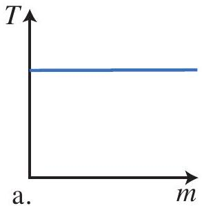
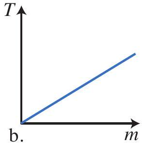

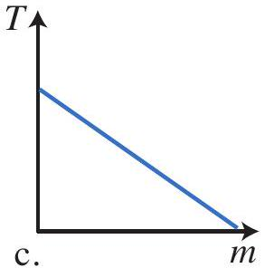
e.

Solution: e. Since $T \propto \sqrt { m }$ the shape of the curve is the same as $y = \sqrt { x }$.
Question 9
Beatrice wants to plot a straight line graph and find the value of $k$ from the gradient of the graph. To do this, she should:

a. Plot $T$ vs $m$, and then the gradient is $\frac { 1 } { k }$.
b. Plot $T$ vs $m$, and then the gradient is $\frac { 2 \pi } { \sqrt { k } }$.
c. Plot $T ^ { 2 }$ vs $m$, and then the gradient is $\frac { 2 \pi } { \sqrt { k } }$.
d. Plot $T ^ { 2 }$ vs $m$, and then the gradient is $\frac { 2 \pi } { k }$.
e. Plot $T ^ { 2 }$ vs $m$, and then the gradient is $\frac { 4 \pi ^ { 2 } } { k }$.

Solution: e. Since $T = 2 \pi \sqrt { \frac { m } { k } } , T ^ { 2 } = ( 2 \pi ) ^ { 2 } \frac { m } { k }$. This means $T ^ { 2 } \propto m$, with a constant of proportionality $4 \pi ^ { 2 } / k$. Hence, a graph of $T ^ { 2 }$ vs $m$ is a straight line with gradient $\frac { 4 \pi ^ { 2 } } { k }$.

Question 10
An elevator is moving upwards a constant speed. Ignoring any friction, which statement is correct?

a. The kinetic energy of the elevator is constant.
b. The gravitational potential energy of the Earth-Elevator system is constant.
c. The mechanical energy of the Earth-Elevator system is constant.
d. a and c are both correct, but b is not correct.
e. a, b and c are all correct.

Solution: a. As the elevator is moving at a constant speed, its kinetic energy is also constant. The gravitational potential energy of the Earth-Elevator system is increasing as the separation between the two objects increases. The total mechanical energy of the system is the sum of the kinetic and gravitational potential energies in this case, so it is also increasing.

## SECTION B: WRITTEN ANSWER QUESTIONS USE THE ANSWER BOOKLET PROVIDED

Throughout, take the acceleration due to gravity to be $9.8 \mathrm {~ms} ^ { - 2 }$.

Question 11
Zara and Jackie are excited about their new desk chairs. Zara plans to sit and do physics in comfort. Jackie plans to move around on a chair without touching the ground or anything else. "But that's physically impossible!", says Zara. Jackie replies, "No! I've done it before. I lean forward really slowly, and then lean back as fast as I can." Jackie shows Zara how to do it, and she wants to understand it.

Zara calls Jackie's body from the waist up Object 1, and Jackie's legs, from the waist down, and the chair combined Object 2. Zara models the fast part of Jackie's motion using the principle of conservation of momentum. In other words, she thinks that the total momentum of Jackie and the chair (Object 1 + Object 2) remains unchanged while Jackie leans backwards. (Hint: momentum $p = m v$ )

Zara identifies three important times in her model

- $t _ { 1 }$ when Jackie is stationary just before leaning back,
- $t _ { 2 }$ when Jackie is in the process of leaning back, and
- $t _ { 3 }$ when Jackie's back hits the back of the chair.

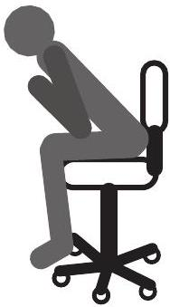
Jackie at $t _ { 1 }$

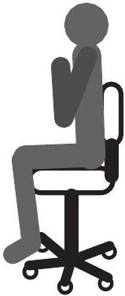
Jackie at $t _ { 3 }$

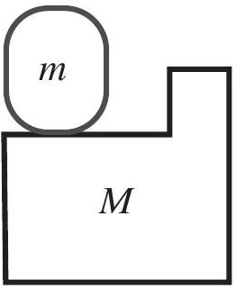
Zara's model at $t _ { 1 }$

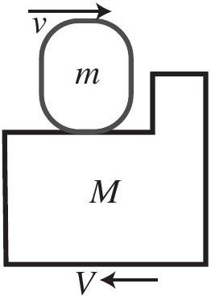
Zara's model at $t _ { 2 }$

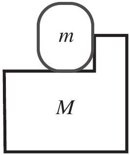
Zara's model at $t _ { 3 }$

| Object | Mass | momentum at $t _ { 1 }$ | velocity at $t _ { 2 }$ | velocity after $t _ { 3 }$ | displacement from $t _ { 1 }$ to $t _ { 3 }$ |
| :--- | :--- | :--- | :--- | :--- | :--- |
| 1 | $m = 25 \mathrm {~kg}$ | $p _ { m 1 } =$ | $v _ { m 2 } = - 0.5 \mathrm {~ms} ^ { - 1 }$ | $v _ { m 3 } =$ | $s _ { m } = - 30 \mathrm {~cm}$ |
| 2 | $M = 35 \mathrm {~kg}$ | $p _ { M 1 } =$ | $v _ { M 2 } =$ | $v _ { M 3 } =$ | $s _ { M } =$ |
| 1+2 | $m + M =$ | $p _ { \text {tot } 1 } =$ | $v _ { \mathrm { cm } 2 } =$ | $v _ { \mathrm { cm } 3 } =$ | $s _ { \mathrm { cm } } =$ |

$s _ { \mathrm { cm } }$ is the position of the centre of mass, which is the average position of all the mass, and $v _ { \mathrm { cm } 2 }$ and $v _ { \mathrm { cm } 3 }$ are the velocities of this point at times $t _ { 2 }$ and $t _ { 3 }$ respectively.

a) (i) By applying the principle of conservation of momentum, complete the copy of the table above which is on p. 2 of the Answer Booklet. Show your reasoning below the table.
    (ii) Explain why, in Zara's model, the position of the centre of mass of Jackie and the chair never changes, regardless of how far or fast Jackie moves.

## Solution:

(i) At $t _ { 1 }$ Jackie is stationary so the momentum of each part is zero, and so the total momentum $p _ { \text {tot } 1 } = 0$.
At $t _ { 2 }$ the total momentum is assumed to be conserved so $p _ { \text {tot } 2 } = p _ { \text {tot } 1 } = 0$.

$$
\begin{aligned}
p _ { \mathrm { tot } 2 } & = p _ { m 1 } + p _ { M 1 } \\
0 & = m v _ { m 2 } + M v _ { M 2 } \\
M v _ { M 2 } & = - m v _ { m 2 } \\
v _ { M 2 } & = - \frac { m } { M } v _ { m 2 } \\
& = - \frac { 25 } { 35 } \times - 0.5 \mathrm {~ms} ^ { - 1 }
\end{aligned}
$$

The centre of mass velocity

$$
\begin{aligned}
v _ { \mathrm { cm } 2 } & = \frac { m v _ { m 2 } + M v _ { M 2 } } { m + M } \\
& = \frac { p _ { \mathrm { tot } 2 } } { m + M } \\
& = 0 .
\end{aligned}
$$

After $t _ { 3 }$ once Jackie's back has hit the chair, both Object 1 and Object 2 have the same speed. As momentum is conserved, the total momentum remains zero, so the speeds of the two objects must also both be zero.
The displacement from $t _ { 1 }$ to $t _ { 3 }$ all occurs over the time that Jackie is leaning back. Let the duration over which Jackie is leaning back be $T$. Assuming that Jackie leans back at a constant speed the speeds of Object 1 and Object 2 over the duration $T$ are constant. Hence, $s _ { m } = v _ { m 2 } T$ and

$$
\begin{aligned}
s _ { M } & = v _ { M 2 } T \\
& = v _ { M 2 } \frac { s } { v _ { m 2 } } \\
& = 25 \mathrm {~kg} \times \frac { - 30 \mathrm {~cm} } { 35 \mathrm {~kg} } \\
& = 21 \mathrm {~cm} .
\end{aligned}
$$

As the weighted average position of the mass

$$
\begin{aligned}
s _ { \mathrm { cm } } & = \frac { m s _ { m } + M s _ { M } } { m + M } \\
& = \frac { m s _ { m } + M \left( - m s _ { m } / M \right) } { m + M } \\
& = 0
\end{aligned}
$$

Note: it is also correct to use a more general argument here, as is required in part (ii).

| Object | Mass | momentum at $t _ { 1 }$ | velocity at $t _ { 2 }$ | velocity after $t _ { 3 }$ | displacement from $t _ { 1 }$ to $t _ { 3 }$ |
| :--- | :--- | :--- | :--- | :--- | :--- |
| 1 | $m = 25 \mathrm {~kg}$ | $p _ { m 1 } = 0 \mathrm {~kg} \mathrm {~ms} ^ { - 1 }$ | $v _ { m 2 } = - 0.5 \mathrm {~m} \mathrm {~s} ^ { - 1 }$ | $v _ { m 3 } = 0 \mathrm {~ms} ^ { - 1 }$ | $s _ { m } = - 30 \mathrm {~cm}$ |
| 2 | $M = 35 \mathrm {~kg}$ | $p _ { M 1 } = 0 \mathrm {~kg} \mathrm {~m} \mathrm {~s} ^ { - 1 }$ | $v _ { M 2 } = 0.36 \mathrm {~ms} ^ { - 1 }$ | $v _ { M 3 } = 0 \mathrm {~ms} ^ { - 1 }$ | $s _ { M } = 21 \mathrm {~cm}$ |
| 1+2 | $m + M = 60 \mathrm {~kg}$ | $p _ { \text {tot } 1 } = 0 \mathrm {~kg} \mathrm {~m} \mathrm {~s} ^ { - 1 }$ | $v _ { \mathrm { cm } 2 } = 0 \mathrm {~ms} ^ { - 1 }$ | $v _ { \mathrm { cm } 3 } = 0 \mathrm {~ms} ^ { - 1 }$ | $s _ { \mathrm { cm } } = 0 \mathrm {~cm}$ |

(ii) Approaches based on momentum or forces are equally acceptable for this part.
The total momentum $p _ { \text {tot } } = ( m + M ) v _ { \mathrm { cm } }$, and since $p _ { \text {tot } } = 0$ always $v _ { \mathrm { cm } } = 0$ always also, so the position of Jackie's centre of mass cannot move in Zara's model.
In Zara's model there are no external forces on Object 1 or Object 2, hence the total force on the whole system is zero. Hence, as the position of the centre of mass is stationary initially it remains stationary.
b) (i) Describe the motion of Objects 1 and 2 as Jackie leans forward very slowly.
    (ii) Give an explanation of Jackie's motion while leaning very slowly, using ideas from physics.

Solution:
As Jackie leans forward very slowly Object 1 moves to the left slowly, which is the positive direction. While this happens Object 2 remains stationary due to the force of friction between the chair and the ground balancing the force exerted by Object 1 on Object 2.

c) Identify any additional physical effects Zara should include in her model and how these affect the predicted motion. If there are none, state effects you considered and why they may be neglected.
Solution:
The frictional force should be included in the model, as this is the external force which allows Jackie's total momentum to be non-zero and hence, Jackie's centre of mass to move. When the forces between Object 1 and Object 2 are smaller, as when Jackie leans slowly, the force due to static friction can balance the force on Object 2. If Jackie moves more quickly, the force of Object 1 on Object 2 is larger and can exceed the maximum force due to static friction. When this happens Object 2 moves, and the frictional force will continue to oppose relative motion between Object 2 and the ground.

d) Sketch the positions of Object 1, Object 2, and also the centre of mass position of Jackie and the chair through one cycle of leaning forward very slowly and then leaning back rapidly. Use the axes on p. 3 of the Answer Booklet.

Solution:
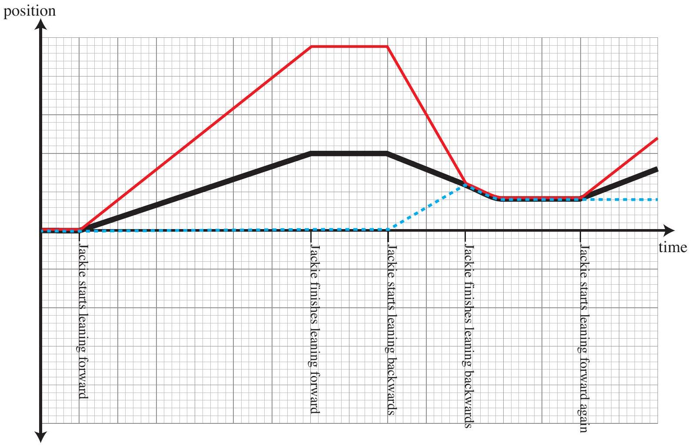
The position of the centre of mass is shown with a thick black line, the position of Object 1 is shown with a red line, and the position of Object 2 with a dashed blue line.

## Question 12

Daphne the Diving Bell Spider is on an excursion to the surface of her pool in the forest. The water of the pool is very clear. Sitting high on a rock on a sunny morning, Daphne can observe many bright lines separated by darker regions moving around the flat bottom of the pool. The bright lines, shown below, are known as caustics and can be explained by the refraction of light rays at the irregular surface of the pool. When a light ray travels from air into water it refracts, bending so that the angle between the ray and a line perpendicular to the surface (called the normal) is smaller in the water.
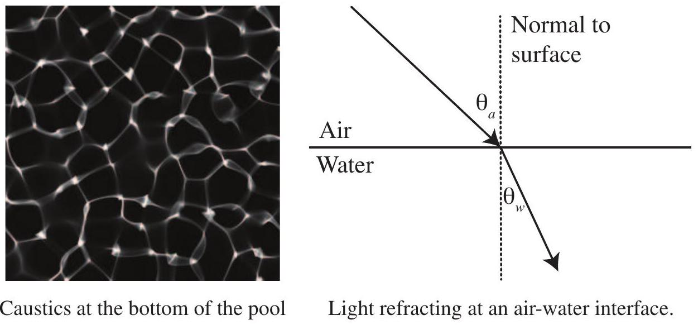

a) A 'slice' of the forest pool at one instant is shown below. A series of parallel light rays is shown being refracted at the uneven surface of the pool.
    (i) Complete the diagram by drawing in the missing rays on p. 4 of the Answer Booklet.
    (ii) Sketch the intensity of the light on the bottom of the pool. Use the axes supplied on p. 4 of the Answer Booklet.

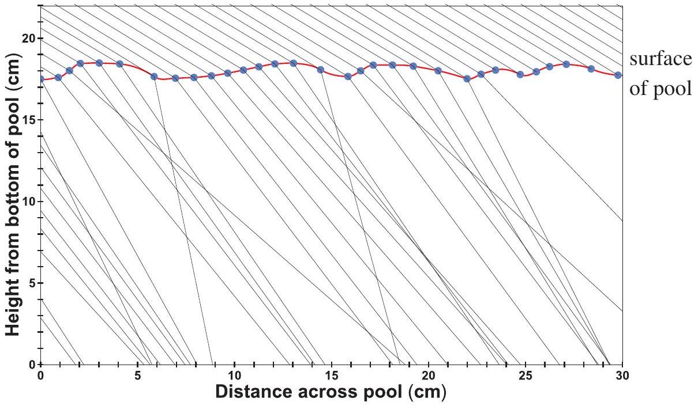

Solution:
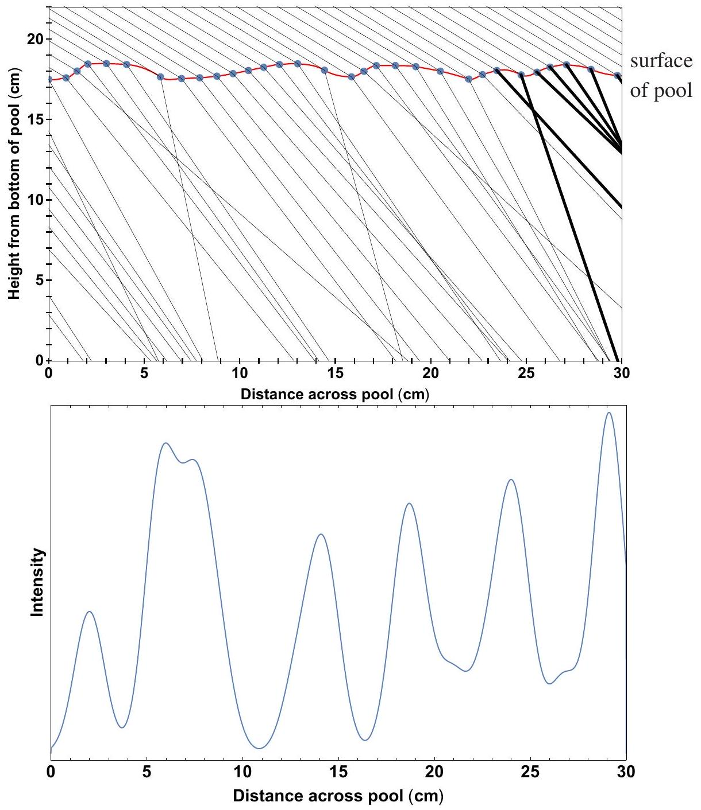

At midday with the sun directly above the pool, Daphne ventures out onto the now calm, flat surface of the pool. While near the shallow edge of the pool, where the bottom is flat, she asks her mate Mavis the moth to fly overhead and observe. Mavis reports that Daphne's shadow on the bottom of the pool is very large.
b) Based on this observation, select whether Daphne makes either Profile 1 or Profile 2 when she is on the surface of the pool, and explain your choice using words and diagrams. Both surface profiles are drawn on p. 4 of the Answer Booklet for you to use.

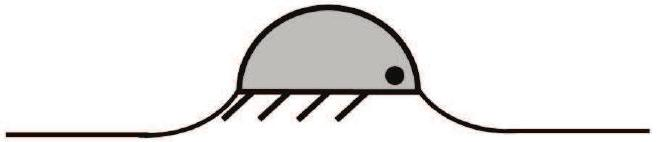
Profile 1

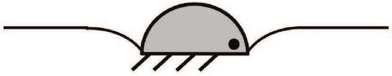
Profile 2

Solution:

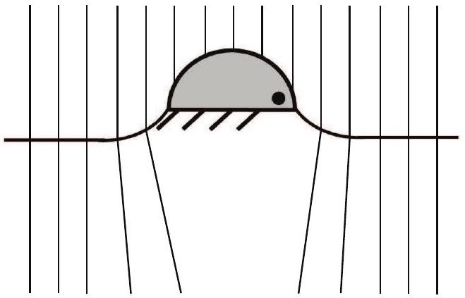
Profile 1

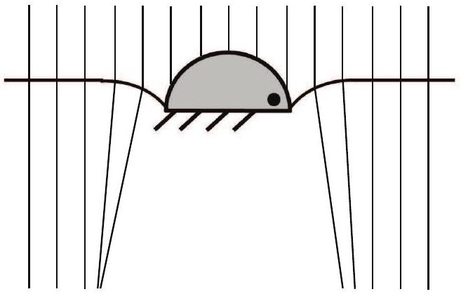
Profile 2

As the sun is directly overhead, the rays of sunlight are incident on the surface of the water from vertically above. The curvature of the water surface in Profile 1 causes the rays to refract toward the centre of the shadow, reducing its size. The curvature of the water surface in Profile 2 causes the rays to refract away from the centre of the shadow, increasing its size.

c) Mavis can also see a bright ring around Daphne's shadow on the bottom of the puddle. A schematic diagram of the brightly-rimmed shadow is shown to the right. Explain the origin of this bright ring.

## Solution:

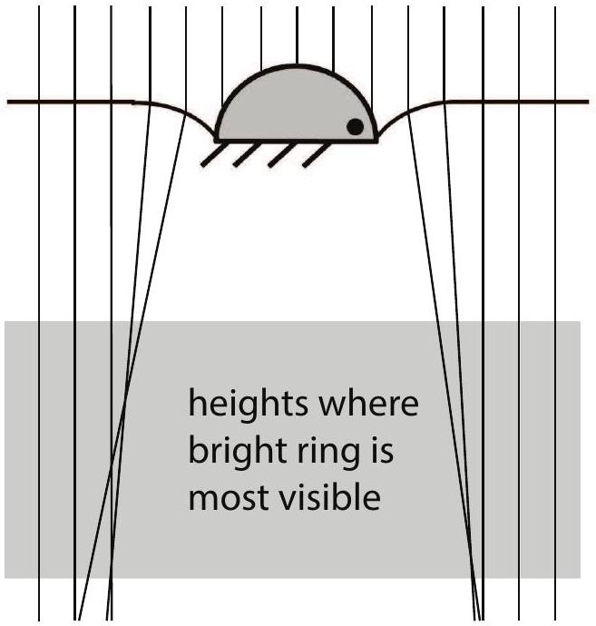

As the light which is incident on the curved part of the surface around Daphne it is refracted away from Daphne. As the surface is steepest nearest to Daphne, the light incident closer to Daphne is more strongly refracted. This means that a bright ring will form where light from closer to Daphne and light from slightly further away are incident. The ring shape is due to Daphne's shape being circular. The depth of the pool will also affect the brightness of the ring, as closer to the surface there will not be a very bright ring, as the light will not have traveled far enough for the shadow to be much larger than expected. At greater depths the a bright ring will be clearly visible, but at even greater depths the light will become more spread out and the ring will be less visible.

Daphne decides to dive back to the bottom of the pool, taking a bubble of air with her. Archimedes' Principle states that the buoyant force on an object is equal to the weight of the volume of fluid displaced by that object. Daphne's bubble can be modelled as 0.9 of a sphere with radius $r _ { B }$ and no mass, while Daphne is hemispherical in shape with a radius $r _ { s }$ and mass $m _ { s }$ (see right). The water has density $\rho$.
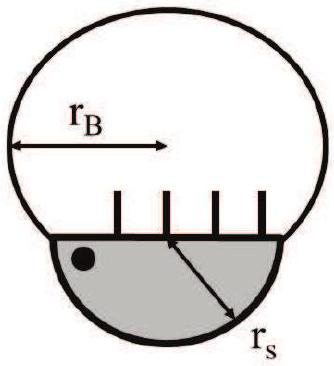

d) Find the largest $r _ { B }$ such that Daphne can sink to the bottom of the pool.

Solution:
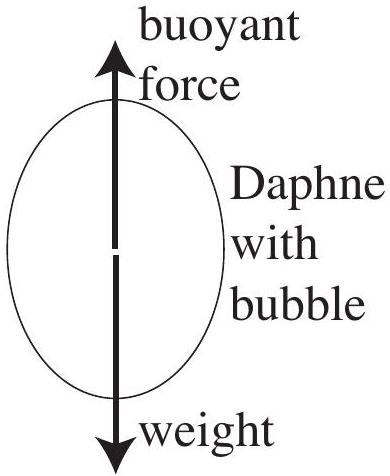

A free body diagram is shown above, with the buoyant and weight forces acting on Daphne and her bubble.
If the weight force balances the buoyant force Daphne will neither sink nor float, so for Daphne to sink $F _ { \text {weight } } > F _ { \text {buoyant } }$.
The weight force $F _ { \text {weight } } = m _ { \mathrm { s } } g$.
The bouyant force depends on the total volume of water displaced by Daphne, $V _ { \mathrm { s } }$ and the bubble $V _ { \mathrm { B } }$,

$$
F _ { \text {buoyant } } = \rho g \left( V _ { B } + V _ { s } \right) ,
$$

$$
\begin{aligned}
V _ { \mathrm { B } } & = \frac { 9 } { 10 } \times \frac { 4 } { 3 } \pi r _ { \mathrm { B } } ^ { 3 } \\
& = \frac { 6 } { 5 } \pi r _ { \mathrm { B } } ^ { 3 } ,
\end{aligned}
$$

$$
\begin{aligned}
V _ { \mathrm { s } } & = \frac { 1 } { 2 } \times \frac { 4 } { 3 } \pi r _ { \mathrm { s } } ^ { 3 } \\
& = \frac { 2 } { 3 } \pi r _ { \mathrm { s } } ^ { 3 } .
\end{aligned}
$$

Note that $\rho$ is the density of the water and $g$ is the local acceleration due to gravity. Hence,

$$
\begin{aligned}
\rho g \pi \left( \frac { 6 } { 5 } r _ { \mathrm { B } } ^ { 3 } + \frac { 2 } { 3 } r _ { \mathrm { s } } ^ { 3 } \right) & < m _ { \mathrm { s } } g \\
\frac { 6 } { 5 } r _ { \mathrm { B } } ^ { 3 } & < \frac { m _ { \mathrm { s } } } { \rho g } - \frac { 2 } { 3 } r _ { \mathrm { s } } ^ { 3 } \\
r _ { \mathrm { B } } & < \left( \frac { 5 } { 6 } \left( \frac { m _ { \mathrm { s } } } { \rho g } - \frac { 2 } { 3 } r _ { \mathrm { s } } ^ { 3 } \right) \right) ^ { 1 / 3 } .
\end{aligned}
$$

Question 13
Maggie has two identical fridge magnets. The magnetism of the fridge magnets can be thought of as due to many tiny bar magnets. A bar magnet has a north pole and a south pole, and magnetic field surrounding it as shown to the right. Field lines closer together indicate a stronger magnetic field, while the arrows indicate the direction of the magnetic field. Like poles repel, and opposite poles attract.
The magnetic field of two magnets is the superposition of the individual magnets, becoming stronger where the two contributions are in the same direction and weaker where they are in opposite directions.

a) Apply the principle of superposition to sketch magnetic field line diagrams for the two arrangements of bar magnets shown on p. 6 of the Answer Booklet.

Maggie's fridge magnets will only stick to the fridge on one side - the black side - and the two fridge magnets stick to each other most strongly when the black sides are touching. They won't stick to each other at all if the two picture sides are touching. This leads Maggie to believe that on the black side of a fridge magnet the magnetic field is very strong, and on the other side it is very weak.
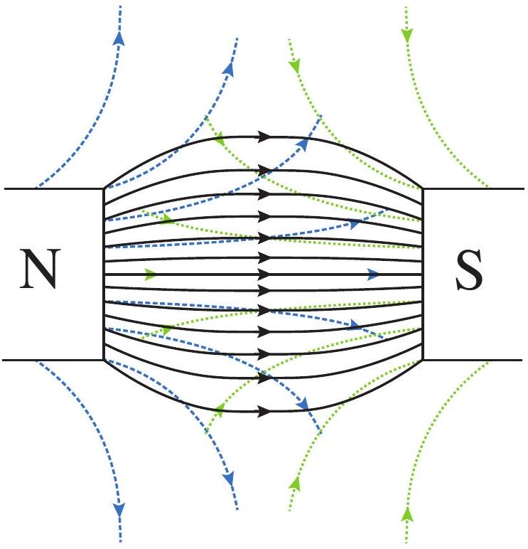

Solution: a)
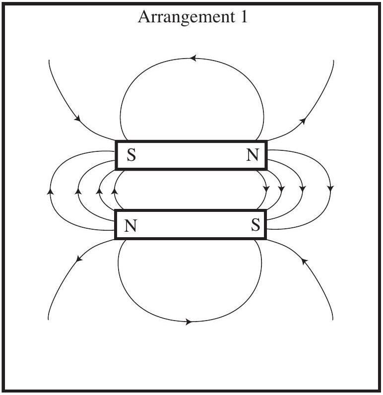
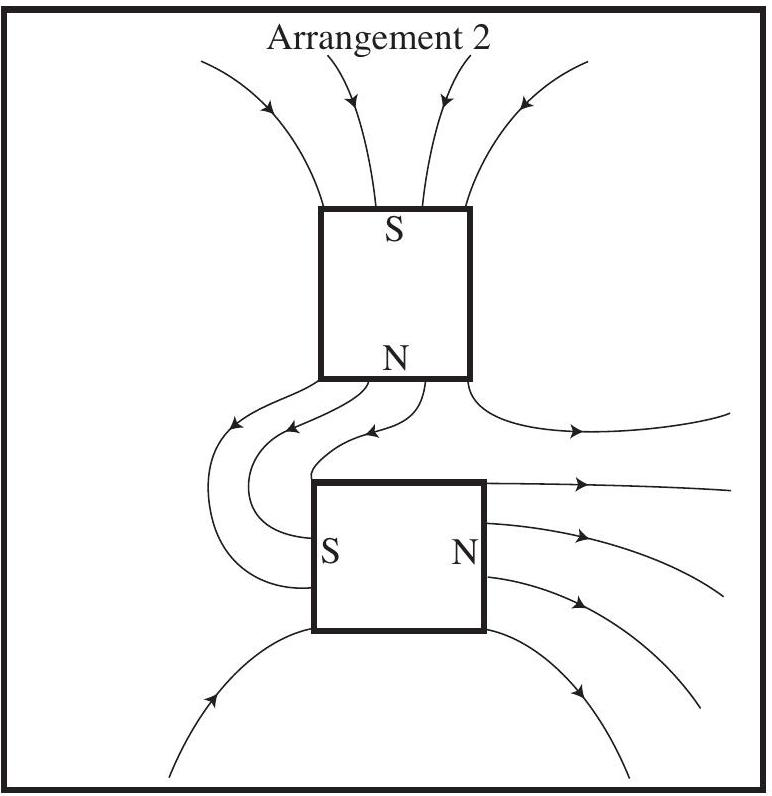

b) Show how bar magnets could be arranged to make a very strong field on one side, and a weak field on the other. You do not need to include a full magnetic field line diagram with your arrangement, but you should indicate where superposition of the fields results in a stronger or weaker field, and the approximate direction of the field.

Solution:
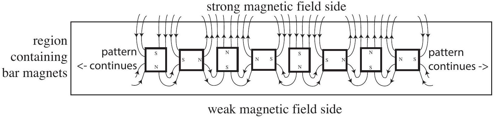

When Maggie's two fridge magnets are stuck together with their black sides touching, they are more easily slid apart vertically compared to horizontally. Maggie also notices that sliding apart in the horizontal direction feels bumpy, with the magnets alternating between slightly attracting and repelling each other.
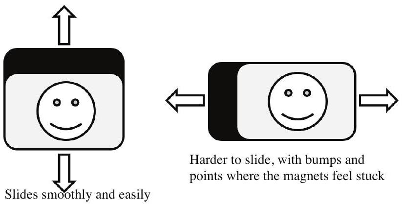

c) On the diagram on p. 7 of the Answer Booklet, draw how small bar magnets might be arranged, either as a grid, rows or columns, in one of Maggie's fridge magnets. You may use as many, or as few, of the diagrams as you need to describe the arrangement. You may draw the bar magnets as arrows to simplify your diagrams.

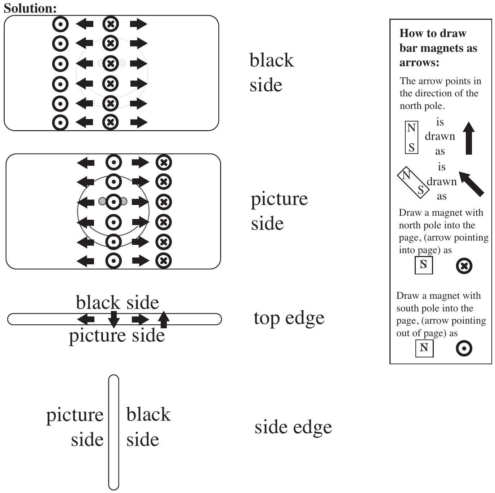
The pattern of magnets in the fridge magnet should be uniform up and down the magnets, so they slide easily in that direction, as there are no changes to the magnetic field. There should be a repeating pattern in the horizontal direction to get the bumpy feeling when they are slid apart.

The diagrams above show a single unit of the same pattern from b), which can be used to generate a strong field on the black side and a weak field on the picture side. Note that the three diagrams are not all required, but that where there are multiple diagrams they should be consistent with each other. Any horizontal offset in the pattern is equally good a solution.

Question 14
Air applies a force due to its pressure uniformly across any surface it contacts. A stretching wall requires a certain amount of force to expand, and applies a force on the air inside, increasing the inside pressure needed to keep the air contained. This is why a balloon stretches and if you untie it, the air is pushed out. A large firm ball is full of air. The ball has a small bubble made of a stretching wall attached to it that starts out empty.
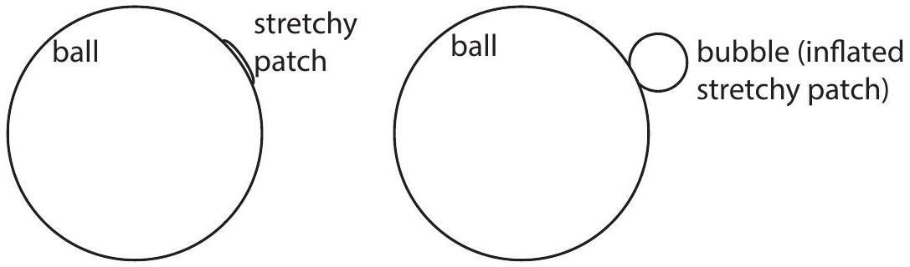
Someone squeezes the ball such that they apply a steadily increasing additional pressure to the ball and hence the air inside it. After a short time the bubble begins to inflate. Once it starts inflating, it rapidly increases in size. The firm ball's size hardly changes throughout.

a) (i) Sketch the pressure inside the ball versus time since the squeezing began.
    (ii) Sketch, roughly, the volume of the bubble versus time since the squeezing began.
    (iii) Sketch, roughly, the force applied per area of the small bubble versus its volume.
    (iv) Sketch, roughly, the force applied per area of the small bubble versus the amount of gas in the small bubble.

Solution:
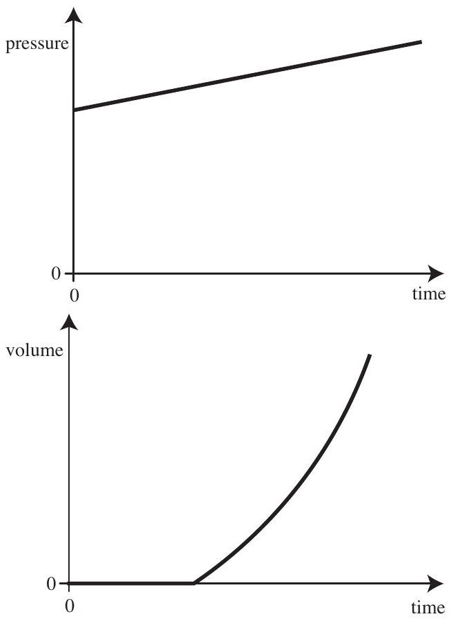
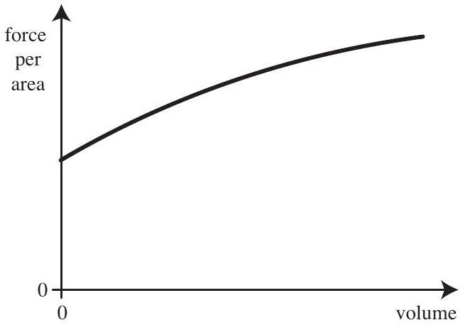
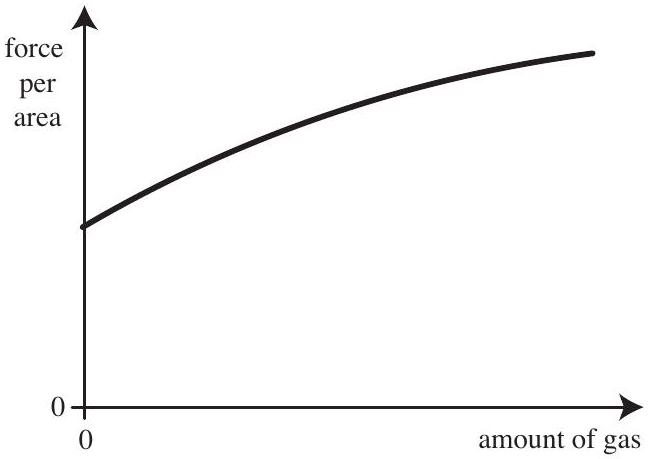
Important features:

- pressure vs time - when $t = 0 p > 0 , p$ increases with time at a constant rate.
- volume of bubble vs time $- V = 0$ for some time, then $V$ increases at an increasing rate. The rate is likely to be increasing.

- force per area vs volume - There is a minimum force per area for the volume of the bubble to start increasing. The force per area exerted by the stretchy patch is likely to increase roughly proportionally to its surface area, or $r ^ { 2 }$. However, the volume increases as $r ^ { 3 }$, so force per area is likely to increase more slowly as volume increases. Alternatively, students can use the graph of force per area vs amount of gas, which should have the same shape, as a guide. Students are expected to make this graph consistent with their previous graphs.
- force per area vs amount of gas - There is a minimum force per area for the amount of gas in the bubble to start increasing. The product of pressure and volume is proportional to the amount of gas, and the pressure and volume are both increasing, so the amount of gas increases more rapidly, or on a graph of force per area vs amount of gas, as the force per area equals the pressure, it increases with amount of gas at a decreasing rate. Alternatively, students can use the graph of force per area vs volume of the bubble, which should have the same shape, as a guide.
b) If instead of squeezing the ball, it is heated at a constant rate, explain whether or not you would expect your sketches to change. You might find the following relationship between temperature $T$, pressure $p$ and volume $V$ for an ideal gas to be useful: $p V = A T$ where $A$ is a constant depending only on the amount of gas. $A$ is directly proportional to the amount of gas.
Solution: As $p V = A T$ for the whole ball plus stretchy patch bubble, and the change to the total volume is very small, the pressure is roughly proportional to the temperature. Hence, if the ball is heated at a constant rate the pressure inside it also increases at a constant rate. This means that the graph of pressure vs time is unchanged, except for the rate of increase which may be either higher or lower. (Note: it is more likely to be lower as heating is usually a slower processes than squeezing, but students are not required to know this.)
The graph of volume of the bubble vs time will also be unchanged, except for overall rate, as the volume of the bubble depends only on the pressure exerted on the stretchy patch, as this determines how stretched it is. Heating of the patch is unlikely to change its stretchiness significantly before other damage would be done to the ball.
The graph of force per area vs volume of the bubble should be identical to in the previous part, as it depends only on properties of the stretchy patch, and not on properties of the gas inside it.
The graph of force per area vs amount of gas will change, as the pressure is increasing due to increasing temperature, so the amount of gas in a volume at a given pressure will be decreasing. This will have the effect of decreasing the maximum force per area for there to be no gas in the bubble, and also decreasing the rate of increase of force per area beyond that point. This is shown

in the graph below, with the original relationship shown by a dashed line, and the new relationship by a solid line.
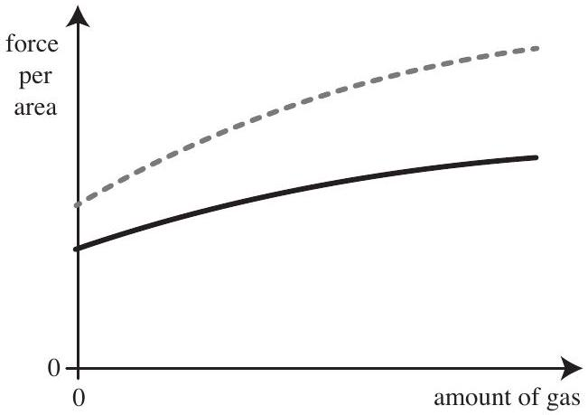

A group of students are given the challenge of designing an experiment to measure the change in the force per area applied by the stretchy wall as a function of its size. They have at their disposal a range of common objects, including heaters, scales, air pumps, and basic measuring tools, but do not have a large budget or any purpose-built lab spaces.

c) Design an experiment to perform that the students could use. Include what you would need to measure and how.
Solution: Good solutions use the ball with its stretchy patch to make measurements, rather than trying to vary the size and shape of the stretchy patch, or use a substitute such as a balloon. They take multiple (6+) pairs of measurements of force per area and bubble volume over a wide range of possible values, as the ball is pumped up and/or deflated.
The best way of measuring the force per area applied by the stretchy patch is to measure the pressure in the ball. The easiest way to do this is using a pressure gauge, such as is found on some air pumps. Alternative methods such as using weights and scales to measure the force applied externally can give some information but are not likely to be as accurate.
The easiest way to measure the volume of the bubble formed by the stretchy patch is to measure the diameter or circumference of the bubble and then using this to calculate its radius, and hence volume. Any reasonable method using commonly available equipment, e.g. wrapping a tape measure around the circumference, is acceptable. However, the accuracy of some approaches varies, and this should be considered in the choice of method. Approaches which involved submerging the bubble are likely to also be less accurate.

0.5 marks for identifying that it is better to measure a length to calculate the volume of the bubble 1 mark for a good method to measure the volume
Subtotal: 4 marks
d) For your design, where do you think the most likely sources of uncertainty in your results will come from? Remember to think about all parts of the experiment, not just the resolution of your instruments.

Solution:

| Most likely sources of uncertainty | Effect on results |
| :--- | :--- |
| Method of measuring circumference or diameter of bubble: regardless of method, there is likely to be some random uncertainty due to how the maximal circumference or radius is identified for measurement and also in the resolution of the measurement possibly due to difficulties in alignment of the measuring tool. | This will result in some random variation in length measurements, and in some cases, a more systematic under estimation of the radius. |
| Assumption that the bubble is spherical | Depending on whether or not the shape of the bubble remains similar with increasing volume, this will lead to some variation in the estimate of volume from the length measured. It is likely that the shape will be wider that it is high from the surface of the ball at least initially. If the measured length was in a direction normal (perpendicular) to the surface, this is likely to lead to underestimates of the volume. If the measured length was in a direction parallel to the plane of the ball's surface, then it is likely to lead to overestimates of the volume. |
| Measurement of pressure with gauge | Pressure gauges often stick on values when there is only a small change in pressure, so there is likely to be a significantly higher uncertainty than the resolution of the scale on the gauge. |

Note that there are many other possible likely sources of uncertainty which depend on how the experiment has been designed. Good answers will identify the sources most likely given their choice of experimental design.

## Integrity of Competition

If there is evidence of collusion or other academic dishonesty, students will be disqualified. Markers' decisions are final.
