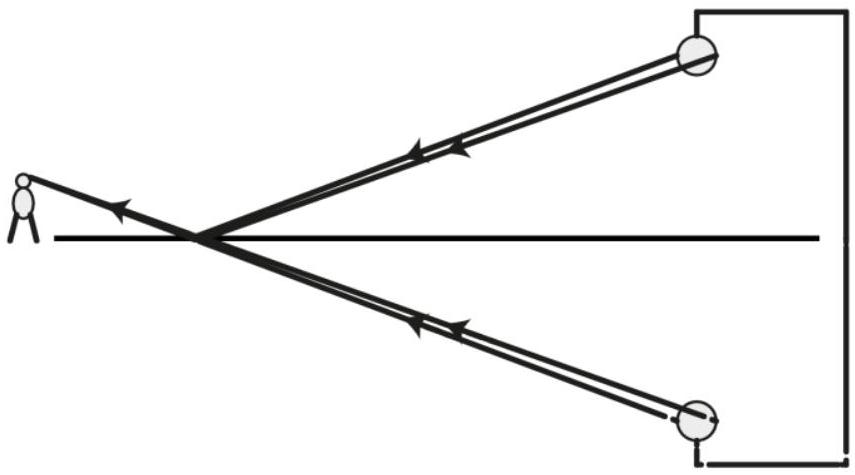
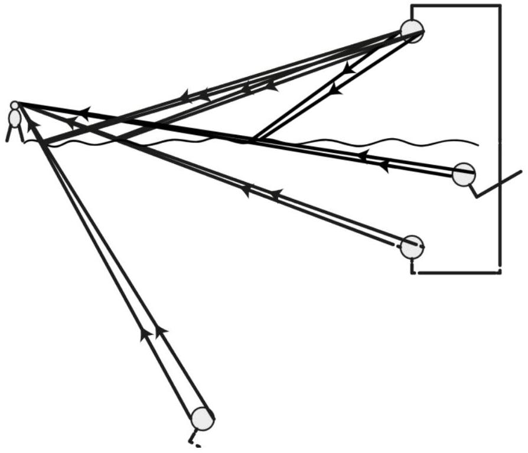
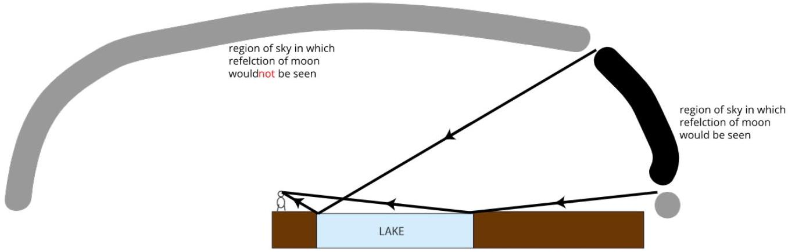

2020 AUSTRALIAN SCIENCE OLYMPIAD EXAM
PHYSICS_ANSWERS

Multiple choice questions:

1. C
2. D
3. D
4. C
5. E
6. C
7. B
8. E
9. A
10. A
1 mark for each question.

Section B: How fast can you shoot that stew?
11.

Ranges for estimated values and expressions given in order of question.

| Variable | Full credit (0.5) | Part credit (0.2) |
| :--- | :--- | :--- |
| h | 0.8-1.1 m | 0.7-1.2 m |
| $\mathrm { d } _ { 1 }$ | 0.05-0.2 m | 0-0.4 m not including 0 |
| $\mathrm { d } _ { 2 }$ | 0.8-1.2 m | 0.6-1.5 m |
| y | h+0.05-h+0.15 | h+0 - h+0.25 |
| $\mathrm { x } _ { 1,2 }$ | $\mathrm { d } _ { 1,2 } + 0.2 - \mathrm { d } _ { 1,2 } + 0.4$ | $\mathrm { d } _ { 1,2 } + 0.1 - \mathrm { d } _ { 1,2 } + 0.5$ |
| t | $\sqrt { ( 2 y / g ) }$ |  |
| t | Correctly calculated from estimated values |  |
| $\mathrm { V } _ { \text {max } }$ | $\mathrm { x } _ { 2 } / \mathrm { t }$ or with expression for t substituted |  |
| $\mathrm { V } _ { \text {max } }$ | Correctly calculated from estimated values |  |

1.5 for having no more than 2 significant figures on any value throughout.

12.

| Marks | For |
| :--- | :--- |
| 2 | Appropriate factors: - components of velocity in some coordinate system (at least two of vx, vy, vz or v, theta, phi) - May include jet profile and air resistance combination, but these are likely much less important - Should not include factors like wind speed as indoors, local g, or other factors likely to be constant in this context  |
| 2 | Calculations for varying speed or horizontal velocity component (i.e. most significant factor) |
| 2 | Calculations for another factor |

See comments below for how to allocate a mark out of 2 for each part.
13.

Most relevant factor - speed of horizontal component of velocity, ranging from 0.7 to 2-3 m/s.
2nd factor - angle of velocity from horizontal or vertical component of velocity, ranging from -30 degrees to + 45 degrees or. Be generous with this range as it depends on assumptions in previous question which you won't be looking at when marking this. We'll fix this for top group when looking at whole papers.

3rd factor - none or horizontal angle
This question is out of 1
0.5 for partial work, e.g. sensible list of factors or one reasonable factor with good range of values.

Summary of numerical values - 1 mark

## Section C: Looking at lakes

14.

2 - 2 sets of sensible ray paths plus virtual image drawn in with virtual rays or other explanation of how the image appears and why it is below surface of lake.

1 - more progress towards 2 than for 0.5
0.5 - one reasonable ray path

See diagram Question16

15.

| Marks | For |
| :--- | :--- |
| 1 | Multiple rays reflecting from different ripple phases |
| 1 | Rays reflect at some angle to local surface normal |
| 1 | Results in range of virtual images or spread virtual image |

16.

| Marks | For |
| :--- | :--- |
| 1 | Extreme rays or range of rays showing regions of sky visible/ not visible |
| 1 | Reasonable conclusion based on ray paths |
| 0.5 | Conclusion only with no reasoning |

17.

| Marks | For |
| :--- | :--- |
| 1 | Clear understanding of periodicity forming the band structure evident in drawing |
| 1 | Valid mechanism for orange bands from an appropriate part of sky formed on only part of each wave (either from near horizon with appropriate normals, or retroreflection from another pink patch above clouds not seen with appropriate normals) |
| 1 | Either written or drawn with enough detail to explain both of the above clearly and consistently and why there is a limited range of water for which the bands are seen |

Section D: Viral variation
18.

| Marks | For |
| :--- | :--- |
| 1 | Plotting points (3,1), (4,0.9) and (7,0.3) correctly |
| 1 | For times t up to 2 days: sketching exponential growth with a doubling time of 6 hours |
| 1 | For times after 4 days: sketching exponential decay which has viral load decreasing by a factor of 3 every 3 days, passing through the points already plotted. |

Section E: Waves on a string
19.

| Marks | For |
| :--- | :--- |
| 1 | Description of good method |
| 1 | Reasoning for method choice (error reduction in other words, but students are unlikely to use this language) |
| 1 | Clear explanation of calculation |

20.

| Marks | For |
| :--- | :--- |
| 1 | Clear description of set up including values of constants plus choice of variable |
| 2 | Description of good method for taking enough measurements to determine relationship |
| 1 | Reasoning for method choice (error reduction) |
| 1 | Identification that when damping is strong it reduces maximum travel distance of pulse, and also changes amplitude and potentially pulse width, so measurements are not independent of other variables |
| 1 | Comparison of measurement errors for measurements of speed with high damping compared to low damping |

Comments:
When marking out of 2 here:
2 - all good apart from extremely minor error e.g. missing units in intermediate step, precision a bit high but not too much
1.5 - almost all good with one error or a couple of small ones, e.g. some missing units and precision errors or one bit of nonsense.
1.0 - half(ish) good
0.5 - something good

0 - all nonsense or blank

Similarly when marking out of 1 here:

1 - almost complete valid answer
0.5 - some good work but could be more
0 - not substantial good work
