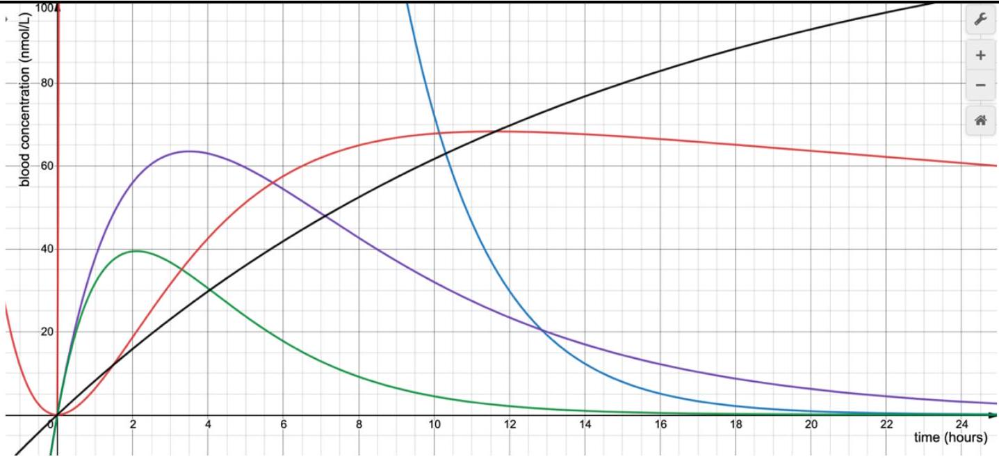

2021 AUSTRALIAN SCIENCE OLYMPIAD EXAM
PHYSICS_ANSWERS

Multiple choice questions:

| 1 | A |
| :--- | :--- |
| 2 | A |
| 3 | D |
| 4 | D |
| 5 | B |
| 6 | C |
| 7 | B |
| 8 | C |
| 9 | A |
| 10 | E |

1 mark for each question

## Section B: Runners

a) 2 marks total

| Marks | For |
| :--- | :--- |
| 1 | Expression: $v _ { 1 } = \frac { 2 L } { t _ { 1 } }$ |
| 1 | Values: $v _ { 1 } = 0.16 \mathrm {~km} / \mathrm { min } = 2.7 \mathrm {~m} / \mathrm { s }$ |

b) 4 marks total

| Marks | For |
| :--- | :--- |
| 1 | The distance Kara runs vs in this amount of time is 2 km more than the distance Anna runs in this same time |
| 1 | $v _ { 2 } t = L + v _ { 1 } t$ or equivalent |
| 1 | Expression: $t = \frac { t _ { 1 } t _ { 2 } } { 2 \left( t _ { 1 } - t _ { 2 } \right) }$ |
| 1 | Value: $t = 50$ minutes |

c) 2 marks total

| Marks | For |
| :--- | :--- |
| 1 | Expression: $v _ { 2 } = v _ { 1 } ( 1 / n + 1 )$ |
| 1 | Value: $v _ { K } = 3.7 \mathrm {~m} / \mathrm { s }$ |

## Section C: Sugar gliders

a) 2 marks total
    i) Correct answer: $\frac { m _ { 2 } } { m _ { 1 } } = \left( \frac { l _ { 2 } } { l _ { 1 } } \right) ^ { 3 }$ out of $\mathbf { 1 . 0 }$
| Base mark 1.0 | Correct equation, or correct expression for $m _ { 2 }$ [i.e. $m _ { 1 } \left( \frac { l _ { 2 } } { l _ { 1 } } \right) ^ { 3 }$ ] |
| :--- | :--- |
| Base mark 0.3 | Dimensionally correct relationship with either fraction flipped $\left[ \frac { m _ { 2 } } { m _ { 1 } } = \left( \frac { l _ { 1 } } { l _ { 2 } } \right) ^ { 3 } \right] \text { or } \frac { m _ { 1 } } { m _ { 2 } } \text { increases with } \frac { l _ { 1 } } { l _ { 2 } }$ |
| -0.2 | Numbers (with or without units) subbed in |
    ii)Correct answer: 8800 g out of 1.0

| Base mark 1.0 | Correct value up to 4 sig figs, including carried error (i.e. if the student got partial marks for (a) and subbed in values correctly) |
| :--- | :--- |
| Base mark 0.5 | Part (a) dimensionally correct but no part (a) partial credit given, and values subbed in correctly |
| -0.2 | 5+ sig figs |
| -0.2 | Wrong/no units |
b)1 mark total
Correct answer: $\frac { A _ { 2 } } { A _ { 1 } } = \left( \frac { l _ { 2 } } { l _ { 1 } } \right) ^ { 2 }$ out of 1.0

| Base mark 1.0 | Correct equation, or correct expression for $A _ { 2 }$ [i.e. $A _ { 1 } \left( \frac { l _ { 2 } } { l _ { 1 } } \right) ^ { 2 }$ ] |
| :--- | :--- |
| Base mark 0.3 | Dimensionally correct relationship with either fraction flipped $\left[ \frac { A _ { 2 } } { A _ { 1 } } = \left( \frac { l _ { 1 } } { l _ { 2 } } \right) ^ { 2 } \right] \text { or } \frac { A _ { 1 } } { A _ { 2 } } \text { increases with } \frac { l _ { 1 } } { l _ { 2 } }$ |
| -0.2 | Numbers (with or without units) subbed in |
c)3 marks total
Correct answer: 'parachute' out of $\mathbf { 1 . 0 }$

| Base mark 1.0 | Correct answer (including carried error if consistent with (e) and (e) is dimensionally correct) |
| :--- | :--- |

Correct answer: $l _ { 1 } \cos \left( \alpha _ { 1 } \right) = l _ { 2 } \cos \left( \alpha _ { 2 } \right)$ out of 2.0

| Base mark 2.0 | Correct equation derived from $\frac { m _ { 1 } \cos \left( \alpha _ { 1 } \right) } { m _ { 2 } \cos \left( \alpha _ { 2 } \right) } = \frac { A _ { 1 } v _ { 1 } ^ { 2 } } { A _ { 2 } v _ { 2 } ^ { 2 } }$ with any of $v _ { 1 } = v _ { 2 }$ or student's answers to part (a) and (c) subbed in |
| :--- | :--- |
| -1.0 | Correct equation with (a) and (c) subbed in, but at least one of (a) and (c) dimensionally incorrect |
| -0.4 | Numbers (with or without units) subbed in |

d)3 marks total
Correct answer: $\frac { m _ { 1 } \cos \left( \alpha _ { 1 } \right) } { m _ { 2 } \cos \left( \alpha _ { 2 } \right) } = \frac { A _ { 1 } v _ { 1 } ^ { 2 } } { A _ { 2 } v _ { 2 } ^ { 2 } }$ out of $\mathbf { 1 . 0 }$

| Base mark 1.0 | Correct equation, even if $\alpha _ { 2 } = 45 ^ { \circ }$ subbed in |
| :--- | :--- |
| -0.2 | Numbers (with or without units) subbed in (except $\alpha _ { 2 } = 45 ^ { \circ }$ ) |

Correct answer: $\sqrt { \frac { m _ { 2 } \cos \left( \alpha _ { 2 } \right) } { m _ { 1 } \cos \left( \alpha _ { 1 } \right) } \frac { A _ { 1 } v _ { 1 } ^ { 2 } } { A _ { 2 } } }$ out of $\mathbf { 1 . 0 }$

| Base mark 1.0 | Correct equation (including carried error from (f) if (f) dimensionally correct), even if $\alpha _ { 2 } = 45 ^ { \circ }$ subbed in |
| :--- | :--- |
| -0.2 | Numbers (with or without units) subbed in (except $\alpha _ { 2 } = 45 ^ { \circ }$ ) |

Correct answer: 13.3 m/s out of 1.0

| Base mark 1.0 | Correct value up to 4 sig figs (including carried error from (f) if (f) dimensionally correct) |
| :--- | :--- |
| -0.2 | 5+ sig figs |
| -0.2 | Wrong/no units |

## Section D: Pro-drugs

a) 3 marks total

| Marks | For |
| :--- | :--- |
| 1.2 | Plotting points (0,20), $( 4,10 )$ correctly |
| 1.8 | Reasonable sketch of exponential decay. |

b) 1 mark total

| Marks | For |
| :--- | :--- |
| 0.25 | W1 concentration would increase and peak at around the same time |
| 0.25 | W1 concentration would decrease and peak earlier |
| 0.25 | The concentration of W1 at long times would be lower but the rate of decay would be unchanged. |
| 0.25 | The concentration of W1 at long times would be lower, it would be decaying more rapidly |

c) 2 marks total

| Marks | For |
| :--- | :--- |
| 1 | Sketch very similar to W1 curve, with matching timing. |
| 1 | Maximum is at around 60 nmol/L, scale marked clearly. |

d) 2 marks total
+ 0.25 for each correct answers to (i) - (iv)
+ 1 for explanations, spread over questions, meaning that an excellent explanation for just one part may gain 0.5 marks, whereas a poor explanation in two parts may get 0.25 marks.

| A2, because A2 is formed before A3 and the rate of formation of A3 depends on there being A2 |
| :--- |
| A3, because A3 has a lower loss rate than A2 (and the formation of A2 will decrease as P depletes, and the loss of A2 is stronger than A3 |
| A2 being at max concentration means $\mathrm { dA } 2 / \mathrm { dt } = - ( 0.17 + 0.34 ) \mathrm { A } 2 + 0.0085 \mathrm { P } = 0$ hence $\mathrm { A } 2 / \mathrm { P } = 0.017 = 1 / 60$ |
| A3 being at max concentration means $\mathrm { dA } 3 / \mathrm { dt } = - 0.012 \mathrm {~A} 3 + 0.34 \mathrm {~A} 2 = 0$, so $\mathrm { A } 2 / \mathrm { A } 3 = 0.035 = 3 / 85$ |

A1 - Purple, A2 - Green, A3 - Red.

e)3 marks total

| Marks | For |
| :--- | :--- |
| 1 | A2 curve very similar to A1, but with peak sooner and lower concentration. Passes through origin with gradient as for A1. |
| 1 | curve which passes through origin with gradient 0 at origin, peak much later, decay slower. |
| 1 | consistency between A2, A3 curves and sensible choices of scale. |
f)
| Marks | For |
| :--- | :--- |
| 0.2 | one fragment of a reasonable idea in (i) or (ii). |
| 0.5 | one reasonable idea from (i) or (ii) |
| 1 | 2-3 reasonable ideas from (i) and (ii) combined |
| 1.5 | 4-5 reasonable ideas from (i) and (ii) combined |
| 2 | showing some insight and having (nearly) complete response |

    i)
| Blood concentration depends on both initial dosage and time since initial dosage |
| :--- |
| Makes a strong link between how the ratio of concentration is independent of initial dosage. (Thus depends only on time since dose) |
    ii)
| Physically justified explanation as to why the ratio initially increases |
| :--- |
| reasonable comment on the relative decay rates of P and A2, with a comment about the effect on conc. A2 due to production from P and conversion on to further producers |
| Description of how the ratio asymptotes with reasoning |
| Description of conditions when the ratio makes a reasonable estimate - ie. it's changing relatively quickly. |
| Estimate (roughly from 10-24 hours, which is 5-12 decay times) of time to get somewhat close to asymptote of ratio. Method: estimate characteristic time based on 1/decay rate OR measure from graph. Time is many times one decay time for P. |

## Section E: Surprising shadows

a) 4 marks total

| Marks | For |
| :--- | :--- |
| 1 | Diagram should be well labelled and it should be clear what the student is illustrating |
| 1 | Diagram should include a mirror, rays, the object and location of the shadow. |
| 1 | It should be explained by words or diagram that light is blocked from one source first then the other. |
| 1 | Student makes is clear that it is not that there is no shadow, instead now all of the wall is evenly in shadow. |

b) 1 mark - mirror.
c) 3 marks total

| Marks | For |
| :--- | :--- |
| 1 | Diagram shows the light rays, mirror, direct shadow and mirror shadow and the virtual image. Correct ray optics is used (straight lines). |
| 1 | Diagram clearly shows two shadows for both the object and the virtual image. |
| 1 | Diagram shows which shadows are blocked by the object and which are observed |

d) 3 marks total

| Marks | For |
| :--- | :--- |
| 1 | Answer clearly shows where light is coming from. |
| 1 | Answer explains why the shadow on the mirror side is darker. |
| 1 | Answer explains that the light is a combination of the two light sources: explaining that the shadows are still lit up by one of the two light sources. |

## Section F: Double glazing

a 5 marks total
    i) 0.5 per factor = 1 mark. Possible factors include: distance between glass sheets, air pressure between glass sheets, thickness of glass sheets, properties of supports: number, material/density, placement.
    ii) 4 marks total

| Marks | For |
| :--- | :--- |
| 1 | Must identify which factor is being changed, and how (e.g. increments). Example: five different double glazed windows constructed with an increasing distance between glass sheets by constant increment from 5mm to 20mm. |
| 1 | Must identify how they are measuring sound transmission Example: the window inserted as one face of a soundproof room, playing a constant sound recording from a speaker on the outside of the window, and a microphone on the other recording the amplitude of the sound |
| 2 | Good experimental design, including how many data points, what they keep consistent across trials, methods for error reduction, etc. Examples: 5+ data points, placing the speaker and microphone close to the glass, using the same setup each time, reducing background noise/soundproofing the room, playing a consistent sound each time, etc |

b. 4 marks total
i) 1 mark total

| Marks | For |
| :--- | :--- |
| 1 | The student makes a strongly justified link between the time measured with different windows to their heat flow rate |
| 0.5 | The student links the time measured with different windows to their heat flow rate |
| 0 | The student does not make a valid connection between the measurements and window heat flow rate |

ii) 3 marks total

| Marks | For |
| :--- | :--- |
| 0.5 | The student provides physically reasonable sources of error |
| 0.5 | The student's sources of error are a large contributor to the total error and reasonable justification is given. |
| 1 | The student's sources of error demonstrate excellent physical insight of the experiment proposed. |
| 1 | A total of two or more very significant sources of error are identified and clearly justified. |
| 1 | A change to the experimental design is listed with valid justification on how it would result in reduced uncertainty. |

Some common responses:

- Error: Heat escaping through the fridge/gaps in the joinery between window and fridge
- Change: Add sealant between at the window joinery. Take a control measurement before the window is installed.
- Error: external conditions may cause the room to fluctuate in temperature
- Change: close and windows and blinds to insulate the room as much as possible, keep the heater on to maintain room temperature.

## Comments:

When marking out of 2 here:
2 - all good apart from extremely minor error e.g. missing units in intermediate step, precision a bit high but not too much
1.5 - almost all good with one error or a couple of small ones, e.g. some missing units and precision errors or one bit of nonsense.
1.0 - half(ish) good
0.5 - something good
0 - all nonsense or blank

Similarly when marking out of 1 here:
1 - almost complete valid answer
0.5 - some good work but could be more
0 - not substantial good work
