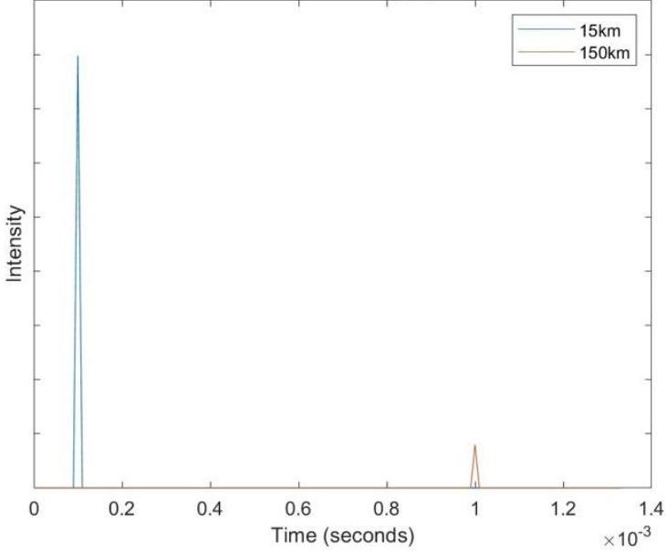
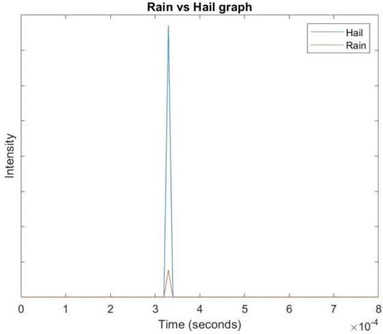
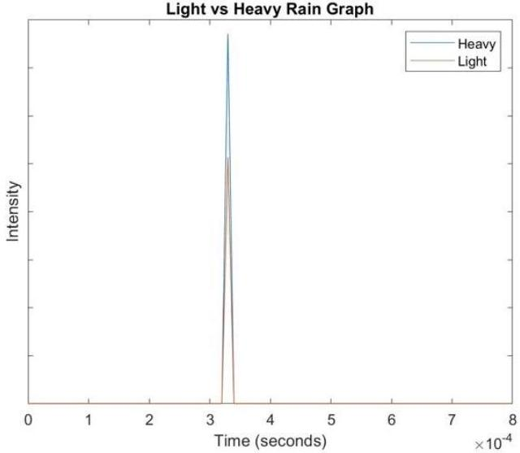
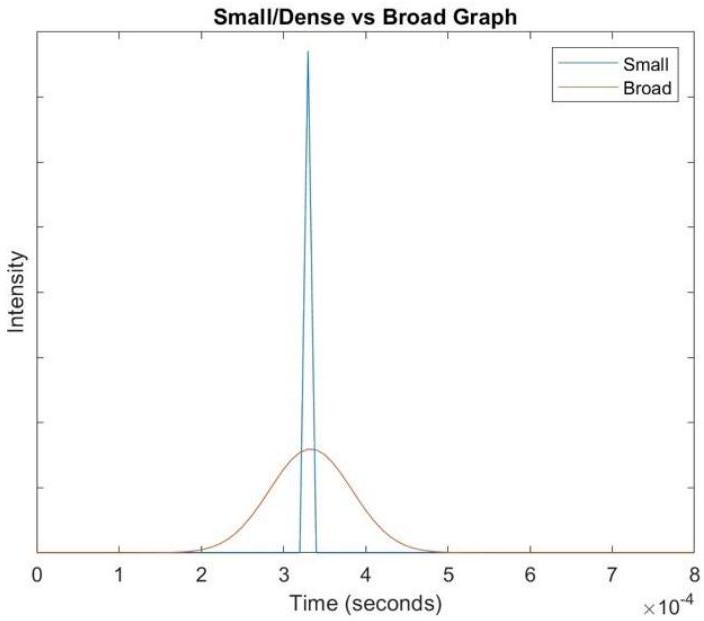
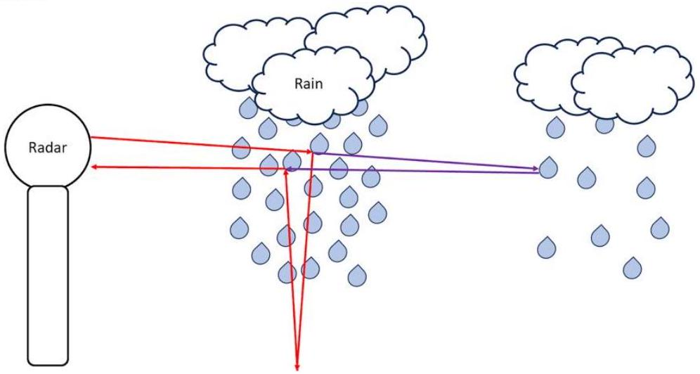
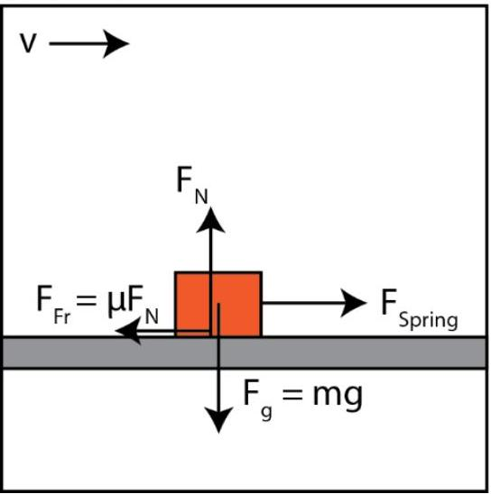
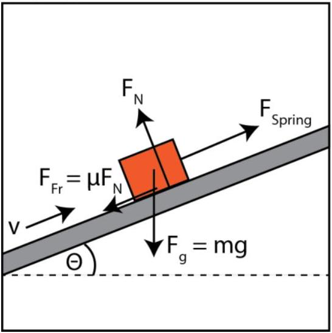
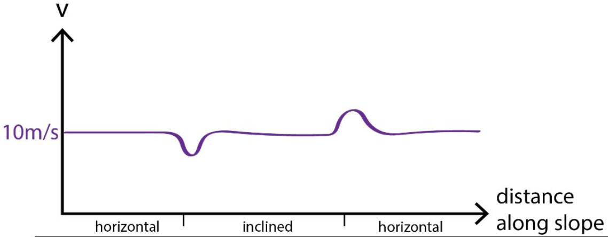

## 2023 AUSTRALIAN SCIENCE OLYMPIAD EXAM PHYSICS_ANSWERS

## Section A: Amusing Airport Adventures (13 marks)

25\% of associated mark is deducted for missing or incorrect units.

1. Solution: 0.3 m/s (1 mark)
2. Solution: 0.7 m/s (-0.7m/s also accepted) (1 mark)
3. Solution: 3.27 m/s

| Using equation $\mathrm { v } = \mathrm { s } / \mathrm { t }$ | +1.0 |
| :--- | :--- |
| Obtaining eqn 10 seconds $= 10 \mathrm {~m} / ( \mathrm { x } - 0.7 \mathrm {~m} / \mathrm { s } ) + 20 \mathrm {~m} / \mathrm { x }$. Points are awarded even if students do not include the units. | +1.0 |
| Final answer, 3.27 m/s | +2.0 |
| Total | 4.0 |
| If student gets 2.8m/s, assumed travellator going wrong way. Give 3.0/4.0 |  |

4. Solution: $\mathrm { v } = \left( \mathrm { u } + - \mathrm { sqrt } \left( \mathrm { u } \wedge 2 + 4 \mathrm { w } ^ { \wedge } 2 \right) \right) / 2$

| Obtain algebraic equation   If a student gets the quadratic equation but does not solve it then they get 2 marks. If they can't get the quadratic equation, but have a dimensionally consistent answer then they get 1 mark. | +3.0 |
| :--- | :--- |
| Obtaining limits of equation: - Students should make note that v does not depend on S. (0.5 marks) - They should note that when u is large, that v approaches u. (0.5 marks) - Students should note that when w is much larger than u we have v approaches w (0.5 marks) or better v approaches w + u/2 (1 mark).  | +2.0 |
| Physical intuition about the limits: - They should explain that the v approaches u limit makes sense because it is as if the travellator is not moving, therefore the condition is the same for both groups. (1 mark) - For the w is large limit they should note that the first half of the journey is very fast for Mali and then they need to complete the trip back at a speed u/2 faster than w, as they have twice as much time to do the return journey. (1 mark)  | +2.0 |
| Total | 7.0 |

## Section B: Rainy Day Radar (38 marks)

1. Answer: 48 km $\left( \right.$ distance $\left. = 3.00 \times 10 ^ { \wedge } 8 \mathrm {~m} / \mathrm { s } / 0.32 \mathrm {~ms} \right)$

| 48 km | 1.0/1.0 |
| :--- | :--- |
| 96 km | 0.5/1.0 |

2. Answer: 2.01\%

| 2.01 \% | 1.0/1.0 |
| :--- | :--- |
| 3.97\% (alternative interpretation - students use 2 interfaces rather than just looking at how much is reflected from first surface) | 1.0/1.0 |
3. Answer: 1.8 \% (full marks), 3.57\% (full marks - they use 2 interfaces rather than just looking at how much is reflected just from the first surface.), half marks for $0.018 \%$ or $0.0357 \%$

| 1.80 \% | 1.0/1.0 |
| :--- | :--- |
| 3.57\% (alternative interpretation - students use 2 interfaces rather than just looking at how much is reflected from first surface) | 1.0/1.0 |
4. Answer: Each time the pulse reaches an air ice interface in the hailstone some of the pulse is reflected (1.80\%), so a far greater proportion of the light is reflected overall by the hailstone.

| Mentioning that 1.8\% of the pulse is reflected at each interface (don't need to specifically say 1.8\% as this is based on their calculation in the previous question) | +0.5 |
| :--- | :--- |
| Saying this means a greater proportion is reflected overall | +0.5 |
| Only saying it increases | 0/1.0 |
| Correct justification but wrong conclusion | 0/1.0 |
5. Answer: 84.3\%
The intensity of light which is transmitted after the nth interface is $\mathrm { I } _ { 0 } ( 1 - \mathrm { R } ) ^ { \mathrm { n } }$ so the intensity which has been reflected is $\mathrm { I } _ { 0 } \left( 1 - ( 1 - \mathrm { R } ) ^ { \mathrm { n } } \right)$ and the proportion is therefore 1-(1-R) ${ } ^ { \mathrm { n } }$. Each air pocket has 2 air ice interfaces (entrance and exit) and adding on the first and last interface the proportion reflected will be $1 - ( 1 - 0.018 ) ^ { 102 } = 84.3 \%$

| $\mathrm { I } _ { 0 } ( 1 - \mathrm { R } ) ^ { \mathrm { n } }$ expression | +1.0 |
| :--- | :--- |
| 1-(1-R) ${ } ^ { \mathrm { n } }$ expression | +1.0 |
| the number of air pockets ( $\frac { 1 } { 2 }$ mark for each air pocket having 2 ice interfaces and $\frac { 1 } { 2 }$ mark for the entrance and exit) | +1.0 |
| Final answer 84.3\% | $+ 1.0 = 4.0 / 4.0$ |
| Final answer 83.8\% (incorrect, student forgot to add first interface) | $+ 0.5 = 3.5 / 4.0$ |
| Final answer 59.7\% (incorrect, student forgets there are 2 interfaces for each air pocket but finds that the percentage reflected is 1-(1-R)^n (n is the number of interphases) | 2.0/4.0 |

6. Answer: Areas with hail will have greater intensity and areas of heavy rain witll also reflect a greater proportion of the beam and therefore have a higher intensity.

| Areas with hail will have greater intensity | +1.0 |
| :--- | :--- |

| areas of heavy rain will also reflect a greater proportion of the beam and therefore have higher intensity | +1.0 |
| :--- | :--- |
| No mention of air-water interfaces between droplets | -0.5 |
|  | Total 2.0 |

7. Answer:

15km vs 150km graph

| Correct location (time) of spikes | +1.0 |
| :--- | :--- |
| Spikes are sharp | +1.0 |
| Correct relative peak sizes: 1 mark for clear 1/r or 1/r^2 relationship (question is ambiguous about if the pulse spreads vertically as well as horizontally). This can also be awarded even if it is not overly clear (particularly for the $1 / \mathrm { r } \wedge 2$ relationship) but has been stated. $\frac { 1 } { 2 }$ mark if the second one is smaller but a specific relationship is not identified. | +1.0 |
| Lose $\frac { 1 } { 2 }$ mark from total if no justification for peak sizes or sharpness is given | -0.5 |
|  | Total = 3.0 |

8. Answer:

| Correct location (time) of spikes | +0.5 |
| :--- | :--- |
| Spikes are co-located | +0.5 |
| Spikes are sharp | +0.5 |
| Spikes are equally wide | +0.5 |
| Correct relative peak sizes: rain peak significantly smaller is +1.0 but if rain peak slightly smaller give +0.5 | +1.0 |
| Lose $\frac { 1 } { 2 }$ mark from total if no justification for peak sizes or sharpness is given | -0.5 |
|  | Total = 3.0 |

9. Answer:

| Correct location (time) of spikes | +0.5 |
| :--- | :--- |
| Spikes are co-located | +0.5 |
| Spikes are sharp | +0.5 |
| Spikes are equally wide | +0.5 |
| Correct relative peak sizes: light patch intensity is smaller than heavy patch is +1.0, but if light patch significantly smaller (like Q8) give +0.5. | +1.0 |
| Lose $\frac { 1 } { 2 }$ mark from total if no justification for peak sizes or sharpness is given | -0.5 |
|  | Total = 3.0 |
10. Answer:

| Correct location (time) of spikes | +0.5 |
| :--- | :--- |
| Spikes are co-located | +0.5 |
| Small patch of rain is sharp | +1.0 |
| Big patch of rain is board peak (only $\frac { 1 } { 2 }$ mark if peak is wider but still has sharp corners or a sharp peak at the top) | +1.0 |
| Correct relative peak sizes: broad peak much lower (only $\frac { 1 } { 2 }$ mark if it is only very slightly lower or ambiguous) | +1.0 |
| Lose $\frac { 1 } { 2 }$ mark from total if no justification for peak sizes or sharpness is given | -0.5 |
|  | Total = 4.0 |
11. Answer: The radar pulse can be reflected to the ground before returning to the radar if the radar is not normally incident on water droplets. The pulse therefore takes longer to reach the radar, so is detected as being behind the real rain (see below picture). This only occurs for a small proportion of the pulse, and therefore appears with a lower intensity i.e. light rain. This

phenomenon only occurs for heavy rain, as for light rain the signal will be too small to be detected.

| Saying the pulse can be reflected to the ground before going back to the radar if it is not normally incident ( $\frac { 1 } { 2 }$ mark if normal incidence not mentioned) | +1.0 |
| :--- | :--- |
| Saying the pulse takes longer to get back to the radar due to the extra distance it travels so is detected as being behind | +1.0 |
| Saying this only occurs to a small proportion of the pulse (hence light rain) | +1.0 |
| Saying this only occurs for really heavy rain (for enough of the pulse to be reflected in this way to lead to an observable peak) | +1.0 |
| Including a diagram | +1.0 |
|  | Total = 5.0 |

Any other explanations with physics which makes sense are also acceptable and can receive full marks.

12. Answer: If cloud is moving towards radar, the received frequency is Doppler-shifted as the observer (cloud) is moving towards the source (radar), meaning consecutive wavefronts take less time to reach cloud, resulting in a higher frequency i.e. positive sign on the numerator. Then when radar reflected back, source (cloud) is moving towards observer (radar), meaning consecutive emitted wavefronts are also closer to eachother observed by the radar, i.e. higher frequency so negative sign on demonimator. If $\mathrm { v } _ { - } \mathrm { p } < 0$, signs work out in the same way to decrease frequency.

| Explaining the reasoning behind the signs ( $\frac { 1 } { 2 }$ mark for each sign)   No marks for just saying that the signs have to be that way as the frequency should be higher without any justification | +1.0 |
| :--- | :--- |
| 1 mark for explaining that the frequency is doppler shifted twice (can still get $\frac { 1 } { 2 }$ mark if mentions that precipitation is both the observer and the source but 1 mark if states precipitation is the observer then the source) | +1.0 |
|  | Total = 2.0 |

13. Answer: 5.600000104 GHz
| 5.600000104 GHz | 1.0/1.0 |
| :--- | :--- |
| 5.600373346 GHz (forget to convert from hours to seconds) | 0.5/1.0 |
| 5.600000373 GHz (forget to convert all units) | 0.3/1.0 |

14. Answer: 5.599999067 GHz
| 5.599999067 GHz | 1.0/1.0 |
| :--- | :--- |
| 5.596641008 GHz (forget to convert from hours to seconds) | 0.5/1.0 |
| 5.59999664 GHz (forget to convert all units) | 0.3/1.0 |
| 5.599999999 GHz (forget to convert from km to m) | 0.5/1.0 |

15. Answer: The precipitation is located at three different distances from the radar.

| The precipitation is located at three different distances from the radar. | 1.0/1.0 |
| :--- | :--- |

16. Answer: 5.600000388 GHz

| 5.600000388 GHz | 1.0/1.0 |
| :--- | :--- |
| 5.600000448 GHz | 0.5/1.0 |

17. Answer: 5.599999404 GHz

| 5.599999404 GH | 1.0/1.0 |
| :--- | :--- |
| 5.599999365 GHz | 0.5/1.0 |

18. Answer: B

| B | 1.0/1.0 |
| :--- | :--- |

## Section C: Bounce-back Beam Biopsy (37 marks)

1. Answer: $E _ { 0 } = E _ { 1 } + E _ { 2 }$ (1 mark)
2.
| Answer: $\begin{array} { r }  \sqrt { 2 m _ { 1 } E _ { 0 } } = \sqrt { 2 m _ { 1 } E _ { 1 } } \cos \theta + \sqrt { 2 m _ { 2 } E _ { 2 } } \cos \phi \\ 0 = \sqrt { 2 m _ { 1 } E _ { 1 } } \sin \theta + \sqrt { 2 m _ { 2 } E _ { 2 } } \sin \phi \end{array}$ | 4.0/4.0 |
| :--- | :--- |
| If not correct, then partial marks for $\begin{aligned} & \text { Writing } p _ { 0 } = p _ { 1 } \cos \theta + p _ { 2 } \cos \phi \text { and } \\ & \qquad 0 = p _ { 1 } \sin \theta + p _ { 2 } \sin \phi \end{aligned}$ | +1.0 |
| Substituting energy into momentum | +2.0 |
3. Sample solution:
One approach is to start with the momentum equations.

$$
\begin{aligned}
\sin ( \phi ) & = - \frac { p _ { 1 } } { p _ { 2 } } \sin ( \theta ) \\
\Longrightarrow \sqrt { 1 - \cos ( \phi ) ^ { 2 } } & = - \frac { p _ { 1 } } { p _ { 2 } } \sin ( \theta ) \\
\Longrightarrow \cos ( \phi ) & = \pm \sqrt { 1 - \left( \frac { p _ { 1 } } { p _ { 2 } } \sin ( \theta ) \right) ^ { 2 } }
\end{aligned}
$$

Substitute this into the other set of momentum equations:

$$
p _ { 0 } = p _ { 1 } \cos \theta \pm p _ { 2 } \sqrt { 1 - \left( \frac { p _ { 1 } } { p _ { 2 } } \sin \theta \right) ^ { 2 } }
$$

Now, substitute the energies in, and use $E _ { 0 } - E _ { 1 } = E _ { 2 }$.

$$
\begin{aligned}
\sqrt { 2 m _ { 1 } E _ { 0 } } & = \sqrt { 2 m _ { 1 } E _ { 1 } } \cos \theta \pm \sqrt { 2 m _ { 2 } \left( E _ { 0 } - E _ { 1 } \right) } \sqrt { 1 - \frac { m _ { 1 } } { m _ { 2 } } \frac { E _ { 1 } } { E _ { 0 } - E _ { 1 } } \sin ^ { 2 } \theta } \\
\sqrt { 2 m _ { 1 } } \left( \sqrt { E _ { 0 } } - \sqrt { E _ { 1 } } \cos ( \theta ) \right. & = \pm \sqrt { 2 m _ { 2 } \left( E _ { 0 } - E _ { 1 } \right) - 2 m _ { 1 } E _ { 1 } \sin ^ { 2 } \theta } \\
( 1 - \sqrt { \mu } \cos \theta ) & = \sqrt { \frac { m _ { 2 } } { m _ { 1 } } ( 1 - \mu ) - \mu \sin ^ { 2 } \theta } \\
\left( 1 - 2 \sqrt { \mu } \cos \theta + \mu \cos ^ { 2 } \theta \right) & = \frac { m _ { 2 } } { m _ { 1 } } ( 1 - \mu ) - \mu \sin ^ { 2 } \theta
\end{aligned}
$$

This is now a quadratic equation in $\mu = \frac { E _ { 1 } } { E _ { 0 } }$. Solving this:

$$
\begin{aligned}
\left( m _ { 1 } + m _ { 2 } \right) \mu - 2 \sqrt { \mu } m _ { 1 } \cos \theta & - m _ { 2 } = \\
& \Longrightarrow \mu = \left( \frac { m _ { 1 } \cos \theta \pm \sqrt { m _ { 1 } ^ { 2 } \cos ^ { 2 } \theta + \left( m _ { 1 } - m _ { 2 } \right) m _ { 2 } \left( m _ { 1 } + m _ { 2 } \right) } } { \left( m _ { 1 } + m _ { 2 } \right) } \right) ^ { 2 } \\
& \Longrightarrow E _ { 1 } = \left( \frac { m _ { 1 } \cos \theta \pm \sqrt { m _ { 2 } ^ { 2 } - m _ { 1 } ^ { 2 } \sin ^ { 2 } \theta } } { m _ { 1 } + m _ { 2 } } \right) ^ { 2 } E _ { 0 }
\end{aligned}
$$

Sample mark allocation (there are many ways to derive this equation)

| Solving for angle $\phi$ | +1.0 |
| :--- | :--- |
| Using energy conservation somewhere | +1.0 |
| Partial (correct working) | +1.0 |
| Correct answer | 4.0/4.0 |

| Small minus sign errors that cause deviation from correct answer, but working otherwise correct | 3.0/4.0 |
| :--- | :--- |

4. Answer: We take the + sign for backwards scattering angles, i.e. when the incident particle is a lighter mass. This is because we cannot have 2 energies for the backscattered particle at a given angle - the heavier particle will never backscatter due to conservation of energy (2 marks for correct answer, with or without explanation). We take the ± solution for forward scattering and when the incident particle is heavier, because for a given angle, there exist two possible energies which satisfy both energy/momentum conservation (2 marks for correct answer, with or without explanation).

| + sign for backwards scattering angles | +2.0 |
| :--- | :--- |
| ± solution for forward scattering and when the incident particle is heavier | +2.0 |
| Total | 4.0 |
5. Answer: For m1 << m2, the expression inside the square root will never become imaginary This suggests there are no forbidden angles. The limit is:

$$
E _ { 1 } = \left( \frac { m _ { 1 } \cos \theta + m _ { 2 } } { m _ { 2 } + m _ { 1 } } \right) ^ { 2 } E _ { 0 }
$$

which indicates most of the energy goes to the lighter particle. Also, for backwards angles, this is when we see the largest energy loss
For m2 << m1, the term inside the square root will become imaginary for larger angles. In this case, we require $\mathrm { m } 2 / \mathrm { m } 1 \geq \sin \theta$, which is not true for all angles anymore. In particular, it means we have small, forward angle scattering (it cannot be backwards due to energy/momentum conservation).

| State that no forbidden angles | +1.0 |
| :--- | :--- |
| Limit for m1<<m2 | +1.0 |
| Discuss m1<<m2 condition | +1.0 |
| m2 << m1 condition, NO limit is required | +1.0 |
| Total | 4.0 |
6. Answer: Yes, energy/momentum conservation still holds because this is a closed system. (1 mark)
7. Answer: We can only investigate backscattering, so we need the initial beam to be lighter than the constituents.

- Diopside CaMgSi2O6: No, some elements are lighter.
- Calcite CaCO3: No, some elements are lighter.
- Dolomite CaMg(CO3)2: No, some elements are lighter.
- Pyrite FeS2: Yes all elements are heavier.
- Forsterite Mg2SiO4: No, some elements are lighter.
+1 mark for each mineral correct (maximum 5)
8. Answer: Yes, we can distinguish these compounds. Even though we can't back scatter from the carbonate ion, because we know the sample only contains these two compounds, we can use the fact we know how much scattering occurs from the magnesium ions. Therefore, we also know the relative ratios.

| Answering yes | +1.0 |
| :--- | :--- |
| Mentioning ratio of magnesium ion, correct reasoning | +1.0 |
| Total | 2.0 |

9. Solution:

The mass of an $\alpha$ particle is 4 a.m.u, tin is 119 a.m.u, and iron 56 a.m.u. Any calculations using more precision won't be penalised. We need to use the formula derived in the first part:

$$
E _ { 1 } = \left( \frac { m _ { 1 } \cos \theta \pm \sqrt { m _ { 2 } ^ { 2 } - m _ { 1 } ^ { 2 } \sin ^ { 2 } \theta } } { m _ { 1 } + m _ { 2 } } \right) ^ { 2 } E _ { 0 }
$$

And so,

$$
\begin{aligned}
& E _ { t i n } \approx 0.87 * E _ { 0 } \approx 4.8 \mathrm { MeV } \\
& E _ { i r o n } \approx 0.75 * E _ { 0 } \approx 4.1 \mathrm { MeV }
\end{aligned}
$$

The one with wider energy distribution is thicker: this is because the particles can lose energy as they travel through, and so recoil at a range of different energies. The thicker the sample, the wider the range is (a is the thick sample, b is thir

| Correct energy calculations (if formula correct but calculation error, +0.5) | +0.5 each = +1.0 |
| :--- | :--- |
| A is tin, B is iron | +1.0 |
| A is thick, B is thin | +1.0 |
| Reasoning for energy distribution relation to thickness | +1.0 |
| Total | 4.0 |

10. Solution:

The likelihood of scattering will depend on both the number of particles there are to scatter from, and the probability to scatter into a particle angle. Thus,

$$
\frac { \operatorname { Peak } ( X ) } { \operatorname { Peak } ( Y ) } = \frac { k \operatorname { P } \left( \theta , m _ { X } \right) } { n P \left( \theta , m _ { Y } \right) }
$$

(5 marks for this equation. 3 marks if no $n , k$ dependence). Simplifying,

$$
\frac { \operatorname { Peak } ( X ) } { \operatorname { Peak } ( Y ) } = \frac { k Z _ { X } ^ { 2 } } { n Z _ { Y } ^ { 2 } } \frac { \left( 1 + \gamma _ { X } \right) ^ { 2 } } { \left( 1 + \gamma _ { Y } \right) ^ { 2 } } \left( \frac { 1 + \gamma _ { X } ^ { 2 } + 2 \gamma _ { X } \cos \theta } { 1 + \gamma _ { Y } ^ { 2 } + 2 \gamma _ { Y } \cos \theta } \right) ^ { 3 / 2 } \frac { 1 + \gamma _ { Y } \cos \theta } { 1 + \gamma _ { X } \cos \theta }
$$

where $\gamma _ { X } = \frac { m _ { \alpha } } { m _ { X } } , \gamma _ { Y } = \frac { m _ { \alpha } } { m _ { Y } }$.

| First equation (1 mark if no k, n dependence) | +2.0 |
| :--- | :--- |
| Correct substitution for second equation (1 mark if minor errors) | +2.0 |
| Total | 4.0 |

11. Solution:

To answer this question, we need to find the energies we expect to see a recoil from oxygen, and one from iron. Using the formula in part (a),

$$
\begin{gathered}
E _ { \text {oxygen } } \approx 0.36 E _ { 0 } \approx 2.0 \mathrm { MeV } \\
E _ { \text {iron } } \approx 0.75 E _ { 0 } \approx 4.1 \mathrm { MeV }
\end{gathered}
$$

(1 mark for an attempt to find the energies, + 2 marks for each correct calculation). We also need to find the ratio of the peak heights, for every material.

$$
\begin{aligned}
\left( \frac { \operatorname { Peak } ( F e ) } { \operatorname { Peak } ( O ) } \right) _ { w u s t i t e } & = \frac { Z _ { F e } ^ { 2 } } { Z _ { O } ^ { 2 } } \frac { \left( 1 + \gamma _ { F e } \right) ^ { 2 } } { \left( 1 + \gamma _ { O } \right) ^ { 2 } } \left( \frac { 1 + \gamma _ { F e } ^ { 2 } + 2 \gamma _ { F e } \cos \theta } { 1 + \gamma _ { O } ^ { 2 } + 2 \gamma _ { O } \cos \theta } \right) ^ { 3 / 2 } \frac { 1 + \gamma _ { O } \cos \theta } { 1 + \gamma _ { F e } \cos \theta } \\
& \approx 11.9
\end{aligned}
$$

$$
\begin{aligned}
\left( \frac { \operatorname { Peak } ( F e ) } { \operatorname { Peak } ( O ) } \right) _ { \text {magnetite } } & = \frac { 3 Z _ { F e } ^ { 2 } } { 4 Z _ { O } ^ { 2 } } \frac { \left( 1 + \gamma _ { F e } \right) ^ { 2 } } { \left( 1 + \gamma _ { O } \right) ^ { 2 } } \left( \frac { 1 + \gamma _ { F e } ^ { 2 } + 2 \gamma _ { F e } \cos \theta } { 1 + \gamma _ { O } ^ { 2 } + 2 \gamma _ { O } \cos \theta } \right) ^ { 3 / 2 } \frac { 1 + \gamma _ { O } \cos \theta } { 1 + \gamma _ { F e } \cos \theta } \\
& \approx 8.9
\end{aligned}
$$

$$
\begin{aligned}
\left( \frac { \operatorname { Peak } ( F e ) } { \operatorname { Peak } ( O ) } \right) _ { \text {hematite } } & = \frac { 3 Z _ { F e } ^ { 2 } } { 4 Z _ { O } ^ { 2 } } \frac { \left( 1 + \gamma _ { F e } \right) ^ { 2 } } { \left( 1 + \gamma _ { O } \right) ^ { 2 } } \left( \frac { 1 + \gamma _ { F e } ^ { 2 } + 2 \gamma _ { F e } \cos \theta } { 1 + \gamma _ { O } ^ { 2 } + 2 \gamma _ { O } \cos \theta } \right) ^ { 3 / 2 } \frac { 1 + \gamma _ { O } \cos \theta } { 1 + \gamma _ { F e } \cos \theta } \\
& \approx 7.9
\end{aligned}
$$

| Each correct oxygen and iron energy calculation | +0.5 each = +1.0 |
| :--- | :--- |
| Thought process of finding scattering ratios | +1.0 |
| Each correct ratio | +1.0 each = +3.0 |
| Correctly identified: 1: Wustite, 2: Hematite, 4: Magnetite | +1.0 |
| Total | 6.0 |

## Section D: Seeing Secchis (21 marks)

1. Solution: 2d (1 mark)
2. Solution:

| It decays with depth | +1.0 |
| :--- | :--- |
| Until it reaches the ambient light level | +0.5 |
| And remains at ambient light level | +0.5 |
| Total | 2.0 |

3. Solution:

| (1-Rf) is light transmitted into water | +1.0 |
| :--- | :--- |
| +Rf is light reflected off water to observer (0.25 points if answer yes but not referencing Rf term) | +0.5 |
| Rw exp() is light reflected off white part of Secchi disk | +0.5 |
| Rw $\boldsymbol { \operatorname { e x p } } ( )$ is decay due to Beer Lambert's Law | +1.0 |
| Total | 3.0 |

4. Solution:
$$
\frac { I _ { k } } { I _ { 0 } } = \left( 1 - R _ { f } \right) R _ { k } e ^ { - \mu z } + R _ { f }
$$
(1 mark)
5. Solution: $C _ { a } = \frac { I _ { w } - I _ { k } } { I _ { k } } = \frac { R _ { w } - R _ { k } } { R _ { k } + \frac { R _ { f } } { 1 - R _ { f } } e ^ { \mu z } }$

| Above or equivalent | 2.0/2.0 |
| :--- | :--- |
| If missing a factor of (1-Rf), then 1.0/2.0 |  |
| Dimensionally incorrect | 0.0/2.0 |
6. Solution: Solve above equations for $\mu$
$$
\mu = \frac { 1 } { z } \ln \left( \left( 1 - R _ { f } \right) \left( \frac { R _ { w } - R _ { k } } { R _ { f } C _ { a } } - \frac { R _ { k } } { R _ { f } } \right) \right)
$$

| Substitute formula in correctly | +0.5 |
| :--- | :--- |
| Correct derivation (-1.0 if minor algebra mistake, -1.0 if partial derivation so LHS is not \mu | +2.5 |
| Total | 3.0 |
| Dimensionally incorrect | 0.0/3.0 |

7. Solution: $\mu = 0.72 / \mathrm { m }$ (1 mark)
8. Solution: Option c (increasing $R _ { k }$ )

| Choosing option c | +0.5 |
| :--- | :--- |
| Explanation for why c is correct (it is the only option that increases contrast) | +2.5 |
| Total | 3.0 |

9. Solution: -20\% (1 mark)
10. Solution: Extrema $\left( R _ { f } = 0.16 \right)$ is $\mu = 0.75 / \mathrm { m }$, uncertainty $\Delta \mu = \pm 0.03 / \mathrm { m }$ [4\%]

| Extrema correct No units: -0.25 | +0.5 |
| :--- | :--- |
| Uncertainty correct: No units: -0.25 | +0.5 |
| Total | 1.0 |

## Section E: Trailer-Towing Truck (9 marks)

1. Solution:

| Each correct force (x4) | +0.25 x 4 = +1.0 |
| :--- | :--- |
| Forces in each direction are clearly unbalanced | -0.25 |
| Total | 1.0 |
2. Solution:

| Each correct force (x4) | +0.25 × 4 = +1.0 |
| :--- | :--- |
| Forces in each direction are clearly unbalanced | -0.25 |
| Total | 1.0 |
3. Solution: 2.23m

Solution: Natural length is $\ell _ { 0 }$. At equilibrium, net forces must balance in each direction. Vertically:

$$
F _ { g } = m g = F _ { N }
$$

Horizontally:

$$
\left| F _ { \text {spring } } \right| = \left| F _ { f } \right| \longrightarrow k x = \mu m g
$$

where $x$ is the deviation from equilibrium length, so total spring length $\ell = \ell _ { o } + x$. Then

$$
x = \frac { \mu m g } { k } = \frac { 0.05 \times 500 k g \times 9.80 m / s } { 200 N / m } = 1.225 m
$$

Thus $\ell = 2.23 \mathrm {~m}$ (to 3sf)

| Forces balanced in each direction | +0.5 each = +1.0 |
| :--- | :--- |
| Correct length   If length $= 1.23 \mathrm {~m}$ then didn't add natural length, give 1.5 marks If length $= 24.5 \mathrm {~m}$ then got sine and cos mixed up, give 1.0 marks | 2.0/2.0 |
| Total | 2.0 |

4. Solution: 10.5 m

Solution: Natural length is $\ell _ { 0 }$. At equilibrium, net forces must balance in each direction. Along the slope, $\sin \theta$ component of $F _ { g }$ acts:

$$
\left| F _ { \text {spring } } \right| = \mu \left| F _ { N } \right| + m g \sin \theta
$$

so perpendicular to the slope:

$$
\left| F _ { N } \right| = m g \cos \theta
$$

Substituting $\left| F _ { \text {spring } } \right| = k x$ where $x$ is deviation from natural length of spring, we have

$$
x = \frac { m g ( \sin \theta + \mu \cos \theta ) } { k } = \frac { 500 \mathrm {~kg} \times 9.80 \mathrm {~m} / \mathrm { s } \times \left( \sin \left( 20 ^ { \circ } \right) + 0.05 \cos \left( 20 ^ { \circ } \right) \right. } { 200 \mathrm {~N} / \mathrm { m } } = 9.53 \mathrm {~m}
$$

Therefore length of spring is $\ell = 10.5 \mathrm {~m}$ (3sf)

| Forces balanced in each direction | +1.0 each = +2.0 |
| :--- | :--- |
| Correct length   If length $= 9.5 \mathrm {~m}$ then didn't add natural length, give 1.5 marks If length $= 23 \mathrm {~m}$ then got sine and cos mixed up, give 1.0 marks | 3.0/3.0 |
| Total | 3.0 |

5. Solution:

| All sections equilibrate to v | +1.0 |
| :--- | :--- |
| "Dips" are correct | +1.0 |
| Total | 2.0 |
