## 2024 AUSTRALIAN SCIENCE OLYMPIAD EXAM PHYSICS_ANSWERS

## Section A: Digging Disaster (18 marks)

25\% of associated mark is deducted for missing or incorrect units.

1. Solution: False, True (1 mark each)
2. Solution: $\mathrm { h } _ { 2 } = \mathrm { h } _ { 1 } \left( \rho _ { 1 } / \rho _ { 2 } \right) ^ { 1 / 3 }$

| Mass is conserved. Therefore $\mathrm { m } _ { \mathrm { i } } = \mathrm { m } _ { \mathrm { f } \text {. } }$ | +1.0 |
| :--- | :--- |
| $\mathrm { V } _ { \mathrm { i } } \rho _ { \mathrm { i } } = \mathrm { V } _ { \mathrm { f } } \rho _ { \mathrm { f } }$ | +1.0 |
| Final answer, $\mathrm { h } _ { 2 } = \mathrm { h } _ { 1 } \left( \rho _ { 1 } / \rho _ { 2 } \right) ^ { 1 / 3 }$ | +1.0 |
| Total | 3.0 |

3. Solution

| $\mathrm { W } = \mathrm { mgh }$ | +1.0 |
| :--- | :--- |
| $\mathrm { W } = \mathrm { mg } \left( \mathrm { h } _ { 1 } + \mathrm { h } _ { 2 } \right) / 4$ | +1.0 |
| $\mathrm { W } = \rho _ { 1 } \mathrm {~h} _ { 1 } { } ^ { 3 } \mathrm {~g} \left( \mathrm {~h} _ { 1 } + \mathrm { h } _ { 1 } \left( \rho _ { 1 } / \rho _ { 2 } \right) ^ { 1 / 3 } / 12 \right.$ | +2.0 |
| $\mathrm { W } = \rho _ { 1 } \mathrm {~h} _ { 1 } { } ^ { 4 } \mathrm {~g} \left( 1 + \left( \rho _ { 1 } / \rho _ { 2 } \right) ^ { 1 / 3 } / 12 \right.$ | +1.0 |
| Total | 5.0 |
| 3.0/5.0 if an incorrect (but dimensionally consistent) substitution is made for either mass or height |  |

4. Solution: 13900J (1 mark)
5. Solution: 2.4 hours (2 mark)

| 5800J/h | +1.0 |
| :--- | :--- |
| Final answer, 2.4 hours | +1.0 |
| Total | 2.0 |

6. Solution: 46 seconds. (2 marks)
7. Solution: Tradie's wage per second is \$100/60/60= \$0.027 per second. For 45 seconds this is \$1.28. Electricity cost = \$0.44/kWh × 13900/0.1J/3600000J/kWh=\$0.017. This is 1.3\% of the wage. However it is not possible to call out a tradie for just 45 seconds, they would need to drive to the location (potentially a call out fee), get the equipment from the ute and ensure safety measures are in place. So the electricity cost would be negligible compared to the cost of the tradie.

| Cost for Tradie - \$1.28 | +1.0 |
| :--- | :--- |
| Electricity Cost - \$0.017 | +1.0 |
| Realising that there are other much more important factors when determining the cost and comparison o the two amounts. | +1.0 |
| Total | 3.0 |

## Section B: Slithering Snake (31 marks)

1. Answer: 0.069 kgm/s
At $\mathrm { t } = 4 \mathrm {~s}$, length of snake which has risen $\mathrm { L } _ { \text {ise } } = \mathrm { vt }$. Linear mass density $\lambda = \mathrm { m } / \mathrm { L }$. At t = 4 s, mass of snake which has risen $\mathrm { m } _ { \text {rise } } = \mathrm { L } _ { \text {iss } } \lambda = \mathrm { vtm } / \mathrm { L }$. Momentum of snake p = $\mathrm { m } _ { \text {rise } } \mathrm { v } = \mathrm { v } ^ { 2 } \mathrm { tm } / \mathrm { L } = ( 0.15 \mathrm {~m} / \mathrm { s } ) ^ { 2 } \times ( 4 \mathrm {~s} ) \times ( 1.0 \mathrm {~kg} ) / ( 1.3 \mathrm {~m} ) = 0.069 \mathrm { kgm } / \mathrm { s }$

| Calculation of length of snake that has risen | +1.0 |
| :--- | :--- |
| Linear mass density | +1.0 |
| Mass of snake that has risen | +1.0 |
| Momentum of snake = 0.069 kgm/s | +1.0 |
| Total | 4.0 |

2. Answer:
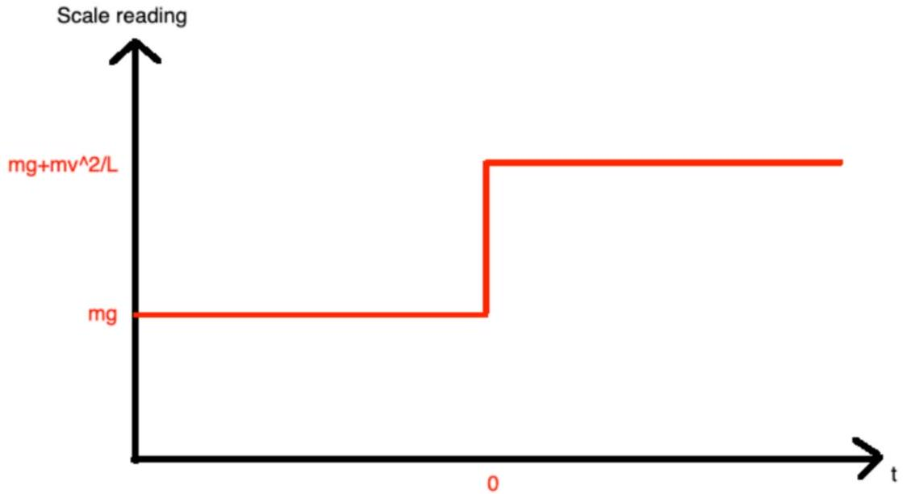

| Constant value before $\mathrm { t } = 0 \mathrm {~s}$ | +1.0 |
| :--- | :--- |
| Constant value after $\mathrm { t } = 0 \mathrm {~s}$ that is higher than $\mathrm { t } = 0 \mathrm {~s}$ value (if it is below $\mathrm { t } = 0 \mathrm {~s}$ value) | +2.0 (+1.75 marks instead) |
| Correct value of $\mathrm { mg } = 9.80 \mathrm {~N}$ or 1.0 kg before $\mathrm { t } = 0 \mathrm {~s}$ | +0.5 |
| Correct value of $\mathrm { mg } + \mathrm { mv } ^ { 2 } / \mathrm { L } = 9.82 \mathrm {~N}$ or 1.0025 kg after $\mathrm { t } = 0 \mathrm {~s}$ | +0.5 |
| Total | 4.0 |

3. Answer:
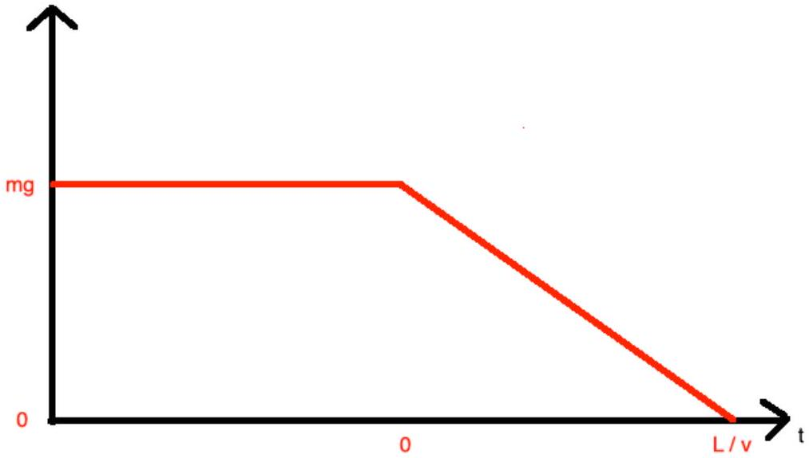

| Constant value before $\mathrm { t } = 0 \mathrm {~s}$ | +1.0 |
| :--- | :--- |
| Linear decrease after $\mathrm { t } = 0 \mathrm {~s}$ | +1.0 |
| Correct x-intercept at $\mathrm { t } = \mathrm { L } / \mathrm { v } = 8.7 \mathrm {~s}$ | +1.0 |
| Correct reading before $\mathrm { t } = 0 \mathrm {~s} ( 9.8 \mathrm {~N} )$ | +1.0 |
| Upspike after the linear decrease | -0.5 |
| Wrong time indicated for 'start lifting' | -0.5 |
| Total | 4.0 |

4. Answer:
Magnitude of acceleration of each mass: $\mathrm { a } _ { 1 } = \mathrm { F } _ { \mathrm { c } } / \mathrm { m }$
Magnitude of relative acceleration between two masses (since masses are accelerating towards each other): $\mathrm { a } = 2 \mathrm { a } _ { 1 } = 2 \mathrm {~F} _ { \mathrm { c } } / \mathrm { m }$

Time of closing phase:

$$
\begin{aligned}
& \mathrm { s } = \mathrm { ut } + 1 / 2 \mathrm { at } ^ { 2 } \rightarrow \mathrm {~L} = 0 \mathrm {~m} / \mathrm { s } \times \mathrm { t } + 1 / 2 \mathrm { at } ^ { 2 } \rightarrow \mathrm {~L} = 1 / 2 \mathrm { at } ^ { 2 } \rightarrow \mathrm { t } = \operatorname { sqrt } ( 2 \mathrm {~L} / \mathrm { a } ) = \operatorname { sqrt } \left( 2 \mathrm {~L} / \left( 2 \mathrm {~F} _ { \mathrm { c } } / \mathrm { m } \right) \right) = \operatorname { sqrt } ( \mathrm { mL } / \\
& \left. \mathrm { F } _ { \mathrm { c } } \right) = \operatorname { sqrt } ( 0.5 \mathrm {~kg} \times 1.3 \mathrm {~m} / 1.4 \mathrm {~N} ) = 0.68 \mathrm {~s}
\end{aligned}
$$

Time of opening phase:

$$
\mathrm { t } = \operatorname { sqrt } \left( \mathrm { mL } / \mathrm { F } _ { \mathrm { o } } \right) = \operatorname { sqrt } ( 0.5 \mathrm {~kg} \times 1.3 \mathrm {~m} / 1.4 \mathrm {~N} ) = 0.68 \mathrm {~s}
$$

Total time for one closing-opening cycle $= 0.68 \mathrm {~s} + 0.68 \mathrm {~s} = 1.36 \mathrm {~s}$

| Acceleration of first mass | +0.5 |
| :--- | :--- |
| Acceleration of second mass | +0.5 |
| Relative acceleration of each mass OR half distance travelled | +1.0 |
| Correct process to up to obtaining the closing phase time | +1.0 |
| Correct closing/opening phase time | +0.5 |
| Total time | +0.5 |
| Total | 4.0 |

5. Answer:

| Correct explanation in terms of Newton's Third Law | +1.0 |
| :--- | :--- |
| Correct explanation in terms of conservation of momentum | +1.0 |
| Total | 2.0 |

6. Answer:

| Rear mass closing phase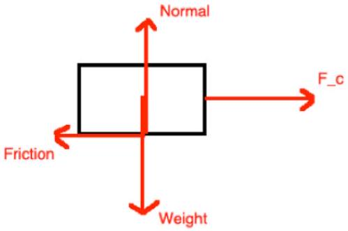 $\begin{aligned} & \mathrm { N } = \mathrm { W } = 4.9 \mathrm {~N} \\ & \mathrm {~F} _ { \mathrm { c } } = 1.4 \mathrm {~N} \\ & \text { Friction } = 0.74 \mathrm {~N} \end{aligned}$ | Front mass closing phase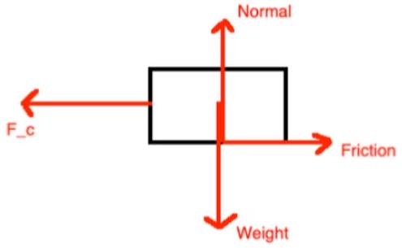 $\begin{aligned} & \mathrm { N } = \mathrm { W } = 4.9 \mathrm {~N} \\ & \mathrm {~F} _ { \mathrm { c } } = 1.4 \mathrm {~N} \\ & \text { Friction } = 1.23 \mathrm {~N} \end{aligned}$ |
| :--- | :--- |
| Rear mass opening phase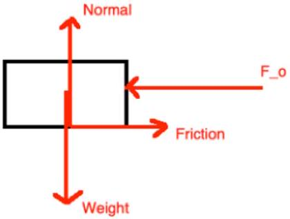 $\begin{aligned} & \mathrm { N } = \mathrm { W } = 4.9 \mathrm {~N} \\ & \mathrm {~F} _ { \mathrm { o } } = 1.4 \mathrm {~N} \end{aligned}$   Friction $= 1.23 \mathrm {~N}$ | Front mass opening phase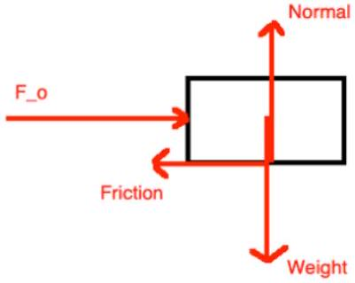 $\begin{aligned} & \mathrm { N } = \mathrm { W } = 4.9 \mathrm {~N} \\ & \mathrm {~F} _ { \mathrm { o } } = 1.4 \mathrm {~N} \\ & \text { Friction } = 0.74 \mathrm {~N} \end{aligned}$ |

For each of the four diagrams marks are awarded for the following. This makes a total of four makes when considering all four diagrams.

| Both normal and weight force included (balanced) | +0.25 |
| :--- | :--- |
| Friction force in correct direction | +0.25 |
| Closing / opening force in correct direction | +0.25 |
| Magnitude of closing / opening force is larger than magnitude of friction | +0.25 |
| Total | $1.0 \times 4 = 4.0$ |

7. Answer:
Closing phase:
Sum of horizontal forces on rear mass: $\mathrm { ma } _ { \mathrm { r } } = \mathrm { F } _ { \mathrm { c } } - \mu _ { \mathrm { f } } \mathrm { mg } = \rightarrow \mathrm { a } _ { \mathrm { r } } = \mathrm { F } _ { \mathrm { c } } / \mathrm { m } - \mu _ { \mathrm { f } } \mathrm { g }$
Sum of horizontal forces on front mass: $\mathrm { ma } _ { \mathrm { f } } = \mu _ { \mathrm { b } } \mathrm { mg } - \mathrm { F } _ { \mathrm { c } } \rightarrow \mathrm { a } _ { \mathrm { f } } = \mu _ { \mathrm { b } } \mathrm { g } - \mathrm { F } _ { \mathrm { c } } / \mathrm { m }$
Relative acceleration between two masses: $\mathrm { a } = \mu _ { \mathrm { b } } \mathrm { g } - \mathrm { F } _ { \mathrm { c } } / \mathrm { m } - \left( \mathrm { F } _ { \mathrm { c } } / \mathrm { m } - \mu _ { \mathrm { f } } \mathrm { g } \right) = \left( \mu _ { \mathrm { b } } + \mu _ { \mathrm { f } } \right) \mathrm { g } - 2 \mathrm {~F} _ { \mathrm { c } } / \mathrm { m }$ $\mathrm { s } = \mathrm { ut } + \frac { 1 } { 2 } \mathrm { at } ^ { 2 } \rightarrow - \mathrm { L } = 0 \mathrm {~m} / \mathrm { s } \times \mathrm { t } + \frac { 1 } { 2 } \mathrm { at } ^ { 2 } \rightarrow - \mathrm { L } = \frac { 1 } { 2 } \mathrm { at } ^ { 2 }$
Time to close: $\mathrm { t } = \operatorname { sqrt } ( - 2 \mathrm {~L} / \mathrm { a } ) = \operatorname { sqrt } \left( 2 \mathrm {~L} / \left( 2 \mathrm {~F} _ { \mathrm { c } } / \mathrm { m } - \left( \mu _ { \mathrm { b } } + \mu _ { \mathrm { f } } \right) \mathrm { g } \right) \right) = \operatorname { sqrt } ( 2 \times 1.3 \mathrm {~m} / ( 2 \times 1.4 \mathrm {~N} / 0.5 \mathrm {~kg} -$ $\left. \left. ( 0.25 + 0.15 ) \times 9.8 \mathrm {~m} / \mathrm { s } ^ { 2 } \right) \right) = 1.24 \mathrm {~s}$

Distance that rear mass moves in closing phase: $\mathrm { s } _ { \mathrm { r } } = \mathrm { ut } + \frac { 1 } { 2 } \mathrm { a } _ { \mathrm { r } } \mathrm { t } ^ { 2 } = 0 \mathrm {~m} / \mathrm { s } \times 1.24 \mathrm {~s} + \frac { 1 } { 2 } \times ( 1.4 \mathrm {~N} / 0.5 \mathrm {~kg} -$ $\left. 0.15 \times 9.8 \mathrm {~m} / \mathrm { s } ^ { 2 } \right) \times ( 1.24 \mathrm {~s} ) ^ { 2 } = 1.02 \mathrm {~m}$

Opening phase:
Sum of horizontal forces on rear mass: $\mathrm { ma } _ { \mathrm { r } } = \mu _ { \mathrm { b } } \mathrm { mg } - \mathrm { F } _ { \mathrm { o } } \rightarrow \mathrm { a } _ { \mathrm { r } } = \mu _ { \mathrm { b } } \mathrm { g } - \mathrm { F } _ { \mathrm { o } } / \mathrm { m }$
Sum of horizontal forces on front mass: $\mathrm { ma } _ { \mathrm { f } } = \mathrm { F } _ { \mathrm { o } } - \mu _ { \mathrm { f } } \mathrm { mg } \rightarrow \mathrm { a } _ { \mathrm { f } } = \mathrm { F } _ { \mathrm { o } } / \mathrm { m } - \mu _ { \mathrm { f } } \mathrm { g }$
Relative acceleration between two masses: $\mathrm { a } = \mathrm { F } _ { \mathrm { o } } / \mathrm { m } - \mu _ { \mathrm { f } } \mathrm { g } - \left( \mu _ { \mathrm { b } } \mathrm { g } - \mathrm { F } _ { \mathrm { o } } / \mathrm { m } \right) = 2 \mathrm {~F} _ { \mathrm { o } } / \mathrm { m } - \left( \mu _ { \mathrm { f } } + \mu _ { \mathrm { b } } \right) \mathrm { g }$ $\mathrm { s } = \mathrm { ut } + \frac { 1 } { 2 } \mathrm { at } ^ { 2 } \rightarrow \mathrm {~L} = 0 \mathrm {~m} / \mathrm { s } \times \mathrm { t } + \frac { 1 } { 2 } \mathrm { at } ^ { 2 } \rightarrow \mathrm {~L} = \frac { 1 } { 2 } \mathrm { at } ^ { 2 }$

Time to open: $\mathrm { t } = \operatorname { sqrt } ( 2 \mathrm {~L} / \mathrm { a } ) = \operatorname { sqrt } \left( 2 \mathrm {~L} / \left( 2 \mathrm {~F} _ { \mathrm { o } } / \mathrm { m } - \left( \mu _ { \mathrm { f } } + \mu _ { \mathrm { b } } \right) \mathrm { g } \right) \right) = \operatorname { sqrt } ( 2 \times 1.3 \mathrm {~m} / ( 2 \times 1.4 \mathrm {~N} / 0.5 \mathrm {~kg} -$ $\left. \left. ( 0.25 + 0.15 ) \times 9.8 \mathrm {~m} / \mathrm { s } ^ { 2 } \right) \right) = 1.24 \mathrm {~s}$

Displacement of rear mass in opening phase: $\mathrm { s } _ { \mathrm { r } } = \mathrm { ut } + \frac { 1 } { 2 } \mathrm { a } _ { \mathrm { r } } \mathrm { t } ^ { 2 } = 0 \mathrm {~m} / \mathrm { s } \times 1.24 \mathrm {~s} + \frac { 1 } { 2 } \times \left( 0.25 \times 9.8 \mathrm {~m} / \mathrm { s } ^ { 2 } - \right.$ $1.4 \mathrm {~N} / 0.5 \mathrm {~kg} ) \times ( 1.24 \mathrm {~s} ) ^ { 2 } = - 0.27 \mathrm {~m}$

Total distance that rear mass moves = Total distance which centre moves forward = 1.02 m - 0.27 m = 0.75 m

| Correct sum of forces equation in closing phase on rear mass | +0.5 |
| :--- | :--- |
| Correct sum of forces equation in closing phase on front mass | +0.5 |
| Relative acceleration between two masses calculation in closing phase | +1.0 |
| Calculation of time to close | +0.5 |
| Calculation of distance that rear mass moves in closing phase | +0.5 |
| Correct sum of forces equation in opening phase on rear mass | +0.5 |
| Correct sum of forces equation in opening phase on front mass | +0.5 |
| Relative acceleration between two masses calculation in opening phase | +1 |
| Calculation of time to open | +0.5 |
| Calculation of distance that rear mass moves in opening phase | +0.5 |
| Correct adding / subtracting the two distances to get the final answer | +1 |
| Total | 7.0 |

8. Answer: During the closing phase, the front mass will stay in place while the rear mass will be pulled forward. During the opening phase, the rear mass will stay in place while the front mass is pushed forward.

| During the closing phase, the front mass will stay in place while the rear mass will be pulled forward | +1.0 |
| :--- | :--- |
| During the opening phase, the rear mass will stay in place while the front mass is pushed forward | +1.0 |
| Total | 2.0 |

## Section C: Violin Vibrations (32 marks)

1. Answer: 400Hz (1 mark)
2. Answer:

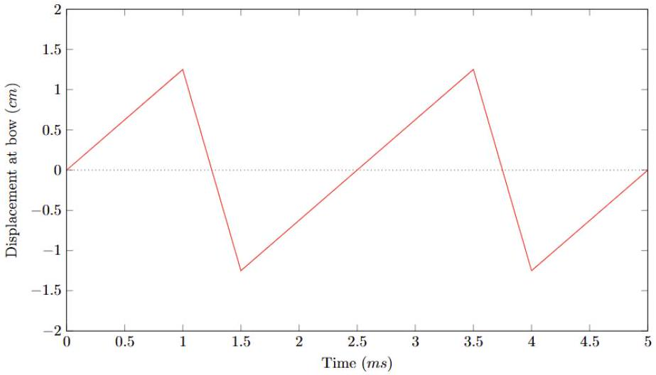

| Axes labels, units and scale - Must be displacement vs time - Units must be compatible with the label - Scale must be regular - Scale does not need to be the right order of magnitude - 1 mark per correct axes  | +2.0 |
| :--- | :--- |
| Correct shape Only 1 mark for sawtooth-like shape | +2.0 |
| Correct period with correct units | +1.0 |
| Correct Amplitude Only 1 mark if wrong units | +2.0 |
| Shape not periodic | -1.0 |
| Total | 7.0 |

3. Solution:
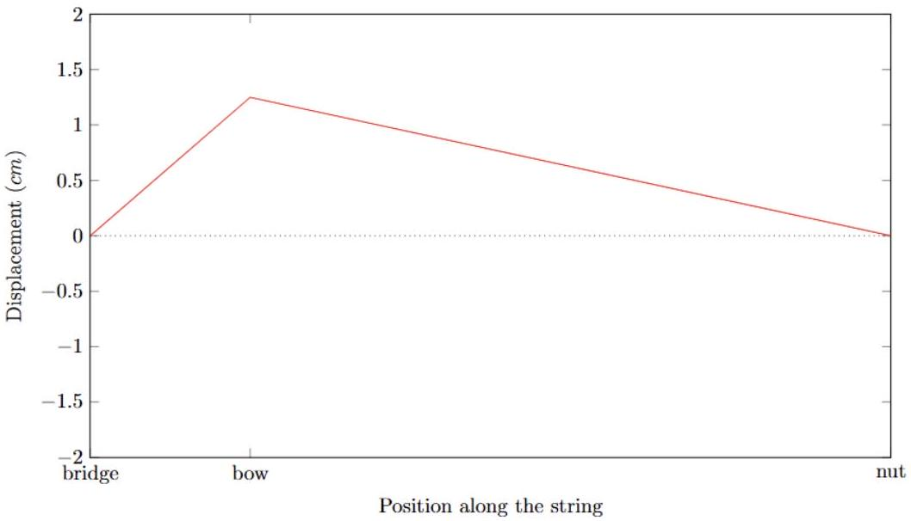

| Correct Overall Shape 1 mark if peak is clearly at bow Max 1 mark if peak is smooth -0.5 if the displacement is negative | +2.0 |
| :--- | :--- |
| Only 2 nodes | +1.0 |
| Correct displacement at the bow (peak at +-1.25 cm) | +1.0 |
| No displacement at the bridge and nut | +1.0 |
| Correct axes label, units and scale | +1.0 |
| Total | 6.0 |

4. Answer:

$$
\begin{aligned}
& m / s = ( k g m / s \wedge 2 ) ^ { \wedge } a * ( k g / m ) ^ { \wedge } b \\
& \text { For } k g : a = - b \\
& \text { For } m : a + b = 0 \\
& a = 1 / 2 \\
& b = - 1 / 2
\end{aligned}
$$

| relevant working | +2.0 |
| :--- | :--- |
| mark for both correct answers | +1.0 |
| Total | 3.0 |

5. Answer:
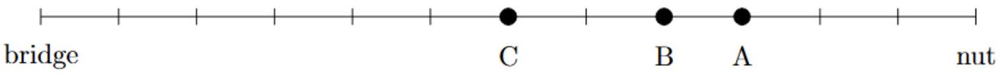

| Three correct points | 2.0/2.0 |
| :--- | :--- |
| Only one or two correct points | 1.0/2.0 |

6. Solution:

A: 4f_open
B: 3f_open
C: 2f_open

| Reasonable Working | +1.0 |
| :--- | :--- |
| Three correct frequencies, only one mark if one or two are correct | +2.0 |
| Total | 3.0 |

7. Answer:
$\mathrm { L } _ { \mathrm { B } } = \mathrm { f } _ { \mathrm { A } } \mathrm { L } / \mathrm { f } _ { \mathrm { B } }$
The final effective length is $\mathrm { L } ^ { \prime } = 3 \mathrm {~L} _ { \mathrm { B } } / 4$
The frequency is $\mathrm { f } = \mathrm { f } _ { \mathrm { B } } \mathrm { L } _ { \mathrm { B } } / \mathrm { L } ^ { \prime } = 4 \mathrm { f } _ { \mathrm { B } } / 3 = 658.51 \mathrm {~Hz}$

| Reasonable Working One mark awarded if identified frequency is inversely proportional to wavelength Maximum 1.5 marks if speed of sound in air is used as v | +3.0 |
| :--- | :--- |
| Correct Answer and units | +1.0 |
| Correct 5s.f. | +1.0 |
| Total | 5.0 |

8. Answer:

$$
\begin{aligned}
& \mathrm { f } ( \mathrm {~N} ) = \mathrm { f } _ { 0 } \times 2 ^ { \mathrm { N } / 10 } \\
& \mathrm { f } ( \mathrm {~N} ) = 106.2 \mathrm {~Hz}
\end{aligned}
$$

| Reasonable Working | +1.0 |
| :--- | :--- |
| Identifying Exponential Growth | +1.0 |
| Correct answer and untis | +1.0 |
| Correct 4 s.f. | +1.0 |
| Correct equation | +1.0 |
| Total - note, zero marks awarded if assumed to be linear | 5.0 |

## Section D: Reflection Replicas (5 marks)

1. Solution:
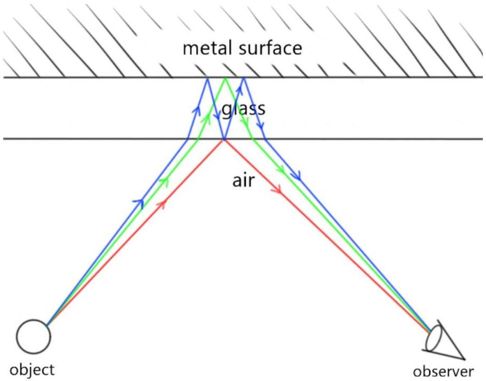
There are three possible paths that the light from the object can take to reach the camera/viewer, one just reflecting off the surface of the mirror (red), one entering the glass and reflecting off of the back of the mirror (green), and one reflecting off the back of the mirror, reflecting off the inside of the glass layer and then reflecting off the back again (blue). By tracing these rays back from the observer in a straight line, we can see that the apparent positions of these three paths are slightly shifted away from each other, creating the three reflections seen in the photo.

| Correct paths Award: - + 0.5 for reflection off glass - + 1 for refraction and 1 reflection off mirror - + 1.25 multiple reflections through the glass - + 0.25 fully correct - -0.5 light transmitted through metal surface  | +3.0 |
| :--- | :--- |
| Explanation | +2.0 |
| Total | 5.0 |

## Section E: Twisting Torques and Leaning Lego (24 marks)

1. Solution: Clockwise, Anti-clockwise, Clockwise (1 mark each)
2. Solution:
    a)
| Forces are balanced | +0.5 |
| :--- | :--- |
| Forces in each direction are clearly unbalanced | +1.5 |
| Total | 2.0 |
    b)
| Forces are balanced | +0.5 |
| :--- | :--- |
| Torques are balanced | +0.5 |
| Correct diagram that agrees with written answer | +0.5 |
| Diagram correctly labelled | +0.5 |
| Total | 2.0 |
    c)
| mark force unbalanced, net force in direction of acceleration | +0.5 |
| :--- | :--- |
| mark torque balanced (OR unbalanced if talking specifically about the wheel (refer to diagram, if answer is physically correct with different assumptions, mark as correct)) | +0.5 |
| mark correct diagram (agrees with torque and force answer) | +0.5 |
| mark diagram labels | +0.5 |
| Total | 2.0 |

3. Solution:
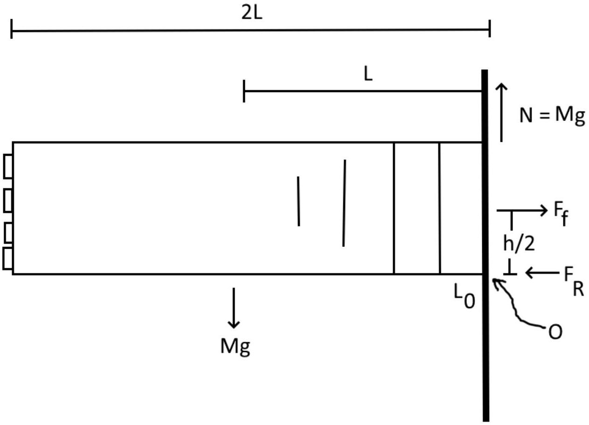

| Equivalent mass of tower with force acting down, or distributed at each brick. No marks if at end of tower if otherwise full marks. No marks for generic FBD with no context. | +0.5 |
| :--- | :--- |
| Upwards force at wall counteracting mass | +1.0 |
| Friction force in a reasonable place | +1.0 |
| Origin for point of rotation | +1.0 |
| Forces labelled correctly | +0.5 |
| Total | 4.0 |
4. Solution:
The tower will break at the wall. Assuming that the same friction force exists between each brick, the biggest cumulative moment/torque is experienced at the end.

| The tower will break at the wall. | +1.0 |
| :--- | :--- |
| Assuming that the same friction force exists between each brick | +1.0 |
| The biggest cumulative moment/torque is experienced at the end. | +1.0 |
| Total | 3.0 |

5. Solution:
$\mathrm { n } =$ number of blocks, $\mathrm { L } \_ 0 =$ length of one Lego brick (base to base of studs), $\mathrm { h } =$ height of Lego brick (long dimension), $\mathrm { M } =$ mass of tower, $\mathrm { g } = 9.81 \mathrm {~m} / \mathrm { s } 2 , \mathrm {~L} =$ length from wall to $\mathrm { CoM } = \mathrm { L } \_ 0 * \mathrm { n } / 2$
(Sig) M_O = 0
$\mathrm { MgL } = 0.5 ^ { * } \mathrm {~h} ^ { * } \mathrm {~F}$
$\mathrm { F } = \mathrm { Mn } \mu \mathrm { g }$
$\mathrm { Mg } \mathrm { n } \mathrm { L } \_ 0 / 2 = \mathrm { h } \mathrm { Mg } \mu$
$\mu = \mathrm { n } * \mathrm {~L} \_ 0 / \left( 2 ^ { * } \mathrm {~h} ^ { * } 0.5 \right) = \mathrm { n } * \mathrm {~L} \_ 0 / \mathrm { h }$
μ = 13.28

| Defining Variables (don't have to be the same as the solutions) | +1.0 |
| :--- | :--- |
| $\mathrm { Mg } \mathrm { n } \mathrm { L } \_ 0 / 2 = \mathrm { h } \mathrm { Mg } \mu$ | +1.0 |
| $\mu = \mathrm { n } * \mathrm {~L} \_ 0 / \left( 2 ^ { * } \mathrm {~h} ^ { * } 0.5 \right) = \mathrm { n } * \mathrm {~L} \_ 0 / \mathrm { h }$ | +1.0 |
| $\mu = 13.28$ | +1.0 |
| Total | 4.0 |

Alternative part marks:

| calculated a torque, accounting for radius. Putting the radius at L or L/2 is fine. It's ok if they then equate this to the vertical friction force (even though this doesn't make dimensional sense) | +0.5 |
| :--- | :--- |
| calculated both torques, accounting for both radii. | +1.0 |
| An indication that they understand the normal force is from studs in the correct direction in this situation. | +0.25 |

6. Solution
$\mathrm { MgL } = 0.5 ^ { * } \mathrm {~h} * \mathrm { Mg } \mu + 0.5 \mathrm {~h} * \mathrm {~N} \mu$
(this is friction due to normal forces plus specifically compressive forces separately.)
$\mathrm { N } = \mathrm { Mg } ( \mathrm { L } - 0.5 \mathrm {~h} \mu ) / ( 0.5 \mathrm {~h} \mu )$
$\mathrm { N } = 145.31 \mathrm {~N}$

| $\mathrm { MgL } = 0.5 ^ { * } \mathrm {~h} * \mathrm { Mg } \mu + 0.5 \mathrm {~h} * \mathrm {~N} \mu$ | +1.0 |
| :--- | :--- |
| $\mathrm { N } = \mathrm { Mg } ( \mathrm { L } - 0.5 \mathrm {~h} \mu ) / ( 0.5 \mathrm {~h} \mu )$ | +1.0 |
| $\mathrm { N } = 145.31 \mathrm {~N}$ | +2.0 |
| Total | 4.0 |

Alternative partial marks

| compute necessary additional horizontal friction force in the correct direction.   No penalty for errors in numerical values from the previous question. But they don't get the mark unless they've used torque in the previous parts. | +0.5 |
| :--- | :--- |
| Explanation that demonstrates they understand what the compression force is. Giving it other names (e.g. squeezing) is ok. | +0.5 |
