## SOLUTIONS TO BPLO 2002 PAPER 2

Q1
(a) (1) $I = 5 \mathrm { amps }$
(ii) $\quad 20 = 6 I + 8$ $I = 2 \mathrm { amps }$
(iii) Balanced Wheat Tone Bridge $I = 0$
(iv) $6 \Omega$ in pinallel will $( 6 \Omega + 6 \Omega ) = 12 \Omega$ gavis $\left( \frac { 1 } { 6 } + \frac { 1 } { 12 } \right) = 4 \Omega \quad 2$ \} $42 + 6 \Omega = 10 \Omega$. $I = \frac { 20 } { 10 } = 2 \mathrm { amps }$.

Q1 (b)
Marks
bindition of squarterise

$$
\begin{equation*}
\frac { d N } { d t } = \frac { d N _ { i } } { d t } \text { where } \quad N = N _ { i } e ^ { - \lambda _ { i } t ^ { 2 } } \tag{1}
\end{equation*}
$$

2
Now helf ef $T _ { i } \equiv \ln 2 / \lambda _ { i }$ (a)
Hence form (1) 1(3)

$$
\begin{aligned}
N _ { 1 } T _ { 2 } & = N _ { 2 } T _ { 2 } \\
T _ { 1 } & = \frac { N _ { 1 } } { N _ { 1 } } T _ { 2 }
\end{aligned}
$$

$$
2
$$

$$
\left. \begin{array} { r l }
\text { Now } \frac { N _ { 1 } } { N _ { 2 } } & \left. = \left( \frac { 1.00 } { 288 } \right) \left\lvert \, \frac { 0.300 \times 10 ^ { - 6 } } { 226 } \right. \right\} \\
& \left. = \left( \frac { 726 } { 238 } \right) \frac { 10 ^ { 6 } } { ( 0.300 } \right) \\
T _ { 1 } & = \left( \frac { 226 } { 238 } \right) \left( \frac { 16 } { 0.300 } \right) + 602 \text { years } \\
& = 5.07 \times 10 ^ { 9 } \text { year }
\end{array} \right\}
$$

[8]

Sometions
Q1 (c)
By symmethy beam hoyciated If composern of spanings all $x$ then
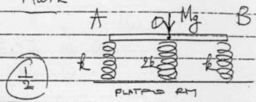

$$
\begin{aligned}
& M g = k x + 2 k x + k x = 4 k x \\
& x = \frac { M g } { 4 k }
\end{aligned}
$$

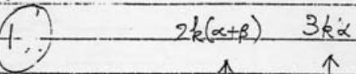
ii) No symmetry, beama michied Assume spaning B depresed ty $\alpha$ spang 0 . by $( \alpha + \beta )$ spring $A$ " $n ( \alpha + 2 \beta )$.
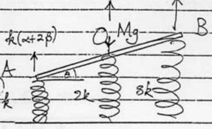
as the comferesemenust be linear - beam lineir Upwords force:
Resolving force verticilly

$$
\frac { 3 k \alpha } { 2 k ( \alpha + \beta ) } \frac { k ( \alpha + 2 \beta ) } { }
$$

$$
\begin{gather*}
3 k \alpha + 2 k ( \alpha + \beta ) + k ( \alpha + 2 \beta ) = M g  \tag{1}\\
k ( k + \alpha + 4 \beta ) = M g
\end{gather*}
$$

Moments about of or been bingth Ze widneid at angle $\theta$ gues (Alternative moments about Aor B accipfable)
heck ✓

$$
\begin{aligned}
( \operatorname { lin } \theta ) k ( \alpha + 2 \beta ) & = ( \ln \theta ) k ( \alpha ) \\
2 \alpha & = 2 \beta ( 1 )
\end{aligned} , \alpha = \beta = \frac { \mu _ { s } } { 10 k } ( 1 )
$$

Moments about B:

$$
\begin{aligned}
& M g - 2 k ( \alpha + \beta ) = 2 k ( \alpha + 2 \beta ) \\
& k ( 4 \alpha + 6 \beta ) = M g - \quad \alpha = \frac { 10 k } { 10 k }
\end{aligned}
$$

Comparational forceo:

$$
\left. \begin{array} { l }
A : \frac { 3 \mathrm { Mg } } { 10 } \mathrm {~g} \\
0 : \frac { 4 + 4 \mathrm {~g} } { 10 } \\
B : \frac { 34 \mathrm { tg } } { 10 }
\end{array} \right\} ( 1 )
$$

[8 A

(i) It ignition weigt of rocket balance its threst
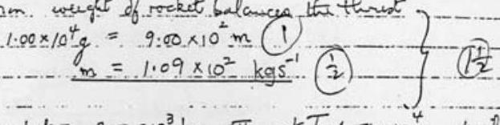
(r) $M _ { 2 } = M _ { \text {mos } }$ of recket $= 2.00 \times 10 ^ { 3 } \mathrm {~kg}$ ता $V$ monet $T = 1.00 \times 10 ^ { 4 } \mathrm {~g}$, Heyth $M _ { 2 } \mathrm {~g}$

Now
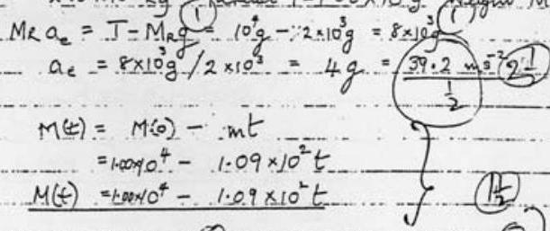
(10)
(18)
(18)
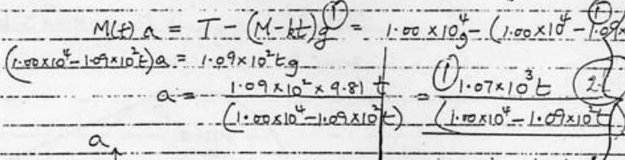
by gromil
Grapth
$\left( 3 - \frac { 1 } { 2 } \right)$.
t

Igand: thenic meat lit goond
$t _ { e } \rightarrow$ to groupt: recketin free fall.
[12]
[ ]
三
(e) Large raindrop $\quad I _ { c c } = 10 ^ { - 6 } \mathrm {~m} ^ { 3 }$
mass morecules $10 ^ { - 6 } ( 1000 ) = 10 ^ { - 3 } \mathrm {~kg} \left( 10 ^ { - 3 } \cdots \mathrm {~kg} \mathrm { prem } ^ { 3 } \right)$
No, of mores in
meterites in
$10 ^ { - 6 } ( 1000 ) = 10 ^ { - 3 } \mathrm {~kg} _ { 23 } \left( 1000 \mathrm {~kg} \mathrm { prm } ^ { 3 } \right)$
$= 6 \times 10 ^ { 23 } \left( \frac { 10 ^ { - 3 } } { 18 \times 10 ^ { - 3 } } \right) ( \mathrm { mol } \cdot \mathrm { wt } 18 ) 3$
$= \frac { 1 } { 3 } \left( 10 ^ { 23 } \right)$

Q1 (e) Vol of Med. $= \frac { 1 } { 3 } \left( 10 ^ { 23 } \right) \left( 10 ^ { - 6 } \right) \mathrm { m } ^ { 3 } = 3 \times 10 ^ { 16 } \mathrm {~m} ^ { 3 } - 2$
(f) Stationary above equator
Percod of Moon 28 days
Kepher's Law: $( 28 ) ^ { 2 } = k \quad \left( 3.82 \times 10 ^ { 8 } \right) ^ { 3 }$
Percod of satallite 1 day
Kepler's Law: $1 ^ { 2 } = k R ^ { 3 }$ $\geq 1$
Solumg for $R$ : $R = 4.12 \times 10 ^ { 4 } \mathrm {~km}$ 21
[ Satallite $\left( R - R _ { E } \right)$ above Earls's sufferee $\left( R - R _ { E } \right) = 3.8 \times 10 ^ { 4 } \mathrm {~km}$ ]
Satellite sopmal tangential to Earth's cal face prior to extunction
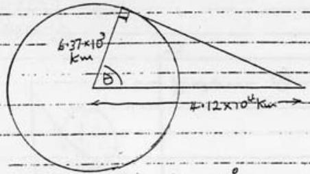

$$
\theta = \cos ^ { - 1 } ( 0.637 / 4.12 ) \approx 81 ^ { \circ }
$$

Cannot:- receive segnals at lablishes $> 81 ^ { \circ }$ drectly 2 [8] (but points thruyh further reflections.) [米]
(g). Mass of nuchin and proton both $m$
Mass of deulern 2 m
benservation of momentum

$$
m u _ { n } = m v _ { n } \pm 2 m v _ { d } - \dot { e } \quad u _ { n } = v _ { m } + 2 v _ { d } \theta 2
$$

benservation of energy

$$
\frac { 1 } { 2 } m u _ { n } ^ { 2 } = \frac { 1 } { 2 } m v _ { n } ^ { 2 } + \frac { 1 } { 2 } ( 2 m ) v _ { d } ^ { 2 } \dot { u } \quad u _ { n } ^ { 2 } = v _ { m } ^ { 2 } + 2 v _ { d } ^ { 2 } ( D )
$$

Eliminating $V _ { n }$ from (1) \& (2)

$$
\begin{aligned}
& u _ { n } ^ { 2 } = \left( u _ { n } - 2 v _ { \alpha } \right) ^ { 2 } + 2 v _ { \alpha } ^ { 2 } \\
& \frac { v _ { d } } { u _ { n } } = \frac { 2 } { 3 }
\end{aligned}
$$

3
Fraction of energy aqured by duction

$$
E = \frac { \frac { 1 } { 2 } ( 2 m ) v _ { \alpha } ^ { 2 } } { \frac { 1 } { 2 } ( m ) v _ { n } ^ { 2 } } = \frac { 2 v _ { n } ^ { 2 } } { v _ { n } ^ { 2 } } = 2 \left( \frac { 2 } { 3 } \right) ^ { 2 } = \frac { 8 } { 9 } \text { i } 89 \%
$$

2

(g.) If $n$ colleous slow reutron form 1 MeV to 0.01 et then $\left( \frac { 1 } { 9 } \right)$ it of energy retained by mention ofter each collision. Hence

$$
\begin{aligned}
& \left( \frac { 1 } { 9 } \right) ^ { n } < \frac { 0.01 } { 10 ^ { 6 } } = 10 ^ { - 8 } \\
& n > 8.38 \\
& 0 n = 9
\end{aligned}
$$

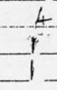
(h)

$$
\begin{aligned}
\sin \phi & = \hat { d } \\
d & = \lambda / \sin \phi \\
\dot { u } \phi & = 55.0 ^ { \circ } \\
d & = \frac { 590 } { 0.819 } \quad \left( \sin \theta = \sqrt { ( 0.50 ) ^ { 2 } + ( 0.35 ) ^ { 2 } } \right) \\
& = 720 \mathrm {~mm}
\end{aligned}
$$

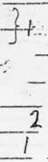
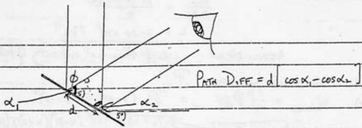

$$
\begin{aligned}
\text { Path difference } & = d \cos ( 90 - \phi + 5 ) - d \cos ( 90 - 5 ) \\
& = d [ \sin ( \phi - 5 ) - \sin ( 5 ) ] \\
& = d \left[ \sin \left( 50 ^ { \circ } \right) - \sin \left( 5 ^ { \circ } \right) \right] \\
\therefore \quad \lambda & = ( 720 ) ( 0.6788 ) = 489 \mathrm {~mm}
\end{aligned}
$$

Mark
Q2
(a) U. sum of P.E. out Fe of wotecules △ు cumplin with of end Of SPIVR (vol. Red )
$\Delta Q : \frac { \text { Heat produced } } { \text { (transferred to the syptem } }$ косимаям. ( valuease w vare (transferred to the system) Vilecumare W we W we $\Delta Q = \Delta U - \Delta W = \Delta U +$ pdV express for marks 2 to funces to funces

Full MARKS ONLY REQURS BESULT $\triangle Q = \triangle U -$
Heat To remose temply fram $20 \mathrm { Cl } ( 100 \mathrm { C } ( \operatorname { mans } \mathrm { m } )$ $= m ( 4200 ) 80 \mathrm {~J}$ $\frac { 1 } { 2 }$

Energy requured to boil water at $100 \mathrm { C } = \mathrm { mL } J$ 12 Energy supplied per see $P$

$$
P = m ( 4200 ) 80 ( 180 ) = \frac { m ( 4200 ) ( 4 ) } { 9 }
$$

$\frac { 1 } { 2 }$
In $1200 s$ emergy supplied

$$
\begin{aligned}
1200 P & = m L \\
P & = \frac { m L } { 1200 }
\end{aligned}
$$

$\frac { 1 } { 2 }$

Hence

$$
\begin{aligned}
\frac { m L } { 1200 } & = \frac { m ( 4200 ) ( 4 ) } { 9 } \\
L & = 2.24 \times 10 ^ { 6 } \mathrm { Jkg } ^ { - 1 }
\end{aligned}
$$

主过
Assumptrai : neglect thermal capacty of kettete [4]
(c) (i) Atmospheric persures $\mathbb { P }$ z
(ii) $W _ { \text {abmes } } = - \int \mathbb { P } d x = \mathbb { P } ( 0.10 ) \pi ( 0.12 ) ^ { 2 }$
given $1.01 \times 10 ^ { 5 } \mathrm {~Pa} _ { a }$

$$
\begin{aligned}
& = 0.76 ( 1.35 ) 10 ^ { 4 } ( 9.81 ) ( 0.10 ) \pi ( 0.122 ) ^ { 2 } \\
& = 1.6 ( 1.35 ) ( 9.81 \pi ( 1.44 ) \\
& = 24.55 \times 10 ^ { 2 } \mathrm {~J}
\end{aligned}
$$

$2 \frac { 1 } { 2 }$
(iii) $100 ^ { \circ } \mathrm { C }$
(iv)

$$
\begin{aligned}
Q _ { c } & = - \Delta U - \Delta W = L \Delta m - W _ { \text {nome } } . \\
& = - \left( 2.24 \times 10 ^ { 6 } \right) \frac { 1 } { 2 } \left( 0.37 \times 10 ^ { - 3 } \right) - 4.55 \times 10 ^ { 2 } \\
Q _ { c } & = - 8.7 \times 10 \mathrm {~J} \quad ( \text {-ve sign, heat tremsferred }
\end{aligned}
$$

$2 \frac { 1 } { 2 }$
(-ve sign, heat transferred to surrandanigs) [6]
(d)

$$
\begin{aligned}
\frac { 3 } { 2 } k T & = \frac { 1 } { 2 } m u ^ { 2 } = m g H \\
H = \frac { 3 k T } { 2 m g } & = \frac { 3 } { 2 } \frac { \left( 1.38 \times 10 ^ { - 23 } \right) 283 } { 32 \left( 1.67 \times 10 ^ { - 21 } \right) ( 9.81 ) } \\
& = 1.47 \times 10 ^ { 4 } \mathrm {~m}
\end{aligned}
$$

(Alternaturich on can wee $\frac { 3 } { 2 } k T = - G M M - \left[ \frac { 1 } { \left( R _ { E } + 1 \right) } - \frac { 1 } { R _ { E } } \right]$ with same reselt)

Excape :

$$
\begin{aligned}
\frac { 3 } { 2 } k T _ { s } & = \frac { m G M _ { c } } { R _ { E } } \\
T _ { s } & = \frac { 3 } { 3 k } \left( \frac { m G M _ { E } } { R _ { E } } \right) \\
& = \frac { 2 \left( 32 \times 1.67 \times 10 ^ { - 27 } \right) \left( 6.67 \times 10 ^ { - 11 } \right) ( 5.97 ) \times 10 ^ { 24 } } { 3 \left( 1.38 \times 10 ^ { - 23 } \right) \left( - 6.37 \times 10 ^ { 6 } \right) } \\
T _ { S } & = 1.6 \times 10 ^ { 5 } \mathrm {~K}
\end{aligned}
$$

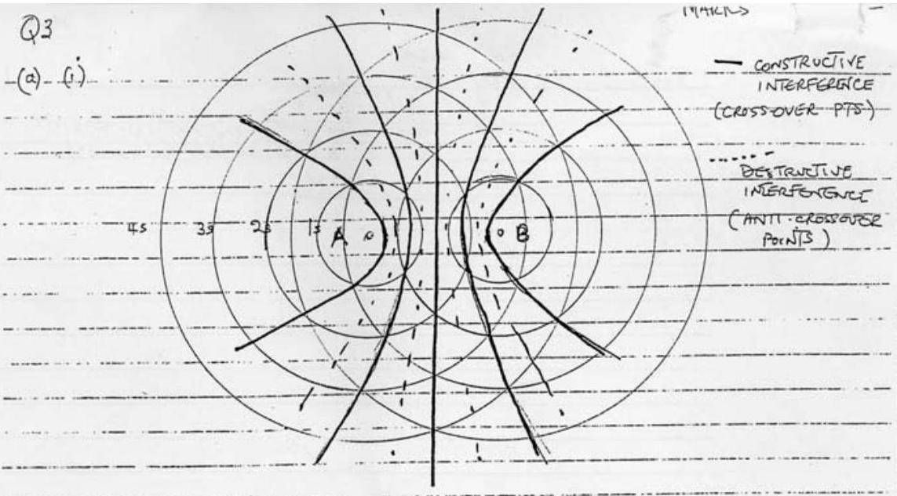
(i) Drawny of tus sets of areles to seale

27
(ii) Contractive: $\quad x = y = x d$
Detenctive:

$$
\begin{aligned}
& x - y = n \lambda \\
& x - y = \left( n + \frac { 1 } { 2 } \right) \lambda
\end{aligned}
$$

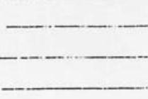
whe nis an integer
(iii) See diagram:
3 full (constructrie) curves
2 broken (destructive) curves.
(basus make for 2 extra lines ( $\frac { 1 } { 2 }$ mode for 1)
(iv)

$$
\begin{aligned}
s \cos \theta & = n \lambda \text { constructive } \\
& = \left( n + \frac { 1 } { 2 } \right) \lambda \text { destructure } \\
& \text { bow wave tougental }
\end{aligned}
$$

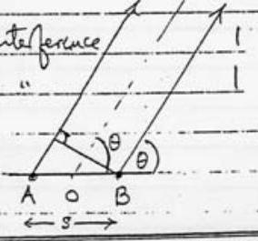

$$
\left. \underbrace { v _ { \text {boat } } } _ { \text {Interinet wave fronts more durance vb } } \right| _ { 2 }
$$

[10]
(b)
$\left. \begin{array} { l } \sin \phi = \frac { v _ { \text {wave } } } { v _ { \text {boat } } } = \frac { 2.5 } { 5.0 } = 0.5 \\ \phi = 30 ^ { \circ } \end{array} \right\}$ Checomicol 2

Q4

(a) (i) Velenty of charged partide constant asit is perpendicular to B fied which foredes a constant force perpendicilar it velocity, poducing curilarmation $1 \frac { 1 } { 2 }$ Direction of magnetic fied want be out of the dragram perpendicular to flame of $\frac { 1 } { 2 }$ diagrama
(ii) For curinlarmotion
$$
B Q v = \frac { M v ^ { 2 } } { R }
$$
$$
1 \frac { 1 } { 2 }
$$
$\bar { A } _ { s } r \neq 0$
$$
B Q R = M r
$$
$$
\frac { 1 } { 2 }
$$
$$
\text { (b) (i) } \begin{aligned}
& E = \frac { 1 } { 2 } A v ^ { 2 } = V Q \text { (B) } \quad v = \sqrt { \frac { 2 V Q } { m } } ( V - 500 V ) \\
& \text { Let } \quad v _ { 0 } = \sqrt { \frac { 2 V Q } { m _ { P } } } = \sqrt { \frac { 2 ( 500 ) \left( 1.60 \times 10 ^ { - 19 } \right) } { 1.67 \times 10 ^ { - 27 } } } = 3.095 \times 10 ^ { 5 } \mathrm {~m} ^ { - 1 } \\
& \text { For } \quad { } _ { 19 } ^ { 39 } \mathrm {~K} \quad V _ { 39 } = \sqrt { 39 } V _ { 0 } = 4.96 \times 10 ^ { 4 } \mathrm {~ms} ^ { - 1 }
\end{aligned}
$$
(ii) Speed at which in lit fin some as myetim speed 1 $v _ { \text {gat } }$ and $v _ { 4 }$. (gavein above) as speed constant for cercular motion
(iii) $O P = \frac { 2 R } { 2 M _ { V } }$ es Frajectored are semicidits
$$
\therefore O P = \frac { 2 M r } { B Q } \quad \text { form } ( A )
$$
Subst turing $M = 39 \mathrm { mp }$ and $M = 41 \mathrm { mp }$, the value
$$
\text { of } v _ { 34 } \text { and } v _ { 41 } \text { and } B = 0.7 I
$$
$$
( 00 ) _ { 39 } = 5.76 \mathrm {~cm}
$$
$$
( O P ) _ { 41 } = 5.91 \mathrm {~cm}
$$
$$
\left( B \triangle O P = ( O P ) _ { 41 } - ( O P ) _ { 39 } = 0.15 \mathrm {~cm} \right)
$$
(e)
[7]

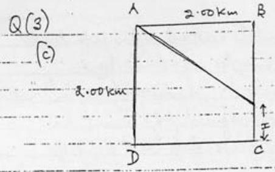
(1) $\lambda = \frac { 3 \times 10 ^ { 8 } } { 1 \times 10 ^ { 7 } } = 30 \mathrm {~m}$

Tota
(11)

At B

$$
\begin{aligned}
2000 & = m \lambda = m 30 \frac { 1 } { 2 } \\
m & = \frac { 2000 } { 30 } = 66.7 \frac { 1 } { 2 }
\end{aligned}
$$

Using units of km
(ii)

$$
\begin{aligned}
( 2 \sqrt { 2 } - 2 ) & = n \lambda = \left( \frac { - 30 } { 1000 } \right) n \\
n & = \frac { 200 } { 3 } ( \sqrt { 2 } - 1 ) = 27.6
\end{aligned}
$$

Path difference

$$
\begin{aligned}
\sqrt { 2 ^ { 2 } + ( 2 - x ) ^ { 2 } } - ( 2 - x ) & = 28 \lambda = 28 \left( \frac { 10 } { 1000 } \right) \\
& = \frac { 21 } { 25 }
\end{aligned}
$$

2
Eitara Substutute $x = 0.039 \mathrm {~km}$ and verfy that LHS = RHS of equation
OR

$$
\begin{aligned}
\sqrt { 2 ^ { 2 } + ( 2 - x ) ^ { 2 } } & = \frac { 21 } { 25 } + ( 2 - x ) \\
2 ^ { 2 } + ( 2 - x ) ^ { 2 } & = \left( \frac { 21 } { 25 } + ( 2 - x ) \right) ^ { 2 } \\
& = \left( \frac { 21 } { 25 } \right) ^ { 2 } + 2 \frac { 21 } { 25 } - ( 2 - x ) + ( 2 + x ) ^ { 2 } \\
2 ^ { 2 } & = \left( \frac { 21 } { 25 } \right) ^ { 2 } + \frac { 42 } { 25 } ( 2 - x ) \\
x & = \left[ \frac { ( 21 ) ^ { 2 } } { ( 25 ) ^ { 2 } } - 2 ^ { 2 } + \frac { 84 } { 25 } \right] \frac { 25 } { 42 } \\
& = \frac { 25 } { 44 } \left[ \left[ \frac { 21 } { 25 } \right) - \frac { 16 } { 25 } \right] \\
& = \frac { 25 } { 44 } \left( \frac { 1 } { 25 } \right) ^ { 2 } [ 441 - 100 ] \\
& = \frac { 41 } { ( 42 ) ( 25 ) } \\
& = 0.039 \mathrm {~km} \\
& = 39 \mathrm {~m}
\end{aligned}
$$

Q4
(c)(i) Ove can obtain the OP variation for
$V = ( 500 \pm 5 )$ ✓ by taking the lembry eases
505 V and 495V. However it is sumpler to apply
calculus - both method obtain foll moles
Corcous Mentos

$$
\begin{aligned}
\Delta O P & = \frac { 2 \Delta R } { \sqrt { 2 M E } } \frac { \Delta E } { Q B } \\
& = \frac { \Delta E } { E }
\end{aligned}
$$

trou (B)
Subst tuting $\frac { \Delta E } { E } = \pm \frac { 5 } { 100 } = \pm 0.01$ antita imean values of Mand IE

$$
\Delta O P \equiv 0.06 \mathrm {~cm}
$$

oR
Limilia Case Mettad will gue sop $= 0.06$ for eaching
Thus each in has an unrestanty of ±0.06cm In worst situation when displacements in opposite directions, due If (500±5) v, this leads to a separation of the two ind of $( 0.15 - 0.12 ) = 0.03 \mathrm {~cm} 2$ (egnation (c)). Carsequently be spectrameter is capable to destrugurohing the two species
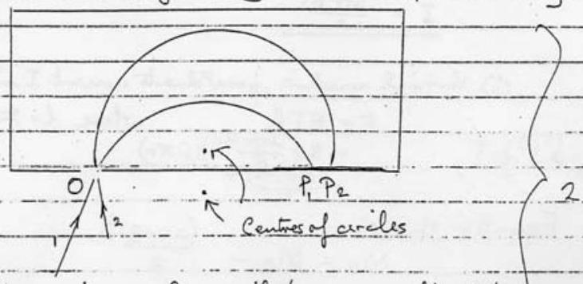

Paths nemain cerchlar, with the same radius, but centro of circles no longeraling op

(1) Resultant vestrial downward force on student $= 5 \mathrm {~g} \mathrm {~N}$ Vectical doumward acceleration $= \frac { 5 } { 80 } g = \frac { 9.81 } { 16 } = 0.613 \mathrm {~ms} ^ { - 2 } \quad 1 \frac { 1 } { 2 }$
(ii) $\frac { 1 } { 16 } \mathrm {~g}$ is the vertical companent of acceleration dour slope Thus acceleration down slope is
$$
\begin{equation*}
\frac { 1 } { 16 } g \frac { 1 } { \cos 60 ^ { \circ } } = \frac { 1 } { 8 } g = 1.23 \mathrm {~ms} ^ { - 2 } \tag{3}
\end{equation*}
$$
(iii) Resoloring down slope, where $R$ is normal reaction,
$$
\begin{array} { r l r }
& \frac { M g } { 8 } = M g \cos 60 - \mu R & 2 \frac { 1 } { 2 } \\
& = \frac { 1 } { 2 } M g - \mu R \\
\therefore \quad \mu R & = \frac { 3 } { 8 } M g & \frac { 1 } { 2 } \\
\text { But } \quad R = M g \cos 30 ^ { \circ } & = M g \frac { \sqrt { 3 } } { 2 } & \frac { 1 } { 2 } \\
\text { So } & & = \frac { 3 } { 8 } \sqrt [ 2 ] { 3 } = \frac { \sqrt { 3 } } { 4 } = 0.433
\end{array}
$$
(b) (i) $I = \frac { d \Phi } { d t } \frac { I } { R }$
$\operatorname { Now } \frac { d \Phi } { d t } = 2 \pi r B v$
$$
I = \frac { 2 \pi r B V } { R }
$$
where I flux.
(ii) Vertical resestwe force Fduet current I inining givenby
$$
\text { Sub for } \begin{aligned}
\quad F & = B I l \\
& = B \left( \frac { 2 \pi r B v } { R } \right) ( 2 \pi r ) \\
& = \frac { ( 2 \pi r ) ^ { 2 } v } { R }
\end{aligned}
$$
Equation of motion $\quad ( 2 \pi r B ) ^ { 2 } v$
$$
\begin{equation*}
M a = M g - \frac { R } { R } \tag{A}
\end{equation*}
$$
(iii) Neglecting "v"force unit)
$$
M a = M g
$$
(constant accu. motin)
$\frac { 1 } { 2 }$
$\therefore v = g t$ for suall $t$
From (A) terminal velocity occurs when $a = 0$ is $v _ { \infty } = \frac { R M g } { ( 2 \pi r B ) ^ { 2 } } 1 ^ { \frac { 1 } { 2 } }$

Mark Tetall:
Qb (d) Thi custant $\tau = C R = 300 \times 1.5 \times 10 ^ { - 9 }$

$$
\tau = 0.45 \times 10 ^ { - 6 } \mathrm {~s}
$$

1 MHz has apunod Tof, $T = 10 ^ { - 6 } \mathrm {~s}$
As Tand a comparable the reseotance will forduce an appreciable decay of the current and an expenential growth, giving a degraded square wave signal.
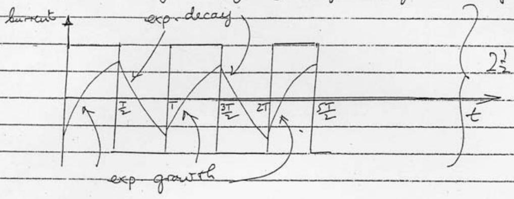
[5]

I is the charge flowning for second
Charge on espaceitar $Q = C V$
The dischargis through ammeter intenes persec Total charge flowning through annueter in $1 s$ $I \equiv n C V$
(1) Capacitor would not charge fully to CV wi ne cycle Carrent wened comsequently be reduced 2
(v) Cafeures wend mot folly deschorge increcycle Current mened be reduced 2 [7]
b) $\quad - \frac { 4 } { \pi } \cos ( 2 \pi f t ) - \left( \frac { 4 } { \pi } \right) \frac { 1 } { 3 } \cos ( 6 \pi f t ) + \left( \frac { 4 } { \pi } \right) \left( \frac { 1 } { 5 } \right) \cos ( 10 \pi f t )$

Ampleture A $\left( \frac { 4 } { 5 \pi } \right) \quad$ - f $3 f$ $\frac { 1 } { 2 } \times 12 = 6$ $\frac { 1 } { 2 } \times 12 = 6$
Plase 6 0 ± ± 0 0 $\frac { 1 } { 50 }$ 47
2) $r _ { g } ( t )$
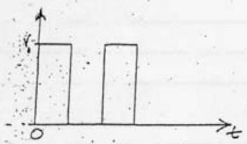
(i)
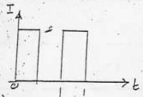 $\left[ 1 \frac { 1 } { 2 } \right]$ Charge Q anthe Capacitor [2].]
(iii)
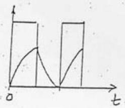 Supermipsee arrant and charge ... ... ... . . ت. ت. ي. . ت. ت. بي . ت. بي $\left[ \frac { 1 } { 2 } \right]$
Assomphing: (a) endom bornat aty appearing (not one constrat given) (b) crepactor in o pufferent prect

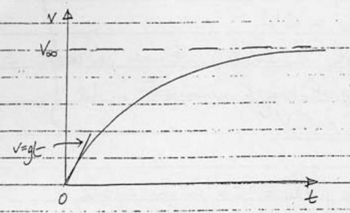
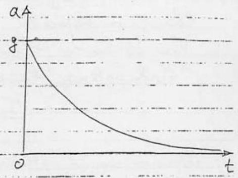

Graph 1

Graph 2

Graph 1
Graph 2
[10]
