## BPLD 2003

Q1
a）（i）ata groun to 4 sig fg se results ahould be given to convertaccuracy 1．1 W couly correct to $2 \mathrm { sig } \mathrm { fg } ^ { \frac { 1 } { 2 } }$ accuracy $\pm 0.05 ^ { \frac { 1 } { 2 } } \pm 0.1$ acceptable 1063.9 mN correct to $4 \mathrm { sag } \mathrm { fg } ^ { \frac { 1 } { 2 } }$ ，accuracy $\pm 0.5 , \pm 1 \frac { 1 } { \text { acceptable } }$

I NB A more accurate calcalation，but ast requed by student， would grie for $P = V A$

$$
\begin{aligned}
& \frac { \Delta P } { P } = \frac { \Delta V } { V } + \frac { \Delta A } { A } = \frac { 0.005 } { 78.46 } + \frac { 0.005 } { 13.56 } = 4.3 \times 10 ^ { - 4 } \\
& \Delta P = 5 \times 10 ^ { - 4 } W \\
& = 1 e \quad P = 1.063 ( 9 \pm 5 ) W
\end{aligned}
$$

（ii）Dimensenis correct to 3 sg fg result aly correct to 3 sig fig Volume $= 1.771 \times 10 ^ { - 1 } \mathrm {~m} ^ { 31 }$ accuracy $\pm 0.005 , \pm 0.01$ acceptable
［NB．A were accurate calculation，but wirreguered by student

$$
\begin{aligned}
& \frac { \Delta V } { V } = \frac { 0.05 } { 52 } + \frac { 0.05 } { 35 } + \frac { 0.05 } { 95 } = 3 \times 10 ^ { - 3 } \\
& \Delta V = 5 \times 10 ^ { - 7 } \quad i \quad V = 1.7 \pi ( 1 \pm 5 ) 10 ^ { - 4 } \mathrm {~m} ^ { 3 }
\end{aligned}
$$

Density correct to 2 sig fige or umn culyconsect te 2 sigity
Density correct to 2 sig fige or umn culyconsect te 2 sigity $7 \cdot ( 6 \pm 2 ) 10 ^ { - 1 } \mathrm { Ky }$ acceptrable $/ \mathrm { K }$ $M _ { \text {ass } } = 7 \cdot ( 6 \pm 1 ) 10 ^ { - 1 } \mathrm {~kg} ^ { \frac { 1 } { 2 } } \cdot 7 \cdot ( 6 \pm 2 ) 10 ^ { - 1 } \mathrm { ky }$ acceptable $/ \mathrm { k }$
（iii）Net voltage Q． $1 \vee \frac { 1 } { 2 }$
（iii）Net voltage $4.1 \vee \overline { 2 }$
Resistance $\left( \frac { 1 } { 6.00 } + \frac { 1 } { 6.00 } \right) ^ { - 1 } = 3.00 \Omega ^ { \prime } \rightarrow \left( \begin{array} { c } \frac { 1 } { 2 } \text { mork for merg．} \\ \text { correct } \end{array} . \begin{array} { c } \text { fg } \\ \text { sig } \end{array} . \mathrm { fg } \right.$
Resistance $\left( \frac { 1 } { 6.00 } + \frac { 1 } { 6.00 } \right) ^ { - 1 } = 3.00 \Omega ^ { \prime } \rightarrow \left( \begin{array} { c } \frac { 1 } { 2 } \text { mork for merg．fg）} \\ \text { correct to } 3 \text { sig } f g \end{array} \right.$

$$
\begin{aligned}
& I = 0.033 \mathrm {~A} 1 / 2 \\
& I = 0.03 \pm , 0015 \mathrm {~A} , \pm 0.02 \mathrm {~A} \text { acceptable } \frac { 1 } { 2 }
\end{aligned}
$$

手
$\frac { 1 } { 2 }$

TOTAL
TOTAL
10

b） Energy of photon
$$
\begin{aligned}
& E = h f ^ { \prime } = \frac { h c ^ { \prime } } { \lambda } \\
& = \frac { \left( 6.63 \times 10 ^ { - 34 } \right) \left( 3.00 \times 10 ^ { 8 } \right) } { \left( 6.39 \times 10 ^ { - 7 } \right) } - J .1 .
\end{aligned}
$$
Total everyy
c）（i）Usung $s = u t + \frac { 1 } { 2 } a t ^ { 2 } \quad$ with $u = 0 \quad x s = 36000 \mathrm {~m}$
$$
\begin{aligned}
36000 & = \frac { 1 } { 2 } a ( 60 ) ^ { 2 } \\
a & = 20.0 \mathrm {~ms} ^ { - 2 }
\end{aligned}
$$
（ii） After Gos velocity $v$ green by
$$
v = 0 + a ( 60 ) = 1200 \mathrm {~ms} ^ { - 1 }
$$
Maximium height $( 36 ) 10 ^ { 3 } + s _ { 2 } \ldots \mathrm {~m}$ Using
$$
\begin{aligned}
& v ^ { 2 } = u ^ { 2 } + 2 a s _ { 2 } \quad \text { where } u = 1200 \mathrm {~ms} ^ { - 1 } \mathrm { z } v = 0 \\
& 0 = ( 1200 ) ^ { 2 } + 2 ( - 9.81 ) \mathrm { s } _ { 2 } \\
& s _ { 2 } = 73400 \mathrm {~m} = 73.4 \mathrm {~km} \quad \text { । }
\end{aligned}
$$
Maximum height $H = ( 36.0 + 73.4 ) \mathrm { km } = 109.4 \mathrm {~km} 1$ （iii）Turie of flight ofter first bos green by
$$
\begin{aligned}
s & = u t - \frac { 1 } { 2 } g t ^ { 2 } \\
& = 1200 t - \frac { 1 } { 3 } ( 9.81 ) t ^ { 2 }
\end{aligned}
$$
$$
t = 1200 \pm \sqrt { ( 1200 ) ^ { 2 } + 4 ( 4.95 ) 3600 } / 9.81 / 1 / 2
$$
Rostive sign are physeally admissible
$$
t = 271.6
$$
Total TIME $( 271.6 + 60 ) \mathrm { s } = 331.6 \mathrm {~s}$

c）ALTERNATIVE SOLUTION
Ore can duteoment to，the time to max．height after swifch of and $t _ { 3 }$ ，the tire from max．height to grand．

$$
t _ { 2 } : ( v = u + a t ) \quad 0 = 1200 + ( - 9.81 ) t _ { 2 } \quad t _ { 2 } = 122.35
$$

$$
t _ { 3 } : \quad \left( s = u t + \frac { 1 } { 2 } a t ^ { 2 } \right) \quad 10 ^ { 3 } ( 109.4 ) = 0 + \frac { 1 } { 2 } ( 9.81 ) t _ { 3 } ^ { 2 } \quad t _ { 3 } = 1493 s
$$

$$
\text { TOTAL TIME } = 60 + 122.3 + 149.3 = 331.65
$$

（iv）$W _ { \text {ork dear } } = M a s _ { 1 } - M g s _ { 2 } + M g \left( s _ { 1 } + s _ { 2 } \right)$

$$
\begin{aligned}
& = M a s _ { 1 } + M g S _ { 1 } \\
& = M s _ { 1 } ( a + g ) \\
& = \left( 2.00 \times 10 ^ { 3 } \right) ^ { ( 36000 ) ( 20.0 + 9.81 ) } \\
& = 2.15 \times 10 ^ { 9 } \mathrm {~J}
\end{aligned}
$$

Unrealestic as mase not censtant

$$
\text { d) } \begin{aligned}
\text { Mass of electron is amu } & = 9.11 \times 10 ^ { - 31 } / 1.66 \times 10 ^ { - 27 } \\
& = 0.000549 \mathrm { amu } \\
\text { (i) Mess of } { } ^ { 12 } C _ { 6 } \text { nucleus } & = 12.00000 - 6 ( 0.000549 ) \\
& = 11.99671 \mathrm { amu } \\
& = 1 \frac { \frac { 1 } { 2 } } { \frac { 1 } { 2 } }
\end{aligned}
$$

$$
\begin{aligned}
& = \frac { 1 } { \frac { 1 } { 2 } } \left( 1.0072 ^ { \frac { 1 } { 2 } } + 1.00866 \right) \\
& = 12.09564 \mathrm { amu }
\end{aligned}
$$

$$
\begin{aligned}
& = 12.09564 - 11.99671 \\
& = 0.09893 \text { ann }
\end{aligned}
$$

$$
\text { (iii) } \begin{aligned}
\text { Binding energy in Mev } & = ( 0.09893 ) \left( 9.315 \times 10 ^ { 2 } \right) \mathrm { MeV } \\
& = 92.15 \mathrm { MeV } \\
\text { Binding energy per muction } & = 92.15 / 12 \\
& = 7.68 \mathrm { MeV }
\end{aligned}
$$

$$
\text { TOTAL } 10
$$

e） $$
\text { Patantial } \begin{aligned}
V _ { A } & = \left( \frac { \frac { 1 } { 2 } } { a } + \frac { \frac { 1 } { 2 } } { a } + \frac { 1 } { \sqrt { 2 a } } \right) \left( \frac { 1 } { 4 \pi \varepsilon _ { a } } \right) \\
& = \frac { Q } { 4 \pi \varepsilon _ { a } a } \left( 2 + \frac { \sqrt { 2 } } { 2 } \right)
\end{aligned}
$$
Deagened field $E _ { D } = \frac { Q } { L + E _ { 0 } } \frac { 1 } { ( \sqrt { 2 a } ) ^ { 2 } }$
Honzontal feeld $E _ { N } = \frac { Q } { 4 \pi \varepsilon _ { 0 } } \frac { 1 } { a ^ { 2 } }$
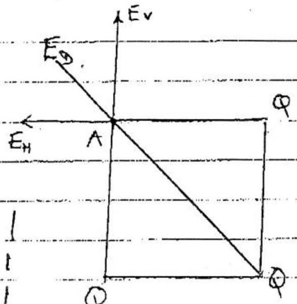
Vertical fuld $E _ { r } = \frac { Q } { 1 \text { 号家 } } \frac { 1 } { a ^ { 2 } }$
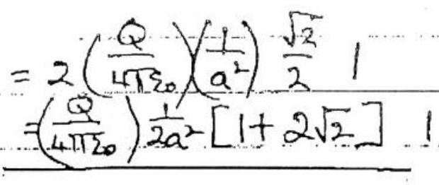
loorect direction
f）（1）$\frac { 1 } { 2 } l$
（ii）$\frac { 1 } { 2 } e$
Centre of gravity of cylender ± liquid is below $\frac { 1 } { 2 } l$ as cylinder has C．If．G．at $l / 2$ and liquid／is at hight below $l / 2$ namely $y / 2$ ．
g）（1）$g \cos 30 ^ { \circ } 2 = \frac { \sqrt { 3 } } { 2 } g = 8.49 ^ { \frac { 1 } { 2 } } \mathrm {~ms} ^ { - 2 }$
（ii）$E = \frac { 1 } { 2 } m ^ { \frac { 1 } { 2 } } v ^ { 2 } + m g y ^ { \frac { 1 } { 2 } }$
（N）Resultantacelleration along $y$－axis＇of magnitide $\frac { m o \text { where } } { R }$ $R$ radius of curve ato
（v）$\quad m g b = \frac { 1 } { 2 } m v ^ { 2 } \frac { 1 } { 2 } \quad$ e $\quad v = \sqrt { 2 g b } \cdot \frac { 1 } { 2 }$

h) Ruduis of ortit of satellete $R = 3.59 \times 10 ^ { 4 } \mathrm {~km}$ Raduis of Farth $R _ { E } = 6.37 \times 10 ^ { 3 } \mathrm {~km}$
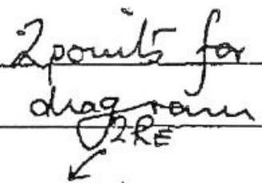
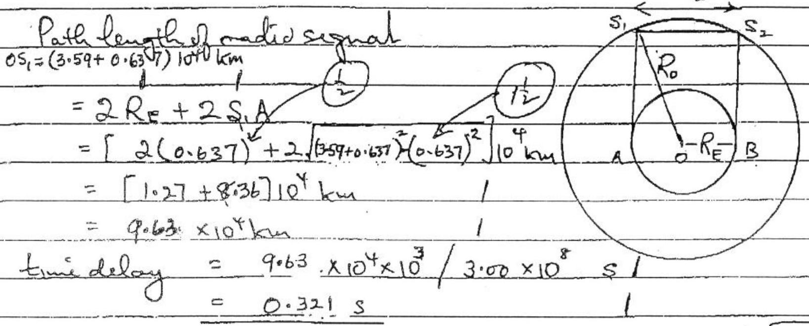
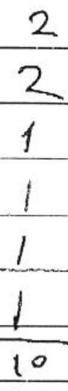
(i) (i) plot $\left( \frac { 1 } { y } \right)$ against $x$ for straight line 1 $( O R$ " $( x y )$ againsty " " ")
    (ii) plat $x ^ { 2 }$ against $\left( \frac { x } { y } \right)$

$( \theta R$ " $y x$ " $( y / x )$ )
(1) $\frac { 1 } { y } = a x + b$ : Gradient $a$. (armiterept $( y = 0 ) - b / a$ ) Cradient $\left( - \frac { b } { a } \right)$ unitercept $\left( \frac { 1 } { a } \right)$ (mitercept gaves a hence b oblained)

(ii) $\quad x ^ { 2 } = c \frac { x } { y } - d$ gradient $c ^ { 2 }$ intercept $( - d ) ^ { 2 }$
$\sigma R \quad x y = - \frac { d y } { x } + c$ gradient $( - d )$ entercept $c$ gradient $( - \alpha )$ utercept $c$

$$
\begin{aligned}
800 \text { MW } = 800 \times 10 ^ { 6 } \times 24 \times 60 \times 60 \mathrm {~J} & = 6.912 \times 10 ^ { 13 } \mathrm {~J} \\
\text { Number of aloms of } 92 \mathrm { U } & = \frac { 6.912 \times 10 ^ { 13 } } { 200 \times 10 ^ { 6 } \times 1.60 \times 10 ^ { - 19 } } \\
& = 2.157 \times 10 ^ { 24 }
\end{aligned}
$$

$$
\text { Menson } 420 = \frac { 2.157 \times 10 ^ { 24 } } { 6.03 \times 10 ^ { 23 } } \frac { 2352 } { 1000 } = 0.84 \mathrm {~kg} 1
$$

k） gradient（e／mor）
gradient $- \left( e / m _ { 0 } \right) ^ { 2 }$ hence（e／mo）obtained／

Concotlle of gaph paper，full scale used with pouits opred ont over full range of paper．（ points not usurif a suall region，or subregun，of griph pafes）
Credient $( \text { or－sq．rt．gradient } ) ^ { - 3 } = ( 1.78 \pm 0.03 ) _ { 10 } ^ { 11 } \mathrm { ekg } ^ { - 1 }$ （Error estimate ty varration of gradient）

Aduced marks for increased Extors

$$
\left( 1.78 ^ { - } \pm 0.1 \right) 10 \mathrm { Clg } ^ { - 1 }
$$

TOTAL－ 10

Q2

a） （i）Separation remainis constant equal to $l 1$ Both bass have same velocity $v = \sqrt { } 2 g h 1$
（ii） $V _ { B } = \sqrt { 2 g h }$
Remaining energy $E _ { R } = \frac { 1 } { 2 } M r _ { B } ^ { 2 } + M g l = M g ( h + l )$
（iii） $$
\begin{aligned}
E & = 2 \left( \frac { 1 } { 2 } k x _ { c } ^ { 2 } \right) + M _ { g } \left( l - x _ { c } \right) \\
& = k x _ { c } ^ { 2 } + M _ { g } \left( l - x _ { c } \right)
\end{aligned}
$$
（iv） From（ii）and（iii）
$$
\begin{aligned}
M g ( h + l ) & = k x _ { c } ^ { 2 } + M g \left( l - x _ { c } \right) \\
x _ { c } ^ { 2 } - ( M g / k ) x _ { c } & = ( M g h / k ) = 0 \\
x _ { c } & = \frac { 1 } { 2 } \left( \frac { M g } { k } \right) \pm 1 \sqrt { \left( \frac { M g } { k } \right) ^ { 2 } + 4 \left( \frac { M g h } { k } \right) } \\
& = \frac { M g } { 2 k } \left[ 1 \pm \sqrt { \left. 1 + \frac { 4 k h } { M g } \right] } \right.
\end{aligned}
$$
As $x _ { c } > 0$ ，only acceptable solution is
$$
x _ { c } = \frac { M g } { 2 k } \left[ 1 + \sqrt { 1 + \frac { 4 k h } { M g } } \right]
$$
b） （i）Atter instant A leases the grand，grandreaction zero 1
$$
\begin{aligned}
2 k x _ { e } & = M g \\
x _ { e } & = \frac { M g } { 2 k }
\end{aligned}
$$
（ii） Initial energy $\mathrm { Mg } ( h + e )$
To usis above the ground with firite K．E requares
$$
\text { fro } \quad M g ( h + l ) = k x _ { e } ^ { 2 } + M g \left( l + x _ { e } \right) + \frac { 1 } { 2 } M v _ { B } ^ { 2 } \text {. }
$$
The condition that $\sqrt { B } > 0$ requires
$$
\begin{aligned}
& + M g ( h + l ) > k x _ { e } ^ { 2 } + M g \left( l + x _ { e } \right) \\
& M g \left( h - M g ( 2 k ) > k ( M g ( 2 k ) ) ^ { 2 } \right.
\end{aligned}
$$
$$
h > \frac { 3 k g } { 4 k }
$$

Q3
（i）Electron emitted from Cathody，leaving cathode at positive potentul melature to anode．

（ii） Energy of photon only available in descrete quants hof un enteration with electrons
（iii） If electrons emerge with K．E $\frac { 1 } { 2 } m v ^ { 2 }$ ，then cmservation of emergy mequires
$$
\begin{array} { l l }
h f - h f c = \frac { 1 } { 2 } m v ^ { 2 } & 2 \\
\left( \frac { 1 } { \lambda } - \frac { 1 } { \lambda _ { c } } \right) = V _ { 0 } c & \text { or } \frac { 1 } { \lambda _ { c } } = \frac { V _ { 0 } e } { h _ { c } } + \frac { 1 } { \lambda }
\end{array}
$$
or
or
$$
\lambda _ { c } = \frac { \lambda h _ { c } } { h _ { c } + \lambda V _ { 0 } }
$$
ALTEANATIO PREOF UANG WORKEONCTON W
$$
\begin{gathered}
h _ { f } = \frac { h _ { c } } { \lambda } = W _ { e } + V _ { e } \quad \& \frac { h _ { c } } { \lambda _ { c } } = W _ { e } \\
h _ { c } \left( \frac { 1 } { \lambda } - \frac { 1 } { \lambda _ { c } } \right) = V _ { e } \\
\lambda _ { c } = \frac { \lambda h _ { c } } { h _ { c } - \lambda V _ { e } }
\end{gathered}
$$
b） 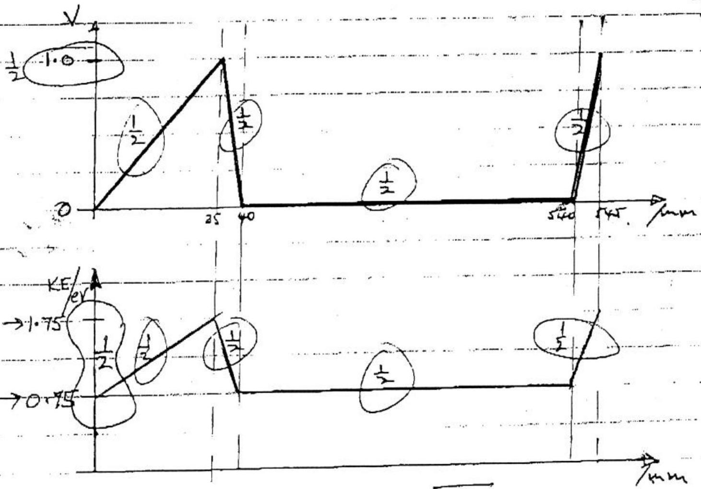
$$
\begin{aligned}
\frac { 1 } { 2 } m _ { e } v ^ { 2 } & = V _ { 0 } e / \quad \text { u } \quad v = \sqrt { \frac { 2 e V _ { 0 } } { m _ { e } } } \\
v & = \sqrt { \frac { 2 \left( 1.60 \times 10 ^ { - 19 } \right) ( 0.750 ) } { 9.11 \times 10 ^ { - 31 } } , } = 5.1 \times 10 ^ { 5 } \mathrm {~m} s ^ { - 1 }
\end{aligned}
$$

（iv）Etectrons that pass through Gl，doning its toe potential，lave to twand to Car a destance d．Toom．Than whenthey sach G2 the gate is to for a twice that is less than 1.5 ys for which gate＂open．＂Ziectors that pass through G2 fann the periodic pulses in Equore 3.4.
（v）Time of travel from $G 15 G 2 = \frac { 0.50 } { V } = \frac { 0.50 } { 5.13 \times 10 ^ { 5 } } s$

$$
= 0.975 \times 10 ^ { - 6 } \mathrm {~s}
$$

Twouffere puble width $= ( 1.50 - 0.97 ) 10 ^ { - 6 } s = 0.53 \mu s$ （Anny answer from（0．51－0．54）us arceptable）

Q4 a）（i） 3 reseatarices in parallel
Total resea $\left( \frac { 1 } { R } + \frac { 1 } { R } + \frac { 1 } { R } \right) ^ { - 1 } = \frac { 1 } { 3 } R$

$$
\begin{aligned}
\therefore \quad i _ { 2 } \left( R + \frac { 1 } { 3 } R \right) & = E \\
i _ { 2 } & = 3 E / 4 R
\end{aligned}
$$

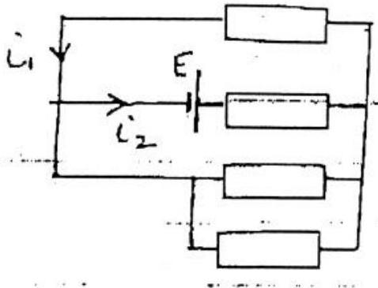

By symmetry（or otherwise）

$$
\begin{aligned}
& 3 i _ { 1 } = i _ { 2 } \\
& i _ { 1 } = \frac { 1 } { 3 } ( 3 E / 4 R ) = \frac { E } { 4 R }
\end{aligned}
$$

（ii）By－symmetry $i _ { 1 } = - i _ { 2 }$
At $A : \quad i _ { 1 } + i _ { 1 } + \left( - i _ { 2 } \right) = 0$

$$
i _ { 1 } = i _ { 2 } = 0
$$

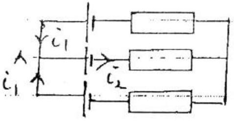
b）If $c _ { 1 } = 0$ for $\operatorname { sen } R$

$$
i _ { 3 } = - i _ { 2 }
$$

PD．belivern（32）
PD．belivern（32）

$$
\left( R _ { 3 } + R _ { 2 } \right) i _ { 2 }
$$

If $i _ { 1 } = 0$ for triangle

$$
i _ { 3 } = - i _ { 2 }
$$

PD between $( 3,2 )$
$i _ { 2 }$ × TOTAL RESIS ACROSS

$$
= i _ { 2 } \left[ \frac { 1 } { R _ { 23 } } + \frac { 1 } { R _ { 31 } + R _ { 12 } } \right] ^ { - 1 }
$$

（resis in parallel）
Equating PDs

$$
\begin{aligned}
& R _ { 3 } + R _ { 2 } = \left( \frac { 1 } { R _ { 23 } } + \frac { 1 } { R _ { 31 } + R _ { 12 } } \right) \\
& R _ { 3 } + R _ { 2 } = \frac { R _ { 23 } \left( R _ { 31 } + R _ { 12 } \right) } { R _ { 31 } + R _ { 12 } + R _ { 23 } }
\end{aligned}
$$

OR

$$
\left( R _ { 2 } + R _ { 3 } \right) \left( R _ { 31 } + R _ { 12 } + R _ { 23 } \right) = R _ { 23 } \left( R _ { 31 } + R _ { 12 } \right)
$$

c）Similarty for

$$
\begin{aligned}
& \left( R _ { 3 } + R _ { 1 } \right) \left( R _ { 31 } + R _ { 12 } + R _ { 23 } \right) = R _ { 31 } \left( R _ { 23 } + R _ { 12 } \right) \\
& \left( R _ { 1 } + R _ { 2 } \right) \left( R _ { 31 } + R _ { 12 } + R _ { 23 } \right) = R _ { 12 } \left( R _ { 23 } + R _ { 31 } \right)
\end{aligned}
$$

d）If $R _ { 12 } = R _ { 31 } = R _ { 23 } = 1 \Omega$ the above 3 egurations give

$$
\left. \begin{array} { l }
R _ { 2 } + R _ { 3 } = \frac { 2 } { 3 } \\
R _ { 3 } + R _ { 1 } = \frac { 2 } { 3 } \\
R _ { 2 } + R _ { 1 } = \frac { 2 } { 3 }
\end{array} \right\}
$$

Solution

$$
R _ { 1 } = R _ { 2 } = R _ { 3 } = \frac { 1 } { 3 } \Omega L _ { 2 }
$$

e）Circint meduces，after substituting＂star＂for＂triangle＂to
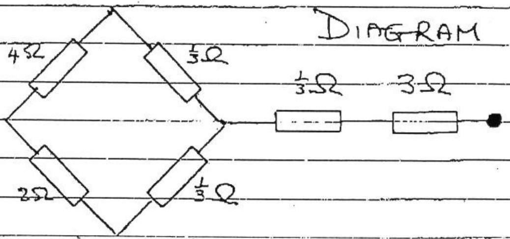

$$
\begin{aligned}
& \left( 4 + \frac { 1 } { 2 } \right) \Omega \text { in parallel wilh } \left( 2 + \frac { 1 } { 3 } \right) \Omega \\
& \text { Thal resistance } \left( \frac { 3 } { 13 } + \frac { 3 } { 7 } \right) ^ { - 1 } + \frac { 1 } { 3 } + 3 = \left( \frac { 60 } { 91 } \right) ^ { - 1 } + \left( \frac { - 1 } { 3 } \right) \\
& = \frac { 91 } { 60 } + \frac { 10 } { 3 } = \frac { 291 } { 60 } \Omega \\
& = 4.85 \Omega
\end{aligned}
$$

a) Force $F _ { T }$ on a wire carrying a amout $I$ is $B I l$, where $l$ in the length of the were, $B$ is the component of the field perpendicular to the were.
$$
F _ { T } = \left( \frac { \mu _ { 0 } I _ { 1 } } { 2 \pi r } \right) I _ { 2 } l
$$
or force permint langth
$$
F = \frac { \mu _ { 0 } I _ { 1 } I _ { 2 } } { 2 \pi r }
$$
due to oureut $I _ { 1 }$ on $I _ { 2 }$.
An, identitat expression is obtained for feeld due to $I _ { 2 }$ on $I _ { 1 }$ The direction of $F$ is green by Flemmigs befthand sule ¿ It is inducated an the diagian for parallel current Irand $I _ { 2 }$
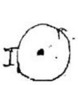
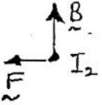
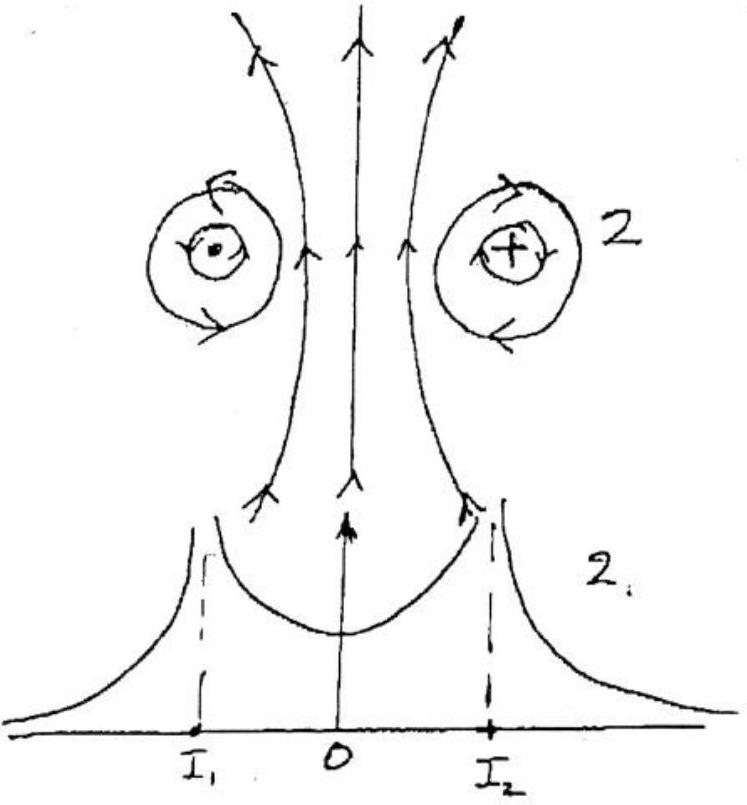
$$
B _ { \text {resultant } } = \frac { \mu _ { 0 } I _ { 1 } } { 4 \pi r _ { 1 } } \hat { \imath } + \frac { \mu _ { 0 } I _ { 2 } } { 4 \pi r _ { 2 } } \hat { \jmath } .
$$
directions $\hat { \imath }$ and $\hat { \jmath }$ quentry field line diagrams
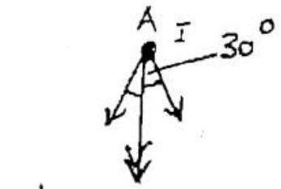
$$
\text { Resultant force on } \begin{aligned}
A & = 2 \left( \frac { \mu _ { 0 } I ^ { 2 } } { 2 \pi r } \right) \cos 30 ^ { \circ } \\
& = \frac { 2 \mu _ { 0 } ( 200 ) ^ { 2 } } { 2 \pi ( 0.50 ) } \left( \frac { \sqrt { 3 } } { 2 } \right) \\
& = \frac { 4 \pi 10 ^ { - 7 } ( 200 ) ^ { 2 } } { \pi } \sqrt { 3 } = \\
& = 2.77 \times 10 ^ { - 2 } \mathrm {~N}
\end{aligned}
$$
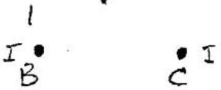

Direction of force from $A / s$ unid point $B C$ Sinilarly for forces on the offerwires heave came magnitude and durections that are along the besectors of the angles of the equatateral triangle travords the centre of the triangle

d） $\lambda$ depends on tortanil constant of chread Hake experimential measurement of $f$ and $r$ fora range of $r$ ． Plot for against $\frac { 1 } { r }$（relation validjorsmall $\theta$ ） As $B = \frac { K } { r }$ where $K$ is a constant
$$
f ^ { 2 } = \frac { \gamma k } { r } + \lambda
$$
Plot $f ^ { 2 }$ against $\frac { 1 } { r }$ ．Gradiant $\gamma _ { K }$ ，witérest $\lambda$
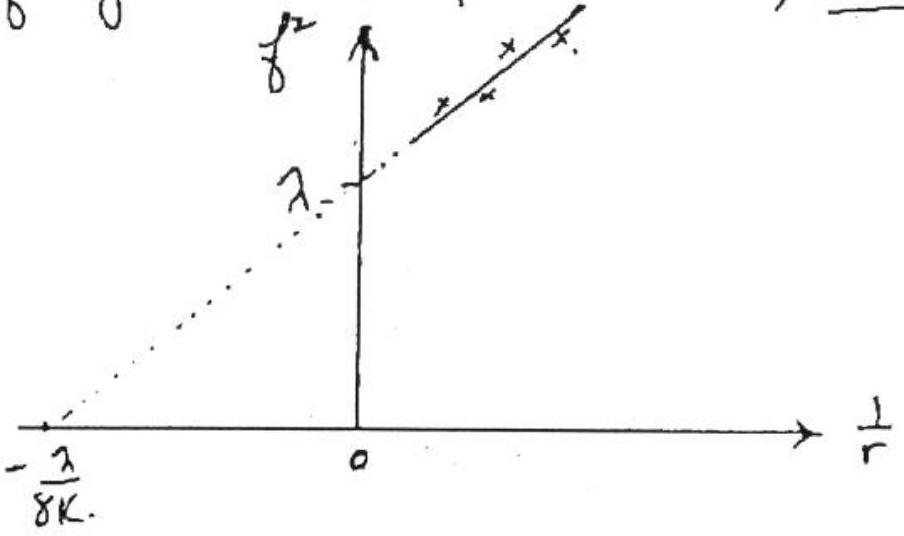
Straught lune graph．

Q6

a) Eclepa of the Sun
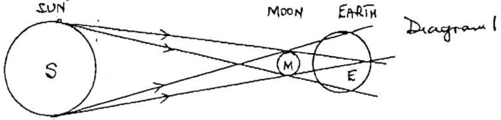
Shadow of the Moon fallon the Earth as indicated in dragrain Observers in the shaded region emounds see the Sum; regioniof to balaty Explanation 1

Echipse of the Moon
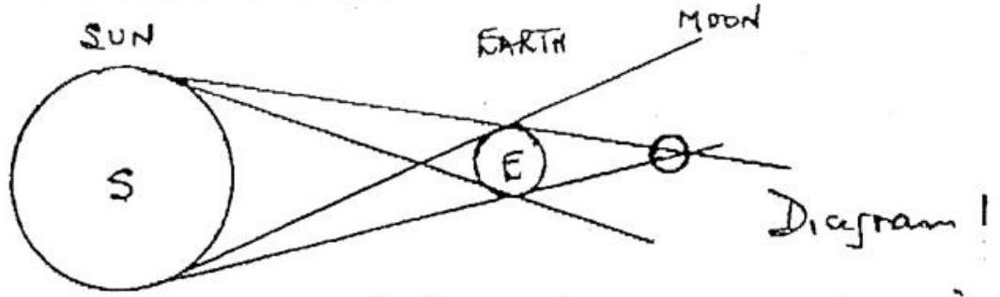
Shadow of Earth falls on Morn, ahaded region cannot be seen from Earth

Explanation 1
Ealifies do not occur periodically as S,EandM do not max in a plane; paths roughly approxinate to a plane.

b) For curcular motion of Hoon around the Earth
$$
M _ { M } R _ { E M } \omega ^ { 2 } = G M _ { M } M _ { E } / R _ { E M } ^ { 2 } 1
$$
$R _ { E M } \omega ^ { 2 } = G _ { G } M _ { F } / R _ { \text {EM } } ^ { 2 }$
$$
T = \frac { 2 \pi } { \omega }
$$
$\operatorname { Rem } \left( \frac { 2 \pi } { T } \right) ^ { 2 } = \operatorname { GM } _ { e } / \operatorname { R } _ { \text {an } } ^ { 2 } 1$
$T ^ { 2 } = \frac { 4 \pi ^ { 2 } } { G M _ { E } } R ^ { 3 } \quad$ where $R = R _ { \text {orc } } 1$
Sub ${ } ^ { 9 }$
$\tau = \frac { 1 } { 2 } T ^ { \prime } = \frac { 1 } { 2 } \sqrt { \frac { 4 \pi ^ { 2 } R ^ { 3 } } { G M _ { E } } }$
$$
\begin{array} { r }
= \frac { 1 } { 2 } \left[ \frac { 4 \pi ^ { 2 } \left( \frac { 1 } { 2 } \right) ^ { 3 } \left( 3.82 \times 10 ^ { 8 } \right) ^ { 3 } } { 6.67 \times 10 ^ { - 1 } \left( 5.97 \times 10 ^ { 24 } \right) } \right] ^ { \frac { 1 } { 2 } } \text { as } R = \frac { 1 } { 2 } R _ { 5 M } \\
= 2.96 \times 10 ^ { 5 } \mathrm {~s} \\
= \left( 1 \text { year ~ } 3.15 \times 10 ^ { 7 } \mathrm {~s} \right) \\
\left( 1 \text { month } \sim 3 \times 10 ^ { 6 } \mathrm {~s} \right) \\
\left( 1 \text { day } \sim 8.6 \times 10 ^ { 4 } \mathrm {~s} \right)
\end{array}
$$
(ii) Av. speed, $r _ { a } = \frac { \text { distance } } { \text { time } } = \frac { 3.82 \times 10 ^ { 8 } } { 2.96 \times 10 ^ { 5 } } = 1.29 \times 10 ^ { 3 } \mathrm {~ms} ^ { - 1 } 1$
(ii) Av. speed, $\underset { a } { r _ { a } } = \frac { \text { distance } } { \text { time } } = \frac { 3.82 \times 10 ^ { 8 } } { 2.96 \times 10 ^ { 5 } } = 1.29 \times 10 ^ { 3 } \mathrm {~ms} ^ { - 1 } 1$

$$
\begin{aligned}
\frac { 1 } { 2 } M _ { E } V _ { M } ^ { 2 } & = G M _ { E } M _ { M } \left( \frac { 1 } { R _ { E } } - \frac { 1 } { R _ { E M } } \right) \\
V _ { M } ^ { 2 } & = 2 G M _ { M } \left( \frac { 1 } { R _ { E } } - \frac { 1 } { R _ { E M } } \right) \\
& = 2 \left( 6.67 \times 10 ^ { - 11 } \right) \left( 5.97 \times 10 ^ { 24 } \right) \left[ \frac { 1 } { 6.37 \times 10 ^ { 6 } } - \frac { 1 } { 3.82 \times 10 ^ { 5 } } \right] \\
& = 1.23 \times 10 ^ { 8 } \\
V _ { M } & = 1.11 \times 10 ^ { 4 } \mathrm {~m} S ^ { - 1 }
\end{aligned}
$$

（iv）Useng the result in（i）with $M _ { E }$ replace by $M _ { S }$ ，the time $\tau _ { S }$ is

$$
\begin{aligned}
\hat { \imath } _ { s } & = \frac { 1 } { 2 } \left[ \frac { 4 \pi ^ { 2 } \left( \frac { 1 } { 2 } \right) ^ { 3 } \left( 2.00 \times 1.50 \times 10 ^ { 11 } \right) ^ { 3 } } { \left( 6.67 \times 10 ^ { - 11 } \right) \left( 1.99 \times 10 ^ { 30 } \right) } \right] ^ { \frac { 1 } { 2 } } 1 \\
& = \frac { 1 } { 2 } \left[ \frac { 4 \pi ^ { 2 } \left( 1.50 \times 10 ^ { 11 } \right) ^ { 3 } } { \left( 6.67 \times 10 ^ { - 11 } \right) \left( 1.99 \times 10 ^ { 30 } \right) } \right] ^ { \frac { 1 } { 2 } } . \\
& = 1.58 \times 10 ^ { 7 } \mathrm {~s}
\end{aligned}
$$

$$
\frac { \left( N B \cdot \mid \text { year } \sim 3 \times 10 ^ { 7 } s \mid \right) } { \frac { T o T } { T o } 2 . }
$$

Transverse wave: periodic osallations perpendicular to direction of wave motion
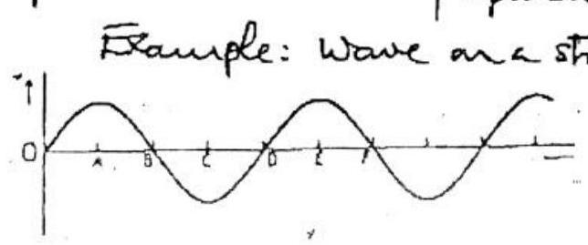
LIGHT WAVE PASSED THROUGH A POLARIZER b) (1) Beats or. Light Refected at Brewste danche
Two waves of marly equal frequencis, wand $\omega + \Delta \omega$, gives rise to a wave of firequency $w$ modulated by the frequency $\Delta w$. Aw is called the beat frequency.

(ii) Dappler Effect
If there is motion between sacice of sound frequency four the absewer, or motion of the medium, the frequency received by the obsewer differs from that produced by the source is number of waves arrising at observer differs from that emitted by source. T=T. 4
c) If source stationary fo waves emitted per see. trward the. obsewer, occupying a derance $c$, wavelength $c / f o$. If servece moving with velocity $v _ { s }$ towards observer waves will occupy a destance $\left( c - v _ { s } \right)$ as source moves a destance $v _ { s }$ towards observer. Thus wavelength reaching observer $\left( c - v _ { s } \right) / f _ { 0 }$ Apparent frequency
$$
f = \frac { c } { \left( c - v _ { s } \right) / f _ { 0 } } = \frac { f _ { 0 } } { \left( 1 - v _ { s } / c \right) }
$$
a) If source mores away from obeenter $V _ { s }$ changes segn and
$$
f = \frac { f _ { 0 } } { ( 1 + \sqrt { s } / c ) }
$$
At $v = c$, wics), waves bunld up to produce a some bang ! Rigidity modulus zero (or eguiralent) 1

Q7 Sone explanation explanning they the Dopper formula can be applied to the beat frequency，when derived for pare frequency
c） Let $f$ be beet frequency of the two engenes Mathan towards obsewergures，from（c），
$$
8 = \frac { f _ { 0 } } { 1 - \left( v _ { s } / c \right) }
$$
Mother away from obsewer gives，from（c），
$$
2 = \frac { f _ { 0 } } { 1 + \left( v _ { s } / c \right) }
$$
The ration of these two equations geves
or
$$
\begin{aligned}
H & = \frac { 1 + v _ { s / c } } { 1 - v _ { s / c } } \\
\frac { 4 - 1 } { 4 + 1 } & = \frac { 2 \left( v _ { s / c } \right) } { 2 } \\
\frac { v _ { s } } { c } & = \frac { 3 } { 5 } \\
v _ { s } & = 198 \mathrm {~ms} ^ { - 1 }
\end{aligned}
$$

Q8

a） The radiation energung from medium is despersed，ii different wavelengths 16 emerge at different angle（eg white light split into is colours）
    b） 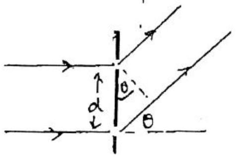
    （i） Path difference $= d \sin \theta$ Lanstructure interference atrais of $\quad d \sin \theta = \mu \lambda$ Destructure unterference aresis of $\quad d \operatorname { ain } \theta = \left( m + \frac { 1 } { 2 } \right) \lambda$
    （ii） For surall $\theta ( \theta < 0.1$ radiain $) \sin \theta \simeq \theta$ Thus constructure interference，for $n = 1$ ，occurs when
$$
\begin{aligned}
d \sin \theta = d \theta & = \lambda \\
i & = \lambda / d
\end{aligned}
$$
    （ur）In deperswe meduin of refractive undex $\mu$ optical path difference becomes $\mu d \operatorname { sen } \theta$ Thus the result in（ii）tecomes
$$
\theta = \frac { \lambda } { \mu d }
$$
    c） 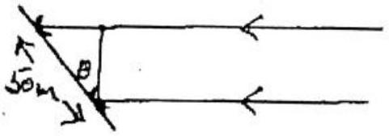

It Colecope mores throngh anigh $\theta$ path difference producify sutefference is
$50 \sin \theta \mathrm {~m}$
For first order maxurium

$$
\begin{aligned}
50 \sin \theta & = \lambda = 0.75 \\
\sin \theta & = \frac { 3 } { 200 } \\
\theta & = \frac { 3 } { 200 } \text { radians }
\end{aligned}
$$

As Earth rofate throngh $2 \pi \mathrm {~m} 24$ hours time interval between waxima

$$
\begin{aligned}
& = \frac { 3 ( 24 ) 60 } { ( 200 ) 2 \pi } = 3.438 \text { minutes } \\
& = 3 \text { ministes } \quad 265
\end{aligned}
$$

Q． 8 c）．．．Ampletide of radiation reduced by $\cos 52 ^ { \circ } \quad$＇
Sutensity reduced by fotor $\cos ^ { 2 } \sqrt { 2 } = 0.381$
d） （i）If saduis seduced concervation of angular momentom vequeries the frequency of rotation to nicrease．Thus perlsar fequency increased． This marease could he detected．

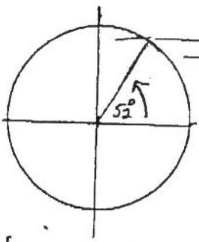
3

（ii） Deve to ufractare index of medium，different frequences world arrare at different turis． For non－disperswe meduin all frequencis arrive at same thise．Allematwely if refractive midex of medein changes arrwall turies for different frequencees alters． This can be measured by a surtable apparatios

（ii） $$
\begin{aligned}
h _ { \nu } = \frac { h _ { c } } { \lambda } & = ( - 3.40 + 13.60 ) ^ { \prime } = 10.20 \mathrm { er } \\
\lambda & = \frac { 1 } { h _ { c } } ( 10.20 ) \mathrm { e } \mathrm {~m} \\
& = ( 10.20 ) \left( 1.60 \times 10 ^ { - 19 } \right) / \left( 6.63 \times 10 ^ { - 34 } \right) \left( 3.00 \times 10 ^ { 8 } \right) \\
\lambda & = 1.22 \times 10 ^ { - 7 } \mathrm {~m} = 122 \mathrm {~mm}
\end{aligned}
$$
（iii） Ionization energy is 13－60er＇（evergy requined to remove election from ground state）
b） Energy lusels discrete for bond electron，contaivous for freelectron $T$
c）（i）conservation of momentum requies $\frac { h } { \lambda _ { 1 } } = \frac { h } { \lambda _ { 2 } } { } ^ { - } \lambda _ { 1 } = \lambda _ { 2 }$
（ii）No difference，additional momentum taken up by neighbouraig particles
（iii）Energy equation ：
$$
\begin{aligned}
m _ { e } c ^ { 2 } & = 2 h \nu = \frac { 2 h c } { \lambda } \\
\lambda & = \frac { 2 h c } { m _ { e } c ^ { 2 } } = \frac { 2 h ^ { 1 } } { m _ { e } c } = \frac { 2 \left( 663 \times 10 ^ { - 34 } \right) } { \left( 9.11 \times 10 ^ { - 31 } \right) \left( 3 \times 10 ^ { 8 } \right) } \\
\lambda & = 4.85 \times 10 ^ { - 12 } \mathrm {~m}
\end{aligned}
$$
d） Enercy
Momentum
$$
\begin{aligned}
& h ^ { \frac { 1 } { 2 } } f = \frac { 1 } { 2 } m _ { e } ^ { \frac { 1 } { 2 } r ^ { 2 } } + h f _ { b ^ { 2 } } ^ { \frac { 1 } { 2 } } \\
& \frac { h f \frac { 1 } { 2 } } { c } = m _ { e } \frac { 1 } { \frac { 1 } { 2 } } - \frac { h f b ^ { \frac { 1 } { 2 } } } { c }
\end{aligned}
$$
or
or
Addining（1）＋（2）
$$
\begin{aligned}
h f & = m _ { e } c v - h f b \\
f & = \left( \frac { 1 } { 2 } v + c \right) m _ { e } v / 2 h
\end{aligned}
$$
But
$\frac { 1 } { 2 } m _ { e } v ^ { 2 } = V _ { e }$
（e）$v \quad \sqrt { 2 } v _ { e } / m e$
S．（3）becomes

$$
f = \frac { 1 } { 2 h } \left( V _ { e } + m _ { e } c \sqrt { \frac { 2 V _ { e } } { m _ { e } } } \right)
$$

Hence as $f = \frac { c } { \lambda }$ ，

$$
\frac { 1 } { \lambda } = \frac { 1 } { 2 h _ { c } } \left( V _ { e } + m _ { e } c \sqrt { \frac { 2 V _ { e } } { m _ { e } } } \right)
$$

$$
= \frac { 1 } { 2 h c } \left( V _ { e } + c \sqrt { 2 m _ { e } V } \right)
$$

$$
\begin{aligned}
& = \frac { \left[ 5 \times 10 ^ { 3 } \times 1.60 \times 10 ^ { - 19 } + 3.00 \times 10 ^ { - 8 } \right] } { 2 \left( 6.63 \times 10 ^ { - 39 } \right) \left( 3.00 \times 10 ^ { - 8 } \right) } \\
\lambda & = 3.25 \times 10 ^ { - 9 } \mathrm {~m}
\end{aligned}
$$

Q10（b）Gosaph
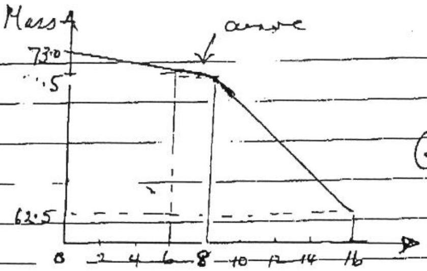

Graph
$? _ { S } =$ Rate of exaparation dure to surrandugs $= \frac { 1.50 \text { gins } } { 6.00 \text { min } } = \frac { Y } { 4 }$ pur／uni． 6．00 groun $= 1$ gu $/ \mathrm { hur }$ $R _ { H } =$ Reter of eraparation due to Leater alone $= \frac { 3 } { 4 } \mathrm { gm } / \mathrm { min } = \frac { 3 } { 4 ( - \infty ) }$ grans ${ } ^ { - 1 }$ Power dissipated by heater＝rate of loss of heat by evaporator by Leater

$$
\begin{aligned}
V I & = R _ { H } L _ { W } \quad \text { where } L \\
L _ { V } & = \frac { V I } { R _ { H } } = \frac { ( 0.90 ) ^ { 2 } ( 2.00 ) } { \left( \frac { 3 } { 4 } \times 10 ^ { - 3 } / 60 \right) } \\
& = 1.30 \times 10 ^ { 5 } \mathrm {~J} \mathrm {~kg} ^ { - 1 }
\end{aligned}
$$

where $L _ { r } =$ specific heat of evaluatur $\mathrm { Jkg } ^ { - 1 }$

$$
1 / 2
$$

c）HEATLOST = HEAT GAINGD

$$
\begin{aligned}
10 ^ { - 3 } \{ 225 ( 4200 ) ( 70 - T ) \} & = \{ 200 ( 1200 ) ( T - 20 ) + 15 ( 4000 ) ( T - 5 ) \} 10 ^ { - 3 } . \\
45 ( 42 ) ( 70 - T ) & = 40 ( 12 ) ( T - 20 ) + 3 ( 40 ) ( T - 5 ) \\
378 ( 70 - T ) & = 96 ( T - 20 ) + 24 ( T - 5 ) \\
T ( 96 + 24 + 378 ) & = 26460 + 1920 + 120 .
\end{aligned}
$$

Heat required to raise temperature of while confer＋wigh the seme if at $T _ { 1 }$ or $T _ { 2 }$ ．However if at $T _ { 1 } \left( T _ { 1 } > T _ { 2 } \right)$ ，more heat retarned by additionil coffee to ensurett at T than is the case at $T _ { 2,1 }$ so less hat available to hedt white coffee＋mug．Thrs mare place coffee regured．

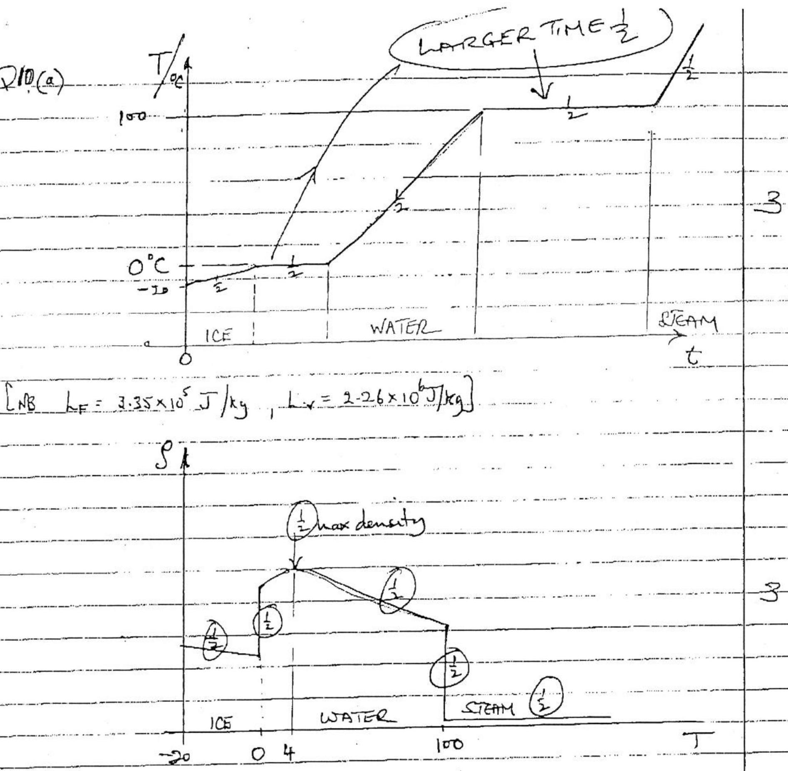

ARRANCONENT AND MOTIONS

|  | 1CE | WATER | STAM |
| :--- | :--- | :--- | :--- |
| ARRANGEMENT | Caystal $\frac { 1 } { 2 }$ | Randam／Paudo Roln $\frac { 1 } { 2 }$ | Random $\frac { 1 } { 2 }$ |
| MoTion | Vibrational $\frac { 1 } { 2 }$ | Diffusin－transfition Translational ＋colliseins $\frac { 1 } { 2 }$ ffer collintions $\frac { 1 } { 2 }$ |  |
