SOLINTIONS
Q1

(a) (i) Potential at $P = 2 \left( \frac { 20 } { 30 } \right)$ with 1 potential divider Pitental at $Q = 2 \left( \frac { 200 } { 300 } \right)$ volts $P D$. across $P Q = 0$ (Imark for quenting resultionly)
(ii) Replace $100 \Omega$ by variable resistance $R$. Put a galvo. across PQ vary. R until zero current tho' galvo then
$$
\begin{aligned}
& \frac { x } { R } = \frac { 20 } { 200 } \\
& x = \frac { R } { 10 }
\end{aligned}
$$
Alternative methods acceptable
Alternative methods acceptable

(b) (i) no. of photons/sec $n = \frac { \text { power } ( p ) } { \text { Energy of one photon } ( h f ) } = \frac { p } { h f }$ "incident Firce = rate of change of momentom

$$
\begin{aligned}
& = n \left( \frac { h f } { c } \right) \\
& = \left( \frac { p } { h f } \right) \left( \frac { h f } { c } \right) = \frac { p } { c } \\
& = \frac { 100 \times 10 ^ { - 3 } } { 3 \times 10 ^ { 8 } } \\
& = 3.33 \times 10 ^ { - 10 } \mathrm {~N}
\end{aligned}
$$

(ii) As only $95 \%$ reflected
Reflected Force $= \left( \frac { 95 } { 100 } \right) \quad 3.33 \times 10 ^ { - 10 }$
Total force = total rate of change of momentim
$$
\begin{aligned}
& = ( 3.33 + 3.16 ) 10 ^ { - 10 } \mathrm {~N} \\
& = 649 \times 10 ^ { - 10 } \mathrm {~N}
\end{aligned}
$$
(iii) Cood racoum
Black surface mareases in temperature creates increase in velocity of molecules 'reflected' framit, thes greater force than on shiriy metal. Hence anti-clockervise etation
Witra high racoom, no molecular forces, reflecting surfuce has greater force so small clockwise rotation

(i) $g$ increased to $g _ { 1 } = \left( g + \frac { E Q } { m } \right)$
$$
T _ { 1 } = 2 \pi \sqrt { \frac { l } { g _ { 1 } } }
$$
(ii) New effective $g , g _ { 2 }$, produced by resultant of $m g$ and $E Q$ ie $g _ { 2 } = \sqrt { g ^ { 2 } + ( E Q / m ) ^ { 2 } }$. (The equalibumi position is at anaugle
$\left. \tan ^ { - 1 } ( E Q / m g ) \right)$. The posed
$T _ { 2 } = 2 \pi \sqrt { \frac { l } { g _ { 2 } } } . \quad$ where $g _ { 2 } ^ { 2 } = g ^ { 2 } + ( E Q / m ) ^ { 2 }$
(11) New effective $g , g _ { 3 }$, green by $g _ { 3 } = \sqrt { g ^ { 2 } + ( E g / m ) ^ { 2 } }$. Howevery bob saillating along $x$-axis, with no component velocity perpendicular to $x$-axis, the force for scillations along $x$-axis bill be to same as for $E = 0$
$$
T _ { 3 } = 2 \pi \sqrt { \frac { l } { g } }
$$
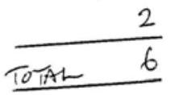
(d) Max. separation $= 2 \theta$
$$
\begin{aligned}
& = 2 \theta \\
& = 2 \cos ^ { - 1 } \left( \frac { R _ { E } } { R _ { E } + 10 ^ { 4 } } \right) 2 \\
& = 2 \cos ^ { - 1 } \left( \frac { 6 \cdot 38 \times 10 ^ { 6 } } { 6 \cdot 38 \times 10 ^ { 6 } + 10 ^ { 4 } } \right) 1 \\
& = 2 \cos ^ { - 1 } \left( \frac { 668 } { 639 } \right) ^ { 6.38 \times 10 ^ { 6 } + 10 ^ { 6 } } \\
& = 6.4 ^ { 6 }
\end{aligned}
$$
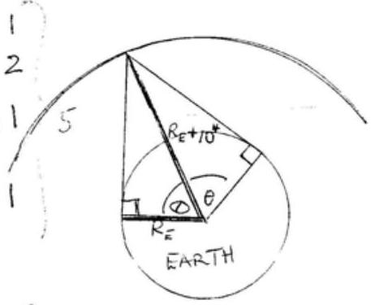
Reflection from its surface of the Eurth or Vanations in deriction of reflecting layer
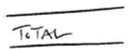

(e)

(iii) $$
\begin{aligned}
& x = 2.00 , T = 200 \mathrm {~K} , V = 6.00 \times 10 ^ { - 3 } \mathrm {~m} ^ { 3 } . \\
& p = \frac { m R T } { V - m b } - \frac { n ^ { 2 } a } { V ^ { 2 } } = \frac { ( 2.00 ) ( 8.31 . ) ( 200 ) } { 6.00 \times 10 ^ { - 3 } - 2.00 \left( 3.9 \times 10 ^ { - 5 } \right) } - \frac { ( 2.00 ) ^ { 2 } ( 0.14 ) } { ( 6.00 ) ^ { 2 } \left( 10 ^ { - 6 } \right) }
\end{aligned}
$$
2 morths for generating ton with either " $x ^ { 2 }$ or 2 is missing. Enimach for both absent.

$$
\begin{aligned}
& p V = n R T \\
& p = \frac { n R T } { V } = \frac { ( 2.00 ) ( 8.31 ) ( 200 ) } { 600 \times 10 ^ { - 5 } } = 0.554 \times 10 ^ { 6 } \mathrm {~Pa}
\end{aligned}
$$

(iv) $b$ is the volume occuped by the molecules $a / V ^ { 2 }$ is reduction. in pressure due to molecular attractions
f) (i) $x = a y ^ { b }$
$\ln x = \ln a + b \ln y$
Plot $\ln ( x )$ against $\ln ( y )$
graduit $b$
intercept $\ln ( a )$, hence a obtained
(ii) $\quad x ^ { 3 } = ( c y + d ) ^ { 2 }$
$x ^ { 3 / 2 } = c y + d$
Plot $x ^ { 3 / 2 }$ against $Y$
Gradient $c$
intercept $d$.

4
) In sight angle triangle $O A B$ let $A B = d$

$$
\begin{aligned}
d ^ { 2 } + R _ { E } ^ { 2 } & = \left( R _ { E } + h \right) ^ { 2 } \\
d ^ { 2 } & = 2 R _ { E } h + h ^ { 2 } .
\end{aligned}
$$

As $R _ { E } \gg R$, (sindent can retain $h ^ { 2 }$ ard othain correct ans)

$$
\begin{equation*}
d ^ { 2 } = 2 R _ { E } h \quad \text { AND } \quad d = R _ { E } \tan \theta \tag{1}
\end{equation*}
$$

As Earth rootales throungh $360 ^ { \circ }$ in 24 hour

$$
\begin{align*}
\frac { \theta } { 360 } & = \frac { 11.1 } { 24 \times 60 \times 60 }  \tag{2}\\
\theta & = \frac { 360 ( 11.1 ) } { 24 \times 60 \times 60 } = 0.04625 ^ { \circ } \tag{2}
\end{align*}
$$

Fran (1)

$$
\begin{equation*}
R _ { E } = \frac { 2 R } { \tan ^ { 2 } \theta } \tag{1}
\end{equation*}
$$

As $h = 1.70 \mathrm {~m}$ and $\theta = 0.04625 ^ { \circ }$

$$
\begin{equation*}
R _ { E } = \frac { 2 ( 1.70 ) } { \tan ^ { 2 } ( 0.04625 ) } = 5.22 \times 10 ^ { 6 } \mathrm {~m} \tag{2}
\end{equation*}
$$

TOTAL 10
h) The atringth of the tides depend on the gradient of the grevitatural force field. This is strongest at the ports along the hie joining the centres the Earth and Moon. Consequently there are two high tides each day at every port.

This gradrint is smallest at ports that subtend. an angle of $90 ^ { \circ }$ at the centre of the Earth with the lene oining the centres of the Earth and Moon; low tides Scarseguents in the chagrain, Quand Rhave high trakes and $p$ has a neap it de Any reasonable explanation plus correst conclusearis accipitable.

TOTAL 6

(1) Energy lost $= 200 \mathrm { MeV }$
host mass $\Delta _ { m } = \frac { ( 200 ) 10 ^ { 6 } \left( 1.60 \times 10 ^ { - 19 } \right) } { \left( 3.00 \times 10 ^ { 8 } \right) ^ { 2 } }$ kg $\left( E = m q ^ { 2 } \right)$
host wass $\Delta _ { m } = 3.56 \times 10 ^ { - 28 } \mathrm {~kg}$. 2
Decrease in mass, $\Delta m = 3.56 \times 10 ^ { - 28 } \mathrm {~kg}$
The speed $v$ of the two masses in given by
$$
\begin{aligned}
m = m _ { 0 } & \left( 1 - \frac { v ^ { 2 } } { c ^ { 2 } } \right) ^ { - \frac { 1 } { 2 } } \\
m ^ { 2 } \left( 1 - \frac { v ^ { 2 } } { c ^ { 2 } } \right) & = m _ { 0 } ^ { 2 } \\
m ^ { 2 } - m _ { 0 } ^ { 2 } & = m ^ { 2 } \left( \frac { v ^ { 2 } } { c ^ { 2 } } \right) \\
\left( m - m _ { 0 } \right) \left( m + m _ { 0 } \right) & = m ^ { 2 } \left( \frac { v ^ { 2 } } { c ^ { 2 } } \right)
\end{aligned}
$$
As $m \cong m _ { 0 }$ and $\Delta m = m - m _ { 0 }$ we can write, approximately,
$$
\begin{aligned}
\Delta m \left( 2 m _ { 0 } \right) & = m _ { 0 } ^ { 2 } \left( \frac { v ^ { 2 } } { c ^ { 2 } } \right) \\
2 \Delta m & = m _ { 0 } \left( \frac { v ^ { 2 } } { c ^ { 2 } } \right) \\
v & = c \sqrt { \frac { 2 \Delta m } { m _ { 0 } } } \\
& = \left( 3.00 \times 10 ^ { 8 } \right) \sqrt { \frac { 2 \left( 200 \times 10 ^ { 6 } \right) } { 2.21 \times 10 ^ { 5 } \times 10 ^ { 6 } } } \\
& = 1.41 \times 10 ^ { 5 } m ^ { - 1 }
\end{aligned}
$$
Usung MeV masses
TOTAL 8
(j) (i)
$$
\text { (i) } \quad \begin{aligned}
& v ^ { 2 } = 2 a s \\
& a = v ^ { 2 } / 2 s = \frac { ( 12 ) ^ { 2 } } { 2 ( 40 ) } = 1.80 \mathrm {~ms} ^ { - 1 } ?
\end{aligned}
$$
2
(11) Coff.
$$
\begin{aligned}
\mu & = \frac { \text { Force } } { \text { Normal Reaction } } = \frac { m a } { m g } = \frac { 1.80 } { 9.81 } \\
& = 0.183
\end{aligned}
$$
2
(iii) Loss in $K E = \frac { 1 } { 2 } ( 60 ) ( 12 ) ^ { 2 } = 4.32 \times 10 ^ { 3 } \mathrm {~J}$ 2
(iv) $$
\begin{aligned}
\text { Mass of ice melted } & = \frac { 4.32 \times 10 ^ { 3 } } { 330 \times 10 ^ { 3 } } \mathrm {~kg} \\
& = 1.31 \times 10 ^ { - 2 } \mathrm {~kg}
\end{aligned}
$$

TOTAL $\frac { 2 } { 8 }$

(k) (i) This is the region illuminated by the Sun. The dork regrow
Q16 faces away from the Sun
(ii) The dark region of the Moon is illuminated by light reflected by the Earth. So it is not completely black.

(iii) Assume the Earth and Moon are perfect reflectors of light and an equal distance from the Sun. Intersity of light hitting the Earth and Moon where K is of RECovisfacit
of the light hitting the Earth only a fraction Any derivation that dipends on $\left( R _ { \bar { E } } / R _ { \text {EM } } \right) ^ { 2 }$ acceptable
will seach the moon. This assumes energy radiated anorder of anorder of anorder of maintade calculation. Sone studentsminght unclude a factor of $K$ of order 1 to diceant for. the non-ideal condition; $f = K \left( \frac { R E } { R _ { E M } } \right) ^ { 2 }$

$$
\begin{aligned}
f & = \left( \frac { 6038 \times 10 ^ { 6 } } { 3.83 \times 10 ^ { 8 } } \right) ^ { 2 } \\
& = 2.8 \times 10 ^ { - 4 }
\end{aligned}
$$

The eresent is $\frac { 1 } { f }$ brigher, a factor of $3.6 \times 10 ^ { 4 }$, than the surromidung area of the Moon. TOTAL

(?) (i) lineas of air hitnig scil per sec $= \alpha A V$ Rate of change formentum of air hitting sail assuming velocity of air reduced by mpact with air
$$
\begin{aligned}
& = ( \alpha A v ) ( \beta v ) \quad \text { what } \beta a \text { const } \\
& = k v ^ { 2 } \text { where } k = \alpha A \beta = 2
\end{aligned}
$$
(ii) Force $= k v ^ { 2 }$
$$
\begin{aligned}
{ \left[ M L T ^ { - 2 } \right] } & = [ k ] \left[ L ^ { 2 } T ^ { - 2 } \right] \\
{ [ k ] } & = \left[ M L T ^ { - 2 } L ^ { - 2 } T ^ { + 2 } \right] \\
{ [ k ] } & = \left[ M L ^ { - 1 } \right]
\end{aligned}
$$
(iii) Dimensional analysis Assume
$$
k = c \rho ^ { p } A ^ { q } .
$$
where $c$, pand of constants
$$
[ k ] = \left[ M L ^ { - 1 } \right] = \left[ \left( M L ^ { - 3 } \right) ^ { p } \right] \left[ L ^ { 2 q } \right]
$$
Equating power of $M$
$$
1 = p
$$
Thus $k$ propartional to $\rho$.
(iv) The resusture dissipative forces of the water increase mare rapedly with speed than the wind force.
(m) The regen' of the wheel at the grand in instantenemsly at rest and comsequently dearly photographed. The top of the wheel, travellening along the road at speed $v$, is mornig at 2v. Internediate regions Of the wheel Rove mtermediate speeds beliver 0and 2v- the higher the speed the more blured the phrtofraphic unage

8

in) (1) The lightening traveh at speed $c = 3 \times 10 ^ { 8 } \mathrm {~ms} ^ { - 1 }$ Thurder travels at speed of sound $334 \mathrm {~ms} ^ { - 1 }$ So liffitening arrives chinat instantaneously
(ii)
| t/s | $\Delta \mathrm { t } / \mathrm { s }$ | Distance $\left( \Delta t \times V _ { \text {samd } } \right) / m$ Dist. Stom travelled s |  |  |
| :--- | :--- | :--- | :--- | :--- |
| 0 | 32.5 | 10,855 | o |  |
| 49.1 | 18.0 | 6,012 | $( 10855 - 6012 ) = 4843$. | 2 |
| 82.7 | 8.0 | 2,672 | $( 10855 - 2672 ) = 8183$. |  |

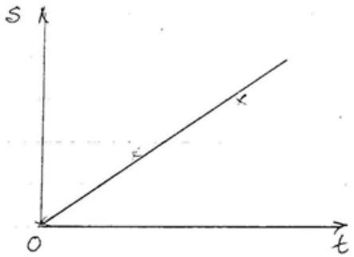
Gradient of $s$ - $t$ graph gives $u = ( 98.8 \pm .8 ) \mathrm { ms } ^ { - 1 }$
Calculation produceng two estimates of and average laken, sociatedle - 6 morks. (onis research of which - mily works)

SOLUTION Mark 1
Q2 (a) (i) $h = \frac { 1 } { 2 } g t ^ { 2 } = \frac { 1 } { 2 } ( 9.81 ) ( 10.2 ) ^ { 2 } = 510 \mathrm {~m}$ 2
(ii) $\quad t _ { 2 } = \frac { 510 } { 334 } = 1.53 \mathrm {~s}$ 2
(iii) $\quad \Delta h = t _ { 2 }$ * final velocity of stone $= 1.53 ( 10.2 \mathrm {~g} ) = 153 \mathrm {~m}$ Accuracy: $( 510 \pm 153 ) \mathrm { m }$ orn $30 \%$ accuracy 2 Any other reasonable estimate from $( 15 \rightarrow 40 ) \%$ weechforle
(b)

$$
\begin{align*}
t _ { 1 } + t _ { 2 } & = 10.2  \tag{1}\\
h & = \frac { 1 } { 2 } g t _ { 1 } ^ { 2 }  \tag{2}\\
h & = 334 t _ { 2 } \tag{2}
\end{align*}
$$

(Total time)

From (2) \& (3)

$$
\begin{align*}
334 t _ { 2 } & = \frac { 1 } { 2 } g t _ { 1 } ^ { 2 }  \tag{4}\\
t _ { 2 } & = \frac { 9 \cdot 81 } { 668 } t _ { 1 } ^ { 2 }
\end{align*}
$$

Substituting (5) into (1)

$$
\begin{aligned}
& t _ { 1 } + \frac { 9.81 } { 668 } t _ { 1 } ^ { 2 } = 10.2 \\
& t _ { 1 } ^ { 2 } + \frac { 668 } { 9.81 } t _ { 1 } - \frac { 10.2 ( 668 ) } { 9.81 } = 0 \\
& t _ { 1 } = \frac { 1 } { 2 } \left[ - \frac { 668 } { 9.81 } \pm \sqrt { \left( \frac { 668 } { 9.81 } \right) ^ { 2 } + 4 \left( \frac { 10.2 ( 668 ) } { 9.81 } \right) } \right]
\end{aligned}
$$

Quly tre times acceptable,

$$
\begin{aligned}
& t _ { 1 } = 34.046 [ - 1 + \sqrt { 1.59917 } ] \\
& t _ { 1 } = 9.01 \pm 0.01 \mathrm {~s} \\
& t _ { 2 } = 1.19 \pm 0.01 \mathrm {~s}
\end{aligned}
$$

Sub ${ } ^ { 9 }$ mito (3)

$$
h = 334 t _ { 2 } = 334 ( 1.19 ) = 397 \pm 3 \mathrm {~m} \quad \frac { 1 } { 10 }
$$

c) $$
\begin{aligned}
& t _ { 1 } + t _ { 2 } = 10.2 \\
& h = \frac { 1 } { 2 } g t _ { 1 } ^ { 2 } \\
& h ^ { 2 } + \left( u t _ { 1 } \right) ^ { 2 } = \left( 334 t _ { 2 } \right) ^ { 2 } .
\end{aligned}
$$

d) d)
$$
\begin{array} { r l r }
t _ { 1 } + t _ { 2 } & = 10 \cdot 2 & \frac { 1 } { 2 } \\
h & = - u t _ { 1 } + \frac { 1 } { 2 } g t _ { 1 } ^ { 2 } & \frac { 1 } { 2 } \\
h & = 334 t _ { 2 } & \frac { 1 } { 2 }
\end{array}
$$

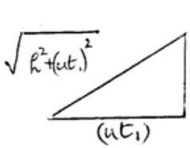
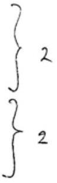

Sonution

る 1)
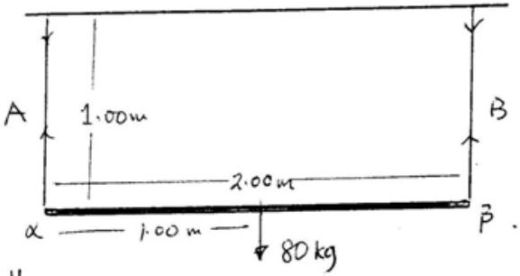
i) Resolving vertically
By symmetry
$$
\begin{aligned}
& T _ { A } + T _ { B } = 80 \mathrm {~g} = 784.8 \mathrm {~N} \\
& T _ { A } = T _ { B } = 392 \mathrm {~N}
\end{aligned}
$$
[Alternatively by moments about $\beta$.
$$
\left. \begin{array} { r l }
2.00 T _ { A } & = 1.00 ( 80 \mathrm {~g} ) \\
T _ { A } & = 40 \mathrm {~g} = 392 \mathrm {~N} \\
T _ { B } & = 392 \mathrm {~N}
\end{array} \right]
$$
(ii) For $A$, extension $x _ { A }$ givenby
(iii) For B, extension $x _ { B }$ given by
(iii) For B, extension $x _ { B }$ given by
$$
\begin{aligned}
y _ { A } = \frac { \text { stress } } { \text { strain } } & = \frac { \frac { 392 } { \pi ( 0.80 ) ^ { 2 } 10 ^ { - 6 } } } { \left( \frac { x _ { A } } { 1.00 } \right) } = 12.4 \times 10 ^ { 10 } \\
x _ { A } & = 1.57 \mathrm {~mm}
\end{aligned}
$$
$$
\left. \begin{array} { l }
y _ { B } = \frac { \frac { 392 } { \pi ( 10.50 ) ^ { 2 } 10 ^ { - 6 } } } { \left( \frac { x _ { B } } { 1.00 } \right) } = 9.00 \times 10 ^ { 10 } \\
x _ { B } = 5.55 \mathrm {~mm}
\end{array} \right\} 3
$$
in)
$$
\begin{aligned}
\theta & \approx \sin \theta = \frac { x _ { B } - x _ { A } } { 2.00 } \\
& = \frac { 3.98 \times 10 ^ { - 3 } } { 2.00 } \quad \text { radiains } \\
& = 1.99 \times 110 ^ { - 3 } \quad \text { radiais } \\
& = 0.114 ^ { \circ }
\end{aligned}
$$
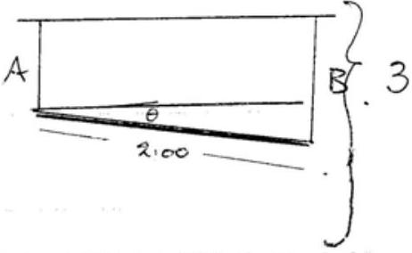
b) (i) Assumning rod horyontal
$$
T _ { A } + T _ { B } = 180
$$
Moments about $\beta$
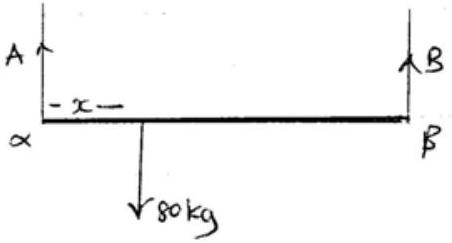
$$
\left. \begin{array} { c }
( 2.00 - x ) 80 \mathrm {~g} = 2.00 T _ { A } \\
T _ { A } = \frac { ( 2.02 - x ) 80 g } { 2.00 } \\
Y _ { A } = \frac { \text { sheas } } { \text { strain } } = \frac { \frac { T _ { A } } { x _ { A } ( 0.50 ) ^ { 2 } 10 ^ { - 6 } } } { x _ { A } } = 12.4 \times 10 ^ { 10 }
\end{array} \right\} 1
$$

$$
x _ { A } = \frac { T _ { A } } { 12.4 \times 10 ^ { 16 } \pi ( 0.80 ) ^ { 2 } 10 ^ { - 6 } }
$$

Subst turting for $T _ { A }$

$$
\left. x _ { A } = \frac { ( 2.00 - x ) 40 \mathrm {~g} } { 12.4 \times 10 ^ { 10 } \pi ( 0.80 ) ^ { 2 } 10 ^ { - 6 } } \right) 1
$$

(ii) Similarly for B
$$
x _ { B } = \frac { T _ { B } } { 9.07 \times 10 ^ { 10 } \pi ( 0.5 ) ^ { 2 } 10 ^ { - 6 } } \text { | } 2
$$
Moments about $\alpha$
$$
\begin{aligned}
80 g x & = T _ { B } ( 2.00 ) \\
T _ { B } & = 40 \mathrm {~g} x \\
x _ { B } & \left. = \frac { 40 \mathrm {~g} x } { 9.00 \times 10 ^ { 10 } \pi ( 0.5 ) ^ { 2 } 10 ^ { - 6 } } \right\} 1
\end{aligned}
$$
(iii) If $x _ { A } = x _ { B }$
$$
\begin{aligned}
\frac { ( 2 - x ) 40 \mathrm {~g} } { 12.4 ( 0.80 ) ^ { 2 } } & = \frac { 40 \mathrm { gx } } { 9.00 ( 0.50 ) ^ { 2 } } \\
( 2 - x ) 40 \mathrm {~g} & = 3.527 ( 40 \mathrm { gx } ) \\
80 \mathrm {~g} & = 40 \mathrm {~g} x ( 4.527 ) \\
x & = \frac { 2 } { 4.527 } \\
x & = 0.131 \mathrm {~m}
\end{aligned}
$$

i2
SOLUTION
QH (a)

(i) Power = Reseature Force × Speed whentravelling at $30 \mathrm {~ms} ^ { - 1 }$ Resestive force $R = \frac { 1350 } { 30 } = 45 \mathrm {~N}$
(11) Flexing of tyres at low pressure causes loss of everyy by heating eft (compare motion with a flat type with inflated tyre of
(iii) $I = 1350 \left( \frac { 1 } { 0.97 } \right) \frac { 100 } { 25 } = 5.56 \mathrm {~kW}$
(iv) Lees weight $\begin{aligned} & \text { Better aerodum } \\ & \text { anysuitable reason } \end{aligned}$ Better aerodynamics eire
(v) Streight track, flattrack sufficient friction for volling wheels fany two without sliffeng etc. Race when Sun overhead
(b) (i) $\quad a = \frac { 1 } { m } \left( F _ { 1 } - k v _ { 1 } ^ { 2 } \right)$
$$
\begin{aligned}
R & = k v ^ { 2 } \\
45 & = k ( 30 ) ^ { 2 } . \\
k & = 0.0500 \mathrm { kgm } ^ { - 1 }
\end{aligned}
$$
$$
F = 45 \mathrm {~N}
$$
(c) (i) A ensures that magnetic polarity of colls is synchronised so that there is always a force on the magnet farming the relation; hulf cycle attrouting, half cycle repelling
    (11) Both coils lave same periodic current. Ideally à square varaturis
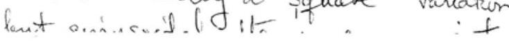

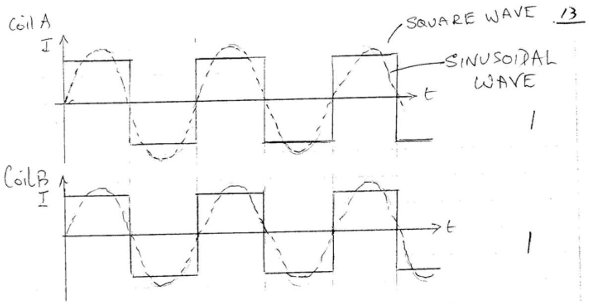
$I = I _ { 0 } \sin \omega t$
OR

$$
\begin{aligned}
I & = I _ { 0 } \\
& = - I _ { 0 }
\end{aligned}
$$

$$
\begin{aligned}
& 0 < t < \frac { T } { 2 } \\
& \frac { T } { 2 } < t < T
\end{aligned}
$$

ALTENATINELY
efe.
eff.

$$
\begin{aligned}
I & = I _ { 0 } \\
& = - I _ { 0 }
\end{aligned}
$$

$$
\begin{aligned}
& n T < t < \left( n + \frac { 1 } { 2 } \right) T \\
& \left( n - \frac { 1 } { 2 } \right) T < t < n T
\end{aligned}
$$

Ninitiger
$0,1,2 , \ldots$
(iii) Currents decrease as motor speeds up due to back emf, Lenz's Law.
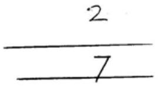

少
SOLUTION
Q5

$$
\text { (a) } \begin{aligned}
\text { Timi taken to trand } 3 \mathrm {~km} & = \frac { 3 \times 10 ^ { 3 } } { 3 \times 10 ^ { 8 } } \mathrm {~s} \\
& = 10 ^ { - 5 } \mathrm {~s}
\end{aligned}
$$

$$
\left( c = 3 \times 10 ^ { 8 } \mathrm {~ms} ^ { - 1 } \right)
$$

As he was only able to measure times in excers of $10 ^ { - 1 } \mathrm {~s}$, he coned not measure $10 ^ { - 5 } \mathrm {~s}$. Consequently a mull result.
Thus he could only conclude that light travelled at a speed that was greater than $\frac { 3 \times 10 ^ { 3 } } { 10 ^ { - 1 } } = 3 \times 10 ^ { 4 } \mathrm {~ms} ^ { - 1 }$.
Minimum accuracy of time measurement $\sim 10 ^ { - 5 } \mathrm {~s}$
b) (1) When Earth mornig towards Jupiter, $P _ { 1 }$ Is $P _ { 2 }$, light from Io "eclipse" takes a shorter and sharter twine to travel fram Jubiter. It Earth Thus persod of rotation of $I _ { 0 }$ appears to be reduceng
(ii) Sinilarly penod extended when movery away from Tupleir, Q1 \& Q2

Leght travels additional destance acrors diameter of Earth's arbit around the Sun. This takes 22 minites, so

$$
c = \frac { 3 \times 10 ^ { 11 } } { 22 \times 60 } = 2.3 \times 10 ^ { 8 } \mathrm {~ms} ^ { - 1 }
$$

c) Wheel mares through $\frac { 1 } { 2 \times 720 }$ of a revolution between tomsmission and reception of light. For wheel notating at 12.6 reass ${ } ^ { - 1 }$

$$
\text { Tire taken } = \frac { 1 } { 2 ( 720 ) ( 12.6 ) } s
$$

Distance travelled $= 2 \times 8633 \mathrm {~m}$
Thus

$$
\begin{aligned}
c & = ( 2 \times 8633 ) / ( 2 \times 720 \times 12.6 ) \\
& = 3.13 \times 10 ^ { 8 } \mathrm {~ms} ^ { - 1 }
\end{aligned}
$$

If path length $2 L$ and rate of rotation in then

$$
\begin{aligned}
c & = ( 2 L ) ( 2 \times 720 ) n \\
\frac { \Delta c } { c } & = \frac { \Delta n } { n }
\end{aligned}
$$

Substituting,

$$
\begin{aligned}
\Delta c & = ( 0.04 ) c \\
& = 0.12 \times 10 ^ { 8 } \mathrm {~ms} ^ { - 1 } \\
c & = ( 3.13 \pm 0.12 ) 10 ^ { 8 } \mathrm {~ms} ^ { - 1 }
\end{aligned}
$$

SOLUTION

Q6 (a) (1)

$$
\begin{aligned}
F _ { c } & = \frac { 2 Q } { 4 \pi \varepsilon _ { 0 } d ^ { 2 } } \hat { A C } + \frac { 2 Q } { 4 \pi \varepsilon _ { 0 } d ^ { 2 } } \hat { C B } \\
& = \frac { 2 Q } { 4 \pi \varepsilon _ { 0 } d ^ { 2 } } \hat { A B }
\end{aligned}
$$

ie force magnitude $\frac { 2 Q } { 4 \pi \varepsilon _ { 0 } d ^ { 2 } }$ along $\overline { A B }$ ' $\left. F _ { 0 } = \frac { 2 Q } { 4 \pi \varepsilon _ { 0 } d ^ { 2 } } \hat { A _ { 0 } } + \frac { 2 Q } { 4 \pi \varepsilon _ { 0 } ( 2 d ) ^ { 2 } } \hat { O B ^ { \prime } } = \frac { 6 Q } { 4 \left( 4 \pi \varepsilon _ { 0 } \right) d ^ { 2 } } \hat { A O } = \frac { 3 Q } { 2 \left( 4 \pi \varepsilon _ { 0 } \right) d ^ { 2 } } \hat { A _ { 0 } } \right\rvert \,$ $i$ force of magnifule $\frac { 3 Q } { 2 \left( 4 \pi \varepsilon _ { 0 } \right) d ^ { 2 } }$ along $A O ^ { - 1 }$ 2
(11)

$$
\begin{aligned}
& V _ { c } = \frac { 2 Q } { \left( 4 \pi \varepsilon _ { 0 } \right) d } - \frac { 2 Q } { \left( 4 \pi \varepsilon _ { 0 } \right) d } = 0 \\
& V _ { 0 } = \frac { 2 Q } { \left( 4 \pi \varepsilon _ { 0 } \right) d } - \frac { 2 Q } { \left( 4 \pi \varepsilon _ { e } \right) ( 2 d ) } = \frac { Q } { \left( 4 \pi \varepsilon _ { 0 } \right) d }
\end{aligned}
$$

(iii) Potentials at $A$ and $D$, due to $( - 2 Q )$, are equal. Wark done in taking $+ 2 Q$ along $A C G D E D$ to $D$ is zero. 2
10
(b) (1) Force on charge $q = E q$.
Acceleration of $q = \mathrm { Eq } / \mathrm { m }$
Tine taken to transverse plates $= \left( \frac { L } { v } \right)$
Using " $y = \frac { 1 } { 2 } a t ^ { 2 " }$,
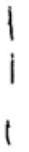
$y _ { 1 } = \frac { 1 } { 2 } \frac { E q } { m } \left( \frac { L } { v } \right)$
(11) Circular motion of $q$ with constant $v$

$$
\left. \begin{array} { r l }
B q v & = \frac { m v ^ { 2 } } { R } \\
\therefore R & = \frac { m v } { B q }
\end{array} \right\} 2 \quad R \text { raduis of path }
$$

From diagram

$$
y _ { 2 } = R - h
$$

But

$$
h = \sqrt { R ^ { 2 } - L ^ { 2 } }
$$

using Pythagoras's Th. in AOB.

$$
\left. \therefore y _ { 2 } = R - \sqrt { R ^ { 2 } - L ^ { 2 } } \quad \text { where } \quad R = \frac { m v } { B q } \right) ^ { 2 }
$$

(iii)
If $E$ and $B$ forces balance, $E _ { q } = B _ { q } v$. or $E = B v$ or $v = \frac { E } { B } 1$ Substituting for $v$ in the result obtained in $b ( 1 )$

$$
\begin{aligned}
& y _ { 1 } = \frac { 1 } { 2 } \frac { E q } { m } L ^ { 2 } \left( \frac { B } { E } \right) ^ { 2 } \\
& \frac { q } { m } = \frac { 2 y _ { 1 } E } { B ^ { 2 } L ^ { 2 } }
\end{aligned}
$$

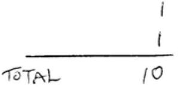

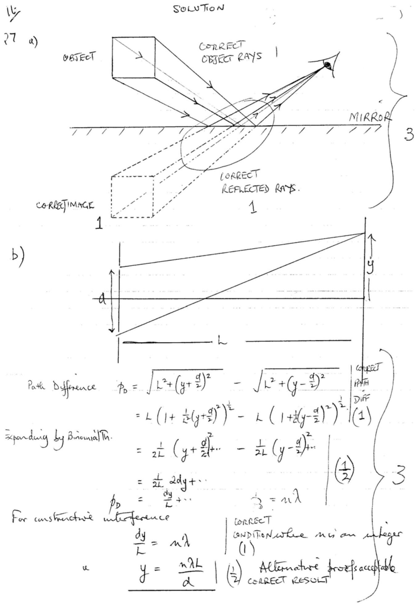

c) 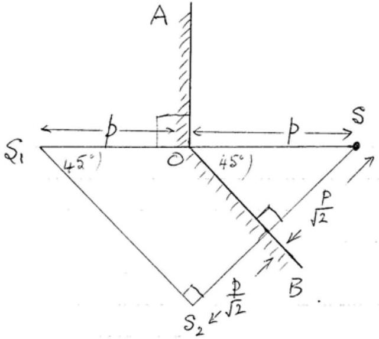
(1) At the positions $S _ { 1 }$ and $S _ { 2 }$ indicated in the deagram Reflection in vertical merror, Ao, unaged at $S$, a destance $p$ behend $A O$ Reflection in incluied muror, $O B$, at destance $( p / \sqrt { 2 } )$ behend murror at $S _ { 2 } , S S _ { 2 }$ Ir to merior
(ii) $S _ { 1 }$ and $S _ { 2 }$ act as vertual sources of coherent light producing an interference pattern on a sarem placed parallel to $S _ { 1 } S _ { 2 }$ in frant of marars: $S _ { 1 }$ and $S _ { 2 }$ behave as slits in a foung's slit arrangement
(iii) Parallel to $S _ { 1 } S _ { 2 }$ which is parallel to OB
(iv) $\alpha$ is the distance between $S _ { 1 }$ and $S _ { 2 } = 2 p \cos 45 ^ { \circ } = \sqrt { 2 } p$.
(v) $L = D + \frac { p } { \sqrt { 2 } } = D + \frac { \sqrt { 2 } } { 2 } p$. where $D$ is distance of serien from 0 .
(1) I hecomes inaller and consequently y becomes lor ger for given. Wher $S _ { 1 }$ ant $S _ { 2 }$ conicide, at $180 ^ { \circ }$ petiveen murrors, there 3 is no interference.

18/
SOLUTIONS
78 conservation of momentum:

$$
\begin{equation*}
m _ { 1 } v _ { 1 } = m _ { 1 } v _ { 1 } + m _ { 2 } v _ { 2 } \tag{1}
\end{equation*}
$$

$m _ { 1 } =$ mass of rention
$v _ { 1 } =$ initial speed of neutron
$m _ { 2 }$ mass of second particle
$v _ { 2 }$ speed of secondparticle
bonservation of energy

$$
\begin{equation*}
\frac { 1 } { 2 } m _ { 1 } v _ { 1 } ^ { 2 } = \frac { 1 } { 2 } m _ { 1 } v ^ { 2 } + \frac { 1 } { 2 } m _ { 2 } v _ { 2 } ^ { 2 } \tag{2}
\end{equation*}
$$

From (1)
From (2)

$$
\begin{align*}
& m _ { 1 } \left( v _ { 1 } - v \right) = m _ { 2 } v _ { 2 }  \tag{3}\\
& m _ { 1 } \left( v _ { 1 } ^ { 2 } - v ^ { - 2 } \right) = m _ { 2 } v _ { 2 } ^ { 2 } \\
& \left. v _ { 1 } - v \right) \left( v _ { 1 } + v \right) = m _ { 2 } v _ { 2 } ^ { 2 } \tag{4}
\end{align*}
$$

Dividing (3) into (4)

$$
\begin{equation*}
v _ { 1 } + r = v _ { 2 } \tag{5}
\end{equation*}
$$

Tunus sub ${ } ^ { 9 }$. (5) nita (1)

$$
\begin{equation*}
v = \left( \frac { m _ { 1 } - m _ { 2 } } { m _ { 1 } + m _ { 2 } } \right) i _ { i } ^ { \prime } \tag{4}
\end{equation*}
$$

(1)

$$
\begin{aligned}
V & = \frac { 1.0087 - 1.0073 } { 1.0087 + 1.0073 } 2.0 \times 10 ^ { 7 } \mathrm {~ms} ^ { - 1 } \\
& = + 1.4 \times 10 ^ { 4 } \mathrm {~ms} ^ { - 1 }
\end{aligned}
$$

(n)

$$
\begin{aligned}
V & = \frac { 1.0087 - 11.9934 } { 1.0087 + 11.9934 } 2 \times 10 ^ { 7 } \mathrm {~ms} ^ { - 1 } \\
& = - 1.68 \times 10 ^ { 7 } \mathrm {~ms} ^ { - 1 }
\end{aligned}
$$

After many collisions the speeds of the neutions will be such that the distribution of speed is the room temperatore distribution

SOLUTION
$29 \quad ( a )$

$$
\begin{aligned}
& R = R _ { 0 } e ^ { - \lambda t } \\
& \ln ( R ) = \ln \left( R _ { 0 } \right) - \lambda t
\end{aligned}
$$

Pot $\ln ( R )$ against $t$ for straight hie gruph gradient $( - \lambda )$ untercept $\ln \left( R _ { 0 } \right)$ at $t = 0$.
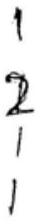
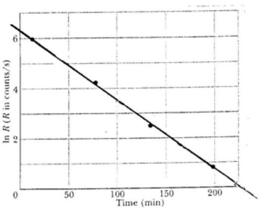

From the graph.

$$
\begin{aligned}
- \lambda & \left. = \frac { 0 - 6.20 } { 225 - 0 } = - 0.0275 \mathrm {~min} ^ { - 1 } \right\} 2 \\
\lambda & \left. = 0.0275 \mathrm {~min} ^ { - 1 } = 0.0004585 ^ { - 1 } \right\} 1 \\
& = 1.65 \mathrm { kms } ^ { - 1 }
\end{aligned}
$$

$$
\left. T _ { \frac { 1 } { 2 } } = \frac { \ln 2 ^ { ( 1 ) } } { \lambda } \simeq 25.2 \mathrm { mins } = 15125 \right\} 2
$$

b) (i) The proportion's remain ontially constant. A. must have a long half life for it to exist
(ii)

$$
\begin{array} { l l }
N ( t ) = N _ { 0 } e ^ { - \lambda t } = N _ { 0 } e ^ { n \ln 2 } & \text { where } n = \frac { t } { T _ { \frac { 1 } { 2 } } } , \\
\frac { N ( t ) } { N _ { 0 } } = \frac { 1 } { 10 ^ { \prime \prime } } = \left( e ^ { - \ln 2 } \right) ^ { n } = \left( \frac { 1 } { 2 } \right) ^ { n } & \text { half life } \frac { T _ { \frac { 1 } { 2 } } } { } .
\end{array}
$$

Taking $\log _ { 10 }$

$$
\begin{aligned}
& 11 = n \log _ { 10 } 2 = n ( 0.3010 ) \\
& n = 37
\end{aligned}
$$

Thus

$$
t = 37 \times 10 ^ { 8 } = 3.7 \times 10 ^ { 9 } \text { years }
$$

(iii)

$$
\begin{aligned}
& 10 ^ { 14 } \text { atoms decay to one atom of } C \text {, neglect witemediate } \\
& \text { decay with lefetime of } 605 \text { as it is much less than } 10 ^ { 8 } \text { years. }
\end{aligned}
$$

SONUTIONS
b) benservation of momentum: $m v = ( m + M ) V$ (1) 2
V is speed after bullet lodged m block
benservation of evergy Eliminating $V$ form $( 1 ) \& ( 2 )$

$$
\left. \begin{array} { r l }
\frac { 1 } { 2 } ( m + M ) T ^ { 2 } & = ( m + M ) g h \quad ( z ) =  \tag{\(\Rightarrow 2\)}\\
\frac { 1 } { 2 } ( m + M ) \left( \frac { m v } { m + M } \right) ^ { 2 } & = ( m + M ) g h \\
\frac { 1 } { 2 } \left( \frac { m v } { m + M } \right) ^ { 2 } & = g h \\
v & = \left( \frac { m + M } { m } \right) \sqrt { 2 g h }
\end{array} \right\}
$$

The block plus bullet swengs up with sumple harmonec motion - comment on amplitude out/a period.
