SOLUTIONS
BPLO 2005 PAPER 2

21 (a) Let $T$ be the original temperature
Heat game by themometer = Heat lost by water (1)
$$
\left. \begin{array} { r l }
20 ( 50 - 18 ) & = ( T - 50 ) 4200 ( 0.250 ) \\
640 & = ( T - 50 ) 1050 \\
T & = 50 \cdot 0 + \frac { 640 } { 1050 } \\
T & = 50.6
\end{array} \right\}
$$
(b) $\quad V = \left( 6 I - 3 I ^ { 2 } + 2 I ^ { 3 } \right) / 6$
$$
R = \frac { V } { I } \Rightarrow 1 - \frac { 1 } { 2 } I + \frac { 1 } { 3 } I ^ { 2 }
$$
(i) $I = 2$
$$
R = \frac { 4 } { 3 } \Omega
$$
(ii) $I = 0$
$$
R = 1 \Omega
$$
(iii) Grafats: Llaht Bohb
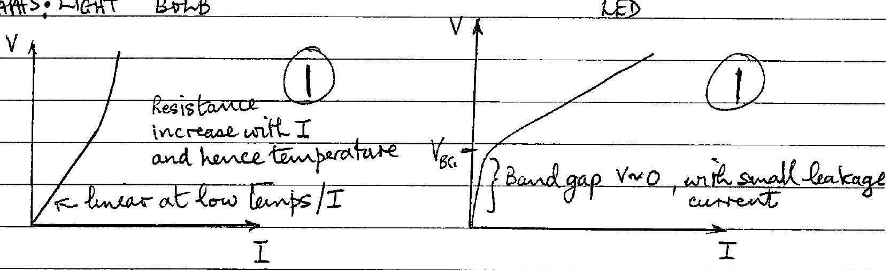
(iv) Expanations:
Resistance increases with temp, Wittle current for $V < V _ { \text {Band gay } }$ and hence current. Lineor for 1 small I / low temps. $\left( V _ { B G } \right)$, subsequently reases wifh I
[6]
(c)
(1) The charge sepels aimilar charges in the copper sphere and aftract oppiste charges causung a net attaction when earthed the elee charges in this shies are repelled to earth, leaving only opposite charges in the spher. This produces an wireased attracteon (1)

(ii) On a smgh foor frection perents the base of the ladderfram sholing-1 On a suncoth floor there is no force preventing the ladder from shelug? the froce is neasary to balance its moomal meachan frenthe wall?
(iii) If the connera hole is to small there is insufficient light to prooluce a contrasted; ininged (if exceedingly suall diffraction efects present). If the hole is too large it no longer act as a point' hole and produces plurning due to averlapping 1 inages from the finite hole.
(iv) The blue doth aly seflect blue light Soduin light is yellow so no light is seflected so cloth appears dark.
(d) (i) Leght is a transurse wave and seund is a longtholinal wave Ouly Frenswerse waves can be polarijed. Rotate a polaroid sheet in the beam. The intensity will vary frem a maximum to a minimum for a partially polaryed beam. A fully polarzed beam causes extenction at the minuium.

(ii) $[ A ] = [ y ] = [ L ] \quad$ units: $m$

$$
\begin{array} { l l }
{ [ \pi ] = [ 0 ] } & \text { units: diniensemiless } \\
{ [ \beta ] = \left[ T ^ { - 1 } \right] } & \text { units: } s ^ { - 1 } \\
{ [ \gamma ] = [ L ] } & \text { with: } \mathrm { m }
\end{array}
$$

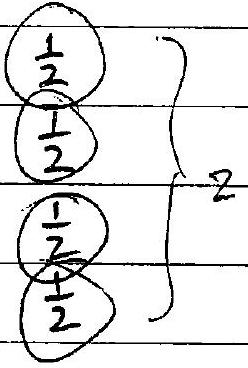
y will maintain the same value providung

$$
\begin{aligned}
2 \pi ( \beta t - x / \gamma ) & = \text { const } \\
x & = - \frac { \text { const } } { 2 \pi } + \gamma \beta t
\end{aligned}
$$

Velocity $u = \gamma \beta$, which is a constant (1) earther $u = \frac { d x } { d t } = \beta \gamma$ or $\frac { \Delta x } { \Delta t } = \gamma \beta$ ] Non mathematical explanation OK'y correct

(e) (i) Wind druvis water vapose from the clothes. This causes wave water to evaparate, whech cools the remaining water in the clothes. Sufficiet coolng will extract sufficient latent heat of fusion from the 2 water K cause freezeing of the water

e) (ii) Of mass $M$ freezes and mass $m$ evaporates they heat extraded from $\mathrm { M } = 333 \times 10 ^ { 3 } \mathrm { M } \mathrm { J }$ energy extracted frem widt $= 2500 \times 10 ^ { 3 } \mathrm {~m} \mathrm {~J}$ Equating
$$
\left. \begin{array} { r l }
333 M & = 2500 \mathrm {~m} \\
\frac { M } { m } & = \frac { 2500 } { 333 } \\
\therefore \frac { M } { m + M } & = \frac { 2500 } { 2500 + 333 } = \frac { 2500 } { 2833 } = 0.882
\end{array} \right\}
$$
f) (1)
$$
\begin{aligned}
v ^ { 2 } = u ^ { 2 } & - 2 a s ^ { \prime } \\
( 310 ) ^ { 2 } & = 2 a ( 1.20 ) \\
a & = 4.00 \times 10 ^ { 4 } \mathrm {~ms} ^ { - 2 }
\end{aligned}
$$
(ii) $$
\begin{aligned}
& v = u + a t ^ { \prime } \\
& 310 = 4.00 \times 10 ^ { 4 } t \\
& t = 7.74 \times 10 ^ { - 3 } \mathrm {~s}
\end{aligned}
$$
$$
\begin{aligned}
\text { Rotational speed } & = 2 ( 2 \pi ) / 7.74 \times 10 ^ { - 3 } \mathrm { rads } / \mathrm { s } \\
& = 1.62 \times 10 ^ { 3 } \mathrm { rad } / \mathrm { s }
\end{aligned}
$$
(iii) Rotation poduces stability in the motion of the bullet
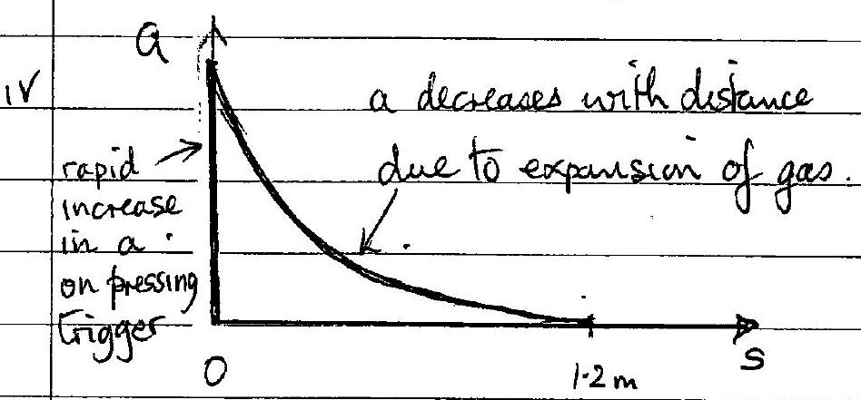
'g)
$$
\begin{aligned}
\text { Upthrust } & = v _ { \text {ol } } \cdot \left( \rho _ { \text {air } } - \rho _ { \text {ite } } \right) \mathrm { g } \\
& = 512 ( 1.290 - 0.178 ) \mathrm { g } \\
& = 569 \mathrm {~g} \\
& = m g \quad \text { where } m \text { is las } \\
m & = 569 \mathrm {~kg}
\end{aligned}
$$

(11) Relative to sumondug air mass, air in ballom has a negative' air mass $= V \left( \rho _ { \text {He } } - \rho _ { \text {air } } \right)$, where $V$ is the volume of the balloon. This courses an upthoust when in equilitarmer and will behave line a negative mons when applying the equation of motion when in motion.
Inertion of air igneater than inertia of the. Therefore air continues formard more them He. When the bees deceterates the passengers will be thrown forward if not restrained for example, by a seat belt; they have a pertive mass. The balloo will be displaced backward with its string ist an angle. When the bus comes to rest the string will retuin to it al vertical position.
(1) (2) a against $v$ v against $t$
$r = g t$
(i) MOTION UNDER GRAVITY
Mution under graverty
(ii) WITH DAMPING (2)
(iii) (1) SHM [8]

(i) $10.0 \Omega$ in parallel with $4.00 \Omega$ : total resotiance $\left( \frac { 1 } { 10 } + \frac { 1 } { 4 } \right) 1$.
Total resistance $= \left( \frac { 1 } { 10 } + \frac { 1 } { 4 } \right) ^ { - 1 } + 2 = \frac { 34 } { 7 }$ (21
Current through $2.00 \Omega = 2 X \left( \frac { 34 } { 7 } \right)$
$\therefore I _ { 0 } = \frac { 2 } { 17 } =$ oelo amps
(ii) $V _ { A B } = 2.00 \left( \frac { 4 } { 6 } \right) = \frac { 4 } { 3 } = 1.333$ volts
(iii)

$$
\begin{aligned}
& V _ { A B } = \frac { 4 } { 3 } \left( \frac { \pi } { 3 } \right) = \frac { \Omega } { I _ { 0 } } \\
& I = \frac { 4 } { 3 } / \left( \frac { \pi } { 2 } + \frac { 34 } { 3 } \right) = \frac { 4 } { 3 } \left( \frac { 6 } { 119 } \right) = \frac { 8 } { 119 } =
\end{aligned}
$$

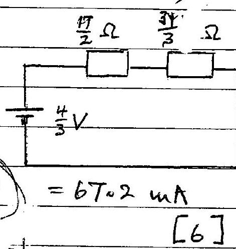
k) Escape velocity for planet Mars, wass $M$ and radius $R$, is $V _ { M E }$ For body mers m excoping

$$
\begin{aligned}
\frac { 1 } { 2 } m v _ { M E } ^ { 2 } & = \frac { G M _ { M } } { R } \\
v _ { M E } & = \sqrt { \frac { 2 G M } { R } }
\end{aligned}
$$

On Farth escape velocity

$$
V _ { E } = \sqrt { \frac { 2 G M _ { E } } { R _ { E } } }
$$

Ratio

$$
\frac { V _ { M E } } { V _ { E } } = \sqrt { \frac { M } { M _ { E } } \frac { R _ { E } } { R } } = \sqrt { ( 0.1074 ) / ( 0.5326 ) }
$$

$$
V _ { M E } = 0.4491 V _ { E }
$$

[3]
l) Let velocities of the $m$ masses be $v$ at $30 ^ { \circ }$ to incident velocity $u$.
leaservation of momentom:

$$
M u = 2 m \sqrt { \cos 30 ^ { \circ } } = 2 m v \frac { \sqrt { 3 } } { 2 } = \sqrt { 3 } m v , 1
$$

banservation of energy:

$$
\begin{align*}
\frac { 1 } { 2 } M u ^ { 2 } & = 2 \cdot \left( \frac { 1 } { 2 } m v ^ { 2 } \right) \\
M u ^ { 2 } & = 2 m v ^ { 2 } \tag{1}
\end{align*}
$$

Substituting from (1) for $v$ into (2)

$$
\begin{align*}
M u ^ { 2 } & = 2 m \left( \frac { M u } { m \sqrt { 3 } } \right) ^ { 2 } \\
M & = \frac { 3 } { 2 } m \tag{1}
\end{align*}
$$

n)

Let current in $R _ { 1 }$ be $I _ { 1 }$ and that in $R _ { 2 } , I _ { 2 }$, the forcessivill be pointing out of the plane of the diagram and perpendicular 15 it. 1
The resultant torque $\tau =$ moment of to forces

$$
\begin{align*}
\tau & = \frac { 1 } { 2 } d \left[ B I _ { 2 } \right]  \tag{1}\\
& = \frac { 1 } { 2 } B L d \left[ I _ { 2 } - I _ { 1 } \right] \tag{1}
\end{align*}
$$

For the circuit of parallel resesters

$$
\begin{equation*}
I _ { 1 } = \frac { R _ { 2 } } { R _ { 1 } + R _ { 2 } } I \quad \& \quad I _ { 2 } = \frac { R _ { 1 } } { R _ { 1 } + R _ { 2 } } I \tag{1}
\end{equation*}
$$

Substituting in (1)

$$
\tau = \frac { \left( R _ { 1 } - R _ { 2 } \right) B L d I } { 2 \left( R _ { 1 } + R _ { 2 } \right) }
$$

Auticlockurs 1 atomd I as viewed from above

22 (1) Applying Nestor's grewrtational law of attraction to mass $m$ at $h$
$$
\begin{aligned}
m g _ { h } & = \frac { G M _ { E m } } { \left( R _ { E } + h \right) ^ { 2 } } \\
g _ { h } & = \frac { C M _ { E } } { \left( R _ { E } + h \right) ^ { 2 } }
\end{aligned}
$$
But
$$
g _ { 0 } = \frac { C M _ { E } } { R _ { E } ^ { 2 } }
$$
Thus
$$
g _ { h } = g _ { 0 } \frac { R _ { E } ^ { 2 } } { \left( R _ { E } + h \right) ^ { 2 } }
$$
(ii) Below the Earth's surface force on mass m due to oplere radius $r$, $M _ { r }$, Thus
But
$$
m g _ { r } = \frac { G _ { m } M _ { r } } { r ^ { 2 } }
$$
$$
M _ { r } = \left( \frac { r } { R _ { E } } \right) ^ { 3 } M _ { E }
$$
So
$$
g _ { r } = \frac { G M _ { E } r } { R _ { E } ^ { 3 } } = g _ { 0 } \left( \frac { r } { R _ { E } } \right)
$$
(iii) 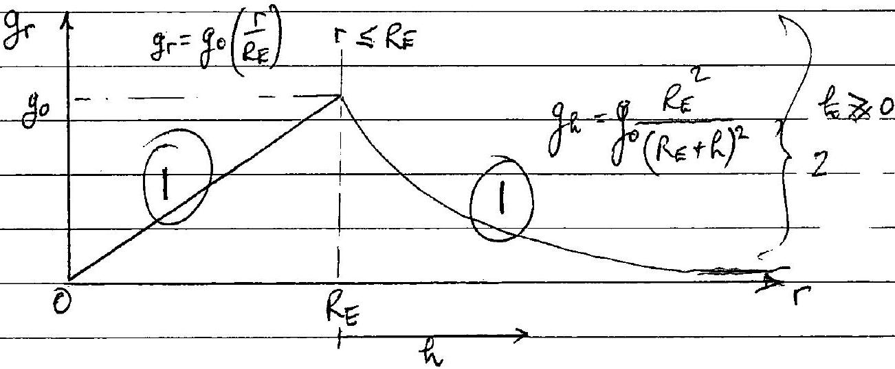
(iv) The Earth does not have uniform density, but it is pplecically 61 symmetric, with increasing density towerds its centre, consequenti the efratums in (i) and (ii) do apply, providing in (11) the M is the mass within the sphere of raduis $r$ and the subsequent sequations are modified to take this into account 19

2(b) (1) For a satellite in currilar motion, mass m, angular frequency $\omega$,

$$
\begin{equation*}
m \left( R _ { E } + h \right) \omega ^ { 2 } = \frac { G M _ { E } m } { \left( R _ { E } + h \right) ^ { 2 } } \tag{1}
\end{equation*}
$$

where

$$
\begin{aligned}
w & = 2 \pi / ( 2.0 \times \quad 60 \times 60 ) \\
\left( R _ { E } + h \right) ^ { 3 } & = \frac { G M _ { E } } { w ^ { 2 } } \\
& \left. = \frac { \left( 6.67 \times 10 ^ { - 11 } \right) \left( 5.97 \times 10 ^ { 24 } \right) } { \left( 2 \pi / 2.0 \times \frac { 60 \times 60 ) ^ { 2 } } { } \right. } 1 \right) \\
& = ( 6.67 ) ( 5.97 ) 10 ^ { 13 } \left( \frac { 7.20 \times 10 ^ { 3 } } { 2 \pi } \right) ^ { 2 } \\
& = 5.229 \times 10 ^ { 20 } \mathrm {~m} ^ { 3 } \\
& = 8.056 \times 10 ^ { 6 } \mathrm {~m} \\
R _ { E } + h & = ( 8.056 - 6.38 ) 10 ^ { 6 } \mathrm {~m} \\
h & = 1.68 \times 10 ^ { 6 } \mathrm {~m} = 1.68 \times 10 ^ { 3 } \mathrm {~km}
\end{aligned}
$$

(ii) Anqular velocity of the Earth $= 2 \pi / ( 24 \times 60 \times 60 ) \mathrm { rads } / \mathrm { s } \left( \frac { 1 } { 2 } \right)$ Angular veloculy of satellite $= 2 \pi / ( 2 \times 60 \times 60 ) \mathrm { rads } / \mathrm { s } \frac { 1 } { 2 }$ Angular velocity of satellite selative to the tarth
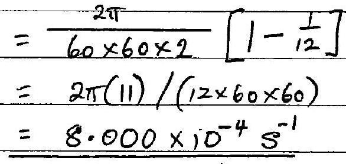
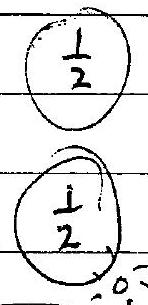
(iii) In the dragram
$$
\begin{aligned}
\cos \theta & = \frac { R _ { F } } { R _ { E } + h } \\
& = \frac { 6.38 \times 10 ^ { 6 } } { 8.056 \times 10 ^ { 6 } } \\
& = 0.792 \\
\theta & = 37.63 ^ { \circ } \\
2 \theta & = 75.3 ^ { \circ }
\end{aligned}
$$

c) The quaritational field of the Moon, and to a leaser extent the Sun, will perturb the counlarmotion and limit the largest persods.l. Viscons effect of the Earth's atmosphere will reduce thesergy of the satellete and limit the smallest passible periode of a satellite

a)
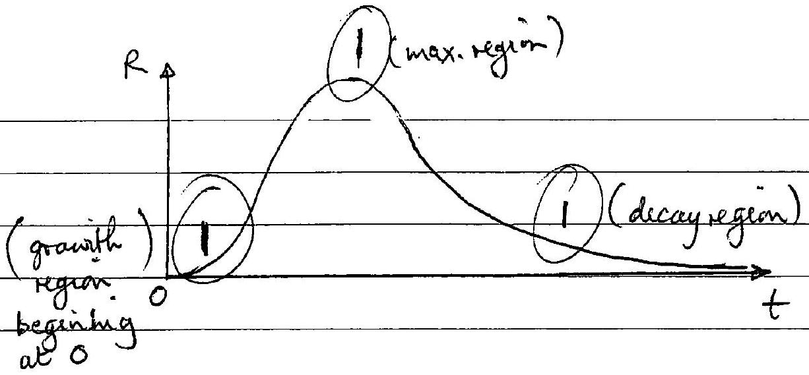
3) (i)

$$
R = \frac { \lambda _ { 1 } } { \left( \lambda _ { 2 } - \lambda _ { 1 } \right) } \left[ e ^ { - \lambda _ { 1 } t } - e ^ { - \lambda _ { 2 } t } \right]
$$

For emallt

$$
e ^ { - \lambda t } = 1 - \lambda t + \cdots
$$

Giving

$$
\begin{aligned}
R & = \frac { \lambda _ { 1 } } { \left( \lambda _ { 2 } - \lambda _ { 1 } \right) } \left[ \left( 1 - \lambda _ { 1 } t + \cdots \right) - \left( 1 - \lambda _ { 2 } \frac { 1 } { 2 + \cdots } \right) \right. \\
& = \frac { \lambda _ { 1 } } { \left( \lambda _ { 2 } - \lambda _ { 1 } \right) } \left[ \left( \lambda _ { 2 } - \lambda _ { 1 } \right) t + \cdots \right] \\
R & \left. = \lambda _ { 1 } t + \cdots 1 \right) \quad \begin{array} { l }
\text { (accept proof if } \lambda _ { 1 } \text { meglected } \\
\text { with neopect to } \left. \lambda _ { 2 } \right)
\end{array}
\end{aligned}
$$

(ii) For larget and $\lambda _ { 2 } > \lambda$, the second exponential term can be neglected, then 1

$$
R = \frac { \lambda _ { 1 } } { \left( \lambda _ { 2 } - \lambda _ { 1 } \right) } e ^ { - \lambda _ { 1 } t } 1 \text { (accept } \frac { \lambda _ { 1 } } { \lambda _ { 2 } } e ^ { - \lambda _ { 1 } t } \text { where }
$$

(i) $R = \lambda _ { 1 } t$
[4]
Plot $R$ against $t$ for surall $t$, in the region where $e ^ { - \lambda } \simeq 1 - \lambda t$ This will be a atraight hieggradient $\lambda _ { 1 }$. Hence $\lambda _ { 1 }$ determined by measuring the gradient 1 -
(ii)

$$
\begin{equation*}
R = \frac { \lambda _ { 1 } } { \left( \lambda _ { 2 } - \lambda _ { 1 } \right) } e ^ { - \lambda _ { 1 } t } \tag{I}
\end{equation*}
$$

Thes

$$
\begin{equation*}
\ln R = \ln \left( \lambda _ { 1 } / \left( \lambda _ { 2 } - \lambda _ { 1 } \right) \right) - \lambda _ { 1 } t \tag{1}
\end{equation*}
$$

Reb $\ln R$ against $t$ for values of $t$ where $e ^ { - \lambda _ { 2 } t } \ll e ^ { - \lambda _ { 1 } t }$ This is a straight line greadient $\left( - \lambda _ { 1 } \right)$, which has prevensly been determined, and intercept $\ln \left[ \lambda _ { 1 } / \left( \lambda _ { 2 } - \lambda _ { 1 } \right) \right]$. Knowing $\lambda _ { 1 }$ $\lambda _ { 2 }$ can be determined from thisintercept

eg if matricept $k = \ln \left[ \lambda _ { 1 } / \left( \lambda _ { 2 } - \lambda _ { 1 } \right) \right]$

$$
\begin{align*}
& \frac { \lambda _ { 1 } } { \left( \lambda _ { 2 } - \lambda _ { 1 } \right) } = e ^ { k } \\
& \lambda _ { 2 } = \lambda _ { 1 } e ^ { - k } + \lambda _ { 1 } = \lambda _ { 1 } \left( 1 + e ^ { - k } \right) ^ { 1 } \tag{6}
\end{align*}
$$

d) $\quad R = \frac { N _ { 2 } } { N _ { 0 } }$ so

$$
\left. \frac { N _ { 2 } } { N _ { 0 } } = \frac { \lambda _ { 1 } } { \left( \lambda _ { 2 } - \lambda _ { 1 } \right) } \left[ e ^ { - \lambda _ { 1 } t } - e ^ { - \lambda _ { 2 } t } \right] 1 \right)
$$

Also

$$
N _ { 1 } = N _ { 0 } e ^ { - \lambda _ { 1 } t }
$$

For $\lambda _ { 2 } \gg \lambda _ { 1 }$ and $e ^ { - \lambda _ { 1 } t } \gg e ^ { - \lambda _ { 2 } t }$ (suitable tongtines)

$$
\begin{aligned}
\frac { N _ { 2 } } { N _ { 1 } } & = \frac { \lambda _ { 1 } } { \left( \lambda _ { 2 } - \lambda _ { 1 } \right) } \\
& \simeq \frac { \lambda _ { 1 } } { \lambda _ { 2 } }
\end{aligned}
$$

$$
\therefore \quad N _ { 2 } \lambda _ { 2 } = N _ { 1 } \lambda _ { 1 }
$$

bondotions for validity:

$$
\begin{aligned}
& \lambda _ { 2 } \gg \lambda _ { 1 } \\
& e ^ { - \lambda _ { 1 } t } \gg \\
& e ^ { - \lambda _ { 2 } t }
\end{aligned}
$$

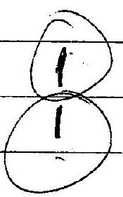
[5]
[5]
(e)

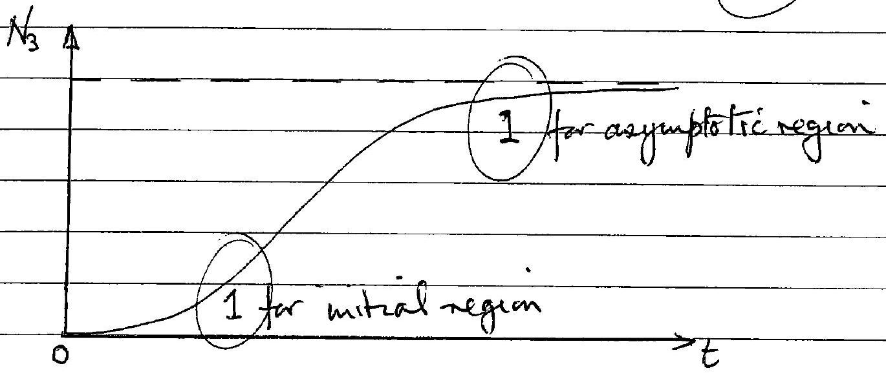
[2]

$$
N _ { 3 } = N _ { 0 } - N _ { 1 } - N _ { 2 }
$$

Q4

(i) Force on perticle is perpendicular to its displacement hence wark done is zero. Wark done in one revolution is zero. 1
(ii) Farce actung on particle $\frac { m s ^ { 2 } } { r }$ Dowards centre of curcle raduis $r$ The direction only varies unformly with time (1)
3) (1)
$$
\begin{aligned}
& v _ { x y } ^ { 2 } = u ^ { 2 } + v ^ { 2 } \\
& v _ { x y } = \sqrt { u ^ { 2 } + v ^ { 2 } }
\end{aligned}
$$
(ii) $$
\frac { z = w t } { m v _ { x y } ^ { 2 } 1 }
$$
(iii)
$$
\begin{aligned}
& r = m v _ { x y } / B Q \\
& r = \frac { m \sqrt { u ^ { 2 } + v ^ { 2 } } } { B Q }
\end{aligned}
$$
c) $$
\text { (i) } \begin{aligned}
T = \frac { 2 \pi } { \omega } & = \frac { 2 \pi r } { V _ { x y } } \\
\therefore T & = \frac { 2 \pi m } { B Q } \quad 1
\end{aligned}
$$
(ii) If Bincreases, from II, $r$ decreases and, frem III, T decreases [4]
(i) 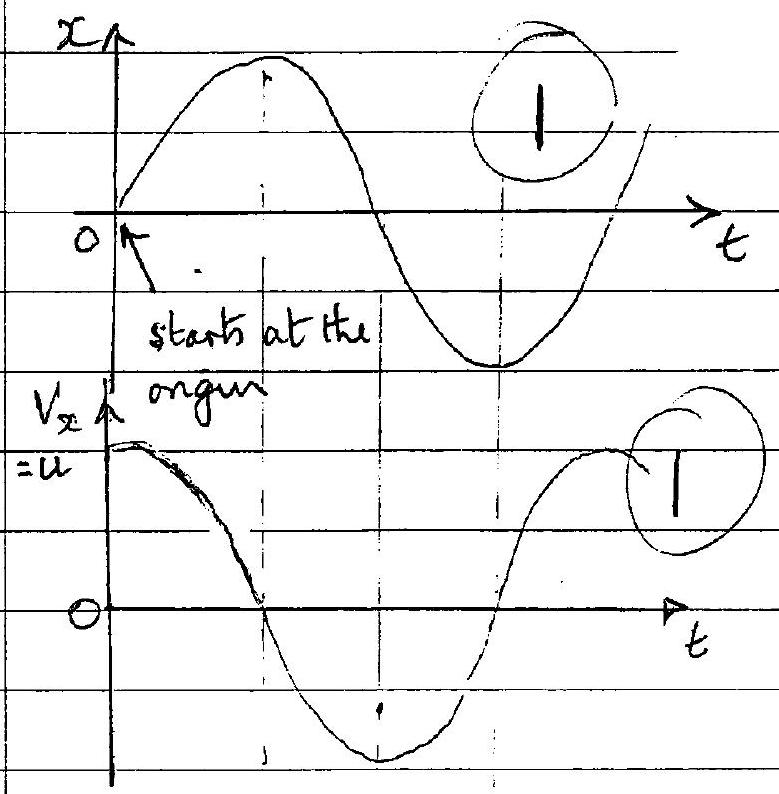

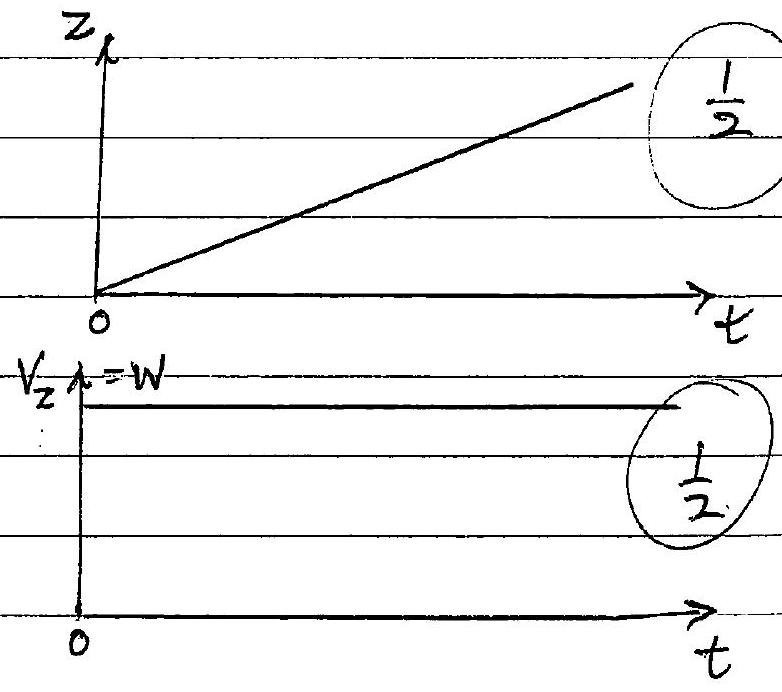

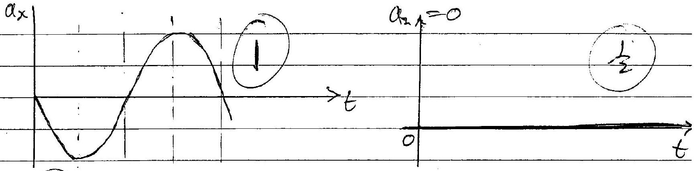
( $\frac { 1 } { 2 }$ wak for initial correct displacements $x = 0$ \& $z = 0$.
From II reversing $B$ will change the centre of rotation in th $x$-yplanefram $O$ to $O ^ { \prime }$ will the diagrain.! The motion along the $x \rightarrow$ direction will be unchanged. I
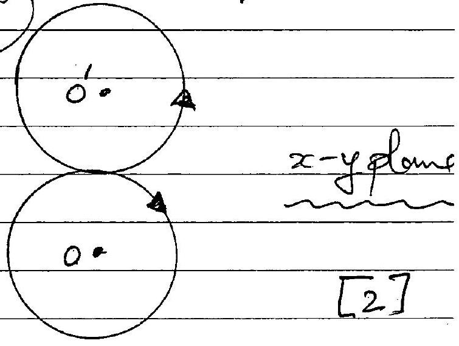

(i) Electrostatic potential at $O = - \frac { Q } { \left( 4 \pi \varepsilon _ { 0 } \right) 3 a } - \frac { Q } { \left( 4 \pi \varepsilon _ { 0 } \right) 3 a } = \frac { - 2 Q } { \left( 4 \pi \varepsilon _ { 0 } \right) 3 a }$
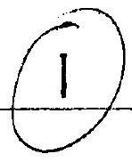
(ii) Let the point/s be at destance $x$ foom 0 , at $x$
Then
$$
\begin{aligned}
- \frac { 2 Q } { \left( 4 \pi \varepsilon _ { 0 } \right) 3 a } & = \frac { - Q } { 4 \pi \varepsilon _ { 0 } ( x - 3 a ) } + \frac { - Q } { 4 \pi \varepsilon _ { 0 } ( x + 3 a ) } ( 1 ) \times ( x ) \\
& = \frac { - 2 x Q } { 4 \pi \varepsilon _ { 0 } \left( x ^ { 2 } - 9 a ^ { 2 } \right) }
\end{aligned}
$$
Hence
$$
\begin{aligned}
& x ^ { 2 } - 9 a ^ { 2 } = 3 x a \\
& x ^ { 2 } - 3 x a - 9 a ^ { 2 } = 0 \\
& x = \frac { 1 } { 2 } \left[ 3 a \pm \sqrt { 9 a ^ { 2 } + 4.9 a ^ { 2 } } \right] = \frac { 3 a } { 2 } [ 1 \pm \sqrt { 5 } ]
\end{aligned}
$$
Negative value correspands to point inside sphere where equation no valid. There are thus liso boints at destance from 0 of.
$$
x = \frac { 3 a } { 2 } [ 1 + \sqrt { 5 } ] \quad \text { to left and right of } 0 !
$$
(iii) 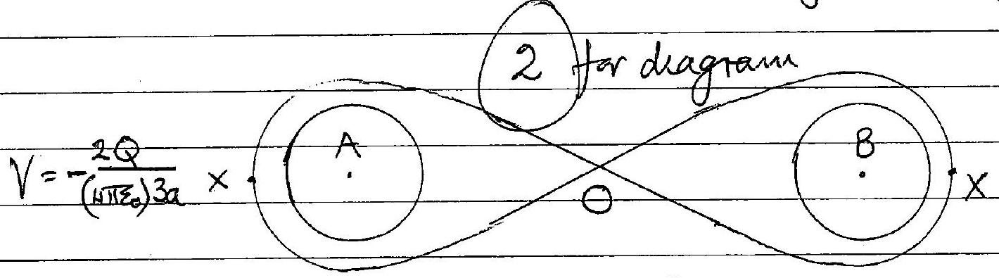
(i) Point $P$ has heghest potential
$$
\begin{aligned}
& V _ { H } = - \frac { Q } { \left( 4 \pi \varepsilon _ { 0 } \right) 7 a } - \frac { Q } { \left( 4 \pi \varepsilon _ { 0 } \right) a } \\
& V _ { H } = - \frac { 8 Q } { \left( 4 \pi \varepsilon _ { 0 } \right) 7 a }
\end{aligned}
$$
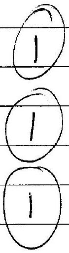
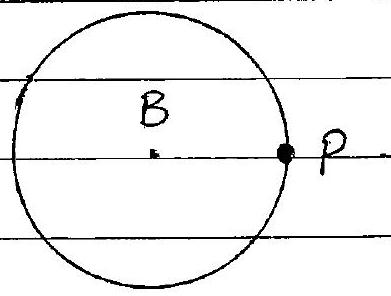
(ii) To reach A the portive charge must pass throngh the potential barrier given in (III). This is the lowest portuntial banier; $V - \frac { 2 Q } { 1 \left( 1 \pi I _ { 2 } \right) 3 }$
(iii) Minimin speed $v$ required by a charge $q$ at $P$ to overcome the barrier $V _ { h }$ is given by the conservation of evergy equation 1
$$
\begin{aligned}
\frac { 1 } { 2 } m v ^ { 2 } - \frac { 80 q } { \left( 4 \pi \varepsilon _ { 0 } \right) I _ { Q } } & = - \frac { 2 Q q } { \left( 4 \pi \varepsilon _ { 0 } \right) a ^ { 3 } } \\
v & = \sqrt { \frac { 20 } { 21 a } \frac { Q q } { \left( H \pi \varepsilon _ { 0 } \right) m } }
\end{aligned}
$$

c)

Resultant force $F$, is by symmetry vertically downwards. Usuig notation in duagrain and resolving vertically

$$
F = \frac { 2 Q _ { q } } { \left. \left( A ^ { 2 } \pi q ^ { 2 } \right) y ^ { 2 } + 9 \alpha ^ { 2 } \right) } \cos \theta
$$

$$
\begin{aligned}
& = \frac { 2 Q q } { \left( L N \varepsilon _ { 0 } \right) \left( y ^ { 2 } + 9 a ^ { 2 } \right) } + \sqrt { \left( y ^ { 2 } + 9 a ^ { 2 } \right) } \\
& F = \frac { 2 Q q y } { \left( 4 \pi \varepsilon _ { 0 } \right) \left( y ^ { 2 } + 9 a ^ { 2 } \right) ^ { 3 / 2 } }
\end{aligned}
$$

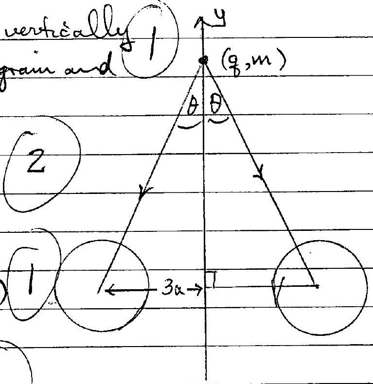

| ' | 1 | (1) |
| :--- | :--- | :--- |
| (1) | 2 | (1) |
| (11) | 4 | 2 |
| (III) | 4 |  |

[4]
(i) $D = a$
(ii) $D = \sqrt { \left( \frac { 1 } { 2 } a , + \left( \frac { 1 } { 2 } a \right) ^ { 2 } + \left( \frac { 1 } { 2 } a \right) ^ { 2 } \right.} = a \frac { \sqrt { 3 } } { 2 }$

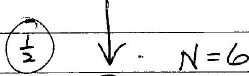
(2)

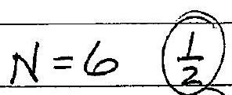
(i) $\quad N = 8$

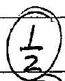
(1)

(iii) $D = \sqrt { \left( \frac { 1 } { 2 } a \right) ^ { 2 } + \left( \frac { 1 } { 2 } a \right) ^ { 2 } } = a \frac { \sqrt { 2 } } { 2 }$
(iii) $D = \sqrt { \left( \frac { 1 } { 2 } a \right) ^ { 2 } + \left( \frac { 1 } { 2 } a \right) ^ { 2 } } = a \frac { \sqrt { 2 } } { 2 }$

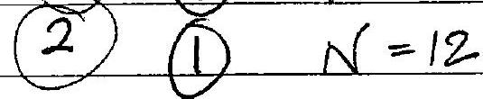
(2)

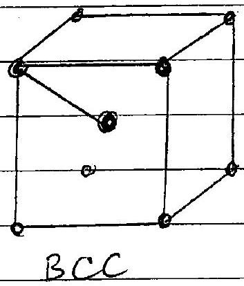
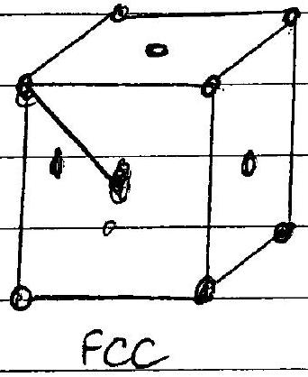
[8]
(1) Path difference $( A B C ) = 2 d \sin \theta 2$ (unst show geometric proof)
(ii) $\quad 2 d \sin ^ { 2 } \theta = n \lambda$
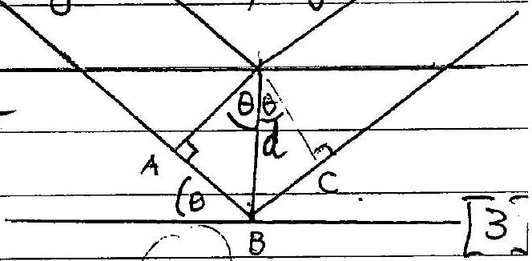
(i) $\quad 2 d \sin ^ { 2 } \theta _ { 0 } = \lambda \quad ($ case $n = 1 )$
Now $\quad d = a = 5.0 \times 10 ^ { - 10 } \mathrm {~m}$
Substituting $\lambda = 1.24 \times 10 ^ { - 10 } \mathrm {~m}$ into formula for $\theta _ { 0 }$

$$
\begin{align*}
\sin \theta _ { 0 } & = \frac { 1.24 \times 10 ^ { - 10 } } { 10 ^ { - 9 } } = 0.124 \\
\theta _ { 0 } & = 7.1 ^ { \circ } \tag{1.}
\end{align*}
$$

(ii) Highest order of diffraction occoss when $\frac { m \lambda } { 2 d }$ just less than inax. value of $\sin \theta$, which is 11 .
As $\left( \frac { \lambda } { 2 d } \right) = 0.124$ this accurs when $n = 8$, guring $\frac { \lambda } { 2 d } = 0.99$ This occurs for

$$
\begin{aligned}
\sin \theta _ { H } & = 0.992 \\
\theta _ { H } & = 82.7 ^ { \circ }
\end{aligned}
$$

a) (i) Rest energy is itse energy when $p = 0$
$$
E _ { \text {rest } } = m _ { e } c ^ { 2 }
$$
(ii) The knetic energy $T$ is $E$-Erest thus
$$
T = \sqrt { \phi ^ { 2 } c ^ { 2 } + m _ { e } ^ { 2 } c ^ { 4 } } - m _ { e } c ^ { 2 }
$$

b) (1) bonservation equations
Hom zontal momentum: $\quad \phi \cos \theta = \bar { c } \quad \hat { f }$
Versical momentom: $\phi \operatorname { sen } \theta = \frac { h t } { c }$ (2) (II) hf
Energy equation:
$$
h f + m _ { e } c ^ { 2 } = \sqrt { p ^ { 2 } c ^ { 2 } + m _ { e } ^ { 2 } c ^ { 4 } } + h f ^ { \prime } \text { (3) III }
$$
(11) Squaring and adding (I) ad II, using $\sin ^ { 2 } \theta + \cos ^ { 2 } \theta = 1$,
$$
\begin{aligned}
& p ^ { 2 } = \left( \frac { h } { c } \right) ^ { 2 } \left( f ^ { 2 } + f ^ { \prime 2 } \right) \\
& c ^ { 2 } p ^ { 2 } = h ^ { 2 } \left( f ^ { 2 } + f ^ { \prime 2 } \right)
\end{aligned}
$$
From III
Synaming,
From (IV)
$$
\begin{aligned}
h \left( f - f ^ { \prime } \right) + m _ { e } c ^ { 2 } & = \sqrt { p ^ { 2 } c ^ { 2 } + m _ { e } ^ { 2 } c ^ { 4 } } \\
{ \left[ h \left( f - f ^ { \prime } \right) + m _ { e } c ^ { 2 } \right] ^ { 2 } } & = p ^ { 2 } c ^ { 2 } + m _ { e } ^ { 2 } c ^ { 4 } \\
& = h ^ { 2 } \left( f ^ { 2 } + f ^ { \prime 2 } \right) + m _ { e } ^ { 2 } c ^ { 4 }
\end{aligned}
$$
Exponding LHS,
bancelling.
$$
\begin{array} { r }
h ^ { 2 } \left( f ^ { 2 } + f ^ { \prime 2 } + 2 f f ^ { \prime } \right) + \left( m _ { e } ^ { 2 } c ^ { 4 } \right) + 2 m _ { e } c ^ { 2 } h ( f ) \\
- 2 f f ^ { \prime } h ^ { 2 } + 2 m _ { e } c ^ { 2 } h \left( f - f ^ { \prime } \right) = 0 \\
- f ^ { \prime } \left( f h + m _ { e } c ^ { 2 } \right) + m _ { e } c ^ { 2 } f = 0 \\
f ^ { \prime } = \left( \frac { f f + m _ { e } c ^ { 2 } } { m _ { e } c ^ { 2 } } \right) ^ { - 1 } f \\
f ^ { \prime } = \left( 1 + \frac { h f } { m _ { e } c ^ { 2 } } \right) ^ { - 1 } f
\end{array}
$$

When $f f \ll m e c ^ { 2 }$ equation (V) gives

$$
f = f ^ { \prime }
$$

From equations (I) and (I)

$$
\begin{aligned}
\tan \theta & = \frac { \sin \theta } { \cos \theta } = \frac { f ^ { \prime } } { f } = 1 \\
\therefore \theta & = 45 ^ { \circ }
\end{aligned}
$$

$$
\text { (1) } \left( \text { as } f = f ^ { \prime } \text { above } \right)
$$

Equation (IV) gives

$$
\phi = \sqrt { 2 } \quad \frac { h f } { c }
$$

1) as $f = f ^ { \prime }$

(1) Diameter of Venus shadow $4.0 \mathrm {~mm} \pm 0.5 \mathrm {~mm}$

Diamieter of Sinv

$$
140 \mathrm {~mm} \pm 15 \mathrm {~mm} \text { (Note RicTREE DOES NOT SHOW }
$$

$$
\lambda = \left( \frac { 140 } { 4 } \right) ^ { 2 } = 1225 ( 1 ( A C C E P T - 700 \rightarrow 1600 )
$$

[ERROR CALCULATON NOT REQUIRED BY STODENT GIVES

$$
\frac { \Delta n } { \lambda } = 2 \left( \frac { 0.5 } { 4.0 } + \frac { 15 } { 140 } \right.
$$

$$
\sim 45 . \%
$$

Accepterrar in range $\pm 500$ to $\pm 200$ No marks for smaller ar larger enor
Sir diagram
(ii) Similar traingles and data from Table 8.1. give

$$
\begin{aligned}
\frac { x } { 12.1 \times 10 ^ { 6 } } & = \frac { 1.50 \times 10 ^ { 11 } } { ( 1.50 - 1.08 ) \times 10 ^ { 11 } } = \frac { 1.50 } { 0.42 } \\
x & = 12.1 \times 10 ^ { 6 } \left( \frac { 1.50 } { 0.42 } \right)
\end{aligned}
$$

∴ Radius of shadow $= 6.05 \times 10 ^ { 6 } \left( \frac { 1.52 } { 0.42 } \right)$
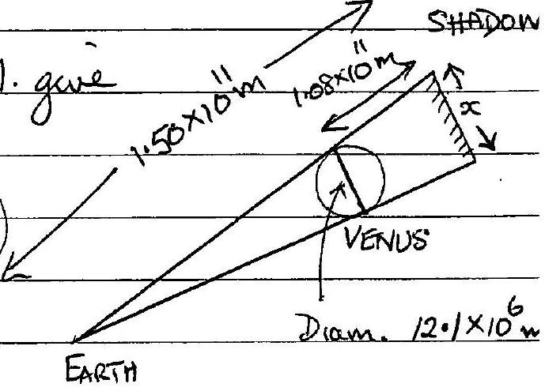
Giving

$$
\begin{aligned}
& \lambda = \left( \frac { 6.98 \times 10 ^ { 8 } } { 6.05 \times 10 ^ { 6 } } \right) \left( \frac { 0.42 } { 1.50 } \right) ^ { 2 } 1 \\
& \lambda = 1042
\end{aligned}
$$

$\left[ \begin{array} { l } \text { Error Calculation, not requered by sholent, gives } \\ \quad \frac { \Delta \lambda } { \lambda } = 2 \left[ \frac { 10 } { 6980 } + \frac { 10 } { 605 } + \frac { 1 } { 42 } + \frac { 1 } { 150 } \right] \sim 0.05 \end{array} \right.$

$$
]
$$

$\lambda = 1042 \pm 52$
ACCEST ANY GRROR IN RANGE
| For ERROR $25 \rightarrow 100$, NO MARKS OTTERWISE)
[6]
b)

$$
\text { (i) Relative angular velocity } \begin{aligned}
\omega & = \omega _ { V } - \omega _ { E } \\
& = 2 \pi \left( \frac { 1 } { T _ { V } } - \frac { 1 } { T _ { E } } \right) \\
& = 2 \pi \left( \frac { T _ { E } - T _ { V } } { T _ { E } T _ { V } } \right)
\end{aligned}
$$

Perods T

$$
\begin{aligned}
& \text { Sub } { } ^ { 9 } \cdot T _ { r } = 1.94 \times 10 ^ { 7 } \mathrm {~S} , T _ { E } = 3.16 \times 10 ^ { 7 } \mathrm {~S} \\
& \text { Relative percod } T = \frac { 2 \pi } { \omega } = \frac { T _ { E } T _ { r } } { T _ { E } - T _ { V } } = 5.02 \times 10 _ { \mathrm { S } } = 1.59 \mathrm { years } ^ { 1 }
\end{aligned}
$$

barrment: It is in fact unch longer ( $n 100$ years) due to $\left( \frac { 1 } { 2 } \right.$ puturbations broduced big other bodies in solar sustem

(ii) Augular diamiter of Sun at Earth
$$
\theta = \frac { 2 \times 6.96 \times 10 ^ { 8 } } { 1.50 \times 10 ^ { 11 } } = 9.28 \times 10 ^ { - 3 } \mathrm { rads } .
$$
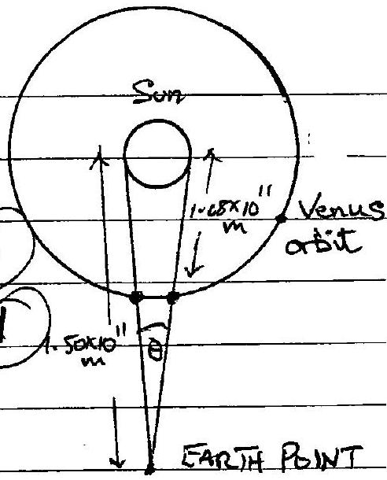
(i) Angle letween telesepes to observe skidpou of Venus cresseng Sun
$$
\begin{aligned}
& \phi \simeq \frac { \text { Diameter of Earth } } { \text { Det. Ogifh Fan Sun } } \\
& = \frac { 2 \times 6.33 ^ { 8 } \times 10 ^ { 6 } } { 1.50 \times 10 ^ { 11 } } \mathrm { rads } = 8.51 \times 10 ^ { - 5 } \mathrm { rad } \\
& \text { Either } \\
& = 4.87 \times 10 ^ { - 3 } \text { degrees } \\
& = 4.87 \times 10 ^ { - 3 } \text { degrees } \\
& = 4.87 \times 10 ^ { - 3 } \text { degrees } \\
& = 4.87 \times 10 ^ { - 3 } \text { depres }
\end{aligned}
$$
(ii) So that clocks could be synchronzed
(iii) In 18th century there was no unwersal time; different places had differmigtines. Then (C) (ii) was a way of synchonizing docks at two observatories.
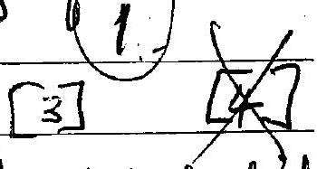
d) If during the initeral between tremiets remers her a velocity $v _ { s }$ perpendical to th orbit, and as a result is displaced by $\frac { 1 } { 2 } \left( 9.28 \times 10 ^ { - 3 } \right)$ rads. as observed form Earth (half ang. diam. of Sin at Earth), Venus will not pass in frent of the Sun.
$$
4.64 \times 10 ^ { - 3 } \text { rads. in } 5.02 \times 10 ^ { 7 } \mathrm {~s}
$$
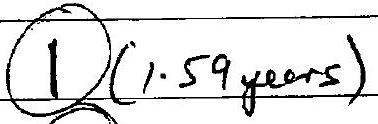
Le
$$
\left( 4 ^ { 64 } \times 10 ^ { - 3 } \right) \left( 0.42 \times 10 ^ { 11 } \right) \mathrm { m } \quad \mathrm {~m} ^ { - 3 } \quad 5.02 \times 10 ^ { 7 } \mathrm {~s} .
$$
The speed
$$
\begin{aligned}
V _ { s } & = \left( \frac { 4.64 \times 10 ^ { - 3 } \times 0.42 \times 10 ^ { 11 } } { 5.02 \times 10 ^ { 7 } } \right) \mathrm { ms } ^ { - 1 } ( 1 ) \\
& = 3.9 \mathrm {~ms} ^ { - 1 }
\end{aligned}
$$

(i) 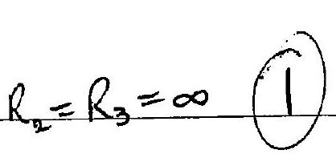
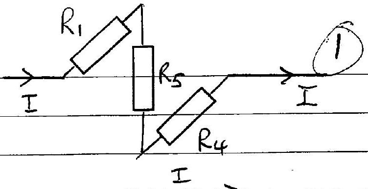
(ii) $R _ { 2 } = R _ { 3 } = 0$
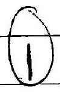
(iii) A balanced wheatstone bondge, $R _ { 1 } R _ { 4 } = R _ { 2 } R _ { 3 }$ Dill produce a circuit with $\left( R _ { 2 } + R _ { 3 } \right)$ in parallel with $\left( R _ { 2 } + R _ { 4 } \right)$. A sumple pair of values for $R _ { 2 }$ and $R _ { 3 }$ is $R _ { 2 } = R _ { 1 }$ and $R _ { 3 } = R _ { 4 }$ Any other suritable set safisfying $R _ { 1 } R _ { 4 } = R _ { 2 } R _ { 3 }$ is acceptable * Note: mo current flows thom gh $R _ { 5 }$ for balanced bridge 1 caddition we nequre $R _ { 1 } + R _ { 3 } = R _ { 2 } - R _ { 4 }$. i only solu. Satisfying both entiture in $R _ { 2 } = R _ { 1 } \& R _ { 3 } = R _ { 4 }$.
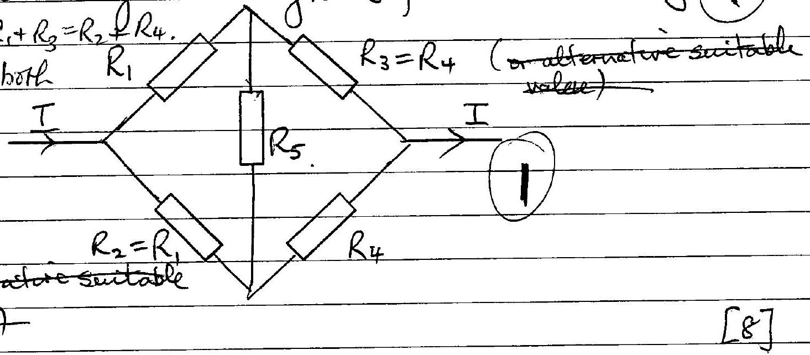
b 1 (1)
(i) $\begin{aligned} & R = R _ { 1 } + R _ { 5 } + R _ { 4 } \\ & \text { (ii) } R = \left( \frac { 1 } { R _ { 1 } } + \frac { 1 } { R _ { 5 } } + \frac { 1 } { R _ { 4 } } \right) ^ { - 1 } \end{aligned}$
(iii)
$$
\begin{array} { r l r }
R & = \left( \frac { 1 } { R _ { 1 } + R _ { 4 } } + \frac { 1 } { R _ { 1 } + R _ { 4 } } \right) ^ { - 1 } & \text { Gor any acceptable } \\
& = \frac { 1 } { 2 } \left( R _ { 1 } + R _ { 4 } \right) & \text { ältenatire for } R _ { 2 } \& R _ { 3 }
\end{array}
$$
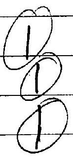
2(1)
(ii) $P _ { 5 } = I ^ { 2 } \left( \frac { 1 } { R _ { 1 } } + \frac { 1 } { R _ { 5 } } + \frac { 1 } { R _ { 4 } } \right) ^ { 2 } \frac { 1 } { R _ { 5 } }$
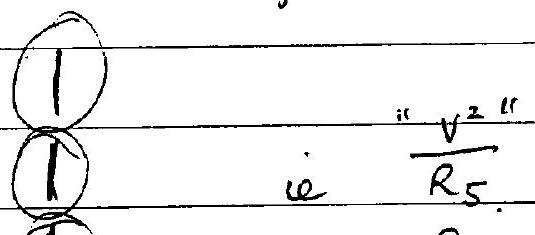
(III) $\frac { P _ { 5 } } { P _ { 5 } } = 0$

(1) no aurrent through $R _ { 5 }$.

(i) By symmetry, the circuit is dentical to that obtained by reflecting about the dragonal $A C$. Thus $V _ { B } = V$; potentials at Bard D dientical
(ii) There are serval different methods of solution.

Sohtain 1
Reverseng the currents produces an deutical circuit. Houpever aurents in OD and OB have changed direction. Since forth circuits are identical, (hese current must be zero; their oat some potential as Band D. Thes currents by symmetry, feir ARC toc and $A B C$ most be equal each being $\frac { 1 } { 3 } I$. Total resestence of 3 parallel resistors, resestance $r + r = 2 r$,

$$
\begin{aligned}
& R = \left( \frac { 1 } { 2 r } + \frac { 1 } { 2 r } + \frac { 1 } { 2 r } \right) ^ { - 1 } \\
& R = \frac { 2 r } { 3 }
\end{aligned}
$$

Solution 2
If only Band D are assumed to be at the same potential. Then $A D$ in parallel with $A B$; Trad fance $\frac { \Gamma } { 2 }$ Do wi parallel with $O B$; total resolance $\frac { \Gamma } { 2 }$ DC in parallel with BC; total vessetance $\frac { 1 } { 2 }$
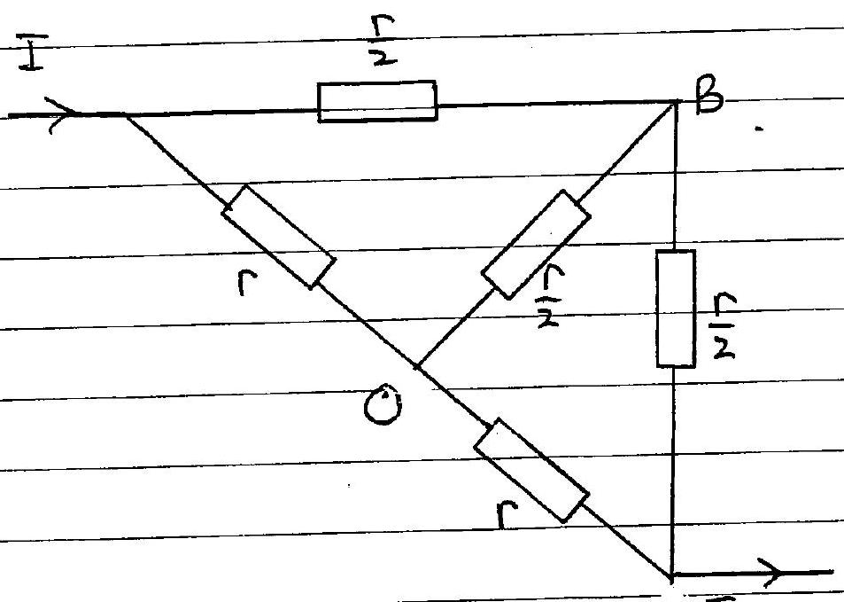

Tun is a bolanced wheatstone I bridge with no current tho' O Total resistance $( r + r )$ in parallel with $\left( \frac { r } { 2 } + \frac { r } { 2 } \right)$

$$
R = \left( \frac { 1 } { 2 r } + \frac { 1 } { r } \right) ^ { - 1 } = \frac { 2 r } { 3 }
$$
