(a) Sonution

2006 PAPER 2

(i) For the system of six cubes
$$
\begin{aligned}
& F = 6 \mathrm { ma } \\
& a = \frac { F } { 6 \mathrm {~m} }
\end{aligned}
$$
$a =$ acceleration $\left[ \frac { 1 } { 2 } \right]$
Acceleratin of each aube is $a = \frac { F } { 6 m }$
Acceleratin of each aube is $\quad a = \frac { F } { 6 m }$
and on system of sit cube $\left[ \frac { 1 } { 2 } \right]$
(ii) Resultunt farce on each cube $= m a = \frac { F } { 6 }$

(iii) For cube 1, $F \rightarrow \left[ 1 e _ { R _ { 21 } } \right.$

$$
\begin{aligned}
F - R _ { 21 } & = m a \\
R _ { 21 } & = F - m a = 6 m a - m a \\
R _ { 21 } & = 5 m a
\end{aligned}
$$

Far aube 2, $\overrightarrow { R _ { 12 } } \quad 2 \quad \leftarrow R _ { 32 }$

$$
\begin{aligned}
R _ { 12 } - R _ { 32 } & = m a \\
R _ { 32 } & = - m a + R _ { 12 } \\
& = 4 \mathrm { ma }
\end{aligned}
$$

as $R _ { 12 } = R _ { 21 }$ $\left[ 1 \frac { 1 } { 2 } \right.$.
For cube 3,

$$
\begin{aligned}
R _ { 23 } - R _ { 43 } & = m a \\
R _ { 43 } & = R _ { 23 } - m a \\
& = 4 m a - m a \\
& = 3 m a
\end{aligned}
$$

For cube 4

$$
\begin{aligned}
R _ { 44 } - R _ { 54 } & = m a & & \vec { R } _ { 34 } \\
R _ { 54 } & = R _ { 34 } - m a & \leftarrow R _ { 54 } & \\
& = 3 m a - m a & & \text { as } R _ { 34 } = R _ { 43 } \\
R _ { 45 } = R _ { 54 } & = 2 m a & = \frac { 1 } { 3 } F &
\end{aligned}
$$

$[ [ 4 ] ]$
Allenatively starting form sexth cube

$$
\left. \begin{array} { r l }
R _ { 56 } & = m a \\
R _ { 45 } - R _ { 65 } & = m a
\end{array} \quad R _ { 45 } = R _ { 54 } = 2 \mathrm { ma } = \frac { 1 } { 3 \mathrm {~F} } \right\} = \left[ \frac { 1 } { 2 } + 1 \right]
$$

Sharter: Consider logether last two Blocks

$$
\left. R _ { 45 } = ( 2 m ) \frac { F } { 6 m } = \frac { F } { 3 } \ldots \right\rvert \, \left[ 1 \frac { 1 } { 2 } \right]
$$

## Solution

1(b) The total resis. of 3 reserstor in parallel on $\mathrm { AHS } = \left( \frac { 1 } { r } + \frac { 1 } { r } + \frac { 1 } { r } \right) ^ { - 1 } = \frac { r } { 3 }$ Total resis. of 2 sesitors in parallel on RHS $= \left( \frac { 1 } { r } + \frac { 1 } { r } \right) ^ { - 1 } = \frac { r } { 2 }$ Circuit reduces to
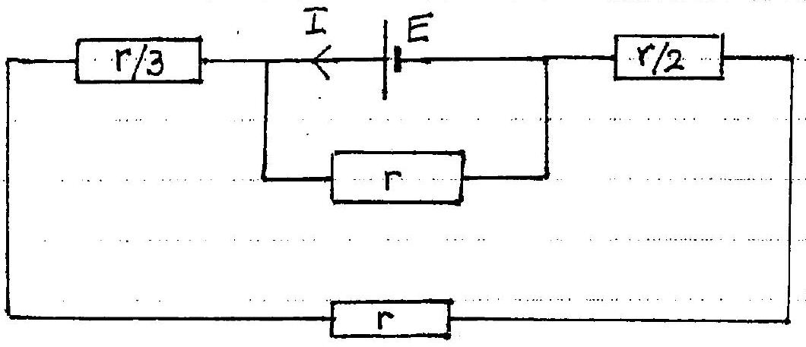

$$
\left( \frac { r } { 3 } + \frac { r } { 2 } + r = \frac { 11 } { 6 } r \right)
$$

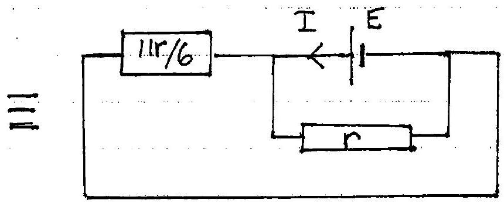

$$
\left( \frac { 6 } { 11 r } + \frac { 1 } { r } \right) ^ { - 1 } = \frac { 11 } { 17 } r \quad \left[ \frac { 1 } { 2 } \right]
$$

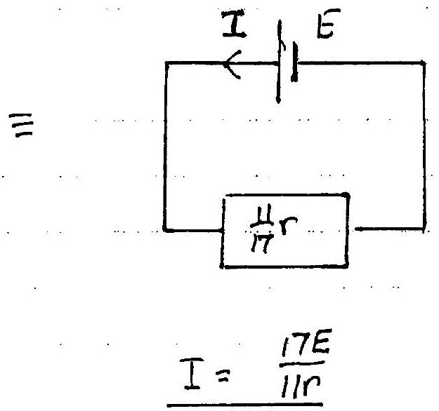

$$
\left[ \frac { 1 } { 2 } \right]
$$

Contre of Gravity Question
I(c)
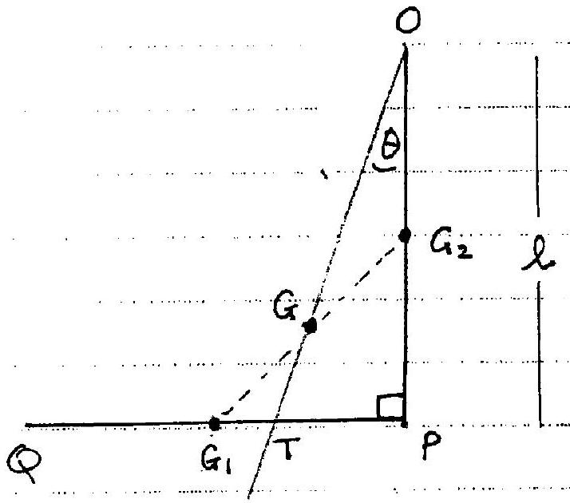
(1) $G$ mil way between $G _ { 1 }$ and $G _ { 2 }$, the centres of gravity of molvidual codds. Check measurement that $G$ und way beliven $G _ { 1 }$ and $G _ { 2 }$ at destance $0.35 l$ from $G _ { 1 }$ or $G _ { 2 }$ te $\frac { 1 } { 4 } l \sqrt { 2 }$
(N) Angle between vertical $O G$ and $O P$, $\theta$, required. $\theta$ can be obtained using try. in right angled triangle OPT by measureng two sides of AOPT

Method ⟶ [1]
Conrect measurements of the two sedes and correct Fig. formula [T] Correct angle $\theta = 18.4 ^ { \circ } \pm 0.4 ^ { \circ }$ aceptable
(Partial make for aungle in range $17.5 ^ { \circ } - 17.9 ^ { \circ }$ a $18.9 ^ { \circ } - 19.3 ^ { \circ } \quad \left[ \frac { 1 } { 2 } \right]$ )
TOTAL $[ [ + ] ] ^ { - }$

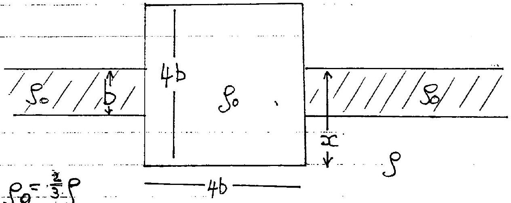

Let $x$ be the height of the oil surface above the bottom If the stick.
Weight of stick $W = ( 4 b \times 4 b ) \log g \quad$ where l length of stick (1) (1)
Upthreat on stack $U = ( 4 b ) b l \rho _ { 0 } g + ( x - b ) ( 4 b ) l \rho g$ [2

Equating, $W = U$, for equilibrium

$$
\begin{equation*}
( 4 b \times 4 b ) l \rho \circ g = ( 4 b ) b l \rho g + ( x - b ) ( 4 b ) l \rho g \tag{1}
\end{equation*}
$$

$$
\begin{align*}
4 b \rho _ { 0 } & = b \rho _ { 0 } + ( x - b ) \rho  \tag{1}\\
3 b \rho _ { 0 } & = ( x - b ) \rho \tag{1}
\end{align*}
$$

Fraction munersed F given by

$$
\begin{align*}
F & = \frac { x } { 4 b }  \tag{1}\\
& = - \frac { 3 } { 4 } f _ { 0 } + \frac { 1 } { 4 }
\end{align*}
$$

Substituting $\rho = \frac { 2 } { 3 } \rho _ { 0 }$

$$
\begin{equation*}
F = \frac { 1 } { 2 } + \frac { 1 } { 4 } = \frac { 3 } { 4 } \tag{1}
\end{equation*}
$$

(1) The acceleration, a, produced by the Sun on the Earth and a mass in free foll is gives by $a = R _ { S E } \omega ^ { 2 }$ Where is a the cingular poquency of the Earth about this $S _ { 0 }$ Consequently, relative to the Earth, there is no netacceleration on the inass in free for only one shodent paduced this correct answer. Nost smants altempted to cultudate $c _ { 4 }$ - a. We dicalid to que 3 manks for a correct calculation useng the data provided (mote: Ms not queen)
balculation:
$$
\begin{align*}
a & = R _ { S E } \omega ^ { 2 } = \frac { 4 \pi ^ { 2 } } { \pi ^ { 2 } } R _ { S E }  \tag{2}\\
& = \frac { 4 \pi ^ { 2 } \left( 1.5 \times 10 ^ { 10 } \right) ^ { 2 } } { ( 365 \times 24 \times 60 \times 60 ) ^ { 2 } } = 6.0 \times 10 ^ { - 3 } \mathrm {~ms} ^ { - 2 } \tag{1}
\end{align*}
$$
(ii) Energy required for a mansto jump 1 m on Ecoth is ing $J$. Escape energy from a spherical GMm Gody rackies $r$, mass $M$, forman mans in is $\frac { \text { GMm } } { r }$
$$
\begin{equation*}
m g h = \frac { G M m } { r } \tag{1}
\end{equation*}
$$
$$
\begin{equation*}
g h = \frac { G M } { r } \tag{t}
\end{equation*}
$$
On Eurth g guemby
$$
\begin{equation*}
g = \frac { G M _ { E } } { R _ { E } ^ { 2 } } \tag{B}
\end{equation*}
$$
From (A) and (B)
$$
\begin{equation*}
r = \frac { M } { M _ { E } } \frac { R _ { E } ^ { 2 } } { h } \tag{c}
\end{equation*}
$$
Sub ${ } ^ { 9 } \quad h = 1 m$ and $\frac { M } { M _ { E } } = \frac { r ^ { 3 } } { R _ { E } ^ { 3 } }$ in (c) assenning same uniform density
$$
\begin{array} { l l }
r _ { u } b ^ { 9 } = R _ { E } h = R _ { E } \quad \text { as } h = 1 \\
R _ { E } = 6.38 \times 10 ^ { 6 } \mathrm {~m} , \quad r = 2.53 \mathrm {~km} \tag{1}
\end{array}
$$
[C6]
(iii) Rate of working $W =$ (keath/sec) $($ vol. of blood $/ \mathrm { sec } ) ($ pressure $) \left[ \frac { 1 } { 2 } + \frac { 1 } { 2 } + \frac { 1 } { 2 } = \frac { 3 } { 2 } \right]$
$$
\begin{aligned}
& = \left( \frac { 72 } { 60 } \right) \left( 7.5 \times 10 ^ { - 5 } \right) \left( 19 \times 10 ^ { 3 } \right) \\
& = 1.7 \mathrm {~W}
\end{aligned}
$$
$$
\frac { \left[ \frac { 1 } { 2 } \right] } { [ [ 2 , ] ] }
$$

又 1 (f)
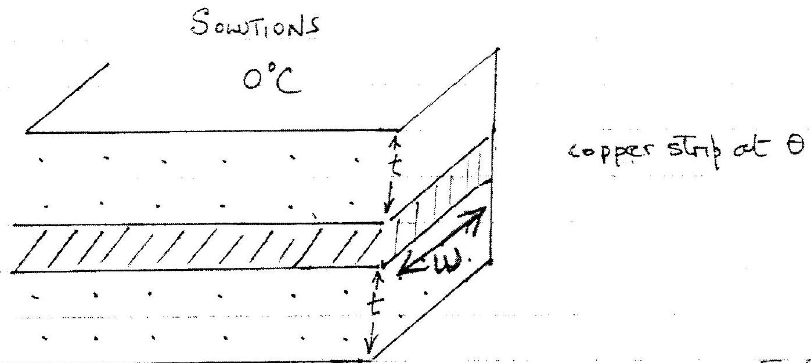
(2) Thet have the $0 ^ { \circ } \mathrm { C }$
[4]

(i) bonseder the flow of heat from the copper strip through the insulating sheets. Heat, H, produced by current I, per unit length, is given by
(1)
$$
\begin{equation*}
H = I ^ { 2 } R = I ^ { 2 } a ( 1 + b \theta ) \tag{A}
\end{equation*}
$$
(ii) In a steady state, constat temp gradient, $\tan \theta$ to $0 ^ { \circ } \mathrm { C }$. Heat conductio equation ques
$$
\begin{equation*}
H = 2 \mathrm { kw } \frac { \theta } { t } \tag{2facesofst-ip}
\end{equation*}
$$
Equating (A) and (B)
$$
\begin{align*}
I ^ { 2 } a ( 1 + b \theta ) & = 2 k w \frac { \theta } { t }  \tag{7}\\
1 + b \theta & = \frac { 2 k w } { I ^ { 2 } a t } \\
\theta \left( \frac { 2 k w } { \left. I ^ { 2 } a t - b \right) } \right. & = 1 \\
\theta & = \left( \frac { 2 k w } { I ^ { 2 } a t } - b \right) ^ { - 1 }
\end{align*}
$$
Thes $\theta \rightarrow \infty$ when Critical merent
$$
\begin{align*}
\frac { 2 k \omega } { I ^ { 2 } a t } & \rightarrow b  \tag{1}\\
I _ { c } & = \sqrt { \frac { 2 k \omega } { b a t } }
\end{align*}
$$
\}
(iii)
$$
\begin{align*}
I _ { c } & = \sqrt { \frac { 2 \left( 1.30 \times 10 ^ { - 1 } \right) \left( 5.00 \times 10 ^ { - 3 } \right) } { \left( 4.3 \times 10 ^ { - 3 } \right) \left( 2.2 \times 10 ^ { - 2 } \right) \left( 1 \times 10 ^ { - 3 } \right) } }  \tag{1}\\
& = 120 \mathrm {~A} \tag{1}
\end{align*}
$$

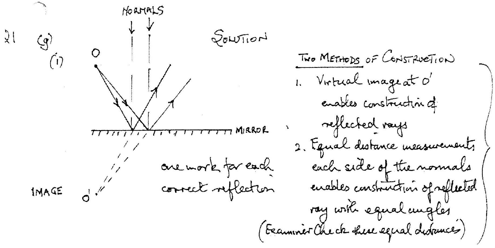
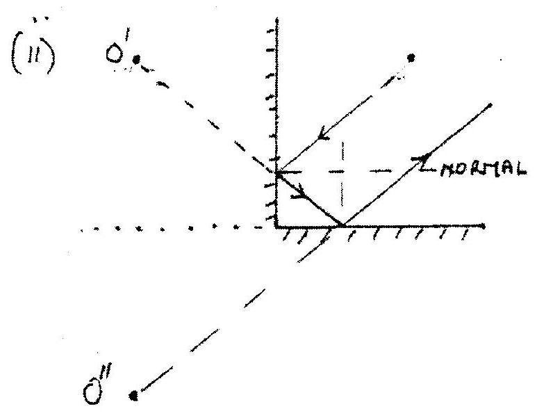

Two Methods of Construction

1. Virtual image detard at o'audo"
2. Check squal dstance method from NERMAL FOR BOTER REALETIONS

One make for each correct reflection
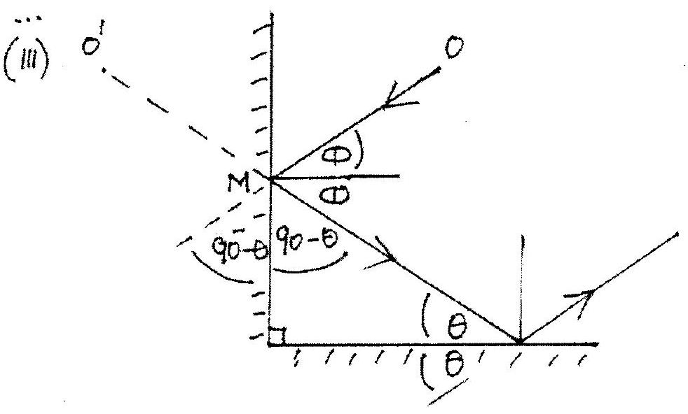

Correct Diagram

$$
\begin{equation*}
21 ( h ) \tag{1}
\end{equation*}
$$

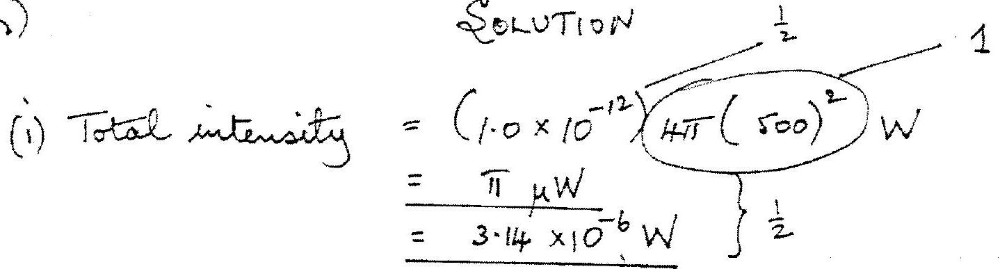
[H]
(ii) The recultant wave form is the sum of the teso wave forms
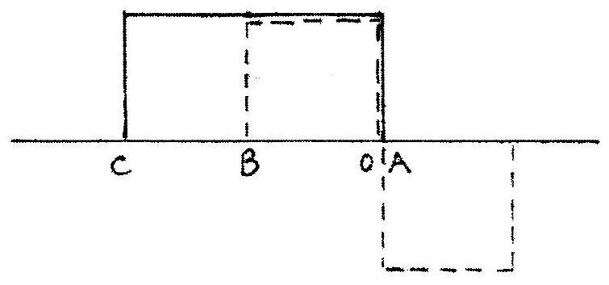
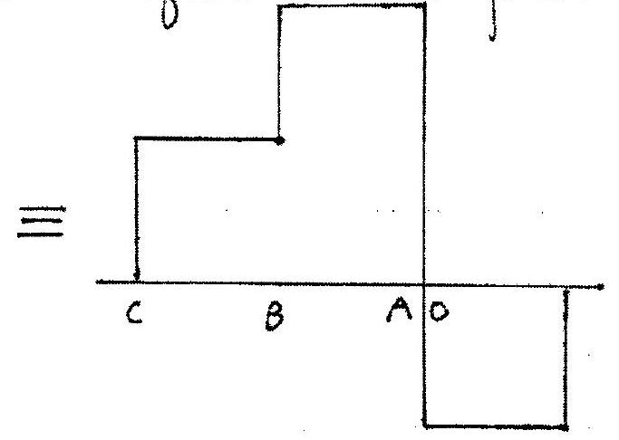
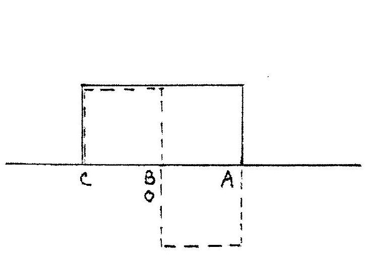
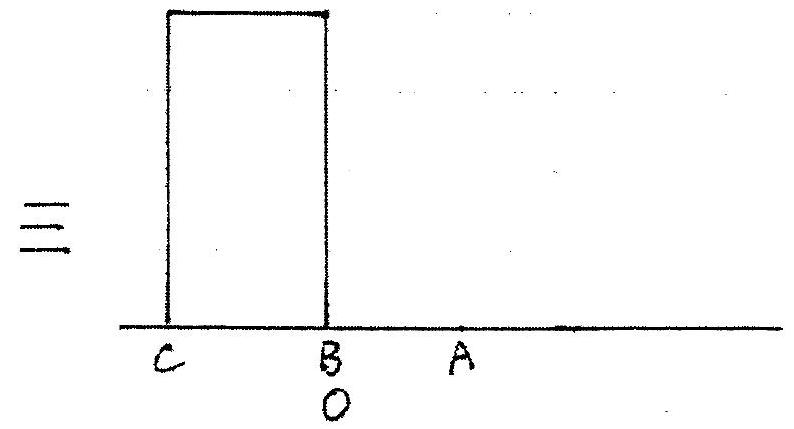
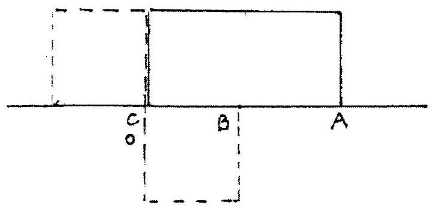
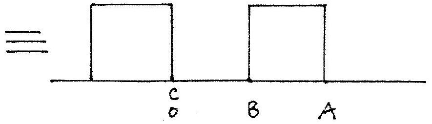

(i) Let car be travelleng hougarially at $\mathrm { rms } ^ { - 1 }$. Then relative to the car the wellowity of the mainp. is obtained by adding $v _ { r }$ and $( - \underline { v } )$

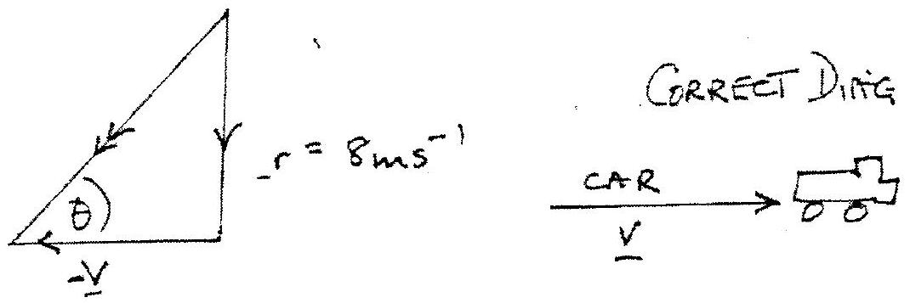
In dragram $\theta$ required angle

$$
\begin{aligned}
\tan \theta & = \frac { V _ { r } } { V } = \frac { 8 } { V } \\
\therefore \tan 30 ^ { \circ } & = \frac { 8 } { V } \\
V & = 8 \cot 30 ^ { \circ } \\
V & = 13.86 \mathrm {~ms} ^ { - 1 }
\end{aligned}
$$

[[3i ]]

(ii) If sistle reaction on the car
$$
\frac { m v ^ { 2 } } { R } = m g - s
$$
Max. $v$ occurs when $s = 0$
$$
\begin{aligned}
v ^ { 2 } & = g R \\
& = ( 9.81 ) 40 \\
v & = 19.8 \mathrm {~ms} ^ { - 1 }
\end{aligned}
$$
(iii) Loss in PE $\equiv$ Loss of PE. in 25 m of rope decending 20 m
$$
\begin{aligned}
& = \left[ \left( \frac { 25 } { 45 } \right) 15 \right] \mathrm { g } ( 20 ) \\
& = \frac { 500 } { 3 } \mathrm {~g}
\end{aligned}
$$
Using conservation of evergy, with speedv,
$$
\begin{aligned}
\frac { 1 } { 2 } m v ^ { 2 } & = m ^ { \prime } g h ^ { \prime \prime } \\
\frac { 1 } { 2 } ( 15 ) v ^ { 2 } & = \frac { 500 } { 3 } g = \frac { 500 } { 3 } ( 9.81 ) \\
\therefore v & = 14.8 \mathrm {~ms} ^ { - 1 }
\end{aligned}
$$
where $m = 15 \mathrm {~kg}$
$$
\left. \rightarrow \left[ \frac { 1 } { 2 } \right] \right\} \frac { [ 1 ] } { [ [ 4 ] ] }
$$
Dombling the mass of rope does not change $V$
TOTAL
$[ [ 10 ] ]$

| Mass dieference | $= ( 235.04 + 1.01 ) - ( 140.91 + 91.91 + 3 \times 1.01 ) u$ |
| :--- | :--- |
|  | $= 0.20 u$ |

| Energy released $= 0.20 \times 931 = 186.20 \mathrm { MeV }$ | $\left[ \frac { 1 } { 2 } \right]$ |
| :--- | :--- |

$235.04 \times 10 ^ { - 3 } \mathrm {~kg}$ of $U _ { 92 } ^ { 235 }$ containio $6.02 \times 10 ^ { 23 }$ atoms
10 kg of $U _ { 92 } ^ { 235 }$ centanis $\frac { 10 \times 6.02 \times 10 ^ { 23 } } { 235.04 \times 10 ^ { - 3 } }$ atoms

$$
= 2.56 \times 10 ^ { 25 } \text { atoms }
$$

Ehergy released by 10 kg of

$$
\begin{aligned}
U _ { 92 } ^ { 235 } & = 2.56 \times 10 ^ { 25 } \times 186.2 \mathrm { MeV } \\
& = 4.77 \times 10 ^ { 27 } \mathrm { MeV }
\end{aligned}
$$

$[ [ 4 ]$

$$
\begin{aligned}
& 4.77 \times 10 ^ { 27 } \times 10 ^ { 6 } \mathrm { eV } = 1.6 \times 10 ^ { - 19 } \mathrm {~J} , \\
& 4.77 \times 1.6 \times 10 ^ { 33 - 19 } \mathrm {~J} . \\
& 4.77 \times 1.6 \times 10 ^ { 14 } \mathrm {~J} .
\end{aligned}
$$

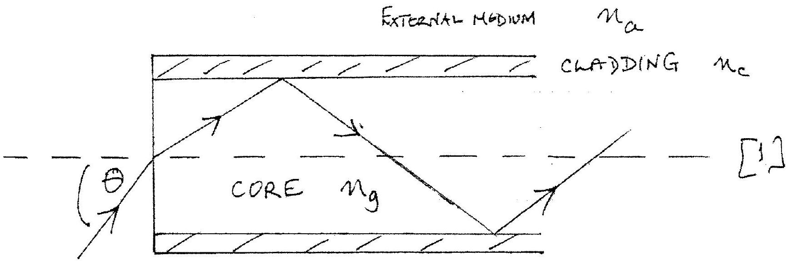

(i) Light to totally intenally reflected at the interface between. core and cladding ( $n _ { c } < n _ { g }$ ) wrth neghegable loss in intensity
(ii) If the angle of incidence at the $\left( u _ { c y } - u _ { g } \right)$ interface is less than that for total unternal irflection, the melensety is rapedly diminished due to refraction through the cladding. This limit the angle of madence, $\theta$, at the fubire face.

1 (m)

Solution 1 (m)
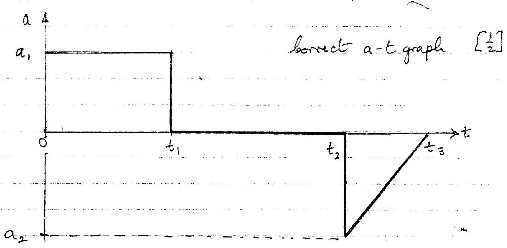

(ii)
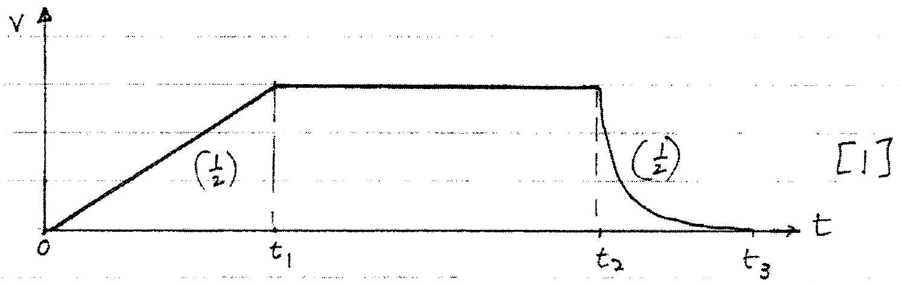

(iii)
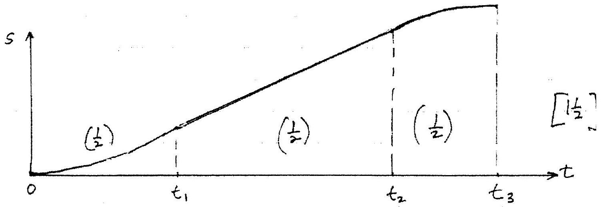

TOTAL[3]]

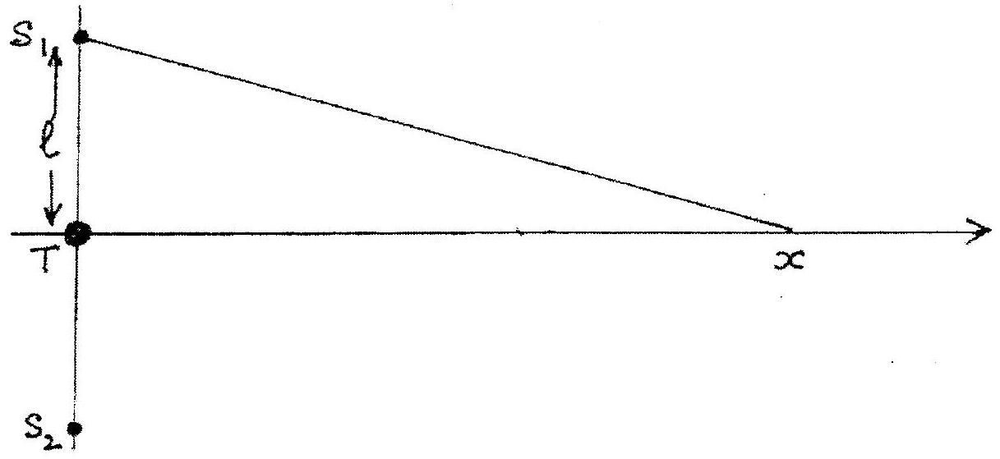
(a) (1) Path difference

$$
\begin{aligned}
\phi & = \sqrt { x ^ { 2 } + l ^ { 2 } } - x \\
& = x \left[ \left( 1 + \left( \frac { l } { x } \right) ^ { 2 } \right) ^ { \frac { 1 } { 2 } } - 1 \right] \\
& = x \left[ \frac { 1 } { 2 } \left( \frac { l } { x } \right) ^ { 2 } + \cdots \right] \\
& = \frac { x } { 2 } \left( \frac { l } { x } \right) ^ { 2 } \\
& = \frac { 1 } { 2 } \left( \frac { 1 } { 4 } \right) ^ { 2 } \frac { 1 } { x } \quad \text { as } l = \frac { 1 } { 4 } \\
& = \frac { 1 } { 32 } \frac { 1 } { x }
\end{aligned}
$$

(i) WEERT from top of mext page

エ $\times \frac { 1 } { r ^ { 2 } }$
(b) (1) Max occurs when

$$
\left. \begin{array} { r l }
\frac { 1 } { 32 } \frac { 1 } { x } & = \left( n + \frac { 1 } { 2 } \right) \lambda \\
o R \sqrt { x ^ { 2 } + l ^ { 2 } } - x & = \left( n + \frac { 1 } { 2 } \right) \lambda
\end{array} \right\}
$$

as $S _ { 1 }$ and $S _ { 2 } \pi$ out of phase with $T$
(ii) Mix - occurs when

$$
\left. \begin{array} { r l }
\frac { 1 } { 32 } \frac { 1 } { x } & = u \lambda \\
\text { or } \sqrt { x ^ { 2 } + l ^ { 2 } } - x & = u \lambda
\end{array} \right\}
$$

Now

$$
\lambda = \frac { c } { \nu } = \frac { 330 } { 200 \times 10 ^ { 3 } } = 1.65 \times 10 ^ { - 3 } \mathrm {~m}
$$

(iii) Max.when

$$
\frac { 1 } { 32 } \frac { 1 } { x } = \left( n + \frac { 1 } { 2 } \right) 1.65 \times 10 ^ { - 3 }
$$

$n = 0$ gives

$$
\begin{aligned}
& x = 37.9 \mathrm {~m} \\
& x = 12.6 \mathrm {~m}
\end{aligned}
$$

$n > 1$ gives $x < 10$ not required as $x \geqslant 10$
[1]
[1]

Min. when

$$
\frac { 1 } { 32 } \frac { 1 } { x } = n \left( 1.65 \times 10 ^ { - 3 } \right)
$$

$n = 1$ grees

$$
x = 18.9 \mathrm {~m}
$$

$n > 1$ gives $x < 10$

↑ meat wich /after (a) (1)
(iv) $I \propto \frac { 1 } { r ^ { 2 } }$
(b) (r)
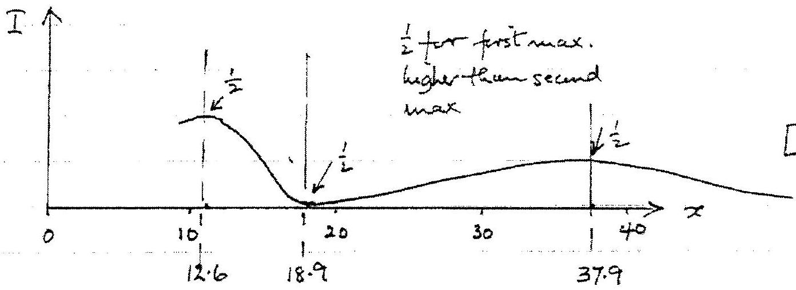
(c) Intensity $I = K A ^ { 2 }$ where $A$ amplitude and $k$ a constant

(1) Thas 4 Times power of $S _ { 1 } \propto S _ { 2 }$
$T$ has 2 Tures the amp. of $S _ { 1 }$ or $S _ { 2 }$, say $2 \alpha$
Total amp at interference maxima is $4 \alpha$
So intensity is $\mathrm { k } 16 \alpha ^ { 2 }$; 16 turies that of $\mathrm { S } _ { 1 }$ or $\mathrm { S } _ { 2 }$ alone
If $S _ { 1 }$ and $S _ { 2 }$ surtished off amp. neduces to $2 \alpha$, whensity $4 \alpha ^ { 2 }$ is power falls by a factor of 4
(ii) Similarly of Tourtched off, total anp $2 x$ and untersity $k 4 \alpha ^ { 2 }$; reduced frank $16 \alpha ^ { 2 }$
Power thus falls by factor of 4

(d) (i)

$$
\begin{aligned}
& A = \frac { 2 k } { x } \\
& I = k \frac { 4 k ^ { 2 } } { x ^ { 2 } }
\end{aligned}
$$

$S _ { 1 }$ and $S _ { 2 }$ in phase, $k$ const
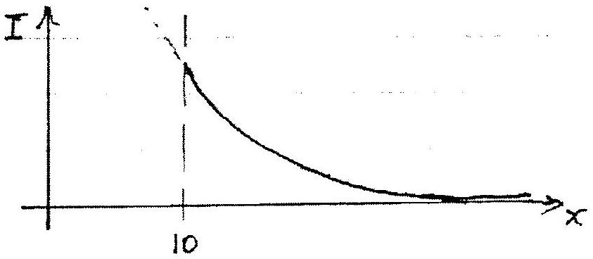
(d)(ii) $S _ { 2 }$ surstched off
Interference occurs, $S _ { 2 }$, and $T$ To out of phase, but minimion does not have zero untensity

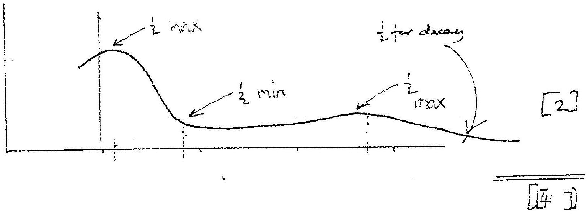

TOTAL W20NT

(a) (i) $i _ { 22 }$ is $i _ { 2 }$ when $2 V$ shart areanted
i2,6 " " " $6 V$ ""
$i _ { 6,2 }$ is $i _ { 1 }$. "2V " "
$i _ { 1,6 }$ मे $i _ { 1 }$ ". 6r $n$,
$$
i _ { 2,6 } = \frac { 200 } { 6 + \left( \frac { 1 } { 2 } + \frac { 1 } { 4 } \right) ^ { - 1 } } = \frac { 2 \cdot 0 } { 6 + 4 / 3 } = \frac { 6 } { 22 } = \frac { 3 } { 11 } \mathrm { amps }
$$
$\therefore i _ { 1 } , b = - \frac { 4 } { 6 } \left( \frac { 6 } { 22 } \right) = - \frac { 2 } { 11 }$ amps
(ii)
$$
i _ { 1,2 } = \frac { 6 \cdot 0 } { 2 + \left( \frac { 1 } { 4 } + \frac { 1 } { 6 } \right) ^ { - 1 } } = \frac { 6 \cdot 0 } { 2 + ( 5 / 12 ) ^ { - 1 } } = \frac { 5 ( 6 ) } { 22 } = \frac { 15 } { 11 } \mathrm { amps }
$$
$\therefore i _ { 2,2 } = - \frac { 4 } { 10 } \left( \frac { 15 } { 11 } \right) = - \frac { 6 } { 11 }$ amps
(b) (1)
$$
\begin{aligned}
& i _ { 1 } = i _ { 12 } + i _ { 16 } = - \frac { 2 } { 11 } + \frac { 15 } { 11 } = \frac { 13 } { 11 } = 1.18 \mathrm { amps } \\
& i _ { 2 } = i _ { 22 } + i _ { 26 } = \frac { 3 } { 11 } - \frac { 6 } { 11 } = - \frac { 3 } { 11 } = - 0.27 \mathrm { amps }
\end{aligned}
$$
(ii) For $4 \Omega$, $i _ { 4 } = \frac { 6 } { 10 } \left( \frac { 15 } { 11 } \right) + \frac { 2 } { 6 } \left( \frac { 3 } { 11 } \right) = \frac { 10 } { 11 } = 0.91 \mathrm { cmps }$ in docoward direction
(iii) Krratofr's Equns.
LHS loop
$$
\begin{align*}
& 6 = 2 i _ { 1 } + 4 \left( i _ { 1 } + i _ { 2 } \right)  \tag{A}\\
& 2 = 6 i _ { 2 } + 4 \left( i _ { 1 } + i _ { 2 } \right) \tag{1}
\end{align*}
$$
RHS Loop
From (b)(i) we also have
$$
i _ { 1 } + i _ { 2 } = \frac { 10 } { 11 }
$$
Sub unto RHS of A
$$
\begin{align*}
& 2 \left( \frac { 13 } { 11 } \right) + 4 \left( \frac { 10 } { 11 } \right) = \frac { 66 } { 11 } = 6 = \mathrm { Nts }  \tag{1}\\
& 6 \left( - \frac { 3 } { 11 } \right) + 4 \left( \frac { 10 } { 11 } \right) = \frac { 22 } { 11 } = 2 = 245 \tag{1}
\end{align*}
$$
Sub' into RHS of B
Thus Kirchoffs equs. verified
(c)(i) Power developed in $4 \Omega = \left( \frac { 10 } { 11 } \right) _ { 4 } ^ { 2 } = \frac { 400 } { 121 } = 3.31 \mathrm {~W}$
(ii) Energy conversion
$$
\left( \frac { 13 } { 11 } \right) 6 = \frac { 78 } { 11 } = 7.09 \mathrm {~W}
$$
(d) The voltages are repluced by
$$
\begin{array} { l l l }
2 \cos \omega t & V & \text { to } \\
6 \cos \omega t & 2 V & \text { for } \\
6 V
\end{array}
$$

Giveng

$$
\begin{aligned}
& i _ { 22 } = \frac { 3 } { 11 } \cos \omega t \\
& i _ { 16 } = \frac { 15 } { 11 } \cos \omega t
\end{aligned}
$$

$$
\begin{aligned}
& i _ { 12 } = - \left( \frac { 1 } { 11 } \right) \cos \omega t \\
& i _ { 26 } = - \left( \frac { 6 } { 11 } \right) \cos \omega t
\end{aligned}
$$

Alternature forms with cos replaced by $\sin ( \omega t + \phi )$ arces $( \omega t + \phi )$, to any $\phi$, acceptable here and in (d)
(d) (i)

$$
\begin{aligned}
& i _ { 1 } = - \frac { 2 } { \pi } \cos \omega t + \frac { 15 } { 11 } \cos \omega t = \frac { 13 } { 11 } \cos \omega t \\
& i _ { 2 } = \frac { 3 } { 11 } \cos \omega t + \left( - \frac { 6 } { 11 } \right) \cos \omega t = - \frac { 3 } { 11 } \cos \omega t
\end{aligned}
$$

(ii) cosut replaced by $\cos ( \omega t + \pi )$ in one of the voltages i.e. cosut replaced by - coswt
any equivalent statement $O K$ eg ( $\omega t - \pi$ ) wrthisin/ $\cos$ functions

24
Solutions
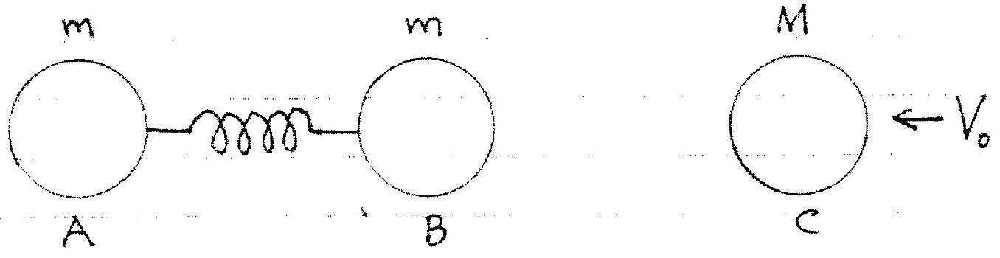
(a) (1) Energy Ead.

$$
\begin{equation*}
\frac { 1 } { 2 } M V _ { 0 } ^ { 2 } = \frac { 1 } { 2 } m V _ { B } ^ { 2 } + \frac { 1 } { 2 } M V _ { c } ^ { 2 } \tag{A}
\end{equation*}
$$

Momentom Eqn.

$$
\begin{equation*}
M V _ { 0 } = m V _ { B } + M V _ { c } \tag{B}
\end{equation*}
$$

(ii) Sub $V _ { A } = V _ { B } = 0$ and $V _ { C } = V _ { 0 }$ wi egn. (A)
LHS $= \frac { 1 } { 2 } M V _ { 0 } ^ { 2 } , R H S = \frac { 1 } { 2 } M V _ { 0 } ^ { 2 } , \operatorname { Hence }$ Equn. (4) SATISFIED
Sub ${ } ^ { 9 } \quad V _ { A } = V _ { B } = 0$ and $V _ { C } = V _ { 0 }$ un (B)
LHS $= M r _ { 0 }$, RHS $= M V _ { 0 }$, HENCE EQUN. (B) SATISFIED

SECOND

$$
\left\{ \begin{align*}
& S _ { \text {u } } b ^ { g } V _ { c } = \frac { M - m } { M + m } V _ { 0 } , \quad V _ { B } = \frac { 2 M } { M + m } V _ { 0 } \text { and } V _ { A } = 0 \quad \text { in } ( \theta )  \tag{A}\\
& A H S = \frac { 1 } { 2 } M V _ { 0 } ^ { 2 } \\
& R H S = \frac { 1 } { 2 } m \left( \frac { 2 M } { M + m } \right) ^ { 2 } V _ { 0 } ^ { 2 } + \frac { 1 } { 2 } M \left( \frac { M - m } { M + m } \right) ^ { 2 } V _ { 0 } ^ { 2 } \\
& = \frac { 1 } { 2 } \frac { M V _ { 0 } ^ { 2 } } { ( M + m ) ^ { 2 } } \left[ 4 m M + M ^ { 2 } - 2 m M + m ^ { 2 } \right] \\
& = \frac { 1 } { 2 } \frac { M V _ { 0 } ^ { 2 } } { ( M + m ) ^ { 2 } } \left[ M ^ { 2 } + 2 m M + m ^ { 2 } \right] \\
& = \frac { 1 } { 2 } \frac { M V _ { 0 } ^ { 2 } } { ( M + m ) ^ { 2 } } ( M + m ) ^ { 2 } \\
& = \frac { 1 } { 2 } M V _ { 0 } ^ { 2 } = L H S \\
& \text { Equation } V E R 1 F _ { 1 } E D \\
& \text { Sub into (B) RHS } = m \left( \frac { 2 M } { M + m } \right) V _ { 0 } + M \left( \frac { M - m } { M + m } \right) V _ { 0 } = M V _ { 0 } = L H S \text { EQUISIFIED }
\end{align*} \right\}
$$

(iii) $V _ { A } = 0$ as ofter collision only kalls to expenence change un velocity are $B$ and $C$. Spring does not communicate a change in momentern to A mitally
First solution reguled as it does not correspand to a collesion - velocities of all masses remain unchanged
$[ 1$
(iv) C. of M. mones with average velocity of A and B as masses efecal

$$
V _ { C M } = \left( \frac { M } { M + m } \right) V _ { 0 }
$$

(in direction of $V _ { 0 }$ )

(b) (1) Spring intertes about $\sim$ C. of $M$ of $A \tan \partial B$
$k ^ { \prime }$ strung censtant for half the spring
If full spring extended by $2 x$, half spaning extended by $x$, so tension Tin spuing given by
But
$$
\begin{array} { l l }
T = 2 k x & \text { for full spring. } \\
T = k ^ { \prime } x & \text { for half spring } \\
0 k ^ { \prime } = 2 k &
\end{array}
$$
So angular frequency of half sprung $\omega = \sqrt { \frac { \lambda } { m } }$ : given bs
$$
\begin{equation*}
\omega = \sqrt { \frac { 2 k } { m } } \tag{1}
\end{equation*}
$$
(ii) Energy conservation in C. of M. system, for manses on sping, each mass has max speed of $\left( \frac { M } { M + m } \right) V _ { 0 }$;
$$
\left. \begin{array} { r l }
2 \left( \frac { 1 } { 2 } m \right) \left( \frac { M } { M + m } V _ { 0 } \right) ^ { 2 } & = 2 \left( \frac { 1 } { 2 } k ^ { \prime } A ^ { 2 } \right) \\
\frac { m M ^ { 2 } V _ { 0 } ^ { 2 } } { ( M + m ) ^ { 2 } } & = 2 \left( \frac { 1 } { 2 } ( 2 k ) A ^ { 2 } \right) \quad \text { as } k ^ { \prime } = 2 k \\
A ^ { 2 } & = \frac { m } { 2 k } \left( \frac { M } { M + m } \right) ^ { 2 } V _ { 0 } ^ { 2 } \\
A & = \sqrt { \frac { m } { 2 k } } \left( \frac { M } { M + m } \right) V _ { 0 } \tag{-}
\end{array} \right\}
$$
OR
$$
A = \frac { V _ { 0 } } { \omega ( 1 + \gamma ) } \text { where } \gamma = \frac { m } { M }
$$

(iii)

$$
\begin{aligned}
x _ { B } & = V _ { C M } t + A \sin \omega t \\
& = \frac { V _ { 0 } } { 1 + \gamma } t + \frac { V _ { 0 } } { ( 1 + \gamma ) \omega } \sin \omega t
\end{aligned}
$$

where $\gamma = \frac { m } { M }$ and $\omega = \sqrt { \frac { 2 k } { m } }$

3) (i) $I = 4 , V = 4428$ to large an internent from $I = 3$ to $I = 4$ compared with that produced by other unteger changes whech exclude $I = 4$ probably
(ii) Last but one digit "2" (wistyped shorled be "0" ie $V = 44$ of correct reading (no maks for just stating "error") For answer "ignive readung" give $\left[ \frac { 1 } { 2 } \right]$ in place of [1])
(iii) Plot graph of $R = \frac { V } { I }$ against $I ^ { 2 }$
Shaight hise graph with acceptablescale using full page of graph puber for range of values in the table. Connect table of values
(iv) $\quad R = \lambda I$ + $R _ { 0 }$
Obtain frama graph
$R _ { 0 }$ value (intercept) : 1099.80
Error in $R _ { 0 } \quad \pm 0.05$ acceptable
$\lambda$ value (gradient) 0.120
Error in $\lambda$ ± 0.002 acciplatle
Formula:
$$
R = 0.120 I ^ { 2 } + 1099.80
$$
(b) (i)
$$
\begin{align*}
E & = \rho R ^ { \alpha } t ^ { - 2 }  \tag{A}\\
\ln ( E ) & = \ln ( \rho ) + \alpha \ln ( R ) - 2 \ln ( t ) \\
\ln ( t ) & = \frac { 1 } { 2 } ( \ln ( \rho ) - \ln ( E ) ) + \frac { 1 } { 2 } \alpha \ln ( R )  \tag{2}\\
\ln ( t ) & = \frac { 1 } { 2 } \ln \left( \frac { \rho } { E } \right) + \frac { 1 } { 2 } \alpha \ln ( R )
\end{align*}
$$
Plot h(t) against $h ( R )$, it grouda straight his gradient $\frac { 1 } { 2 } \alpha$ intercept $\frac { 1 } { 2 } \ln \left( S ^ { \circ } / E \right)$ $[ 2 ]$

(b) (ii) Let $\frac { 1 } { 2 } \ln \left( \rho _ { k } / k \right) = k$, the miter cest along the $\ln ( t )$ axis whereh $( R ) = 0$.
Then
$$
\begin{aligned}
& \frac { \rho } { E } = e ^ { 2 k } \\
& \rho = E e ^ { 2 k }
\end{aligned}
$$
(iii) Peoting hatt agarast hu(R) gress a gradient of $\left( \frac { x } { 2 } \right)$ from which $\alpha$ can be obtained
(iv) Dimensions/units of egration (A) quies
$$
M L ^ { 2 } T ^ { - 2 } = M L ^ { - 3 } L ^ { \alpha } T ^ { - 2 }
$$
Thus equating powers of $L$,

Q6
Solution

a (i) Area of annulus $= \pi ( x + 1 ) ^ { 2 } t ^ { 2 } - \pi x ^ { 2 } t ^ { 2 }$
$$
\begin{aligned}
& = \pi t ^ { 2 } \left[ n ^ { 2 } + 2 n + 1 - n ^ { 2 } \right] \\
& = \pi t ^ { 2 } ( 2 n + 1 )
\end{aligned}
$$
Number of particles in annulus
$$
N = \rho \pi t ^ { 2 } ( 2 n + 1 ) V
$$
(a) 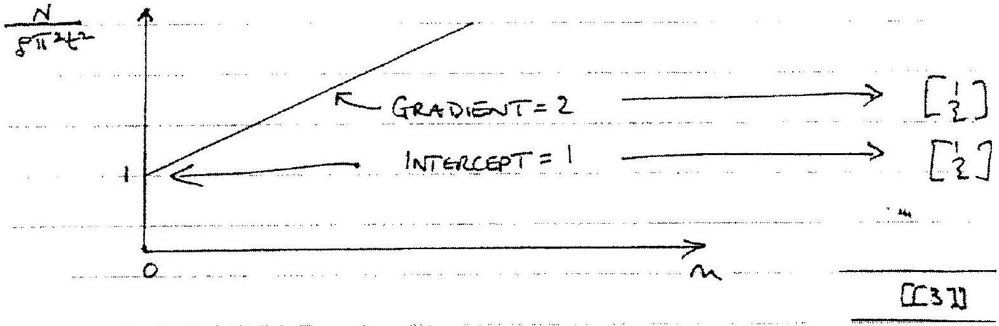
(b) (i)
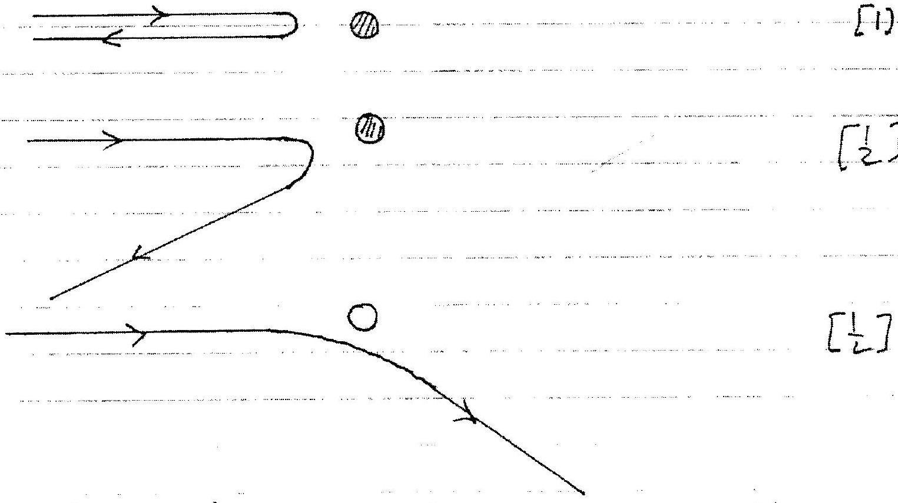
(ii) Small angles associated with small $n$ and hence small $N$ is few particles derectly incident on the nucleus
(iii) $\pi ^ { c }$ or $180 ^ { \circ }$
(iv) Election mass a factor 8000 sualler than $\alpha$ particle ie exceedungly suall relative inestia

(c)(i) lemservation of energy requires

$$
\begin{align*}
4 m u ^ { 2 } & = \frac { z e ^ { 2 } } { \left( 4 \pi \varepsilon _ { 0 } \right) r _ { 1 } } = \frac { ( 2 ) 79 e ^ { 2 } } { \left( 4 \pi \varepsilon _ { 0 } \right) r _ { 1 } }  \tag{2}\\
r _ { 1 } & = \frac { 2 ( 79 ) e ^ { 2 } } { ( 4 ) \left( 4 \pi \varepsilon _ { 0 } \right) m u ^ { 2 } } \\
r _ { 1 } & = \frac { 79 e ^ { 2 } } { \left( 4 \pi \varepsilon _ { 0 } \right) m u ^ { 2 } } =
\end{align*}
$$

(ii) Zero relative velocity at destance of closest approach $i$ both particles have same speed, $V$
✓ particle has mass 4 m
bensuration of energy gives

$$
\begin{equation*}
\frac { 1 } { 2 } \left( 4 m u ^ { 2 } \right) = \frac { 1 } { 2 } \left( 4 m v ^ { 2 } \right) + \frac { 1 } { 2 } \left( 197 m v ^ { 2 } \right) + \frac { ( 1 ) } { ( 2 ) } \frac { 79 e ^ { 2 } } { \left( 4 \pi \varepsilon _ { 0 } \right) r _ { 2 } } \tag{3}
\end{equation*}
$$

benservation of momentum gives

$$
\begin{align*}
4 \mathrm { mu } & = 4 \mathrm { mv } + 197 \mathrm { mv }  \tag{2}\\
4 \mathrm { u } & = 201 \mathrm { v } \\
\mathrm { v } & = \frac { 4 \mathrm { u } } { 201 } \tag{1}
\end{align*}
$$

Subst tuting $V = \frac { 44 } { 201 }$ inito (A)

$$
\begin{equation*}
4 n ^ { 2 } = 201 \left( \frac { 44 } { 201 } \right) ^ { 2 } + \frac { ( 2 ) 158 e ^ { 2 } } { \left( 4 \pi \varepsilon _ { 0 } \right) m r _ { 2 } } \tag{1}
\end{equation*}
$$

(c) (ii)

$$
\begin{align*}
\frac { ( 804 - 16 ) u ^ { 2 } } { 201 } & = \frac { ( 2 ) 158 e ^ { 2 } } { \left( 4 \pi \varepsilon _ { 0 } \right) m r _ { 2 } } \\
r _ { 2 } & = \frac { ( 2 ) ( 158 ) ( 201 ) e ^ { 2 } } { \left( 4 \pi \varepsilon _ { 0 } \right) ( 788 ) m u ^ { 2 } }  \tag{*}\\
& = \frac { ( 2 ) 15,879 e ^ { 2 } } { 394 \left( 4 \pi \varepsilon _ { 0 } \right) m u ^ { 2 } } = \frac { 31758 e ^ { 2 } } { 394 \left( 4 \pi \varepsilon _ { 0 } \right) } \tag{1}
\end{align*}
$$

[ $[ 12 ] ]$

* (Note $\frac { 201 } { 788 } \sim \frac { 1 } { 4 }$, compare result (c)(i))

(a) (i) Using " $v ^ { 2 } = u ^ { 2 } - 2 g h ^ { \prime }$ where $v = 0$ and $u = v$ in formula quote
$$
\begin{gathered}
0 = v ^ { 2 } - 2 g H \\
H = \frac { v ^ { 2 } } { 2 g }
\end{gathered}
$$

(ii) Using " $s = n t - \frac { 1 } { 2 } g t ^ { 2 }$ "

)(i) Remetant for mg $\sqrt { 1 + x ^ { 2 } }$ [年] $0 = v t - \frac { 1 } { 2 } g t ^ { 2 }$ in dratin $\theta = \tan ^ { - 1 } \left( \frac { 1 } { \alpha } \right) \left[ \frac { 1 } { 2 } \right] \quad t = \frac { 2 r } { 9 }$

(b) (ii)
bacider horzontal motion. A distance $s$ horrantally is giventy

$$
\begin{equation*}
s = u t + \frac { 1 } { 2 } ( \alpha g ) t ^ { 2 } \tag{B}
\end{equation*}
$$

From vertical unotion, returning to ground in turiet, useug (A)

$$
\begin{equation*}
t = \frac { 2 v } { g } \tag{c}
\end{equation*}
$$

∴ Range $R = u \left( \frac { 2 v } { g } \right) + \frac { 1 } { 2 } ( \alpha g ) \left( \frac { 2 v } { g } \right) ^ { 2 }$
Sub ${ } ^ { 9 }$.(c) mito (B)
$R = \frac { 2 v } { 9 } [ u + \alpha v ]$

(iii) Parabola
(iii) Parabola
(iii) Parabola
Axis along direction of resultant force (see diagram) Creect Diren
Correct Drawing and
Correct Drawing and
Correct Drawing and
Correct Drawing and
Correct Drawing and
Correct Drawing and Correct Drawing and inclination of axis inclination of axis inclination of axis inclination of axis inclination of axis inclination of axis inclination of axis
[1]
Axis of symmetry at angle $\theta = \tan ^ { - 1 } \left( \frac { m g } { \alpha m g } \right) = \tan ^ { - 1 } \left( \frac { 1 } { \alpha } \right)$ (Asni cuse of mo. wind, $\alpha = 0$, axis along derection of ung)

(b) (Fin) Recultant force on $m$ must be with opposite direction of initial velocity ( $v _ { 1 }$ with $\alpha = 0$ this durection is untically upwards-opposite to g ); $u$ must be megative ${ } ^ { \text {so } }$ that
$$
\begin{aligned}
& \frac { u } { v } = - \frac { \alpha m g } { m g } = - \alpha \\
& \tan \theta = + \frac { 1 } { \alpha } \quad \tan - 1 \\
& \theta = \tan ^ { - 1 } \left( \frac { 1 } { \alpha } \right) = \frac { - v } { u }
\end{aligned}
$$
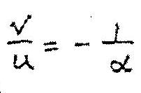
Correction where u-ve
Arternaturely $\begin{aligned} & \left. \phi = \tan ^ { - 1 } \left( - \frac { 1 } { \alpha } \right) = \frac { v } { u } \quad \text { (note } u - v e \right) \wedge \\ & = 180 - \theta \end{aligned}$ $= 180 - 0$ Sel dugram for OI on
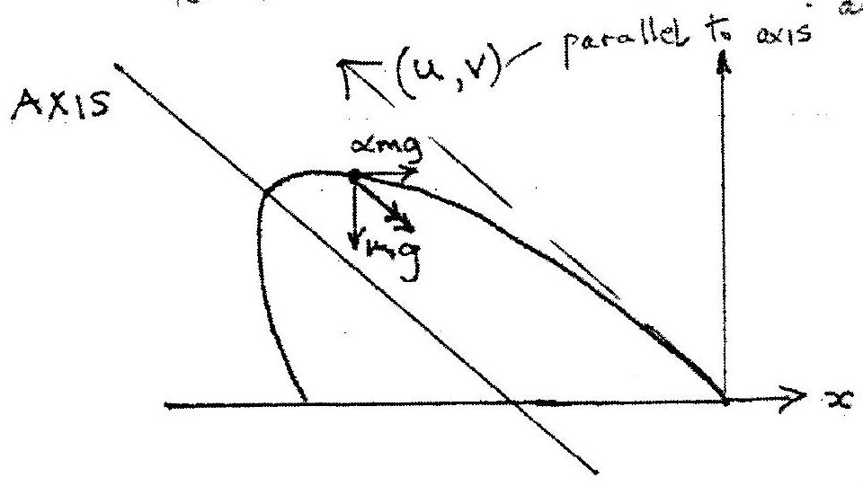
and $\phi$ precious page
(c) (i) From result (a)(i) maximism height given by $H = \frac { v ^ { 2 } } { 2 g }$ when "g" resultant force. When "g" replaced by $g \sqrt { 1 + \alpha ^ { 2 } }$ at angle $\theta$ due to resultant force of wind and gravity, the distance travelle along the midened straight path is
$$
\begin{equation*}
H = \frac { \sqrt { v ^ { 2 } + u ^ { 2 } } } { 2 g \sqrt { 1 + \alpha ^ { 2 } } } \tag{1}
\end{equation*}
$$
as " $V$ " replaced by $\sqrt { v ^ { 2 } + u ^ { 2 } }$ for inclined path where mass m expenedices a constant force $m g \sqrt { 1 + \alpha ^ { 2 } }$. [1]
Work done $W =$ Const force $x$ distance
$$
\begin{align*}
& = - m g \sqrt { 1 + \alpha ^ { 2 } } \left( \sqrt { v ^ { 2 } + u ^ { 2 } } / 2 g \sqrt { 1 + \alpha ^ { 2 } } \right) \\
& = - \frac { 1 } { 2 } m \left( v ^ { 2 } + u ^ { 2 } \right) = - \frac { 1 } { 2 } m v ^ { 2 } \left( 1 + \alpha ^ { 2 } \right) ( \text { as } u = - \alpha v ) \tag{1}
\end{align*}
$$

Alternatuvely using conservation of mergy initial ke. $\frac { 1 } { 2 } m \left( r ^ { 2 } + u ^ { 2 } \right)$ converted into work done $\sqrt { p E }$ on reacking max. height along straight path giving
$W _ { n } \quad$ order $= W = - \frac { 1 } { 2 } m \left( u ^ { 2 } + v ^ { 2 } \right) = - \frac { 1 } { 2 } m v ^ { 2 } \left( 1 + x ^ { 2 } \right)$

1(c) (II) For a conservative potentral fild, work done indep. of path. So as me can reach final posction by following a honigental path
$$
\begin{aligned}
& W = \alpha m g R \\
& W = \alpha m g \frac { 2 v } { g } ( u + \alpha v ) \\
& W = 2 \alpha m v ( u + \alpha v )
\end{aligned}
$$
$$
\text { TOTAL } \overline { \left. \sum [ 20 ] 7 \right] }
$$
