## 2007 BPLO PAPER 2 BrNOU 2006

SONUTIONS
(a) (1) 又 $\rightarrow$ Z $- 2 \quad$ A $\rightarrow$ A-4
(ii) $z \rightarrow z + 1 \quad A \rightarrow A$
(iii) $Z \rightarrow Z + 1 \quad A \rightarrow A + 2$
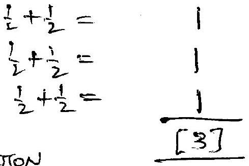
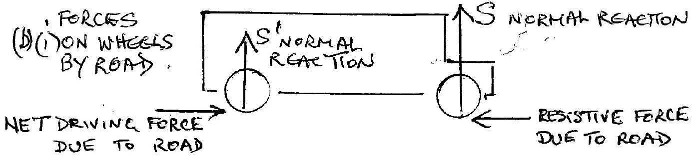
(ii)
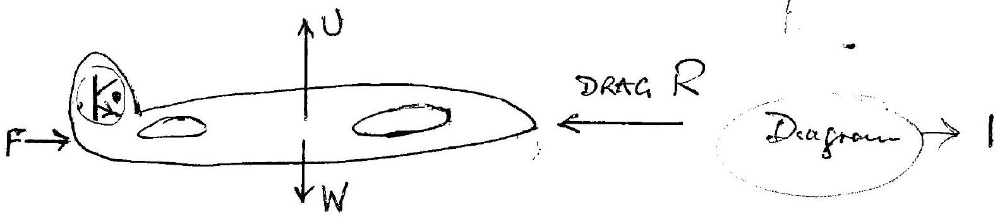

Forces

(x) Weight $W$ verticully downwards
k) Up thrust due to flow of air over wings (Bermondli effect), U, vectricully upwirds $\frac { 1 } { 2 }$
(xii) Drowing force F, reaction resulting from sati of change of momention of exhaust gases
(iii) Drag, resistance, $R$ due to air reseatiance
$$
W = U \text { and } F = R \text { for constantuelocity }
$$
(c)
$$
\begin{array} { l l }
E _ { A P } = \frac { 1 } { 4 \pi \varepsilon _ { 0 } } & \frac { 100 \times 10 ^ { - 9 } } { \left( 50 \times 10 ^ { - 3 } \right) ^ { 2 } } = \frac { 1 } { 4.1 } \left( 4 \times 10 ^ { - 5 } \right) N C ^ { - 1 } \\
E _ { B P } = \frac { 1 } { 4 \pi \varepsilon _ { 0 } } & \frac { 576 \times 10 ^ { - 9 } } { \left( 120 \times 10 ^ { - 3 } \right) ^ { 2 } } = \frac { 1 } { 4 \pi \varepsilon _ { 0 } } \left( 4 \times 10 ^ { - 5 } \right) N C ^ { - 1 }
\end{array}
$$
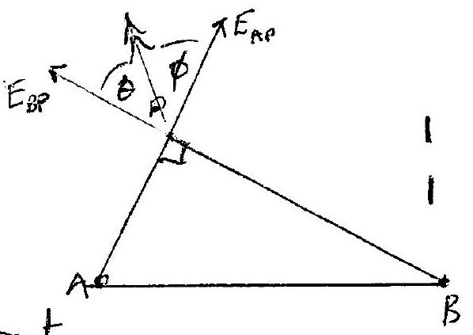

As these components are at reight angle the resultant

$$
\begin{aligned}
E & = \frac { 1 } { 4 \pi \varepsilon _ { 0 } } \quad 4 \sqrt { 2 } \times 10 ^ { - 5 } \cdot N C ^ { - 1 } \\
& = \left( 8.897 \times 10 ^ { 9 } \right) ( 4 \sqrt { 2 } ) 10 ^ { - 5 } N C ^ { - 1 } \\
E & = 5.03 \times 10 ^ { 5 } N C ^ { - 1 }
\end{aligned}
$$

$$
\theta = \phi = \tan ^ { - 1 } 1 = 45 ^ { \circ }
$$

(d) 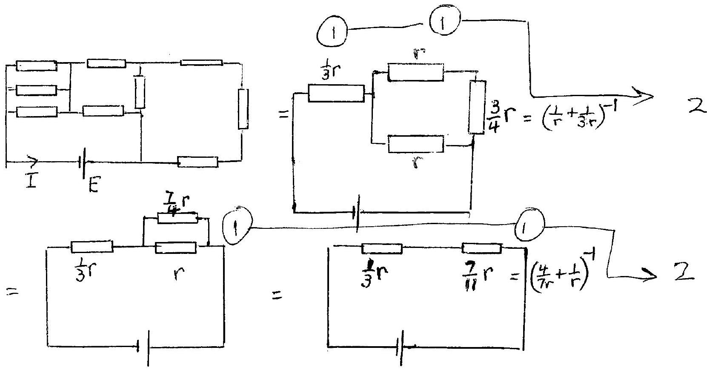
$$
I = \frac { E } { \left( \frac { 1 } { 3 } + \frac { I } { 11 } \right) r } = \frac { 33 } { 32 } \frac { E } { r }
$$
(e)
$$
\begin{aligned}
E = e _ { \nu } : \quad \nu & = \frac { 50 \times 10 ^ { 3 } \times 1.602 \times 10 ^ { - 19 } } { 6.626 \times 10 ^ { - 34 } } \\
& = 1.29 \times 10 ^ { 19 } \mathrm {~Hz}
\end{aligned}
$$
$$
\frac { \frac { 1 } { [ 5 ] } } { 1 }
$$
$$
\begin{aligned}
\text { Heat generated } & = \left( 50 \times 10 ^ { 3 } \right) \left( 20 \times 10 ^ { - 3 } \right) ( 0.99 ) \mathrm { J } ^ { - 1 } \\
& = 990 \mathrm {~W}
\end{aligned}
$$
$$
\frac { 1 } { [ 3 ] }
$$
(f) Let $m$ the mass of bullet and $r$ speed of ballet
$$
\begin{aligned}
\frac { 4 } { 5 } \left( \frac { 1 } { 2 } m v ^ { 2 } \right) & = ( 600 - 320 ) \left( 0.12 \times 10 ^ { 3 } \right) m + 21 \times 10 ^ { 3 } \mathrm {~m} \\
v ^ { 2 } & = \frac { 5 } { 2 } \left[ 280 \left( 0.12 \times 10 ^ { 3 } \right) + 21 \times 10 ^ { 3 } \right] \\
& = \frac { 5 } { 2 } \left( 10 ^ { 3 } \right) [ 33.60 + 21.00 ] = \frac { 5 } { 2 } \left( 10 ^ { 3 } \right) ( 54.60 ) \\
& = 13.65 \times 10 ^ { 4 } \\
v & = 0.37 \mathrm { kms } ^ { - 1 }
\end{aligned}
$$
$$
\frac { 1 } { [ 4 ] }
$$
(g) Originally 10 uranium atom, presently only 9 Expenentual decay for rock of age tint
$$
\begin{aligned}
9 & = 10 e \\
\lambda t & = - \ln ( 0.9 ) \text { where } \\
\lambda & = - \ln 2 / 4 ^ { 2 } 5 \times 10 ^ { 9 } = + \frac { 0.6931 } { 4.5 \times 10 ^ { 9 } } \\
\text { Substituting for } \lambda , \quad t & = 6.84 \times 10 ^ { 8 } \text { years }
\end{aligned}
$$
$$
\frac { 1 } { [ 5 ] }
$$

(b) is) Area of cork, raduis licm, $= \pi \left( 1 \times 10 ^ { - 2 } \right) ^ { 2 } \mathrm {~m} ^ { 2 }$
Force in corch $F = p \times$ Area $= p \pi \left( 1 + 10 ^ { - 2 } \right) ^ { 2 } N \quad ( p = p$ reserve $)$
Energy gamed by corch in 2cm $= F \left( 2 \times 10 ^ { - 2 } \right) = p \pi \left( 1 \times 10 ^ { - 2 } \right) ^ { 2 } \left( 2 \times 10 ^ { - 2 } \right)$
$$
= p ( 6.2 ) 10 ^ { - 6 } \mathrm {~J}
$$
$= m g h$
$$
m = \text { mass } = 10 \text { gus, } h = 6 \mathrm {~m}
$$
Thus
$$
p = \frac { 5.9 \times 10 ^ { - 1 } } { 6.2 \times 10 ^ { - 6 } } \simeq 10 ^ { 5 } \mathrm {~Pa} .
$$
Accept answers in range
$$
10 ^ { 4 } \rightarrow 10 ^ { 6 } \mathrm {~Pa} .
$$
A elevartive solutions acceptable - can use approx $g = 10$.
(11) Let $w$ be the wedth of the tyre and $t$ theckness left on rood, Roaduis of tyre Removed volume $= \left( 5 \times 10 ^ { - 3 } \right) 2 \pi R \omega = 50.000 \times 10 ^ { 3 } \times t \times \omega$
$$
t = 2 \pi \left( 20 \times 10 ^ { - 2 } \right) \times 10 ^ { - 10 }
$$
Goving
$$
t = 10 ^ { - 10 } \mathrm {~m}
$$
Accept $10 ^ { - 9 } \rightarrow 10 ^ { - 11 } \mathrm {~m}$
Alternative solutions receptable
(j) (i) $\frac { 1 } { 2 } m g \quad \frac { 1 } { 2 } m v ^ { 2 } = m g h$
$$
\begin{array} { l l }
v ^ { 2 } = 2 g \left( 20 \times 10 ^ { - 2 } \right) & \left( h = 20 \times 10 ^ { - 2 } \mathrm {~m} \right) \\
v = 1.98 \mathrm {~m} \mathrm {~s} ^ { - 1 } & ( \text { or } \sqrt { 0.4 \mathrm {~g} } )
\end{array}
$$
(ii) Tuni to fall. $0.80 \mathrm {~m} , t$, is grown by
$$
\begin{gather*}
0.80 = \frac { 1 } { 2 } g t ^ { 2 } \\
t = \sqrt { \frac { 1.6 } { g } } \tag{A}
\end{gather*}
$$
Hanzantal distance $s = v t = \sqrt { 0.4 g } \sqrt { \frac { 1.6 } { g } } = 0.80 \mathrm {~m}$
(iii) For a hole at heaght $h$ abore the floor, enservation of energy requence
$$
\frac { 1 } { 2 } m v ^ { i ^ { 2 } } = m g ( 1 - h )
$$
Tunicitis fall distance $h$ green by
$$
h ^ { g w e n \text { by } } = \frac { 1 } { 2 } g t ^ { \prime 2 } \quad \text { is } \quad t ^ { \prime } = \sqrt { \frac { 2 h } { g } }
$$
Horigintal distance s, given by
From (A)
$$
\begin{aligned}
s & = v t ^ { \prime } = \sqrt { \frac { 2 h } { g } } \cdot \sqrt { 2 g ( 1 - h ) } \\
& = 0.80 \mathrm {~m}
\end{aligned}
$$
This groes an equation for $h$,
$$
h ^ { 2 } - h + \frac { 16 } { 100 } = 0
$$
Thus
$$
\begin{aligned}
& k = 0.80 \mathrm {~m} \text { or } 0.20 \mathrm {~m} \\
& k = 0.90 \ldots \operatorname { ki } ( l = 0.12 \text { m rement... di kitt. tisth} l e )
\end{aligned}
$$

(k) ive require
$$
\frac { G M _ { \text {poon } } M _ { \text {Earth } } } { R _ { \text {ME } } ^ { 2 } } = \frac { Q ^ { 2 } } { \left( \omega \pi \varepsilon _ { 0 } \right) R _ { M E } ^ { 2 } }
$$
$$
\begin{aligned}
Q ^ { 2 } & = \left( 4 \pi \varepsilon _ { 0 } \right) G ( 0.0123 ) M _ { E } ^ { 2 } \\
& = 4 \pi \left( 8.854 \times 10 ^ { - 12 } \right) \left( 6.672 \times 10 ^ { - 11 } \right) ( 0.0123 ) M _ { E } ^ { 2 } 1 \\
Q & = 9.555 \times 10 ^ { - 12 } M _ { E }
\end{aligned}
$$
Mass of electrons
(l) 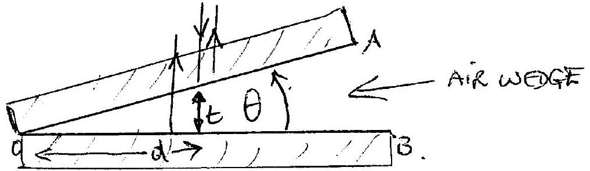
(i) Light seflected from two faces, $O A$ and $O B$, upper and lower surfaces of airt worly Extra phase change of $\pi$ at $O B$ due to reflection at interface with locats 10 high refractue index If the chess of wedge $t$ at reffacted region, distance a fran0, banshructure uterference requie $2 t = \left( n + \frac { 1 } { 2 } \right) \lambda \otimes$ (nuteger) Destructore interference $\quad 2 t = n \lambda$ Puttion due it interference founger system
(ii) Now $t = d \tan \theta \approx d \theta$
Subsititung into (t), $2 d \theta = ( n + i ) \lambda$ to constructure formesis 1 Separation solvelveen constructure funges grow iby
$$
\begin{aligned}
2 \Delta d \theta & = \lambda \\
\Delta d & = \frac { \lambda } { 2 \theta }
\end{aligned}
$$
a $\left. \left[ n + \frac { 3 } { 2 } - ( n + i ) \right] \right\}$,
Ad depends inversely on $\theta$; some marks for a qualitation answer
(iii) Far water ufractive index $\mu > 1$, path defference becomes $2 \mu \mathrm {~d} \theta$ Gwing $\Delta d = \frac { \lambda } { 2 }$
fininge suparation, $2 \mu \theta$
Ad heemes suratter than in air. Some morks for a qualitaturely I correct answer. (ii)

(m) Devecure in p.e $V = + ( 0.20 ) g ( 0.16 ) = + 0.3139 \mathrm {~J}$

(ii) Energy $E = \frac { 1 } { 2 } k x ^ { 2 } = \frac { 1 } { 2 } k ( 0.16 ) ^ { 2 }$
At equilitrou $0.20 g = k ( 0.16 ) \quad$ or $k = \frac { 5 } { 4 } g$ $= \frac { 1 } { 2 } \left( \frac { 0.209 } { 0.16 } \right) ( 0.16 ) ^ { 2 }$ $= 0.157 \mathrm {~J} = \frac { 1 } { 2 } ( + V )$
Thus
$$
\begin{aligned}
V - E & = \frac { 1 } { 2 } V \\
& = 0.157 J
\end{aligned}
$$
(iii) Heat generated : $V - E = \frac { 1 } { 2 } V$
(iv) Loss in p.e. $= \frac { 1 } { 2 } k \left[ ( 0.24 ) ^ { 2 } - ( 0.16 ) ^ { 2 } \right] - ( 0.20 ) g ( 0.08 )$
$$
\begin{aligned}
& = \frac { 1 } { 2 } \left( \frac { 5 } { 4 } g \right) [ ( 0.40 ) ( 0.08 ) ] - 0.016 g \\
& = \frac { 1 } { 2 } \left( \frac { 5 } { 4 } \right) g ( 0.032 ) - 0.016 g \\
& = 0.016 g \left( \frac { 5 } { 4 } - 1 \right) = 0.016 g \left( \frac { 1 } { 4 } \right) = 0.004 g \\
& = 39.2 \times 10 ^ { - 3 } \mathrm {~J}
\end{aligned}
$$
Gam in KE $= 3.92 \times 10 ^ { - 2 } \mathrm {~J}$
(v) $$
\begin{aligned}
T & = 2 \pi \sqrt { \frac { m } { k } } = 2 \pi \sqrt { \frac { 1 / 5 } { ( 5 / 4 ) ^ { 9 } } } = 2 \pi \sqrt { \frac { 4 } { 25 g } } = \frac { 4 \pi } { 5 } / \sqrt { g } \\
& = 0.802 \mathrm {~s}
\end{aligned}
$$
(vi) Spring is 'compressed' nib zero tenseñ sfate ani spring plus mass falls under gravity $\begin{array} { r } 1 / 2 \\ 1 / 2 \\ \hline [ 10 ] \end{array}$
$( n )$ Let $n$ be the number of strokes; workng volume of purp $v _ { 1 }$ If each alroke produces a votune $v _ { 2 }$ with sequred pressure $p _ { 2 }$, their For it stroke, $p _ { 1 } V _ { 1 } = p _ { 2 } V _ { 2 i }$ ( $v _ { 2 } = v _ { 2 i }$ )
Then $n$ strokes will produce $u p _ { i } v _ { 1 } = p _ { 2 } \sum _ { 1 } v _ { 2 i } = p _ { 2 } V _ { 2 }$ where $V _ { 2 }$ total vol. of lyre thus $n = 40$

In practice the expansen is not slow, so temperature does not remain constant. It is an achabatic expansion in whech heat generated and does not escape; barrel becauses hot

21 (0) $\quad S _ { A } + S _ { B } = ( M + m ) g$ (i)

Moments about A:

$$
\begin{aligned}
& m g l + M g ( 2 l - x ) = 2 l S _ { B } \\
& S _ { B } = \left[ \frac { 1 } { 2 } m i + \left( 1 - \frac { x } { 2 l } \right) M \right] _ { g }
\end{aligned}
$$

(a)

From (1)

From (ii)
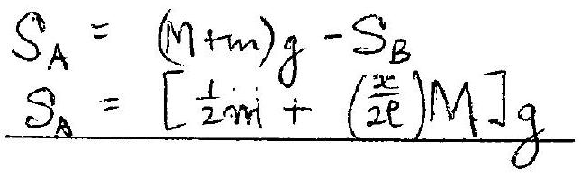
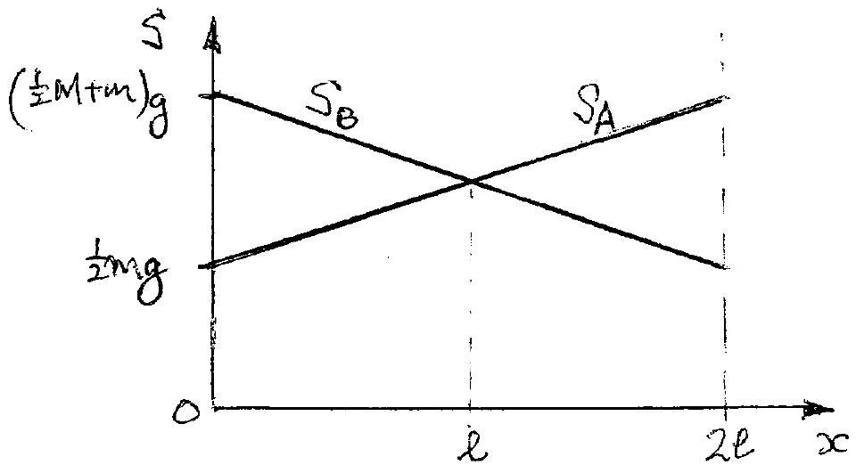
$S _ { B }$ graph Sagraph

(1) $$
\begin{align*}
& i _ { 1 } = i _ { 8 }  \tag{1}\\
& i _ { 2 } = i _ { 9 }  \tag{1}\\
& i _ { 3 } = i _ { 14 }  \tag{1}\\
& i _ { 4 } = i _ { 12 }  \tag{1}\\
& i _ { 5 } = i _ { 10 } \tag{array}
\end{align*}
$$
(ii) (x) all current directions are revelsed
(xi) the refurate is the same as in (i) with $A$ and $B$ reversed Consequently
$$
\begin{align*}
& i _ { 1 } = i _ { 4 }  \tag{1}\\
& i _ { 2 } = i _ { 3 } \tag{i}
\end{align*}
$$
[Using results in (i)
$$
\begin{align*}
& i _ { 8 } = i _ { 11 } = i _ { 1 } = i _ { 4 } \\
& i _ { q } = i _ { 2 } = i _ { 10 } = i _ { 3 } \tag{]}
\end{align*}
$$
(iii) No change
(iv) In Figure 2.2. Fotal nesistance of upper fui sesisters is
$$
\begin{equation*}
2 R + \left( \frac { 1 } { R } + \frac { 1 } { 2 R } \right) ^ { - 1 } = 2 R + \frac { 2 } { 3 } R = \frac { 8 } { 3 } R \tag{1}
\end{equation*}
$$
Lower 5 reseators also $\frac { 8 } { 3 } R$.
Addnig 2R in parallel with $\frac { 8 } { 3 } R$ whech is in parallel with $\frac { 8 } { 3 } R$ Total Resistance $R _ { A B } = \left( \frac { 3 } { 8 } + \frac { 3 } { 8 } + \frac { 1 } { 2 } \right) ^ { - 1 } R = \left( \frac { 5 } { 4 } \right) ^ { - 1 } R$
$$
\begin{equation*}
R _ { A B } = \frac { 4 } { 5 } R \tag{1}
\end{equation*}
$$

(b) Reverseng the p.d. across A.C. nequere's, by symmetry,

$$
\begin{aligned}
& i _ { 1 } = - i _ { 10 } \\
& i _ { 6 } = - i _ { 9 } . \\
& i _ { 3 } = - i _ { 7 } \\
& i _ { 5 } = - i _ { 12 } \\
& i _ { 2 } = - i _ { 11 }
\end{aligned}
$$

$$
\left[ \begin{array} { l }
\text { If students have } \\
\text { correct magnitudes } \\
\text { antapprecate the } \\
\text { direct non of the current give jull } \\
\text { marks }
\end{array} \right]
$$

Disconnect $i _ { 3 }$ and $i _ { 7 }$ at function $O$
$i _ { 6 }$ and $i _ { q }$ at function $O$
This dais not aller currents in the arms of network We now have
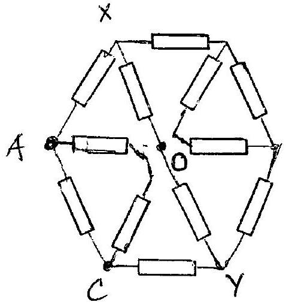
Total vesuartance to reght of $x y = 2 R + \left( \frac { 1 } { 2 R } + \frac { 1 } { R } \right) ^ { - 1 } = \frac { 8 } { 3 } R$
This is in parallel with resistance $2 R$ along $X Y$
Criving fotal resestance $\left( \frac { 1 } { 2 R } + \frac { 3 } { 8 R } \right) ^ { - 1 } = \frac { 8 } { 7 } R$

Now to sught of $x y$ :
$\frac { 5 } { 7 } R$ in series with 2R
Total resistance $\frac { 22 } { 7 } R$
$\frac { 22 } { 7 } R$ is in parallel with $2 R$ and $R$ (acras tc)
Giving tatal reserfinice

$$
\begin{align*}
& R _ { A C } = \left( \frac { 7 } { 22 } + \frac { 1 } { 2 } + \frac { 1 } { 1 } \right) ^ { - 1 } R  \tag{1}\\
& R _ { A C } = \frac { 11 } { 20 } R
\end{align*}
$$

Rentions to Q3

(i) Velouty Ofwaves relative to observer $c _ { 0 } = c _ { s } + V$
Wavelength of sennd $\lambda = s / f _ { 0 }$
Frequency ditected by sbsewer $f = \frac { c _ { 0 } } { \lambda } = \frac { c _ { 0 } + V } { c _ { 0 } / f _ { 0 } }$ [1]
$f = \frac { c + V } { c _ { s } } f _ { 0 }$ (A)
(ii) Saure moving Lowerds stationiary obsewer, separateri between successeve crest, apparent wavelugth,
$$
\begin{equation*}
\lambda = \frac { c _ { s } } { f _ { 0 } } - \frac { u } { f _ { 0 } } = \frac { c _ { s } - u } { f _ { 0 } } \tag{2}
\end{equation*}
$$
Thus
$$
\begin{align*}
& f = c _ { s } / \left( \frac { c u } { f _ { 0 } } \right) \\
& f = \left( \frac { c s } { c _ { s } - u } \right) f _ { 0 }
\end{align*}
$$
(iii) Some and obsewer morng
velocity of sennol relative to observer $\mathrm { C } _ { 0 } = \mathrm { C } _ { 3 } + \mathrm { V }$ Wavelength reaching observer
$$
\begin{align*}
& \lambda = \frac { c _ { s } - u } { f }  \tag{1}\\
& f = \frac { c _ { 0 } } { \lambda } = \frac { c _ { s } + v } { \left( c _ { s } - u \right) / f } = \left( \frac { c _ { s } + v } { c _ { s } - u } \right) f
\end{align*}
$$
[1]
(c)
[187]
(b) (i)
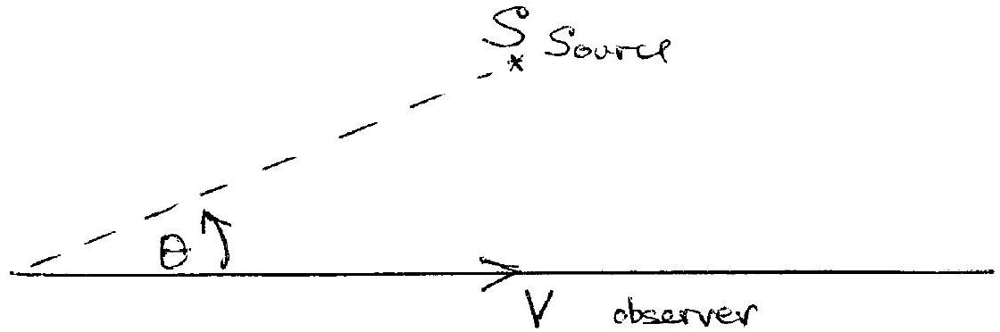
Velocity component in derection of source is $V \cos \theta$. Ther replaces 'v'in (A). As $\theta$ mereases the factor 'reos日' decreases, reducung the value of of in (A). Once the observer has passed the closest (a)

point $k$ source, $S$, the sugar of ' $V$ ' changes in (A), as ha is moving away from the surree, so fcontanies to descase.

Correct explanation for approaching and receing from source.

Correct Explanation

(ii) Forsuall termis approaching source
For darge turis receding frem source

Thus

$$
\begin{equation*}
\frac { 210.4 } { 181.6 } = \frac { c _ { S } + V } { c _ { S } - V } \tag{A}
\end{equation*}
$$

or

$$
\begin{align*}
\frac { V } { C _ { s } } & = \frac { 210 \cdot 4 - 181 \cdot 6 } { 20 \cdot 4 + 181 \cdot 6 }  \tag{\(\square\)}\\
V & = 330 \left( \frac { 28 \cdot 8 } { 392 } \right) = 24 \cdot 24 \mathrm {~ms} ^ { - 1 } \tag{1}
\end{align*}
$$

Substitung $v$ into (D)

$$
\begin{align*}
& f = 210.4 = 330 + 24.24 f _ { 0 } \\
& 330  \tag{1}\\
& f _ { 0 } = \frac { ( 210.4 ) ( 330 ) } { 354.24 } = 196.0 \mathrm {~Hz}
\end{align*}
$$

(iii) At the point of clesest approach to source, time $t _ { 0 }$,

$$
\begin{equation*}
r \cos \theta = 0 \quad \text { и } \cos \theta = 0 \quad \theta = 90 ^ { \circ } \tag{1}
\end{equation*}
$$

Giving

$$
\begin{equation*}
f = f _ { 0 } = 196.0 \mathrm {~Hz} \tag{1}
\end{equation*}
$$

From the graph at $f = 196.0$

$$
\begin{equation*}
t _ { 0 } = 75.5 \pm 1.0 \mathrm {~s} \tag{1+1}
\end{equation*}
$$

[[12]]

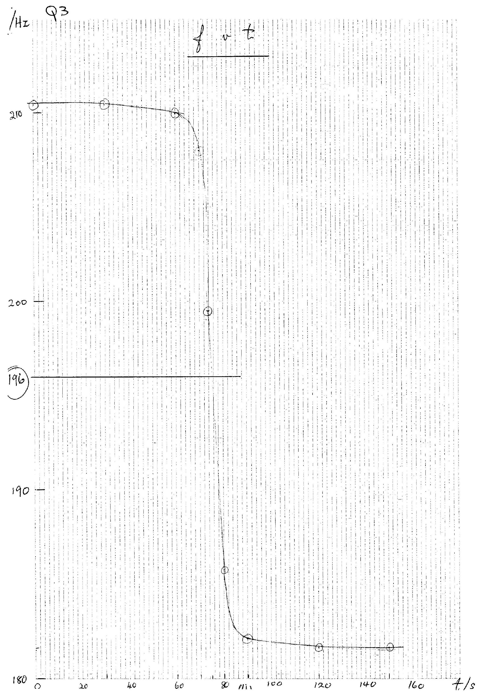

Solution Q4
| hr/mm | d/mm | $d ^ { 3 } / \mathrm { mm } ^ { 3 }$ |
| :--- | :--- | :--- |
| 290 | 1.22 | 1.816 |
| 162 | 1.01 | 1.030 |
| 41 | 0.64 | 0.262 |
| 1.3 |  |  |

Theory correct for suall $h _ { 2 }$ :

$$
3 m g h _ { 2 } = P d ^ { 3 } .
$$

$$
h _ { 2 } = \frac { p } { 3 m g } d ^ { 3 } .
$$

Graph pusses through the origen

| Table of values $h _ { 2 }$ against $d ^ { 3 }$ | [1] |
| :--- | :--- |
| Graph correctly plotted on a reasonable scule | [1] |
| making full use of graph paper. |  |
| Strenght line throngth oregin | [1] |
| Mair deviation fram strenglt luin for $h _ { 2 } = 290$ | [1] |

(ii)

$$
\begin{aligned}
\text { Gradient } \frac { d ^ { 3 } } { h _ { 2 } } & = \left( \frac { 44351 } { 2080 } \right) ^ { - 1 } \mathrm {~mm} ^ { + 2 } \\
& = ( 6.32 \pm 0.2 ) 10 ^ { - 3 } \mathrm {~mm} ^ { 2 } \\
& = ( 6.32 \pm 0.2 ) 10 ^ { - 9 } \mathrm {~m} ^ { 2 } \\
\frac { P } { 3 m g } & = ( 1.58 \pm 0.05 ) 10 ^ { + 8 } \mathrm {~m} ^ { 2 } \\
P & = ( 1.85 \pm 0.05 ) 10 ^ { 7 } \mathrm { Nm } ^ { - 2 }
\end{aligned}
$$

$$
\begin{aligned}
& \frac { p } { 3 m g } = \frac { h _ { 2 } } { d ^ { 3 } } \\
& { } _ { [ 1 ] } + \underset { \text { remale } } { [ 1 ] }
\end{aligned}
$$

(iii) Analysis

$$
\begin{aligned}
\frac { i } { 2 } m v ^ { 2 } & = m g h \\
v ^ { 2 } & = 2 g h
\end{aligned}
$$

Giving

$$
\begin{aligned}
& V _ { A } = \sqrt { 2 g } \left( h _ { 2 } \right) ^ { \frac { 1 } { 2 } } \\
& V _ { I } = \sqrt { 2 g } \left( h _ { 1 } \right) ^ { \frac { 1 } { 2 } }
\end{aligned}
$$

and

$$
\alpha = \left( \frac { h _ { 2 } } { h _ { 1 } } \right) ^ { \frac { 1 } { 2 } }
$$

Sortion
Q4
(iii)

| $h _ { 2 } / \mathrm { mm }$ | h:/mm |  | $\left( h _ { 2 } / h _ { 1 } \right) ^ { 1 / 2 } / m m ^ { \frac { 1 } { 2 } } \left( h _ { 1 } \right) ^ { \frac { 1 } { 2 } } / m m ^ { \frac { 1 } { 2 } }$ |
| :--- | :--- | :--- | :--- |
| 290 | 1000 | 0.538 | 31.6 |
| 162 | 500 | 0.569 | 22.4 |
| 41 | 700 | 0.640 | 10.0 |
| 1.3 | 2.0 | 0.806 | 1.41 |

$$
\left( h _ { 1 } \right) _ { m m } ^ { \frac { 1 } { 2 } } \frac { 1 } { 2 ^ { 2 } }
$$

$$
\left( \frac { h _ { 2 } } { h _ { 1 } } \right) ^ { - \frac { 1 } { 2 } } \checkmark \left( h _ { 1 } \right) ^ { 2 }
$$

Correct Table of values
plot $\left( h _ { 2 } / h _ { 1 } \right) ^ { \frac { 1 } { 2 } }$ against $\left( h _ { 1 } \right) ^ { \frac { 1 } { 2 } }$
Correct graph using major pertion of graph paper.
Smooth enve throngh points
(iv) Thi to fall 900 mm , to, given by

$$
\begin{equation*}
\frac { 900 } { 1000 } = \frac { 1 } { 2 } g t _ { 0 } ^ { 2 } \quad \text { и } \quad t _ { 0 } = \sqrt { \frac { 2 } { g } } \sqrt { \frac { 900 } { 1000 } } \tag{1}
\end{equation*}
$$

Tune $t _ { 1 }$ to rese to maximism height after fust kerence given by

$$
\begin{align*}
& h _ { 2 } = \frac { 1 } { 2 } g t _ { 1 } ^ { 2 }  \tag{A}\\
& 2 t _ { 1 } = 2 \sqrt { \frac { 2 } { g } } \sqrt { h _ { 2 } }
\end{align*}
$$

From $\alpha - \left( h _ { 1 } \right) ^ { \frac { 1 } { 2 } }$ graph
Giving
From (A)

$$
\begin{align*}
\left( \frac { h _ { 2 } } { h _ { 1 } } \right) ^ { \frac { 1 } { 2 } } & = 0.541  \tag{1}\\
h _ { 2 } ^ { \frac { 1 } { 2 } } & = 0.541 \left( h _ { 1 } \right) ^ { \frac { 1 } { 2 } } = 0.541 \sqrt { \frac { 900 } { 1000 } } \\
2 t _ { 1 } & = 2 \sqrt { \frac { 2 } { g } } ( 0.541 ) \sqrt { \frac { 900 } { 1000 } } \tag{1}
\end{align*}
$$

So require tine

$$
\begin{aligned}
t _ { 0 } + 2 t _ { 1 } & = \sqrt { \frac { 2 } { g } \sqrt { \frac { 900 } { 1000 } } [ 1 + 2 ( 0.541 ) ] } \\
& = 0.89 \pm 0.01 \mathrm {~s}
\end{aligned}
$$

(v) Heat, sound, vitration, deformation of auvil (halfmork for each mechanisin upts max.2)

25 (a) Sontion To Q5

(i) $Q _ { 1 } = Q _ { 2 }$
(ii) $V _ { 1 } = \frac { Q _ { 1 } } { C _ { 1 } } \quad V _ { 2 } = \frac { Q _ { 2 } } { C _ { 2 } }$
(iii) $$
\begin{aligned}
E & = V _ { 1 } + V _ { 2 } = Q _ { 1 } \left( \frac { 1 } { C _ { 1 } } + \frac { 1 } { C _ { 2 } } \right) \\
& = \frac { Q _ { 1 } } { C } \\
\therefore \quad \frac { 1 } { C } & = \frac { 1 } { C _ { 1 } } + \frac { 1 } { C _ { 2 } }
\end{aligned}
$$

(iv) Energy

$$
\begin{aligned}
\varepsilon & = \frac { 1 } { 2 } C E ^ { 2 } = \frac { 1 } { 2 } \left( \frac { 1 } { c _ { 1 } } + \frac { 1 } { c _ { 2 } } \right) ^ { - 1 } E ^ { 2 } \\
& = \frac { 1 } { 2 } c \left( \frac { Q _ { 1 } } { c _ { 1 } } \right) ^ { 2 } \\
& = \frac { 1 } { 2 } \frac { Q _ { 1 } } { c _ { 1 } }
\end{aligned}
$$

(b) (i)
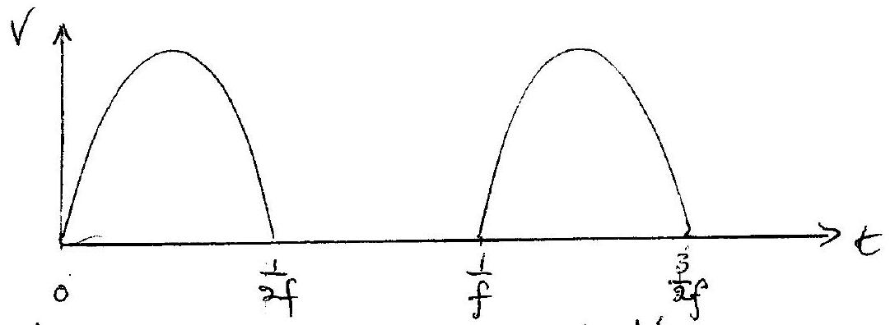
(ii) 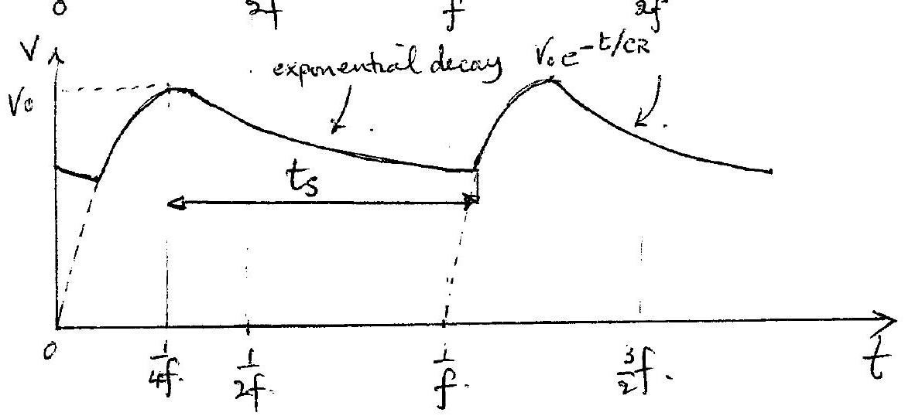 Graph → [2]

Explanation → [1] Exponential decay of vellage across capacitor when diode letminates curnent
(iii)

$$
\begin{aligned}
7.99049 & = 10.0000 e ^ { - t _ { s } / c R } \\
t _ { s } & = - c R \ln ( 0.799049 ) = - \left( 400 \times 10 ^ { - 6 } \right) ( 100 ) \ln ( 0.799049 ) \\
& = - 4 \times 10 ^ { - 2 } \ln ( 0.799049 ) \\
t _ { s } & = 0.00897332 \mathrm {~s}
\end{aligned}
$$

25(6) (iv) In put voltage

$$
\begin{aligned}
V _ { I } & = 10 \sin 2 \pi ( 100 ) \left[ t _ { s } - \frac { 3 } { 4 } \frac { 1 } { f } \right] \\
& = 10 \sin ( 200 \pi ) [ 0.00897332 - 0.0075 ] \\
& = 10 \sin ( 200 \pi ) [ 0.00147332 ] \\
& = 7.990 .
\end{aligned}
$$

(v) Estimates

$$
\begin{align*}
& V _ { d } \simeq \frac { 1 } { 2 } ( 10 + 7.990 ) = 8.995 .  \tag{1}\\
& V _ { a } \approx \frac { 1 } { 2 } ( 10 - 7.990 ) = 1.005 .  \tag{1}\\
& f _ { a } \approx f = 100 \mathrm {~Hz} . \tag{1}
\end{align*}
$$

(a) Eis the unduced emf in volts due to a conductor arthug the magnetic flux fullol. It is equal to its ratiof change of the flux linkage. $\Phi$, in unts of webers per sec.
The menius segu indicates that the unduced current produce by the conductor culting the magnetic field vecates a magnetic flux in the opposite decition tithe external magnetic flux; the current flows in such a direction as to oppose the change that is taking place.
(b) (i)
$$
\begin{align*}
& E = \frac { \left( 6 \times 10 ^ { 5 } \right) ( 80 ) ( 720 ) 10 ^ { 3 } } { 60 \times 60 }  \tag{1}\\
& E = 0.96 \mathrm {~V} \tag{T}
\end{align*}
$$
(ii) ZERO - no flux cut
(iii) $$
\begin{align*}
& E = \frac { \left( 3 \times 10 ^ { - 5 } \right) ( 8 ) ( 720 ) 10 ^ { 3 } } { 60 \times 60 }  \tag{1}\\
& E = 48 \mathrm { mV }
\end{align*}
$$
(iv) Horiż. wing compt. $E _ { w } = \frac { \left( \sin 66 ^ { \circ } \right) ( 80 ) ( 720 ) \times 10 ^ { 3 } \left( 5 \times 10 ^ { - 5 } \right) } { 60 \times 60 }$
$$
\begin{equation*}
E _ { \omega } = 0.72 \mathrm {~V} \tag{1}
\end{equation*}
$$
Verhical component
$$
\begin{aligned}
& E _ { v } = \frac { \left( \cos 66 ^ { \circ } \right) ( 8 ) ( 720 ) \times 10 ^ { 3 } \left( 5 \times 10 ^ { - 5 } \right) \left( \cos 45 ^ { \circ } \right) } { 60 \times 60 } \Leftrightarrow [ 1 ] \\
& E _ { r } = 23 \mathrm { mV }
\end{aligned}
$$

Q6

(i) $\quad V = \frac { 1 } { 2 } B \omega \left( \frac { h } { 2 } \right) ^ { 2 } = \frac { 1 } { 8 } B \omega L ^ { 2 }$
(ii) ZERO
(iii) $$
\begin{align*}
& \frac { 1 } { 2 } B w ( L - x ) ^ { 2 } - \frac { 1 } { 2 } x ^ { 2 } B w  \tag{1+1}\\
& = \frac { 1 } { 2 } B w L ( L - 2 x )
\end{align*}
$$

(i) $$
\begin{aligned}
T & = k R ^ { \alpha } \\
\ln T & = \alpha \ln R + \ln k
\end{aligned}
$$
Plot hu Tagainst huR
graduit $x$, initercept lu $k$

| PLANET | $\mathrm { R } / 10 ^ { 8 } \mathrm {~km}$ | $\ln R$ | T/days | $\ln T$ |
| :--- | :--- | :--- | :--- | :--- |
| EARTH | 1.49 | 0.3920 | 365 | 5.900 |
| MARS | 2.28 | 0.8242 | 687 | 6.532 |
| TUPITER | 7.78 | 2.0516 | 4333 | 8 - 37 |
| URANUS | 28.7 | 3.357 | 30690 | i0.33 |

Correct Coraph
Gradient $\alpha = \frac { 7.60 } { 5.00 } = 1.52$
approx
ACCURACY

$$
\pm 0.07
$$

(ii) When $\ln R = 0$

$$
\ln T = \ln k \quad \text { is } k = ( T ) _ { R = 0 }
$$

From graph

$$
\begin{aligned}
\ln k & = 5.4 \pm 0.1 \\
k & = 221 \pm 25
\end{aligned}
$$

In \$1 wilts

$$
\operatorname { days } / \left( 10 ^ { 8 } \mathrm {~km} \right) \sqrt [ 3 / 2 ] { } [ 1 ]
$$

Dimension's [1]

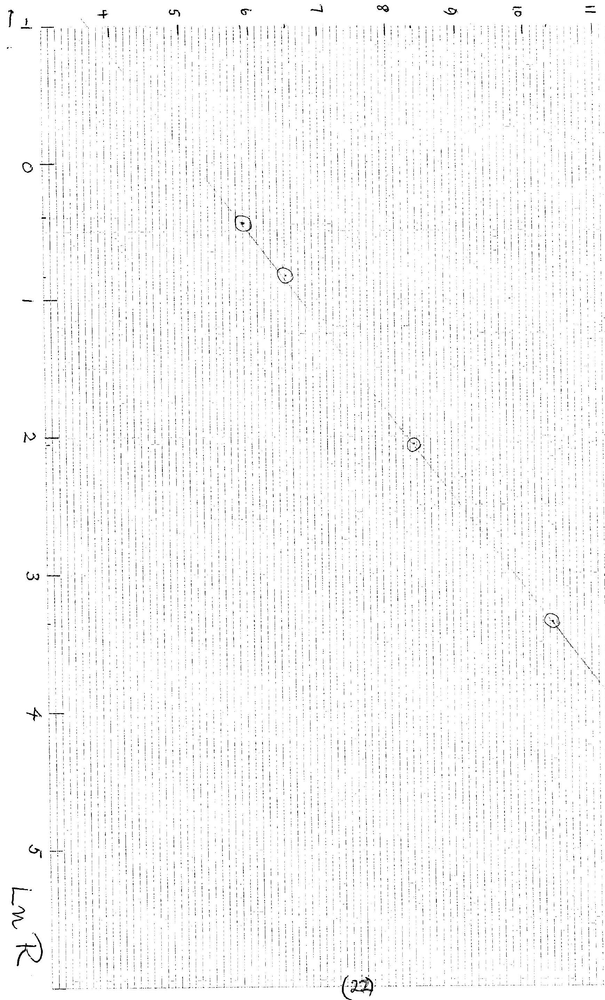

Q7 (b)

(i) Equation for circular motion for planet of mass mang.vel. w
$$
\begin{aligned}
m R \omega ^ { 2 } & = \frac { G M _ { s } m } { R ^ { 2 } } \\
R ^ { 3 } & = G M _ { s } \left( \frac { T } { 2 \pi } \right) ^ { 2 } \\
T ^ { 2 } & = \frac { ( 2 \pi ) ^ { 2 } } { G M _ { s } } R ^ { 3 } \\
T & = \frac { 2 \pi } { \sqrt { G M _ { s } } } R ^ { 3 / 2 }
\end{aligned}
$$
$$
\begin{array} { r }
{ [ 1 ] } \\
T = 2 \pi / \omega [ 1 ] \\
{ [ 1 ] }
\end{array}
$$

(ii) Determination of $\mathrm { M } _ { s }$
As pouits all lie on a straight hire to within accuracy of the graph, one can use any set of data to debrumin $M _ { S }$.
Mars Data Gives using

$$
\begin{align*}
T ^ { 2 } & = \frac { ( 2 \pi ) ^ { 2 } } { G M _ { s } } R ^ { 3 } \\
M _ { s } & = \frac { ( 2 \pi ) ^ { 2 } } { G } \frac { R ^ { 3 } } { T ^ { 2 } }  \tag{1}\\
& = \frac { ( 2 \pi ) ^ { 2 } } { 6.67 \times 10 ^ { - 11 } ( 6.87 \times 24 \times 60 \times 60 ) ^ { 2 } }  \tag{1}\\
M _ { s } & = ( 1.98 \pm 0.08 ) 10 ^ { 30 } \mathrm {~kg} \tag{1}
\end{align*}
$$

All the other planets' data give same result
Anternativeny oseng $k = \frac { 2 \pi } { \sqrt { \text { G M } _ { 3 } } } = 6.0 \times 10 ^ { - 10 }$ fram pant (a) $\} [ 3 ]$ gives same resvlt bot less accurate

(iii) Now
and
$$
\left. \begin{array} { l }
T _ { \text {moon } } ^ { 2 } = \frac { ( 2 \pi ) ^ { 2 } } { G M _ { E } } R _ { \text {Moon } } ^ { 3 } \\
T _ { E } ^ { 2 } = \frac { ( 2 \pi ) ^ { 2 } } { G M _ { S } } R _ { E } ^ { 3 } \tag{1}
\end{array} \right\}
$$
Thus
[1]

$$
\begin{align*}
\frac { M _ { S } } { M _ { E } } & = \left( \frac { 1.49 \times 10 ^ { 8 } } { 3.8 \times 10 ^ { 5 } } \right) ^ { 3 } \left( \frac { 27.3 } { 365 } \right) ^ { 2 }  \tag{1}\\
& = 3.4 \times 10 ^ { 5 } \pm 0.2 \times 10 ^ { 5 } . \tag{1}
\end{align*}
$$
